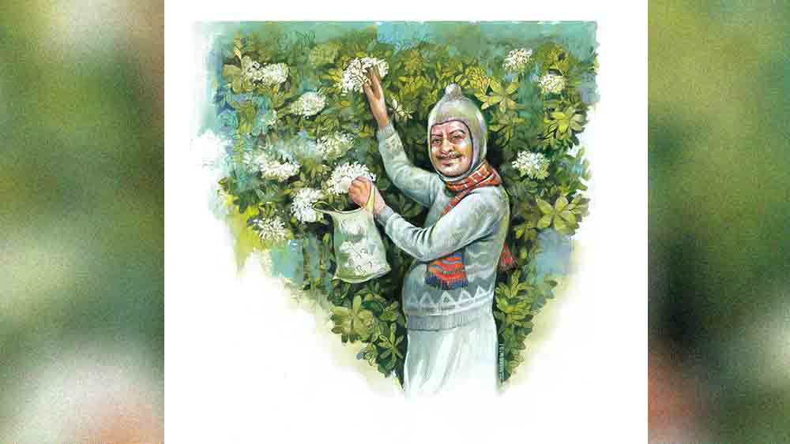

 

<h1 align=center>টগরপাতি</h1>
<h2 align=center>শেখর মুখোপাধ্যায়</h2>
ভোর চারটে। অ্যালার্ম বাজে। চার পাশে এখনও রাতের অন্ধকার। দয়াল বিছানা থেকে ওঠে। স্ত্রী গজরায়, “কী পাগলামো রোজ!” দয়াল জবাব দেয় না। হাত-মুখ ধোয়। হাড়ে কাঁপুনি ধরায় ঠান্ডা জল। ডিসেম্বর মাস। দয়াল সোয়েটার গায়ে দেয়, গলায় মাফলার, মাথায় হনুমান টুপি। পকেটে প্লাস্টিকের ব্যাগ। মোজা পরে, জুতোয় পা গলায়। হাঁটতে হাঁটতে পৌঁছয় রাস্তার মোড়ে। কুকুরগুলো ডেকে উঠেই চুপ করে যায়। দয়ালকে চেনে। রামলোচনের চায়ের দোকানে বেঞ্চিতে বসে বেণি-মদন ঘুমচোখে পিটপিটিয়ে চায়। স্বগতোক্তি করে, “শালা বুড়ো!” দয়ালের বয়স তিয়াত্তর।   মোড় থেকে পূর্বে কয়েক পা গিয়েই রাস্তার বাঁ-পাশে পাতিটগরের ঝোপ। চোখে লোভ ঝিলিক দিয়ে ওঠে। গাছ ভরে আছে সারি সারি ফুলে। যেন এখনই ডানা মেলে বকের পাতির মতো আকাশে উড়ে যাবে টগরপাতি! দয়াল হাত বাড়ায়। সমস্ত নিয়ে নিতে হবে। সবুজ গাছে শিশিরভেজা সতেজ সাদা ফুল! পান্নার বুকে মুক্তোর মতো বিছিয়ে আছে। রত্ন একটিও রাখা যাবে না আর কারও জন্যে।   মোড়ের মাথায় মৃদু কথোপকথন এবং ধীরে আগুয়ান পায়ের শব্দ শুনে ঘুরে তাকায় দয়াল। পরক্ষণেই টগর-ঝোপের দিকে ফিরে চায়। কয়েকটা ফুল ইতিউতি রয়ে গেছে এখনও। কিন্তু আর দাঁড়ালে চলে না। দয়াল দ্রুত পায়ে রাস্তা পেরোয়। ল্যাম্পপোস্টের পিছনে ঝাঁকড়া নিম গাছের আড়ালে লুকোয়।   পা টেনে টেনে হাঁটে জয়া, পিছনে লাঠিতে ভর দিয়ে খুঁড়িয়ে কল্পনা। কুকুরগুলো আবারও ভুক করেই চুপ করে। মদন আধখোলা চোখে বলে, “লাও, বুড়িরা হাজির!”   জয়া আশি ছুঁই-ছুঁই, কল্পনা এক-আধ বছরের ছোট। দু’জনে টগর-ঝোপের সামনে দাঁড়িয়ে দীর্ঘশ্বাস ফেলে, “আজও সব মুড়িয়ে নিয়ে গেছে রে!” কাতরোক্তি করে জয়া।   কল্পনা বলে, “ক’টা এখনও আছে।” সে লাঠি বাগিয়ে ঝোপের ভিতরের ডালগুলি টেনে সামনে নামাতে চেষ্টা করে। জয়া নাগালের মধ্যের ফুলগুলি তুলে হাতের প্যাকেটে রাখে। দু’জনেই উঁকিঝুঁকি দিয়ে খোঁজে যদি আরও এক-আধটা ফুল কোথাও থেকে থাকে।   দয়াল আড়াল থেকে দেখে আর ফিকফিকিয়ে হাসে। মদন হাই তুলে বলে, “ফাজিল বুড়ো!”   জয়া আর কল্পনা ফিরে যায়। মদন বলে, “কী দিদারা, আজও পেলে না?”   জয়া আক্ষেপ করে, “পেলাম আর কই! তা ভাই, তুই সারা রাত থাকিস এখানে, আমাদের জন্যে তুলে রাখলেও তো পারিস!”   কল্পনা জয়ার হাত চেপে ধরে ফিসফিসিয়ে বলে, “দিদি! কী অজাত-কুজাত! মদোমাতাল, তার হাতের…”   মদনকে বিরস শোনায়, “হ্যাঁ, খেয়েদেয়ে কাজ নেই, লোকের জন্যে ফুল তুলে রাখব!”   কিছু পরে দয়াল গাছের আড়াল থেকে বেরোয়। মোড়ের মাথায় পৌঁছতে, মদন বলে ওঠে, “কী দাদু, আজও সব একাই লিয়ে লিলে!” দয়াল গম্ভীর মুখে এক বার মদনকে দেখে বাঁয়ে গলিতে ঢুকে যায়। মদন চাপাস্বরে গালি দেয়, “ত্যাঁদড় বুড়ো!”   দয়াল বাড়ি ফিরে ঠাকুরঘরে বসে মন্ত্র পড়ে, ফুল দেয়। শালগ্রাম শিলা চাপা পড়ে সাদা ফুলের স্তূপে। জয়া ও কল্পনা তাদের সংগৃহীত ফুলগুলি ভাগাভাগি করে নেয়। নিজের নিজের বাড়ির ঠাকুরের ছবির সামনে ভক্তিভরে নিবেদন করে।   গাছ ভরে টগর ফুল ফোটে বছরভর। ফুল নিয়ে এই লুকোচুরি খেলাও চলে সারা বছর।   গলিপথ, নাম বিবেকানন্দ রোড। মিশেছে একটু বড় একটা রাস্তায়, রথীন সরকার রোডে। সরকাররা ছিল এলাকার বনেদি বড়মানুষ। তাদের অনেক বাড়িই চোখে পড়ে এলাকায়। তুলনায় নতুন একটি বাড়ি দাঁড়িয়ে আছে দক্ষিণ থেকে আসা বিবেকানন্দ রোড আর পূর্বে-পশ্চিমে ধাবমান রথীন সরকার রোডের মোড়ে। মোড়ের দক্ষিণ-পূর্ব কোণে কয়েক বিঘা জায়গার এক পাশে তিন তলা বাড়িটির বয়স প্রায় একশো বছর। জায়গাটা পাঁচিলে ঘেরা। জং-ধরা বড় লোহার গেটটা খোলে রথীন সরকার রোডে। ভিতরে, বাড়ির সামনে ফুল গাছের ঝাড়, বাকি জায়গাটায় একটা বড় পুকুর, তার চার পাশে আকাশ চেয়ে দাঁড়িয়ে আছে অজস্র মহীরুহ, লতানে গাছ আর গুল্মের ঝোপ। গোটা জায়গাটাই জঙ্গুলে। নানা জাতের পাখি, সাপ, ব্যাঙ, বেজি আর ভামের বাস। বাড়ি সারাই বহু বছর হয়নি। কসবা অঞ্চলে এমন কয়েক টুকরো আদিম উদাসীন পৃথিবী এখনও রয়ে গেছে। গড়িয়াহাটের মোড় থেকে গোলপার্ক, ঢাকুরিয়া, যাদবপুর হয়ে দক্ষিণে শহর বহু কাল ধরে নিবিড় জনঘনত্বে এগিয়ে গেলেও, বালিগঞ্জের রেল লাইন পেরিয়ে এবং পরে তার উপরে বিজন সেতু বরাবর পূর্বে মহানগরীর উন্নয়নের দৌড় শুরু হয়েছে বেশ দেরিতে। তবে, সেই অতীত বিলম্ব বর্তমান অগ্রগতির দ্রুততায় পুষিয়ে নেওয়ার চেষ্টায় খামতি নেই।   বিবেকানন্দ রোডের পূর্বে সরকারদের বাড়ি। রাস্তার অন্য পারে, পশ্চিমে, সরকারদেরই এক চিলতে বেদখল জমিতে একটি বস্তি। ঘুপচি ঝুপড়িগুলিতে পনেরো-ষোলোটি পরিবারের গাদাগাদি বাস। বস্তির গা-ঘেঁষে, মোড়ের দক্ষিণ-পশ্চিম কোণে বছর বিশ হল একটি শিবলিঙ্গ প্রতিষ্ঠিত হয়েছে। কেউ বলে, লিঙ্গটা মাটি ফুঁড়ে উঠেছিল, কেউ বলে রাতের অন্ধকারে বসানো হয়েছিল। কারা বসিয়েছিল কেউ জানে না। শুরুতে মন্দির ছিল না। এখন হয়েছে। কিছু কাল হল, শিবের পাশে শনিও অবস্থান করছেন। নিয়মিত পুজোআচ্চা হয়, বিশেষ বিশেষ তিথিতে বিশেষ করে। তখন রাত বাড়লে ভক্তদের পদচারণা, আচরণ, বচন, বাচনভঙ্গি সমস্তই বেসামাল দেখায়। মন্দির ক্রমশ উঁচু হচ্ছে এবং লম্বায় রথীন সরকার রোড বরাবর পশ্চিমে বাড়ছে। ইট-সিমেন্টের দেহে মার্বেলের জামা পরানো চলছে। স্থানীয় রাজনৈতিক নেতা পৃষ্ঠপোষক। সিন্ডিকেটের দাদারা নির্মাণের প্রয়োজনীয় মালমশলার জোগান দিয়ে থাকে। মন্দিরের মালিক কে, বলা শক্ত। একটি প্রণামীর বাক্স রাখা আছে। শোনা যায় সেখানে সংগৃহীত অর্থ জনাকয় যুবকের মধ্যে ভাগাভাগি হয়। বেণি-মদন তাদের এক জন। লম্বা চুল রাখে, বেণি বাঁধে বলে ওই নাম। মদন দিনে ঘুমোয়, রাতে জাগে। সে নাকি মন্দিরের পাহারাদার। পাড়ার কুকুরগুলো তার নেওটা। মদনের সঙ্গে মিলও আছে তাদের। তারা যেমন দরকারে দাঁত বার করে, মদনও পারে জামার আড়াল থেকে বার করতে কোমরে গোঁজা ভোজালি। মন্দিরের কোনাকুনি উল্টো দিকে, রথীন সরকার রোডের উত্তর পারে, মোড়ের উত্তর-পূর্ব কোণে, রামলোচনের চায়ের দোকান। রাতে দোকানের সামনে বেঞ্চিতে বসে মন্দিরে নজর রাখে বেণি-মদন, চার পাশে তার কুত্তার পাল।   মোড় থেকে দক্ষিণে, বিবেকানন্দ রোডের শুরুতে দয়ালের বাড়ি। সে আর তার বৌয়ের পড়ন্ত বেলার সংসার। মেয়ের বিয়ে হয়ে গিয়েছে। ছেলে চাকরি করে বেঙ্গালুরুতে। জয়া আর কল্পনা দয়ালের প্রতিবেশী। দু’জনেই বিধবা। তাদের সন্তানরাও প্রবাসী। জয়ার সঙ্গে থাকে তার সম্পর্কে এক নাতি, কলকাতার কোন কলেজে পড়ে। কল্পনা একাই থাকে।   সরকারবাড়ি জমি-সহ বিক্রি হয়ে গেল। সেখানে উঠবে বহুতল কয়েকটি টাওয়ার। প্রোমোটার সেই আনন্দে পাড়ার ছেলেদের ফিস্টের টাকা দিল। পান ও ভোজন এবং ভোজনের পর আবার পানের মাত্রাটা কিঞ্চিৎ বেশি হয়েছিল মদনের। মধ্যরাতে আসর ভাঙার পর নির্জন রাস্তায় বাকি রাত একাই মাতলামো করে বেড়াল। কুকুরগুলো ভয়েই বোধহয়, দূর থেকে বাওয়ালি দেখছিল। মদন ভকভকিয়ে রাস্তায় বমি করল। তু-তু করে ডাকল কুকুরগুলোকে। সাহস পেয়ে একে একে কাছে এসে, কুকুরগুলো বমি চেটেপুটে সাফ করে ফেলল। মদনকে ঘিরে তাদের সে কী লেজ নাচানো আহ্লাদ! তখনই রাস্তার মোড়ে উদয় হল দয়াল। মদন আর কুকুরের পালকে পাশ কাটিয়ে টগর গাছের সামনে দাঁড়াতেই মদন তর্জন করে উঠল, “শালা বুড়ো, গাছে হাত দেবে না! খবরদার বলছি, পোকিতির কোলে গাছে ফুল ফুটে আছে আর তুমি শালা রোজ তাকে ন্যাংটো করে সব তুলে নাও! ভাগো শালা!” মদন জামা তুলে ভোজালি দেখায়। বলা বাহুল্য, বক্তব্যের মধ্যে মধ্যে বাছাই কাঁচা খিস্তিও মিশ্রিত ছিল। দয়াল বেগতিক বুঝে পিঠটান দেয়। যেতে যেতে তাকায় সরকার বাড়ির দিকে। গেটের ফাঁক দিয়ে চোখে পড়ে সেখানেও এক ঝাঁকড়া টগর গাছ ভরে আছে ফুলে। এগুলি কেউ তোলে না। রোজ এমনই ঝরে যায়।   কিছু পরেই এসে পড়ে জয়া আর কল্পনা। বেণি-মদন স্বগতোক্তি করে, “লাও! একজনা গেল তো এল আরও দু’জনা। মেয়েমানুষ, কিছু বলার নাই।” ক্লান্ত মদন হাল ছেড়ে চিত হয়ে শুয়ে পড়ে রামলোচনের দোকানের বেঞ্চিতে। কুকুরগুলো বেঞ্চির চার পাশে ঘনিয়ে বসে।   জয়া আর কল্পনার খুশি আজ ধরে না। মনের সুখে ঝোলা বোঝাই করে ফুলে। সানন্দ আলাপচারিতায় মুখর হয়ে বাড়ির পথ ধরে। মদন এ সব কিছুই দেখে না। তার নাক তখন সগর্জন দুর্বোধ্য বক্তব্য রাখছে দুনিয়ার কাছে। কুকুরগুলো অগত্যা ঝিমোয়।   পরদিন অবশ্য দয়াল কোনও বাধার মুখোমুখি হয় না। গাছ মুড়িয়ে ফুল তুলে নিয়ে যায়। দেরিতে আসা জয়া, কল্পনা হতাশ হয় পাঁচটা স্বাভাবিক দিনের মতোই। তাদের হতাশায় স্ফূর্তির পাত্র উপচে পড়ে দয়ালের। দিনের পর দিন। দয়াল ফুল তোলে আর দেখে সরকারবাড়িতে ঢুকেছে বুলডোজার, এক্সক্যাভেটর, ডাম্পার। বাড়ি গুঁড়িয়ে যায়। পুকুর ভরাট হয়। গাছপালা সাফ। পাখি, সাপ, ব্যাঙ, বেজি, ভাম... বেঘর জীবেরা ছোটাছুটি করে মারা পড়ে খোলা রাস্তায়। ক’টা দিন সে কী নরককুণ্ড পাড়া!   এক দিন, দয়ালের হাতের প্যাকেট ফুলে ভরে ওঠে। মোড়ের মাথায় ওঠে না পায়ের শব্দ, শোনা যায় না দুই বৃদ্ধার আগুয়ান কলকলানি। সময় বয়ে যায়। বুড়িরা আসে না। দয়াল বাড়িমুখো হয়। দেখে কল্পনার বাড়ির সামনে দাঁড়িয়ে জয়া। কল্পনাকে ডাকাডাকি করছে। দয়াল মুচকি হাসে। ঘরে ঢোকে। তার শালগ্রাম শিলা চাপা পড়ে ফুলের পাহাড়ে। কিছু ক্ষণ পরেই পাড়ায় কান্নার রোল ওঠে। বাড়ির দরজা ভেঙে কল্পনাকে পাওয়া গিয়েছে মৃত।   পরদিন দয়াল যথারীতি যায় ফুল তুলতে। ফুল তোলে। অপেক্ষা করে। কেউ আসে না। আশ্চর্য! এক বুড়ি না হয় মরেছে, অন্য জন তো আছে। বাড়ি ফিরে পুজোয় মন বসে না। দিনের পর দিন যায়। তেরো দিন হয়ে গেছে, গুনে গুনে দেখেছে দয়াল। অশৌচ কত দিন চলে! নিজের লোকও তো ওরা কেউ কারও নয়! ফুল তুলতে তুলতে ভাবে দয়াল। জেদের বশে গাছ নিষ্পুষ্প করে ছাড়ে। উত্তেজনায়, ক্রোধে অধীর দেখায় মুখ-চোখ। হঠাৎ, ছুড়ে ফেলে দেয় ফুলভর্তি প্যাকেট। পরমুহূর্তেই ছুটে যায়। এ দিক-ও দিক তাকিয়ে কয়েকটি টগর ফুল আলগোছে তুলে নিয়ে দ্রুত পা চালায়। পুজোয় মন বসে না। অন্যমনস্ক হয়ে নারায়ণ শিলায় ফুল দেয়, মন্ত্রে ভুল হয়ে যায়, মুহুর্মুহু ভগবানের কাছে ক্ষমা চায়। সারা দিনের অস্থিরতার পর শেষবিকেলে জয়ার বাড়ি যায়। এ কথা-সে কথার পর বলে, “দিদি, ফুল তুলতে যাও না কেন?”   কয়েক মুহূর্তের নৈঃশব্দ্যের পর জয়া বলে, “কার সঙ্গে যাব, ভাই?”   মুখে আঁচল চাপে, “কল্পনা ছিল… একা ইচ্ছে করে না।”   “তাই হয়!” দয়াল বলে, “ঠাকুরকে ফুল দেবে না! আচ্ছা, আমি এনে দেব।”   পরদিন ফুল তুলতে গিয়েও মন লাগে না দয়ালের। ফুল তুলে আনে। জয়াকে দেয়। তবু যেন মন ভরে না। ক’দিন পরে বলে, “দিদি, ঠিকই বলেছ, একা যেতে ভাল লাগে না। তুমিও চলো কাল থেকে। ভাই-বোন এক সঙ্গে যাব।”   “এক সঙ্গে? আচ্ছা, দেখি, রোজই তো বয়স বাড়ছে!”   “না না, যেতেই হবে।”   জয়া বলে, “তুমি তো ভাই আগে একাই যেতে।”   “না,” দয়াল মুখ নামিয়ে বলে, “আমি একটু আগে যেতাম, তোমরা তার একটু পরে। কিন্তু...” দয়াল মুখ তুলে করুণ চোখে চায়, “একলা কখনও নয়।”   পরদিন এক সঙ্গে বেরোয় দু’জনে। দয়াল সোৎসাহ ফুল তুলতে শুরু করে। জয়া স্তব্ধ দাঁড়িয়ে থাকে। ব্যাপার খেয়াল হতে দয়াল ফুল তোলা বন্ধ করে বলে, “কী হল, দিদি?”   “না।”   দয়াল অবাক হয়, “কেন, দিদি! ঠাকুরকে ফুল দেবে না?”   “না। সময় হলে ঠাকুর নিজেই টেনে নেয়! মরা ফুল কি তাকে দেওয়া যায়!” জয়া মাথা নাড়ে, “কল্পনা এমনই ঝরে গেছে, আমরাও এক দিন… ফুলগুলোর মতোই… থাক।” জয়া ঘুরে খুঁড়িয়ে হাঁটতে শুরু করে। দয়াল হাতের ব্যাগ দেখে। দশ-বারোটা জমেছে। নিষ্প্রাণ ফুল। গাছের দিকে চায়। জীবন্ত ফুলগুলিকে হন্তব্য ছাগের মতো নতমুখ দেখায়। দীর্ঘশ্বাস পড়ে দয়ালের। সে হাতের প্যাকেট ছুড়ে ফেলে দেয়। ঘুরে অনুসরণ করে জয়াকে।   দেখেশুনে অবাক বেণি-মদন। পায়ে পায়ে গিয়ে দাঁড়ায় টগর গাছের সামনে। ঝাঁকড়া গাছ নিঃশব্দে হাসে সাদা ফুলের পাপড়ি মেলে। হা-হা হাসিতে চার পাশ ভরিয়ে এক পায়ে চরকিপাক খায় মদন। তাকে দেখে কুকুরগুলো গলা ছেড়ে সমস্বর ডেকে ওঠে। আশপাশের কয়েকটা জানলা খুলে যায়। জোড়া জোড়া কৌতূহলী চোখ দেখে, সাতসকালে পথের পাশে এক প্রাণবন্ত পান্না-শরীরে উজ্জ্বল মুক্তোর সাজে উৎসবমুখর জীবন।
