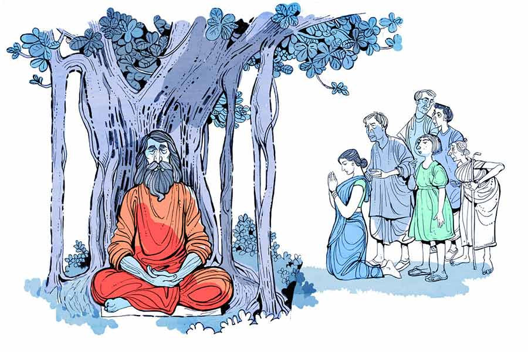

 
 <h1 align=center>টান</h1>
<h2 align=center>কৃষ্ণেন্দু বন্দ্যোপাধ্যায়</h2> 

মনসা জল আনতে গিয়েছিল দাসেদের পুকুরে। ফেরার সময় প্রায় হাঁপাতে হাঁপাতে খবরটা নিয়ে এল। প্রথমে রাস্তায় সিদ্ধেশ্বর খুড়ো, তার পর মদনা, সেখান থেকে দামোদর মুদির দোকান, আর এই ভাবে আধঘণ্টার মধ্যে সারা গ্রামে বিদ্যুতের বেগে খবরটা রাষ্ট্র হয়ে গেল যে, ঠাকুরবাড়ির পিছনের বুড়ো বটতলায় এক সন্নিসিঠাকুর এসে আস্তানা গেড়েছেন।

খবরটা শোনার পর প্রথম ঝটকায় যা হল, তাকে বলে জগাখিচুড়ি প্রতিক্রিয়া। কেউ অবাক হল, কেউ বেশ ভক্তিভরে দু’হাত জড়ো করে পেন্নাম ঠুকল, আবার কেউ ভাবল— এ বার তা হলে হাত দেখিয়ে ভবিষ্যৎ জানার মতো এক জনকে পাওয়া গেল। দামোদরের দোকানে তখন যে ক’জন খদ্দের ছিল, তার মধ্যে পরেশ আর দিনু তো তখনই রওনা দিয়ে দিল সন্ন্যাসীকে চাক্ষুষ করতে। কেবল থুত্থুরে সদুঠাকুমা রাস্তায় ঘুরছিল রোজকার মতো, সে ঘাড় উঁচিয়ে কথাটা শুনে মুখঝামটা দিয়ে বলে উঠল, “অ্যাই মরেচে! আবার কোত্থেকে একটা ঠগ-জোচ্চোর এসে জুটল!” বলে লাঠি ঠকঠক করতে করতে হাঁটা দিল সামন্তদের বাড়ির দিকে। হয়তো চটপট সামন্তগিন্নিকে সাবধান করতেই গেল, কারণ গোটা গ্রামে এক ওই সামন্তগিন্নির সঙ্গেই সদুঠাকুমার যা কিছু দোস্তি। বৌটা বড় ভাল। সদুঠাকুমার উপর একটুও বিরক্ত হয় না, মাঝে মাঝে আবার এটা-ওটা খেতেও দেয়।

এই ফাগুনতলি গ্রামে ঠাকুরবাড়ি মানে আসলে পুজোর দালানবাড়ি। গ্রামের পশ্চিম প্রান্তে একটা পাঁচিলঘেরা জায়গার মধ্যে বেশ বড় একটা ঠাকুরদালান, যেখানে প্রতি বছর গ্রামের দুর্গাপুজোটা হয়। সেই কোন কালে এই ঠাকুরবাড়িটা বানিয়ে দিয়ে পুজো চালু করে গিয়েছিলেন জমিদার চিন্তাহরণ চাটুজ্জে। তার পর তাঁর ছেলেপুলে-বংশধররা আরও প্রায় পাঁচ পুরুষ ধরে সেটা একই ভাবে চালিয়ে গেছে। তার পর তো জমিদারি প্রথা উঠেই গেল। কিন্তু এখনও পুজোর অধিকাংশ ব্যয়ভার বহন করেন ওই চাটুজ্জেবাড়ির লোকেরাই। বাকিটা গাঁয়ের সবাই মিলে চাঁদা তুলে পুজোর খরচ হিসেবে দেয়।

এই ঠাকুরবাড়ির ঠিক পিছনেই রয়েছে ওই বটগাছটা। সে যে কত আদ্যিকালের গাছ, তার হিসেব বোধহয় সদুঠাকুমাও দিতে পারবে না। মস্ত উঁচু, ঝাঁকড়া বটগাছটার গুঁড়িটাই প্রায় তিনটে মানুষের সমান। আর তার তলাটা সিমেন্ট দিয়ে বাঁধানো, সেও যে কত দিন আগে তার ঠিক নেই। এখন সেই সিমেন্ট ফেটে জায়গায় জায়গায় শেকড় বেরিয়ে পড়েছে।

শোনা গেল, এই নতুন সন্ন্যাসী নাকি সেই বুড়ো বটের তলাতেই আশ্রয় নিয়েছেন। মাথায় ঝাঁকড়া চুল, মুখে মস্ত দাড়িগোঁফ, পরনে গেরুয়া রঙের ধুতি আর পাঞ্জাবি, আর সঙ্গে শুধু একটা কাপড়ের ঝোলা আর হাঁড়িকাঠের মতো একটা লাঠি। তবে সন্ন্যাসী একাই, তাঁর সঙ্গে কেউ নেই। তিনি একাই এসে তাঁর সংসার পেতে বসেছেন ওই সিমেন্ট-বাঁধানো চত্বরে।

লোকের কৌতূহল এমনিতেই একটু বেশি, বিশেষ করে এই গ্রামেগঞ্জে তো আরও বেশি। এক জন-দু’জন করে ধীরে ধীরে বেশ কিছু লোক গিয়ে হাজির হল বুড়ো বটের কাছে। যা শোনা গিয়েছিল তা ঠিকই। এক সন্ন্যাসী সত্যিই এসে হাজির হয়েছে এই ফাগুনতলি গ্রামে। আর তাকে দেখলে খুব একটা রগচটা বলেও তো মনে হচ্ছে না। বরং একটু যেন উদাস ভাব চোখেমুখে।

দেখে লোকজন একটু সাহস পেল। একে একে পরেশ, দিনু, ভবকাকা, এ রকম দু’-চার জন একটু উসখুস করতে করতে কথা বলার চেষ্টা করল সন্ন্যাসীর সঙ্গে। কিন্তু সন্ন্যাসী একদম চুপচাপ। মৌনীবাবা হয়ে বসে রয়েছেন পাশে দাঁড় করানো লাঠিটার উপর হাত রেখে। মাঝে মাঝে এক বার করে নিমীলিত চোখ দুটো খুলে তাকাচ্ছেন, পরক্ষণেই আবার বুজিয়ে ফেলছেন। কোনও কথা বলছেন না।

এ দিকে সন্ধে নামতে বিশেষ দেরি নেই। পশ্চিমের সোনাখালের ও পারে বাঁশঝাড়ের উপর দিয়ে সূর্যের গোল্লার আদ্ধেকটা দেখা যাচ্ছে। হাতের কাজ ফেলে যারা দৌড়ে এসেছিল, কেউ মজা দেখতে, কেউ নিছক কৌতূহলে, তাদের উৎসাহে ক্রমেই ভাটা পড়তে থাকল। খানিক ক্ষণ নিজেদের মধ্যে হতাশ স্বরে কী সব আলোচনা করতে করতে তারা এক এক করে সরে পড়তে শুরু করল।

ঠিক সেই সময় হঠাৎ যেন সন্ন্যাসীর ধ্যানভঙ্গ হল। তিনি বড় করে একটা নিঃশ্বাস ফেলে আচমকা চোখ মেলে চাইলেন, তার পর এ দিক-ও দিক দেখে জোরগলায় বলে উঠলেন, “জয় শিবশম্ভু।”

সঙ্গে সঙ্গে যেন সাড়া পড়ে গেল চার পাশে। বয়স্ক লোকগুলো এক সঙ্গে দু’হাত জড়ো করে কপালে ঠেকিয়ে প্রণাম করতে শুরু করে দিল। কেউ কেউ জয়ধ্বনি দিয়ে উঠল, “জয় সন্ন্যাসীঠাকুরের জয়।” আর যারা চলে যাচ্ছিল, তারাও হুড়মুড় করেফিরে আসতে আসতে চেঁচাল, “ওরে বাবা জেগেছেন! বাবা জেগেছেন!”

সকলে মিলে আবার হামলে পড়ল বুড়ো বটের চার দিকে। সকলেই সন্ন্যাসীর কাছে আসতে চায়, কিছু জিজ্ঞেস করতে চায়। সন্ন্যাসী দু’হাত তুলে সবাইকে চুপ করতেবললেন। আস্তে আস্তে কোলাহল শান্ত হয়ে এল।

সবাই চুপচাপ হয়ে যেতে তিনি বললেন, “আজ কোনও কথা নয়। আজ তোরা বাড়ি যা। কালআসিস। তোদের সঙ্গে কাল কথা বলব, কেমন?”

দিনু বলে উঠল, “সে কী বাবা ? আমরা যে কত আশা নিয়ে আপনার কাছে এলাম!”

সন্ন্যাসী দিনুর দিকে তাকালেন। মুখে মৃদু হাসির রেখা ফুটিয়ে বললেন, “তাতে কী হয়েছে? আজকের আশা কালই না হয় পূর্ণ হবে! ওই সূর্যটাকে দেখ! ও তো এখন চলে যাচ্ছে, তা বলে কি ও ভেঙে পড়েছে? মোটেই না। ও জানে, আবার কাল ওআসবে। ওর মতো তোরাও মনটাকে বাঁধ। যা পালা।”

“জয় ঠাকুর, জয় ঠাকুর,” বলতে বলতে সন্ন্যাসীকে প্রণাম করে উঠে দাঁড়াল দিনু। সেই সঙ্গে সমবেত লোকগুলোর গলা থেকেও বেরিয়ে এল জয়ধ্বনি। সন্ন্যাসী ওদের মন জয় করে নিয়েছেন।

কিছু ক্ষণের মধ্যেই জায়গাটা ফাঁকা হয়ে এল। বুড়ো বটের ডালে ডালে ঘরে ফেরা পাখির ডাক, বাঁশঝাড়ের দিক থেকে আসা একটা মনকেমন হাওয়া আর গ্রামের দিক থেকে ভেসে আসা শাঁখের শব্দ, সব কিছু যেন মিলেমিশে গেল সন্ধের আলোছায়ার সঙ্গে।

এর পর দেখতে দেখতে আরও ক’টা দিন কেটে গেছে। গ্রামের নিস্তরঙ্গ জীবনযাত্রা প্রায় একই খাতে বইছে, তবে সন্ন্যাসীর হঠাৎ আগমনে গ্রামে যে আলোড়ন উঠেছিল, তার রেশ এখনও ফুরিয়ে যায়নি। কারণ সন্ন্যাসী এখনও বহাল তবিয়তেই আছেন। গ্রামের লোকেরা রোজই আসে, নানা প্রশ্ন করে, তিনিও তার উত্তর দিয়ে তাদের খুশি করেন। এমনকি নিয়ম করে দু’বেলা তাঁর শাকান্নের ব্যবস্থাও হয়েছে, গ্রামের লোকেরাই পালা করে সে ব্যবস্থা করেছে। শুধু সন্ন্যাসী যে হঠাৎ কোথা থেকে এলেন, কেনই বা এলেন, অনেক চেষ্টা করেও তার সদুত্তর কেউ পায়নি।

চাঁপা রোজকার মতো কাজে যাওয়ার সময় দেখতে পেল, আজও বাজারে সেই একই আলোচনা চলছে। সে আলোচনা সন্ন্যাসীকে নিয়ে। এক বার ও দিকে তাকিয়ে মুখ ফিরিয়ে চলে যেতে গিয়েও থমকে গেল চাঁপা। সত্যিই তো! সন্ন্যাসী এ গ্রামে পা দেওয়ার পর থেকে গ্রামের প্রায় সবাই এক বার না এক বার তাঁকে দেখতে গেছে। শুধু চাঁপারই সময় হয়নি।

আসলে যেতে ইচ্ছেই করেনি ওর। চাঁপার ইচ্ছে-অনিচ্ছে সব মরে গেছে বছর চারেক আগে, যখন থেকে সুবল তাকে ছেড়ে গেছে। সেই থেকে চাঁপা মরে বেঁচে আছে। তিন কুলে আর তো কেউ নেই তার, সুবলই ছিল সব। সেই সুবল যখন তাকে কোনও কিছু বুঝতে না দিয়ে হঠাৎ নিরুদ্দেশ হয়ে গেল, মাস ছয়েক নির্জীবের মতো হয়ে ছিল চাঁপা। তার পর আস্তে আস্তে সাড় ফিরে এল। একটা ইট-ভাটায় কাজ নিল। বেঁচে তো থাকতে হবে!

সেখানেই এখনও কাজ করে সে। কিন্তু শুধু সেই ইট-ভাটা আর নিজের ছোট্ট টালির ঘরটাই, এর বাইরে তার আর কিছুই নেই। কেউ কেউ এগোতে চাইলেও চাঁপার নির্মম চোখের দিকে তাকিয়ে সরে গেছে। আর তার মনটাও এখন মোজাইকের মেঝের মতো— বাইরে থেকে দেখতে মসৃণ, কিন্তু পাথরের চেয়েও কঠিন।

কিন্তু আজ যে হঠাৎ কী হল, কে জানে। থমকে দাঁড়িয়ে পড়ল চাঁপা। তার মনে হল, আজ বিকেলে এক বার সন্ন্যাসীর কাছে গেলে কেমন হয়? বলা যায় না, যদি কোনও ভাবে সুবলের কথা জানা যায়! এরা তো বলছে, সন্ন্যাসী অনেক কিছুই বলে দিচ্ছেন।

পাঁচটার সময় ছুটি। চট করে ঘরে ফিরে শাড়িটা পাল্টে নিল চাঁপা। তার পর হাত-মুখ ধুয়ে রওনা দিলবটতলার দিকে।

তখনও সেখানে বেশ ভিড়। কম করে জনাকুড়ি ছেলে-বুড়ো জটলা করে আছে বুড়ো বটের চার ধারে। তারই মধ্যে কোনও ক্রমে ঠেলেঠুলে জায়গা করে বসল চাঁপা। লোকেরা পরের পর প্রশ্ন করে যাচ্ছে, সন্ন্যাসী তার কোনওটার জবাব দিচ্ছেন, কোনওটার নয়। তবে তাঁর মুখেচোখে কোনও বিরক্তি নেই। এরই মাঝে এক ফাঁকে সুযোগ করে চাঁপা একটু এগিয়ে গেল সন্ন্যাসীর দিকে। কোনও রকমে গলায় স্বর এনে বলল, “বাবা, একটু দেখে দিন না, আমার সুবল কি আর আসবে না?”

সন্ন্যাসী চোখ তুলে চাইলেন চাঁপার দিকে। তখন বিকেলের আলো মরে এসেছে। সন্ধে নামতে আর দেরি নেই। আবছা আলোআঁধারিতে আলো কম, আঁধারের ভাগটাই বেশি। ঘন চুল-দাড়ি-গোঁফে ভরা সন্ন্যাসীর মুখে দিনাবসানের ছায়া। সেই মুখের দিকে তাকিয়ে চাঁপার বুকটা কেমন ছমছম করে উঠল।

গম্ভীর গলায় সন্ন্যাসী বললেন, “সংসারের মায়া বড় শক্ত রে। তোর কপালে যদি থাকে, সেই মায়ার টানে সে আবার আসবে। যদি সে আসে, তাকে চিনতে পারবি তো?”

“পারব বাবা, নিশ্চয়ই পারব। নিজের লোককে চিনতে পারব না?”

“বেশ। তবে এটা নিয়ে বাড়ি যা। যত্ন করে রেখে দিস...” এই বলে সন্ন্যাসী একটা রুদ্রাক্ষ বাড়িয়ে ধরলেন। চাঁপা হাত বাড়িয়ে সেটা নিয়ে তার বুকের মধ্যে পুরে নিল।

রাত দশটা নাগাদ চাঁপা শুনল, কে যেন বাইরে থেকে তার নাম ধরে ডাকছে। দোর ঠেলে বাইরে বেরিয়ে দেখল, দিনু। অবাক হল চাঁপা। এত রাতে দিনু কেন? উত্তেজিত গলায় দিনু বলল, “চাঁপাদি, একটা কথা শুধোতে এলাম। আচ্ছা, সুবলদার হাতে একটা জড়ুল ছিল না?”

অবাক গলায় চাঁপা বলল, “হ্যাঁ, ছিল তো। ডান হাতের কব্জিরউপরে একটা লম্বা জড়ুল ছিল। কেন বল তো?”

দিনু বিস্ফারিত চোখে বলল, “জড়ুল ছিল? ঠিক বলছ চাঁপাদি?”

“হ্যাঁ, ঠিকই বলছি। কিন্তু কেন রে?” চাঁপার বুকের ভিতরটা একটা অজানা আশা আর আশঙ্কারদোলায় দুলছিল।

দিনু স্খলিত গলায় বলল, “চাঁপাদি, আজ সন্ধেবেলা সন্ন্যাসী যখন হাত বাড়িয়ে তোমাকে ওই জিনিসটা দিচ্ছিলেন, তখন পাশ থেকে দেখলাম, তার ডান হাতের কব্জির উপরটায় একটা জড়ুল।”

চাঁপা খপ করে দিনুর একটা হাত ধরে বলল, “কী বলছিস তুই দিনু?”

দিনু অনুভব করছিল, তার হাতের উপর চাঁপাদির হাতটা থরথর করে কাঁপছে। সে বলল, “হ্যাঁ চাঁপাদি, যখন দেখলাম, তখনই মনে হল যেন, আরে! এ রকম জড়ুল কার যেন দেখেছিলাম... আসলে অনেক দিন আগেকার কথা তো, ঠিক মনে করতে পারছিলাম না। সারা সন্ধে পেরিয়ে একটু আগে মনে পড়ল, সুবলেরই হাতে যেন বোধহয় এ রকম... তাই ছুটতে ছুটতেতোমার কাছে...”

দিনুকে কথা শেষ করতে না দিয়ে চাঁপা বলল, “আমায় এক্ষুনি বটতলায় যেতে হবে। তুই যাবি?”

দিনু কোনও কথা না বলে নীরবে মাথা নাড়ল। আর সঙ্গে সঙ্গেই চাঁপা একটা চাদর তুলে নিয়ে গায়ে জড়িয়ে বলল, “চল তা হলে।”

মেঠো পথ ধরে দ্রুত পায়ে চলছিল ওরা। কিন্তু পথ যেন আর ফুরোয় না। বটতলা আর কত দূর? চার পাশ নির্জন, শুধু ঝিঁঝির অবিরত ডাক।

বটতলার কাছাকাছি এসেই চাঁপার বুকটা যেন খালি হয়ে গেল। দূর থেকেই দেখা যাচ্ছে, সিমেন্ট-বাঁধানো চত্বরটা ফাঁকা, সেখানে কেউ নেই। সেখানে কিছু আগেও ধুনির আগুন ছিল, এখন শুধু ছাই... মৃদু হাওয়ায় উড়ে যাচ্ছে এ পাশ-ও পাশ।

