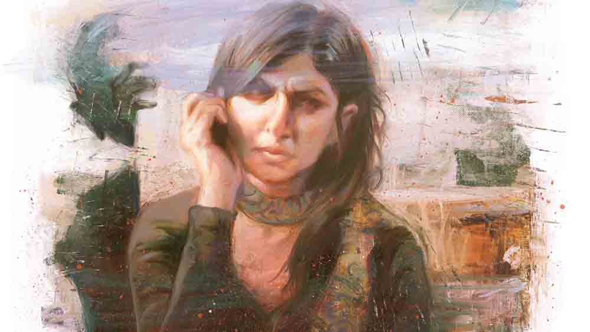

 
 <h1 align=center>টার্গেট</h1>
<h2 align=center>সুজিত বসাক</h2> ফোনটা বেজে উঠতেই তেড়েফুঁড়ে ধরল নীপা, “কে রে তুই? শয়তান! হতচ্ছাড়া! সাহস থাকে তো সামনে আয়! জানোয়ার কোথাকার… বাড়িতে মা-বোন নেই?...”

এক নিঃশ্বাসে কথাগুলো বলে থামল নীপা। অপর প্রান্তের ক্ষীণ আওয়াজে চমক ভাঙল। এই যাঃ! কী কাণ্ড! বড়মামার গলা না?

“এ সব তুই কী বলছিস? মাথার ঠিক আছে তো? তুই নীপা বলছিস তো?” বড়মামা কনফিউজ়ড।

নীপা জিভ কাটে, “সরি বড়মামা… আসলে একটা বদমাইশ ছেলে কিছু দিন হল খুব ডিসটার্ব করছে… একটু আগেই করেছিল ফোন। ভেবেছিলাম ওই ছেলেটাই আবার করেছে, তোমার নম্বরটা খেয়ালই করিনি। রাগের মাথায়… ছিঃ ছিঃ! তুমি কিছু মনে কোরো না প্লিজ়!”

“আরে না না, সে ঠিক আছে। কিন্তু ছেলেটা কে?”

“ চিনি না। আননোন নম্বর।”

“থানায় কমপ্লেন কর। এ সব চলতে দেওয়া ঠিক নয়। দিন দিন এ সব বাড়ছে… তার উপর তোরা একা থাকিস, ভয়ই হয়। তোর রাগ দেখেই বুঝতে পারছি ব্যাপারটা সাধারণ পর্যায়ে নেই। কোনও সমস্যা হলে…”

“না না, তুমি ভয় পেয়ো না। আমি ম্যানেজ করে নিতে পারব।”

নীপা ইচ্ছে করেই চেপে গেল। বড়মামা হাইপারটেনশনের রুগি। হাই প্রেশারের সঙ্গে শুগার, হার্টের সমস্যা সবই আছে। প্রসঙ্গ পাল্টে অন্য দু’-চারটে কথা বলে রান্নাঘরে গিয়ে ফোনটা মাকে ধরিয়ে দিল। বাবা মারা যাওয়ার পর থেকে এই বড়মামাই একমাত্র নিয়ম করে ওদের খবরাখবর নেন। মানুষটা একটু আত্মকেন্দ্রিক ধরনের, তবে পুরোপুরি দায়িত্ব এড়িয়ে যাননি।

বাবা মারা যাওয়ার পর নীপারা সব দিক থেকেই ভীষণ অসুবিধের মধ্যে পড়েছিল। মা গৃহবধূ, কোনও দিনই সে ভাবে বাইরের জগতের সঙ্গে পরিচয় ঘটেনি। নীপা সবে কলেজে পড়ছে। ওর বোন দীপা মাধ্যমিকের ছাত্রী। বাড়ির একমাত্র রোজগেরে মানুষটি হঠাৎ মারা যাওয়ায় সংসারের ব্যালান্সটা বিগড়ে গিয়েছিল। বড় মেয়ে হিসেবে নীপাকেই দায়িত্ব নিতে হয়েছিল। বড়মামা তখন ধরে ধরে অনেক কিছু শিখিয়েছিলেন নীপাকে। নিজের অফিস কামাই করে বেশ কিছু দিন ছিলেন ওদের বাড়িতে। এ সব কথা কখনও ভুলতে পারবে না নীপা।

সত্যিই কি থানায় কমপ্লেন করা দরকার? নীপা বুঝে উঠতে পারে না। দিন দিন ছেলেটা বেপরোয়া হয়ে উঠছে। আজও নানা রকম অশ্লীল মন্তব্য করেছে। এত দিন সে ভাবে কিছু না বললেও আজ সহ্যের বাঁধ ভেঙে গিয়েছিল। কিন্তু এমনই কপাল, কথাগুলো ছেলেটাকে শোনাতে গিয়ে বড়মামাকে শুনিয়ে বসল! এ সব কথা বড়মামাকে জানানোর ইচ্ছে ছিল না, তবুও সব বলে ফেলতে হল। এ বার মা-ও ঠিক জানবে। টেনশনের সংক্রমণ ঘটবে অনিবার্য ভাবে।

গায়ে না মাখার চেষ্টা করে দেখেছে নীপা। কাজ হয়নি। পুলিশের ভয় দেখিয়েও লাভ হয়নি। হেসে উড়িয়ে দিয়েছে ছেলেটা। এই সব দুর্বৃত্ত জানে, ভদ্রবাড়ির মেয়েরা অত সহজে পুলিশের কাছে যেতে সাহস পায় না। পুলিশ মানেই তো লোক জানাজানি, পাঁচ কান। মেয়েদের এই ভয়টাই ওদের ক্যাপিটাল, জানে নীপা। আবার প্রতিবাদেরও শাস্তি নির্ধারণ করে ওরাই। তুলে নিয়ে গিয়ে গ্যাং রেপ করতে পারে, অ্যাসিড ছুড়ে সুন্দর মুখ এ জন্মের মতো বীভৎস বানিয়ে দিতে পারে। সবই ওদের মর্জি, ওদের পাশবিকতার কাছে মেয়েরা অসহায়। একটা মেয়েকে একটা খারাপ ছেলে কত ভাবে মারতে পারে! কত ভাবে খেলতে পারে তাদের নিয়ে!

 

দু’দিন পরেই আবার ছেলেটার ফোন। আজ আর নিজেকে ঠিক রাখতে পারল না নীপা। সমস্ত বিরুদ্ধ চিন্তাকে সরিয়ে রেখে ছুটল থানায়। পুলিশ অফিসার সব শুনে বললেন, “আপনি বলছেন আপনি ছেলেটাকে চেনেন না। কোনও ছেলের সঙ্গে আপনার কখনও প্রেমের সম্পর্ক গড়ে উঠেছিল, পরে ভেঙে দিয়েছেন? মানে কারও রিভেঞ্জ নেওয়ার কোনও গ্রাউন্ড... আমি কি বলতে চাইছি নিশ্চয়ই বুঝতে পারছেন …”

“হ্যাঁ। আমি ও সব করার অবকাশ পাইনি স্যর। বাবা মারা যাওয়ার পর থেকে ফ্যামিলি নিয়ে এতটাই এনগেজড ছিলাম…”

“আমি বলতে চাইছি, অজান্তেই হয়তো কাউকে কোনও ভাবে আঘাত করেছিলেন, তারই প্রতিশোধ নিতে চাইছে এ ভাবে। একটু ভাল করে ভেবে দেখুন।”

“ভাবার কিছু নেই স্যর। আপনি ব্যাপারটাকে অন্য দিকে ঘোরানোর চেষ্টা করবেন না প্লিজ়। আমি কি মিডিয়ার হেল্প নেব?” একটু শক্ত গলায় বলল নীপা।

মুচকি হাসলেন অফিসার, “সে আপনি নিতেই পারেন। কিন্তু কিছু ঘটলে তবেই মিডিয়া আপনাকে গুরুত্ব দেবে, তার আগে নয়। এখন আপনাকে খুব একটা পাত্তা দেবে না। খুব জোরাজুরি করলে একটা সাধারণ নিউজ় করে ছেড়ে দেবে। তাতে লাভের চেয়ে লোকসান বেশি হবে।”

নীপা চুপ করে আছে দেখে বললেন, “যদি আমার পরামর্শ চান তা হলে বলব, আমাদের ওপর একটু ভরসা রাখুন, একটু ধৈর্য ধরুন। এই ধরনের ক্রাইম এখন অহরহ ঘটছে। আপনি সাহস করে থানায় এসেছেন, অনেক মেয়ে এই সাহসটুকুও দেখাতে পারে না। আপনার বাড়ির লোক এ সব জানেন?”

“ঘটনাচক্রে জেনে গেছে। আমার অভিভাবক বলতে আমার মা। বড়মামা জানেন, কিন্তু তিনি দুর্গাপুরে থাকেন। বুঝতেই পারছেন মা আমাকে নিয়ে কতটা টেনশনে ভুগছেন। প্লিজ় হেল্প মি স্যর। প্রথমে ভয় পাইনি, কিন্তু এখন বেশ ভয় করছে।”

“ডোন্ট ওয়রি। আই অ্যাম অলসো আ ফ্যামিলিম্যান। ক্লাস নাইনে পড়া আমার একটি মেয়ে আছে। কথা দিচ্ছি, ব্যাপারটা আমি গুরুত্ব দিয়ে হ্যান্ডেল করব।”

 

দু’দিন পরেই ফোন করলেন ইনস্পেক্টর রোহিত দাশগুপ্ত। বললেন, “বিভিন্ন সোর্স ও কানেকশন কাজে লাগিয়ে আমরা তিন জনকে সাসপেক্ট করেছি। হোয়াটসঅ্যাপে ওদের ছবি পাঠাচ্ছি। দেখুন তো কাউকে চিনতে পারেন কি না।”

“কিন্তু…”

“জানি আপনি ওই ছেলেটাকে কোনও দিন দেখেননি। কিন্তু আমার ধারণা যে, এ সব করছে সে আপনাকে ভাল করেই চেনে। আপনার ডিটেলটা জানে। তাই রুটটা খুঁজে বার করতে হবে সবার আগে। এই তিন জন এ সব ক্রাইমে অভ্যস্ত। এমনও হতে পারে এদেরকে কেউ ইউজ় করছে। কে জানে আপনি হয়তো অজান্তেই কারও টার্গেট হয়ে বসে আছেন।”

“আমার কিন্তু সত্যি সত্যি খুব ভয় করছে স্যর।”

“ভয় পাওয়ার কিছু নেই। সমস্তই গোপন থাকবে। আপনি শুধু কো-অপারেট করুন। আপনারা সব কিছু মেনে নেন বলে এরা আরও মাথায় ওঠার সাহস পায়। বাই দ্য ওয়ে… আপনি শুভাশিস রায় নামে কাউকে চেনেন?”

আচমকা বিদ্যুৎতরঙ্গ খেলে গেল যেন নীপার শরীরে। শুভাশিস রায়, অর্থাৎ মন্ডা, ওকে ভুলবে কেমন করে নীপা! তারাপদ লেনে থাকে। পৈতৃক মাছের আড়তদারির ব্যবসা। প্রচুর কাঁচা পয়সার মালিক ওরা। এক সময় মনে ধরেছিল নীপাকে। দিনরাত ঘুরঘুর করত ওর পিছনে। অতিষ্ঠ করে ছেড়েছিল জীবন। এক দিন সোজাসাপটা বিষ ঝেড়ে দিয়েছিল নীপা। তার পরে আর সে এমুখো হয়নি। তাও বছর দুয়েক হয়ে গেল সে সবের। তবে কি ইনস্পেক্টরের কথাই ঠিক? মন্ডাই আছে এর পিছনে?

ভয়ে ভয়ে জিজ্ঞেস করল নীপা, “হঠাৎ এই নামটা আসছে কেন স্যর?”

“তার মানে তুমি চেনো ওকে। ওই নামটা আমরা ওই তিন জনের মধ্যে এক জনের মুখ থেকে জানতে পেরেছি। লোকাল ছেলে, এরা এ সব জানে। তবে মন্ডার রোলটা এখনও বুঝতে পারছি না। এ বার বলো তুমি ওকে চিনলে কেমন করে?”

“এক সময় আমার পিছনে লেগেছিল। সব সময় ফলো করত। এক দিন রাস্তায় ধরে যা মনে আসে বলে দিয়েছিলাম।”

“তার পর?”

“সাহস করে বলে তো দিয়েছিলাম, কিন্তু বলার পর প্রচণ্ড ভয় পেয়ে গিয়েছিলাম। দু’-তিন দিন আর বাড়ি থেকে বেরোইনি। তার পর আর দেখিনি ওকে। পরে জানতে পারি ওর বাড়ির লোক ব্যবসা দেখাশোনার জন্য অন্য কোথাও পাঠিয়ে দিয়েছে। আমি হাঁপ ছেড়ে বাঁচি।”

 

পর পর কয়েক দিন আর কোনও ফোন আসেনি। কিছুটা হলেও মনে মনে স্বস্তি পেল নীপা। বাড়িতে একটা টেনশনের বাতাবরণ। বড়মামা দিনে দু’-তিন বার করে ফোন করে খোঁজখবর নিচ্ছেন। পুলিশের সঙ্গে কী কথাবার্তা হয়েছে, ওরা কত দূর কী স্টেপ নিয়েছে তার বিস্তারিত বিবরণ জানার চেষ্টা করেছেন নীপার কাছ থেকে। আর মা তো উঠতে বসতে একই কথা বোঝানোর চেষ্টা করে যাচ্ছে, মাথার উপর কোনও পুরুষ অভিভাবক না থাকলে বড় বড় মেয়েদের নিয়ে চলা কতটা কঠিন!

নীপার মনে হয়েছে, মেয়েরা কি সত্যিই স্বাধীন? মৃত্যুর চেয়েও মেয়েদের বেশি ভয় ধর্ষিতা হওয়ার, অ্যাসিড বালবের আক্রমণে সারা জীবনের মতো বিকৃত গলিত মুখ নিয়ে ঘোরার। বিধাতার সৃষ্টিতেই তো বৈষম্য! আসলে খাদ্য-খাদকের সম্পর্কের ভিত্তিতে গড়ে তুলেছেন নারী-পুরুষকে। নারীর স্বাধীনতা বা পরাধীনতা, দুটোই পুরুষের মর্জিনির্ভর। সেটাই হয়ে আসছে যুগ যুগ ধরে। ইতিহাস তার সাক্ষী।

ক’দিন পর। এক বিকেলে রোহিত দাশগুপ্ত ফোন করে জিজ্ঞেস করলেন, “আর ফোন এসেছিল?”

নীপা কৃতজ্ঞতা জানিয়ে বলল, “না স্যর। আপনাকে অসংখ্য ধন্যবাদ। এ সব কে করছিল কিছু বুঝতে পেরেছেন?”

“হ্যাঁ। তোমাকে নিয়ে একটা খুব জঘন্য পরিকল্পনার ছক কষা হয়েছিল। হয়তো ওরা তোমাকে খুব সফ্ট টার্গেট ভেবে নিয়েছিল। তোমাকে কিডন্যাপ করে বাজে কিছু করত। তার পর ভিডিয়ো করে ব্ল্যাকমেলিং… একটা বড় চক্র আছে এর পিছনে। মেয়েদেরকে ফাঁদে ফেলার চক্র। তুমি পুলিশের কাছে এসে খুব বুদ্ধিমতীর কাজ করেছ। নইলে…”

শিউরে উঠল নীপা, “এ সব কী বলছেন স্যর? খবরের কাগজ, টিভিতে এমন ঘটনা থাকে, কিন্তু…”

হাসলেন রোহিত দাশগুপ্ত, “তুমি কি মনে করো, এ সব অন্য গ্রহের মেয়েদের সঙ্গে হয়? এ সব যারা করে তারাও আমাদের আশপাশেই থাকে। দেখে মানুষই মনে হয়। তোমার সঙ্গে এ সব কে করছিল জানো? না, মন্ডা নয়। তোমার নতুন কোলিগ তপন চৌধুরী। কাছ থেকে মিশেও চিনতেই পারোনি। সব দোষ অবশ্য তোমার নয়। ভাগ্যিস শুভাশিস, মানে মন্ডা… ও আমাদের হেল্প করেছিল। না হলে আমরা ব্যাপারটা এত সহজে ধরতে পারতাম না। পৃথিবীতে এ রকম কিছু স্ট্রেঞ্জ ঘটনা ঘটে বলে... যাকগে, মনে হয় তোমার আর কোনও ভয় নেই।”

নীপা কিছু ক্ষণ চুপ করে রইল। তার পর ক্ষীণ গলায় বলল, “ঠিক বুঝলাম না স্যর! মন্ডা কী ভাবে হেল্প করল আপনাদের?”

রোহিত দাশগুপ্ত বললেন, “খুলেই বলি। মন্ডা আগে হয়তো তোমাকে বিরক্ত করেছে, কিন্তু সে ঘটনা সেখানেই শেষ। মন্ডার এক বন্ধু তপনকে কোনও ভাবে চেনে। ওর বদ স্বভাবের কথাও জানে। ওই ছেলেটাই কিছু দিন আগে দেখে ফেলেছিল, তপন তোমাকে নিয়মিত ফলো করে। তার পর সে কথাটা মন্ডার কানে তোলে। সেখান থেকেই মন্ডা আঁচ করতে পেরেছিল যে কিছু গোলমাল হতে পারে। আমরা মন্ডার সঙ্গে তোমার পুরনো ঝামেলার কথা জানতে পেরে ওর কাছে পৌঁছই। মন্ডা আমাদের সব খুলে বলে। ওর সন্দেহ ছিল, তপনই এ সবের পিছনে। মন্ডা আমাদের প্রধান সাসপেক্ট, প্রথমে ওর কথায় পাত্তা না দিলেও অচিরেই বুঝতে পারি মন্ডার কথাই ঠিক। তপনের ফোন ট্যাপ করে, ওর গতিবিধির উপর নজর রাখতেই সত্যিটা বেরিয়ে আসে। তপনকে ধরার পর মন্ডা নিজে থানায় এসে আমাকে কৃতজ্ঞতা প্রকাশ করে গেছে। যেন ওর খুব আপনজনের সঙ্গে ঘটনাটা ঘটেছিল…”

ফোনটা রেখে কিছু ক্ষণ চুপচাপ বসে রইল নীপা। তপন তার অফিসের নতুন কোলিগ। সাত-আট মাসের পরিচয়। কেতাদুরস্ত চেহারা, সব সময় ঠোঁটে হাসি, মিষ্টি মুখ, পরোপকারী স্বভাব। আগ বাড়িয়ে আলাপ করেছিল, যেন কত দিনের চেনা! কেমন করে যেন সেটা একটা ভাল লাগার দিকেই এগোচ্ছিল।

মানুষের মুখোশের আড়ালে একটা অমানুষকে বিশ্বাস করেছিল! আর বাইরের পালিশ নেই বলে এক জন মানুষের সম্বন্ধে ভুল ভেবেছিল নীপা, সে কথা ভেবে মনটা খচখচ করে উঠল তার।