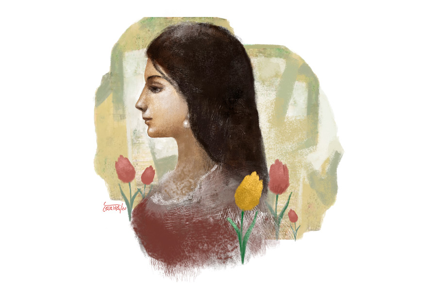

 
 <h1 align=center>টিউলিপ</h1>
<h2 align=center>শুভ্রা রায়</h2> রাজা দীনেন্দ্র স্ট্রিট লাগোয়া গলির মধ্যে লেডিজ় হস্টেলটা। দুপুরের তির্যক রোদে অর্ণব ফুটপাতের গা ঘেঁষে গাড়িটাকে পার্ক করে। গতকাল মাঝরাতে টিউলিপের সঙ্গে ঘণ্টাতিনেকের উপর  কথা বলেছে। আজ আবার হাসপাতাল থেকে বেরিয়েই বালিগঞ্জ থেকে উত্তর কলকাতায় টিউলিপের হস্টেলে চলে এসেছে। 

টিউলিপের বাড়ি গড়িয়ায়। গড়িয়া থেকে রোজ যাতায়াত মুশকিল। যখন তখন আইসিইউ-তেও ডিউটি পড়ে। তাই এক বছর হল আর জি করের কাছেই এই লেডিজ় হস্টেলে উঠেছে। অর্ণব কাজী ও টিউলিপ চৌধুরী দু’জনেই এক সঙ্গে এমবিবিএস কমপ্লিট করেছে। পোস্টগ্র্যাজুয়েট এনট্রান্সে তিন বার বসেও অর্ণব সুবিধে করতে পারেনি। তার পর একটা বেসরকারি হাসপাতালে মেডিক্যাল অফিসারের চাকরি নিয়েছে। টিউলিপের পোস্টগ্র্যাজুয়েট থার্ড ইয়ার চলছে। ছ’বছর সম্পর্কের পর অর্ণবের মনে হয়েছে, টিউলিপ কেরিয়ারে এগিয়ে গেছে বলে বিয়েতে সম্মতি দিচ্ছে না।

কাল রাতে অর্ণব অনেক ক্ষণ বকবক করে টিউলিপের মাথা খারাপ করেছে। সকালে ডিউটি থাকায় টিউলিপকে আবার ঝটপট উঠে হাসপাতালে দৌড়তে হয়েছে। ক্রিটিক্যাল কেয়ারে সম্পূর্ণ সজাগ ও তৎপর থেকে ডিউটি করতে হয়।

টিউলিপ বিয়ে করতে চায় না। কিন্তু সে কথা কিছুতেই অর্ণবকে বোঝাতে পারছে না। বিয়ে নামক সেটলমেন্ট এড়ানোর জন্যই তো টিউলিপ তার জন্মস্থান থেকে পালিয়ে এসেছে কলকাতায়। 

গাড়ি থেকে নেমে অর্ণব চুপচাপ দাঁড়িয়ে থাকে। হাতের ঘড়ি দেখাচ্ছে দুপুর আড়াইটে। টিউলিপের ফেরার সময় হয়ে গেছে। মিনিট পনেরো পরেই অর্ণব দেখতে পায়, টিউলিপ মেন রোড ক্রস করে গলির মুখে ঢুকছে। অর্ণব এগিয়ে আসে।

“অর্ণব, কাল রাতে তোর জন্য ঘুমোতে পারিনি। আমি এখন খুব ক্লান্ত, কথা বলতে পারব না।”

“আমিও কম ক্লান্ত নই টিউলিপ। আমারও হসপিটালে ডিউটি থাকে। কিন্তু তুই তার চেয়েও বড় সমস্যায় ফেলেছিস আমাকে। ছ’বছরের রিলেশন, আর এখন বলছিস বিয়েই করবি না! তোর সমস্যাটা কোথায়?”

“তুই-ই বা এত বিয়ে-বিয়ে করছিস কেন? কবে পোস্ট গ্র্যাজুয়েশনে এন্ট্রি নিবি?”

“এমবিবিএস করেও রোজগারপাতি হয়। তুই যদি সোজা কথা না বলে কথা ঘোরাতে চেষ্টা করিস, তা হলে আমায় অন্য পথ ধরতে হবে।”

“তবে যা না সেই পথে। রিলেশনে থাকা মানেই কি আমায় বিয়ে করতে হবে? বিয়ে না হলে ঘুম হচ্ছে না, তাই না? দেখা যাক তোর দৌড় কত দূর! কাল আসিস তোর মা-বাবাকে সঙ্গে নিয়ে আমাদের গড়িয়ার ফ্ল্যাটে। আমার বাবা-মার সামনে কথা হবে। আই বেট, তোর পাগলামির বেলুনের হাওয়া বেরিয়ে যাবে কালই...” বলেই টিউলিপ হস্টেলে ঢুকে যায়। অর্ণব চেঁচায়, “বাড়ির ঠিকানাটা টেক্সট করে দিস।”

গতকাল রাতেই টিউলিপ গড়িয়ায় চলে এসেছে। বাড়ি ফিরে বাবা-মাকে সব জানিয়েছে। একটু আগে অর্ণব ফোনে বাড়ির লোকেশন জেনেছে। টিউলিপের মা মেয়েকে শাড়ি পরতে বলেছিলেন। টিউলিপ বলেছে, “এত ফর্মালিটির কিছু নেই। এখানে তো আমার বিয়ের কথা হচ্ছে না। অর্ণবের ছটফটানি বন্ধ করতেই ওঁদের বাড়িতে ডাকা।”

ডোরবেল বেজে ওঠে। টিউলিপের বাবা রেহান চৌধুরী দরজা খুলে দেন। অর্ণবের বাবা-মা ও অর্ণবকে সাদর অভ্যর্থনা জানিয়ে ড্রয়িং রুমে বসান। অর্ণবই শুরু করে, “আঙ্কেল আমি অর্ণব কাজী, এমবিবিএস পাশ করে একটি বেসরকারি হাসপাতালে মেডিক্যাল অফিসার হিসেবে কাজ করছি। ইনি আমার বাবা অপূর্ব কাজী, অ্যাডভোকেট, কলকাতা হাইকোর্টে প্র্যাকটিস। আমার মা অপরাজিতা কাজী, সোশ্যাল ওয়ার্ক করেন। নারীর শিক্ষা ও অধিকার নিয়ে আমার মা কাজ করছেন। গত কালই ঈশ্বরচন্দ্র বিদ্যাসাগরের জন্মদিনে ফেসবুক লাইভে মা বক্তব্য রেখেছিলেন। পাঁচ হাজারের বেশি লাইক পড়েছে আঙ্কল। আই অ্যাম প্রাউড অব হার।”

অর্ণবের কথা শুনে রেহান চৌধুরী বলেন, “হাঁ, বিদ্যাসাগর সাবজি বহুত গ্রেট আদমি ছিলেন। নারীশিক্ষার জন্য প্রথম আওয়াজ তোলেন তিনি। ওঁর আশীর্বাদেই আমার মেয়ে আজ ডক্টর। আমি, আমার মেয়ে বাংলা জানি, বুঝি। আমার স্ত্রী বাংলা বলতে পারেন না। আমরা ইউপির লোক। ন’বরস কলকাতায় আছি। আমার স্যানিটারি গুডসের বিজ়নেস। আপনারা আজ হামার বাড়িতে এসেছেন, আমি বহুত খুশি হয়েছি। টিউলিপ অর্ণবের বারে মে সব বলেছে।” 

তত ক্ষণে শরবত-মিষ্টির ট্রে নিয়ে টিউলিপ তার মায়ের সঙ্গে ঘরে ঢোকে। টিউলিপের পরনে একটা ফিরোজা জারদৌসি চুড়িদার-কামিজ, সঙ্গে হালকা গয়না। অর্ণব টিউলিপের দিকে মুগ্ধ হয়ে তাকায়, তার পর ভ্রু কুঁচকোয়। তার পোশাকের দিকে দেখে। অর্ণবের ভাবগতিক আঁচ করে সামনের সোফায় বসে টিউলিপ বলে, “ব্লাউজ় ঠিকঠাক রেডি ছিল না বলে শাড়ি পরতে পারলাম না।”

“না না, ঠিক আছে, তোমাকে ভারী মিষ্টি লাগছে, আমার ছেলের নজরের তারিফ করতে হয়...” অর্ণবের মা হেসে বলেন টিউলিপকে।

“থ্যাঙ্ক ইউ আন্টি।”

অর্ণবের বাবা শরবতের গ্লাস হাতে নিয়ে রেহান চৌধুরীকে প্রশ্ন করলেন, “এত ফুল থাকতে আপনি মেয়ের নাম টিউলিপ রাখলেন কেন?”

রেহান চৌধুরী জানালেন, “ওর একটা কিসসা আছে। আমি টিউলিপের মাকে নিয়ে হানিমুনে কাশ্মীরে যাই। সেখানে টিউলিপ গার্ডেন দেখে আমার দিল খুশ হয়ে যায়। বিয়ের এক বরস পর আমাদের মেয়ে হয়। তখন মাথায় টিউলিপ নামটা আসে। ইট স্যুটস মাই ডটার।”

“হ্যাঁ ঠিকই, আমাদের যে কারণে এখানে আসা, সে ব্যাপারে কথা বলি,” অপরাজিতা দেবী শুরু করলেন, “অর্ণব আর টিউলিপের অনেক দিনের রিলেশন, আমরা চাইছি এ বার ওদের বিয়ের কথাবার্তা বলতে। এ ব্যাপারে আপনাদের মতামতটা যদি একটু জানতে পারতাম...”

উত্তরে রেহান চৌধুরী জানালেন, “কিন্তু আমার মেয়ে বিয়ে করতেই চায় না। ওর এগেনস্টে কী করে মতামত দিই?”

“মানে?”

টিউলিপ বলে, “মানে আর কিছু নয় আন্টি, আমি বিয়ে করতে চাই না। কারণ আমার অতীত জানতে পারলে আপনারা আমাকে আর ছেলের বৌ করতে চাইবেন না।”

টিউলিপের কথা শুনে হতবাক অর্ণব বলে, “এ সব কী বলছিস টিউলিপ? কিসের অতীত?”

“অর্ণব, তোমার টিউলিপ বিধবা। ষোলা বরসে ওর বিয়ে হয়ে যায়। ইউপি-তে আমাদের পরিবারের এটাই রেওয়াজ। টিউলিপ ছোটবেলা থেকেই লেখাপড়ায় এক নম্বর ছিল। ওকে নিয়ে আমি অনেক স্বপ্ন দেখতাম। ক্লাস টেনের বোর্ড দেওয়ার পরই হঠাৎ এক দিন আমার বাবা আমাদের না জানিয়ে টিউলিপের বিয়ে ঠিক করে আসেন। অনেক অশান্তির পর বাবার সম্মানের কথা ভেবে আমরা টিউলিপের বিয়ে দিতে বাধ্য হই।”

টিউলিপ বলে ওঠে, “আমার পাপা বাকিটা লজ্জায় ঠিকমতো বলতে পারবে না, তাই আমি বলছি। বিয়ের পরের দিন আমি শ্বশুরবাড়ি চলে যাই, সে দিনই আমার সোহাগরাতে আমার হাজ়ব্যান্ড আমার উপর অকথ্য শারীরিক  অত্যাচার করে। তার পর মাঝরাতে হাজ়ব্যান্ডের বন্ধুদের ফোন আসে। সে তখন সেলার থেকে মদের বোতল নিয়ে খেতে খেতে বেরিয়ে যায়। পরের দিন সকালে থানা থেকে বাড়িতে ফোন আসে, পথ-দুর্ঘটনায় ওর মৃত্যু হয়েছে। বন্ধুদের সঙ্গে বাজি লড়ে হাইরোডে মাতাল অবস্থায় বাইক রাইড করতে গিয়ে ব্যালান্স হারিয়েছিল। অপয়ার সিলমোহর পড়ে আমার জীবন এর পর নরক হয়ে ওঠে...” টিউলিপ দু’হাত দিয়ে মুখ ঢেকে ফুঁপিয়ে কেঁদে ওঠে।

রেহান চৌধুরী বললেন, “মাসখানেক পর এক দিন আমরা তিন জনে অজমেঢ় শরিফ যাওয়ার প্ল্যান করে সারা জীবনের মতো ঘর-পরিবার ছেড়ে কলকাতায় পালিয়ে আসি। আসার সময় আমাদের সব সেভিংস আর জুয়েলারি সঙ্গে নিয়েছিলাম। এখানে টিউলিপের মা-র বহেন থাকে, তিনি আমাদের থাকার ব্যবস্থা করে দেন। তার পরেও অশান্তি পিছু ছোড়েনি। এখানে এসে জানতে পারলাম টিউলিপ প্রেগন্যান্ট। পার্ক স্ট্রিটের একটা নার্সিংহোমে অ্যাবরশন করাই। কিছু দিন পরে টিউলিপের আন্টি লোকাল গার্জেন হিসেবে এখানকার স্কুলে ওকে ইলেভেনে ভর্তি করে দেন। টিউলিপের নতুন জীবন শুরু হয়। বোর্ডে দারুণ রেজ়াল্ট করে, এক চান্সে মেডিকেলে সিট পায়। পরে পোস্টগ্র্যাজুয়েটে চান্স পায়। আমি আমার মেয়ের সাকসেস দেখে ভীষণ হ্যাপি। টিউলিপের মা মাঝে মাঝে টিউলিপের বিয়ের কথা তোলেন, কিন্তু আমার আর বিয়ের কথা ভাবতে ইচ্ছে করে না। কারণ অতীত ভীষণ পেনফুল। এর পর কি টিউলিপকে ছেলের বৌ করার ইচ্ছে থাকবে আপনাদের?”

সব বৃত্তান্ত শুনে তিন জনই কিংকর্তব্যবিমূঢ়। নিজেরাই যেন পরস্পরের দিকে তাকাতে পারছেন না। ওঁদের উত্তরহীন নীরবতা দেখে টিউলিপ চোখ মুছে অর্ণবকে কটাক্ষ করে, “বলেছিলাম না বেলুন থেকে হাওয়া বেরিয়ে যাবে।”

টিউলিপের কটাক্ষ শুনে অপরাজিতাদেবী বলেন, “আমরা বাড়ি গিয়ে আলোচনা করে আপনাদের জানাচ্ছি।”

বাড়ি ফিরে বিমর্ষ অর্ণব ছাদে চলে যায়। নিজেকে বড় একা মনে হয় তার। অর্ণব বিড়বিড় করে, ‘আমি তোকে খুব ভাল বন্ধু ভাবতাম, আর তুই তোর কষ্টের ক্ষতগুলো আমার সঙ্গে কোনও দিন শেয়ার করিসনি! তা হলে আমরা কিসের বন্ধু?’ অর্ণবের গলা বুজে আসে, চোখের পাতা ভারী হয়ে ওঠে।

পরদিন সকালে ব্রেকফাস্ট টেবিলে বাবা অর্ণবকে জিজ্ঞেস করেন, “কী রে, কী ঠিক করলি?”

অর্ণব বলে, “তোমরা তো রাজি হবে না, তাই বিয়ের পর ভাড়াবাড়িতেই উঠতে হবে।”

অর্ণবের কথায় অপরাজিতাদেবী রেগে গিয়ে বলে উঠলেন, “কেন আমাদের আন্ডারএস্টিমেট করছিস? বিদ্যাসাগর মশাই দেড়শো বছর আগে বিধবা বিবাহ দিয়েছিলেন, তাঁর অনুগামী হয়ে আমরা ফেসবুকে শুধু ভণিতা করি বলে তোর মনে হয়? না রে, আমাদেরও ওই আলোর পথে হাঁটতে ইচ্ছে করে। ভাড়াবাড়ি খুঁজতে হবে না। এই বিয়ে হবে। টিউলিপকে আমাদের বেশ পছন্দ।”