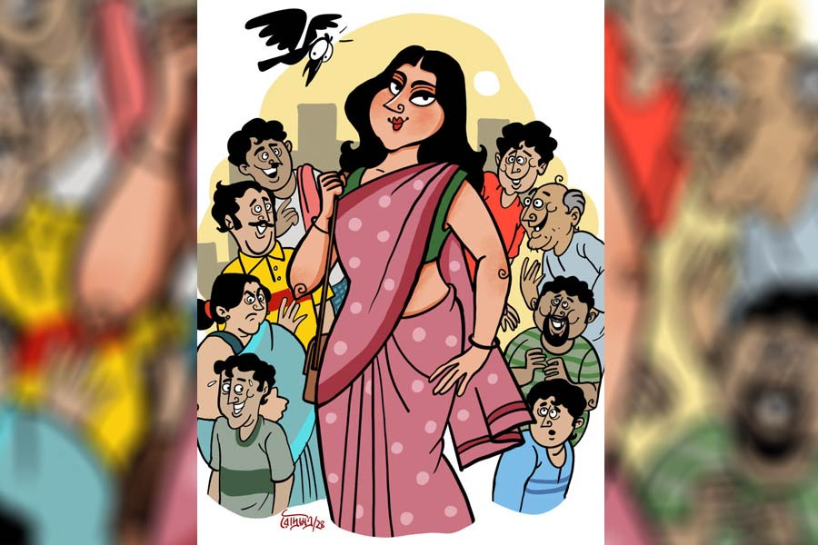

 
 <h1 align=center>টিফিন বক্স</h1>
<h2 align=center>চিরন্তন প্রামাণিক</h2> সেগুনবীথি আবাসনে আমার প্রতিবেশী মিসেস রায়কে এক কথায় ডাকসাইটে সুন্দরী বলা যেতে পারে। কিন্তু শুধু ডাকসাইটে, দুর্দান্ত, অপরূপা, সুদর্শনা, মনোহারিণী বললে কিছুই বলা হয় না। ঠিক কী বললে যে কিছু বলা হবে, সেটাও আমার জানা নেই। শুধু এটুকু বলতে পারি, তাকে দেখে বহু বিবাহিত এবং অবিবাহিত পুরুষের হৃদয়ে প্রতিদিন যে তোলপাড় হয়, তা যথেষ্ট উদ্বেগের। ফুল হয়ে তিনি যে শুধু মৌমাছিদের ক্রমাগত আকৃষ্ট করেন তা-ই নয়, বহু সংসারে স্ত্রীদের মনেও তিনি অদৃশ্য অস্থিরতা এবং সন্দেহের বাতাবরণ সৃষ্টি করেছেন।

যেমন সেদিন বৌকে নিয়ে বাজারে বেরিয়েছি। শপিং মল, মাংসের দোকান হয়ে, দুটো টাটকা আনাজ, ফল কিনে বাড়ি ফিরব। সে রকম বুঝলে লাঞ্চটাও বাইরেই সেরে নেওয়ার প্ল্যান আছে। বেকড চিলি অক্টোপাস, হট টুনা স্যালাড, আর কোরিয়ান ল্যাম্ব মাশরুম না খেলে পরিবারে আর মুখ দেখানো যাচ্ছে না। এই তো গত রোববারের ঘটনা। সামান্য লাউডাঁটা চচ্চড়ি আর চুনো মাছের টক খেতে চেয়ে বৌয়ের কাছে কী মুখঝামটাই না খেলাম! “রোববারের দুপুরে কোথায় ঘি-জবজবে রাঁধুনিপাগল পোলাও, ঢাকাই মুর্গ, রেশমি কাবাবের কথা ভাববে, না ডাঁটাচচ্চড়ি! তার চেয়ে থানকুনি পাতা সেদ্ধ আর লেবুর জল খেয়ে শুয়ে পড়ো!”

একটু হাঁটতেই দেখি, দূর থেকে মিসেস রায় আমাদের দিকেই হেঁটে আসছেন। আমার বুকের ভিতর একশো জলফড়িং অবাধ্য হয়ে উড়তে লাগল। কাছে এলে কি ‘গুড মর্নিং’ বলব? না, তার চেয়ে বরং মুখে হাসি আর গভীর দৃষ্টি মেলে ‘ভাল আছেন’ অনেক ভাল। কিন্তু বিধি বাম। মিসেস রায়কে দেখা মাত্র, এক মুহূর্ত সময় নষ্ট না করে ডান পাশের একটা ছোট গলিতে আমার স্ত্রী ঢুকে পড়লেন।

“বড় রাস্তা ছেড়ে হঠাৎ এ দিকে ঢুকলে কেন? এই গলিটা ভাল নয়, খুব নির্জন!” আমি সবেগে স্ত্রীকে অনুসরণ করতে করতে নরমপন্থী ও মৃদু প্রস্তাব পেশ করলাম।

“নির্জন! আমি জানি না বুঝি ওই বড় রাস্তায় কি মধু আছে? কুমড়োর ঝোল খেয়েও এত এনার্জি আসে কোথা থেকে? আর ওঁকেও বলিহারি। এই মাঝবয়সেও স্লিভলেস, এক হাত খোলা পিঠ নিয়ে ঘোরাঘুরি করছেন! ভোমরা হুল ফুটিয়ে দেবে কোন দিন, বলে রাখলাম।”

আমি ভাবলাম বলি, ওঁরই তো পিঠ, খুলে রাখবেন কি রেশমি রুমাল দিয়ে ঢাকা দেবেন, ওঁকেই ঠিক করতে দাও না। কিন্তু বলতে পারলাম না। স্ত্রী আমার মনোভাব আঁচ পেয়ে বলল, “ওর খুব সন্দেহবাতিক। নিজের স্বামীকেই সব সময় চোখে চোখে রাখে। অফিসফেরত স্বামীর জামার গন্ধ শোঁকেন। ওর নেক্সট ডোর, দীপা আমাকে বলেছে।”

“জামার গন্ধ? উনি কি ঘামের গন্ধে অ্যাডিক্টেড?”

“ও তুমি বুঝবে না। আর তোমাকেও বলি, এত উতলা হওয়ার কোনও কারণ নেই।”

“আমি কোথায় উতলা হলাম?”

“তোমার চোখ দেখেই সব জলের মতো পরিষ্কার বোঝা যাচ্ছে।”

তাড়াতাড়ি পা চালিয়ে, মুখে হাসি এনে বললাম, “তোমার মধ্যে সন্দেহ জিনিসটা ভগবান একেবারেই দেননি। শোনো না, ফেরার পথে এক বার মেনকা জুয়েলার্স হয়ে আসব, এ বারের বিবাহবার্ষিকীতে মোটা বাউটি গড়িয়ে দেব তোমায়।”

সেই শুনে অনুরাধার মাশকারা চোখ যেন একটু নরম হল।

হপ্তাখানেক পর, তিতির এমন মামার বাড়ি যাওয়ার বায়না ধরল যে, গিন্নি বাধ্য হয়ে বলল, “দিনকতক ও বাড়ি থেকে ঘুরেই আসি। তিতিরও কয়েকটা দিন আনন্দ করবে।”

আমি বেজায় দুঃখের ভাব এনে বললাম, “ঠিক আছে, কিন্তু বেশি দেরি কোরো না। তোমরা না থাকলে বড় ফাঁকা লাগে। মন হু-হু করে।”

“আর কত মিথ্যে বলবে?” অনুরাধা জবাব দিল, “আমি না থাকলেই তো বন্ধুদের নিয়ে ছাইপাঁশ গিলবে। মেয়েরা না-হয় অবলা জীব, তা বলে আর কত ঠকাবে!”

অবলা জীবসমাজে নারীর অন্তর্ভুক্তি শুনে আমি বেমালুম চুপ। নারী এবং অবলা, সম্পূর্ণ বিপরীত শব্দ। কিন্তু শাস্ত্রে বলেছে, সব সময় সব কথার প্রতিবাদ করতে নেই।

দিন তিনেক পর, বৌ-মেয়ে রওনা দিল।

রোববারের অলস সকালে বুকের নীচে বালিশ রেখে বইয়ের পাতা ওল্টাচ্ছি। ‘নারী এবং নারীমন’। লেখক তার লেখায় নারীদের মনস্তত্ত্ব নিয়ে যা লিখেছেন, তাতে স্বচ্ছন্দে তাঁকে একটা নোবেল দেওয়া যেতে পারে। যত পড়ছি ততই মনে হচ্ছে পরের জন্মে যেন রহস্যের সফেন সাগরে ডুব দিয়ে নারীজন্ম লাভ করি। যেমন নারীই হোক, অসুবিধে নেই।

দু’দিন আগেই মহালয়া পেরিয়েছে। চার দিকে ঝকঝকে প্রকৃতি। কাজের দিদি দু’দিনের প্রাক্‌-পুজো ছুটি নিয়েছে। একা থাকলে ঝক্কি কম। সামান্য ডাল-ভাত করে নিলেই ব্রহ্মা সন্তুষ্ট। উঠি-উঠি করেও দেরি হচ্ছিল।

এমন সময়, কুরর...কুরর...কুর...কু...

গ্রীষ্মের দুপুরে প্রেম-প্রত্যাখ্যাত কোনও পুরুষ কবুতরের মতো ডোরবেল বেজে উঠল। এই অসময়ে আবার কে? ছুটির দিনে আমি নিরিবিলি ভালবাসি। ভাবলাম মরুকগে, দরজা খুলব না। সাড়া না পেলে ঠিক চলে যাবে।

কুরর...কুরর...কুর...কু...

কিন্তু কবুতর ডেকেই যাচ্ছে। উঠতেই হল। দরজার আইহোলে চোখ রাখতেই দারুণ চমকে উঠলাম। মিসেস রায়! নিজের চোখকে বিশ্বাস হল না। বাঁ চোখে দেখলাম। বাঁ চোখ বন্ধ করে ডান চোখে। নজর করলাম। হ্যাঁ, মিসেস রায়ই। হাসি-হাসি মুখ করে দরজার দিকেই তাকিয়ে আছেন। উনি ও দিকে, আমি এ দিকে। মাঝে শুধু বার্মা সেগুনের প্রাণহীন দরজা।

চটজলদি মহালয়ায় পরা হলুদ পাঞ্জাবি আর পায়জামা চাপিয়ে নিজেকে ভদ্রস্থ করলাম। মুখখানা যতখানি প্রসারিত করা সম্ভব, ততখানি চওড়া হেসে দরজা খুললাম।

“আপনাকে কি অসময়ে বিরক্ত করলাম? ব্যস্ত ছিলেন?” হাজার জলতরঙ্গ এক সঙ্গে বেজে উঠল। মনে হল পৃথিবীর সব সুখ, সব আনন্দ আমার দরজায় এসে জড়ো হয়েছে।

“না, না ব্যস্ত নয়। আসলে গল্পের বইয়ে ডুবেছিলাম, খেয়াল করিনি।”

“ভেতরে যেতে পারি, নাকি দাঁড়িয়েই কথা বলব?”

“ছি ছি! আর লজ্জায় ফেলবেন না। দোষ আমারই। ভেতরে আসুন।”

মনে হল পৃথিবীর আনাচে কানাচে প্রতিদিন কত কিছু ঘটে চলেছে। কবি পর্যন্ত আক্ষেপ করে লিখেছেন, ‘রোজ কত কী ঘটে যাহা তাহা, এমন কেন সত্যি হয় না আহা!’ কী নিশ্চয়তা আছে, আজও কিছু একটা নিশ্চুপ অঘটন ঘটবে না!

একটু আগে আমি যেখানে শুয়ে নারীমনের অপার রহস্য সন্ধান করছিলাম, উনি সেখানেই বসলেন। ওঁর শরীর থেকে ভেসে আসা আতরের মিষ্টি গন্ধ ঘরের দখল নিল।

এত ক্ষণ লক্ষ করিনি, এখন দেখলাম ওঁর হাতে একটা চটের সুন্দর ব্যাগ। তার ভিতর থেকে ততোধিক সুন্দর লাল, গোল টিফিনবক্স বের করে টেবিলের উপর রাখলেন, “এটা খাবেন। আপনার জন্য নিয়ে এলাম।”

“আবার এ সব কী দরকার ছিল... ছুটির দিনে ব্যস্ততার মধ্যে...”

“ব্যস্ততা আর কই? উনি কাল অফিসের কাজে জব্বলপুর গেছেন। আসবেন সেই পুজোর পর। বাড়িতে আমি একা। শুধু নিজের জন্য রান্না করতে ইচ্ছে করে না। তাই আপনার জন্যও করে আনলাম। ইলিশ বিরিয়ানি আর বনমুরগির রোস্ট।”

“আমি শুনেছি আপনার রান্নার সুখ্যাতি। আপনার হাতের রান্না নাকি আপনার সৌন্দর্যের মতোই দুর্লভ। ভুলব মনে করলেও ভোলা যায় না।”

মিসেস রায় ব্লাশ করলেন। স্পষ্ট দেখলাম ওঁর ঠোঁটের গায়ে সিঁদুর-রং ধরল। পৃথিবীর সব নারীই পরপুরুষের হাতে প্রশংসার মোহনভোগ খেতে ভালবাসেন। উনিও ব্যতিক্রম নন। গালে টোল ফেলে আমার প্রশস্তি নীরবে গ্রহণ করলেন।

“ওরা নেই বুঝি?”

“এই দিনকয়েক হল মা-মেয়ে মামার বাড়ি গেছে।”

“ওহ! তা হলে তো আপনাকেই রান্নাবান্না করতে হচ্ছে!” ব্যস্ত হয়ে উঠলেন মিসেস রায়।

“না, মানে হ্যাঁ... মানে ওই টুকটাক আর কী!”

“এ মা, আমি আগে জানলে আপনাকে এই অসুবিধের মধ্যে পড়তেই হত না। ঠিক আছে, অনুরাধা না আসা পর্যন্ত আমি দু’বেলা আপনার খাবার পাঠিয়ে দেব।”

“শুনুন,” আমি বিনয়ী হলাম, “আপনি একদম চিন্তা করবেন না। প্রতিদিন খাবার পাঠানোর প্রয়োজন নেই। যদি সে রকম অসুবিধে বুঝি আপনাকে অবশ্যই বলব।”

“লজ্জা করবেন না কিন্তু। সমস্যা হলে বলবেন।”

“বলব,” কয়েক মুহূর্ত চুপ থেকে জিজ্ঞেস করলাম, “এ বার বিজয়া সম্মিলনীতে গান গাইবেন তো?”

“আপনি গান ভালবাসেন?”

“গান কে না ভালবাসে? তবে আমি শ্রোতার দলে।”

“শ্রোতারাই কিন্তু আসল। আপনারা আছেন বলেই গান আছে। কিন্তু শ্রোতা হিসেবেই বা পাচ্ছি কই? কোনও অনুষ্ঠানেই তো আপনাকে কাছে পাই না। যা ব্যস্ততা আপনার!”

এ বার আমার ব্লাশ করার পালা। উনি আমাকে কাছে পেলে কী করতেন, সেটা ভেবেই আমি এক দফা লাল হলাম। এক বার মনে হল, প্রত্যুত্তর না দিয়ে চুপ থাকি। উনি মন দিয়েই বুঝুন আমার মনের উত্তর। কিন্তু এই একাকী পরিবেশ, শরৎ-প্রকৃতির খুশির গুঞ্জন, নিভৃতে মুখোমুখি বসে থাকা, ওঁর স্বামী আর আমার স্ত্রীর ধারে কাছে না থাকা, ইলিশের বিরিয়ানি, সুপক্ব বনমুরগি, ওঁর স্নিগ্ধ রূপমাধুরী, কালো শান্তিপুরি শাড়ির খসখস, সব যেন আমাকে কানে কানে বলল, চুপ করে থেকো না, কিছু অন্তত জবাব দাও। আমি প্রগতিশীল মিসেস রায়কে অনুসরণ করে বললাম, “এ বার থেকে অবশ্যই আমাকে কাছে পাবেন।”

ষষ্ঠীর সকালেই অনুরাধারা ফিরে এল। আমার অফিস ছুটি, তাই বাড়িতেই ছিলাম। তিতিরের সঙ্গে বারান্দায় বসে দূর থেকে ভেসে আসা ঢাকের বোল শুনছি। ও মামার বাড়ির গল্প বলে যাচ্ছে। তার কিছু কানে ঢুকছে, কিছু ঢুকছে না। রাস্তা দিয়ে কলাবৌ নিয়ে যাচ্ছে পুরোহিত, সঙ্গে কাঁসর, ঢাক-ঢোল। হঠাৎ রান্না ঘর থেকে বৌয়ের গলা পেলাম, “এ দিকে এক বার শুনে যাও।”

আওয়াজটা যেন একটু ধারালো মনে হল।

উঠে গেলাম। ওভেনে ডিমের কালিয়া রান্না হচ্ছে। ডুমো ডুমো করে কাটা আলুর টুকরো দিয়ে। আলুর টুকরোয় লালচে রং ধরেছে। পেঁয়াজ-রসুন, আদাবাটা, গরম মশলা আর হিংয়ের দুর্দান্ত গন্ধে চার পাশ মাতোয়ারা। কিন্তু অনুরাধার দৃষ্টি রান্নাঘরের শেলফে নিবদ্ধ। সামনে রাখা লাল টিফিনকৌটোর উপর চোখ ভয়ঙ্কর রকম স্থির। দেওয়ালের টিকটিকিটাও আসন্ন ঝড়ের আঁচ পেয়ে মুহূর্ত গুনছে।

“এটা কী এবং কার?”

এই পরিস্থিতির জন্য তৈরিই ছিলাম না। পুরো আউট অব সিলেবাস প্রশ্ন। মিসেস রায়ের টিফিন বক্স কোহিনুরের মতো জ্বলজ্বল করছে। তুমুল আফসোস হচ্ছিল, কেন কাল ফেরত দিয়ে আসিনি!

মনে মনে বারকতক ঠাকুরদেবতা স্মরণ করে বললাম, ‘উদ্ধার করে দাও ঠাকুর, মিসেস রায়ের দিকে আর তাকাব না। তাকানো দূর, মনে স্থান পর্যন্ত দেব না।’

“উত্তর দিচ্ছ না যে? জিজ্ঞেস করছি, এটা কী এবং কার?”

“কী সেটা তো দেখতেই পাচ্ছ। মাওবাদীদের কৌটো-বোমা নয়, সেটুকু বলতে পারি।”

“সেটা বোঝার ক্ষমতা আছে। কিন্তু কার বাড়ি থেকে কী খাবার এসেছিল? কবে এসেছিল?”

না, আর পালাবার পথ নেই। রাস্তা বন্ধ। মিথ্যে বলে সত্যি চাপা যাবে না। আর সত্যি বললে যে কী হবে, সে সম্পর্কে আমারও সুনির্দিষ্ট ধারণা নেই। অন্য কেউ হলে চিন্তা ছিল না। কিন্তু মিসেস রায়ের নাম শুনলে, অনুরাধার শরীরে মারাত্মক প্রভাব পড়বে। ঝড়, ঝঞ্ঝা বা অগ্ন্যুৎপাত কোনওটাই অসম্ভব নয়। কিন্তু উপায় নেই।

“সুমনা... মানে সুমনা রায়, মানে মিসেস রায় খাবার পাঠিয়েছিলেন।”

“আর কত মানে-মানে করবে! আজকাল তো নাম ধরেও ডাকা চলছে দেখছি!”

যত ক্ষণে বুঝতে পারলাম, আগুনে ঘি ঢেলে ফেলেছি, তত ক্ষণে অগ্নিশিখা দাবানলের চেহারা নিয়েছে। অনুরাধার চোখে মুখে সিঁদুরে রং ধরল, তবে অনুরাগের নয়।

“উনি কি একাই এসেছিলেন?”

“তুমি কী ভাবছ, লোকলশকর নিয়ে আসবেন? এসে টিফিন বক্সটা দিয়েই চলে গেলেন।”

“ঘরের ভেতর আসেননি?”

“তা তো বলিনি, তবে ইয়ে... তুমি যা ভাবছ তা নয়।”

“আমি কী ভাবছি সেটা তুমি জানছ কী করে? তোমার নিজেকে সাধু প্রমাণ করার চেষ্টাটাই সন্দেহজনক!”

এর পর কী হল, সে সম্পর্কে পাঠকের কৌতূহল থাকা স্বাভাবিক। কিন্তু দাম্পত্য কলহের ধারাবিবরণী দেওয়ার কোনও প্রয়োজন দেখি না। সেই থোড় বড়ি খাড়া আর খাড়া বড়ি থোড়। সভ্যতার প্রথম থেকেই, সংসারের মেঠো যাত্রামঞ্চে দাম্পত্য বিবাদের করুণ সুর ইনিয়ে বিনিয়ে ধ্বনিত হচ্ছে। যা হোক, আমি নিজেই নিজের নির্দোষ চরিত্রের ঢাক পেটালাম যথেচ্ছ। মিসেস রায়ের সঙ্গে মিনিট দশেক কথা হয়েছে ঠিকই, কিন্তু ওঁর থেকে আমার দূরত্ব যে সর্বদা ছ’ফুটের বেশি ছিল এবং বিপদসীমা লঙ্ঘন করেনি সেটাও তুলে ধরতে চেষ্টার কসুর করলাম না। স্ত্রী প্রশ্ন করে করে সত্যিতে পৌঁছতে চাইছিল। সন্দেহের মেঘলা আকাশ, নারীদের স্বাভাবিক বিচরণক্ষেত্র। সেখান থেকে অনুরাধাকে সরিয়ে আনব, এমন হিম্মত ভগবান আমাকে দেননি। আমার যুক্তিতে চিঁড়ে সম্পূর্ণ ভিজল না জেনেও আমি নতুন করে তর্কে যেতে সাহস পেলাম না।

পুজো পেরিয়ে গেছে বেশ কিছু দিন। সংসারের স্লেজগাড়ি আবার চলতে শুরু করেছে। এক দিন অনুরাধা কিছুটা নরম হয়েই বলল, “টিফিন বক্সটা ফেরত পাঠানোর কথা ভেবেছ? নাকি গুপ্ত প্রেমের স্মারক হিসেবে ওটা আলমারিতে রেখে দিতে চাও?”

“কী যে বলো! আমার ব্যক্ত, গুপ্ত সব কিছুই তুমি।”

“তা হলে আর দেরি কোরো না। কিন্তু দেখো, উৎসাহের বশে তুমি আবার সশরীরে হাজিরা দিতে যেয়ো না। দিদির হাত দিয়ে পাঠিয়ে দাও।”

আমি স্ত্রীকে কাছে টেনে নিয়ে মুখে মুখ রেখে বললাম, “কী যে বলো ডার্লিং! সশরীরে হাজিরা শুধু তোমার কাছেই দেওয়া চলে।”

পরের দিন টিফিন বক্স কৈলাসে ফিরে যাবে। মনে মনে হিসাব কষলাম, মিস্টার রায়ের জব্বলপুর থেকে ফিরতে এখন দু’দিন বাকি। সুতরাং সামান্য প্রগল্ভতা দোষের নয়। কাজের দিদির হাত দিয়ে আনন্দ এবং সন্দেহের মূর্ত প্রতীক, লাল টিফিন বক্সকে তার মালকিনের কাছে ফেরত পাঠানো হল। আমি দুঃসাহসের গরম হাওয়া বুকে টেনে কৌটোর মধ্যে সাদা কাগজে ধন্যবাদ জ্ঞাপক দুটো লাইন লিখে দিলাম, “ইলিশ এবং বনমুরগির জন্য চিরকৃতজ্ঞ। তবে এ বার থেকে টিফিন বক্সের পরিবর্তে অ্যালুমিনিয়াম ফয়েল বা পরিবেশ-বান্ধব শালপাতার ঠোঙা ব্যবহার করা যায় কি না ভেবে দেখবেন। নতুবা পরিবেশ-পরিস্থিতি সামাল দেওয়া কঠিন হয়ে যাচ্ছে।”