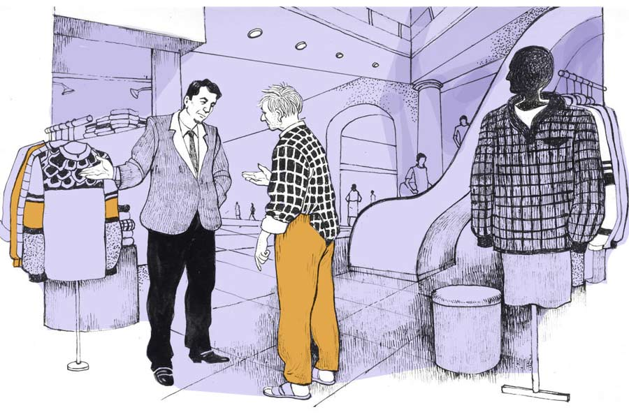

 
 <h1 align=center>টুকাইয়ের জন্য</h1>
<h2 align=center>চিরন্তন প্রামাণিক</h2> 

অফিস ছুটির পর ‘গ্রিন স্যালাড’ রেস্তরাঁটা পেরিয়ে সামান্য একটু এগিয়েছি, হঠাৎ বৃষ্টি শুরু হল জোরে। আকাশে কখন এত মেঘ জমেছিল আগে বুঝতে পারিনি, নইলে অফিসেই আর একটু সময় কাটানো যেত। এখন আর ফেরার উপায় নেই। ছাতাও আনিনি সঙ্গে। বাধ্য হয়ে সার্কাস রোডের পাশের আটতলা শপিং মলটায় ঢুকে পড়লাম দৌড়ে। নতুন হয়েছে মলটা। প্রচুর মানুষের ভিড়। সামনেই পুজো। আলো ঝলমল করছে উপর থেকে নীচ। সুন্দর সাজপোশাকে ঠাসা প্রতিটি দোকান। ঢোকা মাত্রই ঠান্ডা হাওয়ার সঙ্গে সঙ্গে একটা দুর্লভ সুগন্ধ নাকে এল। প্রাণভরে শ্বাস নিলাম, আহ্! পৃথিবীতে এত সুন্দর জায়গা থাকতে পারে! সত্যি, এখানেই মানুষের রোজ আসা উচিত। এখানে না আসতে পারাটা জীবনের সার্বিক ব্যর্থতা।

আমি কোনও দিন এত বিলাসবহুল শপিং সেন্টারে কেনাকাটা করিনি। শুধু করিনি বলা ভুল, করার কথা ভাবিওনি। কারণ, আমার আর্থিক অক্ষমতা। অফিসের মাইনেয় খাওয়া-পরা আর মেয়ে টুকাইয়ের পড়াশোনার খরচ চালাতে গিয়েই নাভিশ্বাস উঠে আসছে। ইংরেজি স্কুলে আকাশছোঁয়া বাজেট। দামি দামি বই, ইউনিফর্ম। আজ পেরেন্ট’স ডে, কাল চিলড্রেন’স ডে, পরশু ড্রামা কম্পিটিশন। প্রতিটি অনুষ্ঠানে আলাদা আলাদা পোশাক, আনুষঙ্গিক সাজ-সরঞ্জাম। বার্বি গাউন, রঙিন জুতো, ককটেল ড্রেস। প্রতি বছর লাফিয়ে লাফিয়ে বেড়ে চলা টিউশন ফিজ়।

আমার মেয়েদের স্কুলের অধিকাংশ বাচ্চাই দেশি-বিদেশি হাল ফ্যাশনের গাড়িতে চড়ে স্কুলে আসে। টিফিনে স্ট্রবেরি পেস্ট্রি, অ্যাভোকাডো টোস্ট, চিজ়-চিকেন দেওয়া বার্গার খায়। ছুটির সময় গর্বিত মায়েরা চোখে দামি রোদচশমা পরে স্কুলের গেটে অধীর আগ্রহে তাদের ছেলেমেয়ের জন্য অপেক্ষা করে। আধা হিন্দি, আধা ইংরেজিতে নিজেদের মধ্যে মত বিনিময় করে। কার ভাই লন্ডনে থাকে, কার দিদি লাস্ট সামারে ফিনল্যান্ড বেড়াতে গেছিল। মিসেস সেন বলেন, “তুতাই ইজ় ড্রিমিং ফর নাসা।” মিসেস রয় উত্তর দেন, “রেহান হ্যাজ অলরেডি স্টার্টেড ফর নিট।” ক্লাস সেভেন থেকে যে বাচ্চা ডাক্তারি পরীক্ষার প্রস্তুতি নিতে শুরু করেছে, সে নিশ্চয়ই বড় হয়ে বিধান রায়কেও ছাড়িয়ে যাবে!

রুমা যখন দুপুরে টুকাইকে স্কুল থেকে নিয়ে বাড়ি ফেরে, আমি তখন বেসরকারি অফিসের আলো-আঁধারি ছোট ঘরে বসে আনমনে কলম পিষি। জীবনকে ভুলে জীবিকার সঙ্গে পাঞ্জা লড়ি। অডিট রিপ্লাই, ক্যাশ বুক, বিল-ভাউচার, লেনদেনের প্রতিটি হিসাব মেলাতে মেলাতে ভুলে যাই নিজের সংসারের কথা, নিজের স্বপ্নের কথা। বিয়ের পর পনেরোটা বছর পেরিয়ে গেল, এখনও রুমাকে একজোড়া বালা কি একটা মান্তাসা গড়িয়ে দিতে পারিনি। ম্যানেজমেন্ট আমাকে প্রতিনিয়ত নির্মম ভাবে দোহন করে চলে। স্ত্রীর হাতে সংসারের দায়িত্ব, ঘরের কাজ, বাইরের কাজ, টুকাইয়ের ভবিষ্যৎ, সব কিছু সঁপে দিয়ে আমি একটা কেজো, রুক্ষ পৃথিবীতে জীবনযাপন করি।

রুমাকেও ভিন্ন এক ধরনের প্রতিকূলতার সঙ্গে লড়তে হয়। এই অসম পৃথিবীতে সে যখন রিকশায় চেপে টুকাইকে আনতে যায়, তখন অন্য দিকে দাঁড়িয়ে থাকে বিত্তশালী, সুপ্রতিষ্ঠিত একটা সমাজ। রুমার জন্য বরাদ্দ থাকে করুণা, তাচ্ছিল্য আর উপেক্ষা। আমি জানি— হীনম্মন্যতা, একাকিত্ব, না পাওয়ার যন্ত্রণা রুমাকে গ্রাস করে। সব জেনেও আমি কিছু করতে পারি না। রাতের আকাশের দিকে তাকিয়ে মনে হয়, বাবা হিসেবে অথবা স্বামী হিসেবে, বলা যেতে পারে সব অর্থেই আমি এক জন সাকসেসফুল ফেলিয়োর।

“দাদা, আপনি? এখানে?”

বৃষ্টি দেখতে দেখতে আমি অন্যমনস্ক হয়ে পড়েছিলাম। সামনে তাকিয়ে দেখি রাজীব দাঁড়িয়ে। রাজীব আমার অফিসেই মার্কেটিং অফিসার হিসেবে কয়েক বছর আগে জয়েন করেছে। আগে অন্য কর্পোরেটে ছিল। বয়সে আমার চেয়ে কিছুটা ছোট, কিন্তু ভীষণ সপ্রতিভ। চোখেমুখে কথার খই ফুটছে। শক্ত ক্লায়েন্টকে হাতের মুঠোয় নিয়ে আসতে ওর জুড়ি মেলা ভার। প্রাইভেট কোম্পানিতে উন্নতি করতে যা যা গুণ থাকা দরকার, তার সবই রাজীবের মধ্যে আছে।

“হঠাৎ বৃষ্টি নামল, তাই মাথা বাঁচাতে ঢুকে পড়লাম,” আমি স্মিত হেসে জবাব দিলাম।

“শিট, এটা কোনও এক্সকিউজ়? একটা গাড়ি নিয়ে নিন! আজকাল বাসে ট্রেনে যাতায়াত কোনও ভদ্রলোকের পক্ষে সম্ভব?”

রাজীব এত সহজে গাড়ি কেনার পরামর্শ দিল, যেন গাড়ি কেনা পাড়ার গুমটি থেকে একটা গায়ে মাখার সাবান অথবা দাঁতের মাজন কেনার মতো ব্যাপার। আমি বাড়ি থেকে রোজ বাস বা অটো ধরে অফিসে আসি। অল্প রাস্তা। এ অভ্যেস চাকরির সেই প্রথম দিন থেকেই। রাজীব হয়তো নিজের অজানতেই ভদ্রলোকের সঙ্গে তুলনাটা করে ফেলেছে। আমি গায়ে মাখলাম না। সব কথা ধরতে নেই। তাতে মনখারাপ ছাড়া আর কিছু হয় না। জীবনের অধিকাংশ ক্ষেত্রে নীরব থেকে সরে আসার মতো মহান শিক্ষা আর দু’টি নেই।

একটু লজ্জিত হয়েই বললাম, “আমার পক্ষে গাড়ি কেনা সম্ভব নয় রাজীব। শুধু গাড়ি তো নয়, সঙ্গে তেল, মেনটেনেন্স, ট্যাক্স, ইনশিয়োরেন্স। তার চেয়ে এই ভাল আছি।”

আমার বক্তব্য বাঁ হাতের তেলোর ঝাপটায় যেন মাছি ওড়ানোর মতো করে উড়িয়ে দিল রাজীব, বলল, “হোপলেস মিডল-ক্লাস মেন্টালিটি! নদীতে না নেমেই ‘কত জল, কত জল’ বলে চিৎকার! এই জন্যই বাঙালির এত অধঃপতন। কিস্যু হবে না আপনার দ্বারা। গাড়ির জন্য এখন গ্যাঁটের কড়ি খরচ করতে হয় না। ব্যাঙ্ক রেডি, শুধু আপনি বললেই হল...” তার পর ফিসফিস করে বলল, “আর আপনি কোম্পানির অ্যাকাউন্টস দেখেন। অফিসের সব গাড়ির বিল আপনার হাত দিয়েই পাশ হয়। আপনি তেলের চিন্তা করছেন? ছ্যাঃ!”

রাজীবের ‘ছ্যাঃ!’ আমার মুখে থুতুর মতো ছিটকে এসে লাগল। আমি কী বলব ভেবে পাচ্ছিলাম না। হাজার হাজার ওয়াট আলোর সামনেও আমি ভিতরে ভিতরে শামুকের মতো কুঁকড়ে গেছিলাম। এই শপিং মল, এত আড়ম্বর, এত আধুনিকতা, রাজীব, এরা সবাই আমাকে পিছনে ফেলে হাজার হাজার আলোকবর্ষ এগিয়ে গেছে। এ জীবনে আমি ওদের পৃথিবীকে ছুঁতে পারব না। যেখান থেকে জীবন শুরু করেছিলাম, আজও আমি সেখানেই আটকে আছি। এখনও দু’কামরার ছোট ফ্ল্যাট, সাইকেলে বাজার, সাদাকালো টিভি, মাটিতে বসে খাওয়া, লোডশেডিংয়ের সময় হাতপাখা।

আমার দীর্ঘশ্বাসের শব্দ, শপিং মলের কোলাহলে চাপা পড়ে যাচ্ছিল। এমন সময় রাজীবের আট বছরের ছেলে এসে আমাকে বিপদের হাত থেকে রক্ষা করল।

“ড্যাডি, উই আর গেটিং লেট।”

আমার দিকে তাকিয়ে রাজীব বলল, “আমার ছেলে, অঙ্কুশ। ছ’টা টিউশন। তার সঙ্গে যোগা, সাঁতার আর ভায়োলিন। এক্সট্রা কারিকুলার না শিখলে বাচ্চার বিকাশ সম্পূর্ণ হয় না। ভাবছি ফ্রেঞ্চটাও শিখিয়ে দেব। আজ ম্যাথস টিচার পড়াবেন না। তাই ওকে নিয়ে বেরিয়েছি।”

অঙ্কুশের এক হাতে রাস্কিন বন্ডের ‘কালেকশন অব শর্ট স্টোরিজ়’, অন্য হাতে টিনটিনের নতুন সেট। ট্রলিতে নানা রকম খেলনা, অ্যাবাকাস, পাজ়ল। বই, খেলনা এত কিছু দেখে এক রকম লোভই হল। টুকাই দারুণ বই ভালবাসে। আমাকে কত দিন বলেছে, “বাবা, হেমিংওয়ে পড়ব, বিভূতিভূষণের ‘চাঁদের পাহাড়’ পড়ব, রাশিয়ান রূপকথা পড়ব।”

টুকাইয়ের ফেলিয়োর বাবা তাকে সে সব কিছুই কিনে দিতে পারে না। এখনও সে পুরীর সমুদ্র দেখেনি। গত বার পুজোর সময় বোধগয়া যাব বলে বাক্স গুছিয়েও যাওয়া হয়নি। নতুন এম ডি মিস্টার পারেখ পরিষ্কার বলেছিলেন, “আপনার ফ্যামিলির ইন্টারেস্টের চেয়ে অনেক বেশি গুরুত্বপূর্ণ কোম্পানির ইন্টারেস্ট।”

রাজীব ওর স্ত্রীর সঙ্গে পরিচয় করিয়ে দিল। ভদ্রমহিলার চোখেমুখে সীমাহীন গর্বের ছাপ। উনি আমার নমস্কার প্রায় উপেক্ষা করেই ছেলেকে বললেন, “ইট’স গেটিং ডার্ক। ইউ হ্যাভ ইয়োর সুইমিং ক্লাস। লেট’স গো।”

শপিং মল থেকে বেরিয়ে নিজের অজানতেই মনটা ভারী হয়ে গেল। এখনও টিপটিপ বৃষ্টি হচ্ছে। রাস্তায় মানুষের স্রোত। কেউ কারও বাবা, কেউ কারও মা। স্বামী, স্ত্রী, রাঙামাসি, ফুলপিসি, বৃদ্ধ, বৃদ্ধা। অসংখ্য সম্পর্ক, অসংখ্য মন পরস্পর পরস্পরকে না চিনেও, না জেনেও পাশাপাশি হেঁটে চলেছে। মানুষের জীবন সত্যিই অদ্ভুত! ফুটপাত ধরে এগোতে লাগলাম। রুমা বাড়ির জন্য মাখন, পাউরুটি নিয়ে যেতে বলেছিল। তিনমাথার মোড়ে এসে দাঁড়ালাম। দশরথের দোকানে গরম শিঙাড়া ভাজছে। পুরো চত্বরে মশলা আর হিংয়ের গন্ধ। আমি দাঁড়িয়ে পড়লাম।

হঠাৎ এক জন লোক আমাকে দেখে এগিয়ে এলেন। গায়ে বেশ দামি পোশাক, মাথায় পানামা হ্যাট, হাতে বিদেশি ঘড়ি। জুতোও বেশ দামি মনে হল। চোখেমুখে খুশির ছটা। আমাকে অবাক হয়ে তাকিয়ে থাকতে দেখে ভদ্রলোক নিজেই বললেন, “কী, চিনতে পারছ?”

“নীলাদ্রিদা?” আমি কিন্তু-কিন্তু করে বললাম।

“যাক, চিনতে পেরেছ তা হলে। সেই এইটি সিক্স, বিশ্বভারতী, অ্যাঁ! কত দিন পর দেখা হল! তার পর, কী করছ?”

“তেমন কিছু নয়। একটা বেসরকারি অফিসে...”

নীলাদ্রিদা মনে মনে তৈরিই ছিলেন। আমার উত্তরটা শুনতেও চাননি সম্ভবত, কিংবা ধরেই নিয়েছিলেন আমার পক্ষে ওঁর চেয়ে বেশি সফল হওয়া সম্ভব নয়। তাই আমার উত্তর শেষ হওয়ার অপেক্ষা না করেই শুরু করলেন, “আমি তো সেন্ট্রাল এক্সাইজ়ে আছি ভায়া। স্ত্রী ফরেন ব্যাঙ্কে। ছেলেকে পাঠিয়েছি ইউরোপ।”

তিনটি বাক্য যেন জীবনের তিনটি মহৎ উত্তরণ। চরম সিদ্ধিলাভ। যেন পৃথিবীর এই তিনটি শৃঙ্গই মনুষ্যজাতির কাছে এত দিন অধরা ছিল, নীলাদ্রিদাই প্রথম সিদ্ধপুরুষ যিনি এই তিনটি দুর্গম গিরিকে হেলায় লঙ্ঘন করেছেন। আমি কী উত্তর দেব বুঝতে না পেরে মধ্যবিত্ত মানসিকতায় মুখ নিচু করে ছিলাম। কিন্তু নীলাদ্রিদা বলেই চললেন, তাঁর বিলাসবহুল বাড়ি, গাড়ি, ফ্ল্যাটের ইএমআই, ফরেন ট্রিপ, ছেলের সোনালি ভবিষ্যতের কথা। কোনও ব্যর্থতা নেই, অভাব নেই, কান্না নেই, গলার কাছে চেপে ধরা কষ্ট নেই। মনে হল, এই কথাগুলো বলার জন্যই উনি রাস্তায় কাউকে খুঁজছিলেন। আমাকে বলতে পেরে অনেকখানি হালকা হলেন।

“শোনো, তোমার মেয়েকে বোলো, শুধু মুখ গুঁজে পড়লেই হবে না, জীবনে অ্যাম্বিশন থাকাটা খুব জরুরি। নইলে লবডঙ্কা। চলি হে...” উপদেশ শেষ হলে নীলাদ্রিদা আমাকে ফেলে জনারণ্যে মিশে গেলেন। আবার হতাশার চাদর শীতের কুয়াশার মতো আমাকে মুড়ে ধরল। চার দিকে কত সফল লোক! কেউ আমার মতো ব্যর্থ নয়। কেউ কোনও দিন রাস্তায় হোঁচট খায়নি। জল খেতে গিয়ে গলায় বিষম লাগেনি। কেউ কোনও দিন প্রেমে প্রত্যাখ্যাত হয়নি। কারও স্ত্রী রিকশায় বাড়ি ফেরেনি। কারও মেয়ে টিফিনে সুজির হালুয়া খায়নি। কেউ রাস্তায় আখের রসের জন্য অপেক্ষা করেনি... একমাত্র ব্যতিক্রম আমি। আমি আমার মেয়েকে ভাল টিউশন দিতে পারি না। ফি-সপ্তাহ দামি রেস্তরাঁয় ব্যাম্বু বিরিয়ানি খাওয়াতে পারি না। ক্যারাটে ক্লাসে দিতে পারিনি। নিদেনপক্ষে একটু সময় বার করে মেয়েকে অঙ্ক, বাংলা দেখাতে পারি না। একা একাই অনামী আগাছার মতো বেড়ে উঠছে আমার আত্মজা।

বোধহয় নিজের ভাবনায় বিভোর ছিলাম। পিডব্লিউডি-র কাজের জন্য রাস্তায় গর্ত ছিল। খেয়াল করিনি। হোঁচট খেয়ে মুখ থুবড়ে পড়লাম। পাউরুটি, মাখনের প্যাকেট ছিটকে গিয়ে জল-কাদায় মিশে গেল। মনে হল, একটা অতিকায় স্বার্থপর সভ্য সমাজ, অযোগ্য ‘আমি’টাকে পিছন থেকে ধাক্কা দিল। বেচারি টুকাই মাখন মাখিয়ে পাউরুটি খেতে ভালবাসে। আজ আর মাখন-পাউরুটি বাড়ি নিয়ে যাওয়া হবে না।

আমাকে পড়ে যেতে দেখে চায়ের দোকান থেকে এক জন কমবয়সি ছেলে ছুটে এল, “দেখে হাঁটবেন তো! এ হে, কপালটা বেশ কেটে গেছে! তাড়াতাড়ি বাড়ি যান দাদা।”

বাড়িতে ঢোকার ঠিক আগেই লোডশেডিং হয়ে গেল। ভাবলাম রুমাকে আর উৎকণ্ঠায় ফেলব না, কপালে রুমাল চেপে সোজা বাথরুমে চলে যাব। আস্তে আস্তে সদরের গেট খুললাম। জানলা দিয়ে লণ্ঠনের আলো আসছে। টুকাই মাটিতে বসে, সামনে বই। গৃহশিক্ষকহীন, অভিভাবকহীন, দামি দামি রেফারেন্স বইহীন, বাবার গাইডেন্সহীন, একটি দ্বাদশবর্ষীয়া কিশোরী অসম যুদ্ধে প্রাণপণ লড়ছে। সময়ের সঙ্গে, বৈভবের সঙ্গে, নিজের সঙ্গে। সে কি বোঝে তার বাবার অক্ষমতা, পরিবারের আর্থিক অনটন? সে কি বাবাকে কাছে না পাওয়ার অভিমানে জারিত হয় প্রতিনিয়ত?

দরজায় টোকা দিতে রুমা এসে দরজা খুলে দিল। দরজা খোলামাত্রই টুকাই দৌড়ে এসে আমাকে জড়িয়ে ধরল। মনে হল সে যেন আমার প্রতীক্ষাতেই মুহূর্ত গুনছিল। আমি কিছু বুঝে ওঠার আগেই ও আমার বুকে মাথা রেখে ফুঁপিয়ে ফুঁপিয়ে কাঁদতে শুরু করল। আমি রুমার দিকে জিজ্ঞাসু দৃষ্টিতে তাকালাম। রুমা আমার রক্তমাখা কপালের দিকে তাকিয়ে ভয় পেয়ে কিছু বলতে যাচ্ছিল, আমি তাকে আঙুলের ইশারায় চুপ থাকতে বললাম।

“বাবা!”

“কী হয়েছে মা? কাঁদছিস কেন?”

“আমি হেরে যাইনি বাবা। দেখবে, আমি এক দিন খুব বড় হব...” সে কাঁদতে কাঁদতেই বলল।

“হারবি কেন রে? তোর কপালে যে জয়তিলক জ্বলজ্বল করছে রে মা! আমি তোকে সময় দিতে পারি না। ভাল খাবার, ভাল বই কিছুই দিতে পারি না... কিন্তু তুই সব বাধা টপকে যাবি। দেখিস।”

রুমা কখন সরে এসে আমার ক্ষতস্থানে শাড়ির আঁচল চেপে ধরেছে বুঝতে পারিনি। আমার ঘাড়ে মাথা রেখে নিজের চেপে রাখা আনন্দ, মেয়ের কান্নায় ভিজিয়ে বলল, “জানো, আজ আমাদের মেয়ে ফিজ়িক্স অলিম্পিয়াডে গোল্ড মেডেল পেয়েছে। এ বার থেকে টুকাই হোমি জাহাঙ্গির ভাবা স্কলারশিপ পাবে। স্কুলে সবাই আড়ালে বলাবলি করত, ওর কোচিং নেই, গাইড নেই। পারবে না।”

আমি ব্যথা ভুলে আনন্দে কেঁদে ফেললাম। বাবার সীমাবদ্ধতাকে হৃদয় দিয়ে অনুভব করা টুকাই আমার চেয়ে অনেক বড় হয়ে গেছে। অনুভবে, বিশ্বাসে, প্রতিজ্ঞায়, দৃঢ়তায়। এই কান্না সমস্ত প্রতিকূলতাকে জয় করার নমনীয় প্রকাশ। আমি যে বয়সে পেশাদার পৃথিবীর কঠিন প্রতিযোগিতাকে চিনেই উঠতে পারিনি, সেই বয়সে টুকাই বাকিদের পিছনে ফেলে চূড়ায় পা রেখেছে। আমার সমস্ত অক্ষমতাকে ঢেকে দিয়েছে টুকাই, আমার একমাত্র মেয়ে। আমি ওকে আরও শক্ত করে জড়িয়ে ধরলাম।

