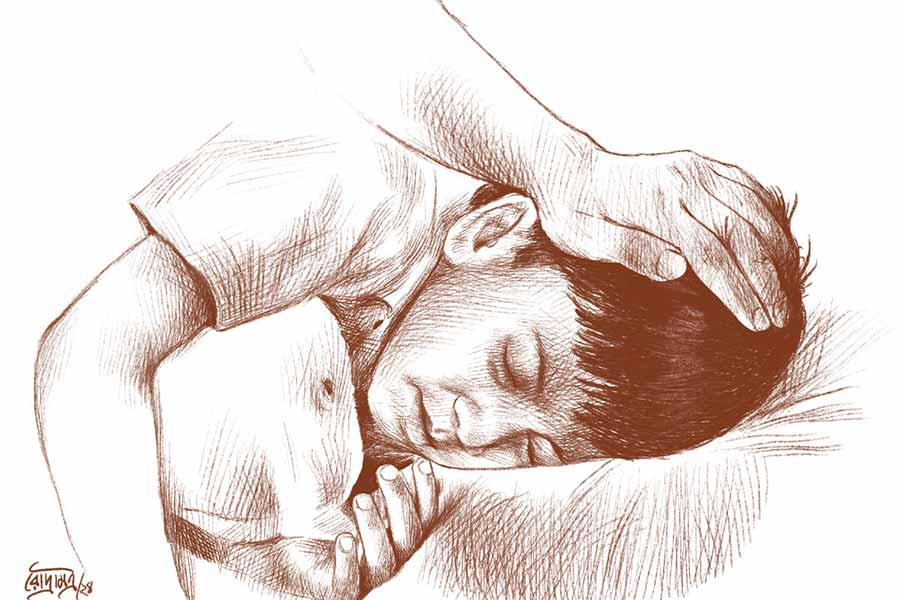

 
 <h1 align=center>টুকুসের মা</h1>
<h2 align=center>সিঞ্চিতা বসু</h2> আলস্য জড়ানো চোখে ঘড়ি দেখল দেবব্রত। সাতটা পনেরো। টুকুসটা ঘুমোচ্ছে, গভীর ঘুমে চার বছরের ছোট্ট বুকটা ক্রমাগত ওঠানামা করছে। একটু সাঁইসাঁই শব্দও হচ্ছে। গত দু’রাত একেবারেই ঠিক করে ঘুমোতে পারেনি ছেলেটা। সর্দি-কাশি বেশ ভালই ধরেছিল। সামান্য উত্তাপও ছিল গায়ে।

আজ রবিবার, অফিস নেই বলে দেবব্রত বিছানা ছাড়ল না। ছেলের পাশেই শুয়ে তার গায়ে মাথায় হাত বুলিয়ে দিতে লাগল। ছেলেটা বড্ড সর্দি-কাশিতে ভোগে। একদম মায়ের ধাত পেয়েছে। অদিতিরও একটুতেই ঠান্ডা লেগে যেত। টুকুস জন্মানোর আগে কী ভীষণ সাবধানে থাকত! তবু শেষরক্ষা হল কোথায়? প্রথম থেকেই অসম্ভব শ্বাসকষ্ট, বার বার ইনহেলার ব্যবহার করেও কষ্ট লাঘব হচ্ছিল না। ডাক্তারবাবুরও কড়া অ্যান্টিবায়োটিক দিতে দ্বিধা ছিল। অবশেষে মাস দেড়েক আগেই বাধ্য হয়ে প্রি-ডেলিভারি। টুকুসের ছোট্ট শরীরটা যখন প্রথম পৃথিবীর আলো-বাতাস গ্রহণ করছে, তার মা তখন অন্ধকারের দেশে। অক্সিজেন এবং সব রকম সাপোর্ট সিস্টেমকে অগ্রাহ্য করে, ছেলের মুখ না দেখেই অদিতি চিরতরে ঘুমিয়ে পড়েছিল।

দেবব্রত ছেলের গায়ে পাতলা চাদরটা টেনে দিয়ে কপালে আলতো চুমু খেয়ে নেমে এল একতলায়। বাবা সোফায় বসে, চোখ খবরের কাগজে নিমগ্ন। মা প্রতিদিনের মতো মিনাপিসির সঙ্গে রান্নাঘরে ব্যস্ত, নাতিবাবু ওঠার আগেই যত তাড়াতাড়ি সম্ভব কাজকর্ম গুছিয়ে নেওয়ার চেষ্টা চলছে। চায়ে চুমুক দিতেই রবিবাসরীয়টা এগিয়ে দিল বাবা, “গত সপ্তাহে এই বিজ্ঞাপনটা দেখেছিলাম। আজও পাত্র চাই কলামে এঁদের একই বয়ানে বিজ্ঞাপন। এক বার পড়ে দেখো।”

দেবব্রত বিরক্ত হয়ে বলল, “কাগজের অন্য কোনও খবরে কি তোমার ইন্টারেস্ট নেই? শুধু পাত্রীদের ঠিকুজি-কুষ্ঠিতেই যত আগ্রহ!”

এ বার বাবার গলা বেশ গম্ভীর, “টুকুসের পিছনে ছুটতে ছুটতে তোর মায়ের কী অবস্থা হচ্ছে তা নজরে পড়ে? রাতে হাঁটুর যন্ত্রণায় ঘুমোতে পারে না। মুড়ি-মুড়কির মতো পেনকিলার খায়।”

বাবাকে থামিয়ে দিয়ে দেবব্রত বলল, “আমি মায়ের কষ্ট যথেষ্ট বুঝি। তোমাদের দু’জনেরই যা বয়স ও অসুস্থতা, তাতে একটা দুরন্ত বাচ্চাকে সামলানো অসম্ভব, সেই জন্যই বার বার আয়া রাখতে চেয়েছি।”

“আর আমরাও বার বার বলেছি যে মা-মরা শিশুটার ঠিকমতো যত্নের প্রয়োজন, যা মাইনে-করা লোক দিয়ে হয় না,” বাবার সটান জবাব।

সক্কাল সক্কাল এ ধরনের কথা শুনতে অসহ্য লাগছিল, তাই ‘টুকুসের ঘুম ভাঙল কি না দেখি’ বলে দেবব্রত দোতলায় উঠে টুকুসের পাশে শুয়ে পড়ল। ছেলেটা এখনও গভীর ঘুমে। কাছেই একটা স্কুলে ভর্তি করানো হয়েছে টুকুসকে। স্কুলটা তেমন নামকরা নয়, কিন্তু বাবার আসা-যাওয়ার সুবিধে হয়েছে। ছেলেটা ছোট্ট আঙুলগুলো দিয়ে দাদুর শিরা-ওঠা হাত আঁকড়ে বাড়ি ফেরার পথে ফ্যালফেলিয়ে তাকায় অন্য শিশুদের দিকে। মায়েরা আঁচল দিয়ে সন্তানদের মুখ মুছিয়ে দেয়, টিফিনবক্স থেকে জোর করে খাইয়ে দেয়, কোলে তুলে নেয়। প্রতিনিয়ত জীবনের গল্প বদলে যায়। জীবন থেকে টুপটাপ ঝরে যায় সুখ-শান্তি, আশা-আকাঙ্ক্ষার শিশিরবিন্দু। বইতে থাকে মনখারাপের গুমোট বাতাস।

দুপুরে খাবার টেবিলেও সেই একই প্রসঙ্গ। বাবাকে এমন জোরাজুরি করতে আগে দেখেনি দেবব্রত, মারও মুখ থমথমে। খবরের কাগজের পাতাটা তার দিকে এগিয়ে দিল বাবা, একটা বিজ্ঞাপনে গোল দাগ দিয়ে মার্ক করা। দেবব্রত অনিচ্ছার সঙ্গে চোখ বোলাল। রিটায়ার্ড ভদ্রলোকের একমাত্র কন্যা, ফর্সা, পাঁচ ফুট তিন ইঞ্চি উচ্চতা ইত্যাদি মামুলি ডেসক্রিপশন। একটা জায়গায় হঠাৎ চোখ আটকে গেল দেবব্রতর। বিজ্ঞাপনের শেষ লাইনে লেখা, ‘শিশুসন্তান-সহ বিপত্নীক ছাড়া যোগাযোগ নিষ্প্রয়োজন’।

বছরখানেক ধরেই খবরের কাগজের বিজ্ঞাপন দেখে বেশ কিছু পাত্রীপক্ষের সঙ্গে যোগাযোগ করেছে বাবা। তারা প্রথমে দেবব্রতর ব্যাঙ্কে চাকরির কথা শুনে বেশ আগ্রহ দেখিয়েছে। ছেলে আছে শুনে পরে পিছিয়েও গেছে। তাদের মধ্যে ডিভোর্সি ও বিধবা সবই ছিল। এই মেয়েটি অবশ্য ও রকম কোনও দলেই পড়ে না। তা হলে? এ রকম অদ্ভুত শর্ত? দেবব্রতর মন থেকে খচখচানিটা যাচ্ছে না। টুকুসকে মায়ের স্নেহ-ভালবাসা পাইয়ে দেওয়ার জন্য বাবা-মা এতটাই মরিয়া হয়ে উঠেছে যে, তাদের মনে কোনও রকম সন্দেহের উদ্রেক হচ্ছে না।

পরদিন সকালে দেখা গেল টুকুস বেশ সুস্থ। পুরোদমে দুরন্তপনা শুরু করে দিয়েছে। দাদু-ঠাম্মার চোখে অবশ্য সে নাকি এখনও পুরোপুরি সেরে ওঠেনি। তাই তাকে স্কুলে পাঠানো উচিত নয় এবং এ ব্যাপারে দেবব্রতর ওজর-আপত্তি টিকল না।

“যা ইচ্ছে করো... আমি আর কী বলব!” বলে সে বেরিয়ে পড়ল। দেবব্রত নিশ্চিত যে বাড়ি ফিরে দেখবে, বাবা চোখ বুজে ইজ়িচেয়ারে আধশোয়া, মা হাঁটুতে ব্যথার মলম ঘষছে এবং তাদের নাতিবাবু কার্টুন দেখতে দেখতে হেসে গড়িয়ে পড়ছে।

মনটা বিষাদে ডুবে তেতো হয়ে আছে। যদি টুকুসের মায়ের বদলে বাবা চিরবিদায় নিত, তবে কি টুকুসকে সামলাতে না পেরে অদিতিকে বিয়ে করতে বাধ্য হতে হত? নাহ! এখানেই নারীজাতির বিশেষত্ব। ওরা এক সঙ্গে সব পারে। অনেক আগে তারা শুধু সংসার সামলাত, এখন ঘরের সঙ্গে সঙ্গে বাইরের দুনিয়াতেও অংশ নেয়। তা বলে তারা কিন্তু সংসার চালানো ভুলে যায়নি, দু’হাতে দু’দিকই সমান ভাবে ধরে রাখতে পারে। এক জন পুরুষমানুষ সে রকম পারে কি? হয়তো দু’টি ক্ষেত্রেরই ব্যতিক্রম আছে। হয়তো কেন, নিশ্চয়ই আছে। কিন্তু ব্যতিক্রম তো নিয়মকেই প্রমাণ করে। সে তো নিজেকে দিয়ে বুঝছে যে, ঘর আর বাইরে এক সঙ্গে সামলানো তার পক্ষে সম্ভব হচ্ছে না। বড্ড দিশেহারা লাগছে আজকাল।

দেবব্রত প্রায়ই কল্পনা করার চেষ্টা করে, অদিতি থাকলে সে কেমন করে টুকুসকে আদর করত, বায়না মেটাত। সে পারে না ভাবনার তরঙ্গ ছড়িয়ে দিতে, কল্পনা হোঁচট খেয়ে থমকে যায়। মনে পড়ে, বিয়ের পরে বড়দিনের ছুটিতে তাদের পাহাড়ে যাওয়া, অদিতির সে কী উচ্ছ্বাস! চটকপুরে সে বার বরফ পড়েছিল। ভোরবেলা হোম-স্টের কাচের জানালা দিয়ে বরফ পড়ে থাকতে দেখে দেবব্রতকে জোর করে ঘুম থেকে টেনে তুলেছিল। তার পর সোজা বাগানে। ঘাসে, চারা গাছের মাথায় তখন তুলো-তুলো তুষার। আজও দেবব্রত দেখতে পায় অদিতির পাগলামি। এক বার পেঁজা বরফ আঁজলা ভরে তুলে নিয়ে চেপে বল তৈরির চেষ্টা করছে, পরমুহূর্তেই দেবব্রতকে তাড়া দিচ্ছে ক্যামেরা নিয়ে আসার জন্য। সামনে তখন রাজকীয় কাঞ্চনজঙ্ঘা তার সবটুকু সৌন্দর্যের ডালি বিছিয়ে দিয়েছে, তার আভা অদিতির কপালে গালে মাখামাখি।

আর আজ! রাস্তায় চোখ নামিয়ে হাঁটে দেবব্রত। বাবা-মা আর তাদের সন্তানের রাস্তায় বেড়ানোর দৃশ্য চোখে পড়লে তার চোখ ঝাপসা হয়ে আসে। কোথাও হয়তো মায়ের হাতে আইসক্রিম ধরা, ছেলেটি বা মেয়েটি বেড়াতে বেড়াতে মাঝে মাঝে একটু করে খাচ্ছে। কোথাও বাসের সিটে ক্লান্ত শিশুটি মায়ের গায়ে হেলান দিয়ে ঘুমিয়ে পড়েছে, মায়ের হাতে স্কুলব্যাগ, জলের বোতল। কোনও রেস্তরাঁয় খেতে বসেছে তিন জনের ছোট পরিবার, ছোটজন খাওয়া নিয়ে বায়না জুড়েছে, তার মা তাকে চোখ পাকিয়ে শাসন করছে। দেখলে বুক হু-হু করে ওঠে দেবব্রতর। নিজেকে বড় দুর্ভাগা মনে হয় ওর, সেই সঙ্গে টুকুসকেও। কেন যে ওর সঙ্গেই এ রকম হতে হল! বার বার এমন চিন্তার আবর্ত ওর মনকে উথালপাথাল করে দেয়, যার শেষে পড়ে থাকে একটিই সিদ্ধান্তবাক্য— ঈশ্বর বড় নিষ্ঠুর।  

সেই অদ্ভুত বিজ্ঞাপনের মেয়েটির নামটা বেশ সেকেলে, যশোদা। বাবার জোরাজুরিতেই যোগাযোগ করা হয়েছে তাদের পরিবারের সঙ্গে। দেখা করতে যেতে নিমরাজি হয়েছে দেবব্রত। সেখানেও ও-পক্ষ থেকে এসেছে এক অদ্ভুত অনুরোধ। 

পাত্রীর বাবার একান্ত অনুরোধ যে, তাঁর মেয়ের ইচ্ছানুসারে প্রথম বার সাক্ষাতে দেবব্রত যেন টুকুসকে নিয়ে ওদের বাড়িতে যায়। অপরিচিত জায়গায় অচেনা লোকজনের মাঝে টুকুসকে নিয়ে যেতে দেবব্রত বিশেষ রাজি হয় না। মা-হারা ছেলে বলে সকলে বড় করুণার চোখে দেখে ওকে। আত্মজকে সকলের করুণার পাত্র হিসেবে দেখতে ভাল লাগে না দেবব্রতর। তাই দেবব্রত ওর আপত্তির কথা জানাল ওর বাবাকে, “প্রথমেই কী দরকার! আগে চেনাজানা হোক, তার পর না-হয় কখনও...” 

বাবা বললেন, “চিন্তা করিস না, আমিও তো যাচ্ছি। নাতিবাবুর কোনও অসুবিধে হবে না। তা ছাড়া কথাবার্তা বলে দেখেছি, ওঁরা বেশ সজ্জন ও অমায়িক।”

শেষ পর্যন্ত দাদুর মতই বহাল রইল। দাদু আর বাবার সঙ্গে টুকুস তখন বেড়াতে যাওয়ার জন্য উদ্‌গ্রীব। ক্যাব বুক করা হল। হাওড়া থেকে এসে ডায়মন্ড হারবার রোডে পড়তেই টুকুস ঘুমিয়ে কাদা।

টুকুসের ঘুম যখন ভাঙল, তখন তাঁরা মেয়ের বাড়ি পৌঁছে গেছেন। ঘুম ভেঙে সে বড় বড় চোখে চারপাশ দেখছে। দেবব্রতর বাবা আর পাত্রীর বাবা গল্প করছেন, পাত্রীর মা টুকুসকে কোলে নিয়ে ভিতরে গেছেন। দেবব্রতর দৃষ্টি মোবাইলে, কিন্তু মনে মনে পাত্রীর এমন অদ্ভুত চাহিদার কারণ হাতড়াচ্ছে। ‘সন্তান-সহ বিপত্নীক ছাড়া যোগাযোগ নিষ্প্রয়োজন’— কেন এমন চাহিদা?

হঠাৎ দেবব্রতর কানে এল দু’টি অসমবয়সি গলার হাসি আর কথার আওয়াজ, বাগান থেকে ভেসে আসছে। শিশুকণ্ঠটি টুকুসের আর নারীকণ্ঠটি কি পাত্রীর? টুকুসের সঙ্গে অল্প সময়ের মধ্যেই দেখা যাচ্ছে ভাব জমিয়ে নিয়েছে।

শিঙাড়া, মিষ্টি, চা— সবই খাওয়া শেষ। টুকুসকে কোলে নিয়ে যশোদা এসে বাবার পায়ে হাত দিয়ে প্রণাম করল। দেবব্রত এক পলক তাকিয়ে বুঝল, মেয়েটি একটুও সাজগোজ করেনি। টুকুসকে পাশে নিয়ে সে সোফায় বসল। এই সরলতা, একটি শিশুকে আপন করার চেষ্টা— এ সব কি কৃত্রিম? দেবব্রতর মন অদ্ভুত দোলাচলে আন্দোলিত হচ্ছে। এতটুকু আলাপে টুকুস নবপরিচিত মানুষটির মধ্যে কী এমন দেখল যে, তার কাছছাড়া হচ্ছে না? কোল ঘেঁষে বসে হাতে একটা চকলেট নিয়ে সকলের মুখের দিকে দেখছে! শিশুরা নাকি ভালবাসা চিনে নিতে পারে। তবে কি দেবব্রতর সন্দেহ অমূলক?

দেবব্রতর সংবিৎ ফিরল। অভিভাবকরা তাদের দু’জনকে কিছু কথা বলে পরিচিত হওয়ার সময় দিয়ে ঘর থেকে বেরিয়ে গেলেন।

যশোদা সপ্রতিভ গলায় বলল, “আপনার ছেলের সঙ্গে আমার কিন্তু বেশ ভাব হয়ে গেছে। মাঝেমধ্যে ওর সঙ্গে যদি ফোনে কথা বলি, তাতে আপনার আপত্তি নেই তো?”

দেবব্রত সম্মতি দিয়ে বলল, “কথা বলবেন, তবে ও কিন্তু খুব চঞ্চল। উল্টোপাল্টা বকেই যায়, থামাতে পারা যায় না।”

টুকুসের এখন কোনও দিকে লক্ষ নেই, চকলেট খেতে খেতে মাটিতে নেমে একটা প্লাস্টিকের ফুটবলে শট মারছে। দেওয়ালে ধাক্কা খেয়ে বলটা আবার ওর কাছেই ফিরে আসছে। দেবব্রতর অস্বস্তি হতে লাগল, কথাবার্তা বেশি দূর এগোনোর আগে তাকে প্রশ্নটা করতেই হবে। সে গলাখাঁকারি দিয়ে বলল, “একটা প্রশ্ন ছিল। আপনি বিজ্ঞাপনে এমন শর্ত দিয়েছেন কেন?”

দেবব্রতর মনে হল যশোদার মুখটা হঠাৎ যেন করুণ হয়ে উঠল, চোখ দুটো ভিজে গেল।

“আসলে কৌতূহল থেকে জানতে চাইলাম, যদি একান্ত অসুবিধে থাকে, তা হলে না-হয় থাক...” দেবব্রতর গলায় খানিক জড়তা।

ঈষৎ ধরা গলায় উত্তর এল, “বাবা কিন্তু আপনার বাবাকে সব কিছু বলেছেন। আপনাকেই শুধু জানানো হয়নি। আসলে আমিই চেয়েছিলাম আপনাকে সরাসরি সব জানাতে। সত্যিটা জানার পর আপনি কী ভাবে সেটা নেবেন, তার উপরই বাকি সব কিছু নির্ভর করছে।”

দেবব্রত কোনও কথা না বলে চোখে প্রশ্ন নিয়ে তাকিয়ে থাকে।

একটু থেমে যশোদা বলতে লাগল, “আজ থেকে সাড়ে তিন বছর আগে আমার ইউটেরাসে বেশ কিছু সিস্ট ধরা পড়ে। তা ছাড়াও ইউটেরাসের মুখ প্রায় বন্ধ করে রেখেছিল দুটো বড় বড় টিউমার। বাবা বেশ কয়েক জন বিশেষজ্ঞের পরামর্শ নিয়েছিলেন। সবারই একমত, ইউটেরাসটা বাদ দিতে হবে। তার পর অপারেশন করার সময় ওভারিটাও বাদ গেছে। জানেন, আমি এ সব কিছুই জানতাম না। পরে জেনেছি, জেনে খুব ভেঙে পড়েছিলাম। আসলে আমি ছোট থেকে খুব বাচ্চা ভালবাসি। মনে মনে ভাবতাম বিয়ে করেই খুব তাড়াতাড়ি মা হয়ে যাব। এখনকার যুগে এমন স্বপ্ন মনে হয় খুব একটা কেউ দেখে না, বেশির ভাগ মেয়ে খুব কেরিয়ার-সচেতন। আমি সেখানে শুধু এক জন ভাল মা হতে চাইতাম। আমার বছরের পর বছর ধরে গড়ে তোলা সেই স্বপ্নের ইমারত ধূলিসাৎ হয়ে গেল। এতটাই যন্ত্রণায় ছিলাম যে, গভীর ডিপ্রেশনে চলে গিয়েছিলাম। কাউন্সেলিংও খুব একটা কাজ দেয়নি। মনের ডাক্তার ঘুমের ওষুধ দিলেন।”

দেবব্রত দেখছিল, জলভরা চোখে পাথরের মতো বসে থাকা একটি মেয়ের শুধু ঠোঁট নড়ছে আর কিছু যন্ত্রণাদীর্ণ স্মৃতি উচ্চারিত হচ্ছে। এখন শুধুই স্তব্ধতা। টুকুসের ফুটবল খেলা হয়ে গেছে। সে কখন যেন সোফায় উঠে বসেছে যশোদার গা ঘেঁষে। বড় বড় চোখে যশোদার মুখের দিকে তাকিয়ে তার কষ্টের কারণ বোঝার চেষ্টা করছে আর নিঃশব্দে চকলেট মাখা আঙুল যশোদার শাড়ির আঁচলে মুছে চলেছে।

ধরা গলায় যশোদা বলতে লাগল, “আমি একটু একটু করে সামলে নিচ্ছিলাম। তার পর বাবা-মাকে জানিয়েছিলাম আমার ইচ্ছের কথা। এমন জায়গায় যেন আমার বিয়ে দেওয়া হয়, যেখানে মা-হারা কোনও শিশুকে আমি যেন আঁকড়ে ধরে বাঁচতে পারি। অনেকে পরামর্শ দিয়েছিল বিয়ের পরে বাচ্চা দত্তক নেওয়ার কথা। কিন্তু এতে আমার মন সায় দেয়নি।”

“কেন?” দেবব্রত জানতে চাইল।

“দত্তক নেওয়া নিঃসন্দেহে মহৎ কাজ, কিন্তু ভেবে দেখুন, আমি তো কখনও কোনও সত্য গোপন করতে পারব না, আর আমার সন্তান ধারণে অক্ষমতার কথা জেনে কে-ই বা বিয়ে করতে চাইবে? এমন তো অনেক শিশু থাকে, যাদের শুধু মায়ের কোল ছাড়া সব আছে, তেমন কাউকে আঁকড়ে ধরে প্রাণ ঢেলে ভালবাসতে চেয়েছিলাম। টুকরো হয়ে যাওয়া স্বপ্নকে সত্যি করতে চেয়েছিলাম।”

জানালা দিয়ে এক চিলতে মিঠে আলো এসে যশোদার মুখে পড়েছে, কনে দেখা আলো। টুকুস খেলতে খেলতে ক্লান্ত হয়ে সোফায় বসে ঢুলছে। যশোদা কোলে শুইয়ে তার চুলে বিলি কেটে দিচ্ছে। টুকুসের মুখটা হাসিমাখা, মায়ের মুখে শুনেছে একে নাকি দেয়ালা বলে। ও কি ভাল কোনও স্বপ্ন দেখছে? আর দেবব্রত দেখছে টুকুসের চুলে যেন একটা ময়ূরের পালক, ওকে ঠিক একটা ছোট্ট গোপালের মতো লাগছে। সেই ছোট্ট রাখালরাজাকে যশোদা মা ঘুম পাড়াচ্ছে, একটু পরে ঘুম ভেঙে দুষ্টুমি করে যশোদা মাকে নাজেহাল করবে আর খিলখিল করে হাসবে।

দেবব্রতর মনে হয়, অনেক না-পাওয়া টুকরো জোড়া দিয়ে সকলের অলক্ষে যে ঈশ্বর পূর্ণতা নির্মাণ করে চলেছেন অক্লান্ত ভাবে, তিনি সব সময় নিষ্ঠুর নন। কখনও কখনও তাঁর দয়ার আলো অনেক অন্ধকার মুছে দেয়।