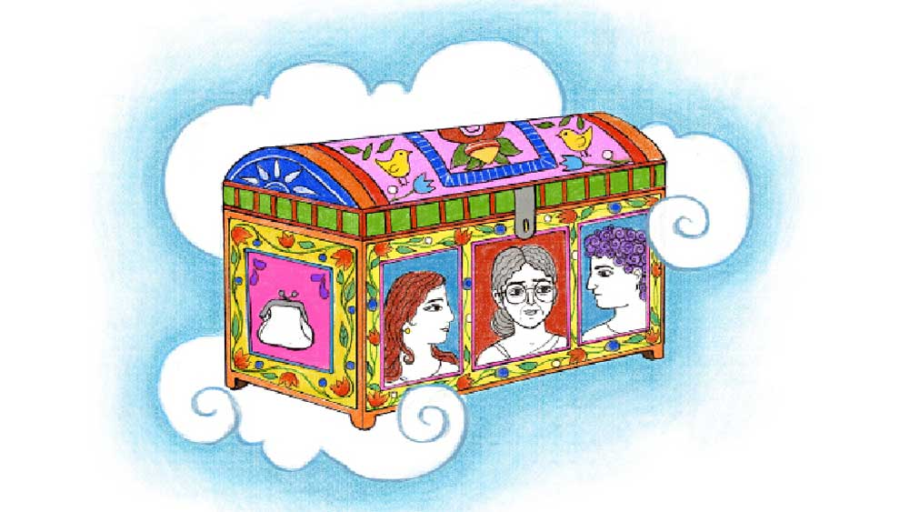

 

<h1 align=center>ট্রাঙ্ক</h1>
<h2 align=center>মোনালিসা চন্দ্র</h2>
সমস্যা হল ট্রাঙ্কের তালাটা নিয়েই। চাবি পাওয়া যাচ্ছিল না ওটার। লীলা একটা কৌটো-ভর্তি নানা সাইজ়ের নানা চেহারার চাবি এনে হাজির করল। বাড়িতে যেখানে যত এলেবেলে চাবি পায়, সব এনে ওই কৌটোটায় ভরে রাখে লীলা। বাড়ির সব তালার চাবিই মোটামুটি পাওয়া যায় ওই কৌটো থেকে। তবে আজ পাওয়া গেল না। তালা ছেড়ে এ বার অন্য দিকে মন দিল পলাশ। ওদের বাড়িতে তিনটে ঘর। তার একটা ঘরের সব জিনিসপত্র বার করে এনে অন্য দুটো ঘরে আজ ধরাতে হবে পলাশকে। চৌকিটা যে বার করতে হচ্ছে না, এটা একটা বড় বাঁচোয়া। কোথাও ধরানো যেত না ওটাকে। যারা আসছে তারা চৌকিটা ব্যবহার করতে রাজি হয়েছে।   পলাশরা এখন দু’জন মানুষ, তবে জিনিসপত্র দু’জনের নয়। মা-বাবার জিনিস রয়েছে, ঠাকুমা-দাদুর রয়েছে। গেরস্ত ঘরের এটাই দস্তুর। 
পুরনো হওয়ার অপরাধে এখানে ফেলে দেওয়া হয় না আদ্যিকালের আসবাব, বালিশ-কম্বল কিংবা বাসনপত্র। সব থাকে, তার ওপর জমা হয় নতুনগুলো। ফলে দশ বাই বারোর ‘বড়’ ঘরও ক’বছরে আকার নেয় গুদামঘরের।   কোনও উপায় নেই পলাশের। তিনটে ঘরের জিনিস যে করেই হোক ঠুসতে হবে দুটো ঘরে। একটা ঘর ভাড়া দিতে হচ্ছে। ভাড়া দেওয়ার কথা ভেবে বাড়িটা তৈরি হয়নি, ফলে অসুবিধে হচ্ছে প্রচুর। বাথরুমটাই দিয়ে দিতে হল ভাড়াটে ছেলেদুটোকে। বাথরুম ছাড়া কেউ ঘর ভাড়া নেবে না। নিজেদের জন্য চানঘর রইল না আর। বাড়ির পিছনের কলতলাটাকে চাটাই দিয়ে ঘিরে কোনও ক্রমে আব্রু রক্ষা করে কাজ সারতে হবে এখন। ভাগ্যে ছোট একখানা টয়লেট ছিল একটেরে, তাই রক্ষে।   দু’মাস হল চাকরিটা আর নেই পলাশের। ঠিক নেই তা নয়, মাইনেটা নেই। এক স্যুটিং-শার্টিং শো-রুমের সেল্‌সম্যান সে। মাইনে আহামরি কিছু না হলেও, গলায় টাই ঝুলিয়ে এসি দোকানে বসে দামি দামি শার্ট-পেন্টুল বিক্রির কাজটা মোটের ওপর আরামের ছিল। করোনা অতিমারির কারণে লকডাউনের গেরো। তাও কোম্পানি প্রথম মাসের মাইনেটা পুরোপুরি দিয়েছিল, দ্বিতীয় আর তৃতীয় মাসেও দিয়েছিল, তবে যথাক্রমে অর্ধেক আর তিন ভাগের এক ভাগ। তার পর বলে দিল, আপাতত কোম্পানি আর টানতে পারছে না সকলকে। যে দু’-চার জন কাস্টমার দোকানে আসছে, তাদের জন্য জনাদুয়েক কর্মচারীই যথেষ্ট। অতএব বসে গেছে পলাশ।   বাড়িতে কয়েকটা বাচ্চাকে পড়াত লীলা, একেবারে ছোট ছোট বাচ্চা। এখন তাদেরও পড়তে পাঠাচ্ছে না তাদের মা-বাবারা। গুড়গুড়িগুলোর ভার্চুয়াল ক্লাসও তেমন ভাবে নেওয়া যায় না। লীলাও তাই বেকার এখন। আমদানির দুটো রাস্তাই বন্ধ হয়ে গেছে তাদের। এমন কিছু বড় কাজ করত না তারা যে ব্যাঙ্কে অনেক জমে থাকবে। নেহাত ছেলেপিলে নেই তাই চলে যায়। লীলার চাহিদাও অবশ্য বেশ কম। সেটা একটা শান্তির জায়গা পলাশের। ধনতেরাসে গয়না কেনার লাইনে কখনও দাঁড়ায় না লীলা, এরোপ্লেনে চেপে হলিডেইং-এর আবদারও জোড়ে না বরের কাছে।   ঠাকুরদার তৈরি করে যাওয়া বসতবাড়িটাই শেষ পর্যন্ত ত্রাতা মধুসূদন হল পলাশের। যদিও বাড়িটা পুরনো বলে আর ভাড়া দেওয়ার আগে ঘরটা রং করিয়ে দিতে পারল না বলে, ভাড়া যতটা পাওয়ার কথা তার চেয়ে অনেকটা কম পাচ্ছে। ভিক্ষার চাল কাঁড়া আর আকাঁড়া। ভাড়া বলে যা পাবে, তাতে দু’জনের সেদ্ধভাতের জোগাড়টুকু অন্তত হয়ে যাবে। পেট আর মান রক্ষা পেয়ে গেল এ যাত্রা।   দাদু-ঠাকুদ্দাদের স্মৃতি নাতিপুতিদের কাছে সাধারণত সুখকর হয়। পলাশের তা নয়। তার স্মৃতিতে ঠাকুরদা নিতান্তই খিটখিটে টাইপের এক জন মানুষ, যে সারা ক্ষণ নাতির কান ঝালাপালা করত পড়া-পড়া করে। পড়াশোনা কাজটি কোনও দিনই তেমন পছন্দের কাজ ছিল না পলাশের। ভাগ্যিস বাবা একটু উদাসীন টাইপের ছিল, জোড়া ফলার আক্রমণের হাত থেকে তাই বেঁচেছিল পলাশ। তখন ভাবত ‘বেঁচে গেছি’, কিন্তু এখন অবশ্য একটু অন্য রকমই ভাবে। পিসতুতো দাদা নন্তু যখন শার্ট কিনতে কিংবা প্যান্ট করাতে আসে তাদের আউটলেটে আর এসে খুব উদার ভঙ্গিতে বলে, “কই, দেখা দেখি কী এসেছে তোদের লেটেস্ট জিনিসপত্র। একটু কোয়ালিটি জিনিসগুলোই দেখাস, বুঝলি...” তখন বুকের খুব গভীরে একটু চিনচিন করে পলাশের। অনেক টাকা মাইনের ইঞ্জিনিয়ার নন্তু, যে জামাকাপড়গুলো সে কেনে, স্টাফ ডিসকাউন্ট পেয়েও সেগুলোর দিকে হাত বাড়াতে পারে না পলাশ।   পলাশের ছেলেবেলায় ছুটিছাটার সময় নন্তুদাকে নিয়ে পিসিমণি যখন আসত, পড়া নিয়ে তার পিছনেও তখন একই ভাবে লাগত ঠাকুরদা। কিন্তু নন্তু ছিল পড়ুয়া ছেলে। অন্তত শাঁসালো একটা চাকরি জোটানোর জন্য যতটা লেখাপড়া করা দরকার, সে সব নন্তু করে ফেলেছিল ঠিক সময়ে। তার ফলটা সে ভোগ করছে এখন। ঠাকুরদা নিজেও করেকম্মে মানুষ ছিল, অন্তত তাদের বাপব্যাটার তুলনায় তো অবশ্যই ছিল। বাড়িটা করে যেতে পেরেছিল তাই। বাবা তো এক তলার ওপর দোতলাটাও তুলতে পারেনি। পলাশও পেরে উঠবে, এমন আশা নেই। তাই ভাল লাগুক না লাগুক, মানতে পলাশকে হবেই যে, সেই খিটখিটে ঠাকুদ্দার দয়াতেই আজ মাথার ছাদ আর পেটের ভাত জুটছে তার আর তার বৌয়ের।   শো-রুমের বসে যাওয়া ওয়ার্কাররা কয়েক জন মিলে মাস্ক আর পিপিই তৈরি করছে। টেলর ইমরানদা গাইড করছে ওদের। সস্তার স্যানিটাইজ়ারও নাকি তৈরি করতে শুরু করেছে কোথা থেকে আইসোপ্রোপানল-টল জোগাড় করে। এ সবের জন্য ছোটখাটো মেশিনটেশিনও কিনেছে। মালগুলো বিভিন্ন জায়গায় গিয়ে বিক্রি করে আসছে, তাতে রোজগার নাকি খারাপ হচ্ছে না। কিন্তু ওদের সঙ্গে জুটতে গেলে প্রথমেই অন্তত পঁচিশ হাজার টাকা ঢালতে হবে ওদের নতুন হওয়া কোম্পানির অ্যাকাউন্টে। ওরা সবাই নিজেদের পয়সা জড়ো করেই কাজটা করছে, লোন-টোন নেয়নি। খুব ইচ্ছে থাকলেও অতটা টাকা ব্যাঙ্ক থেকে তুলে নেওয়ার সাহস দেখাতে পারেনি পলাশ। অতএব বাড়ি ভাড়া দেওয়া ছাড়া দ্বিতীয় কোনও রাস্তা আর নেই তার হাতে। অন্য কোনও উপায় থাকলে জোয়ান বয়সি দুটো ছেলেকে কিছুতেই বাড়িতে ঢোকাত না পলাশ। একে তো সেরা ঘরখানা দিতে হচ্ছে, তার ওপরে ভাড়াটের ঘর আর তাদের ঘরের মধ্যে আড়াল তুলে দেওয়ার কোনও উপায় নেই, তাতে নিজেদের দিকটা একেবারেই চাপা হয়ে যাবে। অগত্যা অন্দরমহলেও মেনে নিতে হচ্ছে উটকো লোকেদের। ছেলেদুটো অনেক ক্ষণ অফিসে থাকবে আর পলাশ সারা ক্ষণ বাড়িতে থাকবে, এটাই যা ভরসা। একটা ফ্যামিলিকে ভাড়া দিতে পারলে ভাল হত, কিন্তু তা হলে রান্নাঘরটাও দিয়ে দিতে হত। জ্বালা সব দিকে। এই ছেলেদুটো বাইরে থেকে খেয়ে আসবে।   হিসেব করে দেখেছে পলাশ, ছেলেদুটোকে পেয়িং গেস্ট রাখতে পারলে আর্থিক সুবিধেটা বেশি হত, কিন্তু সে ধকল লীলা নিতে পারত না। লীলার অ্যাজমার সমস্যা আছে। খুব কষ্ট পায় মাঝে মাঝে। নিয়মিত ওষুধ খেতে হয়। ওই ওষুধ বাবদও প্রতি মাসে কিছু খরচা থাকে পলাশের। আজকের এই যে জিনিসপত্র সরানোর কাজ, তার পুরোটাই পলাশকে করতে হচ্ছে একা হাতে। ধুলো এড়াতে নাকে কাপড় দিয়ে এক পাশে জড়োসড়ো হয়ে বসে আছে লীলা। ইচ্ছে থাকলেও পলাশকে এ কাজে সাহায্য করার ক্ষমতা তার নেই।   জিনিসপত্র সরাতে গিয়ে জং ধরা কাটারি বেরোল একখানা। সেটা দিয়ে ঘা কতক দিতে ট্রাঙ্কের তালাটা গেল ভেঙে। ওই আওয়াজে নাকে আঁচল জড়ানো লীলা দৌড়ে এল। পুরনো বাক্সপ্যাঁটরা সব সময়ই ভারী রহস্যময় জিনিস, বিশেষ করে তা যদি অন্য কারও হয়, তা হলে তো কথাই নেই। তবে ট্রাঙ্কটা খোলা মাত্র ভিতরটা ঠিক চিচিং ফাঁক হয়ে উঠল না। দেখা গেল একটা গামছা দিয়ে ঢাকা রয়েছে ভিতরের রত্নরাজি। যত্নের বহরই বলে দিচ্ছে, ও কাজ মায়ের হাতের। সে গাত্রমার্জনী-যবনিকা সরলে তবে দৃষ্টিগোচর হল ট্রাঙ্কের জিনিসপত্র। জিনিসগুলোর প্রত্যেকটার বয়স কম বেশি পঞ্চাশ বছর। কাঁসা পিতলের পানের বাটা, গাড়ুজাতীয় যে সব বাসন রয়েছে, তারা তো আরও পুরনো, হয়তো ঠাকুমার আমলের। একটা কাপড়ের পুলিন্দায় জড়াজড়ি করে সহাবস্থান করছে মা-বাবার বিয়ের বেনারসি আর পাটের জোড়। বাস্তবে মানুষদুটো সহাবস্থান করেছিল এই কাপড়দুটোর চেয়ে অনেকটা কম সময়। মায়ের মৃত্যুর পাঁচ বছর আগে মারা গেছিল বাবা। ট্রাঙ্কটার বেশ অনেকখানি জায়গা দখল করে রেখেছে, প্রতিবার শীতে যেটা বেরুত, বাবার সেই কোটখানা। রোম্যান্টিক বস্তুর নমুনা হিসেবে মিলল কিছু চিঠিপত্র। ঢাকনিতে ‘সুখে থেকো’ খোদাই করা জার্মান সিলভারের ছোট একটা বাক্সের ভিতর রাখা ছিল চিঠিগুলো। মা যখন মামার বাড়ি যেত, তখন হয়তো চালাচালি হয়েছিল চিঠিগুলো। বেরোল বাচ্চার জামাকাপড়, সোয়েটার-টুপি। বোঝা গেল, ওগুলো পলাশের। ট্রাঙ্ক-রহস্য উন্মোচন যখন শেষ পর্যায়ে এবং অভাবনীয় কিছু পাওয়ার আশা তলানিতে, তখনই বেরোল মখমলের ছোট্ট বটুয়াটা। সিনেমা-থিয়েটারে মোহর-আশরফি দেওয়া নেওয়ার জন্য যে রকম বটুয়া ব্যবহার হয়, সেই রকম বটুয়া। ওটা দেখে লীলার চোখ বিস্ফারিত হল, উত্তেজনায় সরে গেল নাকের কাপড়। রুদ্ধশ্বাস ক’টি লহমা। বটুয়া থেকে বেরোল কালো হয়ে যাওয়া কারুকার্যখচিত একটা কৌটো। খুব সম্ভবত রুপোর তৈরি। ঝাঁকাতেই ভিতরে একটা খটখট শব্দ। অবিলম্বে সেটা খুলে হাতের তালুতে কৌটো উপুড় করে ফেলল পলাশ। তালু রঞ্জিত করে বেরিয়ে এল কিঞ্চিত সিঁদুরচূর্ণ এবং তার সঙ্গে সিঁদুর পরার একখানি ধাতব কাঠি। বুক ঠেলে বেরিয়ে আসা যুগল দীর্ঘশ্বাসে খানিকটা সিঁদুর তালু থেকে উড়ে গিয়ে পড়ল ট্রাঙ্কে। কৌটো বন্ধ করে ফের বটুয়ায় ঢোকাতে গেলে হাতে ঠেকল হলদে হয়ে যাওয়া এক চিরকুট, যা আসলে গদগদ ভাষায় স্ত্রীকে লেখা বাবার প্রেমবার্তা। প্রথম বিবাহবার্ষিকীতে মাকে দেওয়া বাবার উপহার এই সিঁদুরকৌটো। সেকেলে উপহারের নমুনা দেখে কৌতুকের হাসি ছলকাল একেলে দম্পতির মুখে।   নাহ, ট্রাঙ্কটা নিয়ে আর বসে থাকলে চলবে না পলাশের। প্রচুর কাজ বাকি এখন। জিনিসগুলো ট্রাঙ্কে ফের ভরে ফেলছে যখন, তখনই চোখে পড়ল পার্সটা। খুচরো টাকাপয়সা রাখার মামুলি ছোট প্লাস্টিক পার্স একটা। ট্রাঙ্কে এটাই একমাত্র তত-পুরনো জিনিস নয়। চেন টানতেই ভিতর থেকে উঁকি দিল ভাঁজ করা কিছু কাগজ, লাল রঙের কাগজ। সেগুলো বের করে টানটান করে নিয়ে গুনতে শুরু করল পলাশ। এক…দুই… তিন... মোট পঁচিশটা কাগজের টুকরো বেরোল, যারা এক সময়ে ছিল টাকা— এক হাজার টাকা। সঞ্চয়ী মায়ের তিল তিল সঞ্চয়। বাতিল হয়ে যাওয়া হাজার টাকার নোটে মোট পঁচিশ হাজার টাকা!   টুকরো টুকরো কিছু ছবি মনে পড়ছে পলাশের। মনের কোথায় এত দিন পড়ে ছিল ছবিগুলো, কে জানে। বাবা বলছে মাকে, “এটা আমার ভাল লাগছে না মায়া, পুজোতে একটাও কাপড় কিনবে না তুমি, এটা কেমন কথা!” মা বলছে, “আলমারিতে দুটো নতুন কাপড় আছে তো। তাও আমি কিনতাম, যদি তোমার ওই দু’হাজার টাকাটা না হারাত।” মাসকাবারি দোকানে টাকা দিতে যাচ্ছে পলাশ, মা তার হাত থেকে হাজারের একটা নোট চেয়ে নিয়ে দশটা একশো টাকা ধরিয়ে দিল। এখন পলাশের মনে হচ্ছে সেই দু’হাজার, সেই এক হাজার— সব যেন ঢুকে আছে এই পঁচিশের মধ্যে।   এত দিন বাদে আর একটা ইশারাও পরিষ্কার হল আচমকা। স্ট্রোকের পর হাসপাতালে জ্ঞান ফিরে এলে মা বার বার কিছু বলার চেষ্টা করেছিল। ‘টা… টা’-র বেশি কিছু বেরোচ্ছিল না মুখ থেকে। ছেলের পকেটের অবস্থা মা ভালই জানত। পলাশ ভেবেছিল, চিকিৎসায় টাকা খরচা হচ্ছে, সেই নিয়ে কিছু বলতে চাইছে মা। চিরকাল নিজের পিছনে খরচে বড়ই কুণ্ঠা ছিল মায়ের। পলাশের টাকার টানাটানি বরাবরের, তবু মাকে আশ্বস্ত করতে সে দিন বলেছিল, “ও সব নিয়ে ভেবো না মা, ব্যবস্থা করেছি আমি।”   মা ভাবাভাবির ঊর্ধ্বে উঠে গিয়েছিল দিন দুয়েকের মধ্যেই। আরও একটা কার্ডিয়াক অ্যারেস্টে থেমে গিয়েছিল মায়ের সব ভাবনাচিন্তা। এখন মনে হচ্ছে মা বোধহয় বলতে চেয়েছিল, ‘ট্রাঙ্কে কিছু টাকা আছে, বার করে নিস’।   মা চলে গিয়েছিল দু’হাজার ষোলোর অগস্টে, আর নভেম্বরে হয়েছিল ডিমনিটাইজ়েশন। না জানি কত বছর ধরে তিল তিল করে জমিয়ে রাখা মায়ের টাকাগুলো তখন তামাদি হয়ে গেছিল সবার অজান্তে।   কিছু হাসি আছে, যে হাসিকে ঠিক ব্যাখ্যা করা যায় না। সেই রকম একটা হাসি এখন পলাশের মুখে। তার পাশে এসে বসে পড়েছে লীলা, তার মুখেও হাসি। পলাশের গলাটা দু’হাত দিয়ে জড়িয়ে ধরে ঘাড়ে মাথা রেখে বলে ওঠে লীলা, “এই পঁচিশটা নোটের প্রত্যেকটা এক দিন অ্যান্টিক হিসেবে বিক্রি হবে, দেখো... অনেক অনেক টাকায় বিক্রি হবে... আর সে দিন... সে দিন আমরা ম-অ-অ-স্ত বড়লোক হয়ে যাব।”