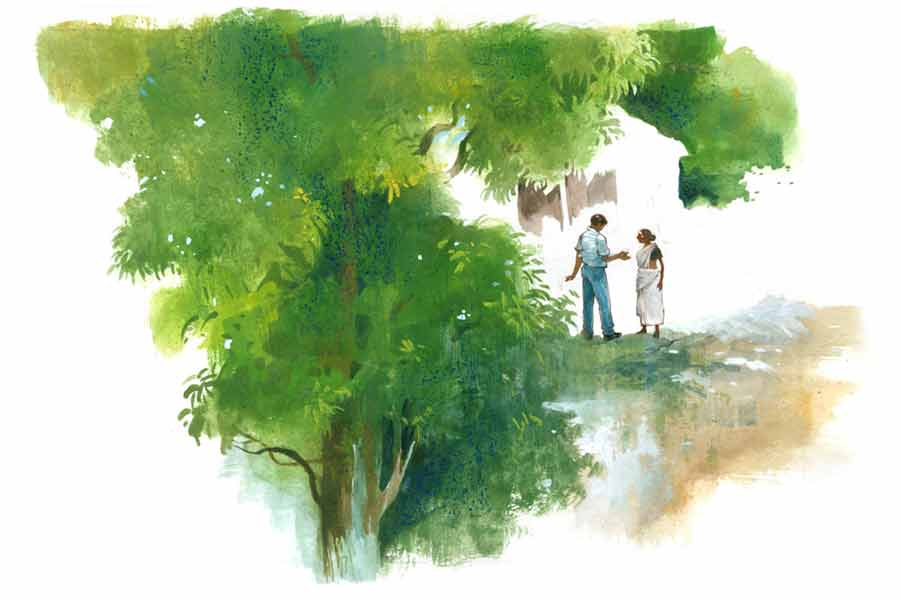

 
 <h1 align=center>ডাইনি</h1>
<h2 align=center>সুপর্ণা চট্টোপাধ্যায় ঘোষাল</h2> 

আমনি আর লুক পেলেন না’খো সার? বুলুর পিসিটোকেই রাখতে হল শ্যাসম্যাস?”

কাজল ফুলঝাড়ু দিয়ে সামনের টেবিলটা পরিষ্কার করছিল। টিফিনের পরে পুরো টিচার্স রুমে মুড়ি ছড়িয়ে থাকে। গ্রীষ্মকালে সবেধন নীলমণি সিলিং ফ্যানটা চললে তো কথাই নেই। বাতাসে দাপটে মেঝের মধ্যে মুড়িগুলো পাক খেয়ে খেয়ে ঘোরে।

বিজ্ঞানের মাধব তালুকদার বেশ খুঁতখুঁতে পরিপাটি লোক। গায়ে সারা ক্ষণ উগ্র চন্দনের গন্ধ মেখে ঘোরেন। সে এমন গন্ধ, মনে হয় ওঁর আশপাশের সব কিছু থেকেই সে গন্ধটা বেরোচ্ছে। তিনি গজগজ করে বলেন, “মা লক্ষ্মী পায়ে ঠেকছে! ছ্যা ছ্যা! কোনও দিন এক মুঠো অন্ন জুটবে না।” নিজেই কাজলকে তিরিশ টাকা দিয়ে রেখেছেন, টিফিনের পরে টিচার্স রুম সাফ করার জন্য। মাধববাবু খুঁতখুঁতে লোক। বিয়ে-থা করেননি, একাই থাকেন।

কাজলের কথার উত্তরে বললাম, “কেন? অসুবিধা কী? হাত পুড়িয়ে খেতে পারছিলাম না ভাই। তোমাদের এখানে কাছেপিঠে একটা হোটেল অবধি দেখিনি।”

“গাঁইয়ে আর হটেল পাবেন কুথা সার?” ঝাঁটাটা নিয়ে অকারণেই দু’বার জানলার গোবরাটে ঠোকে কাজল। “আসলে সেটো লয়...” স্পষ্ট বোঝা যাচ্ছে অন্য কিছু বলতে চাইছে।

“তা হলে?” টিফিনের পরে আজ আমার ক্লাস নেই। আয়েশ করে একটা খেলার ম্যাগাজ়িন খুলে বসলাম। “জলদি জলদি বলো হে। আমার ফেডেরার অপেক্ষা করছে।”

“ইয়ে… উর লজর ভাল লয়!”

“হুম।”

কাজলকে এন্টারটেন করার দরকার নেই। ম্যাগাজ়িনের প্রথম পাতা খুলে বসি।

“ব্যাপারটো হল গিঁয়ে...”

পাত্তা দিচ্ছি না দেখে কাজল নিজেই বকতে শুরু করল নাকি! কত ক্ষণ চালাবে কে জানে!

“বুলুর পিসিটো ডান বটে, সার। ছেলেখাকি! ভাতারখাকি!” কাজল এক বার চট করে ঘাড় ঘুরিয়ে দরজার দিকে দেখে নিয়ে আমার চেয়ারের আরও কাছে সরে এল। ফাঁকা টিচার্স রুমেও সে ফিসফিস করে, “সার, জগার বাবা নিজের চক্ষে তাকে বাট বইতে দেখেছে!”

কাজলের চোখেমুখে ভয়ের
স্পষ্ট ছাপ।

“বাট বইতে?” শব্দটা আগে শুনিনি। স্বাভাবিক কৌতূহলেই ম্যাগাজ়িনের পাতা বন্ধ করে দিলাম।

কাজল মুখে কিছু বলে না। বিড়বিড় করে কোনও মন্ত্র আউড়ে দু’হাত কপালে ঠেকায়।

মাস খানেক হতে চলল গড়ইঝোড়ার এই স্কুলে ঢুকেছি। এমনিতে নিরিবিলি, শান্ত পরিবেশ। গ্রামবাংলার আর পাঁচটা গ্রামের সঙ্গে তফাত বিশেষ নেই। কীর্ণাহার থেকে কিলোমিটার বিশেক পুব দিকে ঢুকে এলে এই গ্রামের সীমানা। একটা সরু নদীর স্রোত গ্রামকে বেড় দিয়ে চলে গিয়েছে। নদীর নাম সরস্বতী। ভারতবর্ষের আসল সরস্বতীর হদিস না পাওয়া গেলেও, সরস্বতী নামের নদীর অভাব হয় না।

এখানে জয়েন করার পর গ্রামেরই এক হোমিয়োপ্যাথি ডাক্তারবাবুর বাড়িতে ভাড়া নিয়েছি। এক কামরার ঘর। মূল বাড়ির লাগোয়া উঠোনের এক পাশে এই ছোট বারান্দা, আর এক ফালি ঘর। বাথরুমের জন্য উঠোন পেরিয়ে ডাক্তারবাবুদের বাথরুম আর কুয়োতলাই ব্যবহার করতে হয়।

কয়েক দিন নিজে হাত পুড়িয়ে রান্না করার চেষ্টা করেছিলাম বটে; কিন্তু মায়ের আদর যে জীবনের পথে কত বাধা হয়ে দাঁড়ায়, সেই ক’দিনেই টের পেয়ে গেলাম। এক গ্লাস জল গড়িয়ে কখনও খেতে দেয়নি মা। এখন ভাতে-ভাত রাঁধি কী ভাবে!

মা আসতে চেয়েছিল আমার সঙ্গে, আমিই বারণ করি। সুস্থ শরীরকে ব্যস্ত করে লাভ নেই। কুয়ো থেকে জল তুলতেই দম বেরিয়ে যাবে। নিজেই চালিয়ে নেব যা হোক।

চালিয়ে যে নিতে পারিনি, তার প্রমাণ পেয়েই গেলাম। কত দিন আর জলে বিস্কুট ডুবিয়ে খেয়ে রাত কাটানো যায়!

কোলিগদের কাছে হদিস চেয়েও পেলাম না। সে দিন হাটবার ছিল। হাটে গিয়ে সোনাদার দোকানে চা খেতে খেতেই কথাটা পাড়লাম, “একটা রাঁধুনি দেখে দাও না সোনাদা! বেশ মাছ-মাংস রাঁধতে পারবে। রাতে গরমাগরম রুটি পাব থালায়।”

“সার আপনি বামুন মানুষ, আমাদের গাঁইয়ে বামুন কুথা? বারো ঘর কায়েত, বাদবাকি ওই আমনার হল গিইয়্যে হাঁড়ি, বাগদি আর ডুম! উয়াদের জল অচল।”

সোনাদা আমার দিকে ফাটল-ধরা চিনামাটির কাপ আর ডিশ এগিয়ে দিল। এটাই সোনাদার শ্রদ্ধার নমুনা। কাপের মধ্যে ট্যালটেলে দুধ-চা।

“আমি জাত-পাত মানি না। এক জন হলেই হল। কেউ নেই তেমন?”

“সার, বুলুর পিসি…”

“তু চুপলি হাবু!”

লুঙি-পরা এক হাটুরে পাশে দাঁড়িয়ে প্লাস্টিকের কাপে চা খাচ্ছিল। আমার কথা শুনে, কোনও এক জনের নাম বলতে যেতেই সোনাদা ধমকে উঠল লোকটাকে।

“কেন, কী হল? কী নাম বললেন?” আমার তখন হাতে অর্ধেক চাঁদ পাওয়ার মতো অবস্থা।

“না, না, কিছু লয়খো সার। হাটে আজ খেলেবালা এসছে। দেখলেন নিকি সার? দারুণ মেজিক দিখায়...” দু’জনেই কেমন হুড়মুড়িয়ে প্রসঙ্গান্তরে চলে গেল।

আমিও ছোড়নেওয়ালা পাবলিক নই, “কার পিসি বললে? কোথায় থাকেন তিনি? ঠিকানা দাও।”

চা খেয়ে পয়সা মিটিয়ে নিজের সাইকেলের সিটটা হাতের চাপড় দিয়ে ঝেড়ে নিলাম। আমার বাহনটিকে এখানে আনতে ভুলিনি। এখন গন্তব্য বুলুর পিসি!

এই গ্রামে আমার সঙ্গী বলতে এই সাইকেলখানা। স্কুল ছুটির পরে, সরস্বতী নদীর তীরে চলে যাই বেড়াতে। অনেক ক্ষণ বসে থাকি। রাতের আকাশে একটা-দুটো তারা ফুটে ওঠে। সেই দিকে তাকিয়ে থাকতে থাকতে সময় কেটে যায়। তার পর অন্ধকার বেশ জমিয়ে নামলে, জোনাকিরা উড়ে বেড়ায়। আমবাগানের ভিতর থেকে শিয়ালের দল ডেকে ওঠে। তখন ভাটফুল আর আশশেওড়ার ঝোপের পাশ দিয়ে বাড়ি ফিরি।

বুলুর পিসির আসল নাম জানা গেল। নিরুপমা। আমার থেকে সামান্যই বড় হবেন মহিলা। গ্রামের শেষে, আমবাগানের পশ্চিম দিকে একটা মাটির বাড়ি আর এক চিলতে উঠোন নিয়ে ভদ্রমহিলা থাকেন। রান্নার তেল-হলুদের ছোপ-ধরা সাদা মলিন শাড়ি, অভাবে-দারিদ্রে শুকনো বনতুলসী গাছের মতো চেহারা। এক টুকরো টিনের ছাউনি দেওয়া রান্নাঘরে উবু হয়ে বসে উনুনে গুল দিচ্ছিলেন।

আমার আর্জি শুনে কাঁচুমাচু গলায় উত্তর দিলেন, “খামোখা আমায় ক্যানে টানছেন সার?”

“কেন, আপনি রান্নাবান্না করতে পারেন না? এই তো দিব্যি আয়োজন করে বসে আছেন।” নিরুপমার সামনে ছোট ছোট বাটিতে আদা-জিরেবাটা, আলু কুচানো, আলুর খোসা কুচি, লাউ না খেঁড়ো কী সব কুচি কুচি করে রাখা।

“না, না সার। গাঁইয়ে আর কাউকে খুঁজে ল্যান। আমায় লয়...” নিরুপমা যেন আমার সামনে থেকে সরে যেতে পারলে বাঁচেন।

“আরে দিদি, ভাইয়ের উপর একটু মায়া করুন!” গলাটাকে যত দূর সম্ভব করুণ করে বলি, “এই দেখুন, সে দিন ভাতের ফ্যান গালতে গিয়ে পুরো হাত পুড়িয়ে ফেলেছি!” নিজের ডান হাতটা সামনে বাড়িয়ে দিলাম।

এটা আমার অনেক ছোটবেলায় খেলতে গিয়ে কেটে যাওয়ার দাগ। মায়ের কাছে এই ট্রিক ইউজ় করে দেখেছি, সঙ্গে সঙ্গে ফল পেয়ে যাই। এখানেও অন্যথা হল না। মেয়েরা মায়ের জাত!

দাগের দিকে তাকিয়ে, সামান্য আমতা আমতা করে উত্তর দিলেন, “রেতে থাকতে লারব। এতটো পথ ফিরতে হবে। বেলাবেলি রেঁধে দুবো।”

“সানন্দে! আপনি কাল সক্কাল-সক্কাল চলে আসুন।”

বসন্তকালে আকন্দ ফলের বীজ ফেটে গিয়ে চার দিকে যেমন বুড়ির চুল উড়ে বেড়ায়, গ্রামের মধ্যে কিছু ঘটলে, সেই কথাটাও তেমনই হাওয়ায় ভাসে।

কাজলের বক্তব্যেই টের পেলাম, বুলুর পিসিকে রাঁধুনি হিসাবে কাজে রাখাটা এরই মধ্যে পুরো গড়ইঝোড়া জেনে গিয়েছে।

“ধ্যাত! কী সব বিড়বিড় করছ? বাট বওয়া কী জিনিস আগে বলো।” কাজলের এই সাসপেন্স ধরে রাখার কায়দাটা খুব বিরক্তিকর লাগে।

“সার, আমনি শহর-ঘরের ছেলে, এ সব জানবেন না’খো!” কাজল ঝাঁটা নামিয়ে টেবিলের কাছে ঘেঁষে এল। “বুলুর পিসিটো ডাইনি বটে। আমরা ছেলেপুলে লিয়ে উইয়ার সামনেই যাই না। উর নজর লেগে যায়। তখন জলপুড়া দাও রে, বুড়িমার থানে ঝাড়াইতে নিন যাও রে। ন’কড়িদের পোয়াতি বউটো আছে না সার? উখে দুপুরবেলা রাস্তায় ধরে উ হাল শুধিনছিল, বেচারি বৌটো!” কাজলের গলার দুঃখটা আসল না নকল বুঝতে পারলাম না, “তেরাত্তির পেরোইল না সার, সি কী বমি-পাইখানা! হেগে-হেগে মরেই গেল।”

এক বার ঘড়ির দিকে তাকিয়ে নিলাম, এ বার ঘণ্টা পড়বে। আমার ক্লাস আছে, বললাম, “এ বার উঠব, জলদি সারো।”

“হ্যাঁ হ্যাঁ সার, অমাবস্সার রেতে, উ উলটিন বাগে হাঁটে। মাথাটো নামোর দিকে, ঠ্যাং দুটা উপর বাগে করে হাতে ভর দিন হাঁটে। দাঁতে একটো পিদিম কামড়িন ধরে। পায়ের পাতায় দুটো পিদিম রাখে। ওই করেই উ মাঠ দিইয়ে হেঁটে যায়। ডাইনিবিদ্দে সাধনা করে, সার। সেই সময় উর কেউ সামনে পড়ে গেলেই চিত্তির। শরীলের সব রক্ত চুসে খেঁইন লিবে।”

শেষের দিকে কথাগুলো বলতে বলতে কাজল প্রায় আমার মুখের কাছেই ঝুঁকে চলে আসে। কিছু ক্ষণের জন্য আমার মনের মধ্যে একটা দৃশ্য ভেসে উঠেছিল, তাই সাড়া দিতে পারলাম না।

পরক্ষণেই টেবিল চাপড়ে উঠে দাঁড়াই, বলি, “হুঁ হুঁ! ভাল লাগল তোমার গল্প, থ্যাঙ্কিউ।”

কিন্তু সেই দৃশ্যটা কিছুতেই মাথা থেকে গেল না।

সে দিন অমাবস্যা ছিল কি না মনে পড়ছে না, আমবাগানের ভিতর দিয়ে ফেরার সময় তিনটে আগুনের ছোট্ট ছোট্ট শিখাকে ক্রমশ দূরে, তালুকদার পাড়া যেখানে শেষ হচ্ছে, সে দিকে সরে-সরে যেতে দেখেছিলাম। যেন তিনটে আগুনের বিন্দু দিয়ে জুড়ে রাখা একটা কাল্পনিক ত্রিভুজ।

সে দিন মনের ভুল ভেবে উড়িয়ে দিলেও আজ কেমন খটকা লাগল। গ্রামের পরিবেশ, আমার একাকিত্ব কি মনের উপর চাপ ফেলছে! নাহ! ভাবছি মা-কে দিনকয়েকের জন্য এখানে আনিয়েই নেব।

চিন্তার শেকল যখন ছিঁড়ল, দেখি দেওয়ালে টাঙানো ইংরেজি ক্যালেন্ডারের সামনে দাঁড়িয়ে। আমার চোখ এই মাসের অমাবস্যা খুঁজছে।

*****

আজ সন্ধে নামার পরও বাড়ি ফিরিনি। বালির মধ্যে সাইকেলটাকে শুইয়ে রাখা। আমি নিজে নদীর চরে কাশের ঝোপের মধ্যে বসে আছি। বুকের মধ্যে অকারণ দামামার শব্দ। কেন এখানে বসে আছি এখনও, কিসের অপেক্ষায়!

মাঝে মাঝে নিজেকে ইন্ডিয়ানা জোন্স মনে হচ্ছে, আবার ভাবছি স্কুলশিক্ষক হয়ে এই মধ্যযুগীয় কুসংস্কার বিশ্বাস করব! মশাও ছেঁকে ধরছে, বাড়ি ফিরেই যাই বরং।

যাব বলে মাটি থেকে উঠতেই বুকের খাঁচায় কেউ যেন ঘুসি মারল। অথচ এমন দৃশ্য দেখার আশা নিয়েই তো তখন থেকে বসে আছি।

অতি সাবধানে আমবাগানের দিকে ছুটে গেলাম। পায়ের শব্দ হল না তা নয়; কিন্তু রাতচরা পাখিদের কর্কশ ডাক, নদীর ও পার থেকে ভেসে আসা ভোজপুরি গান, বাতাসের শনশনানির সঙ্গে মিশে গেল।

তিনটে আলোর বিন্দু দিয়ে বানানো ওল্টানো ত্রিভুজটা অবিশ্বাস্য দ্রুততায় আমার থেকে ক্রমাগত দূরে সরে যাচ্ছে। সে দিকে লক্ষ করে ছুটতে ছুটতে চাপা গলায় আর্তনাদ করে উঠলাম, “নিরুদিদি?”

আমি আওয়াজ করতে চাইনি, মুখ দিয়ে বেরিয়েই গেল!

আচমকা শিখা তিনটে থমকে গেছে। স্থান বদল ঘটল শিখাগুলোর। এখন ত্রিভুজ নয়, সরলরেখা।

আমি আরও কাছে পৌঁছতেই চমকে যাই। সম্পূর্ণ উলঙ্গ, এলোচুলে আমার দিকে ফিরে রয়েছে বুলুর পিসি। পায়ের কাছে তিনটে জ্বলন্ত প্রদীপ নামিয়ে রাখা। হিসহিসে গলায় সে বলল, “রক্ত চুষে খেঁইয়ে লুবো সার, চলে যান ইখান থ্যাকে।”

তার গলা শুনে বুক কেঁপে গেল বটে, কিন্তু কেন যেন পালাতে ইচ্ছা হল না। এই নির্বান্ধব পুরীতে এই ডাইনিই আমার একমাত্র অন্নপূর্ণা! তাকে উলঙ্গ দেখতে নেই। চোখ নামিয়ে নিলাম।

“বিশ্বাস করি না তুমি ডাইনি...” আমার গলা কেঁপে গেল। প্রাণপণে থিতু হওয়ার চেষ্টা করছি, “ও সব মিথ্যে অপবাদ, সত্যি করে বলো তো কী করছিলে?”

“গাছে চেপে, আদাড়ে-বাদাড়ে খেলে বড় হওয়া গাঁইয়ের মেয়েমানুষ বিধবা হলেই কসরত ভুলে যায় না। তারও শরিলের খিদে রইছে। অথচ চার পাশে শ্যাল-নেকড়ে কম নাইখো! নিদ্দিষ্টো এক জনের কাছে যেচি জানলেই সবাই হামলিন পড়বেক। মানুষজনকে ভয় দেখিন রাখতে না পারলে বাঁচব কী করে, ভাইটি? আমনি ঘরকে যান, কাল এঁচোড়টো রেঁধ্যে দুবো।”

বুলুর পিসির গা থেকে ভুরভুর করে চন্দনের গন্ধ ভেসে আসছে। ঠিক যেমন গন্ধ পাই…

স্মৃতি থেকে এই অংশটুকু মুছে দিতে দিতে নদীর চরে ফিরে যাই। সাইকেলটা ফাঁকায় পড়ে আছে। তাকে নিয়ে বাড়ি ফিরতে হবে।

