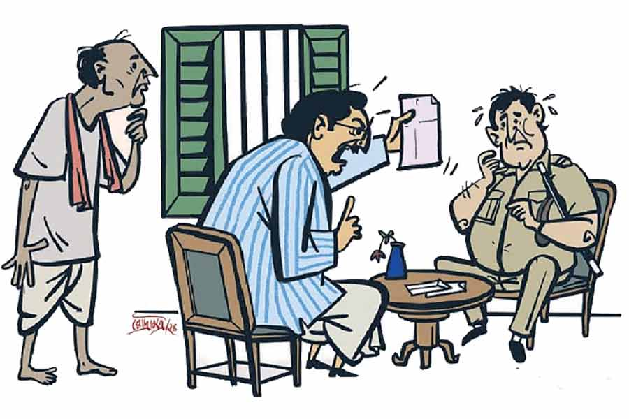

 
 <h1 align=center>ডাকাতিয়া চিঠি</h1>
<h2 align=center>বিতান সিকদার</h2> 

হরির লুট এলাকার এমএলএ ভবসিন্ধু মাল সকাল থেকে ব্যোম মেরে আছেন। ভোর ভোর চাকর নিশিপদ্ম একটা খামে ভরা চিঠি নিয়ে এসেছে। কোন এক ছোকরা নাকি ফটকের বাইরে থেকে তাকে ইশারায় ডেকে চিঠি ধরিয়েই সাইকেল হাঁকিয়ে দৌড়। ভবসিন্ধু খুলেই অবাক। লেখা রয়েছে— “যাহা তোমার নহে, তাহা ফিরাইয়া দাও। অদ্য রজনী ডাকাত পড়িবে...”

ভবসিন্ধু ছোটবেলায় ডাকাত ছিলেন। তখন মার্টিন কোম্পানির রেলগাড়ি চলত। প্রথা বজায় রাখতে গিয়ে এমনতর চিঠি দিয়ে ডাকাতি করতেন। তখন অবিশ্যি দিনকালই ছিল অন্য রকম। বড়লোকদের ঘরে লুটপাট চালিয়ে সে টাকা গরিবদের বিলিয়ে দেওয়া- ব্যাপারই আলাদা। কথা তা নয়। কথা হচ্ছে, এ বয়ান লিখে তো তাঁরা ডাকাতি করতেন। আজ যে ডাকাত আসবে বলে লিখেছে, সে এই বয়ান জানল কী করে? পুরনো দলের কেউ? তা কী করে হয়? তাদের তো ভবসিন্ধু কবে ধরিয়ে দিয়েছেন। কিছু জেলে পচেছে, কিছু বেরিয়ে ধুঁকছে, কিছু মরেছে...

কালে কালে কত কিছু পাল্টাল! একটা সময় ডাকাতির আগে বাঁশবনে ঢুকে তান করার মতো করে রেওয়াজ করতেন, “হা রে রে রে রে....”, এখন চিঠি পড়া ইস্তক ঘুরিয়ে ফিরিয়ে একটা লাইনই গাইছেন, “একটু ব্যথরুম থেকে আসি...” কিছু ক্ষণ পর ফের, “একটু বাথরুম থেকে আসি...”

*******

বছর তিরিশ আগে তান্ত্রিক গান্ধারনাথ ভবসিন্ধুর মাথাটি চিবিয়ে খেয়েছিলেন। গান্ধারনাথ খুব তেজিয়াল তান্ত্রিক ছিলেন। পেঁপে-পুদিনা থেঁতো করে কপালে প্রলেপ লাগিয়ে ভূত-ভবিষ্যৎ দেখে ফেলতেন। বলেছিলেন, “এ বার ডাকাতি ছাড়। রাজনীতিতে আয়...”

“তাতে কী হবে প্রভু?”

“আহা, ডাকাতির জায়গায় ডাকাতি তো রইলই। উল্টে পুলিশ, প্রশাসন, জনগণ সব সেলাম ঠুকবে।”

“কেউ কি নেবে? পুলিশের খাতায় নাম...”

“ওরে পাগল! শাসক নয়, বিরোধী হয়ে ঢোক।”

“তাতে লাভ কী প্রভু?”

“তুই ব্যাটা একেবারে গোমুখ!” খেঁকিয়ে উঠেছিলেন গাদারনাথ। বলেছিলেন, “বিরোধী যে কেউ হতে পারে। আর তা হতে পারলে, গাছেরও খেতে পারবি, তলারও কুড়োতে পারবি। কিছু না, যখন কারও কাছা খুলে যাবে, কয়েক জন নিয়ে তার বাড়ি গিয়ে মড়াকান্না জুড়বি- “দেখো সবাই... সরকার কেমন দেখে না।” এই করে করে বিশ্বাস অর্জন। দূদে হয়ে উঠতে পারলে সরকারও তোকে সমঝে চলবে। কারও কাছা খুলে যাক, অসুবিধে নেই। তোকে নতুন ধুতি পাঠিয়ে দেবে। এই করে করে এক বার পাল্টে দিতে পারলে আর চিন্তা নেই। তখন তুই হনু, সরকারের ছাপ মারা হনু। গদিতে বসে... হেঁ হেঁ...”

“মূল কথা কী হল ঠাকুর?”

গান্ধারনাথ গল্পচ্ছলে বলেছিলেন, “বাঘ শিয়ালকে খেয়ে নিচ্ছে বলে শিয়ালকে রাজা বানিয়ে দেওয়া হল। তার পর শিয়াল ভেড়া-ছাগল ধরে ধরে খাওয়া শুরু করল... এটুকু বুঝতে পারছিস না ব্যাটা ঝুনো নারকোল...”

সেই ঝুনো নারকোল চার বারের বার বাথরম থেকে বেরিয়ে খাস চাকর নিশিপদ্মকে বললেন, “ডাক্তারকে খবর দে। এত ঘন ঘন...”

********

ডাক্তার অতিশয়োক্তি বৈদ্য গম্ভীর ভাবে বললেন, “হঠাৎ এমন দাস্তের মতো...”

ভবসিন্ধু যখন নেংটি-পরা ডাকাত ছিলেন, তখন তাঁর আমাশা আর ঘামাচি হত। মূলস্রোতে ফেরার পর ভদ্রস্থ অসুখবিসুখ হওয়া শুরু করল। শুগার-প্রেশার তো ছেড়েই দেওয়া যাক, ভবসিন্ধুর থেকে থেকে স্টিফ নেক হয়, সেনসিটিভিটি টু লাইট হয়। আগে চুলকুনি হত, এখন ইনফ্লেমেশন হয়।

ডাক্তার বৈদ্য সারা ক্ষণই গম্ভীর। তাতেই বোঝা যায় তিনি কত বড় ডাক্তার।

ফোন ধরে ভুরু কুঁচকে বলেন, “কী বললেন? খেয়ে উঠে জল খাওয়ার পর থেকে হেঁচকি উঠছে? না না, এটাকে লঘু করে নেবেন না। আমি এখনই আসছি...”

সেই ডাক্তার বৈদ্যকে এই সাতসকালে বাড়িতে ঢুকতে দেখে অন্দরমহলে কিঞ্চিৎ চাঞ্চল্য দেখা গেল। বয়স্ক নিশিপদ্ম কয়েক মাস হল কাজে লাগলেও সে কর্তা ও গিন্নি, দু’জনেরই বলা যায়, খাস চাকর। ভবসিন্ধুর স্ত্রী উগ্রচণ্ডা তাকে ডেকে জিজ্ঞেস করলেন, “কী ব্যাপার?”

নিশিপদ্ম বলল, “আজ্ঞে, বাবুর ঘন ঘন বাথরুম হচ্ছে।” উগ্রচণ্ডা তাচ্ছিল্যের ভঙ্গিতে “নেতার ওটুকু ত্যাগও সইছে না!” বলে অন্দরমহলে ঢুকে পড়লেন। উগ্রচণ্ডার চিরকালই বাক্যে বিষ। ভবসিন্ধু ডাকাত থাকার সময়ই প্রায় জোর করে তাঁকে বিয়ে করেন। হাড়ভাঙা গ্রামের সেই মেয়ে তার বাপকে বলেছিলেন, “আমার পছন্দের সৎ মুদি পছন্দ হল না তোমার, শেষে ডাকাতের সঙ্গে গাঁটছড়া বাঁধালে।”

কোনও কালেই বনিবনা হয়নি। ভবসিন্ধু বিয়ের শুরুর দিকে একটু জোর ফলানোর চেষ্টা কনালেও খুব একটা লাভ হয়নি। প্রায় আলাদাই থাকত তারা। ভবসিন্ধু বার কয়েক এগোবার চেষ্টা করলেও পেরে ওঠেননি। উগ্রচণ্ডা পাশে হেঁসো নিয়ে শুত। তুই ওল তো আমিও তেঁতুল!

যাই হোক, ঘটনা শুনে “আপনি উত্তেজিত হবেন না, উত্তেজিত হবেন না...” বলতে বলতে ডাক্তার গোটা চার-পাঁচ ওষুধ লিখে ফেললেন।

************

বেলা সাড়ে এগারোটায় ভবসিন্ধু বলে উঠলেন, “দারোগাকে ডাক...”

থানার ওসি প্রাপ্তিচরণ বৈশ্য জুতো-সারাইওয়ালা নরসুন্দর মালোকে থানায় ডেকে নিজের বেল্টের ঘাট বাড়াচ্ছিলেন। ইউনিফর্মের সঙ্গে যেটা এসেছে, ওটাতে এখন আর আঁটছে না। ফোন তুলেই বাজখাঁই “হ্যালো...” বলেই কোথা থেকে ফোন এসেছে বুঝে মিহি গলায় “হাঁ সার, এখনই সার, আসছি সার...” শুরু করে দিলেন।

সেই প্রাপ্তিচরণ বৈঠকখানায় বসে ঘটনা শুনে অবাক। অদূরে দাঁড়ানো নিশিপদ্মের দিকে চোখ পাকিয়ে বললেন, “এ কার কারসাজি, ঠিক করে বল।”

নিমেষে ধমক দিলেন ভবসিন্ধু, “থামো তো! এ আবার কী! কার কারসাজি নিজে খুঁজে বার করো। ও হাতে করে চিঠি এনে দিলে, আর ওকেই জেরা? তুমি এখন কী করো বলো তো...”

“আজ্ঞে, কাজ করি সার।” “গুষ্টির মাথা করো।”

“তাও করি সার... এই ধরুন না, কাল যে রাত বারোটায় আপনার কাছের মানুষ নরোত্তম গুছাইতের গোটা দশেক ট্রাক নাকা পার করে বেরিয়ে গেল, তা কি আর চেক করিনি সার? খুব করিচি। হলপ করে বলতে পারি সার, তাতে খড়-বিচালি ছাড়া আর কিচ্ছু ছিল না। তার পর, ধরুণ গিয়ে ন্যাড়া বটতলার এঁড়ে কানাই। ইস্কুলের জমির পাশে নিজের ঘরটা ছেড়ে যাচ্ছে না, আপনার আড়তটাও আটকে... ইয়ে, তা সেই কানাইকে কি থানায় ডেকে মিষ্টি করে বোঝাইনি সার? খুব বুঝিয়েচি। তার পর ধরুন না কেন, মানিকলালের মেয়েটি যে পুকুরে ছান করতে গিয়ে হঠাৎ পোয়াতি হয়ে ফিরে এল, তা তার জেরে কি পার্টির তরুণ ছেলে রাখালকে এক বারও জিজ্ঞেস করিচি, তুমি কেন তখন ওখানে ঘাটের পাড়ে দাঁড়িয়ে দাঁত মাজছিলে? মোটেই না..”

“এখন বেরোও এখান থেকে। ফোর্স নিয়ে সন্ধের মধ্যে বাড়ি ঘিরে ফেলা চাই।”

“পায়ের ধুলো দেবেন সার, পায়ের ধুলো...”

***********

দুপুরে ভবসিন্ধু শুধু একটু স্টু খেলেন। এক চিঠিতেই কাত।

কথা রটতে বেশি দেরি হল না। ভবসিন্ধুর বাংলোবাড়ির বাইরে একটা বেশ বড় ঘর হচ্ছে গিয়ে ‘পার্টি অফিস।’ পার্টি নয়, রেফ নেই। সেখানে ছেলে-ছোকরারা জুটে গেল। এরা সব মানুষের উন্নতির জন্য জীবন পন রেখে ‘পাটি’ করে। বদলে এদের কিচ্ছু চাই না। ক্যাডার কদম্ব শুধুমাত্র নতুনপাড়া থেকে ঠ্যাঙাড়ে গলি পর্যন্ত স্টেট হাইওয়েটা ভেঙে ফেলার, থুড়ি, তৈরি করার বরাত চেয়েছে। ক্যাডার বিল্বপত্র মাত্র তিরিশটি ছেলেমেয়েকে ন্যূনতম দক্ষিণার বিনিময় মাস্টার ডিগ্রির সার্টিফিকেট করিয়ে দেওয়ার অনুমতি চেয়েছে। কানা বেগুন চেয়েছে তিনটি হোটেল খোলার পারমিট। অথচ কিসের বিনিময়ে? শুধু মানুষের সেবা করার বিনিময়ে।

সেই সব ক্যাডার ঘরে ভিড় জমিয়েছে। ভবসিন্ধু জানেন, এদের খেপিয়েই দেশের কাজ চলে। এরা খেপে গেলে হয় ‘রোবিন্দো-জয়ন্তি’, নয়তো ‘রক্তপাত শিবির’ করে ফেলে। তারা সকলে একস্বরে বলল, “এ অপোজিশনের চক্কান্ত... তাইলে মানু সরখেলের মাথাটা কেটে নিয়ে আসি ভবাদা?”

“কিচ্ছু না, কিচ্ছু না। আজ সারা রাত পাহারা দিবি...”

**********

সন্ধে নাগাদ উকিল আর ডাক্তারকে তুলে আনা হল। ডাক্তার অতিশয়োক্তি মিনমিন করছিলেন, “আমি আবার এ সবের মধ্যে... ওষুধ তো লিখেই দিয়েছি... ফোনও খোলাই ছিল... দরকার পড়লেই...”

তাকে মাঝপথে থামিয়ে ভবসিন্ধু চোখ পাকিয়ে বললেন, “চোপ!”

উকিল বিলম্ব শাসমল বললেন, “চিঠিতে বলছে, ‘যাহা তোমার নহে’। মানে কী? একটা লিস্ট করে ফেলা যাক। বিদেশি ব্যাঙ্কের টাকাগুলো?”

“সে তো কবে থেকে রাখা। কাঠ পাচারের টাকা...”

“ফাইন। নামে-বেনামে গোটা তেরো বাড়ি এবং ফ্ল্যাট। কাগজপত্র?”

“তা-ও বয়স্কের লকারে।”

“কোন ব্যাঙ্ক?”

“একটা হলে তো বলব। তা-ও ধরো, নয়-নয় করে...”

“তোলার ক্যাশ টাকাগুলো?”

“ওগুলো তো সোনাদানায়...”

“সে সোনাদানা কোথায়?”

“গয়নাগাঁটি আলমারিতে, আর কিছু মূর্তি-টুতি এ ঘর-সে ঘরে।”

“সেগুলো এখনই একটা ঘরে ঢুকিয়ে তালা ঝুলিয়ে বাইরে পুলিশ বসিয়ে দেওয়া হোক।”

হল। ভবসিন্ধুর উত্তেজনা বাড়ছে। এই মুহূর্তে যাচ্ছেতাই একটা ঘটনা ঘটল।

***************

তিনটে খবরের চ্যানেলের লোক উদয় হয়ে বাড়ি প্রায় তিন দিক থেকে ঘিরে ফেলল। একটা পক্ষের, একটা বিপক্ষের আর আর একটা কী বোঝা যাচ্ছে না। পক্ষের চ্যানেল ক্যামেরা বাগিয়ে ধরে বলছে, “দেখুন এই প্রৌঢ় নেতাকে কেমন করে উত্ত্যক্ত করা হচ্ছে। মানুষের কাজ করার শাস্তি পাচ্ছেন তিনি।”

বিপক্ষের চ্যানেল বলছে, “এই তো রাজ্যের হাল। যেখানে এক জন জনপ্রতিনিধিই সুরক্ষিত নন, সেখানে সাধারণ মানুষ...”

আর একটি চ্যানেলের সাংবাদিক বলছে, “এই মুহূর্তে ভিতর থেকে খবর এল, ওঁর রক্তচাপ বেড়ে গেছে। দুপুরে তিনি শুধু একটু স্টু খেয়েছেন...”

ভবসিন্ধু কাঁপতে কাঁপতে টিভি খুলতেই চক্ষু চড়কগাছ। দুটো চ্যানেলে এই নিয়ে আলোচনা বসে গেছে। গোল করে বসেছেন সব। ইতিহাসবিদ। প্রাক্তন পুলিশকর্তা। ক্রিমিনোলজিস্ট। কূটনীতিবিদ।

ভবসিন্ধু বলে উঠলেন, “হয়ে গেল... এরা ধরেছে মানে...”

বলতে না বলতে পার্টি হেডঅফিস থেকে ফোন, “বলি হচ্ছেটা কী ওখানে?”

“বুঝতে পারছি না, দাদা....”

“যাক গে, ফস করে বেফাঁস কিছু বলে ফেলো না। ভাবমূর্তি বজায় রাখতে হবে। সিমপ্যাথি, পাবলিক সিমপ্যাথি আদায় করার চেষ্টা করো। সামনে ইলেকশন...”

শুনে ভবসিন্ধুর মনে হল, এ যেন সেই ঘটোৎকচ বধ পালা। মরার সময়ও নিস্তার নেই। বাপ ভীম বলছে, “ধেড়ে হয়ে উল্টো দিকে বিপক্ষের সৈন্যদের ঘাড়ের উপর পড়ে মর।”

তবু হাই কমান্ডের নির্দেশ। মানতেই হবে। পেটের ভিতড়টা গুড়গুড় করলেও এক বারটি বাইরের ঘেটে এসে ক্যামেরার সামনে বলে গেলেন, “মানুষের জন্য যদি প্রাণও দিতে হয়, আমি পিছপা হব না।” তার পর আর ভাব ধরে রাখতে না পেরে তড়িঘড়ি ভিতরে চলে গেলেন।

“উনি কোথায় গেলেন, উনি কোথায় গেলেন”— রব উঠলে চাকর রামা ভিড় সামলাতে সামলাতে বলল, “বোধহয় বাথরুমে।”

একটা চ্যানেল বলল, “আপনারা দেখলেন, উনি প্রাণ দিতে বাথরুমে চলে গেলেন...”

*************

রাত ন’টা নাগাদ উগ্রচণ্ডা বেরিয়ে এলেন ঘর থেকে। ভবসিন্ধুর ঘরে ঢুকে বললেন, “আমি চললাম।”

“সে কী! এখন? কোথায়?”

“"সে জেনে কী হবে?”

“না মানে,” ভবসিন্ধু একটু আমতা আমতা করে বলার চেষ্টা করলেন, “শিয়রে এমন বিপদ...”

“বিপদ তোমার, আমার নয়।”

“কিন্তু কোথাও কিছু হলে...”

“হলে আমার হবে, তোমার নয়।”

“ইয়ে মানে...”

“গাড়ি নিলুম। পদ্মকে সঙ্গে নিলুম। সে আমায় পৌঁছে দেবে। তোমার নরক তুমিই সামলাও।” এমন সময় বাইরে শোরগোল উঠল, “দেখে দেখে, সাবধান। বোমা হতে পারে...”

ক্যাডারদের দৌড়োদৌড়ি শুরু হয়ে গেল। পুলিশ ঝেঁকে চলে এল বাগানের পাশে। ওসি প্রাপ্তিচরণের আতঙ্কিত গলা পাওয়া গেল, “বম্ব স্কোয়াড, বম্ব স্কোয়াড!”

হুড়োহুড়িতে বাড়ি ছয়লাপ। ভবসিন্ধু আশপাশ ভুলে শুধু বলতে পারলেন, “ডাক্তার! আমার প্রেশারটা, আমার প্রেশারটা...”

কিন্তু কোথাও কিছু ফাটল না। কিছু ক্ষণ পর খবর পাওয়া গেল, গাছ থেকে একটা ডাব পড়েছে।

*************

সকালটা একেবারে ঝকঝকে। প্রত্যেকের মেজাজ যদিও বিগড়ে আছে। ক্যাডাররা নিজেদের মধ্যে বলাবলি করছে, “দুর কোনও অ্যাকশনই হল না...”

চ্যানেলের লোকজন ক্যামেরা-ট্যামেরা গোছাতে গোছাতে শেষ বাইট দিচ্ছে, “তা হলে কি এটা একটা প্রকটিক্যাল জোক করা হল? চোখ রাখুন আমাদের পর্দায়।”

ডাক্তার স্বস্তির নিঃশ্বাস ছেড়ে বললেন, “আগেই বলেছিলাম...”

উকিল বললেন, “মাঝখান থেকে ভাগ্নের বিয়েটাতে যাওয়া হল না।” পুলিশ বললে, “ছাড়ব না। শেষ দেখব। এক রাতে কোমারর মাপ কমিয়ে দিল দিল শালার চিটিংবাজ...”

*************

সবার অলক্ষ্যে ভবসিন্ধু উগ্রচণ্ডার ঘরে ঢুকে তার খাটের উপর একটা কাগজ হাতে ধরে থ হয়ে বসে আছেন। সেখানে উগ্রচণ্ডা লিখে গেছেন, “তোমার পাপের সম্পত্তি তোমারই। আমার ডাকাত আমায় নিয়ে চলল। আমি কখনওই তোমার ছিলাম না।”

সম্বিত ফেরার পর চিঠিটা পকেটে ঢুকিয়ে স্বাভাবিক ভাবেই সেক্রেটারি গোত্রীয় নাটাই তপাদারকে ডেকে ভবসিন্ধু জিজ্ঞেস করলেন, “হ্যাঁ রে, এই যে নিশিপদ্ম কাজে লেগেছিল, তা সে কোন গ্রামের কিছু জিজ্ঞেস-টিজ্ঞেস করেছিলি?”

“"আজ্ঞে হ্যাঁ দাদা। বৌদিরই গ্রামের। হাড়ভাঙা।”

“অ! তা কী করত-টরত, কিছু...”

“আজ্ঞে শুনেছিলাম কোনও এক সময় মুদির দোকান ছিল।”

“আচ্ছা।”

মনে মনে একটা স্বস্তির নিঃশ্বাস ফেললেন ভবসিন্ধু, ‘যাক বাবা, অল্পের উপর দিয়ে গেছে...’

শেষ

