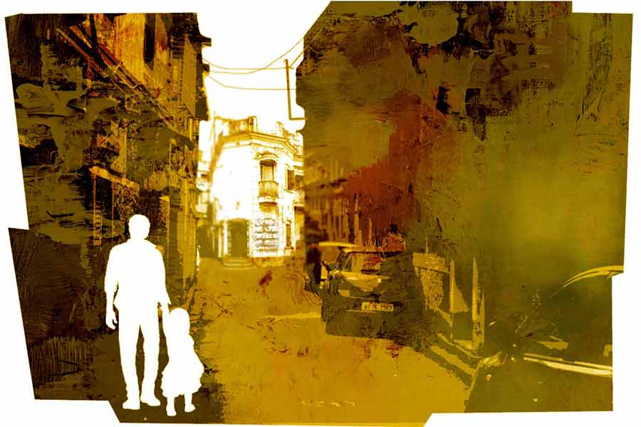

 
 <h1 align=center>ডালের বড়া</h1>
<h2 align=center>শান্তনু দে</h2> 

মেয়েকে গল্প পড়ে শোনাচ্ছিল কৌশিক। সুকুমার রায়ের ‘হ য ব র ল’। বুড়োর কথায় আসতেই মেয়ে বলল, “এ সব কী লিখেছে বাবা, চল্লিশ বছর হলেই ঊনচল্লিশ, আটত্রিশ, সাঁইত্রিশ করে বয়স কমতে থাকে। ও কি টাইম মেশিনে চড়েছে?”

কৌশিক মেয়ের কথা শুনে হেসে বলল, “টাইম মেশিন তো বটেই। সবার কাছেই সেই টাইম মেশিন থাকে, তবে তা দেখা যায় না। তাতে চড়ে আমরা বড়রা আমাদের ছোটবেলায় ফিরে যাই।”

মেয়ে মিতিন বলল, “সত্যি তোমরা যে বাড়িতে থাকতে, আমি গেছিলাম, পুরনো ভাঙা দোতলা বাড়ি, কত লোক।”

কৌশিক বলল, “ছোটবেলায় আমাদের দিন কাটত হইহই করে, পিকনিকের মতো। ঝগড়াঝাঁটি, মজা তো ছিলই, আর ছিল খাওয়াদাওয়া। এক ঘরে তো নয়, সবার ঘর থেকে খাবার আসত। আমার মুখে লেগে আছে ন’জেঠিমার রান্না…”

বলতে বলতে যেন ছোটবেলায় চলে এল কৌশিক, চোখমুখের পেশিগুলোতেও খুশির ছাপ।

তখনই পাশের ঘর থেকে স্ত্রী রিনি ডাকল, “মা খেতে দিয়েছে। খেতে এসো তোমরা।”

এক ঝটকায় আবার বর্তমানে ফিরে এল কৌশিক। মিতিন বলল, “জানো বাবা, দিদান আজ তোমার জন্য সেই সকাল থেকে অনেক রান্না করেছে। এমনকি তোমার ফেভারিট বড়াভাজাও আছে।”

শ্বশুরবাড়িতে বেড়াতে এসেছে আজ কৌশিক। এখানেই দুপুরের খাওয়াদাওয়া। স্ত্রীর ডাকে খাবার টেবিলে গিয়ে দেখল, পঞ্চব্যঞ্জন দিয়ে থালা সাজানো। কৌশিকের চোখ পড়ল ডালের বড়ার দিকে। নিজে মুখেই এটা রান্না করার কথা শাশুড়ি-মাকে বলে রেখেছিল সে। পাত থেকে একটা বড়া মুখে নিয়ে মুখে দিল কৌশিক।

মুখের কোমল রেখাগুলো বদলে গেল তার। যে স্বাদের স্মৃতি লেগে ছিল তার স্বাদকোরকে, তা যেন ভেঙে টুকরো টুকরো হয়ে গেল। ভাতের থালার সামনে হাত গুটিয়ে বসে থাকে কৌশিক। ‘হ য ব র ল’-র বুড়োর মতো বয়সকে উল্টো দিকে ঘুরিয়ে আর ছোটবেলায় ফেরা হল না কৌশিকের।

শাশুড়ি বুঝতে পেরে বললেন, “ঠিক হয়নি, না?”

কৌশিক বেজার মুখে বলে, “না মা, আমি যেটা চাই সেটা হয়নি। কিছু মনে করবেন না, এটা মুচমুচে হয়নি আমার ন’জেঠিমার মতো। উপরটা পুড়ে গেছে, ভিতরটা কাঁচা, গ্যাদগ্যাদ করছে… ন’জেঠিমা যেটা ভাজত, ছোটবেলায় কত খেয়েছি, সে যেন মুখে লেগে আছে! আপনার মেয়ে পারে না তাই ভাবলাম আপনি যদি…”

শাশুড়ি হয়তো মনে মনে ক্ষুণ্ণ হলেন, মুখে বললেন, “তুমি তো ঠিক করে বলতেই পারলে না রেসিপিটা...”

“ডালের বড়ার আর রেসিপি কী! মটরডাল ভিজিয়ে বাটা, মনে হয় নারকেলকোরা দিত, আর কী থাকত জানি না, তবে বেশ মুচমুচে হত, হালকা লাল হলেও পুড়ত না, উপর থেকে ভিতর— একই রকম ভাজা। আসলে আমার ন’জেঠিমা খুব রাঁধতে ভালবাসত। কচুশাক, মোচার ঘণ্ট, গা-মাখা আলুর দম— সে কখনও ভোলার নয়। বাড়ির রাঁধুনির একঘেয়ে ডাল, ঘ্যাঁট আর মাছের ঝোল, নয়তো রেস্তরাঁর বিরিয়ানি-চিকেন চাঁপ খেয়ে খেয়ে মুখে চড়া পড়ে গেছে। তাই ভাবলাম একটু অন্য রকম, ছোটবেলার মতো…”

মাকে এই সব কথা শোনানো, কোনও মেয়েই সহ্য করবে না। পাশের ঘরে বসে রাগে লাল হয়ে উঠল কৌশিকের স্ত্রী রিনি। কৌশিককে জবাব দিতে যাবে, তাকে আটকাল তার মা।

“বাদ দে। ঠিকমতো হয়নি তাই… আসলে আমরা তো এদেশীয়, আর ওরা বাঙাল, ওদের রান্নার ধরন আমাদের সঙ্গে মেলে না।”

রিনি বলল, “না মিলুক, তবু এই ভাবে বলবে কেন, সহবত নেই?”

মা সর্বংসহা-মায়ের মনোভাব থেকে বললেন, “ছাড় তো! বলেছে তো কী হয়েছে, তুই এ নিয়ে কোনও কথা বলিস না।”

রিনি তখনকার মতো থেমে গেলেও মনে মনে গজর-গজর করতে থাকল। ঠিক যেমন ‘হ য ব র ল’-র কাকটা দুলে দুলে মাথা নেড়ে বলেছিল, “সাত দুগুণে চোদ্দোর নামে চার, হাতে রইল পেনসিল।”

কিন্তু কৌশিক কী করবে! তার যে ফেলে আসা ছোটবেলায় ফিরতে ইচ্ছে হয়েছে। ন’জেঠিমা তো নেই। আর সব জেঠিমা, কাকিমা, মা সবাই চলে গেছেন। ছোটবেলার বাড়ি ছেড়ে চলে এসেছে কৌশিক কুড়ি বছর হল। আর যাওয়া হয় না। কেবল মনের মধ্যে ছোটবেলার সেই দিনগুলো সযত্নে লালন করে কৌশিক।

বাড়ি ফিরে রিনি মুখ ভার করে বলল, “তুমি আর আমাদের বাড়ি যাবে না। তুমি জানো, মা কত দুঃখ পেয়েছে! মায়ের হাই প্রেশার, রান্নাঘরে যাওয়া বারণ, তবু তুমি বলেছ বলে সারা দিন ধরে নিজে হাতে রান্নাবান্না করল। আর উনি বললেন, ‘আমার ন’জেঠিমার মতো হয়নি!’ আহা রে, কী রান্না, বড়াভাজা… এ বার থেকে তোমার ওই ছাইপাঁশগুলো খেতে ইচ্ছে হলে তোমার ওই রাবণের গুষ্টির বাড়িতে চলে যাবে। আমাদের জ্বালাবে না একদম।”

কৌশিক কিছু বলতে পারল না। বললেও কেউ বুঝবে না। বড়াভাজা তো ছুতো মাত্র। আসলে এর মাধ্যমে সে ছোটবেলায় ফিরতে চেয়েছে। তার বয়স চল্লিশ থেকে ঊনচল্লিশ, আটত্রিশ, সাঁইত্রিশ হয়ে আট পর্যন্ত নামতে চাইছে। যাতে ছোটবেলার সেই গমগমে বাড়ি, খুড়তুতো-জেঠতুতো ভাইদের সঙ্গে হইহুল্লোড় করে কাটানো সময়ে পৌঁছনো যায়। বড়াভাজাটা হবে মন্ত্র। হলদে সবুজ ওরাং-ওটাং ইটপাটকেল চিৎপটাং…

ন’জেঠিমার ওই রকম বড়াভাজা কৌশিককে খেতেই হবে, মনের মধ্যে একটা জেদ পেয়ে বসেছে। এক বার ফিরতেই হবে ছোটবেলায়। স্বাদকোরকগুলি বড় ছটফট করছে। স্ত্রীর কাছে আর কিছু বলবে না। সে বুঝবে না। সে তো ‘হ য ব র ল’-র কাকের মতো বলতে পারে, “সময়ের দাম নেই বুঝি?”

এক বার ঠিকে রাঁধুনির কাছে বলেছিল, সে মুখের উপর বলে দিয়েছে, “অত হাঙ্গামা পারবনি বাবু, আমরা পেলেন ঝোল ভাত আর একটা সব্জি, এই রাঁধি, তুমার বড়া-ফড়া করার টেইম নেই।”

কৌশিকের মেজাজটা নিম-খাওয়া হয়ে যায়। সে ছোটবেলা থেকে জেনে এসেছে, যা রান্না করার আগে ‘আনাজপাতি’, তাই রান্নার পর ‘তরকারি’। সে সব ঘুচে গেছে বাঙালির শব্দভান্ডার থেকে। এখনই সবই ‘সব্জি’। যা শুনছে, শিখে নিচ্ছে! মানুষ না তোতা, কে জানে!

নিজেও এক বার ডালের বড়া ভাজার চেষ্টা করেছিল কৌশিক, পারেনি। রান্নাবান্না তার আসে না। শহরে একটা নতুন রেস্তরাঁ খুলেছে, সেখানে পুরনো বাঙালি খাবার পাওয়া যায়। কৌশিক সেখানে ধাওয়া করেছে, তারা বলেছে, ওই রকম ডালের বড়া ওদের মেনুতে নেই।

কৌশিক ভাবল, এক বার তার পুরনো বাড়িতে গেলে হয়, সেখানে কেউ না কেউ তাকে ন’জেঠিমার মতো বড়া ভাজা খাওয়াতে পারে। ভাবল বটে, আবার দ্বিধাও করতে লাগল। প্রায় এক যুগ আগে শরিকি বিবাদে ওই বাড়ি ছেড়ে এসেছিল কৌশিক, তার পর আর যাওয়া হয়নি।

বেশি না ভেবে মেয়েকে নিয়ে কৌশিক বেরিয়ে পড়ল তাদের পুরনো বাড়ির উদ্দেশে। ওর বারো বছর বয়স হল, কখনও যায়নি ওই বাড়িতে। কৌশিক মেয়েকে বলল, “চল একটা জায়গায় নিয়ে যাই, মাকে কিছু বলার দরকার নেই।”

একই শহরে থেকেও তাদের পুরনো পাড়ায় খুব একটা আসে না কৌশিক। এখানে এলে ছোটবেলার কথা মনে পড়ে। কষ্ট বাড়ে। মসজিদ আর শনিমন্দিরের পাশ দিয়ে তাদের পাড়ার গলি। সরু অনেক বাঁক খেয়ে এগিয়ে গেছে তাদের বাড়ির দিকে। কৌশিক মেয়েকে বলতে লাগল, “জানিস, এই গলিতে আমরা বিকেলবেলা ক্রিকেট খেলতাম! ইটের উইকেট, ভাগের বল আর একটা মাত্র ব্যাট! আর ওই যে শনিমন্দির দেখলি ওখানে একটা মাঠ ছিল, ওই মাঠে আমরা সরস্বতী পুজো, রবীন্দ্রজয়ন্তী, পিকনিকও করেছি অনেক, পাড়ার সব ছেলেমেয়ে দু’টাকা করে চাঁদা দিয়ে ডিম-ভাত পিকনিক…”

মিতিন হেসে বাবাকে বলল, “বাবা, তুমি মনে হচ্ছে ‘সোনার কেল্লা’র মুকুলের মতো পূর্বজন্মের দেশে চলে এসেছ…”

কৌশিক বলল, “সত্যি! এত বছর পর ছোটবেলার পাড়ায় ফেরাটা, জাতিস্মরের মতোই মনে হচ্ছে।”

বাড়ির গলিটা তেমন বদলায়নি, কেবল ফাঁকা জায়গাগুলোয় বেমানান সুদৃশ্য বাড়ি উঠেছে। কৌশিক তাদের বাড়ির কাছে এসে থমকে দাঁড়াল কিছু ক্ষণ। বাড়িটার ভগ্নদশা আরও বেড়েছে। ভাগের বাড়ি, সারানোর টাকা ওঠে না। এক সময় গমগম করত যে বাড়ি, এখন তার হাল দেখলে কান্না পায়। কৌশিকের ডাকাডাকিতে এক বছর পনেরোর ছেলে নীচের একটা ঘর থেকে বেরিয়ে এল কুয়োতলার চাতালে। কৌশিককে চিনতে না পেরে বলল, “কী চাই?”

কৌশিক চিনল। তার জেঠতুতো দাদা গনুদার ছেলে। ওকে খুব ছোট দেখেছিল। বড় হয়ে বাপের মতোই হয়েছে। কৌশিক বলল, “আমি এ বাড়িরই ছেলে, গনুদা নেই?”

এ বারে পর পর দুই অংশের ঘর থেকে নিঃশব্দে বেরিয়ে এল তার দুই জেঠতুতো দাদা গনু আর খেনু। কৌশিকের দিকে এমন ভাবে চেয়ে থাকল যেন ভূত দেখছে।

অগত্যা কৌশিককে নিজের ডাকনাম বলে পরিচয় দিতেই হল, “কী রে চিনতে পারছিস না, আমি বুবুল, মেয়েকে নিয়ে একটু ঘুরতে এলাম। কেমন আছিস তোরা?”

গনু কর্কশ গলায় বলল, “এত দিন পর কী মনে করে, বেঁচে আছি কি না দেখতে এলি? এখনও মরিনি, মরলে খবর পেতিস।”

খেনু এক কাঠি উপরে, বলল, “দাদুর বাড়ির ভাগ নিতে এসেছিস বুঝি? সে গুড়ে বালি। আমরা আছি, আমরাই থাকব।”

রাগ করে মেয়েকে নিয়ে বেরিয়ে এল কৌশিক। মিতিন বলল, “বাবা, তোমার ওই দাদা দুটো খুব ঝগড়ুটে। ঠিক ওই ‘হ য ব র ল’ গল্পের উদো-বুধোর মতো।”

কৌশিক হেসে বলল, “ওরা ছোটবেলা থেকেই ওই রকম, বদলাল না। সবার সঙ্গে ঝগড়া করে পুরো বাড়িটা দখল করে রয়েছে।”

“তুমি বড়াভাজার কথা বললে না তো বাবা?”

“আর বলা যায়? আসলে ওদের অবস্থা তো ভাল নয়, তেমন কিছুই করেনি, লেখাপড়াই করেনি… যে ভাইরা লেখাপড়া করে চাকরি করে, তাদের ওরা হিংসে করে।”

“তবে তোমার ন’জেঠিমার বড়া কে খাওয়াবে তোমায়?”

“সেটাই তো ভাবছি রে! ন’জেঠিমার কোনও ছেলেমেয়েও তো নেই! নাহ্, ওই বাড়িতে যাওয়াই আমার ভুল হয়েছে। যে কাল চলে গেছে, তা আর ফেরে না। তোকে নিয়ে গেলাম, তোর খারাপ লাগছে তো?”

“তুমি আমায় নিয়ে ভেবো না, আমি মাকে কিছু বলব না।”

অবশ্য পুরনো বাড়িতে এসে একদম লাভ হল না এমন নয়। এখানে এসে কৌশিকের মনে পড়ে গেল ন’জেঠিমার বাপের বাড়ির কথা। এখন একমাত্র উপায় ন’জেঠিমার বাপের বাড়ি যাওয়া। যেখানে ছোটবেলায় ন’জেঠিমার সঙ্গে অনেক বার গিয়েছে কৌশিক।

এই টাউনের দশ কিলোমিটার দূরে হরনগর গ্রামে ন’জেঠিমার বাপের বাড়ি। কৌশিক ঠিক করে একাই যাবে। মেয়েকে সঙ্গে নেবে না আর। কী জানি কোন অপ্রীতিকর ঘটনার মুখোমুখি হতে হয়!

কাউকে না জানিয়ে হরনগর গ্রামে চলল কৌশিক। যাওয়ার আগে বাজার থেকে কিনে নিল মটরডাল আর নারকেল। ছোটবেলার স্মৃতিতে ভর করে, লোকজনকে জিজ্ঞেস করে, হরনগর গ্রামে ন’জেঠিমার বাপের বাড়ি পৌঁছল কৌশিক। বাড়িতে আম-কাঁঠাল গাছ, ধানের গোলা, গোয়ালঘর, ঘুঘু পাখির ডাক— শান্ত গ্রাম্য পরিবেশ।

ন’জেঠিমার এক ভাইঝি, পারুলদি, পরিচয় দিতে চিনতে পারল কৌশিককে, “ও মা, তুমি যে মনে করে এসেছ, এই তো কত ভাল কথা, আজকালকার দিনে কে-ই বা কার খোঁজ রাখে বলো।”

সব কথা শুনে পারুলদি বলল, “আমি তো তোমাদের বাড়িতে কত গিয়েছি! ছোটবেলায় তুমি পিসিকে খুব ভালবাসতে! দিনরাত পিসির ঘরে, মানে তোমার ন’জেঠিমার ঘরেই থাকতে, খেতে।”

“হ্যাঁ গো, ন’জেঠিমার রান্না ছাড়া আমি ভাতই খেতাম না! মাছ-মাংস নয়, ওই ডালের বড়া, মশলা-মাখা আলুর দম, ঝিঙে-আলু পোস্ত। কত কাল ওই রকম রান্না খাই না।”

“তা তুমি আবার সঙ্গে করে ডাল, নারকেল কিনে এনেছ কেন গো! আমরা কি রান্নাবান্না করে খাই না?”

“না না, তা নয়, ভাবলাম যদি জোগাড় না থাকে, মানে ন’জেঠিমার রান্না খাওয়ার জন্য মনটা এত… কার কার কাছে না গেছি, শেষে তোমার কথা মনে পড়ল।”

“বুঝেছি, বুঝেছি, অত করে বলতে হবে না। সামান্য ডালের বড়া… আজকে তোমায় থাকতে হবে, এই ডাল ভিজতেই এক বেলা যাবে, তার পর বেটে বড়া ভাজতে হবে। মেয়ে-বৌকে নিয়ে আসতে পারতে। পিসির কাছে তো এক কালে অনেক পদ রান্না করতে শিখেছিলাম, তার মতো হয় কি না দেখো।”

অগত্যা একটা দিন থাকতে হল কৌশিককে। বাড়িতে জানিয়ে দিল অফিসে কাজের চাপ, আজ আর বাড়ি ফিরতে পারবে না।

খাওয়ার সময় এক প্লেট বড়া দেখেই মনটা খুশিতে ভরে উঠল কৌশিকের। দেখতে একদম সেই রকমই হয়েছে। পারুলদি বলে গেল, “তুমি খাও, আমি আর ক’টা ভেজে আনি গরম গরম।”

এক কামড় বড়া খেয়েই কৌশিক বুঝে গেল, একেবারে মিলে গেছে। হুবহু সেই সোয়াদ। খুশিতে চেঁচিয়ে উঠল, “একদম সেই রকম পারুলদি, আহা কী মুচমুচে! কী করে করলে?”

রান্নাঘর থেকে জবাব এল, “এ আর কঠিন কী, এক বেলা ভিজিয়ে রেখে ডাল বাটতে হবে শিলে। মিহি করে নয় কিন্তু, আধবাটা। তার পর নারকেলকোরা, নুন, চিনি, কালোজিরে, হলুদ দিয়ে মেখে নিবু-নিবু আঁচে সময় নিয়ে ভাজতে হবে। মাটির উনুনে ভাল হয়। গ্যাসে হবে না। পুড়ে যাবে।”

এর পর পারুলদির গলাটা শুনে চমকে উঠল কৌশিক। এ কার গলা!

“হ্যাঁ রে, আর দু’খানা বড়াভাজা খাবি বুবুল?”

“খেতে তো ইচ্ছে করছে ন’জেঠিমা, কিন্তু মা যদি বকে!”

“মা জানবে না। তুই ঘরে বসে খা। আমি আর দু’টো ভেজে আনি।”

“আচ্ছা, তাড়াতাড়ি দাও। খেয়েই খেলতে বেরোব। মাঠে সবাই অপেক্ষা করে থাকবে...”

