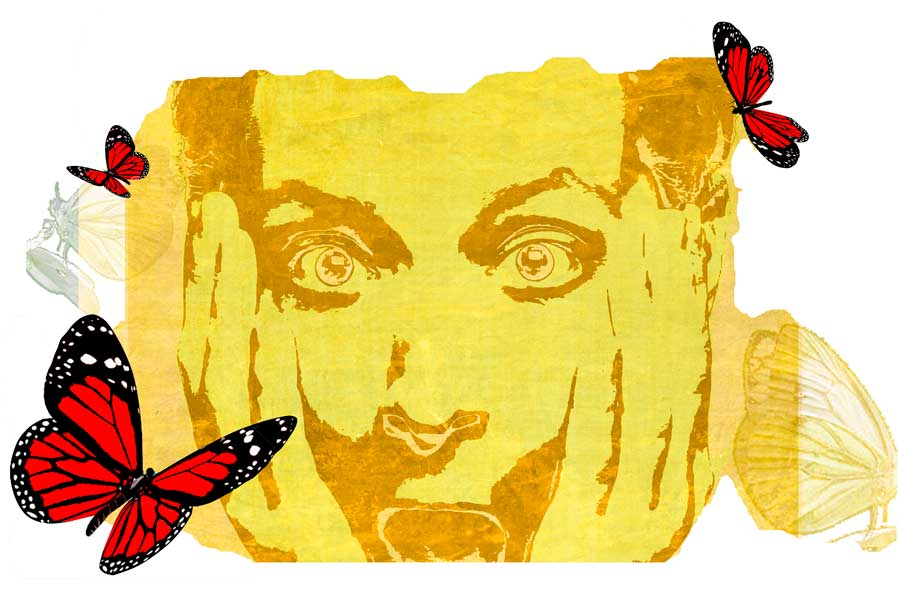

 
 <h1 align=center>তবু নারী অগাধ</h1>
<h2 align=center>ইন্দ্রজিৎ ঘোষ</h2> ইহার পর হইতে সিদ্ধান্ত লইয়াছি, নারীজাতির সহিত আমি আর কোনও রূপ সম্বন্ধ রাখিব না। এ সিদ্ধান্ত আমার বহু অভিজ্ঞতালব্ধ। আমি আমার এই ক্ষুদ্র জীবনে অবলোকন করিয়াছি যে, মেয়েরা অত্যন্ত কুরুচিপূর্ণ। ইহা ব্যতীত উহাদের সম্বন্ধে যে সকল কথা প্রচলিত, তাহার মধ্যে অনেক মিথ্যা ও গলদ বর্তমান, ইহা আমি নির্ভুল পর্যবেক্ষণ করিয়াছি। একাদিক্রমে সে বৃত্তান্তে আসিতেছি।

এক সুন্দরীকে দেখিয়াছিলাম, কেশরাশি তাহার কোমর ছাড়াইয়া গিয়াছে। দেখিয়া আমি যারপরনাই চমৎকৃত হইয়াছিলাম। কেননা দীর্ঘ কেশরাশিযুক্তা রমণী আজিকাল কদাচিৎ মেলে। শুনিয়াছি, পুরুষসুলভ ক্ষুদ্র কেশকর্তন ও বিন্যাস নাকি উহারা বাধ্য হইয়া করিয়া থাকে। কারণ বাংলার জল, বায়ু এবং তদুপরি বাঙালি পুরুষের আকর্ষণ ইহার প্রতিকূল। যাহা হউক, সেই রমণীকে দেখিয়া তাহার কেশভারের প্রেমে পড়িলাম। কেশ যদিও বিমূর্ত ধারণা নহে, তবুও শুধু কেশের প্রেমে পড়া যায় না। তাই গোটা রমণীটিরই প্রেমে পতিত হইলাম।

আমার বন্ধুর পাশের বাটীতে সে থাকিত। আমি বন্ধুর ছাদে গিয়া তাহাকে দর্শনের জন্য অপেক্ষা করিয়া রহিলাম। অকস্মাৎ দেখিলাম, ছাদের এক কোণে সে প্রায় উবু প্রণাম ভঙ্গিতে বসিয়া রহিয়াছে। দেখিয়া চিত্ত পুলকিত হইল। এই তো সনাতন সংস্কারসম্পন্না ভারতীয় নারী! ছাদে আসিয়াও ঈশ্বরকে স্মরণ করিবে, ইহাই তো উচিত। আমিও সনাতন বাঙালির বারো মাসে তেরো পার্বণ বিধি মানিয়া থাকি। কেবল আজিকেই নব্যপ্রেমের তাড়নায় পূজা করিবার ধৈর্যটুকু করিয়া উঠিতে পারি নাই।

আমি ছাদের সেই কোণে সরিয়া আসিলাম, যেখান হইতে তাহার আংশিক-দেখিতে-পাওয়াখানিকে সামর্থ্যের শেষ অনুযায়ী সামগ্রিকতায় পরিণত করা যায়। সেইখানে যাইয়া আমি সবিস্ময় অনুভব করিলাম, আমার প্রেমোদ্ভাবিনীর পশ্চাতে আরও এক নারী প্রায় তদ্রূপ উবু প্রণাম ভঙ্গিতে উপবিষ্টা। এবং একটি চিরুনি সহযোগে আমার সম্ভাব্য এলোকেশী প্রেমিকার আলুলায়িত কেশজালে কিসের যেন সন্ধান করিতেছে! ইহা দেখিয়া আমার নিজ বাটীর কথা মনে পড়িল। বাটিতে এরূপ প্রায়শই হইয়া থাকে। ভগিনী ও মাতার এরূপ উপবেশন ভঙ্গিমা আমার সুপরিচিত। নিঃসন্দেহে বলিয়া দিতে পারিব, সম্মুখবর্তিনীর মস্তকে উৎকুণ নামক পরজীবী সম্প্রদায় বংশবিস্তার না করিলে এ অপূর্ব দৃশ্যের অবতারণা সম্ভব নহে।

দীর্ঘকেশ চাহিয়াছিলাম, কিন্তু তাহার সহিত উকুন চাহি নাই। কাজেই রমণীটির প্রতি প্রেম আমাকে বিসর্জন দিতে হইল।

ইহার পর তাহার সহিত আমার পরিচয় হইয়াছে। রাস্তায় দেখা হইলে হাসিয়াছি। এবং পূর্বানুভূতি স্মরণ করিবার চেষ্টা করয়াছি। কিন্তু বরাবরই চোখের সম্মুখ দিয়া একটি বৃহৎ আকারের কৃষ্ণকায় চকচকে উকুন হাঁটিয়া গিয়াছে। 

এই ঘটনার পর বেশ কিছু দিন পর্যন্ত চলিল নিস্তরঙ্গ প্রেমহীন জীবন। আমি আজন্ম বিশ্বাস করি, মনুষ্যজাতি জানোয়ার হইতে এই প্রেম বৈশিষ্ট্যের দ্বারাই পৃথক। সুতরাং প্রেমহীন জীবন পশুজীবনেরই নামান্তর। অধিক দিন এই অমনুষ্যোচিত জীবন আমার ধাতে বরদাস্ত হয় না। আমি উত্তরণের চেষ্টা চালাইয়া গেলাম।

আমাদের পাড়ায় একটি মেয়ে থাকিত। তাহার নাম চম্পা। সে আমার জানালার সামনের রাস্তা দিয়া প্রত্যহ সকালে হাঁটিয়া যাইত। সে ঘাড়টিকে এক দিকে হেলাইয়া ‘আমি বনফুল গো’ গানটির মতো ‘ছন্দে ছন্দে দুলি আনন্দে’ ঢঙে হাঁটিত। দেখিলে জীবনানন্দের কবিতা মনে পড়িত— ‘যেন কোনো ব্যথা নেই’।

আমি তাহাকে পূর্বেও দেখিয়াছি। কিন্তু সে কখনও মরমে পশে নাই। সে দিন আমি রাস্তার পানে চাহিয়া উদাস নয়নে মনুষ্যজীবনের অসার্থকতার কথা চিন্তা করিতেছিলাম। এমত সময়ে আমার দৃষ্টি তাহার হণ্টন ভঙ্গিতে বিদ্ধ হইল। আমি পুনরায় মানুষ হইয়া উঠিলাম।

তাহার সহিত আলাপ জমাইয়া জানিতে পারিলাম, সে একাদশ শ্রেণিতে জীববিদ্যা লইয়া পড়িতেছে। শুনিলাম, জীববিদ্যার এক জন গৃহশিক্ষকের তাহার বিশেষ প্রয়োজন। তাহার সহিত এক বিশেষ লেখকের একটি জীববিজ্ঞান পুস্তকও। আমি তাহাকে দু’টিরই আশ্বাস দান করিলাম। 

জীববিজ্ঞান ক্রমে আমার ধ্যান-জ্ঞান হইয়া উঠিল। জীববিজ্ঞান না পড়িলে জীবন ব্যর্থ, এই ধারণা মনে দৃঢ়মূল হইয়া উঠিল। আমি তাহাকে গৃহশিক্ষকের সন্ধান দিলাম। যে পুস্তকের সন্ধান সে করিতেছিল, তাহা আমার গৃহেই পাইয়া গেলাম। এজন্য আমার ভগিনীকে জীববিজ্ঞান পড়ার সিদ্ধান্ত লওয়ার কারণে মনে মনে অজস্র ধন্যবাদ জ্ঞাপন করিলাম।

এই মহা সুযোগটিকে কাজে লাগাইলাম। একটি কবিতা লিখিয়া পুস্তকের পাতার ভাঁজে গুঁজিয়া দিলাম। কবিতা দিবার সুবিধা এই, ইহাতে প্রেমপত্রের ন্যায় ঝুঁকি নাই। কেহ জেরা করিতে আসিলে কবিতায় সম্বোধিত ‘তুমি’কে কোনও একটি সর্বজনীন প্রতীকী রূপ দিয়া দিলেই পত্রকবির সমস্ত দোষ ক্ষালন। কবিতার প্রতি আমার বিশেষ দুর্বলতাও রহিয়াছে; আমি কবিতা ভালবাসি এবং মনীষীদের জন্মদিনে একটি করিয়া কবিতা লিখিয়া থাকি।

যাহা হউক, কবিতা-সমন্বিত পুস্তকটি তাহার বাটীতে গিয়া তাহাকে দিলাম। সে জিজ্ঞাসা করিল, “ক’দিন পর ফেরত দেব?”

আমি বলিলাম, “যত দিন খুশি তুমি রাখ।”

সে কহিল, “তাও কি হয়! আপনার বোনের লাগবে না?”

এই ‘আপনি’ সম্বোধন আমাকে  পীড়া দিল। যদিও আমাকে বয়সের তুলনায় বড় দেখিতে লাগে, তবুও আমি মাত্র সেকেন্ড ইয়ারের ছাত্র, চব্বিশ বছরের কচি কিশোর। দুই-তিন বার কেবল অসুখের কারণে পরীক্ষায় বসিতে পারি নাই। ইহার আগের আলাপগুলিতে সম্বোধনের অতটা প্রয়োজন পড়ে নাই। এই প্রথম তাহার সম্বোধন এবং ‘আপনি’ সম্বোধন শুনিয়া যারপরনাই মনোকষ্ট হইল। কেননা ‘আপনি’ দূরত্ববাচক সম্বোধন। যাহা হউক, আমি বলিলাম, “ঠিক আছে, সপ্তাহখানেক রাখো।”

এর পর সে “আচ্ছা, ঠিক আছে,” বলিয়া গুটিগুটি গৃহাভ্যন্তরে চলিয়া গেল। চা-পান দূরস্থান, বসিতে পর্যন্ত বলিল না। অশ্রুসিক্ত মন ও বেদনাহত ভগ্নহৃদয় লইয়া ফিরিয়া আসিলাম।

দিন যতই বাড়িতে লাগিল, উৎকণ্ঠাও ততই বর্ধিত হইতে লাগিল। শেষকালে ছ’দিনের মাথায় তাহার গৃহে উপস্থিত হইলাম। মনে আশা, আমার কবিতা সফল হইবেই। সাড়ে চার দিন ধরিয়া অভিধান ঘাঁটিয়া, স্বরভক্তি অভিশ্রুতি গুলিয়া খাইয়া, পয়ার ছন্দে কবিতা রচনা করিয়াছি। উহা সফল না হইয়া যায় না।

“ভালই হল আপনি এসেছেন। আমি কালকেই আপনাকে বই ফেরত দিয়ে আসতাম। থ্যাঙ্ক ইউ...” বলিয়া সে পুস্তকটি আমার হাতে প্রদান করিল। আমি চট করিয়া পুস্তকটি দেখিয়া লইলাম। কোনও উত্তরপত্র তাহাতে ছিল না। বাধ্য হইয়া, লজ্জার মাথা খাইয়া, গলা খাঁকরাইয়া তাহাকে কাতর কণ্ঠে কহিলাম, “এর মধ্যে একটা কাগজ ছিল না?”

সে থতমত খাইয়া গেল, “ওটা আপনার…” বলিয়া সে লজ্জারুণ মুখে মাটির পানে মুখ করিল। আমার হৃদয়ে তখন পিচরোলারের ঘড়ঘড়। মুখ ঊর্ধ্বে তুলিয়া অপরূপ ভঙ্গিতে সে বলিল, “আসলে আমি ভেবেছিলাম…” সে যাহা বলিল তাহার মর্ম— আমার স্বপ্ন, আকাঙ্ক্ষা, লোডশেডিং-এর ঘাম ও সাড়ে চার দিনের সমন্বয়ে নির্মিত সেই অমূল্য কবিতার কাগজটিকে সে কোনও উটকো বাতিল কাগজ মনে করিয়া ঝাঁট দিয়া ফেলিয়া দিয়াছে। যেন গ্যাসবেলুন হঠাৎ ফুটা হইয়া গেল এবং আমি ধপাস করিয়া ভূমিতে আছাড় খাইলাম। ভগ্নদেহ লইয়া তাহাকে দূর হইতে নমস্কার করিলাম।

ইহার পর কিছু দিন সময় ব্যথিত নিঃসঙ্গতায় প্রবাহিত হইল। কিন্তু এ মরুদশা বেশি দিন স্থায়ী হইল না। অপরূপা নামে ফার্স্ট ইয়ারের একটি মেয়ে আমার জীবনে উত্তরণের মই হইয়া আসিল। সত্যিই অপরূপ তাহার রূপ। আপেলের তুল্য তাহার গাত্রবর্ণ। ওই রঙের চিবুকের উপর একটি তিল খেলা করিত। ছেলের দল হুমড়ি খাইয়া তাহার প্রেমে পড়িতে শুরু করিল। এবং এই কারণবশত অপরূপা সর্বদা উৎসাহে টগবগ করিত। আমিও তাহার প্রতি আকৃষ্ট হইলাম। কিন্তু পূর্ব অভিজ্ঞতা আমাকে গম্ভীর, সৌম্যকান্তি ও ধীরোদাত্ত করিয়া তুলিয়াছিল। বোধ করি আমার এই ধ্যানগম্ভীর ভাবমূর্তি তাহাকে বিচলিত করিয়াছিল। সে আমার সহিত সময় অতিবাহিত করিতে অধিক পছন্দ করিতে লাগিল।

অপরূপা খুব ভাল মেয়ে ছিল। সে বাংলার সংস্কৃতিকে বিশেষ ভালবাসিত। বছরে দু’বার করিয়া শান্তিনিকেতন যাইত। সে আমাকে জিজ্ঞাসা করিয়াছিল পূর্বে আমি শান্তিনিকেতন গিয়াছি কি না। আমি নেতিবাচক উত্তর দিবার পর সে বলিয়াছিল, “ইফ ইউ গো দেয়ার, ইউ উইল আন্ডারস্ট্যান্ড হোয়াট বেঙ্গল’স কালচারাল হেরিটেজ ইজ়।”

আমি উত্তর করিয়াছিলাম, “রিয়্যালি, আই অ্যাম ভেরি অভাগা। আই স্টিল ডোন্ট নো মাই রুটস।”

এরূপে আমাদের মধ্যে অনেক তত্ত্বালোচনা চলিত।

আমরা ক্যান্টিনেও মাঝে মাঝে জ্ঞানকথা বলিতাম। লক্ষ করিতাম, ক্যান্টিন ফাঁকা থাকিলে অপরূপা কেমন ঝিমাইয়া থাকিত। কিন্তু ক্যান্টিন টেবিলধ্বনিতে মুখরিত ও নেশাসক্তদের ধূমপানে আচ্ছন্ন থাকিলে সে জীবনীশক্তিতে টগবগ করিয়া ফুটিত, চতুর্দিকে চোখ ঘোরাইতে ঘোরাইতে অনর্গল কথা বলিয়া চলিত এবং মাঝে মাঝে চুল, ওড়না ইত্যাদি ঠিকঠাক করিয়া লইত।

অপরূপা সাহিত্য ভালবাসিত। ফলে তাহার সহিত আমার সম্পর্ক গাঢ় হইয়াছিল। সে কখনও কখনও আবৃত্তি করিত। কণ্ঠস্বরকে উচ্চগ্রামে তুলিয়া, হঠাৎ খাদে নামাইয়া, অযথা ইংরেজি রহস্যরোমাঞ্চ ছায়াছবির মতো ষড়যন্ত্রের সুরে আবৃত্তি করিয়া আড্ডা জমাইয়া তুলিত। সে ‘জীবনানন্দের কুমোর পাড়ার গরুর গাড়ি’ ও ‘নজরুলের ধনধান্য পুষ্পে ভরা’— এই দু’টি কবিতারই বিশেষ আবৃত্তি করিত। আর কোনও কবিতা কখনও তাহার মুখে শুনি নাই। নিন্দুকেরা আড়ালে বলিত, ইহা ভিন্ন আর কোনও পদ্য তাহার জানা ছিল না। সে অবশ্য বলিয়াছিল, কবিতাদু’টি তাহার বিশেষ পছন্দের।

এক দিন ট্রামে করিয়া তাহার সহিত আসিতেছিলাম। ট্রাম তখন ভিক্টোরিয়ার পাশ দিয়া আসিতেছিল। গোধূলির কনে দেখা আলো তাহার মুখে পড়িল। সৌন্দর্যের এক আশ্চর্য সংজ্ঞা তৈরি হইয়া গেল। পরিবেশের সহিত সঙ্গতি রাখিয়া বলিলাম, “এই সময় পৃথিবীকে কেমন অদ্ভুত সুন্দর মনে হয় না?” রাস্তায় আপাত গতিশীল কুলফিয়ালাকে দেখিতে দেখিতে সে বলিল, “মিষ্টির মতো।”

আমি চমৎকৃত হইলাম। তাহার এরূপ ইন্দ্রিয়গ্রাহ্য উপমা এবং আড়ম্বর অলঙ্কারহীন সরল অথচ ইঙ্গিতপূর্ণ তাৎপর্যময় ভাষার ব্যবহার আমাকে আরও মুগ্ধ করিয়া দিল। ভিক্টোরিয়ার মাথায় আমি কিটসকে দেখিতে পাইলাম। পরিবেশে কেমন যেন পরিবর্তন আসিল। তাহার নিঃশ্বাসের হাওয়া আমার নিকট মিষ্টত্বপূর্ণ হইয়া উঠিল। তাহার উড়ন্ত একক চুল ক’টি মিষ্ট মিষ্ট রেখা আঁকিতে লাগিল। তাহার সমস্ত উপস্থিতি মিষ্টত্বময় হইয়া উঠিল। আমি সৌম্যগম্ভীর মুখে একটু বিস্মিত হাসি আনিয়া তাহাকে জিজ্ঞাসা করিলাম, “তুমি এত মিষ্টি কেন?”

সে তৎক্ষণাৎ হাসিয়া উঠিল, আমার দিকে পূর্ণ এবং ইঙ্গিতপূর্ণ দৃষ্টিতে তাকাইয়া বলিল, “তোমার তো ডায়াবেটিস নেই!”

উত্তরস্থ ইঙ্গিত আমাকে শেলবিদ্ধ করিল। আমার ভাল লাগিল না। কেননা প্লেটো এবং চণ্ডীদাস আমার বিশেষ পছন্দের ব্যক্তি। পরে জানিয়াছিলাম, অপরূপার অম্বলের এবং তাহার পিতৃদেবের ডায়াবেটিসের ধাত ছিল। ফলত, তাহার মনে এটা-ওটা মিষ্টদ্রব্য খাইবার লোভ সর্বদা চনমন করিয়া বেড়াইত। শুধু মিষ্টান্ন নহে, বিভিন্ন ধরনের খাদ্যদ্রব্যের প্রতিই ছিল তার অদম্য আকর্ষণ। সুখাদ্যের বিনিময়ে সে নিজস্ব নানা মিষ্টতাও অপরাপর পুরুষদিগের হাতে টুকটাক তুলিয়া দিয়াছে। এ কারণেই সে তখন ডায়াবেটিসের প্রসঙ্গ তুলিয়াছিল। এ সম্বন্ধে আমি নিশ্চিত হইয়াছিলাম, যখন সে ট্রাম হইতে নামিয়াই মিষ্টি খাইবার আবদার করিয়াছিল।

এরূপ ক্ষুধা ও হ্যাংলামিবিশিষ্ট মেয়ের সহিত আর যোগাযোগ রক্ষা করা আমার পক্ষে সম্ভবপর ছিল না। অতএব আমি তাহার সংস্রব ত্যাগ করিলাম। প্রেমের গলদে হ্যাটট্রিক করিবার পর আমার মধ্যে বিশেষ বৈরাগ্যের উদয় হইল। রমণীদিগের সহিত কোনপ্রকার যোগাযোগ রাখিব না, সিদ্ধান্ত করিলাম। আপাতত এই আমার রমণীবিমুখতার বৃত্তান্ত। কিন্তু...

হ্যাঁ, এত সবের পরও একটি কিন্তু থাকিয়া গিয়াছে। কারণ অভিজ্ঞ পাঠকবন্ধুরা সেই বিখ্যাত প্রশ্নটির উত্তর জানেন।

প্রশ্নটি হল— নেড়া বেলতলায় কয়বার গমন করে?

অনভিজ্ঞেরা বলিবেন, এক বার। কিন্তু এ উত্তর ঠিক নহে।

প্রকৃত উত্তরটি হল, যত ক্ষণ না বেল পড়িয়া বেলমুণ্ডটি ফট হইতেছে, তদবধি তাহার গমনাগমন অব্যাহত থাকে। এখানেই শেষ নহে, বেলমুণ্ডটি ফট হইবার পরও বহু জনের গতায়াত বন্ধ হয় না— কারণ, ‘দুর্ঘটনা কি আর বারবার ঘটে হে!’—জাতীয় ভাবাদর্শ তাহাদিগের অনুপ্রেরণা সঞ্চার করে। সেই কারণেই...

পুনশ্চ: আমি আজ সকালে উঠিয়াই নিখুঁত ক্ষৌরকর্মের দ্বারা মুখমণ্ডল পরিষ্কার করিয়াছি। তাহার পর উত্তমরূপে গন্ধদ্রব্য মাখিয়াছি। চুলে শ্যাম্পু দিয়াছি। লঘুহস্তে ফুলেল তৈল বুলাইয়া বিন্যাসও করিয়াছি। আলমারি হইতে বাহির করিয়া পাটভাঙা পাজামা পাঞ্জাবি পরিয়াছি। আজ আমার ভগিনীর বান্ধবী আসিবে। সে ভগিনীর হাত দিয়া পত্র পাঠাইয়াছে যে, সে আমাকে বিশেষ শ্রদ্ধা করে এবং আমার সহিত আলাপে বিশেষ ভাবে ইচ্ছুক। সুতরাং...