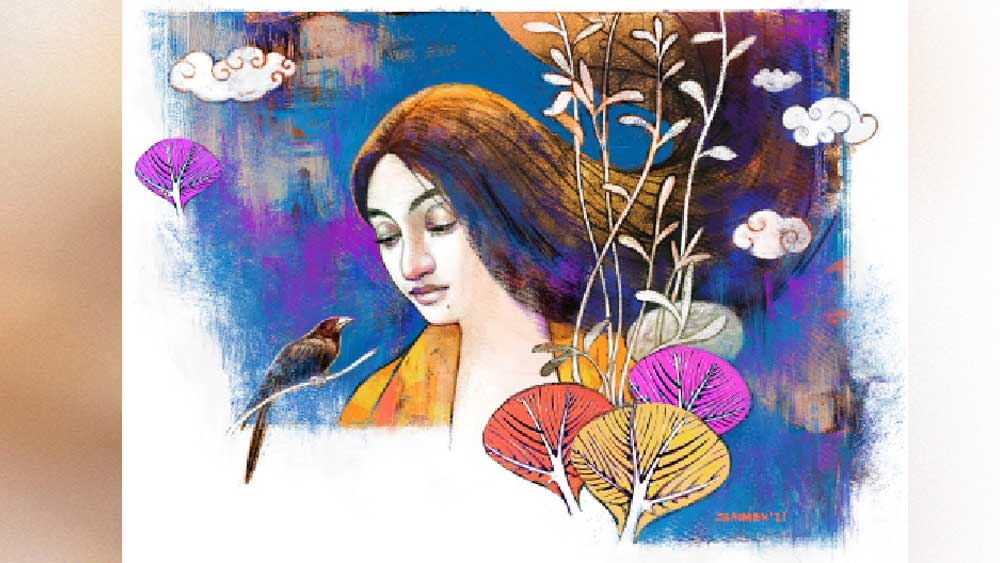

 

<h1 align=center>তিমিরহনন</h1>
<h2 align=center></h2>
চ   াকরিটা কি তোর আর দরকার নেই?”   “কেন কৃষ্ণাদি!”   “এ মাসে ক’দিন কামাই করলি?”   “কী করব! কাল আসার পথে ও জোর করে বি গার্ডেন নিয়ে গেল!”   “আর গত সপ্তাহে?”   “ওর জন্মদিন ছিল। আমায় বলল সকাল থেকে ওর বাড়ি নেমন্তন্ন।”   “আর তুই ড্যাং ড্যাং করে চলে গেলি! লোকের কথা বাদ দে, তোর ছেলেমেয়েরা শুনলে কী ভাববে!”   যার উদ্দেশে বলা, সে চুপ। কৃষ্ণা একটু থেমে বলে, “অনিতা, চাকরি গেলে আদিত্যর কিছু নয়। দেশে ওর জমি-বাড়ি আছে। চাষ-আবাদ করে বা জমি বিক্কিরি করে বাকি জীবন কাটিয়ে দেবে। তোর কী হবে?”   চোখ নাচিয়ে অনিতা বলে, “ও যদি আমায় বিয়ে করে!”   “সেটা তোমাদের ব্যাপার!” বলতে বলতে ঠোঁট বেঁকিয়ে নিজের কাজে যায় কৃষ্ণা। পেছনে অনিতা।   তাদের বিয়ার কারখানায় প্রোডাকশন সেলে ছেলেরা কাজ করে। মেয়েরা প্যাকেজিং-এ। দুপুরে ক্যান্টিনে সবার মধ্যে একটু-আধটু গল্পগুজব। আদিত্যর সঙ্গেও অনিতার পরিচয় এখানেই। অনিতা দেখত, আদিত্য কারও সঙ্গেই তেমন কথা বলছে না। টিফিনবক্স থেকে নিঃশব্দে খেয়ে হাত-মুখ ধুয়ে চলে যাচ্ছে। অনিতাই আলাপ করেছিল। পরে কৃষ্ণার কাছে জেনেছিল আদিত্যর দেশের বাড়ি ঘাটালে। এক নৌকোডুবিতে ছেলে-বৌ মারা যায়। আর বিয়ে করেনি। ধুলাগড়ে এসে এই কারখানায় কাজে লেগেছে। কাছাকাছি ভাড়া থাকে। নিজেই রেঁধে খায়। শুনে কষ্ট হয়েছিল অনিতার।   তার পর থেকে অনিতা রোজ এগিয়ে এসে আদিত্যর সঙ্গে কথা বলত। আদিত্য কামাই করলে খোঁজ নিত। এক দিন কারখানা হঠাৎ ছুটি হয়ে যাওয়ায় সবাই সিনেমা দেখতে গেল। অনিতার পাশেই আদিত্যর সিট পড়ল। আর অনিতার হাতটা কিছু ক্ষণ পর আদিত্যর হাতে চলে গেল।      তার পর গঙ্গা দিয়ে অনেক জল গড়িয়ে গেছে। মাঝেমধ্যে দু’জনে টুকটাক বেড়াতে গেছে। অনিতা কয়েক দিন ঘুরেও এসেছে আদিত্যর বাড়ি। আদরে আদরে তাকে ভরিয়ে দিয়েছে আদিত্য। বিয়েরও প্রস্তাব দিয়েছে। ছেলেমেয়ের কথা, লোকলজ্জার কথা ভেবে অনিতা রাজি হয়নি। না হলে আদিত্যকে স্বামী হিসেবে পেতে তারও যে ইচ্ছে করে না তা নয়। যেমন সুপুরুষ, তেমনি মিষ্টি ব্যবহার! তাদের প্রেমের কথা মুখে মুখে ছড়িয়ে পড়তে দেরি হয়নি।   একদিন সকালে বাজারে পাশের গ্রামের গুরুপদ মণ্ডলকে ডেকে গৌর বৈরাগী বলল, “আর ভায়া, আমাদের গ্রামের অনিতা যা শুরু করেছে!... ওই যে গো, পঞ্চানন বৈরাগী ছিল না! বছরপাঁচেক আগে অ্যাকসিডেন্টে মারা গেল, তার বিধবা!”   “তা সে কী করেছে?” রসালো খবরের ইঙ্গিত পায় গুরুপদ।   “ছেলেমেয়েদের বিয়ে হয়ে গেছে, ক’দিন পর নাতি-নাতনি হবে! আবার বিয়ে করবে বলে নাচানাচি শুরু করেছে!”   “সে কী গো! মাগির বয়স কত?”   “পঁয়তিরিশ-ছত্তিরিশ হবে!” বলে রহস্যময় হাসে গৌর। তার পর ঠোঁট চাটতে চাটতে বলে, “গায়ে-গতরে বেশ! টুকটুকে ফর্সা! টানা টানা চোখ নাক!”   “বিয়ের দরকার কী! তুমিই তো মাঝেমধ্যে...” গুরুপদও ঠোঁট চাটে।   খ্যাকখ্যাক হাসিতে ফেটে পড়ে গৌর। সে চেষ্টা কি সে করেনি!   গুরুপদ শুধোয়, “পাত্তরটা কে?”   “ধুলাগড়ে যে কারখানায় কাজ করে অনিতা, সেখানেই এক দামড়ার সঙ্গে লটরপটর। এখন একটা পাকাপাকি ব্যবস্থার ইচ্ছে।”   “তোমরা জানলে কী করে?”   “কাল রাত্তিরে মায়ে-পোয়ে তুমুল ঝগড়া। আমাদের বাড়ি পাশেই। সব কথা শুনতে পাচ্ছিলুম। হারাধন আগেই মেলামেশার খবর পেয়েছিল। যেই ধরেছে অনিতাকে, অমনি সে তেলে-বেগুনে জ্বলে উঠল। চেঁচিয়ে বলল, ‘তোর কী! তুই আমায় খাওয়াস না পরাস! বিয়ের পরেই বৌয়ের কথায় আলাদা হয়ে গেলি!’ হারাধন আরও রেগে গিয়ে বলল, ‘তাই বলে তুমি যা খুশি তাই করবে?’ অনিতা বলল, ‘বেশ করব! প্রেম করব, দরকার হয় বিয়ে করব!’... বলামাত্তর অনিতার চুলের ঝুঁটি ধরে হারাধন... আমার বৌ সুমিত্রা দৌড়ে গিয়ে না ছাড়ালে…”   এই আলোচনা ঘণ্টার পর ঘণ্টা চলতেই পারত। কিন্তু বাজারে দেরি করলে গুরুপদর গিন্নি তাকে আস্ত রাখবে না। তাই সে বিদায় নেয়। গৌরও তার পথ ধরে।      ছেলের হাতে মার খেয়ে রাতে একটুও ঘুম হয়নি অনিতার। গায়ে-গতরে ব্যথা। জ্বরভাব। জানলা দিয়ে সে শূন্য দৃষ্টিতে আকাশের দিকে তাকিয়ে আছে। সামনের কৃষ্ণচূড়া গাছে একটা কোকিল ডেকে যাচ্ছে। অন্য দিন এই ডাকটা খুব ভাল লাগে। আজ তার চোখে জলের ধারা।   হঠাৎ সুমিত্রা দরজা ঠেলে ঢোকে। অনিতা জানত সুমিত্রাদি আসবে।   অনিতার পাশে বসে পরম মমতায় অনিতার চোখের জল মুছে দেয় সুমিত্রা। বয়সে অনিতার চেয়ে সে কিছুটা বড়। অনিতাকে বোনের মতো ভালবাসে। বাউরিয়া কটন মিলে বাঁধা চাকরি সত্ত্বেও সংসারের জন্য পঞ্চাননের তেমন কিছু না করা, রাতদিন নেশা করে অনিতার ওপর অত্যাচার, অকালমৃত্যু— সবই তার জানা। তিনটে পেট চালাতে অনিতা তখন হিমশিম। উচ্চ মাধ্যমিক পাশ সে। নার্সিং শিখবে বলে উঠে পড়ে লেগেছিল। কিন্তু হয়ে ওঠেনি। সুমিত্রাই তখন তার মাসতুতো বোন কৃষ্ণাকে বলে অনিতার চাকরিটা করে দেয়। কৃষ্ণা আগে থেকেই ধুলাগড়ের কারখানায় কাজ করত।   কৃষ্ণার কাছেই অনিতার প্রেমের ব্যাপারটা শুনেছে সুমিত্রা। তার মনে হয়েছে, ভালবাসার কাঙাল মেয়েটা যদি ভালবাসা পায়, তাতে কার কী!   এক সময় সুমিত্রাই নীরবতা ভাঙে। বলে, “ছি ছি, হারাধন এটা কী করল! দশ মাস দশ দিন যে তাকে পেটে ধরল, তার গায়ে হাত!”   এত ক্ষণ নিঃশব্দে কাঁদছিল অনিতা। এ বার ডুকরে কেঁদে উঠল, “আমি ছেলেমেয়ের জন্যে কী না করেছি, বলো তুমি! নিজের সমস্ত গয়নাগাঁটি দিয়ে মেয়ের বিয়ে দিয়েছি! কারখানায় কাজ করে টাকা জমিয়ে হারাধনের আলু-পিঁয়াজের দোকান…”   “সব জানি বোন, সব জানি! তুই একটু শান্ত হ!”   উত্তর দেয় না অনিতা। সুমিত্রা বলে চলে, “আজ বেরোসনি ভাল হয়েছে। রান্না চাপা। পেটে কিছু দে। নয়তো শরীর খারাপ হবে!” বলতে বলতে চলে যায়। হাতে তার অনেক কাজ। কত্তা বাজার থেকে চুনো মাছ এনেছে। সেগুলো বাছতে হবে।   আগের মতোই জানলা দিয়ে আকাশের দিকে তাকিয়ে অঝোরে কেঁদে চলে অনিতা। বেশ কিছু ক্ষণ চোখের জলে ভাসতে ভাসতে একটা সিদ্ধান্ত নিয়ে ফেলে। চূড়ান্ত সিদ্ধান্ত।   হঠাৎ তার ঘরে প্রথমে ঝটপট, তার পর ধপাস করে একটা শব্দ হয়।   হারাধন আর তার বৌ পাশের ঘরেই ছিল। আওয়াজ শুনে দৌড়ে যায়। দেখে অনিতা সিলিং ফ্যানের রডে শাড়ি পেঁচিয়ে... দেখেই হারাধনের বৌ চিল চিৎকার জুড়ে দেয়। আর হারাধন আবার তার মাকে এই মারে কি সেই মারে...   সুমিত্রা আবার এল। পিছু পিছু পাড়ার আরও অনেকে। সুমিত্রা এসেই অনিতাকে বুকে জড়িয়ে ধরে ঝরঝর করে কেঁদে ফেলল, “এ কী করেছিস তুই! একটু আগে তোকে যে অত কথা বলে গেলাম! ছি ছি ছি!”   অনিতা কোনও উত্তর না দিয়ে ফুঁপিয়ে ফুঁপিয়ে কাঁদতে লাগল।   সকলে উপদেশ দেওয়া শুরু করল, “নিজের ভাল নিজে বুঝতে শেখো অনিতা!... তোমায় কি এ সব মানায়! অল্প বয়সে লোকে প্রেমট্রেম করল, ঠিক আছে। কিন্তু এই বয়সে!...তার পর নিজেকে শেষ করে দেবার চেষ্টা! কত বড় পাপ এটা!... কারখানার কাজ এ বার ছেড়ে দাও! ইনকাম যদি করতেই হয়, জরির কাজ বা সেলাইয়ের কাজ করো।”   গম্ভীরমুখে জ্ঞানের কথা বলে পিছন ফিরে সবাই ফিকফিক হাসছিল। দু’এক জন টিকা-টিপ্পনিও করল...“ঝুলনযাত্রা ফস্কে গেল!”   এত অবজ্ঞা! এত অপমান! চোয়াল দুটো শক্ত হল অনিতার।   অনেকে চলে গেলেও কয়েকজন তখনও ঘর-বারান্দা করছিল। অনিতা উঠে বসে বেশ ঝাঁঝালো গলায় তাদের উদ্দেশে বলে, “আপনারা এ বার আসতে পারেন! আমি একটু রান্না বসাব! খুব খিদে পেয়েছে!”   হারাধনের বৌ দরদ দেখিয়ে বলল, “আজ না-হয় আমিই ভাত দিচ্ছি! চান করে খেয়ে নাও।”   আপত্তি জানায় অনিতা, “না না! দরকার নেই! আমি করে নিচ্ছি!”   “দেখো, আবার কিছু গোলমাল করে বোসো না যেন!”   একে একে বিদায় নেয় সবাই।   স্টোভে খিচুড়ি চাপিয়ে, পাখার ভাঙা রডটার দিকে তাকিয়ে অনিতা মনে মনে বলে, ‘বড্ড বাঁচিয়ে দিয়েছিস তুই! না হলে এত ক্ষণে...’   চোখ সরিয়ে এ বার আসবাবগুলোর দিকে তাকায়। বাবা-মার কাছে বিয়েতে পাওয়া খাট-আলমারি-ড্রেসিং টেবিল। পঞ্চাননের কেনা শো-কেস, নিজের কেনা টিভি! এ সব তো নিয়ে যাওয়া যাবে না! শয়তান ছেলেটা তা হলে আবার…   দুপুরে চার দিক শুনশান, পুকুরে স্নান করতে যায় অনিতা। কোকিলটা তখনও কৃষ্ণচূড়া গাছে বসে। ডাকাডাকি করছে না। তার দিকে তাকিয়ে মিটিমিটি হাসল অনিতা। মনে মনে বলল, ‘কী রে! থামলি কেন! চেঁচা! যত ক্ষণ না তোর কোকিলা পাশে এসে বসে চেঁচিয়ে যা!’   পুকুরপাড়ের গন্ধরাজ গাছটা ফুলে ফুলে ঢাকা। চার পাশে কী সুন্দর গন্ধ! মাত্র ক’টা দিনের জন্যে ফুলগুলো থাকে! বুক ভরে শ্বাস নেয় অনিতা। ঠিক করে, স্নান সেরে কয়েকটা গন্ধরাজ নেবে। রাধাকৃষ্ণের পায়ে দেবে। বাড়ি ফিরে পুজো সেরে, খাওয়া-দাওয়া মিটিয়ে মোবাইলটা অন করে। দেখে আদিত্যর একটা মিসড কল। সঙ্গে সঙ্গে কল ব্যাক করে। ফোন ধরেই আদিত্য জানতে চায়, “কী ব্যাপার! কাজে এলে না?”   অনিতা বলে, “শরীর খারাপ, তাই যেতে পারিনি!”   শুনেই হাঁ  হাঁ করে ওঠে আদিত্য, “সে কী! কী হয়েছে তোমার!”   “তেমন কিছু নয়। কাল যাব। ম্যানেজারকে একটু জানিয়ে দিয়ো। রাখছি,” বলে ফোনটা কেটে দেয়। সে জানে পাশের ঘরে বৌ আড়ি পেতে বসে আছে। শাশুড়ি কী কথা বলছে, কার সঙ্গে কথা বলছে, সব শুনছে।   আলমারি থেকে নিজের জামাকাপড়গুলো একে-একে বার করল অনিতা। পুরনো বাতিল করে নতুনগুলো বেছে রাখতে লাগল। কিছু কিছু করে আদিত্যর বাড়ি পাঠিয়ে দেবে। এক সঙ্গে নিয়ে গেলে সবার চোখে পড়ে যাবে।   জামাকাপড় গোছাতে গোছাতেই সে পেয়ে গেল তার ছেলেমেয়ের ছোটবেলার কয়েকটা পোশাক। সেগুলো বুকের কাছে, নাকের কাছে চেপে ধরে প্রাণপণে ঘ্রাণ নিতে লাগল। আবার তার চোখ ফেটে জল এল। অঝোরে কাঁদতে লাগল সে।      