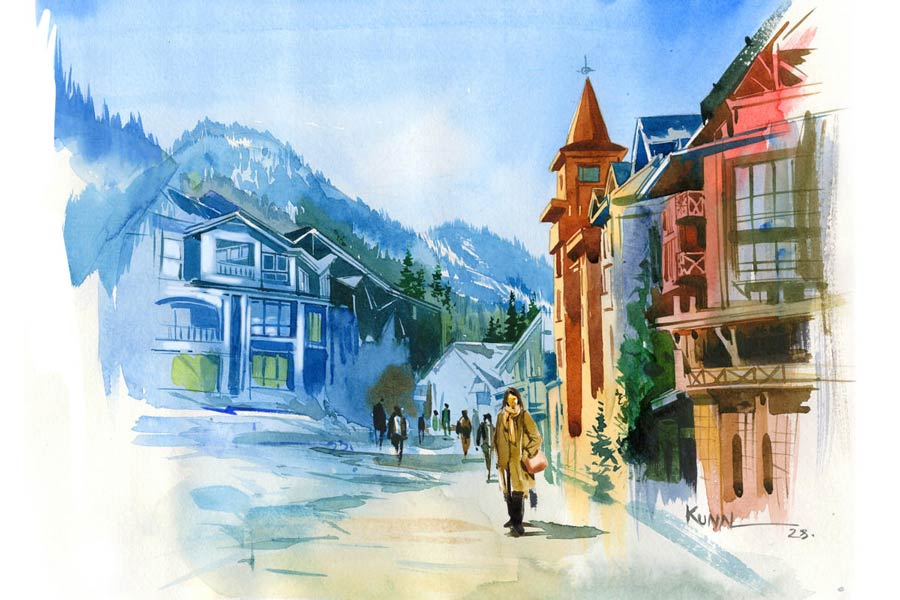

 
 <h1 align=center>তুষারমানব</h1>
<h2 align=center>অন্তরা চট্টোপাধ্যায়</h2> হাতের ব্ল্যাক কফিটা ধীরে ধীরে শেষ করে আর একটা অর্ডার দিল জেনিফার। কফি শপের বাইরে কাচের দেওয়ালের ও পারে পৃথিবীটা নীল-সাদা রঙের পিকচার পোস্টকার্ড। দুধসাদা পাহাড়চুড়োয় ঘেরা নীলচে সাদা বরফে ঢাকা উপত্যকার ঢালে অসংখ্য রঙিন চলন্ত বিন্দু। আউলিতে এই সময় স্কিয়িং সিজ়ন। প্রতি বার রয়ের সঙ্গে এখানে আসে জেনিফার। মানে আসত। গত পনেরো বছর ধরেই। দু’হাজার সতেরো সালে রয় তার জীবন থেকে চলে গেছে। তার পর থেকে এখন একাই আসে সে।

তার দ্বিতীয় ধোঁয়া-ওঠা কফির কাপ এসে গেছে টেবিলে। কফিতে আবার ধীর গতিতে চুমুক দিতে দিতে বাইরে চোখ মেলে জেনিফার। হোটেলের ঠিক সামনে বরফে ঢাকা রাস্তায় একটা বড়সড় স্নোম্যান বানিয়ে রেখেছে কারা। তার মাথায় লাল টুপি, হাত ঢাকা লাল উলের গ্লাভসে, বিট-গাজর দিয়ে চোখ, নাক তৈরি করা, আর তার গায়েও রয়েছে নানা সাজ। কিন্তু আজকে রোদের তাপ বেশ চড়া। ধকধক করে নীল শিখার মতো যেন আকাশটা জ্বলছে। রোদের তাপে স্নোম্যানটা জায়গায় জায়গায় গলে গিয়ে একটু বেঢপ, বিকৃত হয়ে গেছে। স্নোম্যানটার দিকে তাকিয়ে জেনিফার আনমনে ভাবতে থাকে, কানাডায় এ রকমই বরফের মধ্যে মার্টিনাকে নিয়ে হয়তো ক্রিসমাসের ছুটির দুপুর কাটাচ্ছে রয়। যাকগে! যে যেখানে যে ভাবে ভাল আছে, থাক।

এই কানাডায় প্রাইভেট ব্যাঙ্কে বিশাল মাইনের চাকরি নিয়ে চলে যাওয়াকে কেন্দ্র করেই দ্বন্দ্বের সূত্রপাত রয় আর জেনিফারের। জেনিফার জীবিকার জন্য জীবনকে নষ্ট হতে দিতে চায় না। জন্ম থেকেই সে দেহরাদূনে মানুষ। তার শিক্ষা, দীক্ষা, চাকরি সবই সেখানে। ঐতিহ্যময় দেহরাদূন পাবলিক স্কুলের শিক্ষিকা সে। এখানে এইচডিএফসি ব্যাঙ্কের যে ব্রাঞ্চে তার স্যালারি অ্যাকাউন্ট, সেখানেই রয় ছিল ম্যানেজার। সেখানেই জেনিফারের আলাপ তার সঙ্গে। আলাপ গড়ায় প্রেম ও পরিণয়ে। কিন্তু রয় উচ্চাকাঙ্ক্ষী। আরও উঁচু পদে সে বার কয়েক সিঙ্গাপুর ও কানাডায় টেম্পোরারি ট্রান্সফার নিয়েছে। তখনই সে চেয়েছিল কানাডায় থিতু হতে। কিন্তু ভারতের মাটি ছেড়ে বিদেশে যেতে চায়নি জেনিফার। এ দেশে তার বাবা-মা আছেন। দেহরাদূন পাবলিক স্কুলে পড়ানো ছাড়াও একটি এনজিও-তে অনাথ শিশুদের পড়ায় সে। নিজস্ব একটি ‘যোগা অ্যান্ড ওয়েলনেস সেন্টার’ রয়েছে তার। নিজের এই জগৎটা তার কাছে ভীষণ দামি, কোটি ডলারেও সে তা ছাড়তে নারাজ।

ইতিমধ্যে রয়ের সঙ্গে তার কানাডিয়ান সহকর্মী মার্টিনার সম্পর্কের কথাও জানতে পেরেছে জেনিফার। অবশেষে বছরদুয়েক আগে কাগজে-কলমে রয়ের সঙ্গে তার বিবাহিত জীবনের ইতি ঘটে।

জেনিফারের বেস্ট ফ্রেন্ড তার একমাত্র ছেলে ড্যানিয়েল। তার জীবনকে কখনও শূন্য হতে দেয়নি তার ড্যানিবয়। হস্টেলে থেকে পড়াশোনা করলেও প্রতি সপ্তাহান্তে বা ছুটিতে বাড়িতে আসা, কিংবা প্ল্যান করে ছোট-বড় ট্যুরে বেরিয়ে পড়া, প্রতিদিন মেসেজ করা বা ভিডিয়ো কলিং-এর মাধ্যমে যোগাযোগ ও শেয়ারিং চলতেই থাকে মা আর ছেলের। ড্যানিকেই একমাত্র কিম-এর কথা বলেছে জেনিফার।

তিন বছর আগে এই আউলিতেই কিম-এর সঙ্গে আলাপ জেনিফারের। প্রতি বছর অন্য অনেক বিদেশির মতোই কিমও আউলি আসে স্কি করতে। কিম বৌদ্ধ। আউলিতে স্কিয়িং সেরে সে চলে যায় বুদ্ধগয়ায়। কখনও বা চলে যায় লুম্বিনী বা সারনাথে তার প্রভুর চরণে শ্রদ্ধা নিবেদন করতে। সাউথ কোরিয়ার সোল শহরের বাসিন্দা কিম। আলাপ হওয়ার পর থেকেই সুন্দর বন্ধুত্ব গড়ে ওঠে দুই ভিন্ন ধর্মাবলম্বী মানব-মানবীর মধ্যে। বর্তমান প্রযুক্তি বিশ্বকে হাতের মুঠোয় এনে দিয়েছে। ফলে সারা বছর ধরে ফেসবুক, হোয়াটসঅ্যাপ, স্কাইপের মাধ্যমে চলে তাদের কথাবার্তা, আড্ডা, মত বিনিময়। আর বছরে এক বার এই আউলিতে তাদের সামনাসামনি দেখা হয়।

ফোনটা বেজে উঠতে চিন্তাজাল ছিঁড়ে যায় জেনিফারের। ড্যানিয়েল ফোন করছে।

“হ্যালো বেটা!”

“হাই মম! বলেছ?”

“আরে ও তো স্কি করতে গেছে, ফেরেনি এখনও।”

“ফিরলে বলবে তো?”

“ওফ ড্যানি! ইউ উইল মেক মি ক্রেজ়ি! একটা মানুষকে কি এ ভাবে প্রোপোজ় করা যায়? আর একটা বছর যাক না! আরও তো সময় লাগে মানুষকে চিনতে। আমারও তো নানা সমস্যা আছে সেটল করা নিয়ে।”

“আঃ মম! লাইফ ইজ় ড্যাম শর্ট। ড্যাড তো কত তাড়াতাড়ি ডিসিশন নিয়ে লাইফ এনজয় করছে! তা হলে তোমার অসুবিধেটা কোথায়? ভেবে দেখেছ, কতটুকু জীবন পড়ে আছে তোমার হাতে?”

“ড্যানি, তুই কবে এত বড় হয়ে গেলি রে? এত কিছু বুঝতেই বা শিখলি কবে?”

“উই অলওয়েজ় গ্রো আপ ফাস্ট, মম। লাইফ ওন্ট লেট ইউ স্টে ইনোসেন্ট লাইক আ বেবি ফরএভার। আই ওয়ান্ট টু সি ইউ হ্যাপি অ্যান্ড ওয়েল সেটলড ইন লাইফ।”

“ড্যানি, মাই ডার্লিং, তুই থাকলে জীবনে আমার আর কাউকে দরকার নেই রে! কিচ্ছু চাই না তোকে ছাড়া, বিশ্বাস কর!”

“কিন্তু এর পর তো প্লেসমেন্ট পেয়ে গেলে আমি কোথায় চলে যাব, তার ঠিক নেই মম। কেরিয়ার নিয়ে হয়তো খুবই ব্যস্ত হয়ে যাব। তখন কী করবে তুমি বলো? ইট’স হাই টাইম ইউ টেল হিম অ্যান্ড স্টার্ট আ নিউ লাইফ। প্লিজ় মম, আজই। রাতে কিন্তু তোমার ফোনের জন্য ওয়েট করব। অ্যান্ড আই ওয়ান্ট দ্য গুড নিউজ়।”

ড্যানিয়েল ফোনটা কেটে দেওয়ার পর জেনিফার আবার উদাস ভাবে তাকিয়ে রইল বরফের চাদরে ঢাকা স্কিয়িং গ্রাউন্ডের দিকে। সূর্য মাঝ আকাশে। বরফ গলছে। জেনিফারের মনের মধ্যেও বরফ গলছে। নতুন আশায়, উত্তেজনায় মনের মধ্যে তৈরি হচ্ছে উষ্ণতার বলয়। একটু-একটু লজ্জাও করছে জেনিফারের। মনের কোণে উঁকি দিচ্ছে অল্প ভয় ও দ্বিধা। সামনের স্নোম্যানটার দিকে আবার চোখ যায় ওর। স্নোম্যানটার মুখ থেকে খসে গেছে গাজরের নাক। আরও খানিকটা বরফ গলে গিয়ে আকৃতি হারিয়েছে সেটা। একটা লাল গ্লাভসও হাত থেকে খসে মাটিতে পড়ে রয়েছে। জীবনটা সত্যিই খুব ছোট। এ ভাবেই গলে গলে নিঃশেষ হয়ে যায়। জেনিফার ঠিক করে, আজই কিমকে ইঙ্গিত দেবে সে। দরকার হলে স্পষ্ট বলেই দেবে সব কিছু।

কফির কাপ নামিয়ে রেখে কোলের ওপর দু’হাত জড়ো করে পিঠ টানটান করে বসে জেনিফার। দূর থেকে দেখতে পায়, কিম আসছে ঘাড়ে ভারী স্কিয়িং সেটটা নিয়ে। জেনিফারের হৃৎপিণ্ডের গতি বেড়ে গেল। কিম এগিয়ে আসছে কাফের দিকে। জেনিফারের টেবিলের সামনে এসে স্কিয়িং সেটটা কাফের দেওয়ালে দাঁড় করিয়ে একটা চেয়ার টেনে নিয়ে ধপ করে ওর সামনে বসে পড়ল সে।

“দুটো কফি বলি?”

“আমি তো খেলাম এত ক্ষণ বসে বসে, তুমি নাও।”

“ওকে... ওয়ান কফি প্লিজ়... তার পর?”

“কিসের তার পর? এই তো, বসে আছি, ভাবছি...”

“কী ভাবছ?”

“আর তো কালকের দিনটা। তার পর আমি দেহরাদূনে, তুমি বুদ্ধগয়া। আবার একটা বছরের অপেক্ষা।”

“হ্যাঁ, আর কী!”

“কিম, তোমায় একটা কথা জিজ্ঞেস করব?”

“অবশ্যই। কী কথা, বলো?”

“আমাদের কি শুধু বছরে এ ভাবে এক বার করেই দেখা হবে? কফি শপে বসে কফি খাব, আর ডিনার সেরে যে যার হোটেলে ফিরে যাব?”

“কী বলতে চাইছ? ঠিক বুঝতে পারলাম না।”

“তোমার আর অন্য কিছু মনে হয় না? তুমি এক জন অ্যাডাল্ট ব্যাচেলর, আমি এক জন ফ্রি ডিভোর্সি… আমার ছেলের অমত নেই আমাদের রিলেশনশিপ কিংবা সেটলমেন্ট-এ। আমরা কি দু’জনে এক সঙ্গে একটা নতুন জীবন শুরু করতে পারি না?”

কিম কিছু ক্ষণ গভীর ভাবে চেয়ে রইল জেনিফারের চোখে। তার পর তার দৃষ্টি ভাসিয়ে দিল দূরের পাহাড়ঘেরা, বরফঢাকা দিগন্তে। স্কিয়ারদের দল তাদের সাজসরঞ্জাম গুটিয়ে আশ্রয় নিচ্ছে গ্রাউন্ড লাগোয়া হোটেল, পাব বা কাফেগুলোয়। বরফ গলে গলে কিছু জায়গায় জলকাদা হয়ে গেছে। স্নোম্যানটা থেকে এ বারে টুপটুপ করে জল ঝরে পড়তে দেখা যাচ্ছে। মানুষের আকৃতি ক্রমশ চলে গিয়ে ক্রমশ সেটা একটা কদাকার বরফের পিণ্ডে পরিণত হচ্ছে। সে দিকে লক্ষ্য স্থির করে কিছু ক্ষণ চুপ করে রইল কিম। তার পর যেন একটা ঘোরের মধ্যে বলে যেতে লাগল, “ওই স্নোম্যানটাকে দেখেছ জেনি? সকালেও কী সুন্দর দেখতে লাগছিল, টুপি, গ্লাভস পরা একটা গোলগাল মানুষের মতো! আর এখন দেখো, বরফ গলে, টুপি, গ্লাভস সব খসে, নাক মুখ খুলে একটা বেঢপ বরফের স্তূপ যেন! জেনি, আমি এক জন বৌদ্ধ। মঠে দীক্ষা নিয়েছি আমি। জানো, মঠে যে সব বৌদ্ধ ভিক্ষু বা সন্ন্যাসীরা থাকেন, তাঁদের দিনের প্রথম কাজটা কী? একটা ননির পুতুল বানিয়ে সেটাকে রোদে রেখে আসা। সারা দিন পর সেটা গলতে গলতে ক্রমশ মাটিতে মিশে যায়। ওই পুতুলটাই আমাদের অনিত্য মানবজীবনের প্রতীক। একটু একটু করে গলে গলে শেষ পর্যন্ত মাটির সঙ্গে মিশে যায়। জীবনও তো ঠিক একই রকম, তাই না? এই ছিল, এই নেই। কোনও নির্দিষ্ট আকার নেই জীবনের, যা তুমি দু’হাতের মুঠোয় ধরে বন্দি করে রাখতে পারো। আই অ্যাম আ সেলিবেট, জেনি। ব্রহ্মচারী। বিয়ে বা সংসার পাতার কোন আগ্রহ বা মোহ আমার নেই। তোমার সঙ্গে আমার সম্পর্ক যেমন আছে, তেমনই থাক না, জেনি... মানবিক…আত্মিক… তোমার তো বিবাহিত জীবনের চ্যাপ্টার কমপ্লিট! আবার কেন? কেন আবার এই পুতুলখেলা খেলতে চাও? এই আদরে যত্নে গড়ে তোলা পুতুলগুলো থাকবে না জেনেও? ওই সাজানো স্নোম্যানটার মতো! আই অ্যাম নট ইয়োর ম্যান, জেনি। আই অ্যাম স্যরি।”

কিমের কফি টেবিলে এসে উপস্থিত হয়। কফি না খেয়ে, পুরো বিল মিটিয়ে কিম উঠে পড়ে। তার স্কিয়িং-এর সাজসরঞ্জাম গুছিয়ে নিয়ে বেরিয়ে যায় কফি শপের কাচের দরজা ঠেলে।

জেনিফার পাথরের মূর্তির মতো চুপচাপ বসে থাকে। দূরের বরফে ঢাকা চুড়োগুলো অস্তায়মান সূর্যের আভায় লাল হয়ে উঠেছে। পাহাড়ের সারির মধ্য থেকে কুয়াশায় ভরা মেঘের দল ভেসে আসছে, ঢেকে ফেলছে পুরো উপত্যকা। দিনের উত্তাপ নিবে যাচ্ছে। ঠান্ডা বাড়ছে। জেনিফার কোটের বোতামগুলো গলা পর্যন্ত এঁটে নেয়। উলের স্কার্ফটা ভাল করে কানে মাথায় জড়িয়ে নিয়ে হাঁটা দেয় হোটেলের পথে। সামনে দীর্ঘ শীতের রাত। আর উষ্ণতার কোনও আশা নেই ওর। ওর পিছনে স্নোম্যানটা মাটির সমান সমান হয়ে অদৃশ্য হয়ে গেছে প্রায়। জেনিফারের মনের সমস্ত আশা-উদ্দীপনার মতোই। এক বারও আর সে দিকে না তাকিয়ে সামনে এগিয়ে চলে জেনিফার।