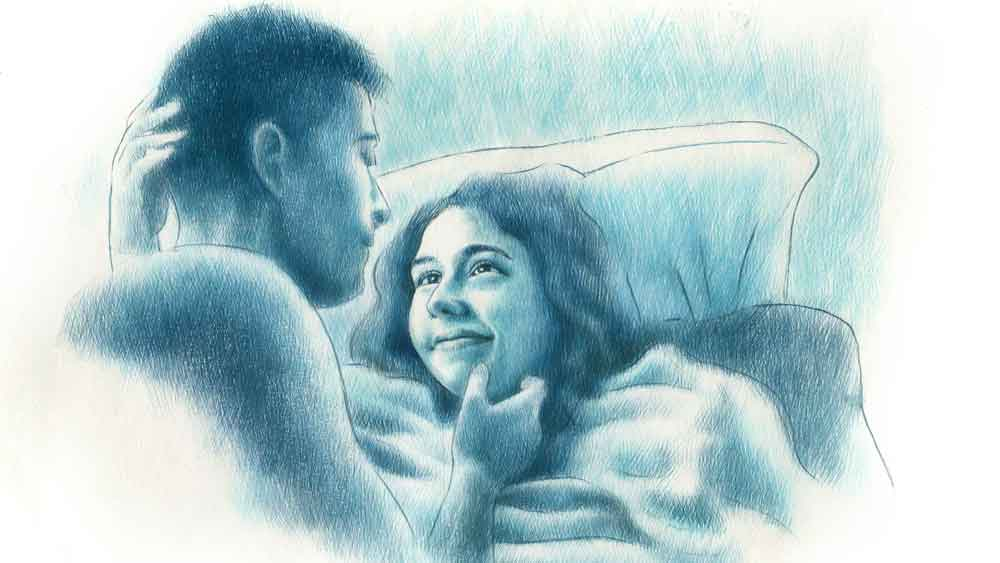

 
 <h1 align=center>ত্র্যহস্পর্শ</h1>
<h2 align=center>সৌমী গুপ্ত</h2> কথায় বলে, মর্নিং শোজ় দ্য ডে! এই কঠিন সত্যিটা নিজেকে প্রমাণ করার জন্য যে সক্কাল সক্কাল সুমনার দরজাতেই কড়া নাড়বে, কে জানত! সবে আয়েশ করে চাদরটা টেনেছে, তখনই শেফালি ফোন করে নিদারুণ সংবাদটা দিল। নিদারুণ নয় তো কী? সপ্তাহে এই একটা দিন ছুটি। বাদবাকি দিন তো নেপাল থেকে নেপচুন দৌড়ে বেড়াতে হয় সুমনাকে। অনির্বাণও তথৈবচ। সেও বালি থেকে বালিগঞ্জ মেডিক্যাল রিপ্রেজ়েন্টেটিভের কাজে দৌড়োয়। সুমনার  এনজিও-র কাজ আর সেলস-এর জাঁতাকলে উত্তর ও দক্ষিণ কলকাতা, দুই চব্বিশ পরগনা— পায়ের তলায় সরষে লাগানোই থাকে। মরার অবধি ফুরসত নেই।

এমন কিম্ভূত পরিস্থিতিতে ঘরের অবস্থা হয় শোচনীয়। মোজা খুঁজতে গিয়ে রুমাল হাতে আসে, স্যান্ডো গেঞ্জি খুঁজতে গিয়ে বারমুডা। তার উপর যদি শেফালি সাতসকালে এমন বাঁশ নিয়ে ফোনেই হানা দেয়! আধোঘুমে ফোনটা ধরতেই শেফালির কথাগুলো লম্বাচওড়া বাঁশের মতোই মনে হয়েছিল সুমনার। ইনিয়ে-বিনিয়ে বলছিল, “বৌদি গো আজগের আর যেতি পারবনি!”

কথাটা শেষ না হতেই আঁতকে উঠে টানটান হয়ে বসে পড়েছিল সুমনা। এক নিমেষে ঘুম-টুম সব উধাও। গলায় যতটা সম্ভব অবিশ্বাসের ছোঁয়া লাগিয়ে প্রায় চিৎকার করে উঠল সুমনা, “কেন?”

শেফালি ও প্রান্ত থেকে একটু বিমর্ষ গলায় উত্তর দিল, “প্যাটটা বড্ড কামড়েতিছে বৌদি। রাত থেকে বারো বার গিইছি!”

আর কিছু বলারও নেই। এমন অবস্থায় কে-ই বা বেরোতে পারে! সুমনা সহানুভূতিই দেখাল, “এ বাবা! ওষুধ খেয়েছ? এক বার ডাক্তার দেখিয়ে নিয়ো!”

বিছানায় শুয়েই প্ল্যান করে নিল সুমনা। কাপড়জামা ওয়াশিং মেশিনে দিয়ে বাসনটা ধুয়ে ফেলতে হবে। ঘরদোর মুছে রান্নাঘরে ঢুকবে নাহয়। একান্তই যদি সময়ে না কুলোয় ব্রেকফাস্ট বানিয়ে ফেলবে, লাঞ্চটা বাইরেই... ভাবতেই কেমন মনটা উল্টো দিকে হাঁটা লাগাল। কে যেন মনে মনে বলল, ‘বাইরে খেতে ভারী বয়ে গেল! আজ না রোববার! রোববার জমিয়ে পাঁঠার ঝোল আর আমসত্ত্বর চাটনি!’

সত্যিই তো। সারা সপ্তাহ বাইরের খাবারেই পেটকে শান্ত রাখে ওরা। রাতের দিকে এক-এক দিন সেদ্ধ ভাত হলেও বাকি পাঁচ দিন অ্যাপে খাবার আনানোই ভরসা। না হলে ইনস্ট্যান্ট নুডলস। ঘোড়দৌড়ের জীবনে এগুলোই সম্বল। কিন্তু রোববারের ব্যাপার আলাদা। অনির্বাণ মাছ খেতে ভালবাসে বলে মাছ কিনে আনে আর সুমনার জন্য মাটন। সুমনা মাছ খেতে ভালবাসে না। শেফালি ধুয়ে দেওয়ার পর রান্নাটা করে সুমনা। তার পর দু’জনে কব্জি ডুবিয়ে খাওয়া। তাদের দু’জনের সংসারে তৃতীয় জন এন্ট্রি নিলে কী করে যে সব সামাল দেবে, সুমনা সে কথাই ভাবে মাঝেমধ্যে।

ঘড়ির কাঁটাটা টিকটিক করে তাড়া লাগাচ্ছে। সুমনা অনির্বাণকে ঠেলা দিল, “এই যে, উঠে পড়ুন। আপনার জন্য ভাল খবর আছে!”

অনির্বাণ গায়ের চাদরটা টেনে নিল। সুমনা আবার ঠেলা মারল, “বলছি, শেফালি আজ আসছে না। দয়া করে তাড়াতাড়ি উঠে বাজার যাও, ফিরে এসে একটু হাতে হাতে কাজ করবে আমার। চেয়ারটা তো ডাঁই করে রেখেছ জামাকাপড়ে। সন্ধেবেলা আবার তমালদের ডেকেছ। একা একা কত করব আমি!”

বিছানা থেকে নেমে স্লিপারে পা গলাতে গলাতে এক নাগাড়ে কথাগুলো বলে গেল সুমনা।

যাওয়ার সময় পর্দাটা সরিয়ে দিয়ে গেল। জানালা দিয়ে হুড়মুড়িয়ে রোদ্দুর এসে লুটোপুটি খেল চোখ নাক কুঁচকে যাওয়া অনির্বাণের মুখে।

বিধি যে দিন বাম দিকে যাবে ঠিক করে, সে দিন ডান দিকের সমস্ত রাস্তা স্বয়ং বিধাতা বন্ধ করে দেন। বাজার থেকে ফেরার পথেই ফোনটা এল অনির্বাণের। যতীনদা ফোন করছে। খিটকেল যন্তর একটা। জিনা হারাম করে রেখেছে। ছুটির দিনে সাতসকালে তাকে স্মরণ করা মানেই ঘোটালা কেস। কানের ব্লু-টুথটা অন করতেই রে রে করে উঠল যতীনদা, “তুমি তো সরেস মাল হে! গতকাল সানওয়ার্মে ইন্টারভিউ দিয়ে এসেছ! যেই ওদের মার্কেট হাই দেখলে অমনি কেটে পড়ার তাল! তোমরা আমাকে না ঝুলিয়ে ছাড়বে না...”

মেজাজ বিগড়ে গেল অনির্বাণের। আমতা আমতা করে বলল, “না ইয়ে মানে, স্যর... আসলে মানে...”

যতীনদা ও প্রান্ত থেকে খিঁচিয়ে উঠল, “মানে আবার কী? আমি কি ডিকশনারি? সব এক একটা গান্..”

লাইনটা কেটে গেল। কানদুটো গরম হয়ে গেল। এটা কি বস না বাঁশ? শালা, সকাল থেকেই ঝাড় নিয়ে পিছনে পড়ে আছে। কোনও রকমে বাজার সেরে ফিরল অনির্বাণ।

ব্যাগটা রান্নাঘরে নামিয়ে সুমনার উদ্দেশে অনির্বাণ বলল, “শুনছ, একটু তাড়াতাড়ি ব্রেকফাস্ট দাও তো, এক বার যতীনদা ডেকেছে!”

ব্রহ্মাস্ত্র রেডিই ছিল। উত্তর ভেসে দিল, “বাহ! যেই দেখলে কাজের লোক ডুব মেরেছে অমনি মিটিং অ্যারেঞ্জ হয়ে গেল!”

অনির্বাণ উত্তর দিল না। চুপচাপ চাউমিনে মনোনিবেশ করাটাই নিরাপদ। দু’বারের পর তিন বার মুখে পুরতেই চোখের সামনে স্বয়ং চণ্ডীকে একেবারে চোখের সামনে দেখে বিষম খেল অনির্বাণ। 

সুমনা তত ক্ষণে চোখ সরু করে আসন্ন ঝড় নিয়ে রেডি। অনির্বাণের সপ্রশ্ন চোখের দিকে তাকিয়ে বলল, “কী ক্ষতিটা করেছি তোমার? এই ভাবে জ্বালাচ্ছ?”

হাঁ মুখ থেকে চাউমিন পড়ে গেল অনির্বাণের, “মানে?”

বসের কথাটা মনে পড়ল। সত্যি কি ডিকশনারি ভাবে সবাইকে ও?

“বুঝতে পারছ না, না? বলছি এতগুলো মৌরলা মাছ না বাছিয়ে এনেছ কার হাড়ে আদা ঘষার জন্য?”

অনির্বাণ হাসার চেষ্টা করল, “এই কথা! আমি ফিরে এসে বেছে দিচ্ছি। টাটকা পেলাম! মায়ের কথা মনে পড়ে গেল। কী সুন্দর টক রাঁধে!”

সুমনা যে এত ভাল মিমিক্রি করতে পারে জানা ছিল না অনির্বাণের। ঠোঁট বেঁকিয়ে বলল, “কী সুন্দর টক বানায়! তা যাও না খোকনসোনা, মায়ের কোলের কাছে! আমার পিত্তি জ্বালানো কেন বাপু?”

অনির্বাণ শেষরক্ষার চেষ্টা করল, “মায়ের সম্বন্ধে অমন করে বোলো না সুমনা। এগুলো তোমার থেকে এক্সপেক্ট করি না!”

সুমনা যেন বুনো ওল, “কী কী এক্সপেক্ট করো? ছুটির দিন সকাল থেকে চুনোমাছ নিয়ে বসি? ঘরের সব কাজ স্বয়ং ভগবান এসে করবে? সব টান মেরে ফেলে দেব আমি! যত্তসব ঘটিদের মতো মাছের টক খাওয়া!”

অনির্বাণও আজ বাঘা তেঁতুল!  ঠক করে চাউমিনের প্লেটটা টেবিলে রেখে বলল, “ধুত্তোর নিকুচি করেছে! আজ এসপার কি ওসপার!”

সুমনা মুখ ঘুরিয়ে নিল, “হুঁ! বীরপুরুষ!”

অনির্বাণ বোধহয় পৌরুষ ও বীরত্ব দুটোই প্রমাণ করার জন্য আজ মরিয়া। ব্যাগটা নিয়ে বেরিয়ে যাওয়ার সময় শুধু শুনতে পেল সুমনা রান্নাঘর থেকে গজর গজর করছে, “কোথায় আর যাবে! মোল্লার দৌড় মসজিদ পর্যন্ত!”

আজ একটা হেস্তনেস্ত করেই ছাড়বে অনির্বাণ। কোথাও শান্তি নেই!

*****

দুপুরের রোদটা বেশ কড়া। রান্নাঘরের এক পাশে ঢাকা দিয়ে রাখা মাটন কষা, মৌরলার টক। তবু যেন দিনটা কেমন ম্যাড়মেড়ে। বারছয়েক ফোন করেছে সুমনা। প্রত্যেক বার অনির্বাণের ফোন থেকে ওই যন্ত্রচালিত মহিলা হেদিয়ে মরেছে, “সুইচড অফ!”

দোনামোনা করে যতীনদাকেই ফোন করেছিল সুমনা। যতীনদা বলল, “অনির্বাণ এসেছিল বটে, তবে অনেক ক্ষণ আগে বেরিয়ে গেছে।”

মাথায় কেউ যেন আগুন জ্বালিয়ে দিয়েছিল সুমনার। কাছের বন্ধুদের ফোন করেও খবর পায়নি।

প্রথমটায় খুব রাগ হলেও সময় যত এগিয়েছে তত আশঙ্কা বেড়েছে ওর। খিদেয় পেটটা চোঁ চোঁ করলেও খেতে ইচ্ছে করছে না। বরং গা-টা গুলিয়ে উঠছে থেকে থেকে।

একটু কি বেশিই রিঅ্যাক্ট করে ফেলেছে? শুধু মৌরলা মাছ এনেছে বলে এতটা করা উচিত হয়নি! বিশেষত মাকে টানা একদমই ঠিক হয়নি। সুমনা আবার নিজের পক্ষে যুক্তি সাজাল। অনির্বাণই তো মায়ের কথা তুলল! অন্য দিন কি ও রান্না করে দেয় না?

আবার কেউ মনের ভিতর থেকে বলে উঠল, সুমনারও কি ইচ্ছে করে না মায়ের হাতে ঝাল-ঝাল মাটন কষা খেতে! মায়ের রান্না সবার কাছেই তো স্পেশাল। আবার মনে হল, কোনও বিপদ হল না তো রাস্তায়!

দূর দূর! সকাল থেকে দিনটাই খারাপ! এক বার না হয় ‘স্যরি’ বলেই দেবে। কিন্তু কাকে বলবে? সে বান্দা তো নিখোঁজ! আচ্ছা ঝামেলায় ফেলেছে! অভিমানে, রাগে, খিদেয় সুমনার চোখে জল এসে গেল। পারত এ রকম করতে, যদি আজ একটা ফুটফুটে মেয়ে বা ছেলে থাকত ওদের? সুমনা একা বলে যা খুশি তাই করা যায়! অথচ গত চার বছর ধরে কম চেষ্টা তো করেনি ওরা। তবু সে গুড়ে বালি! জীবনটাকে মাঝে মাঝে সাহারা মরুভূমি মনে হয়। সোফার হাতলে মুখ গুঁজে ফুঁপিয়ে কেঁদে উঠল সুমনা। ফোনটা এল তখনই।

তমাল ফোন করছে। যাহ্! এই নামটা তো এক বারও মনে হয়নি! অনির্বাণ কি তা হলে ওদের বাড়িতেই...? তমালদেরই তো আজ সন্ধেয় আসার কথা! ঝড়ের গতিতে ফোনটা রিসিভ করতেই ও পাশ থেকে তমালের বৌ দিঠি, “সুমনা?”

গা জ্বলে গেল সুমনার। সুমনার ফোন সুমনা ধরবে না তো কি পাশের বাড়ির কাকিমা ধরবে?

সুমনা বলল, “হ্যাঁ, বলো?”

দিঠি হেসে বলল, “তোমরা পারোও বটে। বাচ্চাদের মতো ঝগড়া করো এখনও। এসে থেকে অনির্বাণদার মুখ হাঁড়ি। জোর করে খাইয়ে দিয়েছি। তবে খেয়ে খুব তৃপ্তি পেয়েছে, ছোট মাছ করেছিলাম আজ। অনির্বাণদা যে ভালবাসে।”

এর পর আগুনে ঘি পড়াটাই স্বাভাবিক। সুমনা কেটে কেটে বলল, “অনির্বাণ ওখানে গেছে জানিয়ে দিলেই হত। ফোনটা সুইচড অফ রেখেছে বলে আমি এ দিকে না খেয়ে বসে চিন্তা করছিলাম ফালতু। এখন দেখছি ভুলই করেছি। এত ক্ষণে আমার একটা ঘুম হয়ে যেত গো!”

দিঠি আবার বলল, “অ্যাই শোনো না, অনির্বাণদা এখানেই থাক। তুমি বরং বিকেলে চলে এসো। আমরা সবাই মিলে এনজয় করি সন্ধেটা, তমাল ইটালি থেকে ভাল স্কচ এনেছে। যুগলে ভাবও হয়ে যাবে, রাতে ফিরে যেয়ো!”

দিঠির মিষ্টি কথায় সুমনার মনে হল দিঠিকে ফুল ছুড়ে মারা উচিত, তবে টেবিলের উপর রাখা ফ্লাওয়ার ভাসটা সুদ্ধু! সুমনা ইচ্ছে করে হাই তুলল একটা। চিবিয়ে চিবিয়ে বলল, “ভীষণ টায়ার্ড লাগছে গো। তোমরা বরং এনজয় করো। আর তা ছাড়া তোমার অনির্বাণ তো আছে!”

দিঠি গায়েই মাখল না। হেসে বলল, “সে আর বলতে!”

সুমনা ফোনটা কেটে দিল। কলেজে দিঠি এক বছরের জুনিয়র ছিল। অনির্বাণের উপর ব্যথা ছিল বরাবর। এখনও কাটেনি তা হলে? তমাল এত ভাল ছেলে, তবুও...?

কান মাথা ঝাঁ-ঝাঁ করছে। দুদ্দাড় করে উঠে রান্নাঘরে গিয়ে দাঁড়াতেই মাথাটা ঘুরে গেল সুমনার। চার দিক অন্ধকার হয়ে গেল নিমেষে।

*****

জ্ঞান যখন ফিরল তখন হসপিটালের বেডে। মাথাটায় খুব যন্ত্রণা। চোখ খুলে তাকাল সুমনা। সামনে আবছা হয়ে আসছে অনির্বাণের মুখ।

আবার চোখ বন্ধ করল। অনির্বাণ কাকে বলছে, “আরে দিঠির ফোনটা ও রকম করে কেটে দেওয়ার পরেই আর পাচ্ছিলাম না ফোনে। এক মুহূর্ত দেরি করিনি, ডুপ্লিকেট চাবি তো থাকেই। যা মেজাজ ওর!”

পরের দিন ঘরে ফিরেছে সুমনা। ডাইনিংয়ে নরম রোদ্দুর। অনির্বাণ কাছে ঘেঁষে বসল। মাথায় হাত বুলিয়ে বলল, “ডাক্তার এই সময় খুব সাবধানে থাকতে বলেছে!”

সুমনার চোখদুটো ছলছল করছে।

তাকিয়ে আছে অনির্বাণের দিকে। অনির্বাণ আবার বলল, “এত দিন পর কনসিভ করেছ তাই। পাগল মেয়ে! দিঠির কথায় ওই ভাবে কেউ রাগ করে? তা ছাড়া, আমি ওদের বাড়ি নিজে থেকে যাইনি। রাস্তায় তমালের সঙ্গে দেখা হতে জোর করল, তাই...”

সুমনা অবিশ্বাসের চোখে তাকায়, “সত্যি আমি কনসিভ করেছি?”

অনির্বাণ হাসে, “হ্যাঁ।”

সুমনা মাথাটা অনির্বাণের কাঁধে রাখে, “আজ বড্ড মৌরলা মাছের টক দিয়ে ভাত খেতে ইচ্ছে করছে, অথচ আমি তো মাছ ভালবাসি না!”

অনির্বাণ লাফিয়ে ওঠে, “তা হলে? যে আসছে সেও আমার দলে! আজ তিনটে ভাল খবর। মৌরলা মাছের সমাদর, তুমি কনসিভ করেছ... আর  জানো? সানওয়ার্মের ইন্টারভিউটা ক্লিয়ার করেছি! তিনটে জিনিস মিলে গেলে যেন কী হয়?”

সুমনা ঘন হয়ে আসে, ফিসফিস করে বলে, “ত্র্যহস্পর্শ!”

সবচেয়ে আগে সব খবর, ঠিক খবর, প্রতি মুহূর্তে। ফলো করুন আমাদের Google News, Twitter এবং Instagram পেজ।