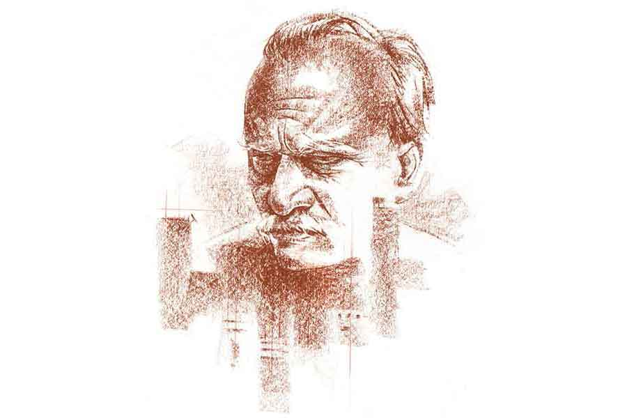

 
 <h1 align=center>থাকে শুধু অন্ধকার</h1>
<h2 align=center>অদিতি সরকার</h2> 

পেট্রিকর।

তপ্ত মাটিতে পড়া বৃষ্টিফোঁটার গন্ধ।

বহু যুগের ও পার থেকে কী ভাবে যেন শব্দটা মনে পড়লআজ সুপ্রতিমের।

বিকেল তিনটের সময় কনফারেন্স রুম থেকে বেরিয়ে বেশ অবাকই হয়ে গিয়েছিলেন সুপ্রতিম। এত বৃষ্টি কখন হয়ে গেছে বোঝাই যায়নি।

বৃষ্টি তখনও পড়ছিল... ঝমঝম না হোক, ঝিরঝির তো বটেই। কাচ-স্টিল-মার্বেলে সাজানো অফিস বিল্ডিংকে ঘিরে উঠে আসছিল ভেজা মাটির মন-কেমনিয়া সোঁদা গন্ধ।

অথচ ধারে-কাছে মাটির চিহ্নটুকু চোখে পড়ার উপায় ছিল না কোথাও। সব বাঁধানো। ইটের দেওয়াল, পাথর-বসানো ফুটপাত, পিচের প্রলেপে মোড়া রাস্তা।

তবুও বারবার কোন লুকোনো ফাঁকফোকর থেকে যেন উঠে আসছিল সুপ্রতিমের ফেলে আসা যৌবনের চিরচেনা ঘ্রাণ।

মেঘলা মরা আলোয় এত দিনের আগাপাশতলা পরিচিত চত্বরটাও কেমন যেন অচেনা লাগছিল। রাস্তার ও পারের আকাশে আঙুল-ছোঁয়ানো ঝকমকে বাড়িগুলো বৃষ্টির পর্দার আড়ালে আবছা, ধোঁয়াটে।

পুরনো জলরঙের ছবির মতো, সিপিয়া রঙের ওয়াশে আঁকা।

অথচ কী অদ্ভুত, ভিতরে এসি-চলা ঘরে নিশ্চিন্ত বসে বাইরে চলতে থাকা এত উথালপাথাল কিচ্ছুটি টের পাওয়া যায়নি!

ওইখানে দাঁড়িয়ে দাঁড়িয়েই হঠাৎ অফিস-টফিস সব ছেড়েছুড়ে এই মুহূর্তে বাড়ি ফিরে যাওয়ার একটা জোরালো ইচ্ছে পেয়ে বসল সুপ্রতিমকে। সেই ছোটবেলার বৃষ্টি হলেই স্কুল-পালানোর ইচ্ছের মতো। একটা অর্থহীন, অথচ অমোঘ ইচ্ছে।

বিন্দুমাত্র চিন্তা না করে সিঁড়ি দিয়ে নামতে শুরু করলেন সুপ্রতিম। এতটাই তাড়া যে লিফ্টের বোতাম টেপার কথা মনেও এল না তাঁর। অনেক মিটিং, অনেক কনফারেন্স হয়েছে। এখন তিনি বাড়ি যাবেন।

কোনও খবর না দিয়ে এমন অসময়ে অফিস থেকে ফিরে এলে স্নিগ্ধা ঠিক কতটা অবাক হবে ভেবেই তাঁর মজা লাগছিল।

এটাই তো অভিযোগ না স্নিগ্ধার?

মুখ ফুটে না বললেও বোঝেননি কি সুপ্রতিম? বিয়ের পর থেকে এই এতগুলো বছর ধরে তো এই একটাই অনুচ্চারিত প্রশ্নের মুখোমুখি হতে হয়েছে সুপ্রতিমকে। স্নিগ্ধার নামানো মুখের সতর্ক ভঙ্গিতে, তাঁর চোখের সঙ্গে সচেতন ভাবে না-মেলানো চোখের দৃষ্টিতে এই কথারই নীরব প্রতিধ্বনি শোনেননি কি এত দিন?

হালকা একটা হাসির আভাস মুখে নিয়ে লবি পেরোন সুপ্রতিম।

সত্যিই জীবনে কারও জন্য কিছু আটকায় না।

তিনি না থাকলে অফিস মোটেও উঠে যাবে না— দিব্যি চলবে, প্রজেক্টগুলো সুন্দর মসৃণ ভাবে এগিয়ে যাবে, সম্পূর্ণ হবে।

এত দিন যে কথাটা বোঝেননি কেন, কে জানে! যত রিটায়ারমেন্ট এগিয়ে আসছে, তত উপলব্ধিটা জোরালো হচ্ছে।

আজ থেকেই না-হয় রাশ ছেড়ে দেওয়ার ছোটখাটো মহড়া আরম্ভ হোক তা হলে।

*****

সজল গাড়ি নিয়ে ঠিক মেন এনট্রান্সের সামনেই দাঁড়িয়েছিল।

এক লহমার জন্য একটু অবাক হন সুপ্রতিম। সজলকে কি ডেকেছিলেন আদৌ? মনে করতে পারেন না ঠিক। একটু ধোঁয়াশা মতো লাগে যেন।

মাছি ওড়ানোর মতো উড়িয়ে দেন চিন্তাটা তার পরেই। অন্যমনস্ক ছিলেন, তাই হয়তো মনে পড়ছে না। নিশ্চয়ই ফোন করে ডেকেছেন।

অবশ্য এত দিনের পুরনো ড্রাইভার সজল, তাকে সব সময় সব কিছু বলতেও হয় না। সে ভাবেই এই বৃষ্টির বিকেলে তাঁর মনের ভিতরের ইচ্ছেটুকু নিজে থেকেই বুঝে গিয়ে থাকতে পারে সে।

অত কেজো কথাবার্তা এই মুহূর্তে ভাবতে ইচ্ছে করে না সুপ্রতিমের। তিনি এখন স্নিগ্ধার কাছে যাচ্ছেন।

আচ্ছা, একটা কিছু গিফ্ট-টিফ্ট নিয়ে গেলে হত না হাতে করে? সারপ্রাইজ়টা আরও জোরদার হততা হলে।

কিন্তু কী নেওয়া যায়? শাড়ি-টাড়ি তিনি কিনতে পারেন না। ও সব রং-জমি-পাড়ের গভীর জটিল রহস্য মাথাতেই ঢোকে না তাঁর। তা হলে? ফুলের তোড়া? চকলেট? একটু বেশিই সিনেমা-মার্কা হয়ে যাবেনা ব্যাপারটা?

খুবই লজ্জার সঙ্গে সুপ্রতিম অনুধাবন করেন যে, তাঁর এত বছরের বিবাহিত স্ত্রীর পছন্দ-অপছন্দ সম্বন্ধে তিনি একেবারেই অজ্ঞ।

আসলে স্নিগ্ধা কখনওই মুখ ফুটে তাঁর কাছে কিছু চায়নি। বছরের পর বছর তিনি বেমালুম বিয়ের তারিখ, স্নিগ্ধার জন্মদিন, তুলতুলির স্কুলের অ্যানুয়াল ফাংশন ইত্যাদি যাবতীয় মাইলফলক অবলীলায় ভুলে গেছেন— স্নিগ্ধা কখনও মনেও করায়নি, অভিযোগও করেনি। অভিমান যদি করেও থাকে, তিনি তা বুঝে উঠতে পারেননি।

আজ হঠাৎ তাঁর নিজেরই কেমন অভিমান হয়। তিনি কি থট-রিডার? না-হয় ভুলেই যেতেন তারিখ-টারিখগুলো, এক বার মনে করিয়ে দেওয়া যেত না কি? এতটাই কি পর তিনি স্নিগ্ধার কাছে?

আজ এক বার জিজ্ঞাসা করতে হবে স্নিগ্ধাকে।

আচ্ছা, ধরা যাক, এই ভাবে যদি বলা যায়— সুপ্রতিম মনে মনে কথা সাজিয়ে মহড়া দেন।

তিনি বলবেন, ‘আচ্ছা, তোমার নিজের চাওয়া-পাওয়ার কথা কেন কিছু বলোনি আমায় কোনও দিন? কেন সংসারের সব দায়িত্ব যন্ত্রের মতো নিজের ঘাড়ে নিয়ে আমাকে নিশ্চিন্তে রেখে দিয়েছ সারাটা জীবন? স্ত্রী হিসাবে কি তোমার কিচ্ছু চাওয়ার ছিল না আমার থেকে?’

তাঁর মুখে এ রকম নাটকীয় সংলাপ শুনে স্নিগ্ধার চেহারাটা ঠিক কী রকম হতে পারে, মনে করে পরক্ষণেই অবশ্য পরিকল্পনাটা বিসর্জন দিতে হল তাঁকে। নিজেরই হাসি পেয়ে যাচ্ছিল।

কিন্তু গিফ্টের সমস্যাটার তো সমাধান হল না।

তুলতুলিকে এক বার জিজ্ঞেস করে নিলে হত।

জিজ্ঞেস করতে হবে, ‘বেবি, তোর মা-র কী পছন্দ রে? সারপ্রাইজ় গিফ্ট কী পেলে খুশি হবে বলতে পারিস?’

মেয়ে প্রবল লেগ-পুল করবে যদিও। সে করুক।

ফোনটা কোথায় গেল, ফোনটা? পকেট চাপড়ান সুপ্রতিম, গাড়ির সিট হাতড়ান। নাহ্, অফিসেই ফেলে এসেছেন বোধহয়।

সজলকে গাড়ি ঘোরাতে বলতে গিয়েও থেমে গেলেন সুপ্রতিম। থাক। নিয়ম ভাঙলে পুরোপুরিই ভাঙা হোক। এক দিন ফোনের দাসত্ব থেকে নিজেকে নয় ছুটিই দেওয়া যাক। কী আর এমন মহাভারত অশুদ্ধ হবে।

বৃষ্টির বেগ বাড়ছিল। রাস্তায় এর মধ্যেই ভাল জল জমেছে। গাড়ির চাকার দু’পাশে ফোয়ারার মতো উঁচু হয়ে ছিটকে উঠছিল ঘোলাটে কাদামাখা জল। ধূসর আকাশ চিরে বিদ্যুতের ধারালো নীলচে বেগুনি রেখা এঁকেবেঁকে চমকে যাচ্ছিল মাঝে-মাঝেই।

ব্যাকরেস্টে মাথা হেলিয়ে দিয়ে চোখ বুজে ফেলেন সুপ্রতিম।

*****

বাড়িটা অন্ধকার কেন এত?

গভীর ঘুমিয়ে পড়েছিলেন বোধহয় সুপ্রতিম। সজল ঠিক কখন যে তাঁকে টাওয়ারের দোরগোড়ায় গাড়ি থেকে নামিয়ে দিয়েছে, ঠিক ঠাহর করে উঠতে পারছিলেন না। এই চোখ বুজে গাড়িতে বসেছিলেন, এই নিজেকে আবিষ্কার করলেন নিজের ফ্ল্যাটের বন্ধ দরজার সামনে।

অদ্ভুত তো! এতটাই ক্লান্ত ছিলেন নাকি? গাড়ি থেকে নামলেন, লিফ্টে ঢুকলেন, সাত তলার বোতাম টিপলেন— সবই ঘুমিয়ে ঘুমিয়ে? অভ্যস্ত মাসল মেমরি?

ভাবতে গেলে মাথার পিছনটা কেমন ব্যথা-ব্যথা করে সুপ্রতিমের, ঘাড় টনটন করে।

কিন্তু এত ক্ষণ ধরে বেল দিচ্ছেন, স্নিগ্ধা দরজা খুলছে না কেন? ঘুমোচ্ছে নাকি? না কোথাও গেল? এই বৃষ্টি মাথায় করে যাবেই বা কোথায়? কিছু তো জানায়ওনি।

বাইরে আকাশে মেঘের ছায়া আরও গাঢ় হচ্ছিল, ভিতরে করিডরে ঘোলাটে ধূসর আলো-আঁধারি।

অধৈর্য হয়ে দরজায় একটা ধাক্কা দেন সুপ্রতিম।

এবং তাঁকে অবাক করে দিয়ে তাঁর হাতের চাপে দরজাটা মসৃণ ভাবে ভিতরের দিকে খুলে যায়। এতটাই অপ্রত্যাশিত ভাবে যে, আর একটু হলেই ব্যালান্স হারিয়ে মুখ থুবড়ে পড়তেন সুপ্রতিম।

তার মানে খোলাই ছিল?

আশ্চর্য। এই ভাবে দরজা খোলা রেখে ঘুমিয়ে পড়েছে স্নিগ্ধা?

“স্নিগ্ধা? স্নিগ্ধা কি ঘুমোচ্ছ নাকি? এ ভাবে দরজা খুলে রেখে? নাহ্, তোমার আর সেন্স হল না এত দিনেও। স্নিগ্ধা?” ঈষৎ উষ্মা ফুটে ওঠে তাঁর কণ্ঠস্বরে।

সাড়া নেই। সাড়া আসে না।

ঘরগুলো অন্ধকার। ছায়া-ছায়া।

উদ্‌ভ্রান্তের মতো এ ঘর থেকে ও ঘর খুঁজে বেড়ান সুপ্রতিম।

ফাঁকা, হা-হা ফাঁকা। কেউ নেই।

শুধু ছায়া দোলে। অত্যন্ত অপ্রীতিকর কী যেন একটা স্মৃতিমাখা ছায়া দোলে সুপ্রতিমের চোখের পিছনে। কী যেন একটা কথা ধরা দেব-দেব করেও দেয় না।

মাথার পাতলা হয়ে আসা চুল দু’হাতে মুঠো করে ধরেন সুপ্রতিম। সারা বাড়ি জুড়ে নিরন্তর দুলতে থাকা অস্বস্তিকর ছায়াটাকে জোর করে ঠেলে সরান।

সব ছেড়ে রেখে, সব ফেলে রেখে চলেই গেছে তা হলে স্নিগ্ধা।

কিন্তু কেন চলে গেল? তাঁকে এ ভাবে একা ফেলে রেখে, সাজানো সংসার ফেলে রেখে স্নিগ্ধা চলে গেল? পারল? পারল চলে যেতে?

*****

মনের মধ্যে একে একে পুরনো স্মৃতির ছায়াছবি ফুটিয়ে তুলতে চেষ্টা করেন সুপ্রতিম। স্নিগ্ধার এ ভাবে বিনা নোটিসে বাড়ি ছেড়ে তাঁকে ছেড়ে চলে যাওয়ার কারণ খুঁজতে থাকেন।

মনোমালিন্য হয়েছিল কি কিছু, আজ সকালে? কিংবা কাল-পরশুর মধ্যে? কোনও ইঙ্গিত ছিল কি?

সে রকম বড় দরের কোনও তোলপাড়ের কথা তো মনে পড়ে না! টুকটাক ঠোকাঠুকি, সে তো পাশাপাশি রাখলে বাসনকোসনেও হয়। আর, স্নিগ্ধা তো অভ্যস্তও হয়ে গেছে এতগুলো বছরে। তাঁর স্বভাবের পুরুষালি কর্কশতায়, রুক্ষতায়, মেজাজে, অধৈর্য বিরক্তিতে।

হ্যাঁ, মনের মতো খাবার না হলে, খাবার ঠিকঠাক পছন্দসই গরম না হলে প্লেট ছুড়ে দিয়েছেন সুপ্রতিম বহু বার। স্নিগ্ধা প্রতিবাদ করেনি, কোনও কথা বলেনি। নিঃশব্দে ভাঙা প্লেটের টুকরোগুলো কুড়িয়ে নিয়ে গিয়ে নতুন সাজানো থালায় গরম খাবার এনে দিয়েছে আবার।

অস্বীকার করবেন না, দু’-চারটে চড় থাপ্পড়ও হয়তো মেরেছেন কখনও না কখনও। সে সব স্নিগ্ধারই দোষে, অবশ্যই। অপ্রয়োজনে শুধু শুধু গায়ে হাত তুলতে যাবেনই বা কেন? তিনি তো আর অশিক্ষিত, বৌ-পেটানো পাষণ্ড নন।

আবার ক্ষমাও তো চেয়ে নিয়েছেন তার পরেই। পায়ে ধরে, চোখের জল ফেলে। তা হলে! রাতের বিছানায় একটা তুলকালাম সন্ধি করেছেন নিজে থেকেই।

স্নিগ্ধা তো চিনত তাঁকে। কই, কিছু বলেনি তো এত দিন।

তা হলে আজই হঠাৎ এ ভাবে... কোথায়? কেন?

একটা অতীব অপ্রিয় আশঙ্কা হঠাৎ তাঁর মনে ভেসে উঠে কাঁপিয়ে দেয় তাঁকে।

তবে কি, তবে কি অন্য কাউকে খুঁজে পেয়েছে স্নিগ্ধা? সুপ্রতিমকে হেলায় ছুড়ে ফেলে দিয়ে অন্য কারও হাত ধরেছে?

সুপ্রতিমের দুশ্চিন্তার উপরে একটা প্রবল ক্রোধের আঁচড় পড়তে শুরু করে এ বার।

এত বড় সাহস? তুলতুলিকে পর্যন্ত নিয়ে গেল সঙ্গে করে?

জোরালো একটা ঝটকা দিয়ে পিছন ফেরেন তিনি।

যাবে কোথায় স্নিগ্ধা? খুঁজে বার করবেনই সুপ্রতিম। করবেনই।

*****

“অ দাদু, দাদু কই যান? আহা, পইড়া যাবেন তো। এই ন্যান, ধরেন, আমার হাতটা ধরেন দেখি দাদু। আসেন তো, আসেন। আমার সঙ্গে আসেন।”

এই এক রোগীকে নিয়ে রাখী জেরবার হয়ে গেল সত্যি। তিন বছর ধরে এই সেন্টারে আছে বুড়ো, রোজ দিনের মধ্যে কিছু না হোক দশ বার করে বৌকে খুঁজে খুঁজে হাল্লাক হয়। ও দিকে বৌ তো নাকি সুইসাইড করে মরেছে সে অনেক দিন হল। সে নাকি খুব সুন্দরী ছিল, খুব শান্ত।

একটা মেয়ে, সেও বুঝি বিলেত না আমেরিকা কোথায় মস্ত চাকরি করে। বাপের সঙ্গে নাকি মোটে পটে না। যদিও তার পয়সাতেই দাদুর এখানকার থাকা-খাওয়া-চিকিচ্ছে। অবিশ্যি এ দাদু নিজেও খুব বড় অপিসার ছিল নাকি।

আজ দেখো কী অবস্থা! নিজের নাম পর্যন্ত মনে করতে পারে না।

এমনিতে এখানে, মানে এই সেন্টারের বাকি পেশেন্টরাও সবাই ওই একই পদের, সবারই ভুলে যাওয়ার ব্যারাম। তবে এই দাদুর মতো আয়াদের জ্বালিয়ে মারে না আর কেউ। বাকিদের বেশির ভাগই শুয়েই থাকে সারা দিন। কেউ ফ্যালফ্যাল করে ফাঁকা চোখে ছাদের দিকে তাকিয়ে থাকে, কেউ বা বেহুঁশ ঘুমোয়। খাইয়ে দিলে খায়, তুলে হাঁটালে হাঁটে।

আর একে দেখো, কথা নেই বার্তা নেই চোদ্দো বার করে বিছানা ছেড়ে উঠে “স্নিগ্ধা! স্নিগ্ধা!” করে ছুটতে লেগেছে। এক বার তো উল্টে পড়ে কোমরও ভেঙেছিল।

এ দিকে তো মাথা কাজ করে না, খেয়েছে কি খায়নি তাও মনে থাকে না, পেচ্ছাপ-পায়খানার কন্ট্রোল নেই, কিন্তু ও দিকে প্রেম একেবারে টনটনে।

রাগও ধরে, মায়াও লাগে রাখির।

*****

পাগলের মতো খুঁজে বেড়াচ্ছিলেন সুপ্রতিম সারা বাড়িময়। কেউ নেই। কেউ কোত্থাও নেই। স্নিগ্ধা নেই, তুলতুলি নেই। তাঁকে এই এক অনন্ত নির্বাসনে রেখে ওরা সবাই কোথায়, কার সঙ্গে চলে গেছে কে জানে!

“স্নিগ্ধা, স্নিগ্ধা! তুলতুলি!”

গলা চিরে আসে সুপ্রতিমের চিৎকার করে ডাকতে ডাকতে। বুকের মধ্যে অসহ্য ধড়ফড়ানি।

কার যেন দুটো সবল হাত তাঁর শীর্ণ ঝুঁকে-পড়া কাঁধ চেপে ধরে। কী বলতে থাকে দুর্বোধ্য ভাষায়, সুপ্রতিম বোঝেন না। আকুলিবিকুলি করে হাত দুটো সরাতে চেষ্টা করেন শুধু।

“ছেড়ে দাও, ছেড়ে দাও! স্নিগ্ধা হারিয়ে গেছে, স্নিগ্ধা! খুঁজে পাচ্ছি না। খুঁজে দাও।”

কথাগুলো নিজের মাথার ভিতরে স্পষ্ট উচ্চারিত হতে শোনেন সুপ্রতিম, শ্রোতার কানে যদিও শুধু অবোধ্য ঘড়ঘড় শব্দই পৌঁছয়।

অসহায় শুকনো কালচে ঠোঁট কাঁপে থরথর করে, চোখের কোটরে জল জমে।

“আহ্‌ দাদু, অমন করতে নাই, কথা শোনেন। শান্ত হন দেখি একটু, শান্ত হন। জল খাইবেন দাদু, জল?”

সুপ্রতিম বড় হাঁ করে হাওয়া গিলছিলেন। সারা শরীর কাঁপছিল তাঁর। টলতে টলতে অন্ধের মতো এগোতে চেষ্টা করেন তিনি। কোন দিকে, তা তাঁর নিজেরই জানা নেই।

“আচ্ছা, শুইয়া পড়েন, শোন তো। ইস, আবার সব ভিজাইয়া ফ্যালসেন তো?”

গলার মালিক আরও কী সব বলতে বলতে ক্ষিপ্র দক্ষ হাতে সুপ্রতিমকে বেড় দিয়ে ধরে বিছানায় শুইয়ে দেয়। অবলীলায় তাঁর নষ্ট হয়ে যাওয়া পাজামা ছাড়িয়ে নেয়। নোংরা ডায়াপার পাল্টে নতুন পরায়। একটা পরিষ্কার শুকনো পাজামা পরিয়ে দেয় তার পর। সুপ্রতিমের এক লহমা আগের উত্তেজনা যে তীব্রতায় এসেছিল, তেমনই দ্রুততায় হঠাৎই ফুরিয়ে যায়। অসহায় শিশুর মতো নিজের বৃদ্ধ অশক্ত শরীরটাকে ওল্টাতে পাল্টাতে দেন তিনি।

“ন্যান, ঘুমান এই বার, ঘুমাইয়া পড়েন। আমি এইখানেই আছি, ভয় নাই। শরীল খুব বেশি খারাপ লাগলে কষ্ট কইরা এক বার রাখি বলে ডাক দিবেন দাদু, কেমন?”

ঘোলাটে শূন্য চোখে তাকিয়ে থাকেন সুপ্রতিম। কিছু কানে যায় কি না বোঝা অসম্ভব। মস্তিষ্কে গেছে কি না, সেটা বোঝা আরওই অসম্ভব।

বুড়ো মানুষটার গায়ের চাদরটা একটু টেনেটুনে ঠিক করে দিয়ে ঘর থেকে বেরিয়ে যায় রাখি সর্দার। আজ ক’দিন যাবৎ দাদুটার ছটফটানির যেন বড়ই বাড়াবাড়ি। সিস্টারদিদিকে জানাতে হবে। ডাক্তারবাবুকে বলে যদি ওষুধ-পালা কিছু বাড়িয়ে-কমিয়ে দিতে হয়। যা-ই হোক, একটা দায়িত্ব আছে তো রাখির। দেখতে গেলে এত দিন ধরে তো তার হাতেই আছে দাদুটা। হোক না সে সব ভুলে-যাওয়া বুড়ো মানুষ।

রাতে তো কড়া ওষুধের ঘোরে ঘুমোয় সবাই, নাইট আয়ার অত ঝামেলা নেই।

দিনের বেলার ঝক্কি তো রাখিই সামলাচ্ছে এত দিন ধরে। সিস্টারদিদির ঘরের দিকে দ্রুত পা চালায় সে। বেশি ক্ষণ একা রাখা যাবে না দাদুটাকে।

*****

সুপ্রতিম ঘুমিয়ে পড়েছিলেন।

বাইরে সোঁদা গন্ধ উঠছিল বৃষ্টিভেজা মাটির।

পেট্রিকর।

