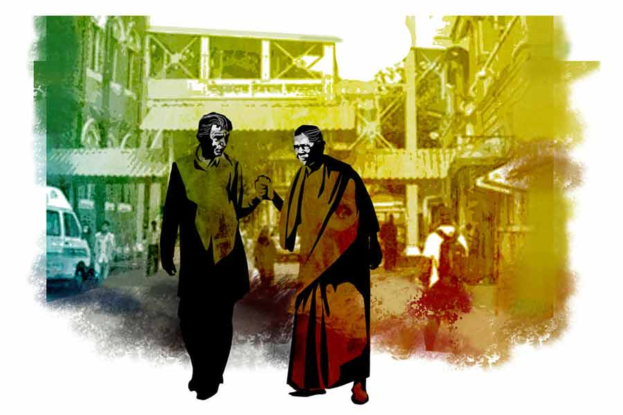

 
 <h1 align=center>দম্পতি</h1>
<h2 align=center>তমাল বন্দ্যোপাধ্যায়</h2> 

চোখের এই প্রাইভেট হাসপাতালের গ্রাউন্ড ফ্লোরে গিজগিজে ভিড়। গত আড়াই দশকে এই প্রতিষ্ঠানের সুনাম যে হারে বেড়েছে, তার সঙ্গে তাল মিলিয়ে সারা বাংলা থেকেই শুধু নয়, প্রতিবেশী দেশ থেকে আসা রোগীর ভিড়ও বেড়ে চলেছে উত্তরোত্তর। আমাদের বাড়ি অবশ্য কাছেই। তবুও আমি আর আমার স্ত্রী অস্মিতা, অনেক টালবাহানার পর, সপ্তাহ শেষের আজকের এই দিনটা কোনও রকমে ম্যানেজ করতে পেরেছি। ওর বাবাকে চোখের ছানি অপারেশন করাতে নিয়ে এসেছি এখানে। নিজেদের গাড়িতেই।

বছর পাঁচেক হল আমার শাশুড়ির মৃত্যুর পর থেকে শ্বশুরমশাই অজিতবাবু নিজের বাড়িতে দু’-তিন জন পরিচারক-পরিচারিকার উপর সম্পূর্ণ নির্ভরশীল হয়ে একাই থাকেন। তাই চোখের সমস্যাটা পেকে ওঠার পর প্রবল আতান্তরে পড়ে গিয়েছিলেন। কিছু দিন আগে ফোনে খুবই কাতর ও বিষণ্ণ গলায় আমার শরণাপন্ন হয়েছিলেন। এ সব ব্যাপারে নিজের মেয়ের চেয়ে উনি আমার উপরে বেশি ভরসা করেন। কলেজজীবনে উনি আমার প্রিয় শিক্ষক ছিলেন, আমিও ছিলাম ওঁর প্রভূত প্রশ্রয় পাওয়া এক জন উজ্জ্বল ছাত্র। প্রিয় ছাত্রের সঙ্গে অনেক সাধ করে উনি ওঁর একমাত্র মেয়ের বিয়ে দিয়েছিলেন, কিন্তু তার ফল আশানুরূপ হয়নি। এক ছাদের তলায় থাকলেও আমাদের স্বামী-স্ত্রীর বনিবনা বলতে যা বোঝায়, তেমন কিছু হয়ে ওঠেনি। একমাত্র কন্যাসন্তান গুঞ্জা দু’জনের মধ্যে নড়বড়ে একটা করুণ সাঁকোর মতো ঝুলে না থাকলে আমাদের হয়তো কাগজে-কলমে ছাড়াছাড়ি হয়ে যেত অনেক আগেই।

যাই হোক, বহু দিন পর কোনও একটা দ্বিপাক্ষিক প্রয়োজনের তাগিদে আমরা দু’জন আবার প্রায় সারাটা দিন এক সঙ্গে কাটাতে চলেছি। সেই কারণে অস্মিতার মনে কী চলছে জানি না, কিন্তু আমার ভিতরে যে এক ধরনের উত্তেজনা কাজ করছে, তা আর অস্বীকার করি কী করে! এমনিতে আমাদের বাড়ির দু’টি তলায় আমরা দু’জনে থাকি। আমি নীচে আর ও উপরতলায়। যদিও নীচের তলার বড়সড় হলঘরটা থাকে ওর হেফাজতেই, কারণ ওর নাটকের দলের রিহার্সালের জন্যে ওটা খুবই উপযোগী। জেদ করে মেয়েদের দলটাকে তৈরি করে অনেক কষ্টে ওটাকে দাঁড় করিয়েছে। সব কিছুর মধ্যে দিয়ে ও যেন আমাকে দেখিয়ে দিতে চায়, ও এক জন আপাদমস্তক স্বনির্ভর মহিলা। ও যে নিজের ভাগ্য নিজে তৈরি করতে পুরোপুরি সক্ষম, তা নিয়ে আমার যেন কোনও সন্দেহ না থাকে, এ রকমই ওর চেষ্টা।

আমার উপর ওর রাগের জায়গাটা বুঝি। আমার আর ওর কমন ইন্টারেস্টের জায়গাটা শুরুতে ছিল দুটোই, থিয়েটার আর উচ্চাকাঙ্ক্ষা। এখন নাট্য-সমালোচক, বিদেশি নাটকের অনুবাদক আর পেশায় মফস্‌সলের একটা কলেজের মাস্টার হলেও, এক সময় আমি যে নাটকের দলটার পরিচালক ছিলাম, আমাদের প্রেম ঘনিয়ে ওঠার সময় ও ছিল সেই গ্রুপের অন্যতম প্রধান অভিনেত্রী। তন্বী চেহারা আর ফোটোজেনিক ফেসের জন্য কিছু কাল নাটক করার পরেই ও জনপ্রিয় টিভি সিরিয়ালে সুযোগ পেয়ে যায় আমাদের বিয়ের পর পরই। একটা মেগাসিরিয়ালে সেকেন্ড লিড হয়ে যথেষ্টই জনপ্রিয়তা পাচ্ছিল ও, কিন্তু আমি চিরকালই ওই সব খেলো, মোটা দাগের পপুলার কালচারের তীব্র বিরোধী। টেলিভিশনের আলো ঝলমলে, বহির্মুখী জগৎটা ওকে গিলে ফেলার সব প্রস্তুতি সেরে ফেলেছিল প্রায়, কিন্তু আমি ওকে হারাতে চাইনি। তাই ওই চটুল রংচঙে দুনিয়ার বিশাল হাঁ-মুখ থেকে বার করে আনতে ওর প্রবল অনিচ্ছা সত্ত্বেও জেদ করেই সিদ্ধান্ত নিয়েছিলাম সন্তান গ্রহণের। ক্রমশ ঊর্ধ্বমুখী গ্রাফের অমন পিক পয়েন্টে হঠাৎই অন্তঃসত্ত্বা হয়ে পড়াটা মহানগরীর মারকাটারি কম্পিটিশনের বিনোদনের দুনিয়ায় ওর উঠতি কেরিয়ারের বুকে ধারালো ছুরি হয়ে নেমে এসেছিল।

সেটা ও মেনে নিতে পারেনি। আজও ওর মত, শুধু ইন্টেলেকচুয়াল হওয়ার অহঙ্কারের কারণেই নয়, আমি নাকি ওর পপুলারিটিতে ভয়ানক ঈর্ষান্বিত হয়েই ওই কাণ্ডটা ঘটিয়েছিলাম। সেই জেরে আজও ও আমার সঙ্গে দরকার ছাড়া কথা বলে না। নেহাতই বলতে বাধ্য হলে কাঠ-কাঠ ভাবটা বজায় রাখে এটাই বোঝাতে যে, ও আমাকে আজও ক্ষমা করতে পারেনি।

আজ যদিও দায়ে পড়ে দু’-একটা কথা বেশি বলছে, কারণ ছানি-কাটানো বিষয়টা এমনিতে শুনে হালকা মনে হলেও পুরো তিনটে দিন জুড়ে প্রচুর ঝক্কির ব্যাপার। প্রথম দিন ডাক্তার দেখানো, গুচ্ছের টেস্ট, প্যাকেজ নিয়ে কথাবার্তা, মেডিক্লেমের নথিপত্র জমা দেওয়া। তার পর অপারেশন, আর তৃতীয় দিন চেক-আপের পর চশমার নতুন পাওয়ার পেয়ে তবে রেহাই।

সেই তিন ধাপের শুরুরটায় আপাতত মাইকে আমাদের পেশেন্টের নাম ঘোষণা শোনার পর আমরা দু’জনে এখন পাশাপাশি দাঁড়িয়ে আছি ছ’নম্বর বিলিং-কাউন্টারের লম্বা লাইনে। আচমকাই পরের কাউন্টারের লাইনে চোখ পড়ে আমার। মাঝামাঝি দাঁড়ানো সত্তরোর্ধ্ব এক দম্পতির উপর চোখ আটকে যায়। অস্মিতাকে ইশারা করে ওঁদের দিকে তাকাতে বলে জিজ্ঞেস করি, “ওদের কোথায় দেখেছি বলো তো, খুব চেনা লাগছে, কিন্তু কেন ঠিক বুঝে উঠতে পারছি না !”

তাতে অস্মিতা আড়চোখে ওদের আপাদমস্তক চোখ বুলিয়ে আমার কানের কাছে ফিসফিসিয়ে ওঠে, “তোমার চোখেও কি ছানি পড়ল নাকি! চিনতে পারছ না, বিয়ের পর পর আমরা যখন কল্যাণীতে ভাড়া থাকতাম, তখন আমাদের পাশের বাড়ির সেই কত্তা-গিন্নি! সরকারি অ্যাসিস্ট্যান্ট ইঞ্জিনিয়ার বিপ্লব মিত্র আর তাঁর সেই সমাজসেবিকা স্ত্রী পল্লবীদেবী। বাপ রে, মহিলা তো দারুণ সুন্দরী ছিলেন, গ্ল্যামার ঠিকরে বেরোত, এ কী চেহারা হয়েছে!”

খুব বেশি পুরনো কথা নয়, তবুও থিতিয়ে পড়ে ছিল স্মৃতির চৌবাচ্চার তলার দিকে। হাত পড়তেই জলের বুদ্বুদের সঙ্গে ছবির প্লেটের মতো ভেসে উঠতে লাগল একে একে। বিয়ের সময় আমি তখন পড়াতাম কল্যাণীর কাছেই একটা কলেজে। তখন বুদ্ধ পার্কের যে বাড়িটার একতলায় ভাড়া ছিলাম মাস তিনেকের মতো, তার পাশেই ছিল এই দম্পতির সুদৃশ্য দোতলা বাড়িটা। এত দিন পাশাপাশি ছিলাম, তবুও ওদের সঙ্গে পরিচয় হয়নি, কারণ ওদের মেন গেটটা ছিল আমাদের উল্টো দিকে। তাই ওদের বাড়ির দিকের খোলা জানলা দিয়ে আমরা ওদের দেখতে পেলেও, মনে হচ্ছে না ওরা আমাদের কখনও দেখেছে। এই তো, এই যে একটু আগে এলোমেলো তাকাতে তাকাতে ওদের দু’জনেরই নজর পড়েছিল আমাদের উপরে, কিন্তু চিনতে পারার তো কোনও লক্ষণই ফুটে ওঠেনি চোখে-মুখে। লোকটা তো ভীষণ দেমাকি ডাঁটিয়াল টাইপের ছিল! বুড়িয়ে কী রকম জবুথবু হয়ে গেছে, ভাবাই যাচ্ছে না!

ওঁরা চিনতে না পারুন, কিন্তু আমরা ওদের চিনি বিলক্ষণ! বেশির ভাগ সন্ধের পর থেকে বা ছুটির দিনে ওদের বাড়িতে ঘণ্টার পর ঘণ্টা ধরে স্বামী-স্ত্রীর তুমুল ঝগড়া চলতেই থাকত বিশ্রী চড়া গলায়। কেউ কাউকে ছাড়বে না, দু’জনে যেন দাঁত-নখ বার করে হিংস্র লড়াই চালিয়ে যাচ্ছে দোতলা জুড়ে! দেদার অকথা-কুকথা ছোড়াছুড়ি যেমন চলত, তেমনই চলত জিনিসপত্র ছোড়া! মাঝেমধ্যেই আসবাব কিংবা বাসনপত্র মাটিতে পড়ার শব্দও যেমন আসে, তেমনই এক দিন বিস্ফোরণের বিকট আওয়াজের মতো বড়সড় একটা টেলিভিশন-সেট আছড়ে ভাঙার শব্দও এসেছিল কানে!

কারও মুখের আগল ছিল না। একে অপরকে অনর্গল তুইতোকারি করছে, বিষোদ্গারের চূড়ায় উঠে পরস্পরের মৃত্যুকামনা করতে যেমন ছাড়ছে না, তেমনই কানে আসছে নারীকণ্ঠ পুরুষটিকে বলছে ‘দুশ্চরিত্র মাতাল লম্পট ঘুষখোর...’ আর পুরুষকণ্ঠ চিরে বেরিয়ে আসছে, ‘সমাজসেবিকা না ছাতার মাথা, গুচ্ছের নাগরের সঙ্গে ফস্টিনস্টি, ঢলাঢলির কথা জানতে বাকি আছে নাকি টাউনের আর কারও, নষ্টা বাজারি মেয়েছেলে...’ ইত্যাদি ছাড়িয়ে কত যে নোংরা মুখখারাপ! ঘরের মসৃণ সিলিংগুলোয় আছাড় খেয়ে ছিটকে বেরোনো চিৎকারগুলো যে স্কাইলাইট, ঘুলঘুলি, দরজা-জানলার ফাঁকফোঁকর দিয়ে এলাকার বাতাসে ভেসে বেড়াচ্ছে, সে দিকে কারও ভ্রুক্ষেপ ছিল না কিছুমাত্র।

ওদের একমাত্র ছেলেটাকে ছাদে একা একা পায়চারি করতে দেখতাম সেই সময়। রোগা, ফ্যাকাসে ধরনের ফর্সা, ভিতু-ভিতু দেখতে একটা লাজুক, ঘরকুনো ছেলে। সে ছেলেটাকে তো আজ দেখছি না এঁদের সঙ্গে? তার তো এখন এখানে থাকার কথা ছিল! কে জানে ছেলেটা এখন কোথায়! আপাতত এখানে কাউন্টারে বিলিং শেষ হলে ওঁরা দু’জন এখন একে অপরের হাত ধরে এগোচ্ছেন সিঁড়ির দিকে, পরম যত্নে পরস্পরকে আঁকড়ে ধরে অতি কষ্টে একটা একটা করে ভাঙছেন সিঁড়ি।

আমরা ওঁদের পিছন পিছন এগোচ্ছি আর দেখে অবাক হচ্ছি, কী গভীর আন্তরিকতায় ওঁরা একে অপরের সাহায্যে ভিশন টেস্ট, পাওয়ার চেক-আপ, লেন্সের মাপ দেওয়া, প্যাকেজ নিয়ে কথাবার্তা-সহ মেডিক্লেমের ঘরের কাজগুলো সারছেন পরম ধৈর্যের সঙ্গে। যেন একে অপরকে ছাড়া এক বিন্দুও চলতে পারেন না, পারফেক্ট কাপল বলতে যা বোঝায় তা-ই, ‘মেড ফর ইচ আদার’-এর আদর্শ ছবি! যেন দুই ক্লান্ত সাঁতারু নদীর বিপজ্জনক বাঁকের মাঝে পড়ে একে অপরকে জড়িয়ে ধরে বাঁচার আশা খুঁজতে চাইছেন প্রাণপণ।

সই-সাবুদ সেরে ওঁরা আমাদের একটা সিট পরে এসে বসলেন আমাদেরই ডাক্তার শিবপ্রসাদ পালের চেম্বারের সামনে পাতা চেয়ারগুলোয়। ভদ্রলোক ঘেমে-নেয়ে উঠেছেন, বড্ড হাঁপাচ্ছিলেন, তাই মুখের ভিতর স্প্রে নিতে হল এক বার। ভদ্রমহিলাকে বিধ্বস্ত দেখাচ্ছে, কিন্তু উনিই নিজের ব্যাগ থেকে বার করে দিলেন ইনহেলারের প্যাকেট। যত্ন করে নিজের রুমাল দিয়ে মুছে দিলেন ভদ্রলোকের কষ গড়িয়ে বেরিয়ে আসা লালা। টিকিট অনুযায়ী পনেরো জনের পর আমরা ঢোকার সুযোগ পাব ডাক্তারবাবুর ঘরে, আর ওঁরা পাবেন আরও কয়েক জনের পর। এত ক্ষণ ঠায় বসে অপেক্ষা করা ওই বয়সের মানুষদের কাছে অমানুষিক ব্যাপার, কিন্তু আর উপায়ই বা কী!

ভদ্রলোক লম্বা শরীরটা এলিয়ে দিয়েছেন সামনের দিকে। বিষণ্ণদর্শন ভদ্রমহিলা সীমাহীন ক্লান্তিতে মাথা ছেড়ে দিয়েছেন ওঁর স্বামীর কাঁধের উপর। এসি চলছে, তবুও গরম লাগছে বেশ, ভদ্রলোক হাতের খবরের কাগজ দিয়ে হাওয়া করছেন স্ত্রীকে। কপালের উপর এসে পড়া ভিজে চুলগুলো আঙুল দিয়ে সরিয়ে, সকলের থেকে লুকিয়ে আলতো করে স্পর্শ করলেন স্ত্রীর গাল। খুব আস্তে বললেও আমার কানে প্রায় অশ্রুত একটা স্বর এসে পৌঁছল যেন, “এখানে মাথা দিয়েই ঘুমিয়ে পড়ো, অনেক দেরি হবে...”

হতবাক হয়ে আমি অপাঙ্গে আমার স্ত্রীর দিকে তাকাই, ওর চোখেও অপার বিস্ময়। চোখকে বিশ্বাস করতে পারছি না দু’জনেই।

অস্মিতার হঠাৎ কী হল জানি না। শাড়ির আঁচলের মধ্যে দিয়ে নিজের হাতটা সেঁধিয়ে দিয়ে আমার কনুইয়ের কাছটা চেপে ধরেছে। আমার কাঁধে ওর মাথার স্পর্শ।

আমার কানের লতির কাছে মুখ এনে আচমকাই অস্ফুটে বলে উঠল, “কাল রাতে ঘুম হয়নি, আমারও চোখের পাতা জুড়ে আসছে, আমিও একটু ঘুমোব...”

আনন্দের ঊর্ধ্বমুখী ধাক্কায় গলা বুজে এল আমার, আমি কিছু বলতে পারলাম না। দোষ তো আমারও আছে, জেদ কিংবা অন্যায় তো আমার তরফেও কিছু কম নেই। মুখে কথা জোগাল না।

“ঘুমিয়ে পড়লাম কিন্তু...”

কপট অভিমানে নড়ে উঠল আমার ঠোঁটের কোণদুটো, “না জেগে থাকো, অনেক কাল কথা হয়নি, এসো আজ কথা বলি...”

এক চিলতে হাসি উপর দিকে ঠেলে তুলে ধরতে চাইছে অস্মিতার চিবুক। মাথাটা পাশে হেলিয়ে আমার ডান ভুরুর উপরের উত্তলতা দিয়ে অনেক কাল পরে মৃদুতম স্পর্শে ছুঁলাম ওর কপাল।

কপাল সরিয়ে নিল না অস্মিতা।

