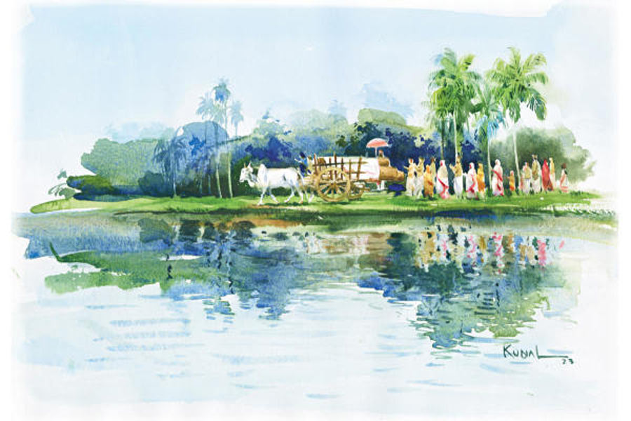

 
 <h1 align=center>দারুব্রহ্ম</h1>
<h2 align=center>অরুণাভ দত্ত</h2> সকাল সকাল উঠোনের নিমগাছটাকে নিয়ে প্রহ্লাদ আর তার ছেলে নকুলের মধ্যে আবার ঝগড়া শুরু হল। নকুল গাছটা কেটেই ছাড়বে আর প্রহ্লাদ কিছুতেই কাটতে দেবে না। নকুল প্রহ্লাদকে বলল, “যখন মরবে, তখন কি নিমগাছটা বুকে নিয়ে স্বর্গে যাবে?”

“মরার পর আলাদা কথা। কিন্তু যত দিন বেঁচে আছি, ও গাছে হাত দিতে পারবি না!”

“আর যদি দিই?”

“তা হলে মাইরি বলছি, কুড়ুলের এক কোপে তোকেই কচুকাটা করব!”

“তুমি একটা গাছের জন্য ছেলেকে খুন করবে!”

“আলবাত করব!”

বাপ-ছেলের বচসা গাছ কাটা থেকে খুনোখুনিকে কেন্দ্র করে ঘনীভূত হল। সামান্য একটা নিমগাছ যে কারও বেঁচে থাকার অবলম্বন হতে পারে, তা প্রহ্লাদকে না দেখলে বিশ্বাস হবে না। বনমালীপুর গ্রামের সীমানায়, যেখানে তিনটে রাস্তা এক জায়গায় মিশেছে, সেইখানে প্রহ্লাদের বাড়ি। মাটির দেওয়াল। টালির চাল। চালে লাউ-কুমড়ো লতিয়ে উঠেছে। চার দিক বেড়া দিয়ে ঘেরা। আশপাশের আম, কাঁঠাল, কদম, অশ্বত্থ গাছ বাড়ির উঠোনে ছায়া ঢেলে দিয়েছে। নিমগাছটা রয়েছে বাড়ির উত্তরে উঠোনের এক কোণে। বেশ বড় আর পুরনো গাছ। প্রধান কাণ্ড থেকে বেরিয়েছে পাঁচটা বড় বড় শাখা। গাছের গোড়ায় একটা মস্ত উইয়ের ঢিবি। সেই ঢিবিতে গর্ত করে বাস করে একটা সাপ। সাপটা কখনও কারও অনিষ্ট করেনি।

প্রহ্লাদের মনে পড়ে, অনেক দিন আগে এক দুপুরবেলায় সে ওই গাছতলায় ঘুমোচ্ছে। পাশেই ঘুমোচ্ছে নাতি গুপি। তখন সে দু’বছরের। হঠাৎ ফোঁস করে একটা শব্দ শুনেই প্রহ্লাদ ধড়মড় করে উঠে বসে দেখে একটা শিয়াল তাদের উঠোন থেকে দৌড়ে পালাচ্ছে আর তার পিছু নিয়েছে উইঢিবির বাসিন্দা সাপটা। গাছতলার নরম মাটিতে শিয়ালের পায়ের ছাপ দেখে প্রহ্লাদ বুঝতে পারে, নাতিটাকে ধরতেই এসেছিল শিয়ালটা। সাপটার জন্য রক্ষা পেয়েছে। বহু বার বাড়ির চৌহদ্দির মধ্যে সাপের খোলস খুঁজে পেয়েছে প্রহ্লাদ।

প্রহ্লাদের বাবা যখন বনমালীপুরে এসে এই জমিতে সংসার পেতেছিল, সেই তখন থেকেই নিমগাছটা এখানে আছে। প্রহ্লাদ তখন দুধের শিশু। নিমগাছটাও তখন নবীন। রাতে তার কচি পাতাগুলো যখন শিরশির করে উঠত হাওয়ায়, প্রহ্লাদের মনে হত যেন ঘুমপাড়ানি গান। এক দিন প্রহ্লাদের বাবা দাঁতনের জন্য গাছের একটা ডাল ভেঙে অবাক হয়ে বলেছিল, “ও গো পেল্লাদের মা, এ নিমগাছের ডাল, পাতা সব যে মিষ্টি গো!”

ছেলেবেলায় বাপের মুখ থেকে প্রহ্লাদ শুনেছিল, “এ সাধারণ নিমগাছ নয় রে, পুরুতঠাকুরেরা বলে এমন গাছ নাকি স্বয়ং দারুব্রহ্ম! একে অবহেলা করিস না, ভিটেমাটিতে যত্ন করে ধরে রাখিস রে পেল্লাদ!”

‘দারুব্রহ্ম’ যে কী, তা প্রহ্লাদ জানে না। তবে ছেলেবেলা থেকেই গাছটা প্রহ্লাদের বন্ধুর মতো। গাছটার নাম দিয়েছিল ‘দারু’। প্রহ্লাদের বয়স এখন সত্তর ছুঁই-ছুঁই। গাছটার বয়স কিছু বেশি। যে বার গ্রামের মাতব্বর বাসুদেব মিশ্রর ছেলে কঠিন রোগে আক্রান্ত হল, সে বার বাসুদেব এক দিন প্রহ্লাদের কাছে এসে জানাচ্ছিল তার মনোবেদনা। বাসুদেবের দুঃখ দেখে প্রহ্লাদের মায়া হয়েছিল। তাই নিমগাছটা দেখিয়ে সে বলেছিল, “বাবা বলত, দারু নাকি সাক্ষাৎ দেবতা। এক বার বলে দেখো না।”

বাসুদেব মিশ্র আকুল কণ্ঠে গাছের উদ্দেশে প্রার্থনা করেছিল, “ঠাকুর, আমার ছেলেকে সুস্থ করে দাও! আমি এই গাছতলায় ধুমধাম করে তোমার পুজো দেব।”

দৈব কৃপায় হোক বা অন্য কোনও কারণেই হোক, ডাক্তারের জবাব দিয়ে যাওয়া বাসুদেবের মরণাপন্ন ছেলেটা আস্তে আস্তে নীরোগ হয়ে ওঠে। বাসুদেব সে বার অনেক খরচ করে পুজো দিয়েছিল গাছতলায়। কথাটা রাষ্ট্র হয়ে যায় আশপাশের দু’-দশটা গ্রামে। সেই থেকে অনেকের কাছে ওই নিমগাছ দেবতা।

প্রহ্লাদ অতশত জানে না। সে শুধু জানে যে, ওই গাছের সান্নিধ্য বড় স্নিগ্ধ। মনের সমস্ত বিষণ্ণতা দূর হয়ে যায় ওর কাছে থাকলে। প্রহ্লাদ সেটা টের পেয়েছে। তার জীবনে বিপর্যয় কম আসেনি। তার স্ত্রী মারা গিয়েছে যৌবনেই। তার পর নকুলের বৌ যে রাতে আঁতুড়ঘরে ছেলে হতে গিয়ে অকালে মারা গেল, সে রাতে কী ঝড়বৃষ্টি! পরদিন সকালে প্রহ্লাদ দেখে, ঝড়ের তাণ্ডবে উঠোনের সুপুরিগাছটা মাটি থেকে উপড়ে পড়ে রয়েছে। সে দিন মা-মরা নাতির মুখ দেখে প্রহ্লাদ যখন নিমগাছের তলায় বসে কাঁদছিল, তখন তার মনে হয়েছিল যে, গাছের পাতাগুলো যেন শিরশির করে তাকে বলছে, ‘দুঃখ পেয়ো না বন্ধু। প্রকৃতির নিয়মই এই। দেখছ না, কত গাছ বুড়ো হয়ে মরছে, আবার ঝড় এসে কত গাছকে অকালে মাটি থেকে উপড়ে দিয়ে যাচ্ছে। সবই নিয়ম।’

প্রহ্লাদ ভাবল, তাই তো!

প্রহ্লাদ নকুলকে নিজের হাতে বড় করেছে। এখন গুপির দেখভালও তার দায়িত্বে। কিন্তু প্রহ্লাদ লক্ষ করেছে যে, সংসার প্রতিপালন করলেও সংসারের প্রতি বিন্দুমাত্র টান তার নেই; আছে শুধু ওই নিমগাছটার উপর। সত্তর বছরে সে এক বারও গাছটাকে ছেড়ে থাকেনি। ওই গাছই তার বন্ধু, আশ্রয়, অবলম্বন। নিজের সামান্য জমিতে চাষবাস করেই ছেলেকে বড় করেছে প্রহ্লাদ। এখন নকুল চাষবাস দেখে। প্রহ্লাদ জানে যে, নকুল অল্পে তুষ্ট থাকতে পারে না। উপরি উপার্জনের আশায় সব সময় এ দিক সে দিক ছুটে বেড়ায়। এখন যেমন সে চাইছে, নিমগাছটা কেটে কাঠের গোলায় বিক্রি করে দিতে। অনেক টাকা পাবে।

প্রহ্লাদ রাগ দেখিয়ে ছেলেকে বলে, “দেবতাকে কাটতে যাবি কোন সাহসে? পাপের ভয় নেই তোর?”

নকুল সমান ঝাঁঝে উত্তর দেয়, “আমার বৌটা যে অকালে মরে গেল, বাঁচাতে পারল তোমার দেবতা?”

নিরুত্তর প্রহ্লাদ দারুর দিকে তাকিয়ে থাকে কয়েকমুহূর্ত। দমকা হাওয়ায় ডাল থেকে কিছু পাতা ঝরতে ঝরতে যেন বলে, ‘সবই নিয়ম।’

বৈশাখ মাস পড়তে না পড়তে চরণদাস বৈরাগী ভিক্ষে নিতে এসে জানিয়ে গেল যে, এ বছর আষাঢ় মাস নাকি পুরুষোত্তম মাস বা মলমাস। পুরীতে নাকি সেই উপলক্ষে মহোৎসবের তোড়জোড় শুরু হয়েছে। দিন কয়েক পরেই গ্রামের ছেলে-বুড়োরা এসে খবরটা দিল। এ বছর পুরীতে জগন্নাথদেবের নবকলেবর উৎসব। জগন্নাথ-বলরাম-সুভদ্রা এবং সুদর্শনের পুরনো কাঠের বিগ্রহের স্থানে নতুন বিগ্রহ বসবেন। নিয়ম অনুযায়ী পুরনো বিগ্রহদের মন্দির চত্বরে সমাধিস্থ করা হবে। সেই উপলক্ষে নানা অনুষ্ঠানের আয়োজন শুরু হয়েছে।

বৈশাখের শুক্লপক্ষের এক শুভ দিনে পুরীর রাজার আদেশে বিদ্যাপতি বংশীয় ও শবররাজ বিশ্বাবসু বংশীয় নিষ্ঠাবান ব্যক্তিরা চারটি বিগ্রহ নির্মাণের উপযুক্ত দারুর খোঁজে বেরিয়ে পড়েছেন। শুরু হয়েছে বনযাগ যাত্রা। তাঁরা  রাজপুরোহিত, বেদজ্ঞ ব্রাহ্মণ ও দক্ষ কারিগরদের সঙ্গে নিয়ে পবিত্র নিমবৃক্ষের সন্ধানে বনে বনে ঘুরছেন। তাঁদের নেতৃত্ব দিচ্ছেন জগন্নাথ মন্দিরের প্রবীণ দয়িতাপতি। কাকটপুরে দেবী মঙ্গলার মন্দিরে সমস্ত আচার-অনুষ্ঠান সম্পন্ন হয়েছে আগেই। ব্রাহ্মণ, কারিগর সকলেই চারটি দলে ভাগ হয়ে চার দিকে ছড়িয়ে পড়েছেন। স্বপ্নাদেশে চারটি বিগ্রহ নির্মাণের জন্য পবিত্র চারটি নিমবৃক্ষের সন্ধান মিলেছে।  

আরও সংবাদ পাওয়া গেল, প্রহ্লাদের বাড়ির নিমগাছটাকে চিহ্নিত করা হয়েছে জগন্নাথের দারুমূর্তি নির্মাণের জন্য।

প্রহ্লাদ আরও শুনল যে, বিশেষ লক্ষণযুক্ত নিমবৃক্ষই বিগ্রহ নির্মাণের কাজে লাগে। জগন্নাথের দারু হয় ঈষৎ কৃষ্ণাভ। বৃক্ষের গায়ে খোদাই করা থাকে শঙ্খ, চক্র, গদা, পদ্ম, সর্প প্রভৃতি শুভ প্রতীক। বৃক্ষটি হবে তিন, পাঁচ অথবা সাতটি শাখাযুক্ত। নিমগাছ হলেও তার স্বাদ তেতো হবে না, হবে অম্লমধুর। ওই বৃক্ষে থাকবে না কোনও পাখির বাসা, কোনও ক্ষত। গাছের গোড়ায় থাকবে একটা সাপ, যে একটা উইঢিবির মধ্যে বাস করে পাহারা দেবে ওই পবিত্র বৃক্ষটি। আর বৃক্ষটির অবস্থান হবে তিনটি পর্বত, তিনটি নদী অথবা তিনটি পথের সংযোগস্থলে। পুরীর মন্দিরের প্রতিনিধিরা দৈবাদেশ পেয়েই আসছেন এই গ্রামে। আর দু’দিন লাগবে তাদের পৌঁছতে।

প্রহ্লাদ সব শুনে অবাক। তাকিয়ে দেখে উত্তর, দক্ষিণ ও পশ্চিম দিক থেকে তিনটে গ্রামের রাস্তা এসে ঠিক তার বাড়ির কাছেই মিশেছে বটে। নিমগাছটাও খুঁটিয়ে দেখে প্রহ্লাদ। গাছের গুঁড়িতে চক্রের মতো আকৃতি দেখতে পায়। তা ছাড়া বহু কাল ধরে সে লক্ষ করেছে যে, আশপাশের গাছে বাসা করেছে কত পাখি; শুধু এ গাছ ছাড়া। প্রহ্লাদ ভাবত যে, গাছের গোড়ায় সাপ আছে জেনেই হয়তো তারা বাসা বাঁধে না। আর সাপটাকেও সে দেখে আসছে বহু কাল ধরে। ওই গর্তে সাপটার ছানাপোনাও কখনও দেখেনি প্রহ্লাদ। আর গাছের মিষ্ট স্বাদের কথা তার বাবা-ই জানিয়েছিল এক দিন। প্রহ্লাদ নিজে কখনও যাচাই করে দেখেনি। এই ব্যাপারগুলো এত কাল ধরে দেখেও কখনও অসামান্য মনে হয়নি তার। কিন্তু আজ হঠাৎই তার অতিপরিচিত সঙ্গী সম্পূর্ণ নতুন হয়ে গিয়েছে প্রহ্লাদের কাছে। তার আশপাশে পা ফেলতেও সঙ্কোচ হয়। আবার কানে বাজতে থাকে বাবার আদেশ— “একে ভিটেমাটিতে যত্ন করে রাখিস পেল্লাদ!”

কিন্তু সে আদেশ আর রক্ষা করা যাবে না ভেবে প্রহ্লাদ কষ্ট পায়। ক’দিন পরই তো বাড়ি শূন্য করে চলে যাবে দারু। প্রহ্লাদের কাটা ঘায়ে নুন ছিটোয় নকুল, “কী গো, আগলে রাখতে পারলে তোমার দারুকে?”

প্রহ্লাদ নিরুত্তর।

“সেই তো কেটেই ফেলবে। আটকাতে কি পারলে! আমি কাটলে বরং কিছু হাতে আসত! এখন গাছও যাবে, মালকড়িও মিলবে না!”

“চুপ কর হতচ্ছাড়া! আর পাপ কুড়োস না!” ছেলেকে চোখ রাঙালেও প্রহ্লাদের দুঃখ যাওয়ার নয়। দিনরাত শুধু পরম স্নেহে হাত বুলোয় নিমগাছটার গুঁড়িতে। লুকিয়ে চোখের জল ফেলে।

কয়েক দিন পরেই জগন্নাথ মন্দিরের লোকজন এসে পড়ল। সঙ্গে বড় বড় কয়েকটা গরুর গাড়ি। বটগাছের কাঠ দিয়ে তৈরি দু’চাকাবিশিষ্ট গরুর গাড়িতে করে পবিত্র দারু মন্দিরে নিয়ে যাওয়াই রীতি। প্রহ্লাদের বাড়িতে লোকজনের ভিড় উপচে পড়ছে। তিলধারণের জায়গা নেই। জগন্নাথ মন্দিরের বৃদ্ধ দয়িতাপতি নিমগাছটা ভাল ভাবে পর্যবেক্ষণ করে ভূমিষ্ঠ হয়ে প্রণাম করলেন। গাছের চার পাশ পুরোপুরি ঘিরে দেওয়া হয়েছে। সাধারণের প্রবেশ নিষেধ। গাছের সামনে তিন দিন ধরে যজ্ঞ হল। চতুর্থ দিন সোনা, রুপো ও লোহার তিনটে কুঠার এনে রাখা হল। গ্রামের মেয়ে-বৌরা উলু দিচ্ছে, শাঁখ বাজাচ্ছে। প্রহ্লাদ ঘরবন্দি হয়ে বসে। বিদ্যাপতি বংশীয় নিষ্ঠাবান সেবক জগন্নাথদেবের নাম স্মরণ করে সোনার কুঠার দিয়ে গাছটায় প্রথম আঘাত করলেন। শব্দ শুনে যন্ত্রণায় কালো হয়ে গেল প্রহ্লাদের মুখ। এ বার দয়িতাপতি রুপোর কুঠার দিয়ে আঘাত করলেন। “জয় জগন্নাথ!” জয়ধ্বনিতে কেঁপে উঠল আকাশ-বাতাস। ঘরের বাঁশের খুঁটিটা আঁকড়ে ধরেছে প্রহ্লাদ। সব শেষে কারিগর লোহার কুঠার দিয়ে হানলেন শেষ আঘাত। বেশ কয়েক বার। কুঠারের প্রতিটি শব্দে প্রহ্লাদের পাঁজরগুলো ভেঙে গুঁড়িয়ে যাচ্ছে যেন। মড়মড় করে ভেঙে পড়ল গাছটার ডালপালা। কুঠারের মুহুর্মুহু আঘাতে গাছের গুঁড়িটা ধরাশায়ী হল মাটিতে।

“দাদু, গাছটা কেটে ফেলেছে পুরোটা। দেখবে এসো!” গুপির কথা শুনে শক্ত হয়ে বসে থাকে প্রহ্লাদ। গাছের পাতা আর শাখাপ্রশাখা মাটিতে গর্ত করে পুঁতে ফেলে গাছের গুঁড়িটা রেশম কাপড়ে মুড়ে তোলা হল গরুর গাড়িতে। তার পর দয়িতাপতি, ব্রাহ্মণ ও কারিগররা চামর দোলাতে দোলাতে গরুর গাড়ি নিয়ে যখন রওনা দিলেন, তখন সূর্য অস্ত যাচ্ছে।

ঘর থেকে বেরিয়ে প্রহ্লাদ দেখল, উত্তর দিকটা একেবারে ফাঁকা। আছে শুধু উইঢিবিটা। হু-হু করে ওঠে প্রহ্লাদের মন। গুপি জানাল, মন্দিরের লোকেরা বলেছে যে ওই সাপের কাজ ফুরিয়েছে। সেও নাকি আর ওখানে থাকবে না। প্রহ্লাদ অষ্টপ্রহর উত্তর দিকের ফাঁকা জায়গাটার দিকে তাকিয়ে থাকে। সর্বদা মনমরা ভাব। উদাস চাহনি। খাবারে রুচি নেই, রাতে ঘুম নেই। দিন দিন প্রহ্লাদ যেন শুকিয়ে যেতে লাগল।

স্নানযাত্রা পূর্ণিমার দিন নকুল আর গোপীনাথ গিয়েছে চাঁদপুরে রাধাবিনোদ ঠাকুরের উৎসব দেখতে। সেখানে পঙ্‌ক্তি ভোজন, যাত্রাপালা হবে। তখন সন্ধ্যা উতরে গিয়েছে। আকাশে জ্যৈষ্ঠ পূর্ণিমার চাঁদ। নিস্তব্ধ গ্রামটা জ্যোৎস্নায় সাদা। প্রহ্লাদ দাওয়ায় বসে তাকিয়ে আছে দূরে। হঠাৎ সে দেখতে পায়, দূর থেকে কারা যেন তার বাড়ির দিকেই আসছে। সংখ্যায় তারা চার জন। তারা কাঁধে করে কী যেন বয়ে আনছে। একটু পরেই দেখা গেল, পুরোহিতের বেশধারী চার জন একটি বড় জগন্নাথমূর্তি কাঁধে চাপিয়ে প্রহ্লাদের উঠোনে এসে দাঁড়িয়েছে। প্রহ্লাদ অবাক হয়ে দেখল, উত্তর দিকে উইঢিবির কাছে কে যেন আগেভাগে একটা বিশাল গর্ত খুঁড়ে রেখেছে। সেখানে জগন্নাথমূর্তিটি সমাধিস্থ করে গর্ত বুজিয়ে লোকগুলো ফুস করে মিলিয়ে গেল হাওয়ায়! বিস্ময়ের ঘোর কাটার আগেই প্রহ্লাদ দেখতে পেল, সমাধি থেকে জন্ম নিচ্ছে একটা গাছের চারা। চোখের পলকে সেই চারা বড় হতে হতে মহীরুহ হয়ে উঠল। প্রহ্লাদ বুঝতে পারল, ওটা একটা নিমগাছ। যেন দারুই আবার স্বস্থানে মাথা তুলেছে। নিমেষের মধ্যে সেই গাছে অসংখ্য নিমফল ফলল। তার পর ঝাঁকে ঝাঁকে পাখি এসে সেই ফল ছিঁড়ে নিয়ে উড়ে যেতে লাগল। তাদের ঠোঁট থেকে যেখানে ফল পড়ল, সেখানেই গজিয়ে উঠতে লাগল নিমের চারা। চতুর্দিক ছেয়ে গেল অসংখ্য নিমগাছে।

ধ্বংসের মধ্যে সৃষ্টির বীজ নিহিত দেখে প্রহ্লাদ বিস্ময়ে, আনন্দে বাক্যহারা। যে দিকে তাকায় সে দিকেই তার দারু। সহসা প্রহ্লাদ শুনতে পায় দূর থেকে ভেসে আসছে একটা গম্ভীর অথচ মধুর কণ্ঠ, “তারা বোকা, যারা ভাবে আমিও মানুষের মতো জন্মাই, মরে যাই। আমি যে অবিনাশী। আমি…” স্তিমিত হয়ে আসছে কণ্ঠস্বর।

আচমকা পেঁচার ডাকে প্রহ্লাদের তন্দ্রা ছুটে যায়। তাকিয়ে দেখে, সব কিছুই স্বাভাবিক। সহসা চমকে ওঠে প্রহ্লাদ। শুনতে পায় কেউ বলছে, “তারা বোকা, যারা ভাবে আমিও মানুষের মতো…” প্রথমটায় হতবাক হয়ে গেলেও প্রহ্লাদ পরে বুঝতে পারে ওটা গুপির গলা। নকুলরা ফিরে আসছে। বাড়ির কাছেই এসে পড়েছে। নিশুতি রাতের বাতাসে ভাসছে গুপির প্রশ্ন, “আচ্ছা বাবা, কৃষ্ণ-অর্জুন পালায় কৃষ্ণ কেন বলল, আমি অবিনাশী?”

“জানি না বাপু।”

“দাদু জানে?”

প্রহ্লাদ উত্তর দিকের ফাঁকা জায়গাটার দিকে তাকায়। বুঝতে পারে মনের ভার অনেকটা লাঘব হয়েছে। তখনই প্রহ্লাদের চোখে পড়ে, উইঢিবির কাছে চাঁদের আলোয় সাদা হয়ে আছে সাপের খোলসটা।

‘নবকলেবর!’ আপন মনে হাসে প্রহ্লাদ। তার পর নকুলদের হাত-পা ধোয়ার জল আর গামছা আনার জন্য উঠে পড়ে।