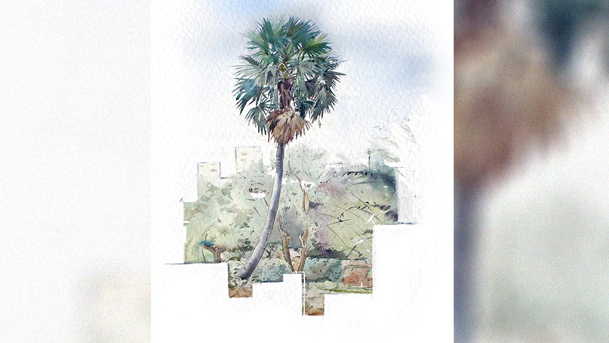

 
 <h1 align=center>দিনান্ত</h1>
<h2 align=center>অমিত দাস</h2> শেষ বিকেলের আলো ফুরিয়ে আসছে। দূর দিগন্তে ভেসে বেড়ানো মেঘের গায়ে সূর্যের বিষণ্ণ অস্তরাগ। সামনের গলির প্রান্ত ছুঁয়ে দূরের আকাশসীমায় ভেসে থাকা ফ্লাইওভার। তার গা ঘেঁষে দাঁড়িয়ে থাকা বিশাল বহুতল আর বিজ্ঞাপনের লোহার কাঠামোগুলো চোখের পক্ষে পীড়াদায়ক হত, যদি না তার একটু আগেই তালগাছটাকে ঘিরে কয়েকটা গাছ দাঁড়িয়ে থাকত। পাশের গাছগুলোর মাথা ছাড়িয়ে অনেকটা ওপরে তালগাছের পাতাগুলো, আশপাশে টিকে থাকা হাতে-গোনা সঙ্গীদের মধ্যে একটু স্বতন্ত্র। সবার মাঝে থেকেও কেমন যেন একা কিসের প্রতীক্ষায়, কে জানে!

একটা দীর্ঘশ্বাস উঠে এল মাধবীর বুক থেকে। সেই কবে থেকে তালগাছটাকে ওই ভাবে মাথা উঁচিয়ে দাঁড়িয়ে থাকতে দেখেছেন। দেখতে দেখতে পাঁচ না ছয় দশক পেরিয়ে গেল। এই এক চিলতে বারান্দায় বসে সামনে তাকালেই একমাত্র চোখে পড়ে বড় রাস্তা পেরিয়ে দূরের আকাশ, আর সেটা ছুঁয়ে দাঁড়িয়ে থাকা তালগাছটা ঘিরে সবুজ ছোপ। এ ছাড়া আর যে দিকেই চোখ যায়, কংক্রিটের জঙ্গল। ওঁর বাড়ির পাশের জমিতেও ফ্ল্যাট উঠছে। ওটা উঠে গেলে দূরের তালগাছ আর তাঁর আশপাশের গাছগুলোও আর দেখা যাবে না।

এক সময় বাড়ির ছাদ টবে গাছ লাগিয়ে ভরিয়ে ফেলেছিলেন মাধবী। কত রকম গাছ। শীতের সময় নানা ধরনের মরশুমি ফুল, গরমের সময়টা বেলফুল, সূর্যমুখী, তুলসী, মানিপ্ল্যান্ট। এখন হাঁটুর ব্যথার চোটে সিঁড়িভাঙা বন্ধ। ছাদের গাছগুলো কবে শুকিয়ে গেছে। একটু প্রাণ খুলে যে সবুজের দিকে তাকিয়ে থাকবে, তার জো কোথায়!

আর টিকে আছে মাধবীলতা গাছটা। যত্নের অভাবে নীচে এখন বুনো ঝাড়। পরিষ্কার করে যে ওগুলোর একটু যত্ন করবেন, শরীরের সে অবস্থা আর নেই। আজও ফুল ধরলে, তাঁর গন্ধে, মাধবীলতাটা নিজের উপস্থিতি জানান দিয়ে যায়।

দূরে চেয়ে অন্যমনস্ক হয়ে পড়েন মাধবী। এক সময় কী ছিল এ সব জায়গা! বিয়ে হওয়ার সময় শুনেছিলেন পাত্র কলকাতার খুব কাছেই থাকে। বিয়ের পর মফস্সলের ছোট শহর থেকে সন্ধেবেলায় এ বাড়িতে পৌঁছে মনে হয়েছিল, শহর কোথায়, এ তো জঙ্গলের মধ্যে বাড়ি! বাবার ওপর বড্ড অভিমান হয়েছিল। পর দিন সকালে ঘুম ভাঙার পর থেকে একটু একটু করে এ বাড়ি, আর লাগোয়া পাড়াটা চেনা শুরু হয়েছিল।

ব্রিটিশ আমলের বাড়ি। মোটা মোটা দেওয়াল, খিলান দেওয়া দরজা। পোড়া ইটের উচু পাঁচিল। ফটক না থাকা সিংহদরজা, পুকুরে যাওয়ার খিড়কিদরজা। নামগুলো তখনও বজায় থাকলেও, টিকে আছে সুরকির ধুলোসহ কিছু পোড়া ইটের কাঠামো। পাঁচিল-লাগোয়া গোয়ালঘর। আর চার পাশে কত খোলা জায়গা, গাছগাছালি। রাতে যেটা জঙ্গল বলে মনে হয়েছিল, সেগুলো এদের বাগান।

শোওয়ার ঘরের জানলার ধারে ফুলের বাগান। জানলা ঘেঁষে গন্ধরাজ ফুলের গাছ। ইতিউতি ছড়ানো বকুল, চাঁপা, শিউলি গাছ। আর সদর দরজা পেরোলে, ফলের বাগান। সীমানা ঘেঁষে সারি দিয়ে দাঁড়ানো নারকেল, সুপারি গাছের মাঝের জমিতে আম, জাম, কাঁঠাল গাছ। ঘাসজমির মাঝখান দিয়ে সরু পায়ে চলা পথ। যৌথ পরিবারের অন্যান্য বৌ, ননদদের সঙ্গে বাড়ির বড়দের নজর এড়িয়ে এই বাগান দুটো ছিল দুপুর বা বিকেলের দিকে ওঁদের নিশ্চিন্ত আড্ডার জায়গা। গল্প, আড্ডায় বেশ মজায় কেটে যেত সময়।

এর পর কেটে গেছে অনেকটা সময়। শরিকি সম্পত্তি ভাগ হতে হতে, জমি বিক্রি, প্রোমোটারের হাতে দিয়ে একটু একটু করে ছিন্নবিচ্ছিন্ন হয়ে পায়রার খোপ বেছে নেওয়া। খিড়কি দরজা, সদর দরজা উধাও হয়ে, চার দিকের বহুতলের মাঝে কোনও রকমে টিকে থাকা এই বাড়ি। মাধবীর স্বামী একটু সারিয়ে নিয়ে নিজেদের থাকার মতো করে নিয়েছিলেন। সে-ও কত দিন আগের কথা। আশপাশের বহুতলগুলোর দানবীয় ভ্রূকুটি অগ্রাহ্য করে বাড়িটা আজও টিকে আছে বহাল তবিয়তে।

“সন্ধে হয়ে আসছে। চল তোমায় ঘরে নিয়ে যাই।”

“আর একটু বসি এখানে।”

শিউলির কথায় অন্যমনস্ক ভাবটা কাটলেও উঠতে ইচ্ছে করছে না। শরীরটা যেন একটু ভার ভার লাগছে।

“কী হল, তোমার? শরীর ঠিক আছে তো?”

ওর গলায় উদ্বেগের সুর। এগিয়ে এসে কপালে হাত রাখল, “ঠিক আছে। বোসো আর একটু। আমি সন্ধে দিয়ে তোমাকে ঘরে নিয়ে যাব।”

ওর এই উদ্বেগটুকু ভাল লাগল মাধবীর। নিজের ছেলে, মেয়ে সবাই দূরে দূরে। মাঝে মাঝে ওদের ফোন আসে। খোঁজখবর নেয়, ওদের কাছে যেতে বলে। মাধবীর ইচ্ছে করে না।

এর আগেও কয়েক বার ছেলেমেয়েদের কাছে গিয়ে থেকে এসেছেন। ভাল লাগেনি। ওরা নিজেদের মতো ছুটে চলেছে। বড় ব্যস্ত জীবন। একটু জিরোনোর অবকাশ নেই কোথাও। কিছু দিন থেকে হাঁফ ধরে গেছে। এর থেকে দূরে সরে থাকা ভাল। হাতের কাছে ফোন তো আছে। মাঝে মাঝে কথাবার্তা হয়। এই ভাল।

এই বয়সে এসে আর শরীরটা সঙ্গ দেয় না। কোমর, হাঁটু প্রায় বিকল। মাঝে মাঝে চোখ দুটো জ্বালা করে, সব কেমন ঝাপসা লাগে। তাঁর সঙ্গে আরও নানা উপসর্গ লেগেই আছে। বুঝতে পারেন, সময় হয়ে আসছে। জীবনের এক্সপায়ারি ডেট পেরিয়ে গেছে। এখন কোনও মতে টিকে থেকে ডাক আসার প্রতীক্ষায় বসে থাকা। তাঁর সময়কার চেনা পরিচিতদের অনেকেই চলে গেছেন। আর যাঁরা বেঁচে আছেন, তাঁরাও টিকে আছেন কোনও রকমে। যে কোনও সময় ঝরে পড়ার অপেক্ষায়।

আগে এই বারান্দাটায় বসে থাকলে রাস্তায় পরিচিত লোকজন যাওয়ার সময় দাঁড়িয়ে দুটো কথা বলত। এখন আর কেউ খুব একটা খোঁজ খবর নেয় না। সবাই ব্যস্ত।

সারা দিনে অঢেল সময়। একা মানুষ। শিউলির দৌলতে সংসারের কোনও কাজ করার প্রয়োজন পড়ে না। আগে খবরের কাগজ, গল্পের বই পড়তেন, টিভি দেখতেন। চোখ জ্বালা আর ঝাপসা দেখার পর থেকে সেগুলো বন্ধ। কখনও শিউলি গান চালিয়ে দেয়। শুনতে ভাল লাগে। কত কথা মনে পড়ে। মাঝে মাঝে ঝিম ধরা ভাব আসে। ঠিক ঘুম নয়। তন্দ্রার একটা আমেজ মতো থাকে। ছেঁড়া ছেঁড়া কিছু স্বপ্নের মতো দৃশ্য ভেসে আসে চোখের সামনে, সিনেমা যেন। পুরনো সব স্মৃতি। আপাত তুচ্ছ। কোনও ঝাঁপিতে ভরে মনের সিন্দুকের কোণে যত্ন করে তুলে রাখা ছিল। আজ শেষ বয়সে এসে সেগুলো ফিরে দেখে বুক ভরে যায়।  

ঝিমধরা ভাব কেটে গেলে বড্ড একা আর অসহায় লাগে। কারও সঙ্গে দুটো কথা বলতে ইচ্ছে করে। একমাত্র শিউলি এসে কাজের ফাঁকে ফাঁকে দুটো কথা বলে। আশপাশের হাল হকিকত জানায়। কিছু ক্ষণের জন্য একটু একঘেয়েমি কাটে।

মেয়েটা বড় দুর্ভাগা। সারাদিন লোকের বাড়ি কাজ করে যে ক’টা টাকা রোজগার করত, তাঁর অর্ধেক ওর বর নেশা করে, জুয়া খেলে উড়িয়ে দিত। টাকা চেয়ে না পেলে, মেয়েটাকে ধরে মারত। শিউলিকে অনেক বার তিনি বলেছেন, তাঁর কাছে এসে থাকতে। এ বাড়ির একতলাটা পুরো খালি পড়ে। মেয়েটা আগে রাজি হয়নি। ওর বর যে দিন অন্য একটা মেয়েকে এনে ঘরে তুলল, তার পরদিন ও এ বাড়িতে চলে এসেছিল। আজও রয়ে গেছে। তবে এখনও ওই ত্যাঁদড় লোকটা মাঝে মাঝে নীচে এসে শিউলির কাছে ইনিয়ে বিনিয়ে কী সব কথা বলে টাকা নিয়ে যায়। তিনি ওপরের বারান্দায় বসে একটু আধটু আন্দাজ করতে পারেন। মেয়েটা যে এখনও কেন ওই লোকটাকে সহ্য করে কে জানে! বড্ড ভালবাসে বোধহয়।

ঠোঁটের কোণে একটা ম্লান হাসি ভেসে ওঠে মাধবীর। তিনিও ওই স্বাদ পেয়েছিলেন। ভালবাসার। ভাঙাচোরা শ্বশুরবাড়িতে এসে বাবার ওপর রাগ হয়েছিল প্রথম দিন। কিন্তু তার পর! বিয়ের পর ক’টা দিন আর বাপের বাড়ি গিয়ে থেকেছেন? মা, বাবা কত বার করে বলেছেন। কিন্তু যত বারই গেছেন, কয়েকটা দিন যেতে না যেতে কোনও ছুতো তৈরি করে, লজ্জার মাথা খেয়ে, ও পৌঁছে যেত ফিরিয়ে আনতে। আর তিনি নিজেও দিন গুনতেন এখানে ফেরার। কোনও বার অন্যথা হয়নি।

বাড়ির এই বারান্দায় পাশাপাশি বসে, দু’জনে কত দিন দূরের তালগাছটায় বাবুইয়ের বাসা বোনা দেখেছেন। মানুষটা নিজেই এক দিন ওকে দেখিয়েছিলেন কী ভাবে বাবুই বাসা বাঁধতে শুরু করে। তার পর রোজ লক্ষ রাখা। কয়েক দিন পরে দিব্যি বাসা তৈরি। আর সেই বাসাতে বাবুই-দম্পতির ঘরকন্না। এই সব দেখতে দেখতে দু’জনে কত খুনসুটি করেছেন এক সময়। অথচ সে মানুষটা কেমন চুপিসাড়ে চলে গেল তাকে একা রেখে! ভাবতে ভাবতে আবার ঝিম ধরা ভাবটা ফিরে আসে। 

নীচে তুলসী তলায় প্রদীপ দিয়ে এসে শিউলি আবার বুড়িমাকে ডাকতে আসে। সন্ধ্যা হয়ে গেছে। বুড়ো মানুষটা বাইরে বসে মশার কামড় খাবেন এ বার।

বারান্দার আলো জ্বেলে ডাকতে গিয়ে দেখে, বুড়িমা কেমন একটা ভঙ্গিতে চেয়ারে মাথা হেলিয়ে দিয়েছেন। চোখ দুটো খোলা। এই বারান্দায় বসে আগে উনি দূরের তালগাছটার দিকে চেয়ে পুরনো দিনের কথা বলতেন শিউলিকে। বছরকয়েক ধরে চোখে দেখতে না পেলেও, রোজ এখানে এসে বসা চাই। পাশের জমিটায় লম্বা ফ্ল্যাট উঠে দূরের গাছগুলো আর দেখা যায় না এখন। তবু বুড়িমা ও দিকে চেয়েই মাঝে মাঝে তালগাছটার কথা কী সব বলতেন যেন। আজও সেই একই ভাবে বসে আছেন।

বুড়িমার দিকে চেয়ে বড্ড মায়া লাগে শিউলির। হাত ধরে ডাকতে গিয়ে চমকে ওঠে। হাত একেবারে ঠান্ডা। কপালে হাত দিয়ে, বুকে কান লাগিয়ে একটু স্পন্দন পেতে চায়। কোনও সাড়া না পেয়ে, ডুকরে কেঁদে উঠে দ্রুত পায়ে এগিয়ে ফোনটা তুলে নেয়। ডাক্তারবাবুকে ডাকতে হবে এখনই। আর দাদা-দিদিকেও ফোনে খবরটা দিতে হবে তাড়াতাড়ি। কত দিন হল, ওরা কোনও খবর নেয় না।  বড্ড খারাপ সময় এখন। বেঁচে থাকতে তো কারও দেখা পাওয়া গেল না। আজ অন্তত এক বার আসুক!