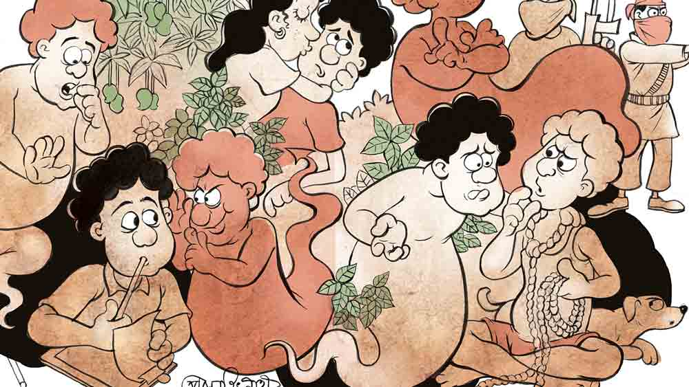

 
 <h1 align=center>দুই</h1>
<h2 align=center>সুব্রত নাগ</h2> গোঁফ গজানোর সময়, মানে হাফপ্যান্ট ছেড়ে ফুলপ্যান্ট পরার সময় থেকেই পলাশ একটা অদ্ভুত ব্যাপার টের পেয়েছিল। তার ভিতরে আসলে দুটো পলাশ আছে। একটা আশাবাদী বা পজ়িটিভ পলাশ আর একটা নৈরাশ্যবাদী বা নেগেটিভ পলাশ। পজ়িটিভ পলাশ যতই ভাবে এই পৃথিবীটা দামি, রঙিন, সুন্দর, মনোহর জিনিসে ঠাসা ঝাঁ-চকচকে শপিং মলের মতো, নেগেটিভ পলাশ সে ভাবনায় জল ঢেলে দিতে একটুও দেরি করে না। লম্বা লম্বা নিঃশ্বাস ফেলে বোঝায়, ‘সব যে মায়া রে খ্যাপা, দু’দিনের বই তো নয়।’ 

এখন মুশকিল হয়েছে এই যে, পজ়িটিভ পলাশ স্বভাব-চরিত্রে একদম আসল পলাশের মতো। নেহাতই নরম-সরম, গলার স্বরটাও মিনমিনে। অন্য দিকে নেগেটিভ পলাশের জাঁকালো মেজাজ। বাজখাঁই গলার আওয়াজ। তার প্রতাপে পজ়িটিভ পলাশ সব সময় বাসি মুড়ির মতো মিইয়ে থাকে। মাথা, গলা কোনওটাই ইচ্ছেমতো কোনও দিন উপরে তোলার সুযোগ পায় না পজ়িটিভ পলাশ। 

প্রথম দিকে এক-আধটা খুচখাচ ঘটনা ঘটলেও পলাশ ব্যাপারটা পরিষ্কার বুঝতে পারে মাধ্যমিকের ইংরেজি পরীক্ষার সময়। আর পাঁচ জন সাধারণ স্টুডেন্টের মতোই পলাশেরও ইংরেজি আর অঙ্ক পরীক্ষার দিন দাঁত কনকন, মাথা বনবন, পেট কামড়ানো, লুজ় মোশন ইত্যাদি ইউনিভার্সাল সিম্পটমগুলো লেগেই থাকত। নিজের বিদ্যেবুদ্ধি মতো সিন, আনসিন, গ্রামার আর রাইটিং-এর দু’চারটে জায়গায় খানিক এলোমেলো খামচা মেরে পলাশ বুঝল কুড়ি-একুশের বেশি উঠবে না। গ্রামারের ভয়েস চেঞ্জ, ন্যারেশন, ফ্রেজ়াল ভার্ব সবই তার কাছে গ্রিক ল্যাটিন হিব্রুর মতো দুর্বোধ্য। অগত্যা ঘণ্টাদেড়েক কোনও রকমে চেপেচুপে বসে থাকার পর থেকেই তীর্থের কাকের মতো আশপাশের বেঞ্চ থেকে সাপ্লাই আসার জন্য হাঁ করে কলম কামড়ে উসখুস করতে শুরু করে। ঘণ্টা দুয়েকের মাথায় শিকে ছেঁড়ার মতো একটা সুযোগ এসে যায়। সামনের বেঞ্চে বসে থাকা শিয়োরশট ফার্স্ট ডিভিশনওয়ালা রমেন দয়াপরবশ হয়ে খাতাটা একটু ফাঁক করে। ওঃ! চোখে হাজার টাকার ঝাড়বাতি জ্বলে ওঠে পলাশের। গ্রামারগুলো পরিষ্কার দেখা যাচ্ছে। ইনভিজিলেটর দুটোও দরজার কাছে দাঁড়িয়ে নিচু গলায় বকবক চালাচ্ছেন। ‘জয়গুরু’ বলে পলাশ ঝাঁপিয়ে পড়ে। মনে মনে ভাবে, আজ টুকেই খাতায় আগুন জ্বালিয়ে দেবে ও। 

‘এই থার্ড বেঞ্চ, নিজে লেখ। ডোন্ট কপি ফ্রম আদার্স!’ ইত্যাদি রুটিন সতর্কীকরণ হাওয়ায় ভাসিয়ে বয়স্ক ইনভিজিলেটরটা যখন হাঁক দেয় তত ক্ষণে ছাঁকা দশটা নম্বর পলাশের পকেটে। টেনে হিঁচড়ে পাশ মার্কসটা অন্তত উঠে যাবে। কিন্তু কোথায় কী? নেগেটিভ পলাশটা, যে পলাশের ভাল দু’চোখে দেখতে পারে না, তক্কে তক্কে ছিল। পলাশের কান খোঁচাতে শুরু করেছিল, “রমেন ছোঁড়ার উপর ভরসা রাখাটা কি ঠিক হচ্ছে? উত্তরগুলো যদি ভুল হয়?”

পজ়িটিভ পলাশ প্রথমটায় উড়িয়ে দিতে চেষ্টা করেছিল, মানতে চায়নি, “বা রে! ও যে টেস্টে ফার্স্ট ডিভিশন পেয়েছিল!”
“তাতে কী?” নেগেটিভ পলাশ পয়লা নম্বরের খুঁতবাজ, “আরে সে তো সায়েন্স সাবজেক্টগুলোর জোরে। ইংরেজিতে পেয়েছিল কত? মনে নেই? সাকুল্যে আটত্রিশ।”
“তাও তো আটত্রিশ! আমি যে কুড়িও পেরোইনি।” পজ়িটিভ পলাশ নিজের জাজমেন্টে অটুট ছিল।

কিন্তু পরের দশ মিনিট ধরে নেগেটিভ পলাশ মাথায় এমন সব সন্দেহের বীজ, শিকড় ঢুকিয়ে ঘেঁটে দিল যে পজ়িটিভ পলাশ আর কাউন্টার করার সাহসই পেল না। আসল পলাশও কেমন ভেবলে গিয়ে পটাপট টোকা টোকা উত্তরগুলোকে ঢেরা বুলিয়ে কেটে দিল। 

শেষ মুহূর্তে সেকেন্ড বেঞ্চের সেকেন্ড ডিভিশনওয়ালা শ্যামলকে খোঁচা মেরে কিছু জোগাড়যন্ত্র হল। কিন্তু হল থেকে বেরিয়ে দুটো অমোঘ সত্য জানা গেল— শ্যামলের উত্তরগুলো বারো আনাই ভুল আর রমেনের গ্রামারগুলো ষোলো আনাই ঠিক। আফসোসে পলাশ আঙুল কামড়েছিল যখন রেজ়াল্ট বেরোনোর পরে জেনেছিল, রমেন ইংরেজিতে তেষট্টি পেয়েছে।
এ তো গেল পরীক্ষার কথা। পরীক্ষা কি শুধু পরীক্ষার হল-এই হয়! জীবনেও হয়। বরং পরীক্ষার হলের বাইরেই জীবনের বেশি সিরিয়াস পরীক্ষাগুলো অপেক্ষা করে থাকে। বিশেষ করে মেয়েঘটিত পরীক্ষা। এলাকার চালু মুদির দোকান ‘মুখার্জি ভান্ডার’-এ খাতা লেখার কাজ পেয়েছিল পলাশ। হাড়ভাঙা খাটুনি কিছু নয়। বসে বসে কাজ, মাইনেটাও চলনসই। সুখে থাকারই কথা। কিন্তু উপরওয়ালা যখন আর পাঁচ জনের কপালে সুখের স্টিকার আটকাচ্ছিলেন, পলাশ তখনও সেখানে গিয়ে পৌঁছয়নি। মাসখানেক পর থেকেই মালিকের ছোট মেয়ে টুসকি প্রথমে নিরামিষ, তার পর বিপজ্জনক সব সিগন্যাল পাঠাতে শুরু করল। কলেজে পড়ে, দেখতে শুনতে মন্দ নয়, বয়সের চটক আছে, বাপের পয়সা আছে। বড়লোকের ঘরজামাই হওয়ার আনন্দে প্রথম দিকে পলাশের উৎসাহ ছিল খুব। সিগন্যাল রিসিভ করার উত্তেজনায় হিসেবের খাতায় ভুল হতে লাগল। সকলের নজর এড়িয়ে রথতলার মাঠের পাশের বোসদের ঘন আমবাগানে রোববারের নির্জন বিকেলে কিছুটা ঝোপকেলিও হয়ে গেল এক দিন। 

মাখো-মাখো ব্যাপারটা লক্ষ করে পাকা ঘুঁটি কাটিয়ে দিতে ফের আসরে নামল নেগেটিভ পলাশ। গম্ভীর মুখে বলল, “গতিক সুবিধের ঠেকছে না। জল কোন দিকে গড়াচ্ছে বুঝতে পারছিস?”
পজ়িটিভ পলাশ স্মার্ট হতে চেয়ে বলেছিল, “কোন দিকে আবার! ছাদনাতলার দিকে।”
নেগেটিভ পলাশ মাথা ঝাঁকাতে ঝাঁকাতে বলেছিল, “তুই কি ভাবছিস অর্ধেক রাজত্ব আর রাজকন্যা পাবি?”
পজ়িটিভ পলাশের কনফিডেন্স তখনও টসকায়নি, “বা রে! আমি যে মালিকের ফাঁকা গদিটা দেখতে পাচ্ছি।”
মুখ বেঁকিয়েছিল নেগেটিভ, “ফাঁকা গদি মানে? বড় জামাই কি ঘাস খাবে?”
“তা কেন? বড় মেয়ের সঙ্গে যে ইঞ্জিনিয়ার ছেলের বিয়ে পাকা। সে কি আর চাকরি ছেড়ে মুদির দোকানে বসবে!” অবাক হয়ে বলেছিল পজ়িটিভ পলাশ।           
“তোর মালিক কুলীন বামুন আর তুই সেখানে বেনে। বড় জামাই ইঞ্জিনিয়ার আর ছোট জামাই শ্বশুরের দোকানে খাতা লেখে! পাগল না পেন্টুলুন তুই! ও সব খোয়াব দেখা বন্ধ কর।”
“বন্ধ করব কী? পরশু যে আবার আমবাগানে যেতে বলেছে!” সামান্য অসহায় শোনায় পজ়িটিভ পলাশের গলা। 
ভেংচি কেটে ওঠে নেগেটিভ, “অ্যাঃ! ফুর্তির প্রাণ গড়ের মাঠ! যেতে বলেছে! ধরা পড়লে মালিক তোর টেংরি খুলে নেবে!” নেগেটিভ পলাশ হুঙ্কার দেয়, “খবরদার! প্রাণের মায়া আর ঘটে ঘিলু থাকলে টুসকিকে ছাড়। সার সত্য জেনে রাখ, তেলেজলে মিশ খায় না। এই সব ইন্টুপিন্টুর খবর কানে গেলে টুসকির বাপ প্রেম চোপড়া হয়ে যাবে, তখন তোর প্রেম কোথায় যাবে, এক বার ভেবে দেখেছিস!”

প্রথম মানতে না চাইলেও, মগজধোলাই করিয়েই ছেড়েছিল নেগেটিভ পলাশ। অগত্যা শুধু টুসকিকে নয়, টুসকির সঙ্গে মুখার্জি ভান্ডারের সুখের চাকরিটাও ছাড়তে বাধ্য হয়েছিল পলাশ।
তবে সবচেয়ে বড় দাগাটা খেয়েছিল শপিং মলের চাকরিটা হাতছাড়া হওয়ায়। মুখার্জি ভান্ডারের কাজটা ছেড়ে দেওয়ার পর পলাশ তখন হা-বেকার। দূর সম্পর্কের এক জামাইবাবু বড় শহরের নামকরা শপিং মলের সিকিয়োরিটি গার্ডের কাজ জোগাড় করে খবর দিল। জয়েন করবে বলে বাক্স-প্যাঁটরা গোছাচ্ছে, নেগেটিভ পলাশ গলাখাঁকারি দিয়ে বলল, “খুব যে ফুর্তি দেখছি।”
পজ়িটিভ পলাশ বলেছিল, “হবে না ফূর্তি! মোটা মাইনের চাকরি।”
“বটে! বলি মাইনেটাই বুঝি সব হল? লেজ তুলে দেখবি না?”
পজ়িটিভ পলাশ তল পায় না, “মানে?”
নেগেটিভ পলাশ জিভ চুকচুক করে বলেছিল, “বুদ্ধিটা তোর চিরকাল গোবরমার্কাই রয়ে গেল। বলি প্রাণে বাঁচবি তবে তো মাইনে।”
“অ্যাঁ! সে কী! প্রাণে বাঁচব না কেন?”
“যেখানে কাজ করতে যাচ্ছিস সেটা সন্ত্রাসবাদীদের আখড়া। এ বেলা ও বেলা বোমা ফাটিয়ে মানুষ মারাটা ওখানে জলভাত— তা জানিস?”
“আ-আমাকে মারবে কেন? আমি তো কিছু করিনি!” বিস্ময়ে চোখ ঠেলে বেরিয়ে আসে পলাশের!

অবজ্ঞার সুরে নেগেটিভ পলাশ বলে, “কিছু না করেও মরতে পারিস। এ কী গুলতি-গুড়ুল, যে কারুর তাক ফসকাল আর তুই কপালে আলুর উপর দিয়ে বেঁচে গেলি! এ হল গুলি-বোমার কারবার— এ দিক-সে দিক ছিটকে গিয়েও কত লোক পড়ছে আর মরছে। চত্তির মাসের হোলসেল কেস!”

ভয়ঙ্কর সত্যিটা গলা শুকিয়ে গেল পলাশের। সে এক মিনিট দেরি না করেই জামাইবাবুকে জানিয়ে দিল যাওয়া ক্যানসেল। অমন খুনে চাকরির মুখে ছাই! জোর বাঁচা বেঁচে গেছে পলাশ!
মোদ্দা কথা জীবনভর নেগেটিভ পলাশের সিদ্ধান্তেই ঘাড় পেতে মানতে বাধ্য হয়েছে পলাশ। এমনকি এই যে এখন হাতে দড়িগাছা নিয়ে সিলিংপাখার দিকে ফ্যালফ্যাল করে চেয়ে আছে পলাশ, আর একটু পরেই গলায় ফাঁস দিয়ে ঝুলে আত্মহত্যা করবে, সেটাও ওই নেগেটিভ পলাশের উসকানিতেই। আজ প্রায় তিন মাস ধরে পাখি পড়ার মতো পলাশের কানে মন্ত্র ঢেলে যাচ্ছে, “বেঁচে থেকে আজকাল লাভও নেই, আনন্দও নেই। বুদ্ধি থাকলে কেউ কখনও এই পোড়া দুনিয়ায় বেঁচে থাকে না।” 
জল কোন দিকে গড়াচ্ছে বুঝতে না পারলেও নেগেটিভ পলাশের কথার ধরনটা মোটেই ভাল লাগেনি পলাশের। মিনমিনে গলায় বলেছিল, “কথাটা ফেলে দেওয়ার মতোও নয়। বেঁচে থেকে কী-ই বা জুটছে জীবনে!” 

“শোনো বাওয়া, ফালতু কথা আমি বলি না!” নেগেটিভ পলাশ বেশ জাঁক করেই বলেছিল, “বেঁচে থাকে গোমুখ্যুরা। যত দিন বাঁচবি তত দিন দুঃখ-কষ্ট, চিন্তাভাবনা, কোথায় থাকব, কী খাব, চাকরিবাকরি, সংসার, মুখরা বৌ, তিন-চারটে লেন্ডিগেন্ডি— হাজার রকমের ঝামেলা। তার চেয়ে তাড়াতাড়ি ফুটে যা। সব দিক থেকে মঙ্গলই মঙ্গল।”

প্রথমে একটু চমকেছিল পলাশ, “ক্-কী বলছ কী?”
“ঠিকই বলছি রে বাপু! বেঁচে থেকে কোন লাট-বেলাট হবি তুই? তার চেয়ে টপ করে মরে যা।”
“মরে যাব?” চোখ বিস্ফারিত করে বলেছিল পজ়িটিভ পলাশ। 
“হ্যাঁ। মরেই তো যাবি রে উজবুক! যাবি না-ই বা কেন? চাল-চুলো নেই, রোজগারপাতি নেই, এবেলা বাসি রুটি জুটলে অন্য বেলা শুকনো মুড়িও জোটে না। মাথার উপরে ওই হেলে পড়া এক কামরার ছাদটা ছাড়া আছেটা কী তোর?”
কথাগুলো অবশ্য টাকায় ষোলো আনা খাঁটি। কিন্তু এ রকম টপ করে মরে যাওয়ার কথায় পজ়িটিভ পলাশ আমতা আমতা করেছিল, “মরাটা তো আমার হাতে নেই। কথায় বলে জন্ম মিত্যু বিয়ে...”

কথা শেষ করতে না দিয়েই খেঁকিয়ে ওঠে নেগেটিভ পলাশ, “কে বলেছে এ সব বেকার কথা? ঘরে তো এক গাছা দড়ি আছে। সিলিংয়ে পাখার আংটাও আছে। দড়িগাছাটা গলায় পেঁচিয়ে ঝুলে পড়লেই তো ঝামেলা শেষ। জন্ম মানুষের হাতে না থাকলেও মিত্যু অবশ্যই মানুষের হাতে! বেশি কথা কী! তুই নিজেই ঝুলে পড়ে সে কথা প্রমাণ করে 
যা না!”

প্রথম দিকে পজ়িটিভ পলাশ বিস্তর গাঁইগুঁই করলেও অন্যান্য বারের মতো এ বারেও মেনে নিয়েছে। সত্যিই তো! কুকুর-বিড়ালের মতো লোকের লাথি-ঝাঁটা খেয়ে বেঁচে থাকার থেকে মরে যাওয়া অনেক ভাল। আর চট করে রোগে ভুগে, বিছানায় শুয়ে মরার বয়স যখন হয়নি তখন সুইসাইডই ভরসা। তবু বাঁচার যেটুকু ইচ্ছে তখনও তেল ফুরিয়ে যাওয়া লম্ফের মতো ধুকপুক করছিল। সেটাও চলে গেল গত পরশু। যখন শুনল বলিউডের সম্ভাবনাময় তরুণ নায়ক, ওর স্বপ্নের হিরো, আচমকা সুইসাইড করেছে। খবরটা বিশ্বাস হয়নি প্রথমে। ফ্যালফ্যাল করে কিছু ক্ষণ তাকিয়ে ছিল। বুড়বুড়ি কাটার মতো মুখ থেকে বেরিয়ে এসেছিল, “সত্যি!” 

সবজান্তার মতো নেগেটিভ পলাশ ভারিক্কি গলায় বলেছিল, “আলবাত! দেখ, আর বেঁচে থাকার ইচ্ছে আছে?”
“না!” ঘাড় নেড়েছিল পলাশ। সত্যিই তো, স্বপ্নের হিরো চলে গেলে বেঁচে থাকার অর্থটাই বা কী?

কুয়োর দড়িটা সাপের মতো পেঁচিয়ে শুয়ে আছে বিছানার উপর। শিরশির করে উঠল শরীরটা। খুব লাগবে না তো? বিছানায় উঠতে গিয়েও থমকে যায় পলাশ। জানলাটা খোলা! রাস্তার পাশে ঘর, বাইরে থেকে কেউ উঁকিঝুঁকি মারলেই চিত্তির। পাল্লাদুটো লাগাতে গিয়ে আর এক বার থমকাল পলাশ। আজই তো সব কিছু শেষ! শেষ বার চার দিকটা একটু দেখে নিতে ক্ষতি কী! 
জানলার দুটো পাল্লা ধরে বুড়ি পৃথিবীটার যতটুকু দেখা যায়, তা শেষ বারের মতো দেখে নিতে আশ মিটিয়ে তাকিয়ে রইল পলাশ। সারাটা দিনই আজ মেঘলা, কিন্তু গরম নেই। দূরে কোথাও বৃষ্টি হচ্ছে। মাঝে মাঝে ঠান্ডা হাওয়ার ঝলক এসে চুল ঘেঁটে দিয়ে যাচ্ছে তার। সামনের ছোট মাঠটায় দুটো গরু চরছে। মাঠের ধার বরাবর ঝিরঝির করে মাথা দোলাচ্ছে ঘন সবুজ গাছপালা। বিশুর চায়ের দোকানের ঝাঁপ বন্ধ। লোম-ওঠা ঘেয়ো কুকুরটা থাবা চাটছে। একটা খালি টোটো চলে গেল। যাক! পলাশও তো চলল! বুকের ভেতরটা এক বার যেন টাটিয়ে উঠল। মরচে-ধরা জীবনটায় এত মায়া কোথায় যে জমে ছিল! কোনও দিন ভাল করে দেখেনি তো, পৃথিবী বুড়িকে এত সুন্দর দেখতে! বয়সের গাছপাথর নেই, বোঝাই যায় না একদম!

সব মিলে পজ়িটিভ পলাশ কেমন যেন আড় হয়ে বসল। তার ভুরু কুঁচকে গেছে। আত্মহত্যা করে ফেলাই যায়, কিন্তু কোথায় যেন একটা খটকা লাগছে। আনমনা হয়ে বিছানায় উঠে দড়ির ফাঁসটা গলায় পরার সময় নেগেটিভ পলাশকে বলে, “শুনেছি ফাঁসির ঠিক আগে আসামিকে নাকি তার অপরাধ শোনানো হয়। তা আমি কী জন্য মরতে যাচ্ছি, সেটা যদি আর এক বার...”
ভাল কাজে বাধা পড়ায় নেগেটিভ পলাশ অসন্তুষ্ট হয়, “আ মোলো যা! এক জিনিস কত বার বলতে হবে? তুই মরছিস তোর অভাব, দুঃখকষ্টের জন্য। তিন কুলে নিজের বলতে তোর কেউ নেই সেই জন্য।”

বরাবরের বাধ্য ছেলের মতো ঘাড় নাড়তে গিয়েও খটকা লাগে পলাশের। বলে, “তাই কী? তা হলে বম্বের ওই ফিল্মস্টার মরল কেন? তার তো শুনলাম পঞ্চাশ কোটি টাকার ব্যাঙ্ক ব্যালেন্স, চারখানা পেল্লাই বাড়ি, হাজার হাজার ভক্ত, উঠতি বয়সের মেয়েছেলেরা তার জন্য পাগল— তার দুঃখটা কিসের?”

হঠাৎ এমন জটিল একটা প্রশ্নে আমতা আমতা করে নেগেটিভ পলাশ, “ওটা... ও একটা... একটা একসেপশন হ-হতেই পারে। কিন্তু তুই একটা ভাল কাজে হাপরহাটি বকে দেরি করছিস কেন? চটপট ঝুলে পড়।”

চল্লিশ বছরের জীবনে এই প্রথম বার নেগেটিভ পলাশের উদ্দেশ্য নিয়ে তার মনে সন্দেহটা ঘনীভূত হয়। পজ়িটিভ পলাশ যেন একটু বিরক্ত হয়েই গলা তোলে, “দাঁড়াও না হে! অমন ফস করে কিছু করে ফেলা ঠিক নয়! জলদি কা কাম...জানোই তো! কোথাও একটা ফাঁক থেকে যাচ্ছে মনে হচ্ছে। কারণটা খোলসা না হলে তো ঝুলে পড়াটা ঠিক হবে না। শেষে ভূত হয়ে অতৃপ্তি নিয়ে ঘুরে বেড়াব। মুক্তি হবে না।”

এ বার আর নেগেটিভ পলাশের কাছ থেকে কোনও সাড়াশব্দ আসে না। বেশ কিছু ক্ষণ অপেক্ষা করে অধৈর্য হয়ে পলাশ জিজ্ঞেস করে, “কী হল? নেগেটিভ ব্যাটা গেল কোথায়?”
পজ়িটিভ পলাশ হেসে বলে, “পালিয়েছে।”
অবাক হয় পলাশ, “পালিয়েছে?” 
“আবার কী? আর থাকে! তুমি ঘুরে দাঁড়ালে যে!”
“তা হলে?”
“তা হলে আর কী? মিশন সুইসাইড ক্যানসেল।”
ঘাড়টাড় চুলকে ব্যাপারটা হজম করতে কিছু সময় লাগল পলাশের। তার পর ফাঁসের দড়িটা ছুড়ে ফেলে বন্ধ দরজাটা খুলে বাইরে পা রাখতেই দেখে মেঘ কেটে গেছে। নরম মিঠে রোদের স্রোতে ভেসে যায় পলাশ। ভারী অবাক হয়। কারণ ও হলপ করে বলতে পারে, কিছু ক্ষণ আগে জানলাটা বন্ধ করার সময় আলোর ছিটোফোঁটাও কোথাও ছিল না!