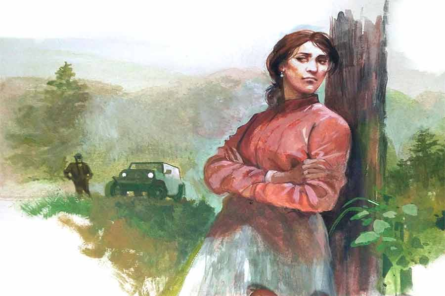

 
 <h1 align=center>দেবী শিখরিণী</h1>
<h2 align=center>সেবন্তী ঘোষ</h2> 

চার নম্বর সেকশনে আগুন ধরেছে। শীতের শেষে প্রায় ঘুমন্ত বাগানের আশপাশে জড়ো হওয়া পাতায় কেউ বিড়ি সিগারেটের অবশিষ্টাংশ ফেলে গেলেই এই কাণ্ড ঘটে। বিশেষ করে গত বছর সেই যে অক্টোবরে বৃষ্টি হয়েছিল, আশ্চর্য ভাবে তার পর এই ফেব্রুয়ারি অবধি ছিটেফোঁটা জলও ঝরেনি। চা-গাছের জন্যে এ একেবারে অশনি সঙ্কেত।

শিখরিণী বিষণ্ণ মুখে বলল, “হবে না কেন? হাইওয়ের জন্য দশ হাজার গাছ কেটে ফেলা হয়েছে। বদলে এক হাজার গাছও লাগানো হয়নি। লাগাবে কোথায়? সব জায়গায় মানুষ আর উন্নয়ন।”

অতীন প্রথম দিনই চমকে গেছিল শিখরিণী নামটা শুনে। এখন ওর মুখে উন্নয়ন-বিরোধী কথা শুনে আবারও খানিক অবাক হল, কিন্তু বাইরে প্রকাশ করল না। আজ গাড়িতে যেতে যেতে বলল, “আপনার ঠাকুরমা নিশ্চয়ই শরদিন্দু-ভক্ত?”

শিখরিণী চোখ কপালে তুলে বলেছিল, “বাগানের ম্যানেজারও শরদিন্দু পড়েন নাকি?”

অতীন হেসে বলে, “ম্যাডাম, আমি সীমান্তের গ্রাম মৌয়ামারির হরসুন্দরী বিদ্যানিকেতনের ছাত্র। আপনার মতো হোলি ক্রস কনভেন্ট নয়। আমাদের ওখানে এখনও লাইব্রেরির কদর আছে।”

শিখরিণী মৃদু হাসি ঝুলিয়ে রেখে বলে, “কেউ প্রোফাইল চেক আর স্টক করলে এই ভাবে ঝপ করে বলে দেয় নাকি? আপনার স্কুলের নাম অবশ্য দেওয়া নেই।”

অতীন ছদ্ম-বিষণ্ণতায় বলে, “কী করব ম্যাম, অমন একটা স্কুলের নাম নিয়ে প্রাইভেট কোম্পানিতে অ্যাপ্লাই করা খুব কঠিন।”

শিখরিণীর চুল একেবারেই আঁচড়ানো নেই। মুখের উপর‌ থেকে চুল সরাতে সরাতে বলে, “স্কুলের নামটা তো বলে ফেললেন। এখনও চাকরি পার্মানেন্ট হয়নি কিন্তু।”

আগুন লাগার খবরে অতীন গাড়ি বার করতেই শতকপ্রাচীন বাংলোর অযত্নের লনে, গার্ডেন চেয়ারে বসে থাকা শিখরিণী প্রায় দৌড়ে এসেছিল। বলেছিল, “আমিও যাব। আগুন থামাতে উল্টো দিক থেকে আগুন দিলে, মুখোমুখি এসে নিবে যায় শুনেছিলাম। লেবার কলোনির দিকে আগুন গেলে কিন্তু সর্বনাশ। বাড়িগুলোর তো কোন মেনটেনেন্স নেই দেখে এলাম।”

অতীন শিখরিণীকে নিতে না চাইলেও হুকুম পালন করতে বাধ্য। কিন্তু শিখরিণী ড্রাইভ করতে চাইলে সে সবিনয়ে প্রত্যাখ্যান করে।

শিখরিণী তার পাশে বসেছে। মৃদু বুনো ফুলের সুঘ্রাণ আসছে। অতীন ভাবে, তার গ্রামে সেন্ট মানে চড়া গন্ধে চার পাশকে বুঝিয়ে দেওয়া যে গন্ধ মেখেছে গায়ে। নেত্রাও পারফিউম মেখে এসেছিল, কিন্তু তা-ও ছিল এর তুলনায় অনেক ঝাঁঝালো। এই স্তিমিত গন্ধে মাদকতা নেই, ঠিক যেন খাঁটি ফুলের সুবাস। তার পাশে বসা শিখরিণীর অনাবৃত আভরণহীন ঘাড়ে একটা লম্বা কাটা দাগে চোখ আটকে গেল। শিখরিণী সেটা খেয়াল করতেই চকিতে গায়ের পাতলা চাদরটা টেনে ঢেকে নিল।

অতীনের নিজের উপর রাগ হল, এই রকম একটা সঙ্কটমুহূর্তে এ সব কী দেখছে সে! মালকিন তাকে নষ্ট পুরুষ ভেবে নিল বোধহয়। জোর করে মন সরিয়ে নিয়ে গাড়ি চালাতে চালাতে সেকশন বাবুকে ফোন করা শুরু করল অতীন।

যতটা ওরা ভেবেছিল, আগুন অবশ্য সে ভাবে ছড়ায়নি। বাগানের আশপাশে, ভিতরে বেশ কিছু ঝোরা আছে। বোধহয় খুব ভোরে সেখানে কাজ সারতে গিয়ে কেউ চুটা ছুড়েছে। শিখরিণী ইন্দ্রজিৎকে ফোন করে বলছিল সে সব। ইন্দ্রজিতের গলায় ঘুমের আলস্য। সে শুধু হুঁ-হাঁ করছে।

অতীন এখনও অবধি খুব বেশি হলে কলকাতা অবধি গেছে। ইন্দ্রজিতের মতো পুরুষ সে সিরিয়াল, ওটিটিতে দেখেছে। তার শৈশবের সংস্কারে একটা পুরুষমানুষ, তার বৌ কিংবা বান্ধবীকে সব কাজে ঠেলে দিয়ে রাত অবধি মদ গিলবে আর দুপুরে উঠে চিলি চিকেন অর্ডার দেবে, ভাবতেই গা রি রি করে ওঠে তার।

ফেরার সময় দু’জনেই স্বস্তিতে। অতীন বলে, “এক বার দু’নম্বরের দিকটা দেখে আসি। ও দিকে পাতাগুলো খুব ভাল আছে। লেবাররা ও পাশটা মেনটেন করেনি, তা-ও। লোকজন কম যায়। পলিউশন কম বলে বোধহয়। আজ থেকে ও পাশটায় তদারকি হবে। আপনার আশা করি ও দিকে দেরি হচ্ছে না।”

‘ও দিকে’ শব্দটায় হালকা জোর ছিল। শিখরিণী ইঙ্গিতটা ধরে রেখেই বলে, “আমার কোথাও কোনও তাড়া নেই। চলুন, দেখে আসি।”

দিগন্তবিস্তৃত বাগানের ভিতর শেড ট্রি-র ছাতার নীচে তখন জল দেওয়ার পাইপগুলোর মুখ খুলে গেছে। ফোয়ারার মতো সাদা জলের রাশি পাতার উপরের ধুলোর পাউডার সরিয়ে রূপটানের মতো চকচকে করে দিচ্ছে। ওরা এবড়ো-খেবড়ো ভাঙা রাস্তার উপরে জিপ দাঁড় করিয়ে কাজ দেখতে থাকে।

বহু দিন বাদে কল চালু হয়েছে। কলের মুখ বৃত্তাকারে ঘুরছে। জল ঠিকরে পড়তেই আজব কাণ্ড ঘটে গেল। দু’পাশের চা-বাগিচার মধ্যে জল বয়ে যাওয়ার যে নালা কাটা থাকে, বর্ষাকাল বাদে চিতাবাঘের প্রিয় আস্তানা সেগুলি। ঘুরন্ত কলের মুখ এত দিনের অব্যবহৃত নালার দিকে খানিকটা জল ছেটাতেই হলুদ ফিতের মতো বিদ্যুতের গতিতে একটা চিতাবাঘ এক পাশ থেকে আর এক পাশে লাফ দিয়ে পড়ে। হুডখোলা জিপে মুহূর্তে অতীন সজোরে শিখরিণীর হাত চেপে ধরে। সেই হলুদ কালো শরীর লম্বা আর একটা লাফ দিয়ে বাগানের ভিতর অদৃশ্য হয়ে যায়। খানিক দূরে শ্রমিকদের মধ্যে জোর হল্লা ওঠে।

মুহূর্তকাল আগে আগুন লাগার ঘটনার অভিঘাত শেষ হয়নি, আবার চোখের সামনে চিতাবাঘ! অতীনের সব তালগোল পাকিয়ে যায়। কিন্তু এ তার চাকরিস্থল, এ ভাবে বিচলিত হয়ে পড়া ঠিক হল না। নিজে সে প্রথম বার দেখছে, কিন্তু চিতাবাঘ, হাতি এ পাশের চা-বাগানে প্রায়ই আসে যায়। সে দেখে, শিখরিণী অদ্ভুত ভাবে তার দিকে তাকিয়ে আছে। তার পর সেই দৃষ্টি মুছে অতীনের হাতটা ছাড়িয়ে নেয় সে। অতীনের মনে হয়, তার ছোটবেলার বন্ধুদের বা মায়ের মতো, শিখরিণীও তাকে ভিতু ভেবে নিল।

অতীন আর চোখ তুলতে পারে না। সে কী করে ভুলে যাচ্ছিল শিখরিণী এই বাগানের মালিক! সে তার অধীনস্থ কর্মচারী মাত্র। এক বার ঘাড়ের দিকে অমন কুদৃষ্টি দিয়েছে, এ বার হাত ধরে ফেলল। সে কী বলবে বুঝতে না পেরে অস্ফুট গলায় বলে, “ম্যাডাম, তাড়াতাড়ি যেতে হবে। আপনাকে নামিয়ে দিয়ে আমি একটু গাড়িটা নেব। মা আসবে আমার।”

*****

নতুন প্রুনিং মেশিন নিয়ে এসেছে ওরা। ওরা মানে শিখরিণী আর ওর পার্টনার ইন্দ্রজিৎ। সে শুধু ব্যবসার পার্টনার নয়, তারও বেশি। ইন্টারভিউয়ের দিন ইন্দ্রজিতের তির্যক বাক্যবাণ এখনও মনে আছে অতীনের। মনে মনে গালি দেয় সে। শালা, মাইনের বেলায় নিয়ম মানো না, ধুঁকতে থাকা বাগান অধিগ্রহণ করে শ্রমিক বাঁচানো হচ্ছে ইত্যাদি সেন্টি দিয়ে কম টাকায় লোক নিচ্ছ! অতীন গ্রামের ছেলে হতে পারে, কিন্তু ‘টি অ্যান্ড টুরিজ়ম ম্যানেজমেন্ট’-এর কোর্স করা আছে তার। তার মতো যোগ্যতা নিয়ে এত কম টাকায় কে মরতে আসবে এই প্রত্যন্ত এলাকায়? এমন মনে হয় বটে, কিন্তু চাকরির বাজার খুব খারাপ সেটাও সে বোঝে।

ইন্দ্রজিতের বাঁকা বাঁকা প্রশ্নকে থামিয়ে শিখরিণী বলেছিল, “আপনার শিক্ষাগত যোগ্যতা আর দক্ষতা আছে। কিন্তু অভিজ্ঞতা সে ভাবে নেই বললেই চলে। স্টার্ট-আপের মতো কাজ শুরু করুন। লাভ হলে আমাদের উভয় পক্ষের।”

অতীন অর্থবান শিখরিণীর মুখে চোখে এক রকম দৃঢ়তা দেখেছিল। ওদের গ্রাম-মফস্সলের খাটিয়ে মেয়েদের মধ্যে এমনটা দেখা যায়। খবরের কাগজে বিজ্ঞাপন দেখে এই ইন্টারভিউ দিতে এসেছিল অতীন। আসার আগে শিখরিণীর প্রোফাইল চেক করেছিল। সম্পর্কের স্টেটাসে লেখা ছিল, জটিল। অতীন শৈশবে‌ বাবাকে হারিয়েছে। কিন্তু বাবার একটা কথা মাথায় গেঁথে থেকেছে। বাবা বলেছিল, “কঠিন কাজ করার আনন্দ আলাদা। জটিলের জট ছাড়াতে পারলেই সাফল্যের আরাম পাওয়া যায়।”

অতীন বাগানে যোগ দেওয়ার পর সেই যে দু’মাস বাদে শিখরিণী এসেছিল, তার পর আবার এই মাস ছয়েক পর আসা। মাঝখানে কাজকর্মের দরকারে যোগাযোগ রেখেছে অতীন, কিন্তু এ বার হাত ধরে ফেলার পর শিখরিণীর কঠোর মুখ সে মন থেকে মুছতে পারেনি।

বৃষ্টি নেমে গেছে। আশপাশে জঙ্গল বলে চিতাবাঘের জন্য খাঁচা পেতে লাভ হয়নি। বাংলোর নীচে পাহাড়ের একেবারে খাদের দিকে নদী, ভুটান পাহাড়। কোথায় চলে গেছে কে জানে। অন্য দিকে অতীন বাগানের নানা কাজে এত চরকিপাক খেয়েছে যে, বলতে গেলে ওর মাথায় আর মালিক পক্ষের ব্যক্তিগত জটিলতার বিষয়টি চেপে বসেনি। ফরেস্ট ডিপার্টমেন্টের সঙ্গে চা-বাগানের জমি-জরিপ সংক্রান্ত একটা কাজে দু’দিনের জন্যে জলপাইগুড়ি গেছিল। ফিরে এসেই মায়ের মুখে শুনল, আগের দিনই মালিক-মালকিন এসেছে। শিখরিণী নিজে এসে খানিক বসেছিল। মায়ের সঙ্গে গল্প করেছে আর বলে গেছে, অতীন ফিরেই যেন কাগজপত্র নিয়ে দেখা করে। অতীন অবশ্য সন্ধের দিকে ফিরে সে দিন আর দেখা করতে যায়নি।

বেশ রাত অবধি বড় বাংলোর দোতলার ঘর থেকে উচ্চকিত গানের আওয়াজ, ঝগড়াঝাঁটির মতো জোরে কথাবার্তা ভেসে আসছে। তার এত চেঁচামেচি গোলমাল ভাল লাগে না। শুয়ে শুয়ে ভাবে, ধীরে ধীরে কারখানাটাও হয়তো খুলবে। নিশ্চয়ই মাইনে বাড়বে। মায়ের ইচ্ছে, এ বারে থিতু হোক অতীন। মায়ের পছন্দের মেয়ে নেত্রা এখান থেকে এক ঘণ্টার দূরত্বে একটা প্রাইমারি স্কুলে পড়ায়। এখানে যোগ দেওয়ার আগেই এক বার দেখা করেছিল অতীন। হাসিখুশি নেত্রাকে নিয়ে ভবিষ্যৎ খানিকটা ভাবাই যায়। তবে আপাতত বছরখানেক বাগান চাঙ্গা করতে হবে।

সকাল হতেই অতীন ফাইলপত্র নিয়ে শিখরিণীর সামনে পৌঁছয়। অনুচ্চ পাহাড় এলাকায় দিনের বেলায় বেশ ভ্যাপসা গরম থাকে। শিখরিণী সেই গার্ডেন চেয়ারে একা বসে আছে। তার বাংলো সংলগ্ন বিবর্ণ জায়গাটার গায়ে এই ছ’মাসে গত্তি লেগেছে। টবে রংবাহারি আলো-মাখা ফুল ঝলমল করছে। শিখরিণী ওর দিকে তাকিয়ে হাসে। বসতে বলে। আভরণহীন নির্মেদ চেহারা। সে রকমই এলোমেলো চুল। অচিনের হঠাৎ মনে হয়, একটা চিরুনি পেলে সে যত্ন করে চুলটা আঁচড়ে দিত। ভাবতে গিয়ে নিজেই অবাক হয়ে যায়। সত্যি বলতে এত দিন তার শিখরিণীর কথা সে ভাবে মনেই পড়েনি। আজ সামনে বসে মনে মনে এমন আদিখ্যেতা কেন! ‍সে ভাবে, নেত্রার কথা এক বার বলবে কি না। বিয়ে করার কথা বললে হয়তো মাইনে বাড়তে পারে। কিন্তু শিখরিণীর সামনে এলেই তার ব্যক্তিত্ব কেমন এলোমেলো হয়ে যায়। হঠাৎ মনে হয়, অনেক দিন সে চার পাশ না দেখে ঘোড়ার মতো দৌড়চ্ছে। বাগানটা যাদের, তাদের তরফে নিয়মিত খোঁজখবর অবধি নেওয়ার ব্যাপার নেই। পরমুহূর্তেই শিখরিণীর উচ্চস্বরে সংবিৎ ফেরে। ইস! সে মোটেই ঘোড়া নয়, গাধা। গাধাই! না হলে মালকিনের সামনে এসে সে এমন অন্যমনস্ক হয়ে যায় কী করে?

শুনতে পায় শিখরিণী বেশ জোরগলায় বলছে, “হলটা কী? আপনার মতো এমন ভাবুক লোক কাজ করে কী করে? শুনতে পাচ্ছেন? চলুন। উঠুন। কাগজপত্র এখন থাক। বাগান দেখে আসি।”

দ্রুত গাড়ি বার করে অতীন। আজ হাটবার। দেশি মুরগি আনবে ভেবে রেখেছিল, এই মেজাজি মহিলার চক্করে হবে বলে মনে হচ্ছে না।

আজ আর ম্যানেজারের কথা শোনে না মালকিন। স্টিয়ারিংয়ে হাত রাখে। গম্ভীর গলায় বলে, “অত কনফিউজ়ড লোককে আমি ড্রাইভ করতে দিই না।”

অতীন শঙ্কিত হয়। শিখরিণী প্রথম প্রজন্মের বাগান মালিক। এখানে শ্রেণিবৈষম্য এখনও প্রবল। সম্ভবত সে বিষয়ে খবর রাখে না সে। মালিক গাড়ি চালাচ্ছে, ম্যানেজার পাশে বসে আছে, তায় মালিক নয়, মালকিন! শ্রমিক লাইন অবধি খবর পৌঁছে যাবে। অতীন দিনরাত অনেক খাটুনি দিয়েছে, অপমানিত হয়ে বিদায় নেবে না সে। শিখরিণী দু’দিন থেকে ফিরে যাবে। সে পড়বে বিপদে।

অতীন মরিয়া হয়ে সাহস সঞ্চয় করে। দেখে, ডান পাশে বসা শিখরিণীর উন্মুক্ত ঘাড় থেকে গ্রীবায় বাঘের ট্যাটু। এটা সম্ভবত নতুন। সে মুখে বলে, “স্যর আজও এলেন না? আগের বারও ভাল করে দেখেননি।”

খোয়া-ওঠা রাস্তায় ঝাঁকি মারতে মারতে শিখরিণী বলে, “আপনার কাছে মালিক এক জনই। সেটা স্যর নয়, ম্যাডাম।”

অতীন খেয়াল করে, গত বারে দেখা ঘাড়ের ক্ষতটি প্রায় মিলিয়ে গেছে। এ বারে সেখানে বাঘের শ্বদন্ত।

সে খানিক উৎফুল্ল গলায় বলে, “তা-ও তো সঙ্গে বয়ে নিয়ে এসেছেন। শরদিন্দুর রানি শিখরিণী কিন্তু কারও পরোয়া করতেন না।”

শিখরিণী বিরক্ত মুখে ফোনের দিকে তাকিয়ে বলে, “জিপিএস কাজ করছে না। দেখছেন তো? কোন দিকে ঢুকব বলছেন না কেন আগে থেকে? আর ওই যে স্টাফরা খবর দিচ্ছে সবাই খুশি, রেভিনিউ বাড়ছে। আপনি তো দেখছি তেমনই আনস্মার্ট আর অন্যমনস্ক থেকে গেছেন।”

অতীন আজ কিছুতেই বাঘকে নিজের ঘাড়ে চাপতে দেবে না। আড়চোখে দেখে, গ্রীবার ডোরাকাটা বাঘের ত্বকে হিল্লোল খেলে যাচ্ছে।

সে বিনয়ের ভঙ্গিতে বলে, “আমি নেহাতই কর্মচারী। মালকিনের তো নিজের এলাকা বিষয়ে আমার চেয়ে বেশি জ্ঞান থাকা উচিত। আমি আজ আছি কাল নেই...” বলে সে ডান দিকে ঢোকার পথ নির্দেশ করে‌।

শিখরিণী ভ্রু কুঁচকে বলে, “মানে! আপনি এখান থেকে পালাবার তাল করছেন নাকি?”

অতীন উদাস গলায় বলে, “এত ক্ষণে চতুর্দিকে রাষ্ট্র হয়ে গেছে, মালিক গাড়ি চালাচ্ছেন আর ম্যানেজার পাশে বসে। চাকরিটা স্যরই খেয়ে নেবেন ম্যাডাম।”

শিখরিণী শ্বাস ফেলে বলে, “সে দিন আর নেই অতীন। তা ছাড়া আপনার চাকরি খাওয়ার ক্ষমতা ওর হবে না। ওই শেয়ারটা আমি কিনে নিয়েছি। এই জন্যই এত দিন বাদে এলাম। লোন হয়েছে প্রচুর।”

গাড়ি তত ক্ষণে সেই দু’নম্বর সেকশনে পৌঁছে গেছে। খানিক পরেই গাছে জল দেওয়া শুরু হবে। শিখরিণী দু’হাত উঁচু করে চুলগুলো খোঁপা করে। অতীন দেখে, তার কোলে ফেলে রাখা স্কার্ফ ড্রাইভার-সিটের নীচে ঝুলছে। অতীন শিখরিণীর দৃষ্টির সামনেই ঝুঁকে সেটি তুলে ভাঁজ করে সিটের পিছনে রাখে। শিখরিণী এই কাজটা মন দিয়ে লক্ষ করে।

আচমকাই পাইপগুলো ঘুরে ঘুরে বহু দূর অবধি জল ছেটাতে শুরু করে। শেড-ট্রির ফাঁক দিয়ে আসা হলুদ আলো-মাখা পাতায় জল ঠিকরে যায়। পাতা ও মাটি ভেজার অপূর্ব সুঘ্রাণ চার পাশে। ওদের অবাক করে দিয়ে এক জোড়া ময়ূর-ময়ূরী ডানা ঝাপটে এ পাশ থেকে ও পাশে উড়ে যায়। দু’জনেই চমকে উঠে পরস্পরের দিকে তাকিয়ে হেসে ফেলে।

হাটে গিয়ে বালিকার মতো ছোটাছুটি করে শিখরিণী। অতীন দিশি মুরগি, বুনো ঝাল চৈ লতা, সঙ্গে একটা কাঠের কাঁকই কেনে। শিখরিণী দরদাম করে কেনে গালার চুড়ি, বোরোলি আর পাথরচাটা মাছ। ফেরার পথে গাড়ি চালায় অতীন।

শিখরিণী তার চুড়ো করা চুল হাওয়ায় উড়িয়ে দেয়। বলে, “আপনার মায়ের কাছে শুনলাম নেত্রার কথা। কাঠের চিরুনিটা ওর জন্য কিনলেন তো?”

অতীন বিস্ময়ের ভাব দেখায় না। বলে, “না না, ও খুব পরিপাটি করে চুল বাঁধে। এটা আর এক জনের জন্য নিলাম। যে সব কিছু পারে, কিন্তু চুল বাঁধতে ভুলে যায়।”

অতীন এটা বলে ফেলার পর ভাবে, এই বুঝি বাঁ দিক থেকে বাঘের ট্যাটু তার গায়ে ঝাঁপিয়ে পড়ল! কিন্তু তার বদলে সে টের পায়, এক জোড়া চোখ গভীর বিস্ময়, অনুচ্চারিত প্রশ্ন নিয়ে তাকিয়ে আছে তার দিকে।

অতীনের ঠোঁটে মৃদু হাসি, যেন নীরবে সে-ও বলছে, ‘সব সম্পর্কের নাম খুঁজতে নেই শিখরিণী...’

