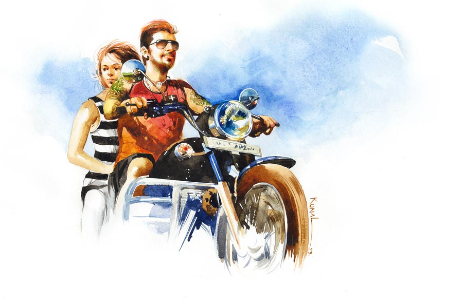

 
 <h1 align=center>ধবল আলোকে</h1>
<h2 align=center>তপতী মৈত্র</h2> মেসোমশাই, আজ সোনাইদিদির পার্লারে গিয়েছিলাম।”

সোনাইয়ের নাম শুনে বিশ্বাসবাবুর অন্তরটা মুচড়ে উঠল। মুখে বললেন, “ও। কী বলল?”

“ওর পার্লারে একটা কাজ পেয়েছি গো। শুক্কুর, শনি, রবি। কত বড় পার্লার।”

“কেমন চলছে তার পার্লার?”

“দারুণ গো! কত লোক আসে। আমিও তাড়াতাড়ি কাজ শিখে মেকআপ, ভুরু প্লাক, হেয়ার কী যেন— ওই যে স্প্রে করে, কালার করে... ওইগুলো পারব। পাশেই তো দাদাবাবুর ট্যাটুশপ। নামটাও খুব সুন্দর। ‘সুচ-তুলি ট্যাটু শপ’। কত লোক আসে ট্যাটু করাতে, তুমি ভাবতেও পারবে না। সবাই বলে দাদাবাবুর হাতের কাজ খুব ভাল। দাদাবাবু খুব নাম করেছে।”

“হুম। তা তুমি ওই ছবি আঁকার ধিঙ্গিপনা শিখবে না?” কথাটা বলেই বিশ্বাসবাবু বুঝতে পারলেন ভাল শোনাল না, ব্যাপারটা ম্যানেজ করার জন্য বললেন, “ওই তোমাদের ট্যাটু।”

টুম্পা কাজের মেয়ে। উত্তরে বেশ সপ্রতিভ হয়েই বলল, “ওটাও তো একটা শিল্প। যেমন যুগের যেমন শিল্প। দেখো না তুমি ইন্টারনেটে?”

“শিল্প? হুঁ, ধাস্টামোর শিল্প!” বিড়বিড় করে উঠলেন বিশ্বাসবাবু।

বেশ কয়েক মাস হল টুম্পা কাজ করছে সোনাইয়ের পার্লারে। শ্যাম্পু, হেয়ার ডাই, আই-ব্রাউ প্লাক বেশ শিখে নিয়েছে। বাড়ি বাড়ি রান্না, আর সপ্তাহে তিন দিন পার্লার। ওর সংসার ভালই চলছে। কিন্তু বিশ্বাসবাবুর মন কিছুতেই মানতে পারছে না। স্ত্রী মারা গেছেন বেশ কয়েক বছর। বাবা-মেয়ের সম্পর্কের দূরত্ব যে এতটা, মা থাকতে কেউই বোঝেননি।

জেনারেশন বদলেছে। বদলেছে শখ। বাবা জানেনও না মেয়ে কবে বিউটিশিয়ান কোর্স করেছে, নিজে একটা পার্লার খুলতেও চায়। আপত্তি তুললেন, যখন জানতে পারলেন মেয়ের বয়ফ্রেন্ড ট্যাটু আর্টিস্ট। বিউটিশিয়ান কোর্স করতে গিয়ে সোনাইয়ের সঙ্গে ছেলেটার আলাপ। আর সেই থেকে প্রেম। বিশ্বাসবাবু জানতেও পারেননি। এক দিন দেখলেন মেয়ের শরীরের নানা জায়গায় ছাইপাঁশ আঁকিবুকি। বিশ্বাসবাবু রেগে ফায়ার। 

কিন্তু জল গড়িয়ে গেছে অনেক দূর। মেয়েও নাছোড়বান্দা। সেও গম্ভীর মুখে বলল, “বাবা, নতুন ট্রেন্ডকে গ্রহণ করতে শেখো। তোমার সেই আদ্যিকালের মানসিকতা বদলাও। ফ্যাশন দুনিয়ায় ট্যাটুর জায়গা এখন আলাদা। চিন্তাধারা পাল্টালে তোমারই সুবিধে।”

দিনে দিনে ঝগড়া তুমুল হয়ে উঠল। কী আস্পর্ধা মেয়ের! নাকের ডগা দিয়ে ড্যাংড্যাং করে চলে গেল বয়ফ্রেন্ডের হাত ধরে। ওটা বয়ফ্রেন্ড? ছিঃ! কী সাজগোজ! কানে দুল, মাথায় লাল হলুদ চুল, ভুরুতে রিং রিং গাঁথা, চোখা স্পাইক, গলায় কঙ্কালের লকেট, গা ভর্তি ট্যাটু, হাতকাটা গেঞ্জি, ছেঁড়া জিন্সের বারমুডা— ছিঃ ছিঃ! প্রবল বেগে বাইক চালিয়ে বেরিয়ে গেল ওরা। মুর্মু না কি সারনেম যেন ছেলেটার। নাম মনে নেই। মনে রাখতেও চাননি।

সেই থেকে এই ঘটনা ভুলতেও পারেন না, ক্ষমাও করতে পারেন না। খুব মনে পড়লেও ইগো এসে দাঁড়ায় মাঝে। শুনেছেন, ওরা বিয়ে করেছে। ভাল আছে। ভালই চলছে ব্যবসা। এক দিকে মেয়ের পার্লার, অন্য দিকে ট্যাটু শপ।

ট্যাটুওয়ালা ছেলেটাই বজ্জাত। ভাবলেই গা ঘিনঘিন করে। লজ্জায়, ঘেন্নায় মনটা বিষিয়ে ওঠে। “...আমি ওকে কোনও দিন জামাই হিসেবে মানব না। সোনাই, এ তুই কী করলি।”

বাইরে খুব বৃষ্টি হচ্ছে। শনশনে হাওয়া। আজ অনেক দিন পরে একাকিত্বটা জাঁকিয়ে বসেছে বিশ্বাসবাবুর। মাথায় পাক খেয়ে চলেছে সেই ক’টি কথা— “ওটাও তো একটা শিল্প। যেমন যুগের যেমন শিল্প। দেখো না তুমি ইন্টারনেটে?”

তীব্র ঘৃণাও মনে যেমন কৌতূহলের সৃষ্টি করে, সেই কারণেই গুগলটা সার্চ করে দেখতে লাগলেন একের পর এক ট্যাটু। দেখতে দেখতে চমকে উঠলেন তিনি! এক নতুন দুনিয়া যেন! উত্তেজনায় সোজা হয়ে বসলেন বিশ্বাসবাবু। কী অদ্ভুত সব ছবি! কী নিদারুণ আর্ট! অসাধারণ ডিজ়াইন! ভগবান থেকে যৌনতা— কী নেই! একটা ভিডিয়ো পেলেন, লেখা আছে মেমরি ট্যাটু। এক মা তার হারানো মেয়ের শোকে পেটে একটা বাচ্চার ছবি ট্যাটু করেছে। সঙ্গে লেখা— ‘ইউ উইল অলওয়েজ় রিমেন ইন মাই উম্ব’। ‘পেটের মেয়ে তুই পেটেই থাকবি’ বাংলায় বলে উঠলেন বিশ্বাসবাবু। আবেগপ্রবণ হয়ে পড়ছেন ধীরে ধীরে।

তিন বন্ধু। তিন জনেই প্রৌঢ়। হাসতে হাসতে হাতে ট্যাটু করছে। লেখা ‘চিয়ার্স’! আর বিয়ারের কাপ। লোকগুলো তো ওঁরই বয়সি। অথচ কেমন সহজ ভাবে মেনে নিয়েছে এই নিউ জেন আর্ট। সত্যিই তো, এ-ও একটা শিল্প। অথচ এই করেই তো কত মানুষের পেট চলছে। কত পরিবার বেঁচে আছে। মনে প্রবল ভাঙচুর চলছে বিশ্বাস আর অবিশ্বাসের। মনের একটা অংশ বলছে, ‘ভালই তো! মানুষ তার নিজের শরীরে কিছু চিরস্থায়ী স্টেটমেন্ট বহন করতে চাইলে ক্ষতি কী!’ মনের অপর অংশ বলছে, ‘মেয়ের মায়ায় পড়ে নিজের ধ্যানধারণার সঙ্গে আপস করছ না তো!’

একটা ট্যাটু দেখে বিশ্বাসবাবু শিউরে উঠলেন। একটা নেড়ামাথা লোক কুঠার দিয়ে কেটে ফেলছে মাথার পোকা ধরা শিকড়— থ্রিডি আর্ট। যেন বলছে, গোঁড়া মনের ঘুণ-ধরা দেওয়াল ভেঙে দাও। পচা মাথায় কুঠারাঘাত করো। কেটে ফেলো, ছিন্ন করে দাও সেই বন্ধন যা নিষ্ফল। ছিন্ন করার এই সংঘর্ষ চিরকালের। কী রাখব, কী ছাড়ব! এই কুঠারাঘাত সংশোধনের— অসত্য থেকে সত্যকে মুক্ত করার।

বিয়ের অ্যালবামটা বার করলেন বিশ্বাসবাবু। হাতে উঠে এল নমিতা দেবীর এক রাশ সেলাই। নিজের নামের আদ্যক্ষর দেওয়া রুমাল, মেয়ের নাম লেখা সোয়েটার, স্বামীর নামে বালিশের ওয়াড়। এও তো ট্যাটু। কোনওটা গায়ে, কোনওটা পোশাকে।

“হ্যালো...” বাবার নম্বর দেখে গম্ভীর গলায় ফোন ধরল সোনাই।

“ভাবছি, অ্যাপয়েন্টমেন্ট নেব।”

“সে কী! কী হয়েছে তোমার। কোন ডাক্তারের অ্যাপয়েন্টমেন্ট?”

সোনাইয়ের উদ্বেগ মেশানো কণ্ঠস্বর শুনে বিশ্বাসবাবুর মনটা আনন্দে ভরে গেল। অভিমান করে দূরে সরে আছে, কিন্তু ভিতরে ভিতরে বাবাকে নিয়ে যে চিন্তা করে, বুঝতে পারলেন। সোনাইও অভিমান ছেড়ে কাছে এগিয়ে আসতে পারছে না। সেও বাবাকে তেমনই ভালবাসে।

বার বার “হ্যালো, হ্যালো” ডাকে সংবিৎ ফিরে এল। হেসে বললেন, “ভয় পাস না। ডাক্তারের নয়, তোর বরের আ্যপয়েন্টমেন্ট নেব। একটা মেমরি ট্যাটু করাব।”

উচ্ছ্বাসের সঙ্গে সোনাই বলল, “কী বলছ বাবা? সত্যি তুমি...”

কথা শেষ করতে পারল না। বাবা বুঝতে পারল, এত দিনের অভিমান কান্না হয়ে ঝরছে।

বিশ্বাসবাবু বললেন, “সোনাই, মানসিকতা পাল্টে ফেলেছি। নতুন সময়কে স্বাগত জানাতে চাই, তাই যাব জামাইয়ের পার্লারে।”

ট্যাটু শপের সামনে গিয়ে দাঁড়ালেন বিশ্বাসবাবু। ‘সুচ-তুলি ট্যাটু শপ’। মনে মনে তারিফ করলেন নামটার। অনেকের হাতেই ওর আঁকা ট্যাটু দেখতে পেলেন।

ছেলেটার আঁকার হাত দারুণ। শুধু ট্যাটু নয়, ওর আঁকা নিয়ে সামনে এগজ়িবিশনও আছে। এই বাজারে জমিয়ে পার্লার চালাচ্ছে, আরও দু’-তিনটে ছেলে কাজও করছে এখানে, মানে লোককে চাকরিও দিচ্ছে— এ তো গর্বের ব্যাপার। আলাপ হয়েও বেশ ভাল লাগল।

বিশ্বাসবাবু জিজ্ঞেস করলেন, “এত প্রফেশন থাকতে ট্যাটু কেন? শুনেছি লেখাপড়ায় ভাল ছিলে?”

ছেলেটা বিনীত স্বরে বলল, “ছোটবেলা থেকেই বাবা-কাকাকে দেখেছি মানুষের হাতে, শরীরে উল্কি করতে। বলতে পারেন, এটাই ছিল বাবা-কাকার রুজি-রোজগার। হাটে-বাজারে নানা রকম মেলায় বাবারা মানুষের হাতে, শরীরে উল্কি করে দিত। সবাই খুশি হত, কিন্তু সে ভাবে সম্মান পেত না তারা। অবহেলিতই ছিল। আমার রক্তেও সেই গুণ এল। যদিও তাদের কাছে আমি কখনও শিখিনি এ সব। আমার মায়ের আঁকার হাত খুব ভাল ছিল। সারা বাড়িঘর, উঠোন, দরজা, জানলা আলপনা এঁকে ভরিয়ে রাখত। মায়ের সঙ্গে থেকে থেকে আঁকাটা রপ্ত করেছিলাম। তার পর পড়াশোনা শেষ করে শহরে আসি উচ্চশিক্ষার জন্য। বাবা বলেছিল, ‘তোকে পড়াশোনা করে বড় হতে হবে। শিক্ষিত না হলে কেউ সম্মান করে না।’ যেটুকু জায়গাজমি ছিল বিক্রি করে শহরে পাঠাল আমাকে।

“আমরা আদিবাসী। মুর্মু। আমাদের প্রতি হেয় ভাব অনেকের মনেই কাজ করে। আমার আঁকার শুরু স্কুলের আঁকার স্যরের হাত ধরে। তিনি আমাকে খুব সাহায্য করলেন। আর্ট কলেজে চান্স পেতেও হেল্প করলেন। তিনি বুঝতে পেরেছিলেন আমার ভিতরের আঁকার ক্ষমতাটা সহজাত। তাই সন্তানস্নেহে সব সময় পাশে থেকেছেন। স্যরের ঋণ আমি কখনও শোধ করতে পারব না।”

কপালে হাতটা রাখল প্রণাম করার ভঙ্গিতে। বিশ্বাসবাবুর এই শ্রদ্ধাটা ভাল লাগল। ছেলেটার সম্বন্ধে ধারণা বদলে যাচ্ছে।

ছেলেটা আবার বলতে লাগল, “স্যরের আন্তরিকতায় এগিয়ে চললাম। এর মধ্যে উল্কির মডার্ন ফর্ম ট্যাটু এল বিশ্বের দরবারে। সবাই মেতে উঠল নতুন ট্রেন্ড নিয়ে। আমার তো রক্তে এই নেশা ছিলই, তাই খুব সহজেই শিখে নিতে পারলাম। আজ কাজের সুবাদে নাম করেছি, সম্মানও পেয়েছি। এক জন ফিল্মস্টার ভাল কাজের স্বীকৃতিস্বরূপ আমাকে একটা দামি হার প্রেজ়েন্ট করেছেন। আমার সঙ্গে ছবি তুলেছেন। বাড়িতে গিয়ে বাবা, কাকাকে সেটা দিয়ে এসেছি। তাদের অসম্মান, ক্ষোভ কিছুটা হলেও দূর করতে পেরেছি। আজ আমার জন্য তারা গ্রামের লোকদের কাছে সম্মান পাচ্ছে।”

একটু থামল ছেলেটা। তার পর বলল, “তবে আমি এতটা সাকসেস পেতাম না, যদি সোনাই আমাকে প্রথম থেকে সাপোর্ট না করত। প্রথম দিকে আমার অপটু হাতের আঁকার কাজ ওর শরীরেই চলত। ওর উৎসাহেই আমি কনফিডেন্স পেয়েছি। সব সময় পাশে থেকে সাহায্য করেছে। শত বাধাতেও আমার হাত আলগা হতে দেয়নি।”

বিশ্বাসবাবু তাকালেন মেয়ের দিকে। সোনাই বলল, “ওর আঁকার স্যরের মতো আমিও ওর এই স্পার্কটা বুঝতে পেরেছিলাম। এক দিন ও ঠিক নাম করবে। টাকার অভাবে ছবির এগজ়িবিশন করতে পারত না। এখন আমরা দু’জনেই নিজেদের গুছিয়ে নিতে পেরেছি। তাই খুব তাড়াতাড়ি ওর ছবির এগজ়িবিশন হবে।”

বিশ্বাস বাবু গভীর নিঃশ্বাস ছেড়ে বললেন, “আমিই বুঝতে ভুল করেছিলাম। সত্যিই তো, যে প্রফেশনের যে সাজপোশাক। এখানে তো আর স্কুলের স্যরদের মতো সাজ মানাবে না।”

দু’জনকে মন থেকে আশীর্বাদ করে বেরিয়ে এলেন রাস্তায়।

বেরিয়ে এক বন্ধুকে ফোন করে সব কিছু জানালেন। মনের ভিতরে যে গ্লানি ছিল, তাও স্বীকার করলেন। তার পর স্বগতোক্তি করলেন, “দেখ, আমাদের চোখ দিয়ে সব কিছু দেখে সিদ্ধান্ত নেওয়া যে কত বড় ভুল, তা বুঝতে পেরেছি। এই ইয়ং ছেলেমেয়েদের মধ্যে এগিয়ে যাওয়ার জন্য যে চিন্তাভাবনা, ধ্যানধারণা আছে তাকে আমরা বাঁকা চোখে দেখি। বাইরের চাকচিক্য, সাজপোশাক দিয়েই সব বিচার করি। সেটা যে ঠিক নয়, তা বোধগম্য হল এত দিনে। সোনাই ভুল করেনি রে। ওর সুখী মুখটাই সেই বার্তা জানিয়েছে।”

বন্ধু বললেন, “দারুণ খবর। আমারও খুব খারাপ লাগত তোকে দেখে। শেষ বয়সে তুই বড় একা হয়ে গিয়েছিলি রে মনোতোষ। মনোমালিন্য মিটে যাওয়ায় খুব খুশি হয়েছি। আমিও যাব জামাইবাবাজির কাছে নিজের হাতের কব্জিতে, নতুন জমানার নিশান আঁকতে।”

বিশ্বাসবাবু খুশি হয়ে বললেন, “সামনেই জামাইয়ের ছবির এগজ়িবিশন। আমি তোকে নিয়ে গিয়ে আলাপ করিয়ে দেব।”

বন্ধু হেসে বলল, “শুধু আলাপে চিঁড়ে ভিজবে না, জমাটি খাওয়ার ব্যবস্থা চাই।”

দুই প্রান্তে হাসির তুফান উঠল।

“বাই দ্য বাই, জামাই-এর নামটি যেন কী?”

ধুবল মুর্মু। গ্রামের দুধেল সাদা গাই ধুবলির পাশেই ওর মা ওকে প্রসব করে। তাই ভালবেসে নাম রাখে ধুবল। ধবল থেকে ধুবল। আজ বিশ্বাসবাবুর মনের অন্ধকার ধবল আলোয় সাফ হয়ে গেছে। বোধশক্তি পরিষ্কার হয়ে গেছে।বাড়ি ফিরে হাতের কব্জিতে সদ্য করা ট্যাটুটা দেখে মন আনন্দে ভরে গেল বিশ্বাসবাবুর। মেমরি‌ ট্যাটু— একটা বাড়ির ছবি। সামনে ছোট্ট মেয়ের সাইকেল... আর বাগানের উপর সূর্য উঠছে।