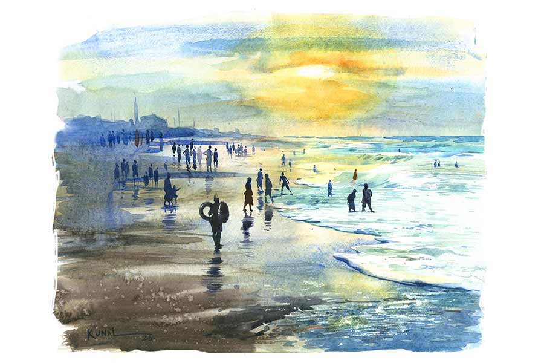

 
 <h1 align=center>নকুল নুলিয়া</h1>
<h2 align=center>বিনতা রায়চৌধুরী</h2> ঢেউয়েই জীবন, ঢেউয়েই মরণ। এর বাইরে আর পৃথিবী নেই আমাদের। কথাটা চক্রধর নুলিয়া বলত। যাকে পুরীর সমুদ্রসৈকতে চেনে না এমন লোক নেই। সমুদ্রের সঙ্গে চক্রধরের সম্পর্ক ছিল অসাধারণ। ঢেউয়ের মাথায় উঠে নাচত, যেন নাগরদোলায় চেপেছে। আসলে সমুদ্রকে ভালবাসত চক্রধর। নুলিয়া সে শুধু জীবিকার টানে নয়, সমুদ্রের টানেও।

দুই ছেলে চক্রধরের। সহদেব আর নকুল। ছোট থেকেই সে ছেলেদুটোকে নুলিয়া হওয়ার শিক্ষা দিতে শুরু করেছিল। চক্রধরের বৌ কৌশল্যা ক্ষীণ আপত্তি করেছিল। ওরাও নুলিয়া হবে, সেটা চায়নি। লেখাপড়া শিখে অন্য রকম জীবন পাক, তাই চেয়েছিল। চক্রধর এক ফুঁয়ে উড়িয়ে দিয়েছিল বৌয়ের বাসনা। নুলিয়ার ছেলে নুলিয়া হবে না তো কী? লেখাপড়া শিখতে চায় শিখুক, কিন্তু ওদের আসল জায়গা সমুদ্র। ঢেউ-বালি-জল মাখামাখি করে জীবনের রস ও রং যেন শুষে নিতে পারে।

এক দিন সমুদ্রের পাড় থেকে একটা বছর দশেকের বাঙালি মেয়েকে কুড়িয়ে নিয়ে এল চক্রধর। সমুদ্রসৈকতে বসে কাঁদছিল। বলছে, সে বাবা-মায়ের সঙ্গে এসেছে, কিন্তু তাদের কোথাও খুঁজে পাওয়া যায়নি।

কৌশল্যার খুব মেয়ের শখ ছিল। সে সাদরে মেয়েটাকে বুকে টেনে নিল। তার নাম রাখল সাগরী। ধীরে ধীরে জানা গেল সাগরী পড়াশোনা জানে। সে নাকি স্কুলে যেত। এখানেও স্কুলে যাওয়ার বায়না ধরল। সহদেব আর স্কুলে যাবে না, সাফ জানিয়ে দিল। সে সাগরীকে সহ্য করতে পারে না। উটকো মেয়েটা তাদের সংসারে উড়ে এসে জুড়ে বসেছে, মায়ের আদর পাচ্ছে। তখন নকুলের সঙ্গে সাগরী স্কুল যেতে শুরু করল, ভাব হয়ে গেল দু’জনের। তবে নকুল স্কুলছুট হয়ে গেল ক’দিন পরেই।

*****

সহদেব আঠারো ছুঁতে না ছুঁতেই বেশ শক্তপোক্ত চেহারার হয়ে গেল। নুলিয়ার কাজ ধরল তাড়াতাড়িই। চক্রধর খুব খুশি। এ বার সে ঠিক করল, সাগরীর সঙ্গে সহদেবের বিয়ে দেবে। কৌশল্যাও তাই চায়। মেয়েটাকে সে মোটেই কাছছাড়া করতে চায় না। শুধু সহদেব রেগে আগুন হয়ে গেল। সোজা বলে দিল, সাগরীকে বিয়ে করার আগে জগন্নাথ যেন তাকে সমুদ্রগর্ভে টেনে নেন। আর আশ্চর্য, কী ভাবে যেন জগন্নাথদেবের কানে কথাটা পৌঁছে গিয়েছিল। দু’দিন পরেই সহদেবকে সমুদ্র টেনে নিল। বন্ধুদের সঙ্গে বাজি ধরে মাঝসমুদ্রে সাঁতার কাটতে গিয়ে আর ফিরল না।

বাড়িতে তখন দু’রকমের হাহাকার। এক, পুত্রশোক। দুই, ধর্মসঙ্কট। সাগরীর কী হবে? জ্ঞাতি-প্রতিবেশী সবাই প্রস্তুত, সহদেবের সঙ্গে ওর বিয়ে হবে এক্কেবারে ঠিক। ছেলেকে শ্মশানে আগুন দিয়ে এসেছে চক্রধর। কৌশল্যা শোকে জবুথবু। কিন্তু এখন বুকেও ওদের আগুন জ্বলছে। আর জ্বলছে কান।

কান পাতলেই ফিসফাস। এ বার সাগরীকে নিয়ে কী করবে চক্রধর? আবার সাগরের পারেই ফেলে আসবে ওকে? নাকি কোনও আত্মীয়ের বাড়ি পাঠিয়ে দেবে? তবে কে জায়গা দেবে ওই অপয়া মেয়েকে? রাতভর চক্রধর আর কৌশল্যা নিজেদের মধ্যে আলোচনা করল। তার পর সকালে উঠে সবাইকে জানাল, তাদের ছোট ছেলে নকুলের সঙ্গে সাগরীর বিয়ে দেবে তারা। প্রথমে সকলে গালে হাত দিয়ে ভাবতে বসল। তার পর রায় দিল, কথাটা মন্দ নয়। বরং এটাই সবচেয়ে ভাল সমাধান।

নকুল কথাটা শুনে অবাক হয়ে গেল। বাড়িতে সে ছোট। বাবা-দাদার ছায়াতেই কাটিয়েছে এত দিন। নুলিয়াও হয়নি এখনও। রুজি-রোজগারও নেই। তা ছাড়া সাগরী? সাগরীর সঙ্গে তার বিয়ে? এটা কি একটা খেলা না কি? সাগরীকে ডেকে  নকুল বলল, “শুনছস? তুর সাথে মোর বিহা। তু বহু হবি মোর?”

“ধ্যাত!” একেবারে উড়িয়ে দিল সাগরী নকুলের কথাটা। কিন্তু ধ্যাত-ধুত্তরিতে সংসার থেমে থাকে না। সাগরী-নকুলের বিয়েটা হয়ে গেল। এক দিকে কৌশল্যা মেয়ে সাগরীকে বৌ হওয়ার পাঠ দিতে থাকল, ও দিকে নকুলও চক্রধরের কাছে নুলিয়া হয়ে ওঠার জোর তালিম পেতে লাগল।

নকুল রোজ সকালে সমুদ্রের ধারে বসে একদৃষ্টে তাকিয়ে থাকে জলের শেষ সীমায়। যেখান থেকে লাল বলটা লাফিয়ে আকাশে ওঠে আর উঠতেই থাকে। রোজ দেখে নকুল, ভালবাসে দেখতে। ও যেন নিজের জন্মটাই দেখতে পায়। সাগর থেকে জন্মাচ্ছে সে, আর একটু একটু করে বড় হচ্ছে। শৈশব, শৈশব থেকে কৈশোর, কৈশোর থেকে যৌবন। লাল বল তখন আগুনের গোলা। তাকিয়ে থাকা যায় না। গনগনে। নকুলও অমন গনগনে হয়ে উঠছে দ্রুত। লম্বা নকুলের কুচকুচে কালো ইস্পাতের মতো শরীরটা সাগরজলে যেন দামাল দস্যু।

*****

এক দিন চক্রধর নকুলকে অনুমতি দিল, “যা নকুল। টুরিস্টদের নিয়ে জলে যা। পারিবি তু। এহন থিক্কা তু নকুল নুলিয়া।”

নকুল একটা টুপি কিনল। তাতে লিখে নিল ‘নকুল নুলিয়া’। নকুলের ধরন-ধারণ, হাসি-হাসি মুখ, খুশি-খুশি কথা টুরিস্টদের খুব পছন্দ। তারা সবার মধ্যে থেকে নকুলকেই বেছে নিত। দেখতে দেখতে নকুল নুলিয়ার চাহিদা বেড়ে গেল। যে এক দিন নকুলের সঙ্গে চান করেছে, সে পরদিন নকুলকেই খুঁজত। নকুল নুলিয়ার মতো কেউ সমুদ্রে নিয়ে গিয়ে সার্কাসের মতো খেলাতে পারে না। নকুল সঙ্গে থাকলে সেই টুরিস্ট ভয়ই পায় না সমুদ্রকে।

চক্রধরের বুকে শান্তি নামে। সহদেবটা চলে যাওয়ায় বড় কষ্ট হয়েছিল। নকুলের কারিগরি দেখে মনে বাতাস লাগে। সমুদ্রের বাতাস।

এক দিন চক্রধর চোখ বুজল। তার এক বছর পর কৌশল্যা। তখন নকুলের দুই ছেলে। সাগরী সংসারের গিন্নি। আর নকুল হল সাগরের মহা ওস্তাদ খেলোয়াড়। পিক সিজ়নগুলোয় সে রাজত্ব করে টুরিস্টদের নিয়ে। অফ সিজ়নে নৌকোয় মাছ ধরতে চলে যায় সমুদ্রের গভীরে। মোট কথা নকুল সমুদ্র ছেড়ে থাকতে পারে না। সমুদ্রই তার আসল ঘরবাড়ি।

সাগরী ভাল মেয়ে। ওর কোনও দোষ নেই, তবু নকুলের রাগ হয় সাগরীর উপর। নকুলের থেকে সাগরী বেশি লেখাপড়া জানে বলে কি? এক দিন ঠোঁট উল্টে নকুল বলল, সে অনেক ইংরেজি শিখেছে টুরিস্টবাবুদের কাছে। হিন্দিও দারুণ বলে। সাগরী কি সে কথা জানে! সাগরী নিরুত্তাপ গলায় জানিয়ে দেয়, সে এ সব জানে। আর স্বীকারও করে যে সে ইংরেজি জানে না। এই জন্য রাগ ধরে নকুলের। কোনও প্রতিবাদ বা তর্ক নেই সাগরীর। সব মেনে নেয়। এই মেনে নেওয়ার মধ্যেই ওর যেন একটা জিত হয়ে যায়।

দূর! ভাল্লাগে না নকুলের। সাগরীর গোলগাল চেহারা, ময়লা রং, মুখ বুজে ঘরকন্নার কাজ করা দেখতে দেখতে বিতৃষ্ণা ধরে যায় আজকাল। আবার সাগরীর ইচ্ছে, ছেলে দুটো একটু বড় হলেই স্কুলে পাঠাবে।  

নকুলও সাফ বলে দিয়েছে, “পচ্ছরে দিখা যিব, পাঠপড়া শিখিব ন সমুন্দর জানিব।”

*****

এ বার বড় হোটেলটায় এক বাঙালি সাহেব আর তার বৌ এসেছে। নকুল তো সব মহিলাকেই মা বলে, আর বাবুদের বাবুসাহেব। কিন্তু এই বৌ-টা তাকে মা বলতে বারণ করেছে।

“তাইলে মেমসাহেব বলি?”

“হ্যাঁ, তা বলতে পারো...” খুশি হয় মহিলা।

ওরা দু’জনেই সাগরপারে জল নিয়ে খেলছিল। হঠাৎ সাহেব নকুলকে বালির মধ্যে ডাকল। ছুটে এল নকুল।

“নকুল, আমাকে স্যান্ড-বাথ দেবে? পুরো বালির নীচে চাপা দিয়ে দেবে।”

“দিব। লিশ্চয়ই দিব...” সাহেবকে বালির উপর শুইয়ে একটা বেলচা নিয়ে আসে নকুল। বালি খুঁড়ে খুঁড়ে একটা শুয়ে থাকা মানুষের মতো গর্ত করে। তার মধ্যে গড়িয়ে যায় সাহেব। মুখটা শুধু বাইরে। চোখ দুটো রুমাল দিয়ে ঢেকে দেয়। তার পর সাহেবের শরীরের ওপর বেলচা করে বালি চাপা দিতে থাকে নকুল।

বাঙালিবাবু চোখ বুজেই বলল, “নকুল, কলকাতায় যাবে?”

“সিখানে আমি কি কাম করিবু বাবু? সমুন্দর তো নাই সিথা।”

“কেন, আমার গাড়ি চালাবে। শিখিয়ে দেব কার-ড্রাইভিং,” এই বলে ঝাঁ-চকচকে কলকাতা শহরের বর্ণনা দিল বাবু।

শুনে নকুলের বুক কাঁপে। সে কলকাতা যাবে? গাড়ি চালাবে? কী যেন বলল বাবু, কার-ড্রাইভিং! মেমসাহেবকে নিয়ে নাকি ঘুরতে হবে! হঠাৎ নকুলের কানের কাছে ঝরনার আওয়াজ, “আমিও স্যান্ড বাথ নেব। নকুল, আমাকেও তোমার সাহেবের মতো বালির কবর দিয়ে দাও।”

শুয়ে পড়ল মেমসাহেব। নকুল দেখল, সুইমিং কস্টিউমের নীচে লম্বা লম্বা সাদা ধপধপে নিটোল পা দু’খানা টান-টান হয়ে আছে। হাত দুটো ভাঁজ করে বুকের উপরে। শঙ্খের মতো গায়ের রং মেমসাহেবের। মুখটাও কী সুন্দর। লাল ঠোঁট, কালো চোখ, ঝিলমিলিয়ে কথা বলে। ভাল-লাগায় নকুলের শরীর যেন অবশ হয়ে এল।

নকুল আরও একটা বালির গর্ত খুঁড়ল, সেখানে গড়িয়ে এল মেমসাহেবের শরীর। এ বার আর বেলচা করে না। দু’হাত ভরে ভরে বালি তুলে আরও ভাল করে মেমসাহেবের শরীর ঢাকা দিতে লাগল নকুল। বুকের উপর থেকে হাত দুটো সরিয়ে পাশে টান করে দিল। রুমাল দিয়ে মেমসাহেবের চোখও ঢাকা। তার উত্তুঙ্গ বক্ষদেশের ওপর বালির অঞ্জলি দিতে দিতে নকুলের গা শিরশির করে উঠল। মন-মাথা-চোখে ঝিমঝিম। মনে হল বিশাল বড় এক ঢেউ এসে নকুলকে কোথায় ভাসিয়ে নিয়ে যাচ্ছে। 

এর পাশে সাগরী! দূর দূর!

স্বামী-স্ত্রীকে বালি চাপা দিয়ে নকুল ছুটে গেল অন্য টুরিস্টদের চান করাতে। কিন্তু চোখ থাকল দুটো বালির কবরে।

নকুল বাড়ি এসে গুনগুন করে গান গাইছিল। রাতে সাগরীকে বলল, “এক বাঙালি সাহেব মোরে কইলকাতা নিয়া যাইতে চায়। কার-ড্রাইভিং শিখাইবে।”

সাগরী উত্তর দিল না। রাগ হয় নকুলের। এমন একটা খবরে কোনও বাক-বাক্যি নাই! নকুল চেঁচিয়ে উঠল, “কী বুঝ্ঝস? মু যিবি কইলকাতা। জীবনটো ফিরি যিবি মোর।”

“সমুদ্র ছেড়ে থাকতে পারবে তুমি?” সাগরীর কথায় মনে হোঁচট খেল নকুল। ওঃ! সুমুদ্দুর ছেড়ে থাকা কী সম্ভব তার পক্ষে? জলের মধ্যে থেকে লাল বলটা যে সে নিজেই তোলে রোজ। তবু জেদের গলায় বলল, “পারিবু নাই ক্যান? পারিবু-পারিবু। নিচ্চিত পারিবু।”

*****

সকাল সকাল নকুল সাগরপারে চলে এসেছে। একটা টায়ার আলাদা করে রেখেছে মেমসাহেবের জন্য। কয়েক জন স্নানার্থীকে চান করানো শেষ করতেই এসে গেল বাঙালি সাহেব-মেমসাহেব। সাহেবের খুব সাহস, জলের অনেক ভিতরে চলে গেল নেমেই। মেমসাহেব হাসল নকুল আর টায়ারের দিকে তাকিয়ে। একটু লজ্জা-একটু ভয় সেই মুখে।

“আস গো। কুনও ডর নাই। মু আছি। আজ সুমুদ্দর সিনান কী বুঝিবেন গো।”

একটুখানি জলে হুটোপাটি করেই মেমসাহেবের ভয় কেটে গেল। টায়ারের মধ্যে ভেসে, “খবরদার নকুল, আমার হাত ছাড়বে না!” বলে গভীর জলে চলে এল। মেমসাহেবের হাত যেন মাখনের চেয়েও নরম, ভাবে নকুল।

খুব হাসছে মেমসাহেব, তার চেয়েও বেশি হাসছে নকুল। একটা বড় ঢেউ আসছে দেখে নকুল চেঁচিয়ে উঠল, “মাথা লিচু-মাথা লিচু।”

মেমসাহেব মাথা নিচু করে, ঢেউ মাথার উপর দিয়ে চলে যায় সপাটে। আবার ঢেউ আসছে, নকুল এ বার মেমসাহেবকে আড়াআড়ি শুইয়ে দিল। ঢেউটা খলখল করে হাসতে হাসতে এসে ফেনা সমেত মেমসাহেবের গায়ে জড়িয়ে মিশে গেল বালির মধ্যে। দারুণ লাগছিল মেমসাহেবের। নকুলেরও।

একটা মস্ত ঢেউ আসছে মাঝসমুদ্র থেকে। নকুল নুলিয়া এ বার একটা নতুন ম্যাজিক করল। টায়ারসুদ্ধ মেমসাহেবকে ঢেউয়ের উপরে নিয়ে গেল। খুব মজা পেল মেমসাহেব, কিন্তু পরমুহূর্তেই পায়ের নীচে মাটি খুঁজে পেল না। ভয়ের চোটে নকুলের গলাটাই জড়িয়ে ধরল। নকুল দেখল, তার কুচকুচে কালো বাহুর উপর দিয়ে একখানা সাদা মালা যেন তার গলায় পেঁচিয়ে গেছে।

সমুদ্রদেবতাকে প্রণাম জানাল নকুল। মেমসাহেবের হাত টায়ারের মধ্যে জড়িয়ে দিল, “কুনঅ ডর নাই, ডুববে নাই গ মেমসাহেব। নকুল নুলিয়া অছি।”

দারুণ আনন্দ হয়েছে আজ। সত্যি, নকুল নুলিয়ার নাম কি এমনি এমনি? সাহেবও জল ছেড়ে পারে উঠে এসেছে। দু’জনেই গায়ে তোয়ালে জড়িয়ে নিল। মেমসাহেব বলল, “নকুলকে আলাদা বকশিস দাও। ফ্যান্টাসটিক চান করিয়েছে আজ। পাকা নুলিয়া বটে!”

সাহেব হেসে উঠল, “নকুল আর নুলিয়া থাকবে না। ও কলকাতায় যাবে, আমাদের গাড়ি চালাবে। শিখিয়ে নেব।”

মেমসাহেব প্রথমে চোখ গোল করল, তার পর খিলখিল করে হেসে উঠল, “কলকাতায়? নুলিয়া হবে শফার? গাধা পিটিয়ে ঘোড়ার কথা শুনেছি। কিন্তু তুমি তো দেখছি শিম্পাঞ্জি পিটিয়ে টাইগার বানাতে চাইছ। ও, নো-নো-নো!” হেসে যেন থই পাচ্ছে না মেমসাহেব। সাহেবও এ বার হাসল একটু। নুলিয়ার হাতে তার পাওনা টাকাটা তুলে দিয়ে স্ত্রীকে সঙ্গে নিয়ে এগিয়ে গেল।

নকুল নুলিয়ার অভিব্যক্তির ভাঙচুর ওদের চোখে পড়ল না।

*****

আজ একটু তাড়াতাড়ি বাড়ি ফিরল নকুল। সাগরীর মুখে হাসি। ও তো কম কথা বলে, হাসিই ওর ভাষা। নকুল ভাবল, কত ছোটবেলায় সাগরী এসেছিল এই বাড়িতে। প্রথমে নকুলের খেলার সঙ্গী ছিল, তার পর বৌ হল। তখন ফর্সাই ছিল, আজ নোনা হাওয়ায় কালো হয়ে গেছে। প্রায় নকুলের মতোই। তবে সেই কালো রঙে একটা চিকণ ভাব আছে।

রাত বাড়লে নকুল সাগরীর কাছ ঘেঁষে এল, বলল, “তুমি যা বলেছ, তাই হবে। ছেলে দুটোকে ইস্কুলে পাঠিয়ো লেখাপড়া শিখতে।”

সাগরী অনেকখানি হাসল। খুব খুশি হয়েছে ও। বলল, “বাংলায় বুলছ যে?”

নকুল বলল, “মু তমঠারও বহুত বাংলা শিখিলি।”

সাগরীও হাসতে হাসতে বলল, “মু তমঠারও বহুত ওড়িয়া শিখিলি।”

তার পর সাগরী নকুলের চোখের ভিতরে তাকিয়ে বলল, “কইলকাতা যাইবেক নাই?”

অন্য দিকে মুখ ফিরিয়ে নকুল উত্তর দিল, “নাঃ। চাকিরি ইখানেই করিবু। তম যিমন বলছিলা, বড় কুন হোটেলের নুলিয়ার চাকরি। সি হোটেলের ‘লাইফ-সেভার’ গেঞ্জি গায়ে দিয়া বোর্ডারদের সিনান করাবু। মাহিনা হোটেল দিবে। অফ সিজিন-এও আর টাকার ভাবনা কইরতে হবেক লাই।”

সাগরীর হাসি চোখেমুখে ছড়িয়ে পড়ল। আজ যেন বড্ড সুন্দর দেখাচ্ছে তাকে। চোখ ফেরাতে পারল না নকুল। কী সব ভেবেছিল সে! নিজের সমুদ্র ফেলে কোথায় যেত নকুল!

নকুল নুলিয়া বৌয়ের চুলে হাত ডুবিয়ে গভীর গলায় ডেকে উঠল, “সাগ্‌রী!”

এই স্পর্শ আর ডাক চেনে সাগরী। সে চোখ বুজে ফেলে আধ-ফোটা জবাব দিল, “উঁ!”

ছবি: কুনাল বর্মণ