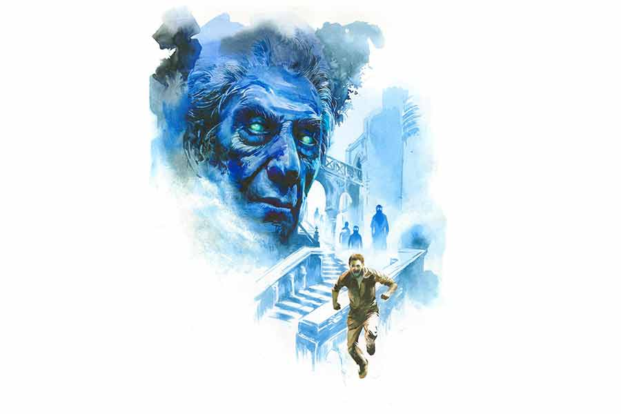

 
 <h1 align=center>নক্ষত্রের আয়ু</h1>
<h2 align=center>স্মরণজিৎ চক্রবর্তী</h2> 

তৃণাভ

বুকপকেটের খামটা ঠিক আছে তো! জ্ঞান ফিরে আসার পরে প্রথমে এটাই মনে হল তৃণাভর। ও দ্রুত পকেটে হাত দিল। হ্যাঁ, আছে খামটা! যাক, বাঁচা গেল। তৃণাভ মাথায় হাত দিল এ বার। কী ব্যথা! মোপেডটা যে পিছন থেকে আসছে বুঝতেই পারেনি। আর যখন ওকে মারল, ও প্রায় উড়ে গিয়ে পড়েছিল পথের ধারে! রোমের বেশ কিছু অংশের রাস্তায় পাথর বসানো রয়েছে। এগুলোকে ‘স্যামপিয়েত্রিনি’ বলে। কয়েকশো বছর আগে বসানো এই ব্যাসল্ট পাথরের কিউবগুলো মাঝে মাঝেই বুড়ো মানুষের দাঁতের মতো নড়বড় করে। টু-হুইলারগুলো এই পাথরের জন্য নানা দুর্ঘটনায় পড়ে। এই গলিপথটাতেও এক দিকে কিছু পাথর ডাঁই করে রাখা আছে। আসলে রাস্তায় কাজ চলছে। এই আলগা পাথরের জন্যই হয়তো মোপেডটা নিয়ন্ত্রণ হারিয়ে এসে ধাক্কা মেরেছিল তৃণাভকে।

মাথায় বেশ লেগেছে। রক্তও বেরিয়েছে একটু। তবে বিশাল কিছু নয়। কাজটা সেরে ব্যান্ডেজ করে নিলেই হবে। মাটিতে পড়ে থাকা ওর ছোট্ট সাইডব্যাগটা তুলে নিয়ে উঠে দাঁড়াল তৃণাভ। গলিটা নির্জন। আশপাশে কেউ নেই। যে মোপেডটা ওকে মেরেছিল, সেটাও কাত হয়ে পড়ে গিয়েছিল। কিন্তু এখন সেটারও কোনও চিহ্ন নেই। নিশ্চয় ওকে অজ্ঞান অবস্থায় দেখে ভয়ে পালিয়েছে।

এখন রাত হয়ে এসেছে প্রায়। এখানে দিনের আলো একটু বেশি ক্ষণ থাকে। রাস্তার পাশের পাউরুটি রঙের বাড়িগুলোর গায়ে দু’-চারটে লোহার ব্র্যাকেটে হলদে স্ট্রিটলাইট লাগানো রয়েছে। আলো-আঁধারির মধ্যে অদ্ভুত এক গা-ছমছমে পরিবেশ। অক্টোবরের তেইশ তারিখ আজ। হাওয়ায় কেমন যেন হেমন্তের গন্ধ।

গলিটা সাপের মতো আঁকাবাঁকা। এই জায়গাটার নাম ‘জিউয়িশ গেটো’। রোম শহরের এক পাশের টাইবার নদীর ধার ঘেঁষা এই জায়গাটা অনেক পুরনো। চার দিকে প্রাচীন বড় বাড়িঘরের মধ্যে পাথরে বাঁধানো রাস্তা। গেটোর মাঝ বরাবর একটা বড় সিনাগগ আছে। সেই সিনাগগের পাশের গলিতেই যেতে হবে ওকে। বাড়ির ঠিকানা লেখা কাগজটা ওই খামের মধ্যেই ইউরোর নোটগুলোর সঙ্গে মোড়া আছে। তবে সেটা দেখার দরকার নেই। তৃণাভর মনে আছে। ও গায়ের ধুলো ঝেড়ে পায়ে পায়ে সামনের দিকে এগোল এ বার। বুঝল, হাঁটুতেও লেগেছে।

আশপাশের দোকানপাট বন্ধ। কিন্তু কাচের উইন্ডোতে আলো জ্বলছে। বাইরে থেকে স্পষ্ট দেখা যায় উইন্ডোতে কী রাখা আছে। একটা পুরনো দোকান পেরিয়ে ডান দিকের গলিতে ঢুকল তৃণাভ। দূরে কোথাও যেন কেউ ভায়োলিন বাজাচ্ছে। বাখের ‘শাকোন’। হাত সামান্য কাঁচা হলেও শুনতে খারাপ লাগছে না। এই নিস্তব্ধ গলির দু’পাশের বাড়ির দেওয়ালে ধাক্কা খাচ্ছে সেই সুর। ঝুলন্ত বারান্দায় সাজানো সারি সারি টবে ফুটে থাকা ফুলের সঙ্গে যেন জড়িয়ে যাচ্ছে সব মনখারাপ। আর এই আবহেই তৃণাভর মনে পড়ল এমিলিয়ার কথা।

কাজের খোঁজে বছর পাঁচেক আগে দেশ ছেড়েছিল তৃণাভ। ওর বাবা-মা নেই। কেউ আটকানোরও ছিল না তাই। রোম শহরে এক বন্ধুর ভরসায় এসে পৌঁছেছিল। তবে একটা দোকানে কাজ দেখে দেওয়া ছাড়া বন্ধুটি বিশেষ কিছু করতে পারেনি ওর জন্য।

ও যেখানে কাজ করে, সেটাও এক জন বাঙালির স্টেশনারি দোকান। মানুষটি দীর্ঘ দিন রোমে আছেন। সেই কবে এই দেশে রিফিউজি হিসেবে এসেছিলেন। তার পর অনেক কাঠখড় পুড়িয়ে এখন নাগরিকত্ব পেয়েছেন। কিন্তু প্রায় চার দশক এখানে থাকলেও বাংলাকে ভুলতে পারেননি। এখনও দোকানে বসে প্রায়ই রবিঠাকুরের গান করেন, জীবনানন্দের কবিতা বলেন। দেশ থেকে বাংলা বই আনান। শুধু আর ফিরে যান না। যার প্রতি এত ভালবাসা, তার প্রতি কিসের এত অভিমান, তৃণাভ বোঝে না।

এক বার তৃণাভ জিজ্ঞেস করেছিল, “হারুনচাচা, আপনি এক বারও দেশে যাননি কেন?”

উনি নিচু স্বরে বলেছিলেন, “‘পৃথিবীর পুরোনো সে-পথ/ মুছে ফেলে রেখা তার— / কিন্তু এই স্বপ্নের জগৎ / চিরদিন রয়! / সময়ের হাত এসে মুছে ফেলে আর সব— নক্ষত্রেরও আয়ু শেষ হয়।’” একটু সময় নিয়ে আবার বলেছিলেন, “শেষ হয়, তবু শেষ হয় না, জানিস। নক্ষত্রের আয়ু ছাপিয়েও ভালবাসা বেঁচে থাকে। কাছে যেতেই হবে তার তো মানে নেই। দূর থেকেও ভালবাসা যায়।”

শনিবার হাফ বেলা আর রবিবার গোটা দিন তৃণাভর ছুটি থাকে। দোকানে খুব বেশি কিছু মাইনে পায় না ও। তাই ওই ছুটির দিনে ও স্প্যানিশ স্টেপসের ওখানে চলে যায়। সেখানে যে বাড়িটায় এক সময় কিটস থাকতেন, তার কাছে দাঁড়িয়ে বেহালা বাজায়। রোম এমন এক আশ্চর্য শহর, যেখানে টুরিস্টদের ভিড় লেগেই থাকে। তাই টুকটাক রোজগার হয়েই যায়।

আর এই বাজনা বাজাতে গিয়েই ওর দেখা হয়েছিল এমিলিয়ার সঙ্গে। এমিলিয়া স্প্যানিশ স্টেপসের বড় চত্বরের এক পাশে ফুল বিক্রি করে। বাদামি চুলের এমিলিয়ার গাল দুটো সূর্যাস্ত-রঙের আভায় উজ্জ্বল! চোখের ভিতর যেন হেমন্তের বাদামি অরণ্য!

প্রতি রবিবার বাজানো হয়ে গেলে তৃণাভ যখন উপার্জিত অর্থ আর বেহালা গুটিয়ে চলে আসার প্রস্তুতি নিত, তখন এমিলিয়া এসে ওকে একটা করে টিউলিপ দিয়ে যেত। ওই সময় ওদের মধ্যে অল্প কথাবার্তাও হত। কে কোথায় থাকে, কী কাজ করে, সেটুকুই বলত ওরা। এর বেশি কিছু বলার সাহস কোনও দিন মনে জোটাতে পারেনি তৃণাভ। কথা শেষ হলে এমিলিয়া সামান্য হেসে ধীর পায়ে চলে যেত নিজের দোকানের দিকে। আর তৃণাভ ভাবত, এক দিন যখন ও নিজের পায়ে দাঁড়াবে, এই শহরে ওর নিজের একটা থাকার জায়গা হবে, রোজগারের স্থিরতা আসবে, তখন ও ওর ভালবাসার কথা বলবে এমিলিয়াকে। কারণ তৃণাভ জানে, শুধু ভালবাসলেই তো হয় না, পাশে থাকার জন্য একটা যোগ্যতাও লাগে।

বিদেশের এই সম্পূর্ণ একার জীবনে এমিলিয়ার দিকে তাকিয়েই যেন বেঁচে ছিল তৃণাভ। এমিলিয়ার কথা হারুনচাচাকে ছাড়া আর কাউকেই বলতে পারেনি সে। মনে হয়েছে, সবাই বুঝবে না। আসলে আজকাল কেউই তো বুঝতে চায় না, সবাই ‘জাজ’ করতে চায়।

তার পর সপ্তাহ তিনেক আগে এমনই এক রবিবার এমিলিয়া এসেছিল ওর কাছে।

সসঙ্কোচে জিজ্ঞেস করেছিল, “আমার আটশো ইউরোর খুব দরকার। তুমি কাউকে চেনো যে আমাকে এটা ধার দিতে পারবে? দু’মাসের মধ্যে ফেরত দিয়ে দেব!”

তৃণাভ ওইটুকু টাকাও ওকে ধার দিতে পারেনি। ও কোথায় পাবে অত টাকা! ও মাথা নামিয়ে নিয়েছিল। দেখেছিল ম্লান মুখে চলে যাচ্ছে বাদামি ঝরনার মতো মেয়েটা!

তার পর থেকে এমিলিয়া আর আসে না স্প্যানিশ স্টেপসের কাছে। তৃণাভ খবর নিয়ে জেনেছিল, শহরের অন্য প্রান্তে নতুন একটা কাজ নিয়ে চলে গিয়েছে মেয়েটা।

ইস, টাকাটা যদি ও দিতে পারত! ও আকাশের দিকে তাকিয়ে বলেছিল, “হে ঈশ্বর! তুমি কি আমাকে একটুও সাহায্য করবে না?”

ঈশ্বর যেন খামখেয়ালি এক শিশু। কখন যে তিনি মানুষের কথা শোনেন, কেউ জানে না। তার পর গত রবিবার, যখন স্প্যানিশ স্টেপস থেকে বাড়ি ফিরছিল তৃণাভ, ঠিক সেই সময় এক জন বৃদ্ধ এসে পথ আগলে দাঁড়িয়েছিল ওর।

লোকটি লম্বা। ফ্যাকাসে। মুখের চামড়া বেশ কুঁচকে গিয়েছে। মাথার চুল সব সাদা। সন্ধের আবছায়াতেও বোঝা যাচ্ছিল, লোকটার চোখের মণি আগুনের শিখার মতো নীল।

লোকটা ওর নাড়িনক্ষত্র জানে দেখে খুব অবাক হয়ে গিয়েছিল তৃণাভ।

লোকটি ওকে একটা আইভরি কার্ড দিয়ে বলেছিল, “একটা কাজ আছে। ভয় নেই। ভাল কাজ। করে দিতে পারলে হাজার ইউরো পাবে। রাজি থাকলে কাল সন্ধেবেলা এই ঠিকানায় আমার বসের সঙ্গে দেখা কোরো।”

কার্ডে নামটা দেখেছিল তৃণাভ। কনরাড মুলার।

“কিসের কাজ? আপনি কে? আমাকেই বা দেবেন কেন কাজটা? মানে এ ভাবে হঠাৎ... কী ব্যাপার?” অনেকগুলো প্রশ্ন এক সঙ্গে করেছিল তৃণাভ। পাঁচ বছরে ও এখন কাজ চালানোর মতো ইটালিয়ান বলতে পারে।

লোকটা গম্ভীর ভাবে বলেছিল, “আমি কুইজ় কনটেস্টে আসিনি। ইচ্ছে থাকলে, কাল সন্ধে সাড়ে সাতটায় চলে এসো এই ঠিকানায়। থাউজ়েন্ড ইউরো ইজ় নো জোক!”

দোকান থেকে সে দিন একটু আগেই ছুটি নিয়ে নির্দিষ্ট জায়গায় পৌঁছে গিয়েছিল তৃণাভ। টাকাটা ওর দরকার। যে কোনও সৎ কাজ করতে ওর আপত্তি নেই।

জায়গাটার নাম পারিয়োলি। রোমের সামান্য উত্তর-ঘেঁষা বড়লোকদের পাড়া এটা। বাড়িটাও বেশ বড়। অল্প আলোয় দেখে মনে হয়েছিল, একটা বিশালকায় সিংহ যেন থাবায় মাথা রেখে ঘুমিয়ে আছে। দড়ি-টানা ঘণ্টা বাজিয়ে প্রায় বারো ফুট উঁচু কাঠের দরজার এক পাশে দাঁড়িয়েছিল তৃণাভ। একটু পরে দরজা খুলে দিয়েছিল সেই নীলাভ আগুনের চোখওয়ালা লোকটা।

বলেছিল, “এসো।”

নিভু-নিভু আলো-জ্বলা করিডর দিয়ে লোকটার পিছন পিছন গিয়েছিল তৃণাভ। তার পর একটা বড় ঘরে গিয়ে দাঁড়িয়েছিল। সেই ঘরের দেওয়ালে গাঢ় মেরুন ওয়ালপেপার। মাটিতে পার্কে ফ্লোরিং। এই ঘরের আলোও কেমন যেন অন্ধকার-মাখা। সামনের একটা ছাই রঙের উইংড চেয়ারে এক জন বসেছিলেন। লোকটির পরনে নীলচে ভেলভেটের স্যুট। মাথায় চুল নেই একটিও। সাদা কঙ্কালসার মাথায় বয়সজনিত কিছু ছোপ। আর এই লোকটির চোখেও ওই একই রকম নীল রঙের আগুন!
ঘরের এই আবছায়ায় কেমন যেন গা ছমছম করে উঠেছিল তৃণাভর।

ও কী বলবে বুঝতে না পেরে নীরবে তাকিয়ে ছিল সামনে।

অতিবৃদ্ধ মানুষটিই কথা শুরু করেছিলেন।

সামান্য ঘড়ঘড়ে গলায় বলেছিলেন, “আমার নাম কনরাড মুলার। দ্বিতীয় বিশ্বযুদ্ধের সময় আমি পোল্যান্ডের অউশভিৎজ়ে ছিলাম কয়েক বছর। না, নাৎসি বাহিনীর সৈন্য হিসেবে নয়। অন্য কাজে ছিলাম। অউশভিৎজ়ে চল্লিশটার উপর ক্যাম্প ছিল। এর মধ্যে কনসেনট্রেশন ক্যাম্প আর এক্সটার্মিনেশন ক্যাম্পও ছিল। আমি আসলে মিত্রশক্তির স্পাই ছিলাম। কিন্তু সেখানে যেতাম ব্যবসাদার সেজে। ক্যাম্পে নানা জিনিস দরকার হত। তার কিছু আমি সাপ্লাই করতাম। আর সেই সুযোগে নানা তথ্য বার করে আনতাম। ১৯৪৩-এর সেপ্টেম্বরে ইটালি মিত্রশক্তির কাছে আত্মসমর্পণ করেছিল। কিন্তু আয়রনিক্যালি ইটালির অনেকটাই জার্মানদের দখলে চলে যায়। তার পর গেস্টাপো বাহিনী এই শহরের জিউয়িশ গেটো থেকে অনেক ইহুদিকে ধরে অউশভিৎজ়ে পাঠিয়ে দেয়। সেখানে অবশ্য নানা জায়গা থেকে আসা ইহুদিরাও ছিল। আমার সঙ্গে তাদের দেখা হয়েছিল সেই নরকের মতো ক্যাম্পে। নাৎসিরা তাদের সর্বস্ব নিয়ে নিলেও কেউ কেউ তার মধ্যেও সামান্য কিছু স্মৃতি স্মারক বাঁচিয়ে রাখতে পেরেছিল। আর আমাকে সেই স্মারক দিয়েছিল, যাতে আমি সে সব তাদের প্রিয়জনদের কাছে ফিরিয়ে দিতে পারি। তারা জানত যে, তাদের মেরে ফেলা হবে। তাও মৃত্যুর পরেও সেই সব স্মারকের মধ্য দিয়ে ওঁরা ওঁদের প্রিয়জনদের কাছে বেঁচে থাকতে চেয়েছিল।

“যুদ্ধের শেষের দিকে আমাকেও নাৎসিরা গ্রেফতার করে। কিন্তু তার চার দিনের মাথায় হিটলার আত্মহত্যা করে। যাই হোক, সেই সব স্মারক আমার কাছে রয়ে গিয়েছে। অনেকগুলো ফেরত দিলেও এখনও কয়েকটা বাকি আছে। তার মধ্যে জিউয়িশ গেটোরও কয়েকটা জিনিস রয়েছে। তেমনই একটা তোমাকে পৌঁছে দিতে হবে। লোকটির নাম ছিল জুলিয়াস চিতোনি। ১৯৪৩-এর ১৬ অক্টোবর তাঁকে জিউয়িশ গেটো থেকে ধরা হয়। আর তার সাত দিনের মধ্যে, মানে ২৩ অক্টোবর তাঁকে অউশভিৎজ়ে মেরে ফেলা হয়। তোমার পাশের টেবিলে তাঁর লকেট আছে। তাতে তাঁর বাচ্চা মেয়ের ছবি রয়েছে। মেয়েটি সেই সময় তার মামার বাড়িতে ছিল বলে ধরা পড়ার হাত থেকে বেঁচে যায়। সেই মেয়ে এখন বৃদ্ধা। চোখে প্রায় দেখতেই পায় না। কানেও কম শোনে। তুমি এই লকেটটা তাকে দিয়ে দেবে। লকেটের পাশের খামে এক হাজার ইউরো আছে। সঙ্গে আছে ঠিকানা ও একটা চিঠি। দিনের বেলা বৃদ্ধাকে যে দেখাশোনা করে, সে চিঠিটা পড়ে তাকে যা বলার বলে দেবে। শোনো, কাজ না করে ইউরো নিয়ে পালাবে ভেবো না। কারণ জেনো, আমার চোখ সর্বত্র আছে। মনে রেখো, অসৎ হলে বিপদে পড়বে।”

তৃণাভ বলেছিল, “আর আমি যদি বাকি জিনিসগুলোও পৌঁছে দিই!”

কনরাড চাপা রাগের গলায় বলেছিলেন, “তোমাদের মতো মানুষদেরও যাতে সাহায্য হয়, তাই আমি তোমাদের দিয়ে এগুলো পৌঁছনোর ব্যবস্থা করেছি। কিন্তু বেশি লোভ করবে না। তোমার মতো আরও অনেকের টাকার দরকার থাকে। হ্যাঁ, তুমি নিঃস্বার্থ ভাবে তেমন কাউকে পাঠালে তাকেও আমি একটা কাজ দেব। কিন্তু এক জনকে একটাই কাজ দেওয়া হবে। তেইশে অক্টোবর সন্ধেবেলা জিনিসটা পৌঁছতে হবে তোমাকে। ওই দিন গেটো থেকে নিয়ে যাওয়া অনেক মানুষকে মেরে ফেলা হয়েছিল অউশভিৎজ়ে। বুঝেছ?”

আজ সেই সন্ধেবেলা

তৃণাভ সেই পাথরে বাঁধানো গলিপথে পা বাড়াল। আর তখনই আবার দেখল লোকটাকে। আজ দোকান থেকে বেরোনোর পর থেকেই লোকটাকে দেখছে ও। পুরোনো ধাঁচের খয়েরি স্যুট পরা একটা বেঁটে লোক। বাসের মধ্যেও ওর দিকে একদৃষ্টে তাকিয়েছিল। তার পর বাস থেকে নেমে গেটোর মধ্যে ঢোকার পরেও দূর থেকে ওর পিছু নিয়েছিল। কে লোকটা? ওই কনরাডের লোক নাকি? ওকে চোখে চোখে রাখছে? এই লোকটার চোখ দুটোও কী আশ্চর্য নীল! লোকটা ওর দুর্ঘটনার সময় কোথায় ছিল? আর এখন আবার ওকে লক্ষ করছে কেন?

নির্জন গলিতে লোকটার উপস্থিতি কেমন যেন স্বাভাবিক নয়। তৃণাভর গা ছমছম করছে। ও কাজটা সেরে এখান থেকে বেরোতে পারলে বাঁচে।

সিনাগগের পাশের গলিতে ঠিকানাটা খুঁজে পেতে অসুবিধে হল না। জুলিয়াস চিতোনির মেয়ের নাম শার্লট। বিয়ে করার পরে সে হয়েছিল সনিনো। শার্লট সনিনো।

বাড়ির সামনে দাঁড়িয়ে তৃণাভ দেখল দরজাটা। পাশে, বাড়ির বাসিন্দাদের নাম লেখা একটা ফলক। তার পাশে ডোরবেলের বোতাম। ও দেখল, বাড়ির দরজায় পথের উপর চারটে পিতলের ফলক। এগুলোকে ‘স্টাম্বলিং স্টোন’ বা ‘শ্‌টলপারস্টাইন’ বলে। এই গেটোর যে যে বাড়ি থেকে ইহুদিদের ধরে নিয়ে গিয়ে মেরে ফেলা হয়েছিল, এই প্রতিটি ফলকে তাঁদের এক-এক জনের নাম, জন্মসাল, সে কবে ধরা পড়েছিল এবং তাকে কত তারিখে ও কোথায় মেরে ফেলা হয়েছিল, সে সব লেখা আছে। ও ঝুঁকে পড়ে দেখল, চারটে ফলকের মধ্যে জুলিয়াস চিতোনির নামও রয়েছে।

ওকে বেল বাজাতে হল না। এক জন বাড়িটা থেকে বেরোচ্ছিল, তাই দরজা খোলা পেয়ে তৃণাভ বাড়ির মধ্যে ঢুকে পড়ল। যে লোকটা বেরোচ্ছিল সে এমন করে প্রায় ওকে ধাক্কা দিয়ে বেরোল, যেন দেখতেই পায়নি!

পুরনো সিঁড়ি বেয়ে দোতলায় উঠে শার্লটের দরজার সামনে দাঁড়াল তৃণাভ। আরে, এই দরজাটাও খোলা! ও সোজা ঘরের ভিতরে ঢুকে গেল। এক জন বৃদ্ধা বসে রয়েছেন। ও যে ঘরে ঢুকল, সেটা বুঝতেই পারলেন না তিনি। সত্যি বৃদ্ধা চোখে দেখেন না বা কানেও সে ভাবে শোনেন না। টেবিলের উপর খামটা রাখল তৃণাভ। তার থেকে হাজার ইউরো বার করে নিল শুধু। এখন খামে ওই লকেট আর চিঠিটাই আছে কেবল। আগামী কাল কেয়ারগিভার এলে বৃদ্ধা সবটা জানতে পারবেন। তৃণাভর ব্যাগে দোকান থেকে কেনা এক প্যাকেট কাজুবাদাম। কী মনে হতে, সেটাও বার করে ও চিঠির পাশে রেখে দিয়ে বেরিয়ে এল ঘর থেকে। ও যে এ সব করল, বৃদ্ধা বুঝতেই পারলেন না যেন।

বাড়ির বাইরে এসে তৃণাভ দেখল, পথের পাশে যে একটা আলো জ্বলছিল, সেটা নিবে গিয়েছে। বেশ অনেকটা জায়গা আবছা অন্ধকারে ঢাকা। শুধু একটু দূরে একটা বন্ধ কিউরিয়ো শপের কাচের ডিসপ্লে উইন্ডোতে আলো জ্বলছে। আর আশপাশের বাড়ি থেকে সামান্য আলো আসছে পথে।

“ঠিকমতো দিয়ে এসেছ তো?”

আচমকা কানের কাছে একটা গলা শুনল তৃণাভ। ভীষণ চমকে গিয়ে ফিরে তাকাল ও। দেখল, সেই স্যুটপরা বেঁটে লোকটা একদম কাছে এসে দাঁড়িয়েছে! আর লোকটার নীল আগুনের মতো চোখ দুটো অন্ধকারে যেন জ্বলছে।

তৃণাভ ভয়ে দু’পা পিছিয়ে গেল। জিজ্ঞেস
করল, “কে... কে আপনি? এ ভাবে আমায় ফলো করছেন কেন?”

লোকটা বলল, “বা রে, দেখব না জিনিসটা ঠিকমতো পৌঁছল কি না!”

“কিন্তু কে আপনি!” তৃণাভর গলা কাঁপছে!

লোকটা নীল আলোর চোখ নিয়ে তাকিয়ে বলল, “আমি জুলিয়াস চিতোনি। একাশি বছর আগে আজকের দিনে আমাদের অনেককে অউশভিৎজ়ের গ্যাস চেম্বারে মেরে ফেলা হয়েছিল। এত দিন পরে আমার মেয়ের কাছে আমার জিনিসটা পৌঁছনোর কথা... তুমি ঠিকমতো দিয়েছ তো?”

লোকটা আলতো করে স্পর্শ করল তৃণাভর হাত। এ যে বরফের মতো ঠান্ডা! তৃণাভ প্রচণ্ড ভয় পেয়ে দৌড়ল রাস্তা দিয়ে। লোকটাও দৌড়ল ওর পিছনে। তৃণাভ পিছন ফিরে তাকাল এক বার। আর দেখল, শুধু লোকটা নয়, আরও অনেক ছায়া দিয়ে তৈরি মানুষ এসে পড়েছে লোকটার সঙ্গে! আশপাশের বাড়ি থেকে আসা আলোয় ও দেখল তাদের সকলের ছেঁড়াখোড়া পোশাক। শুকিয়ে যাওয়া মুখ। জামার হাতায় আর বুকের কাছে হলুদ রঙের তারা লাগানো!

তৃণাভর পা ভারী হয়ে গিয়েছে। গলাটাও শুকিয়ে আসছে। যেন আর দৌড়তে পারছে না ও। কিউরিয়ো শপের সেই কাচের সামনে গিয়ে ও থমকে দাঁড়াল। দু’দিক থেকে ছায়ার মানুষগুলো এসে ওকে ঘিরে ধরল আরও। ওদের নীলাভ চোখগুলো যেন আগুনের মতো জ্বলছে! আর ওদের মধ্যে থেকে জুলিয়াস এসে দাঁড়াল ওর সামনে।

জুলিয়াস বলল, “প্রতি বছর এই দিনে আমরা এখানে, আমাদের পাড়ায় ফিরে আসি। তুমি কাজটা করেছ তো?”

এটা সত্যি, নাকি ভ্রম! তৃণাভর হাত-পা ঠান্ডা হয়ে গেল। ভয়ের চোটে পিছন ফিরে দোকানের জানলার দিকে ঘুরল। কাচের মধ্যে নানা জিনিসের সঙ্গে একটা পুরনো আয়নাও আছে। আর হতবাক ও আতঙ্কিত হয়ে ওই আলোর মধ্যে তৃণাভ দেখল, সেই আয়নায় কারও কোনও প্রতিবিম্ব পড়ছে না!

এমিলিয়া

এমিলিয়া বুঝতে পারছে না কিছু। কাল থেকে কী সব হচ্ছে! ও দোকানের মধ্যে ঢুকল।

ও যেখানে কাজ করে, সেখানে কাল রাতে আচমকা এসে হাজির হয়েছিল তৃণাভ। সেই স্প্যানিশ স্টেপের বেহালাবাদক ছেলেটি। কী যে লাজুক ছিল! আর দেখলেই বোঝা যেত যে, খুব ভাল মানুষ! এমিলিয়ার ভীষণ ভাল লাগত ওকে!
তাই আর কাউকে না-বলে ওকেই বলেছিল টাকার কথা। আসলে একটা কোর্সে ভর্তি হতে চায় ও। তার ফি-টা কোথাও জোগাড় করতে পারছিল না। তৃণাভও দিতে পারেনি। কিন্তু তাতে যেন মরমে মরে গিয়েছিল ছেলেটা।

একটু বেশি মাইনের জন্য শহরের অন্য দিকে একটা দোকানে কাজ নিয়েছে এমিলিয়া। ঠিক করেছে, কয়েক মাস কাজ করে ফি-এর টাকাটা জমিয়ে নেবে। কিন্তু তার মধ্যেই কাল রাতে ওর কাছে এসেছিল তৃণাভ। আর এসে এক হাজার ইউরো দিয়ে গিয়েছিল। সঙ্গে একটা আইভরি
কার্ড দিয়ে বলেছিল, “এখানে গেলে সৎ ভাবে আরও এক হাজার ইউরো তুমি রোজগার করতে পারো এমিলিয়া।”

এমিলিয়া সেই রাতের নির্জন রাস্তায় দাঁড়িয়ে জিজ্ঞেস করেছিল, “টাকাটা তোমার লাগবে না?”

তৃণাভ শুধু বলেছিল, “তোমার বেশি দরকার। আমি আসি।”

এত দিন পরে তৃণাভকে দেখে এমিলিয়ার বুকের মধ্যে কেমন যেন একটা পাথর আটকে যাওয়ার মতো কষ্ট হয়েছিল। ও জিজ্ঞেস করেছিল, “এই কারণেই এলে! আর কিছু বলার নেই তোমার?”

তৃণাভ বলেছিল, “সব বলা কি আর কথা দিয়ে বলতে হয় এমিলিয়া? আমাদের এক দিন দেখা হবে আবার। এখন আসি।”

আজ সকালেই পারিয়োলিতে এসেছিল এমিলিয়া। কিন্তু কার্ডের সেই ঠিকানায় যে বাড়িটা আছে, সেটা তো পোড়ো বাড়ি! ও কাছের দোকানের অতিবৃদ্ধ এক ভদ্রলোককে জিজ্ঞেস করেছিল, “এখানে কনরাড মুলার বলে কেউ থাকে?”

লোকটা ভুরু কুঁচকে বলেছিল, “সে তো কবে মারা গিয়েছে! আমি তখন বাচ্চা ছেলে। নাৎসিরা তাকে ও তার সহকারীকে মেরে ফেলেছিল ক্যাম্পে। এটা তার বাড়ি ছিল বটে। কিন্তু এখানে সে আর ফিরতে পারেনি।”

এমিলিয়া জানে না, এমন একটা জায়গায় কেন ওকে আসতে বলেছিল তৃণাভ। খুব অস্থির লাগছিল ওর, তাই এখন এসেছে এই দোকানে। এখানেই তো কাজ করে তৃণাভ। যখন কথা হত, তখন সে রকমই তো বলেছিল ওকে।

বয়স্ক এক ভদ্রলোক ম্রিয়মাণ মুখে বসে রয়েছেন দোকানে। ইনি নিশ্চয় সেই হারুনচাচা! এঁর কথাও তৃণাভ বলেছিল।

এমিলিয়া জিজ্ঞেস করল, “মি স্কুসি, এখানে কি তৃণাভ মিত্র কাজ করে?”

হারুনচাচা মুখ তুলে সামান্য সময় নিলেন। তার পর বললেন, “তুমি সেই এমিলিয়া!”

“হ্যাঁ, কিন্তু তৃণাভ...”

হারুনচাচা বললেন, “কাল সন্ধের মুখে, জিউয়িশ গেটোতে একটা রোড অ্যাক্সিডেন্টে তৃণাভ মারা গিয়েছে। মাথায় চোট পেয়েছিল। ইনস্ট্যান্টেনিয়াস ডেথ। নির্জন গলিতে বেশ কিছু ক্ষণ পরে ওর দেহ পাওয়া গিয়েছিল।”

“কী বলছেন! সন্ধের মুখে মারা গিয়েছে! কিন্তু ও যে কাল রাতে এসেছিল আমার কাছে... ও যে... মানে...” এমিলিয়া কেমন যেন স্তব্ধ হয়ে গেল।

হারুনচাচা দীর্ঘশ্বাস ফেলে বললেন, “তাই? তা হবেও বা! ভালবাসা ও মৃত্যু দুই-ই যে খুব রহস্যময়! সর্বশক্তিমান ওর মঙ্গল করুন।”

এমিলিয়া নিথর হয়ে দাঁড়িয়ে রইল শুধু। যেন দেখতে পেল, একটা টিউলিপ ফুল পড়ে আছে কোনও নির্জন পাথুরে রাস্তায়।

তৃণাভ, আবার

হারুনচাচার ছোট্ট দোকানটায়, ওই হাওয়ার শরীর নিয়ে দাঁড়িয়ে রয়েছে তৃণাভ। কাল আয়নায় সেই লোকটি, সেই ভিড়ের বা নিজেরও কোনও প্রতিবিম্ব না দেখতে পায়ে তৃণাভ বুঝেছিল যে, ও আর বেঁচে নেই। ওর পার্থিব শরীর শেষ হয়ে গিয়েছে। তাও শেষ বারের মতো এমিলিয়াকে দেখতে গিয়েছিল ও। তার প্রয়োজনের অর্থটুকু পৌঁছে দিতে গিয়েছিল।

আর এখন, এই দোকানে ওই দাঁড়িয়ে আছে এমিলিয়া! বাদামি ঝর্নার মতো এমিলিয়া! ওর মৃত্যুর খবরে স্তব্ধ এমিলিয়া! এমিলিয়াকে কষ্ট দেওয়া তো তৃণাভর উদ্দেশ্য নয়, তবু মানুষ তার অজান্তেই যে কষ্ট দিয়ে ফেলে অন্যকে!

তৃণাভ তাকাল এমিলিয়ার দিকে। বাদামি অরণ্যে বৃষ্টি নেমেছে। ও অস্ফুটে, হাওয়ার স্বরে বলল, “কষ্ট পেয়ো না এমিলিয়া। নক্ষত্রের আয়ু ম্লান করে আমি থেকে যাব তোমার কাছে, আজীবন!”

