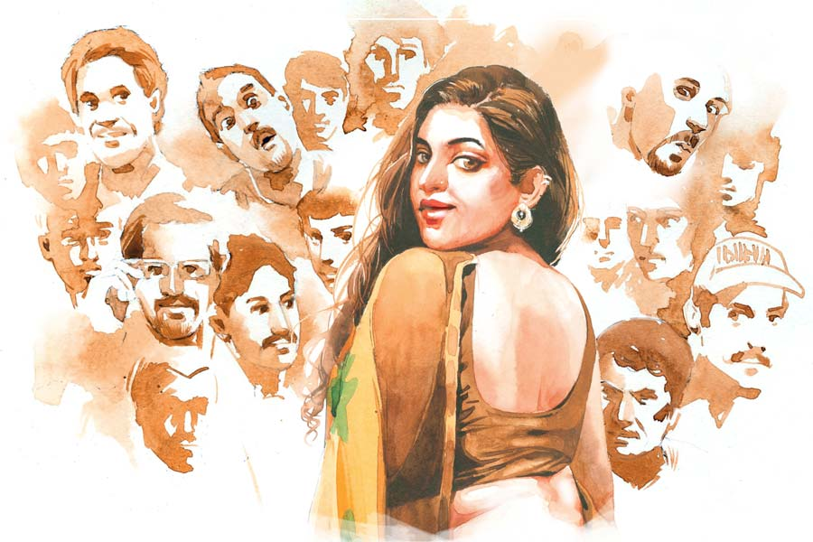

 
 <h1 align=center>নহ মাতা নহ কন্যা</h1>
<h2 align=center>বাসুদেব মালাকর</h2> রেহাই পাওয়ার আরও অনেক উপায় ছিল— তাই বলে বৌকে একেবারে মেরে দিলেন! ঠিক করে বলুন তো, মোটিভটা কী ছিল? অন্য কোথাও জড়িয়েছিলেন?”

সুজন কী বলবে, ভাবছিল। বলতে গেলে অনেক কথা বলতে হয়। তা-ও যে এই পুলিশ অফিসার বিশ্বাস করবেন, তার গ্যারান্টি নেই।

অফিসার এ বার ধমক দিলেন, “মুখ বন্ধ রেখে পার পাবেন না। সব টেনে বের করব!”

তখন প্রায় রাত দুটো। একটু আগে ঝুম বৃষ্টি হয়েছে। এখন তার বেগ কমলেও একেবারে ক্ষান্ত দেয়নি। সুজন যখন বাড়ি থেকে বেরোয়, তখন আকাশে ঘন কালো মেঘ ছিল, কিন্তু ঝমঝম করে নামল ঠিক মাঝরাস্তায়। রাস্তাটাও কম নয়, থানায় ঢোকার আগেই সে ভিজে চুপ্পুস হয়ে গেল। স্টিল-গ্রে কালারের প্যান্টের নীচের দিকটা কাদায় মাখামাখি, হাওয়াই শার্ট গায়ে সেঁটে আছে।

দুর্যোগের রাত। ঘোর বিপদ ছাড়া আজ কেউ থানায় আসবে বলে মনে হয়নি। গ্রামীণ থানা— খুচখাচ ঝামেলা হলেও সব সময় থানা অবধি গড়ায় না। এএসআই প্রশান্ত লাহা আজ নাইট শিফ্টে। বয়স চল্লিশের আশপাশে, সুঠাম সুদর্শন চেহারা। টেবিলের পাশে চওড়া বেঞ্চির উপরে চাদর পেতে শুয়ে ছিলেন। পিছনের ডোবায় ব্যাঙের ঐকতানে, ঠান্ডা জোলো হাওয়ায় আরামে দু’চোখে তন্দ্রা জড়িয়ে এসেছিল। ডিউটি কনস্টেবল তপনও অন্য পাশে গুটিসুটি মেরে শুয়ে। সেই সময় সুজন দৌড়ে থানায় ঢুকল। বুড়ো আঙুল দিয়ে ভুরুর উপরের বৃষ্টির জল মুছে বলল, “স্যর, স্যর শুনছেন? আমি আমার বৌকে খুন করে এসেছি!”

প্রশান্ত তড়াক করে উঠে বসে খরচোখে প্রথমে সুজনের জামাপ্যান্টের দিকে নজর দিলেন! রক্তের কোনও চিহ্ন-টিহ্ন— বৃষ্টির ঝাপটায় তা থাকা সম্ভবও নয় অবশ্য। চেঞ্জ করেও আসতে পারে। ফরেন্সিক হলে বোঝা যাবে। প্রশান্ত এ বার সুজনের মুখের দিকে তাকালেন। একদম সাদামাটা ভদ্রস্থ চেহারা। মুখটা ভালমানুষের মতো। অবশ্য মানুষকে উপর থেকে দেখে কিছু বোঝা যায় না, প্রশান্ত সেটা অভিজ্ঞতা দিয়ে জানেন।

শতকরা এক জনও খুন করে স্বেচ্ছায় থানায় ধরা দিতে আসে না। বৃষ্টি-বাদলের রাতে এই লোকটি সেটাই করেছে! প্রশান্ত জিজ্ঞেস করলেন, “আপনার নাম কী? বাড়ি কোথায়? কখন, কী ভাবে মেরেছেন? কুপিয়ে, না গলা টিপে?”

“গলায় পা দিয়ে। ওর গায়ে হাত ছোঁয়ানোর প্রবৃত্তি হয়নি।”

ঠান্ডা গলার উত্তরে প্রশান্ত একটু ঝাঁকুনি খেলেন! এত ঘৃণা, এত আক্রোশ! পুলিশের চাকরিতে প্রতিহিংসা প্রতিশোধ খুব কম দেখেননি প্রশান্ত। তা বলে... আজ আর ঘুম হবে না। সামনে জলজ্যান্ত একটা স্বঘোষিত খুনি! তপনও উঠে বসেছে তত ক্ষণে। প্রশান্ত তাকে ইশারা করলেন, নজর রেখো— যেন না পালায়!

থানার গাড়িটা নিয়ে দুপুরে আইসি সাহেব দেশের বাড়িতে গিয়েছেন। সন্ধ্যায় ফেরার কথা ছিল। রিকশাভ্যানে করে থানার যাবতীয় মালপত্র— ডেডবডি অবধি— টানে যে কার্তিক, সে-ও এত ক্ষণে নেশা করে বেহুঁশ! সকালের আগে তাকে পাওয়া যাবে না। ভিক্টিমের বাড়ি সাত-আট কিলোমিটার দূরে। এই দুর্যোগে, জলকাদার ভিতরে হেঁটে সেখানে পৌঁছনোও অসম্ভব।

প্রশান্ত ভাবলেন, সত্যি-মিথ্যেটা একটু বাজিয়ে দেখতে হবে! পাগল বলেও তো মনে হচ্ছে না! ঠিক জেরা নয়, একটু একটু করে নরমে-গরমে পেট থেকে কথা বের করে রাখতে পারলে কেস সাজানোর কাজটা এগিয়ে থাকবে। রাতটাও কথায় কথায় কেটে যাবে। ডেডবডি চোখে না-দেখে, জেরা করে সন্দেহ করবার মতো যথেষ্ট কারণ না পেলে একে লকআপ করাও যাবে না।

প্রশান্ত বেশ মাইডিয়ার স্বরে বললেন, “চা খাবেন?  করতে বলি?”

সুজন বলল, “হলে মন্দ হয় না।”

প্রশান্ত বললেন, “এই ফাঁকে পুরো ঘটনাটা বলুন তো শুনি। খুলে বলতে আপত্তি আছে? অবশ্য এখন না বললেও পরে তো বলতেই হবে।”

“স্যর, আঠারো বছর আগে আমাদের বিয়ে হয়েছিল।”

“মাত্র আঠারো বছর! আপনার বয়স কত?”

“একটু বেশি বয়সেই বিয়ে করেছিলাম। বৌ আমার থেকে বয়সে অনেক ছোট। এখন আমার পঞ্চাশ, ওর সাঁইত্রিশ।”

“গুখেকো কাজ। তার পর?”

“আঠারো বছরে অন্তত ছ’বার আমায় বাড়ি পাল্টাতে হয়েছে!”

“সে কী! কেন?”

“যেখানেই গিয়েছি, সেখানেই ও কারও না-কারও সঙ্গে একটা-দুটো করে রিলেশন তৈরি করেছে! আপনাকে কী বলব— পথেঘাটে লোকে আমাকে দেখে টিটকিরি দিয়েছে, গা-টেপাটিপি করেছে, সিটি মেরেছে, মেয়েরা বাড়িতে চড়াও হয়েছে, শেষে বাড়িওয়ালার ঘর ছাড়ার নোটিশ!”

“আপনার স্ত্রী কি খুব অ্যাট্রাক্টিভ ছিলেন?” প্রশ্ন করেন প্রশান্ত।

“সামনাসামনি দেখলে তেমন কিছুই নয়। গায়ের রংটাই যা ফরসা। সাইড থেকে দেখলে নাকের গোড়া থেকে থুতনি অবধি থোবড়াটা বাইরে বের করা— নিয়ান্ডারথাল! কিন্তু ফ্রন্ট ভিউটা ফোটোজেনিক। সামান্য মোটার দিকে ফিগারটাও বেশ ইয়ে। সব সময় চড়া মেকআপে থাকত।”

“আপনি কত দূর লেখাপড়া করেছেন?”

“হঠাৎ লেখাপড়ার কথা কেন?”

“ওই যে বললেন ফ্রন্ট ভিউ, নিয়ান্ডারথাল, ফোটোজেনিক!”

“ওই ফেস দিয়েই তো বাজিমাত করত। ফেসবুক ছয়লাপ করে দিয়েছিল সেলফি দিয়ে! সব সময় দাঁত বের করে ফোটো দিত! ওতেই খেলাটা জমত।”

“অনেকেই তো দেয়। মেন্টাল ডিসঅর্ডার থাকে অনেকের, একে এক্সহিবিশনিজ়ম বলে। নার্সিসিজ়ম শব্দটা শুনেছেন? কিন্তু তার জন্য কাউকে খুন করা যায় না।”

তপন চা নিয়ে এসেছিল। সঙ্গে দুটো বিস্কুট। ভিজে জামা-প্যান্টে সুজনের শীত শীত করছিল। গরম চা পেয়ে বেশ ভাল লাগল। প্রশান্ত একটা খাতায় দরকারি পয়েন্টগুলো নোট করছিলেন। মুখ তুলে বললেন, “ঝেড়ে কাশুন! ওই সব কারণেই বৌয়ের গলায় পা দিয়ে মেরে ফেললেন! না আপনার নিজের কোনও অ্যাফেয়ার আছে?”

“আমার এই চেহারায় কে পাত্তা দেবে আমাকে?”

“কী করেন আপনি?”

“একটা প্রায় ঝাঁপ-পড়া সরকারি ডিপার্টমেন্টে জুনিয়র ক্লার্ক।”

“বৌয়ের শাড়ি-টাকাপয়সা-গয়নার খাঁই ছিল?”

“তা বেশ ছিল বৈকি!”

“কত দিন আগে থেকে মার্ডার করবার প্ল্যানটা করেছিলেন?  বেশিরভাগ মার্ডারই প্রি-প্ল্যানড। কোনও প্রোভোকেশন ছাড়াই এমনি এমনি বৌকে মেরে দিলাম, এমন হয় না। ঝগড়াঝাঁটি মারামারি হয়েছিল মারবার আগে?”

“সত্যি কথা বলব, স্যর?”

“যত মিথ্যে বলবেন, তত ফেঁসে যাবেন! সত্যি কথা বের করবার মন্তর জানি আমরা।”

“আগের কথা জানি না। আমার জানা ওর প্রথম অ্যাফেয়ার এক ডাক্তারের সঙ্গে। গলব্লাডারে পাথর হয়েছিল। ডাক্তারের চেহারাটা বেশ ভাল। ও মা, কিছু দিন পরে দেখি, ঘন ঘন তাঁর চেম্বারে যাতায়াত শুরু হয়েছে! শুনেছি, রোগীর ভিড় একটু কমলেই কোনও অ্যাপয়েন্টমেন্ট ছাড়াই চেম্বারে ঢুকে পড়ত! অ্যাটেন্ড্যান্ট মেয়েদুটো মুচকি হেসে ওয়েটিং পেশেন্টদের বলত, ‘স্যর এখন একটা আর্জেন্ট ক্রিটিক্যাল পেশেন্ট দেখবেন— সময় লাগবে!’...এতে অবশ্য আমার একটা সুবিধে হয়েছিল—কখনও ভিজ়িট লাগত না!

“তার পর এক দিন একটা উড়োচিঠি পেলাম। খোঁজ নিয়ে জানলাম, ব্যাপারটা সত্যি! কিন্তু ডাক্তার খুব বুদ্ধিমান ছিল— ফায়দা উশুল করে নিজেই এক সময় কাটিয়ে দিল! তত দিনে এলাকায় ঢি ঢি! বাজার-ঘাটে গেলে চ্যাংড়া ছোঁড়ারা আওয়াজ দিত!

“তার পর ছেলেকে অ আ ক খ শেখানোর টিউটর, শাড়ির দোকানদার, পার্লারের মালিক, ইন্টিরিয়র ডেকরেটর, স্কুলমাস্টার, গাইয়ে, ফোটোগ্রাফার, ছবি-আঁকিয়ে, কবি— কেউ বাদ যায়নি!”

“ওগুলো যে অ্যাফেয়ার, বুঝলেন কী করে! ফ্রেন্ডশিপ তো হতে পারে!”

“সব বলছি। এক বার হল কী, তখন নৈহাটিতে থাকতাম। ওখানে এক অ্যামেচার ড্রামা-ডিরেক্টরকে গিলে ফেলল! জানাজানি হতে অপমান যা হওয়ার, তা তো হলই। ডিরেক্টরের বৌ দলবল নিয়ে বাড়িতে চড়াও হল! আপনিই বলুন, এর পরে কোথাও সম্মান নিয়ে বাস করা যায়? কমবয়সি হ্যান্ডসামদের দিকেই নজরটা বেশি! ফেসবুকে বেছে বেছে তাদের সঙ্গে বন্ধুত্ব করত। বছর তিনেক আগে নাচে ভর্তি হল।”

“হঠাৎ নাচ কেন?”

“আমিও অবাক হয়েছিলাম! ওই ভারী বুক-থাই-কোমর-পেছন নিয়ে এই বয়সে নাচ! ওই ড্রামাওয়ালার অখাদ্য নাটকে খুচখাচ অত্যন্ত বাজে অভিনয় করত। পরে জানলাম, কে নাকি টিভি সিরিয়ালে চান্স দেবে বলেছে, তার জন্য নাচ শিখতে হবে। তার পর যথারীতি সেই ডিরেক্টরকেই গেঁথে ফেলল! এ সব খবর কখনও চাপা থাকে না। শেষরাত অবধি হোয়াটসঅ্যাপ! তখন থেকেই প্ল্যান ভাঁজতাম, কী করে এই যন্ত্রণা ঘাড় থেকে নামাব!”

“আচ্ছা, আপনার বয়ান অনুযায়ী উনি বারোভাতা... স্যরি, খুব বারমুখো ছিলেন, তাই তো? তা সত্ত্বেও আপনি ওঁকে ভালবাসতেন?”

“আমার দিক থেকে তো কখনও খামতি রাখিনি। আমার বয়স বেশি, সেটা সব সময় মাথায় থাকত। তাই মন জুগিয়ে চলার চেষ্টা করতাম।”

“এমনও তো হতে পারে, সবটাই আপনার সন্দেহবাতিক। বয়সে বড় হওয়ার জন্য হীনম্মন্যতা!... আপনাদের ছেলেমেয়ে ক’টি?”

“একটাই ছেলে।”

“বয়স কত তার?”

“ষোলো— এ বার মাধ্যমিক পাশ করেছে।”

“সে খুনের সময় কোথায় ছিল? মায়ের সঙ্গে তার রিলেশন কেমন ছিল?”

“আর রিলেশন! যে মা জানেই না, ছেলে কী নিয়ে, কোন ক্লাসে পড়ে, তার সঙ্গে কেমন রিলেশন, বুঝে নিন!... আমার দাদার ছেলেপুলে নেই। ছোটবেলায় তাঁকেই দান করে দিয়েছি ছেলেকে! আমার বৌদিকেই মা বলে জানে!”

“বলেন কী! স্বামী যেমনই হোক, সন্তানই মায়ের ভরসা। তার কেরিয়ারের চিন্তা সব কিছুর আগে। মা হয়ে তাকেই বিলিয়ে দিল?”

“আনন্দের সঙ্গে! পায়ের বেড়ি ছিল যে!... ছেলের বয়স তখন চার বছর। এক দিন সন্ধেবেলা ঘরে ফিরে দেখি, মেঝেয় বসে ছড়িয়ে-ছিটিয়ে খানিকটা হালুয়া খেয়েছে, রাশি রাশি লালপিঁপড়ে ছেঁকে ধরেছে! ছেলে আছাড়ি পিছাড়ি খাচ্ছে মাটিতে আর চিৎকার করে কাঁদছে! খানিক পরে ও ফিরে রাগে আগুন হয়ে বলল, ‘দেখেছ হতভাগা ছেলের কাণ্ড! খেতে দিয়ে আমি আধ ঘণ্টার জন্য পার্লারে গেলাম, তার মধ্যে এই! হাড়-জ্বালানো আপদ একটা!’ 

“তখন বারাকপুরে থাকি। এক বার দু’রাত বাড়ি ফিরল না! কোথায় ছিল? না, কোন ধ্যাদ্ধেড়ে গোবিন্দপুরে নাকি কিসের কল শো ছিল! আসলে ঢপলিং! ওই ছাতার মাথা ফোর্থ গ্রেড মালের আবার কল শো! কার দায় পড়েছে নেমন্তন্ন করে ও সব দেখার! ভোর রাতে বাড়ি ফিরলে সে দিন দরজা খুলিনি! বাড়িওয়ালার ভয়ে চেঁচাতেও পারেনি, সকাল পর্যন্ত বসে বসে মশার কামড় খেয়েছিল!”

“সেই পুরনো মেল ডমিনেশন! উনি থানায় নালিশ করলে এর জন্যও আপনার পানিশমেন্ট হতে পারত। এ-সমস্ত পাস্ট হিস্ট্রি কোর্টে উঠবে। সরকারি উকিল জেরা করে করে আপনার প্যান্ট খুলে নেবে!”

“স্যর, ফিমেল ডমিনেশন বলে কিছু হয় না?”

“হ্যাঁ, সেটাও হয়! ফল্গুনদীর মতো— দেখা যায় না, বলা যায় না, সইতে হয়। গোপনে কেঁদে কেঁদে বইতে হয়!” 

প্রশান্ত তাঁর পুলিশি অভিজ্ঞতা দিয়েও কিছুর তল খুঁজে পাচ্ছিলেন না! সংসারে এমন মা-ও আছে!    সন্তানের কথা ভুলে এত ফুর্তি! আর নিষ্ঠুরতা? বড়দার শ্যালক আদিত্যর কথা মনে পড়ল। উগ্রচণ্ডা উদ্ধত আবেগহীন স্ত্রীর মানসিক নির্যাতনের কাহিনি বলত বৌদির কাছে এসে। বৌদির সেই এক গৎ—‘মানিয়ে নে! একদিন সব ঠিক হয়ে যাবে।’ ঠিক হয়েছিল অবশ্য। মাত্র একচল্লিশ বছর বয়সেই আদিত্য জীবন থেকে মুক্তি নিয়েছিল। আদিত্য প্রশান্তর খুব বন্ধু ছিল। তার বৌয়ের সেই নিষ্ঠুরতা হয়তো কোনও অতৃপ্তিজাত ক্ষোভের বহিঃপ্রকাশ অথবা প্রকৃতিগত ছিল। কিন্তু সন্তানের প্রতি এমন ঔদাসীন্য— নাহ্, খুবই বিরল। 

বৃষ্টিটা ধরেছে একটু আগে। আকাশে বেলেজ্যোৎস্না ফুটেছে। প্রশান্তর ঘুম পাচ্ছিল। কিন্তু এমন এক জনকে সামনে বসিয়ে ঘুমোনো যায় না। আবার কারও বয়ান শুনেই তাকে লকআপও করা যায় না!  ক্লান্ত, খুব ক্লান্ত লাগছে তাঁর।

রাতের অন্ধকার পাতলা হচ্ছিল ক্রমে। শেষরাতে মেঘ সরে গিয়েছিল। একটু পরেই সকাল হবে। প্রশান্ত তপনকে বললেন, “চা বসা। চোখ জ্বালা করছে!”

 

ভ্যানে যেতে যেতে খানিক ইতস্তত করে সুজন হঠাৎ বলল, “স্যর, সত্যি কথা বলব? খুনটা আমি সত্যিই করে উঠতে পারিনি! তবে মাঝে মাঝে খুব ইচ্ছে হয়! ইচ্ছেও কি ক্রাইমের আওতায় পড়ে?” 

দূর পূর্ব দিগন্তে এখন লালিমা ছড়িয়ে সূর্য উঁকি দিচ্ছে। ভ্যানে প্রশান্ত, সুজন ছাড়া কনস্টেবলতপন ও আর এক জন সিভিক ভলান্টিয়ার। প্রশান্ত বললেন, “অমন সবাই বলে! একটু আগে আপনি নিজের মুখে বলেছেন!”

“আমি তো ম্যাজিস্ট্রেটের সামনে বয়ান দিইনি! পাল্টাতে কত ক্ষণ?”

“আপনি তো পাক্কা ঢ্যামনা, মশাই! তপন, এর কলারটা চেপে ধরে রাখ তো! দৌড়ে না পালায়! তার পরে স্পটে গিয়ে দেখছি!”

সুজনের বৌ অঞ্জু তখনও ঘুম থেকে ওঠেনি। রাত জেগে চ্যাট করে সকাল দশটার আগে তার ঘুম ভাঙে না। এখন তাকে ডেকে তুলতে হবে! কাঁচা ঘুম ভাঙালেই মুখঝামটা।...

একটি হননেচ্ছা সুজনের মনে সব সময় জেগে থাকে। তারই তাড়নায়— অদূর ভবিষ্যতে যদি সত্যিই তেমন সাহস সঞ্চয় করতে পারে— থানায় কেমন রগড়ানি হবে, তা আঁচ করবার জন্যই অথবা হৃদয়ের কোথাও সঞ্চিত বিষমোক্ষণের বাসনায় সে দুর্যোগ মাথায় নিয়ে বেরিয়ে পড়েছিল! সুজন ভালই জানে, পুলিশকে মিথ্যে হয়রানি করার জন্য তার সাজা হতে পারে, বেদম মারও জুটতে পারে! তবু নিজেকে আটকাতে পারেনি।

অঞ্জু এখন নিশ্চয়ই অঘোর ঘুমে অচেতন। তার ঘুমন্ত মুখটা সুজনের খুব প্রিয়। জাগরণে তার আচার-ব্যবহার-স্বভাব-চরিত্র সব সময় কাঁটার মতো রক্তাক্ত করে তাকে। কিন্তু ঘুমন্ত অঞ্জুর মুখ সব সময়ই কী নিষ্পাপ, অমলিন! ওই মুখটাকেই ভালবেসে সুজন বরাবর তার অপ্সরাবৃত্তিকে উপেক্ষা করেছে! ভেজানো দরজার সামনে গিয়ে খুব নরম করে সে ডাকল, “অঞ্জু, অঞ্জু!”

সজোরে ডোরবেলের সুইচে চাপ দিলেন এএসআই। আরও কয়েক মুহূর্ত কেটে গেল।

খুব অস্বস্তি হচ্ছিল প্রশান্তর। এই লোকটা নিশ্চয়ই শেষ মুহূর্তে ঘাবড়ে গিয়ে কথা ঘোরাচ্ছে। সত্যিই হয়তো লোকটা মার্ডারার। সুজন ভাবে, সত্যিই যদি পারত! কিংবা তার হয়ে যদি আর কেউ... কখনও...

অঞ্জু কি বেঁচে আছে? অনন্ত সংশয় আর অপেক্ষা নিয়ে বন্ধ দরজার এ পারে দাঁড়িয়ে থাকে দু’জন। তাদের ঘিরে থাকে ছায়া ছায়া অন্ধকার।