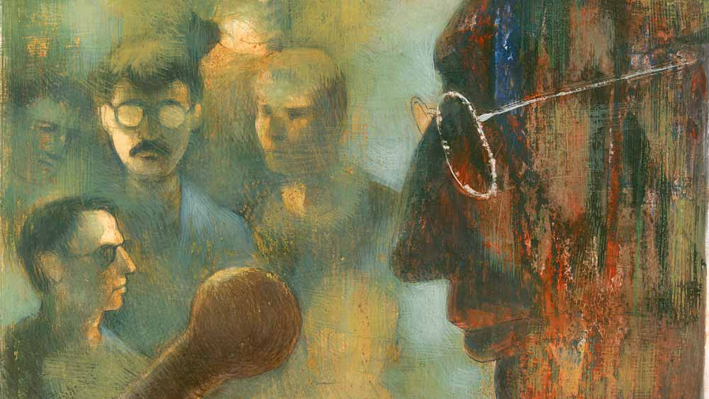

 
 <h1 align=center>নামকরণ</h1>
<h2 align=center>অমরেন্দ্র রায়</h2> সিনেমাহলের পাশের গলিটা দিয়ে বেরোলেন আবু হাসান। সামনেই রথবাজার। বাঁ দিকে লালগঞ্জ পঞ্চায়েত অফিস। এখানে আজ বড় মিটিং। মুর্শিদাবাদ জেলার পদ্মাপারের এই গ্রামে অনেক সমস্যা। তারই একটাকে নিয়ে আজকের আলোচনা। একটাই অ্যাজেন্ডা। তার উপর ভোটাভুটি, সিদ্ধান্ত গ্রহণ। বেলা বারোটায় আরম্ভ হবে মিটিং— পঞ্চায়েত প্রধান থাকবেন, তা ছাড়া নিমন্ত্রিত হয়েছেন বিভিন্ন প্রতিষ্ঠানের প্রতিনিধিবৃন্দ। লোকাল স্কুল-মাদ্রাসা এবং বিভিন্ন জাতিগোষ্ঠীর মোড়ল-মাতব্বরেরা থাকবেন। আবু হাসানকেও নিমন্ত্রণ করা হয়েছে। তিনি স্থানীয় হাই স্কুলের শিক্ষক। এই গ্রামেরই মানুষ। বছর চল্লিশ বয়স। ভাল ব্যবহারের জন্য সবাই তাঁকে সম্মান করে। তিনি হাই স্কুলের প্রতিনিধিত্ব করবেন। ভাল বক্তা। আলোচ্য বিষয়ে তাঁর মতামতের একটা দাম আছে।

পঞ্চায়েত অফিসের বিরাট হলঘর ভর্তি। ষাট-সত্তর জন হবে। সবাই সিট পায়নি। অনেকেই দাঁড়িয়ে আছে। এক দিকে তৈরি হয়েছে মঞ্চ। মঞ্চে আসীন স্থানীয় বিধায়ক ইব্রাহিম মোল্লা। তিনিই প্রধান অতিথি। তাঁর গলায় ইতিমধ্যেই গাঁদার মালা পরিয়ে দেয়া হয়েছে। সভাপতির আসনে বিডিও সাহেব। পাশে প্রধানসাহেব। ঘোষকের ভূমিকায় জয়েন্ট বিডিও। 

আবু হাসান মঞ্চে উঠে তাঁর নির্দিষ্ট চেয়ারে বসলেন। মাইক্রোফোন বেজে উঠল, “সাইলেন্স প্লিজ়! উপস্থিত ভদ্রমহোদয়গণ, সভা শুরু হতে চলেছে। আপনারা শান্ত হয়ে বসুন। বলে রাখি, লালগঞ্জের তিনটি রাস্তার নামকরণ বাকি আছে। অন্যান্য  রাস্তার নামকরণের প্রস্তাব-সহ চিঠিপত্র আমরা সরকারের কাছে বছরখানেক আগেই পাঠিয়েছি। এখনও কোনও জবাব আসেনি। এলেই  জানতে পারবেন। কিন্তু তার আগে যে তিনটি রাস্তার নামকরণ সম্বলিত প্রস্তাব আমরা পাঠাতে পারিনি, সেগুলোর সম্পর্কে আলোচনার জন্যই আজকের মিটিং। পুরনো লিস্টের কারও নাম আপনারা প্রস্তাব করবেন না! প্রয়াত বীর এবং বিপ্লবীদের নামই শুধু বিবেচিত হবে, মনে রাখবেন!”

হলের আওয়াজ থামল। মাথার ওপরে শুধু ফ্যানের আওয়াজ। মাইক্রোফোন জেগে উঠল, “চামাপাড়া থেকে বাজারের মেন রোড পর্যন্ত যে রাস্তা, তার নাম কী হবে, প্রস্তাব দিন।”

পিছনের সারির একটা হাত উঠল। জয়েন্ট বিডিও সাহেব বললেন, “নাম বলুন। উঠে দাঁড়িয়ে আপনার বক্তব্য বুঝিয়ে দিন।”

“আমি গোলাম রসুল, বাজারে দোকান আছে। আমি খাঁটি সরষের তেল বিক্রি করি‌।”

“বক্তব্য স্পষ্ট করে বলুন।”

“আমি আরও অনেক খাঁটি মাল বিক্রি করি সার, যেমন পোস্ত, আলু...”

“আরে থামুন থামুন! আপনি কী বিক্রি করেন, সেটা খাঁটি না ভেজাল, এ সব আমরা কিছুই জানতে চাই না। আপনি রাস্তার নাম সম্পর্কে কিছু যদি ভেবে থাকেন, সেটাই বলুন।”

“আমি সে কথাই যে কহাছি সার, আপনি বুলতে দিছেন কৈ!”

“নিন, বলে ফেলুন।”

“আমার দোকানের পাশেই বৈসতো মশা খলিফা, ডেলি মাল লিতো, আর বৈলতো, ‘তুমিও খাঁটি, তুমার মালও...’”

“থামুন তো মশাই!” রেগে উঠলেন জয়েন্ট বিডিও, “আপনাকে বলছি আগে নামটা প্রস্তাব করুন! আর তাড়াতাড়ি করুন, এখনও অনেক বক্তা আছেন।”

“নাম তো বুললাম সার!”

“আবার বলুন।”

“ওই রাস্তার নাম হোক, মশা খলিফা রোড।”

মশা খলিফা, মশা খলিফা— গুঞ্জন উঠল চার পাশে।

“মশা খলিফাটা কে? তার পরিচয় সংক্ষেপে দিন।”

গোলাম রসুল মাথা ঘুরিয়ে সব দিকে দেখল, তার পর শুরু করল, “আমার দোকানের পাশে বৈসতো বলেই তো অকে ভালো চিনহি। মশা খলিফার মতুন বীর ক’টা হয়!”

“ঠিক আছে, ওঁর বীরত্বের ব্যাপারটা বলুন।”

“তাইলে শুনেন, বদনা দিয়ে বাঘ মেরেছিল মশা খলিফা।”

“বদনা! বাঘ!”

“লালগঞ্জের সভভাই জানে, ওই হাসানমাস্টর, অকেই পুছেন না, উ-তো গাঁয়ের লোক, সভি জানে।”

বিডিওসাহেব এবং মঞ্চে-আসীন সবাইকে আবু হাসান অল্প কথায় জানিয়ে দিলেন, “মশা ছিলেন পাঠানপাড়ার লোক। ভারী চেহারা। নিরীহ, স্বল্পভাষী। বছর ষাটেক আগে, মশার যখন চব্বিশ-পঁচিশ বছর বয়স, তখনকার ঘটনা‌। এ অঞ্চলে গরিব মানুষের বাস বেশি ছিল। বাড়িতে অনেক লোকের বাথরুম থাকত না। বাড়ির বাইরে জঙ্গলে যেতে হত বাথরুমের কাজ সারতে। মশাও এক দিন গিয়েছে, হাতে বদনা। একটা পুকুরের ধারে বসেছে মশা। পুকুরে গভীর জল। তার ঢালু পাড়ে, মশার থেকে একটু দূরে, একটা গরু ঘাস খাচ্ছিল। সেই সময় জঙ্গল থেকে একটা বাঘ বেরিয়ে গরুটাকে আক্রমণ করল। গরু পিছলে পুকুরে নেমে পড়ল। প্রাণের ভয়ে মশাও পুকুরে। গরুর পিছে পিছে বাঘও ঝাঁপিয়েছে পুকুরে। মশা সাঁতার জানত না। গভীর জল। প্রাণ বাঁচাতে মশা গরুর লেজ চেপে ধরতে গিয়ে ধরে ফেলল বাঘটার লেজ। মশার ভারী শরীরের মরিয়া টানে বাঘ ডুবে মারা গেল। হাফপেট জল খেয়ে কোনও রকমে প্রাণে বাঁচল মশা। কিন্তু রটে গেল, বদনা‌ দিয়ে মশা বাঘ মেরেছে।”

হাসান মাস্টারের বর্ণনা শেষ হতেই হাততালিতে ফেটে পড়ল হল। সর্বসম্মতিক্রমে গৃহীত হল প্রস্তাব। বিডিও সাহেব নোট করে নিলেন।

ঘোষকের গলা শোনা গেল, “এ বার আমরা দ্বিতীয় রাস্তার জন্য নামের প্রস্তাব চাইছি। রাস্তাটা জ্ঞানদাচরণ মজুমদার স্ট্রিট থেকে থানার মোড় পর্যন্ত।”

মাঝের সারি থেকে একটা হাত উঠল, “বলব সার?” 

“উঠে দাঁড়িয়ে বলুন।”

“আমি বাহাদুরপুরের নন্দ হালদার। এক জন মহিলাকে, সরি, এক জন মহিলার নাম আমি প্রস্তাব করতে চাই।

“বেশ তো, তাঁর নামধাম, কীর্তি... এ সব বলুন!”

“এও সত্তর বছর আগের ঘটনা। ঠাকুরমার মুখে শুনেছিলাম। লালগঞ্জের অনেকেই জানে। উত্তরপ্রদেশের এক নবদম্পতি আমাদের পাড়ায় এসে কয়েক বছর ভাড়া ছিলেন। বৌটার নাম শ্যামকুমারী। দারুণ স্বাস্থ্য, গায়ের জোরও তেমনি। দু’মন ওজনের বস্তাকে হাতে তুলে নিজেই বারান্দা থেকে ঘরে নিয়ে যেত। ভয়ঙ্কর সাহস। বরটা কাজের ছিল না খুব একটা। খড়ের চাল আর মাটির দেয়ালের বাড়িতে ওরা থাকত। তখন আর পাকা বাড়ি কোথায়! সবই কাঁচা। ফলে চোরদের স্বর্গরাজ্য। মাঝে মাঝেই সিঁধ কেটে চুরি হত। এক নামকরা চোর এক রাতে টার্গেট করল ওই দম্পতির বাড়ি‌। সে দিন শিবরাত্রি‌। বরটা নাক ডেকে ঘুমোচ্ছিল। বৌটা রাত জাগছিল প্রহরে প্রহরে শিবের মাথায় জল ঢালার জন্য। চোর বুঝতে পারেনি, সিঁধ কেটে ঘরে ঢুকে বুঝতে পারল। কিন্তু তখন একটু দেরি হয়ে গেছে। সিঁধের ভিতর দিয়ে ফিরে যাচ্ছিল। পিঠের উপর এসে পড়ল শ্যামকুমারীর থাবা। তেলমাখা পিঠ দিয়ে স্লিপ করে নেমে থাবা আটকে গেলো চোরের হাফপ্যান্টের খাঁজে। চোরের পার্টনার বাইরে থেকে চোরের হাত ধরে টানছে, আর চোরকে ভিতরের দিকে প্যান্ট ধরে টানছে শ্যামকুমারীর বজ্রমুষ্টি। সে এক ভীষণ টাগ অব ওয়ার। শেষে প্যান্টের মায়া ত্যাগ করে নাঙ্গা চোর পালাল, শ্যামকুমারীর হাতে থেকে গেল চোরের কালো হাফপ্যান্ট। সারা দিন উপোস করার পরও এই সাহস, এই শৌর্য, এই বীরত্বের স্মরণে, আমি প্রস্তাব রাখছি, রাস্তাটার নাম রাখা হোক, শ্যামকুমারী সরণি।”

আবার হাততালি, সর্বসম্মতিক্রমে প্রস্তাবগ্রহণ নির্বিঘ্নে মিটল।

বেজে উঠল মাইক্রোফোন, “আপনাদের ধন্যবাদ, আর মাত্র একটা রাস্তার নামকরণ বাকি আছে। রাস্তাটা হল পাহাড়পুর রোড থেকে চ্যারিটেবল ডিসপেনসারির মোড়। আপনাদেরকে অনুরোধ করব, বীর ও বীরাঙ্গনার নামে অলরেডি প্রস্তাব গৃহীত হয়েছে। এ বার অন্তত এক জন বিপ্লবীকে সুযোগ দিন।”

সামনের সারি থেকে এক জন উঠলেন, “আমি ভোম্বল আগরওয়াল, মারোয়াড়িপট্টিতে থাকি। আমি বিপ্লবী সৃজিত সাহার নাম প্রস্তাব করছি।”

“সৃজিত সাহা কে? তাঁর বিপ্লবী চরিত্রের প্রমাণ দিন।”

“উনি গণসঙ্গীত গায়ক। বিপ্লবী গান গাইতে‌ন। তা ছাড়া তো কিছু জানি না সার!”

“এ কথা মেনে নেওয়া মুশকিল। বিপ্লবী গান গাইলেই কি আর কেউ বিপ্লবী হয়? রবীন্দ্রসঙ্গীত গাইলেই কি মানুষ রবীন্দ্রনাথ হয়ে যায়? আপনি বসুন মিস্টার আগরওয়াল।”

এ বার চেয়ার ছেড়ে উঠলেন আবু হাসান মাস্টারমশাই, বললেন, “আমি হাই স্কুলের শিক্ষক আবু হাসান। ওই স্কুলেরই ছাত্র ছিলাম। কেমিস্ট্রির শিক্ষক শ্রদ্ধেয় রমেশচন্দ্র রায় আমার শিক্ষক ছিলেন। আমি প্রস্তাব রাখছি সেই মাস্টারমশাইয়ের নামে তৃতীয় রাস্তার নামকরণ হোক। তিনি ছিলেন শিক্ষাব্রতী। ছাত্রদের কষ্ট বুঝতেন এবং সেগুলো দূর করার জন্য সদর্থক ভাবনাচিন্তা করতেন। ভাল লেখাপড়া হবে বলে অনেক সচ্ছল ফ্যামিলির ছেলেরা ভাল স্কুল-কলেজ খুঁজতে লালগঞ্জের বাইরে যেত। গরিব ছাত্ররা যেতে পারত না। এই সমস্যা সমাধানের জন্য তিনি ব্যক্তিগত উদ্যোগ নিতেন। যারা সমাজ বদলাবে, বিপ্লব আনবে, যারা জাতির ভবিষ্যৎ— তাদের তিনি তৈরি করতেন। এক দিনও স্কুল কামাই করতেন না। কেমিস্ট্রির মতো কঠিন সাবজেক্ট তিনি ছাত্রদের হাতে ধরে বোঝাতেন। খেলাধুলায় উৎসাহ দিতেন। ফুটবল খেলায় টিমে এগারো জন থাকে, কিন্তু সবাই গোল করে না, কেউ কেউ গোলমেকার থাকে। শ্রদ্ধেয় মাস্টারমশাই সেই গোলমেকার ছিলেন। শৃঙ্খলাপরায়ণ, পরিশ্রমী ও অতুলনীয় দূরদর্শী ব্যক্তিত্ব। স্থানীয় ছাত্ররা ভাল করেই জানে। আমি অনুরোধ করব, আপনারা আমার পয়েন্টটা ভেবে দেখুন এবং শিক্ষক রমেশচন্দ্র রায়ের নাম প্রস্তাব করুন!

অল্প হাততালি পড়ল।

এ বার উঠে দাঁড়ালেন স্বয়ং চিফ গেস্ট, এমএলএ ইব্রাহিম মোল্লা। মাইক্রোফোন টেনে নিয়ে শুরু করলেন, “এই মালা ক্যানে আপনারা আমার গলায় পরিহেছেন! এই মণিহার আমাকে নাহি সাজে। এ আপনাদের মালা, আপনারা লিয়ে যান, আপনারাই যোগ্য, আমি তো আহাম্মুক অযোগ্য।” বলেই মালাটা খুলে টেবিলের ওপর নামিয়ে রাখলেন। বোঝা যাচ্ছে, গত ইলেকশনের জন্য রেডি-করা বক্তৃতার গৌরচন্দ্রিকা এখনও মুখস্থ রেখেছেন।

একচোট হাততালি পড়ল। দম নিয়ে বললেন, “ওই যে হাসানমাস্টর আপনাদেরকে ভুল বুঝিয়ে গেলেন— আগাগোড়াই ভুল। কুন দিক দিয়ে রমেশমাস্টর বিপ্লবী? সে এক দিনও মিছিলে গেলছে? ঝান্ডা তুলে ইনকিলাব জিন্দাবাদ বুলেছে না পুলিশ পিটিয়েছে? বিপ্লবী হওয়া সহজ কথা লয়। অর  থেকে আমাদের মাদ্রাসার সাজ্জাদ মিঁয়া বহুত বড় বিপ্লবী। এক বার ডেভেলপমেন্ট ফান্ডে হাজার টাকা দিয়েছিল। সে খবর এরই ভিতরে ভুলে গেলেন? তা ছাড়া ছাত্রদের লেগে তার কত দরদ। আমাকে বুলেছিল, শিক্ষামন্ত্রীকে দিয়ে কেশব নাগের অঙ্ক বই আর পি কে দে সরকারের ইংরেজি বই হটিয়ে দিতে। ছাত্রদের পাশের হার বেড়ে যাবে। পাশের হার আরও বাড়ানোর জন্য বুলেছিলেন, পাশ নম্বর ৩০ থেকে ২০ করে দিতে। কত বড় ভাবনা, কত বড় বিপ্লবী চেতনা! এক বার ভাবেন দেখি! তেবে নেশাভাং একটু বেশি ছিল, তাই বেশি দিন বাঁচলে না। আমি চাই ওই বিপ্লবী সাজ্জাদভাইয়ের নামেই রাস্তার নাম হোক।”

বসে পড়লেন এমএলএ সাহেব। হাততালি পড়ল অনেক। প্রধানসাহেবও হাততালি দিলেন।

আবার জয়েন্ট বিডিও সাহেব ঘোষণা করলেন, “অবস্থার পরিপ্রেক্ষিতে আমরা মাননীয় এমএলএ সাহেবের সম্মানীয় প্রস্তাব আমাদের রেকর্ডে লিপিবদ্ধ করলাম। এর পরে অর্থাৎ বিডিও সাহেবের সিগনেচারের পর এটা এসডিও অফিসে যাবে সইয়ের জন্য, তার পর সেটাকে এনডর্স করবেন ডিএম সাহেব। এ সব সইসাবুদ হয়ে গেলে তবে প্রস্তাব যাবে সি এম-এর অফিসে। কিন্তু একটা কথা আপনাদের জানিয়ে দেওয়া বোধহয় আপ্রাসঙ্গিক হবে না যে, এই সাহেবরা অঙ্ক আর ইংরেজির ওই বইদুটো পড়েই পাশ করেছেন, চাকরি পেয়েছেন। পাশমার্কও দুম করে কমিয়ে দিলে নানা সমস্যা  হতে পারে। ফলে এই তৃতীয় প্রস্তাবের গুরুত্ব ও মহত্ত্বকে তাঁরা কতটুকু বিবেচনা করবেন, সে ব্যাপারে প্রশ্ন থেকেই গেল। তবে এই মিটিংয়ে আমরা মাননীয় এমএলএ সাহেবের প্রস্তাবটিই রেকর্ডে রাখলাম। এ ব্যাপারে অন্য দু’টি প্রস্তাবকে বাতিল করা হল। সভাপতির অনুমতি অনুসারে আজ মিটিং এখানেই শেষ।”

হল থেকে বাইরে এলেন আবু হাসান। ক্রমশ রোদ মুছে দিচ্ছে আকাশের মেঘ। জোরে বৃষ্টি নামতে পারে‌। প্রিয় ও যোগ্য শিক্ষকের নাম বিবেচিত হল না একটা রাস্তার জন্য। তা নিয়ে মনখারাপটা দূরে সরাতে চেষ্টা করছেন আবু হাসান। ভাবছেন, সব নাম বাইরের রাস্তায় শোভা পায় না। মানুষের মনের ভিতরেও তো একটা দীর্ঘ প্রশস্ত রাস্তা থাকে। কিছু নাম সে জন্য তোলা থাকা ভাল।