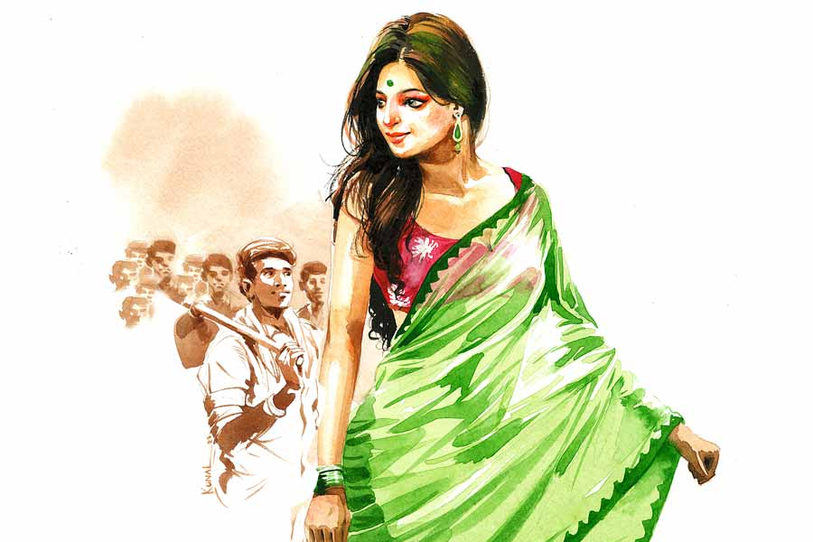

 
 <h1 align=center>নায়িকা দর্শন</h1>
<h2 align=center>সুজিত বসাক</h2> পথচলতি এক জন মানুষকে দাঁড় করিয়ে রুবেল জিজ্ঞেস করল, “কয়ডা বাজে দাদা?”

পথচারী ঘড়ি দেখে জবাব দিল, “দশটা দশ।”

রুবেল বসে পড়ল সামনের ডাঁই করা ভাঙা ইটের ওপর। ব্যাপারটা কিছুতেই মাথায় ঢুকছে না। ফোন করে যে একটু জানবে, তারও উপায় নেই। কমদামি একটা ফোন তার আছে বটে, কিন্তু সেটাও জলে ভিজে অকেজো হয়ে গেছে ক’দিন আগে। তবে কি আজ কাজ বন্ধ? রাজমিস্ত্রি কানাইদা, সফিক ভাইজান, কারও কোনও পাত্তা নেই। কাজ হলে এত ক্ষণে তো ওদের চলে আসার কথা। এত বেলা হয়ে গেল, আর কখন আসবে? অধৈর্য হয়ে ওঠে রুবেল। উসখুস করে। উদ্দেশ্যহীন ভাবে পায়চারি করে এ দিক-ও দিক।

জোগাড়ের কাজ করে রুবেল। বাপ-চাচাও তা-ই করত। হতদরিদ্র পরিবার ওদের। সামান্য কিছু জমি আছে। চাষবাস আর টুকটাক কাজকর্ম, এ সব দিয়েই কোনও রকমে চলে সংসার। ক’দিন হল ইরিগেশন অফিস বাংলোর পাঁচিল মেরামতির কাজ চলছে। সেই কাজেই এসেছে রুবেল। এখন বুঝতে পারছে বাকিরা সবাই জানে আজ কাজ হবে না, শুধু রুবেলই জানে না। ওরা সবাই শহরের আশপাশে থাকে। রুবেল থাকে অনেকটা দূরের গ্রামে। গতকাল তো একটুখানি জানাতে পারত! ওদের আর কী, একটা দিন নষ্ট হলেও কিছু যায় আসে না। আগে জানলে অন্য একটা কাজ ধরতে পারত। এত বেলায় কে আর কাজে নেবে? বুকে অভিমান জমে রুবেলের। বয়স বাড়ার সঙ্গে সঙ্গে সে এটাও বোঝে, জগৎ-সংসারে গরিবের অভিমানের কানাকড়ি মূল্য নেই।

হতাশ মনে পাঁচিলের ধারে রাখা সাইকেল নিতে যাচ্ছিল রুবেল, এই সময় কে যেন পিছন থেকে বাজখাঁই গলায় হেঁকে উঠল, “অ্যাই! তুই ব্যাটা এখানে কী কচ্ছিস?”

রুবেল পিছন ফিরে তাকিয়েই চমকে উঠল। পেটের মধ্যে গুড়গুড় করতে লাগল। দশাসই চেহারার এক জন পুলিশ কনস্টেবল। পুলিশ দেখলে খুব ভয় পায় রুবেল, সে যেমন পুলিশই হোক। ছোটবেলায় দেখেছিল পাশের বাড়ির নসিবচাচাকে এক দল পুলিশ প্রচণ্ড মারতে মারতে তুলে নিয়ে গিয়েছিল। অবচেতন মনে সেই দৃশ্য এমন ভাবে গেঁথে গেছিল, আজও সেটা যায়নি। উপরে উপরে সাহস দেখানোর চেষ্টা করলেও ভিতরটা শুকিয়ে থাকে ভয়ে।

রুবেল তোতলাতে তোতলাতে নিজের বক্তব্য পেশ করে বলল, “ফ্যাসাদে পড়ছি ছার। কী করমু ভাইব্যা পাইতাছি না। এহন বাসায় ফিরলে বৌয়ের মুখঝামটা খাইতে হইব। কিন্তু না ফিরাই বা যামু কনে!”

ফিক করে হেসে উঠল কনস্টেবল সাহেব, “বৌকে ভয় পাস গাধা, কেমন পুরুষ রে তুই? চেহারা তো বেশ গাট্টাগোট্টা। বৌ কি খুব দজ্জাল?”

“আপনে বুজি পাননে ছার!” সরল মনে বলে ফেলে রুবেল। আর বলেই বুঝতে পারে ফাউল হয়ে গেছে, এ বার পেলান্টিক খেতে হবে।

হাসে কনস্টেবল, “আমাকে মেনিবেড়াল পেয়েছিস? প্রথম রাতেই মেরে রেখেছি রে পাগলা, ট্যাঁ ফো করবে সে জো নেই।”

“কনে আপনে আর কনে আমি ছার! আপনের সামনে কেডায় দাঁড়াবে? এ বার তয় আমি আহি ছার?” বলে রুবেল।

“আরে যাবি যাবি, অত তাড়া কিসের! তোর কাছে বিড়ি আছে?”

“আছে ছার,” চট করে মিথ্যে মুখে আসে না রুবেলের। পুলিশবাবুকে বিড়ি দেওয়ার ইচ্ছে না থাকলেও ট্যাঁক থেকে বিড়ির প্যাকেট বার করে। বিড়ি ধরিয়ে পুলিশবাবু বলল, “আজ তোদের কাজ কেন বন্ধ জানিস? ওদের দোষ নেই। হঠাৎই হয়ে গেছে ব্যাপারটা, সাহেবের অর্ডার।”

রুবেল অবাক হয়ে বলল, “ক্যান, আপনে জানেন?”

হাসল পুলিশবাবু, “জানি বলেই তো এসেছি। আজ এখানেই ডিউটি আমার। বাংলা সিনেমার নায়িকা মৃদুলা সেন আসবে এখানে। সমাজবন্ধু দলের হয়ে ভোটে দাঁড়িয়েছেন, সেই প্রচারের জন্য। প্রথমে এখানে আসার কথা ছিল না। যাই হোক, দুপুরে এই বাংলোয় আসবে খাওয়াদাওয়া ও বিশ্রামের জন্য।”

মোবাইল থেকে একটা ছবি বের করে দেখিয়ে পুলিশবাবু রুবেলকে বলল, “দ্যাখ, চিনিস কি না…”

উত্তেজিত হয়ে উঠল রুবেল, বলল, “ইনার ছেনেমা তো আমি দ্যাখছি ছার! বলেন কী, এনায় অ্যাইসবে এহানে?”

“তবে কি আমি মিথ্যে বলছি হতচ্ছাড়া! একটু পরেই দেখবি লোকের বহর। আমাদের ডিউটি করতে হবে যাতে উটকো ছেলে ছোকরা ঢুকে পড়ে তাকে বিরক্ত করতে না পারে, বুঝলি?”

রুবেল বলে উঠল, “কাজকাম তো ছার কিছুই হইল না। এহন বাসায় ঢুকলি বৌয়ের ক্যাটর ক্যাটর শুনতে হইবো সারা দিনমান। ভাবত্যাছি আর কিছু ক্ষণ থ্যাইক্যা উনারে দেইখ্যাই যাই। কী বলেন ছার?”

হাসিতে ফেটে পড়ল পুলিশবাবু, “তোর তো দেখি রস কম নয় রে ছোকরা! বলি পয়সা না নিয়ে দেরি করে বাড়ি ফিরলে সামলাতে পারবি তো তাকে?”

লজ্জা পায় রুবেল, “অমনটাও দজ্জাল নয় ছার। মনডা নরম। পেথমে এট্টু চিল্লাচিল্লি করবে ঠিকই, তার পরে একা একাই চুপ হইয়্যা যাবে। তয় মুখ লাগাইলে খুব খেইপ্যা যায়। আসলে অভাবের সংসার তো ছার, অভাবে অভাবে খিটমিটা হইয়্যা গেছে। এক দিন এট্টু সহ্য করমু।”

“তোর যেমন ইচ্ছে। এমন সুযোগ তো প্রতিদিন পাবি না। দেখেই যা। আমি এ বার ডিউটিতে লেগে পড়ি।”

পুলিশবাবু চলে গেল সদর গেটের দিকে। রুবেল বকুল গাছের ছায়ায় বসে একটা বিড়ি ধরাল। বৈশাখ মাসের সকাল। চাঁদি-ফাটা রোদ্দুরে দু’দণ্ড বাইরে দাঁড়িয়ে থাকার উপায় নেই। জলের বোতল বার করে জল খেল, তার পর ও পাশের টিউবওয়েল থেকে খালি বোতল ভর্তি করে নিয়ে এল। সদর গেটের দিকে এক বার তাকিয়ে দেখল, ধীরে ধীরে ভিড় জমছে। পুলিশবাবুর সঙ্গে দেখা হতেই তিনি মুচকি হাসলেন। এই প্রথম কোনও পুলিশের সঙ্গে সামনাসামনি কথা বলল রুবেল। অনেকটা ভয় কেটেছে আজ। এই পুলিশবাবুর চেহারা জাঁদরেল হলেও মারকুটে ভাবটি নেই। হেসে হেসে কথা বলেন, রসিকতাও করেন। মোট কথা ভাল লেগে গেছে রুবেলের।

বেলা বাড়ার সঙ্গে সঙ্গে পাল্লা দিয়ে ভিড়ও বাড়তে লাগল। একটা বাজার একটু পরেই এক সঙ্গে অনেকগুলো গাড়ি সদর রাস্তায় এসে দাঁড়াল। ‘মৃদুলা!’ ‘মৃদুলা!’ চিৎকারে কান পাতা দায় হয়ে উঠল। সাদা রঙের একটা গাড়ি থেকে নামল নায়িকা মৃদুলা সেন। হেসে হাত নাড়তে নাড়তে বাংলোর ভিতর দিকে চলে গেল রুবেলের সামনে দিয়েই। রুবেলের মুখে তখন বিরাট হাঁ, চোখে ঘোর। মানুষ এত সুন্দর হয়! ঠিক যেন স্বর্গের পরি। কচি কলাপাতা রঙের শাড়িতে সৌন্দর্য যেন আরও বেড়ে গেছে। মৃদুলা বাংলোর একেবারে ভিতরে না ঢোকা পর্যন্ত চোখের পলক পড়ল না রুবেলের।

আবার যখন বকুল গাছের ছায়ায় এসে বসল, মনের মধ্যে তখনও অদ্ভুত ঘোর। এখন বাড়ি ফিরে যাওয়া যায়। কিন্তু মন চাইল না। নাছোড়বান্দা মনের তাড়নায় ঠিক করল, ফেরার বেলায় এক বার দেখে তবেই যাবে। আজ নাজমার কোনও মুখঝামটাই তার গায়ে লাগবে না।

আগের বার সঙ্কোচবশত কিছুটা পিছনে দাঁড়িয়েছিল। এ বার আগেভাগে গিয়ে সামনের লাইনে গিয়ে দাঁড়িয়ে পড়ল। খুব কাছ থেকে দেখে জীবন সার্থক করবে। ঠিক তখনই মনে পড়ল, জরাজীর্ণ, খসখসে চামড়ার অভাবতাড়িত নাজমার মুখ। মনে হল, উফ কী কুৎসিত! জোর করে মনটাকে টেনে এখানে ফেলার চেষ্টা করল। হোক ক্ষণিকের দেখা, তবু মনে হল, বেঁচে থাকার কিছুটা রসদ তো ঘরে তোলা যাবে।

যথাসময়ে নায়িকা বাংলো থেকে বেরোতেই আবার উল্লাসে ফেটে পড়ল দর্শক। ‘মৃদুলা!’ ‘মৃদুলা!’ ধ্বনিতে কেঁপে উঠল আকাশ বাতাস। এ বার সে পরেছে আকাশি নীল রঙের একটা শাড়ি। কেঁপে উঠল রুবেলের ভেতরটা। উরিব্বাস! এ বার তাকে আরও বেশি সুন্দর লাগছে। চুম্বক যেমন লোহাকে সাঁটে, রুবেলের চোখ দুটো তেমনই সেঁটে গেল মৃদুলার উপর। ধীরে ধীরে হাত নাড়তে নাড়তে আসছে সে। পুলিশ লাঠি দিয়ে ব্যারিকেড তৈরি করে দর্শকদের আটকে রেখেছে। তবুও কি আটকানো যায়! সবাই একটু ছুঁতে চায় স্বপ্নের নায়িকাকে। রুবেলের ঠিক সামনে সে! একটা ঘোরের মধ্যে হাত বাড়িয়ে দিল রুবেল। তখনই ঘটে গেল অনর্থ। পিছন দিক থেকে এমন একটা চাপ এল, রুবেল সামলাতে না পেরে পুলিশের ব্যারিকেড ভেঙে সামনের দিকে ছিটকে গেল। পড়বি তো পড় সোজা নায়িকার গায়ের উপর। দু’জনেই ধরাশায়ী। মুহূর্তের জন্য অদ্ভুত এক আনন্দের অনুভূতি খেলে গেল রুবেলের শরীরে! পরক্ষণেই টের পেল, সাঁড়াশির মতো দুটো হাত তার গলা চেপে ধরে টেনে তুলছে। যন্ত্রণায় চিৎকার করে উঠল রুবেল।

ও দিকে মাটি থেকে উঠে নায়িকা তীব্র গলায় চিৎকার করে বলছে, “উফ! লোকটার গায় কী বাজে গন্ধ! আমি তখনই বলেছিলাম এ সব করতে যাবেন না। আপনার ভোট প্রচার করতে এসে প্রাণটা চলে গেলে, তার দায় নিতেন? লোকটি যে আমাকে মারতে আসেনি তার কোনও গ্যারান্টি আছে? এই আপনাদের সিকিয়োরিটি? ডিসগাস্টিং…”

লোকাল ক্যান্ডিডেট হতভম্ব। কোনও রকমে বলল, “আপনি ভাববেন না ম্যাডাম, আমি দেখছি। বুঝতে পারছি বিরোধীদের চক্রান্ত। ভাবতে পারিনি এতটা নীচে নামবে। আপনার মতো সেলেব্রিটিকে এ ভাবে হেনস্থা… আমি শেষ দেখেই ছাড়ব। চোট টোট লাগেনি তো ম্যাডাম…”

তিন-চার জন পুলিশ চ্যাংদোলা করে জিপে নিয়ে ফেলল রুবেলকে। থানায় নিয়ে গিয়ে শুরু হল বেধড়ক ঠ্যাঙানি। রুবেল বলারই সুযোগ পেল না সে কিছু করেনি, হয়ে গেছে। যখন বলার সুযোগ পেল, তখন সে আধমরা। এক জন অফিসার বলল, “এ শালা হয় একেবারে ইনোসেন্ট, নয়তো দাগি আসামি। রাতটা লক-আপে ফেলে রাখ। কাল সকালে কুন্ডুলি বার করলেই বোঝা যাবে কোন জলের মাছ।”

গভীর রাত। গেট খোলার শব্দে চমকে উঠল রুবেল। আবার আসছে মারতে? মরার মতো পড়ে রইল। আর সহ্য করার ক্ষমতা নেই শরীরে। ওরা ঢুকতেই পরিচিত একটা কণ্ঠস্বর কানে এল। সেই পুলিশবাবু না?

অল্প চোখ খুলে দেখে, সেই পুলিশবাবুই বটে। সঙ্গে বড়বাবু আর ওদের ঠিকাদার।

পুলিশবাবু বলল, “তখন আমি অন্য দিকে ছিলাম। এক জন মোবাইলে ছবি দেখাল। দেখেই চিনতে পারলাম। বিবেকে লাগল, বুঝলি। মনে হল তুই এমন কাজ করতে পারিস না। বড়বাবুকে বললাম সব। কিন্তু তারা মানবে কেন! তবে বড়বাবু বললেন, সে রকম পরিচিত কাউকে পেলে নিজের দায়িত্বে ছেড়ে দেবেন। খুঁজে খুঁজে বার করলাম তোর ঠিকাদারকে। তাকে ধরে আনার পর বড়বাবু ছেড়ে দিলেন। এ বার তুই বাড়ি যেতে পারিস। আর হ্যাঁ, তার সাইকেলটা থানায় এনে রেখেছি। যেতে পারবি তো? এক জন বলল, সবাই খুব বাজে ভাবেমেরেছে তোকে…”

গভীর কৃতজ্ঞতায় পুলিশবাবুর পা জড়িয়ে ধরে কেঁদে ফেলল রুবেল, “পারুম ছার। আমারে পারতে হইবই। উদিকে বৌ হয়তো চিন্তায় চিন্তায় মইরা যাইত্যাছে।”

রাস্তায় নেমে রুবেল দেখল শহর ঘুমোচ্ছে। শহর ছাড়িয়ে নিজের গ্রামের রাস্তা ধরার পর দেখল আকাশে একটা টুকটুকে চাঁদ ঝুলছে। কী সুন্দর তার ছটা! মন ভুলিয়ে দেয়। অমোঘ দুর্নিবার এক আকর্ষণে টেনে নিতে চায় সমস্ত সত্তাকে। ঠিক তখনই মনে পড়ে কুৎসিত একটা মুখ। যার রূপ নেই, ছটা নেই, নিষ্প্রভ, নিজস্ব কোনও আকর্ষণ নেই। কোনও রকমে একটা নারীসত্তা নিয়ে টিকে আছে নিজের ক্ষুদ্র পৃথিবীর বুকে। ক্ষুদ্র সত্তা দিয়ে প্রাণপণে আগলে রাখার চেষ্টা করে যাচ্ছে নিজস্ব পৃথিবীটা। রুবেলের মনে হল, নির্ভীক সাধনায় মগ্ন থাকা সেই নারীকে সে শুধুই অবহেলা আর অবজ্ঞা দিয়েছে। নাজমা কি শুধু তার অবহেলারই যোগ্য? সব পুরুষই তার মতোই হয়তো, চাঁদের আলোয় মোহিত হয়ে কাছের আলোটাকে ফিকে মনে করে।

বাড়িতে দুশ্চিন্তায় অর্ধেক হয়েছিল নাজমা। রুবেল ফিরতেই ওর বিধ্বস্ত চেহারা দেখে বৌ কাঁদতে কাঁদতে বলে, “কী হইছে তোমার, কেডায় করছে এমন?”

ক্লিষ্ট হাসি হাসে রুবেল, “শাস্তি পাইছি, পুলিশ দিছে। এহন ঘরে চল। খুব খিদা পাইছে।”

ক্ষুদ্র পৃথিবীর এক নারী কর্তব্যের তাড়নায় ব্যস্ত হয়ে ওঠে, “খাইবা চলো। আমি খাই নাই। তোমারে ছাড়া খাই ক্যামনে?”

রূপহীনা নাজমাকে বড় সুন্দর লাগে আজে। ঘরে যেতে যেতে আনমনে এক বার আকাশের দিকে তাকায় রুবেল। মোহিনী চাঁদ সেখানে তীব্র আলোর মায়া ছড়িয়ে হাতছানি দেয়। মনকে টানে।

রুবেল ফিরিয়ে দেয় সে আহ্বান।