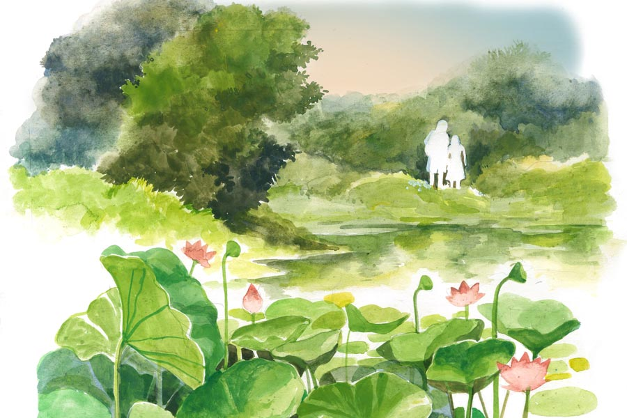

 
 <h1 align=center>নাস্তিকের পুজো</h1>
<h2 align=center>বিপুল দাস</h2> পুব আকাশ তখনও অন্যান্য দিকের মতোই অন্ধকার। দিগ্‌ভ্রান্ত মানুষের পক্ষে বোঝা মুশকিল কোনটা পুব দিক। একটু বাদেই যখন পুবের কালোয় প্রথমে ছাইয়ের মতো, তার পর আমানির রং ধরবে, তখন দিশেহারা পথিকের বুঝতে আর অসুবিধে হয় না কোনটা পুব দিক। আর, এক বার পুব দিক বুঝতে পারলে, অন্য দিক সহজেই টের পাওয়া যায়। হারিয়ে গেছি আমি— এই ভয় কেটে যায়। সবাই জানে পুবে মুখ করে দাঁড়ালে বাঁ হাতে উত্তর আর ডান হাতে দক্ষিণ। আর, পুবে মুখ হলে পশ্চিম হবে পিছনে, এ তো সহজ কথা। স্বরাজ সেন একটু বাদেই বুঝতে পেরেছিলেন কোনটা পুব দিক। আসলে এ জগতে চলাফেরা করতে হলে একটা চিহ্ন চাই। হলুদ দোতলা, মাইক্রোওয়েভের টাওয়ার, পঞ্চায়েত অফিস, হেলা বটতলা। তার সাপেক্ষে সংসারে মানুষের নিশ্চিন্তে নড়েচড়ে বেড়ানো। স্বরাজ সেন ইদানীং সেই চিহ্নগুলো আর খুঁজে পাচ্ছিলেন না।

সাতচল্লিশের পনেরোই অগস্ট জন্ম, তাই স্বরাজ। এখন আর নাম ধরে তাঁকে ডাকার মতো কেউ নেই। পুরনো বন্ধুদের দু’-এক জনের নাম মনে পড়ে। হাইস্কুলের সুরঞ্জনের নাম শুধু মনে আছে। আয়নার সামনে দাঁড়ালে কপালের কাটা দাগ দেখলে হঠাৎ কখনও সুরঞ্জনের কথা মনে পড়ে। ডাংগুলির গুলি এসে ভুরুর উপরে লেগেছিল। একটু বাদেই চোখে রক্ত জমে টকটকে লাল হয়ে উঠেছিল। কিছুই দেখতে পাচ্ছিলেন না সেই চোখে। অনেক দিন ভুগেছিলেন সেই চোখ নিয়ে। ওই দাগ মাঝে মাঝে সুরঞ্জনের কথা মনে করিয়ে দেয়। আর কিছুই মনে পড়ে না।

একা একা বাড়ি থেকে বেরোনো তাঁর বারণ। বিধুডাক্তার ভাইবৌ সুভদ্রাকে সাবধান করে দিয়েছে। রাস্তাঘাট চিনতে না পেরে কোথায় চলে যাবে। খারাপ লোকের পাল্লায় পড়লে হাতের আংটি, মানিব্যাগের টাকা, সব হাতিয়ে নেবে। তা ছাড়া, বেপাড়ায় অচেনা লোককে এ দিক-ও দিক ঘোরাঘুরি করতে দেখলে অন্য কিছুও সন্দেহ করতে পারে। উনি হয়তো ঠিকমতো উত্তর দিতে পারবেন না। তখন আরও ঝামেলা হবে।

পঞ্চমীর রাতে বারান্দায় বসে ছিলেন স্বরাজ সেন। তাদের গলি পুরোটা আলো দিয়ে সাজানো। দূর থেকে সাউন্ডবক্সে গান ভেসে আসছিল। ভাগ্যিস মণ্ডপ বেশ দূরে। আজকাল সাউন্ডবক্সে এত জোরে শব্দ হয়, ঘরবাড়ি কাঁপতে থাকে। বুকের ভিতর হৃৎপিণ্ডে গিয়ে ধাক্কা মারে। আলো আর গান ছাপিয়ে খুব মৃদু একটা গন্ধ তাঁর নাকে এল। শিউলি ফুলের গন্ধ। গন্ধটা ক্রমশ তাঁর বুকের ভেতর ছড়িয়ে পড়ছিল। ফুসফুস ভরে উঠল শিউলি ফুলের গন্ধে। ক্রমে গন্ধটা তীব্র হয়ে মাথার দিকে যাচ্ছে। মাথায় ছড়িয়ে পড়তেই কী যেন একটা কথা মনে পড়তে পড়তে হারিয়ে যাচ্ছিল। খুব অস্বস্তি হচ্ছিল তাঁর। আজকাল তাঁর মাঝে মাঝে এ রকম হয়। পুরনো কোনও নাম, কোনও ঘটনা মনে পড়তে পড়তে হারিয়ে যায়। আবার কিছু কথা, কিছু দৃশ্য— মনে হয় এটা যেন তাঁর জীবনে আগে কখনও ঘটে গেছে। ওই যে গলি থেকে একটা বৌ বেরিয়ে একটা লোকের হাতে ছাতা দিয়ে কী যেন বলল, তাঁর গেটের উল্টো দিকে বসা মুচির সামনে দাঁড়িয়ে একটা লোক হাত নাড়িয়ে কথা বলছে— চেনা, কী ভীষণ চেনা মনে হয় এই দৃশ্য। আগে কি কখনও তিনি দেখেছিলেন, না কি গতজন্মের কথা! নাঃ, পরকাল, জন্মান্তর, স্বর্গ, নরক, পাপ, পুণ্য, জাতিস্মরবাদ, ঈশ্বর— এ সব তিনি কোনও কালেই বিশ্বাস করেননি। কে জানে, তবু কেন এ রকম মনে হয় তাঁর।

“সুভদ্রা, আমি একটু বেরোচ্ছি। চিন্তা কোরো না, এখনই ফিরব।”

“এত রাতে কোথায় বেরোবেন বড়দা? কিছু এনে দিতে হবে? আপনার ভাইকে বলছি এনে দেবে।”

“এই তো, পাড়ার মণ্ডপ থেকে এক বার ঘুরে আসব। ঠাকুর বোধহয় এসে গেছে। ঢাকের শব্দও পেলাম। দুগ্‌গা মাইকি জয় শুনলাম। ভেবো না, পাড়ার ভেতরেই তো। সবাই চেনাশোনা ওখানে।”

সন্ধে সাতটা নাগাদ বাড়ি থেকে বেরিয়েছিলেন তিনি। ভাইবৌ সুভদ্রার মনটা খুঁতখুঁত করছিল। বিয়ে-থা করেননি মানুষটা। যে সময়ে বিয়ে করে সংসারী হওয়ার কথা, তখন তিনি বিপ্লবের ডাক শুনে ঝাঁপিয়ে পড়েছেন। অথচ সবাই জানত ব্রিলিয়ান্ট ছাত্র স্বরাজ সেন ভবিষ্যতে একটা কিছু করে দেখাবে। বসন্তের বজ্রনির্ঘোষে ভরসা রেখেছিলেন স্বরাজ। বহু দিন বাড়ি ছেড়ে থাকার পর বন্দিমুক্তি পর্বে এক দিন ফিরে এসেছিলেন। শরীর ভেঙে গেছে। নানা রকম অসুখ। চার দিকে ভাঙনের শব্দ শুনতে শুনতে মনও ভেঙে গেছে। চুপচাপ ঘরে বসে থাকতেন।

“দাদা, একটু বাইরে ঘুরেও তো আসতে পারো। এ ভাবে থাকলে শরীর আরও পড়ে যাবে...” ছোটভাই ধীরাজ এক দিন বলেছিল।

“ছোটু, এ রকম কেন হল বল তো! কোথাও কি ভুল হয়েছিল আমাদের! বল তো, কী ভাবে কখন আমরা জনগণ থেকে বিচ্ছিন্ন হয়ে গেলাম! সে কি মূর্তি ভাঙা? সে কি নিরীহ কনস্টেবলের মৃত্যু? কেউ কি ক্রমাগত আমাদের মিথ্যে মুক্তাঞ্চলের স্বপ্ন দেখিয়ে গেছে, আর আমরা রাত জেগে দেওয়ালে সে কথা লিখেছি! রাত জেগে গোপন জায়গায় বসে স্টেনসিল কাটতাম মাও সে-তুঙের। খুঁজে দেখ, এখনও অনেক দেওয়ালে সেই ছবি পাবি। মাথায় সেই বিখ্যাত লাল তারা দেওয়া টুপি। আমরা তো বিশ্বাস করেছিলাম জনগণতান্ত্রিক বিপ্লবই ভারতবর্ষের মানুষের মুক্তির একমাত্র পথ...”

দাদার অসহায় মুখের দিকে এক বার তাকিয়ে চুপ করে রইল ধীরাজ। তার ভাবনার কথা এখন দাদাকে বলা যায় না। হয়তো আরও আত্মগ্লানিতে ভুগবে, হয়তো তার সঙ্গে তর্ক করবে। যে জনজোয়ারে গোটা দেশ উত্তাল হয়ে উঠেছিল, তাকে কি ঠিকমতো নেতৃত্ব দিতে পেরেছিল তোমাদের পার্টি! অন্ধের মতো চিনের বিপ্লব নীতিকেই অনুসরণ করা হয়েছিল। সব মাটিতে এক ফসল ফলে না। মাটির চরিত্র আলাদা হলে ফসল ফলানোর উপায়ও আলাদা হয়। তোমরা ভারতীয় জাতীয়তাবোধের অভিমানকেও বুঝতে পারোনি। ক্ষেত্র প্রস্তুত— এই ধারণাও তোমাদের ভুল সঙ্কেত দিয়েছিল। তোমরা শ্রেণিশত্রুর চরিত্র ঠিকমতো নির্ধারণ করতে পেরেছিলে কি? প্রচলিত শিক্ষাব্যবস্থাকে বানচাল করার আগে বিকল্প কোনও শিক্ষাব্যবস্থার কথা কি তোমরা ভেবেছিলে দাদা? তোমরা কি কনস্টেবলের হাত থেকে ছিনিয়ে নেওয়া কিছু বন্দুক আর সিঙ্গল শটার পাইপগান দিয়ে সুসংহত সৈন্যবাহিনীর বিরুদ্ধে লড়াই করে রাষ্ট্রক্ষমতা দখলের স্বপ্ন দেখেছিলে?

এ সব কথা এখন আর দাদাকে বলা যায় না। এখন বরং দাদাকে স্বাভাবিক করে তোলা দরকার।

ধীরাজ বলেছিল, “এ সব কথা বাদ দাও তো! নর্মাল লাইফে ফিরে এস। তোমার এখনও অনেক পথ চলা বাকি। একটা ভুলে মানুষের জীবন শেষ হয় না। একটা কথা বলব দাদা, তুমি বরং কিছু দিন আমার সঙ্গে দোকানে বসতে শুরু করো। দোকান আগের চেয়ে বড় হয়েছে। আমি একা পারছিও না।”

স্বরাজ সেন পৈতৃক হার্ডওয়ারের দোকানে বসতে শুরু করেছিলেন। 

*****

বাড়ির বাইরে এসে চিরকালের চেনা গলি দিয়ে পায়ে পায়ে মণ্ডপের দিকে এগোচ্ছিলেন স্বরাজ সেন। হঠাৎ আবার সেই শিউলি ফুলের গন্ধ প্রবল ভাবে নাকে এসে ধাক্কা দিল। সেই আঘাত নাক-মুখ দিয়ে বুকের ভিতর ছড়িয়ে পড়লে এই সময় থেকে মুহূর্তে তিনি অন্য সময়ে চলে গেলেন। আলো-ঝলমল এই গলি অচেনা কোনও পথ হয়ে গেল। কিছুই চিনতে পারছিলেন না। যেন অচেনা কোনও পৃথিবীতে এসে পড়েছেন। মণ্ডপে পৌঁছনোর আগেই আনমনে একটা বাঁহাতি গলিতে ঢুকে পড়লেন।

হ্যাঁ, এই গলিতেই তো পিছনে বন্দুক ঠেকিয়ে একটু দূরে অন্ধকারে দাঁড়-করানো কালো গাড়িতে তাকে তোলা হয়েছিল। দেবীপক্ষের ষষ্ঠীর শেষ রাত ছিল সে দিন। কাঁধে স্টার লাগানো এক অফিসার কথা বলছিল আর এক জন পুলিশের সঙ্গে।

“দত্ত, একে জিপের পেছনে বসাও। পুরনো মনসাতলার দিকে নিয়ে চলো।”

স্বরাজ বুঝে গিয়েছিলেন একই চিত্রনাট্য অনুযায়ী বলা হবে, ‘যা পালা। ছেড়ে দিলাম তোকে।’ তার পর কালই কাগজে একটা মিথ্যে এনকাউন্টারের গল্প ছাপা হবে। আশ্চর্য! ওদের হাত এড়িয়ে, সরকারি বুলেটকে ফাঁকি দিয়ে পালাতে পেরেছিলেন স্বরাজ সেন। আঁকাবাঁকা দৌড়চ্ছিলেন স্বরাজ। যে কোনও মুহূর্তেই পিঠে এসে লাগবে গরম সিসার গুলি। বারুদগন্ধে বাতাস ভারী হয়ে উঠবে। জিপের হেডলাইট হয়তো সে দিন কোনও যান্ত্রিক বিভ্রাটেই হঠাৎ কয়েক মুহূর্তের জন্য নিভে গিয়েছিল। আর, তখনই স্বরাজের নাকে এসেছিল শিউলি ফুলের গন্ধ। মনসাতলার দিকে ঘুরে মন্দিরের পিছন দিয়ে নদী পেরিয়ে পালাতে পেরেছিলেন।

হাঁপাচ্ছিলেন স্বরাজ। বিশ্বাস হচ্ছিল না, তিনি এখনও বেঁচে আছেন। অলৌকিক তার এই বেঁচে যাওয়া। বিশ্রাম নেওয়ার জন্য একটা গাছের নীচে বসতেই টুপ করে মাথার উপর কী যেন পড়ল। চমকে উঠলেন স্বরাজ, কে যেন এ দিকেই আসছে। আবার পালাতে হবে। আস্তে আস্তে ভোরের আলো ফুটছে। হাতে ফুলের সাজি নিয়ে একটি মেয়ে দাঁড়িয়ে আছে। তাঁকে দেখে মেয়েটা অবাক হয়ে তাকিয়ে আছে।

“কে গো তুমি ? এ মা, তোমার মাথায় কত শিউলি লেগে আছে! বুঝেছি, তুমি ফুলচোর। আমার ফুলগুলো চুরি করবে বলে ভোরবেলায় এসেছ। তুমি খুব ফুল ভালবাসো, তাই না ? আমিও। এক কাজ করি তা হলে, তুমি কিছু নাও, আমিও কিছু নিই। দাঁড়াও, দাঁড়াও, তোমার মাথা থেকে ফুলগুলো বেছে নিই। ঠাকুর তোমার মাথায় আশীর্বাদী ফুল দিয়েছেন।”

“তুমি সব ফুল কুড়িয়ে নিয়ে যাও, আমার লাগবে না।”

বুক ভরে বাতাস টেনে স্বস্তির সঙ্গে বলেছিলেন স্বরাজ। দশ-বারো বছর বয়স হবে মেয়েটির। শ্যামলা রং, রংচটা একটা ফ্রক পরে আছে। একে ভয় পাওয়ার কিছু নেই। কিন্তু পুলিশের হাত ফস্কে তিনি পালাতে পেরেছেন, পুলিশ এখন তাঁকে হিংস্র নেকড়ের মতো খুঁজে বেড়াবে। একটু বাদেই হয়তো নদী পেরিয়ে এ পারে চলে আসবে। ওদের নেটওয়ার্ক খুবই শক্তিশালী। মেয়েটির সঙ্গে কথা বলে সময় নষ্ট না করে এখনই পালাতে হবে।

“তুমি নেবে না? সব ফুল আমি কুড়িয়ে নিয়ে যাই তা হলে। কী নাম গো তোমার? ফুলচোর?”

“আ-আমি... আমার নাম বাদল। বিলু ভট্টাচার্য।”

“ওমা, বামুন! একটা কাজ করে দাও না বিলুদাদা। ওই যে দূরে বাঁশঝাড় দেখা যাচ্ছে, ওর পেছনে একটা বড় দিঘি আছে। ওখানে এ সময়ে অনেক পদ্ম ফোটে। আমাকে ক’টা তুলে দেবে?”

আকাশ পরিষ্কার হয়ে আসছে। অনেক দূর থেকে ঢাকের আওয়াজ আসছে। ক্রমশ বিরক্তি বাড়ছিল স্বরাজের। মেয়েটার সঙ্গে ফালতু কথা বলতে গিয়ে অনেক সময় নষ্ট হয়েছে। তাকে অনেক দূরে যেতে হবে। সম্ভবত এই গ্রামের পাশের গ্রামেই কমরেড জীবন আন্ডারগ্রাউন্ডে আছে। আপাতত সে দিকেই যেতে হবে।

“বিলুদাদা, তুমি চলে যাচ্ছ? পদ্মফুল তুলে দেবে না আমাকে? যাও, তুমি খুব পচা!”

এক মুহূর্তের জন্য থমকে দাঁড়িয়েছিলেন স্বরাজ সেন। মাঠের দিকে তাকালেন। শিশিরের ফোঁটায় মুক্তো ঝলমল করছে। নীল আকাশে পাল তুলে ভেসে চলেছে সাদা মেঘের ভেলা। শিউলি ফুলের ডালি হাতে এ সবের মাঝে দাঁড়িয়ে আছে শ্যামলা একটি মেয়ে। তার চোখে অভিমান। হঠাৎ বুকের ভিতর কেমন যেন মুচড়ে উঠল কমরেড স্বরাজ সেনের। মেয়েটার দিকে এগিয়ে গেলেন তিনি। তার মাথায় হাত রাখলেন।

“মা গো, আজ নয়। আজ আমার খুব তাড়া আছে। এক দিন দেখো তোমাকে ঠিক অনেক পদ্মফুলে সাজিয়ে দেব।”

“দেবে কিন্তু। মা বলেছ, নইলে ছেলেকে এমন শাস্তি দেব না...”

যেতে যেতে স্বরাজ মনে মনে বলছিলেন, ‘তোমার পায়ে রক্তপদ্মের অঞ্জলি দেব, দেখে নিয়ো। তোমাকে নতুন শাড়িতে, নতুন গয়নায় সাজিয়ে দেব এক দিন। মা গো...’ চোখে হালকা বাষ্প জমেছিল স্বরাজের।

*****

রাত ন’টার সময়েও না ফিরলে বড়দার জন্য সুভদ্রা আর ধীরাজ ব্যস্ত হয়ে পড়ল। ধীরাজকে খোঁজ নিতে পাঠাল সুভদ্রা। এখন আর কিছুই মনে রাখতে পারেন না বড়দা। বেশ ক’বার পাড়ার ছেলেরা ধরে বাড়িতে পৌঁছে দিয়ে গেছে। ধীরাজ তার ছেলেকে আর ক্লাবের দু’জনকে নিয়ে চেনাজানা সবাইকে জিজ্ঞেস করল। চার দিকে খোঁজাখুঁজি করল। এমনকি পাশের পাড়ার পুজোমণ্ডপে গিয়েও খোঁজ নিল। পঞ্চমীর রাতেই সবাই ঠাকুর দেখতে বেরিয়ে পড়েছে। এই ভিড়ের ভিতরে কোথাও তার হদিস নেই। এ বার বোধহয় একটা মিসিং ডায়েরি করতে হবে।

নতুন ব্রিজ পেরিয়ে স্বরাজ সেন একটা গন্ধের উৎসমুখে পৌঁছনোর জন্য ক্রমাগত হেঁটে যাচ্ছেন। অচেনা কোনও ভূমির ওপর দিয়ে, অচেনা জনপদের ভেতর দিয়ে নতুন এক স্বপ্নের দেশে হাঁটছেন স্বরাজ সেন। শারদ আকাশে পঞ্চমীর চাঁদ ক্রমশ পশ্চিমে ঢলে পড়ছে। একটা গাছের নীচে এসে দাঁড়ালেন স্বরাজ। আবার সে রকম মনে হচ্ছে। এই গাছের নীচে তিনি কি কোনও দিন এসেছিলেন!

অনেক দূরে একটা বাঁশবন আছে। তার পিছনে আছে এক পদ্মপুকুর। সেখানে ফুটে থাকে আবহমান বাংলার রক্তকমল। এখন পুব দিকে আমানির রং ধরেছে। এখন দিঘির জলে নামবেন স্বরাজ সেন। আজ নাস্তিকের দুর্গাপ্রণাম।