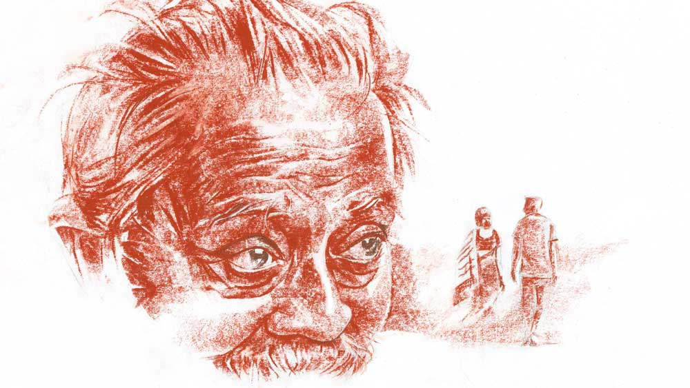

 
 <h1 align=center>নিছক মৃত্যুর গল্প</h1>
<h2 align=center>জয়দীপ চক্রবর্তী</h2> সীতানাথ পুরকাইত দাওয়ার এক ধারে বসে খকখক করে কাশছিল আর পাশে রাখা একটা মাটির মালসার মধ্যে কফ ফেলছিল। কাশির দমকে পিঠ বেঁকে যাচ্ছে ধনুকের মতো। চোখ ঠেলে বেরিয়ে আসতে চাইছে। বুকের মধ্যে বাতাস টেনে নেওয়ার শক্তিটাও যেন ফিকে হয়ে আসছে ক্রমাগত। তবু কাশির দমকের বিরাম নেই। কাশতে কাশতেই শীতকালকে অকথ্য গালিগালাজ করছিল সীতানাথ।

দাওয়ার সামনেটা প্লাস্টিক দিয়ে ঘেরা। তাতে শীতের কনকনে হাওয়ার দাপট খানিক কমে। তবুও গায়ে ফেলে রাখা চাদরটার উপরেই একখানা কাঁথা টেনে নিল সীতানাথ। শীতের হাওয়া বড় বেআক্কেলে। ফাঁকফোকর গলে ঠিক ঢুকে পড়ে হাড়হাভাতের মতো, ঘরের মধ্যে।

গত ক’বছর তেমন ঠান্ডা পড়েনি। কিন্তু এ বছর বর্ষায় জল যেমন হয়েছে, পৌষ পড়তে না পড়তেই ঠান্ডাও পড়েছে জাঁকিয়ে। বড় রাস্তার দিকে, যেখানে ঘরবাড়ি, দোকান-বাজার, গাড়িঘোড়া খানিক বেশি, সেখানে ঠান্ডার এই কামড় এতখানি মালুম হয় না। কিন্তু গাঁয়ের ভিতরে ঢুকে পড়লে শীত যেন শিকারি বাঘের মতো লাফিয়ে পড়ে গায়ের উপরে। দু’হাঁটুর মধ্যে মুখ ডুবিয়ে আবার কাশতে শুরু করে সীতানাথ। কাশতে কাশতে পাঁজর ব্যথা করে তার। চোখে আঁধার নামে। শ্বাস যেন বন্ধ হয়ে আসতে চায়।

কাশির একটা বড় দমক সামলে উঠে হাঁ করে প্রাণপণে হাঁপাতে থাকে সীতানাথ। দাওয়ার অপর প্রান্তে, রান্নাঘরে বসে বিজলি আড়চোখে এক বার দেখে নিল তাকে। দেখল, কিন্তু বিজলির চোখেমুখে তেমন ভাবান্তর হল না। রেশন থেকে খানিক চাল জুটেছে। ভাঙা ভাঙা। পোকাও রয়েছে। তবু তো চাল! আজ দু’দিন পর কাঠের উনুনে হাঁড়িতে ভাত চাপিয়েছে বিজলি।

আগুনটা মরে আসছিল। বিজলি উনুনের হাঁ মুখে দু’-একটা কাঠ গুঁজে দিতে আগুনটা লকলক করে উঠল। হাঁড়ির নীচের ফোকর গলে সাপের ফণার মতো আগুনের শিখাগুলো বাইরের দিকে বেরিয়ে আসতে শুরু করল। সেই তাপ এসে লাগল বিজলির হাতে, পায়ে, শরীরে। শিউরে উঠল বিজলি। তাপ পেয়ে শরীরটা যেন জেগে উঠতে চাইছে। সনাতনের কথা মনে পড়তে লাগল তার। সে কাছে এলেও এমনি করেই তাপ ছড়াতে থাকে শরীর জুড়ে। আগুনের ওম গায়ে মাখতে মাখতে কেমন যেন ঘোর লেগে গেল বিজলির। আবেশে দু’চোখ বুজিয়ে ফেলল সে।

শরীরের কুঁড়ি যখন সবে ফুল হয়ে ফুটে উঠতে শুরু করেছে, তখন থেকেই সনাতনকে ভাল লাগত তার। সনাতন তার থেকে বছর ছয়-সাত বড়। কাঠের মিস্ত্রির দোকানে কাজ করত। সুঠাম শরীর। কাঠের উপরে ঝুঁকে পড়ে সে যখন আদুর গায়ে র‌্যাঁদা ঘষত, হাত আর পেটের দু’দিকের পেশিগুলো ফুলে ফুলে উঠত।বিজলি যাতায়াতের পথে সে দৃশ্য গিলত হাঁ করে।

বিজলিকে সনাতনও পছন্দ করত। এক দিন সন্ধেবেলা দোকান থেকে ফেরার সময় তাকে ডেকে এক পাতা টিপ দিয়েছিল সনাতন। সে দিন রাতে ঘুম আসেনি বিজলির। ঘরের জানালা দিয়ে রাতের আকাশের দিকে কত ক্ষণ যে তাকিয়ে ছিল সে! মনে হচ্ছিল রাতটা যেন স্বপ্নের মতো।

সীতানাথের ছেলে বিলাসের সঙ্গে বিজলির বিয়ে ঠিক হয়েছিল হঠাৎই। সম্বন্ধটা সীতানাথই করেছিল যেচে এসে। বিলাস রাজমিস্ত্রির কাজ করত। ভাল রোজগার। বিজলির বাবা না করেনি। বিজলি আটকাতে চেয়েছিল। তার আপত্তি ধোপে টেকেনি।

বিয়ে হয়ে চলে আসার সময় বিজলি দোকানে সনাতনের দিকে ঠায় তাকিয়ে ছিল। সনাতনও দেখছিল তাকে একদৃষ্টে। সনাতনের চোখে একটা বোবা কষ্ট লেগে ছিল। সেই একই কষ্টের ছোঁয়া বিজলির চোখেও আটকে ছিল বহু ক্ষণ...

বিলাসের সঙ্গে বিজলির বিয়েটা সুখের হয়নি। পয়সা যেমন রোজগার করত, নেশা আর জুয়াতে উড়িয়েও দিত বিলাস। বিয়ের পরে পাঁচ বচ্ছর বেঁচেছিল। ছেলেপুলে দিতে পারেনি বিজলিকে। লোকটা মরেছে, সেও প্রায় দশ বছর হয়ে গেল...

সীতানাথের ঘড়ঘড়ে, গোঙানির মতো কণ্ঠস্বরে চটকা ভেঙে গেল বিজলির। সীতানাথ এক নাগাড়ে বলেই চলেছে, “ও বিজলি, ঠান্ডায় হাত-পা যে জমে গেল। আগুন-তাতে নিজের হাত পা-ই সেঁকবি শুধু? আমাকেও একটু আগুন-মালসা করে দিতে পারচিস না পোড়ারমুখী?”

“মরণ দশা!” বিজলি গনগনে চোখে সীতানাথের দিকে চায়। মুখ ঝামটা দিয়ে বলে, “অত ফরমাশ খাটতি পারবুনি বাপু। শীত বেশি লাগলে ক্যাঁতাটা আর একটু মুড়ে নিয়ে বোসো...”

“কেন পারবিনি শুনি?” দুর্বল গলাতেই খেঁকিয়ে ওঠে সীতানাথ, “কী এমন রাজকায্যি কচ্চিস তুই?” 

“দেখচই তো,” বিজলি গলার আগুন আরও উস্কে দিয়ে বলে, “চোকের মাতা তো খাওনি এখনও। ভাত ফুটে গেচে। হাঁড়ি নেইমে ফ্যান গালতি হবে এক্ষুনি...”

সত্যিই টগবগ শব্দে হাঁড়িতে ভাত ফুটে উঠেছে। সীতানাথ আকাশের দিকে মুখ তুলে নাক টানে শব্দ করে। শীতের ভারী বাতাসে লেগে থাকা ভাতের গন্ধ শোঁকে। গরম ভাতের গন্ধে তার পেটের মধ্যে খিদের আঁচ গনগনিয়ে ওঠে।

বিজলি তাই দেখে ফুঁসে ওঠে, “অমন মুখ উঁচিয়ে কুকুরের মতো বাতাস শুঁকতেচো কেনে?”

“তোর মুকে কিচ্ছুটি আটকায় না,” সীতানাথ বিরক্ত হয়ে বলে, “যেমন নোংরা চরিত্তির, তেমনি পচা নালার মতো মুখ। ভুলে যাসনি, আমি তোর শ্বশুর...”

“শ্বশুর নয়, অসুর,” বিজলি ভ্যাংচায়, “চরিত্তির ধুয়ে কি জল খাব? আমার সারা জেবনটা ছারখার করে দে এখন উনি এয়েচেন আমার চরিত্তির বিচার কত্তি। কত লোকের মরণ হয় চাদ্দিকে। যমরাজ এই বুড়োটাকে দেখতি পায় না? আমার হাড় মাস জ্বেইলে দেল একেবারে। অমন শ্বশুরের ক্যাঁতায় আগুন...”

বিজলির উগ্রমূর্তি দেখে সীতানাথ তড়িঘড়ি কথা ঘোরায়, “তাড়াতাড়ি হাঁড়ি নাইমে দু’মুঠো ভাত দে দিকিনি বিজলি। বড্ড খিদে পেয়ে গেচে।”

“অত খিদে তোমার আসে কোত্থেকে শুনি?” বিজলি চিৎকার করতেই থাকে, “নিজের বৌকে খেয়েচো, সোমত্ত ছেলেটাকে খেয়েচো, তবু তোমার খিদে মেটেনি?”

ছেলের মৃত্যুর প্রসঙ্গ উঠতেই একেবারে কেন্নোর মতো গুটিয়ে গেল সীতানাথ। এই একটা জায়গা বড় দুর্বল। জেনেশুনেই বিজলি এই দুর্বল জায়গাটাকে খুঁচিয়ে দগদগে করে তোলে বার বার। নিজের সমস্ত জ্বালা সে সীতানাথের উপরেই উগরে দিতে চায় সব সময়। সীতানাথ জানে, তার উপরে বিজলির রাগ ইদানীং অন্য একটা কারণেও। জেনেও চুপ করে থাকে সীতানাথ। চুপ না থেকে উপায় নেই। পেট যে বড় শত্তুর।

সীতানাথ দীর্ঘশ্বাস ফেলে। তার থুতনি ঝুলে পড়ে বুকের ওপরে। চোখের পাতা উপচে নামে নোনতা জলের ধারা। জোর করে সেই উথালিপাথালি কান্না চাপতে গিয়ে আবার বুক-ছেঁড়া কাশির দমক আসে। সেই দমক থামতে চায় না। সীতানাথের অবস্থা দেখে বিজলি চুপ করে যায়। উনুন থেকে হাঁড়ি নামিয়ে কলাইয়ের কানা-উঁচু গামলার উপর উপুড় করে। ফ্যান ঝরায়।

শীতের রাত স্তব্ধ হয়ে আসে আবার।

রাতে ঘুম আসে না বিজলির। বিছানায় শুয়ে লেপের ওম গায়ে মেখেও তার শীত যায় না। সনাতনের কথা মনে আসে। বিলাস মারা যাওয়ার খবর পেয়ে সনাতন এসেছিল। সেই শুরু। প্রথমে দু’-চার মাস অন্তর। তার পর ঘন ঘন বিজলির বাড়ি আসা শুরু করল সনাতন। এ ভাবেই এক দিন গ্রীষ্মের এক ঝিমধরা দুপুরে প্রথম সনাতনের সঙ্গে... সীতানাথের শরীর অপোক্ত হচ্ছে তখন। এক ফালি জমিটায় চাষ দিতে পারছে না আর। সে দিন জমি বেচার ব্যাপারে বেরিয়েছিল সীতানাথ।

বুড়ো কিছু আঁচ করেছিল কি না কে জানে, সনাতন বাড়িতে এলে সীতানাথ শকুনের মতো তীক্ষ্ণ দৃষ্টিতে তাকিয়ে থাকত। বিজলিকে পাহারা দিত দাওয়ায় বসে। কিছুতেই আর বিজলির ঘরে ঢোকা হত না সনাতনের। দাওয়ায় বসে চা খেতে খেতে সে ছটফটিয়ে মরত।

সনাতনই শহরে একটা ঠিকে কাজ দেখে দিয়েছিল বিজলিকে। সে বাড়িতে কাঠের কাজ করছিল তখন সনাতন। তার নিজের দোকান হয়েছে তত দিনে। বিজলি কাজ থেকে ফেরার পথে এক-এক দিন সনাতনের দোকানে যেত। দোকানের পিছনে একটা ঘর ছিল। সেই ঘরে বিজলিকে সোহাগ করতে করতে সে প্রায়ই বলত, “বুড়ো ভামটাকে দেখলেই আমার খুন করতে ইচ্ছে করে।”

“আমারও!” বলেই খিলখিল করে হাসতে হাসতে সনাতনের বুকের উপরে গড়িয়ে পড়ত বিজলি।

মহামারিতে ট্রেন বন্ধ হয়ে গিয়ে কাজটা চলে গিয়েছে বিজলির। এখন ট্রেন চালু হয়ে গেছে। মানুষজন কাজে বেরোচ্ছে আবার। বিজলি প্রায়ই ভাবে, ওই বাড়িটায় বৌদির কাছে এক দিন যাওয়া দরকার। কাজটা ফিরে পেলে ছেঁড়াখোঁড়া সংসারটায় খানিক তাপ্পি মারা যায় নতুন করে।

সনাতনের কাছে কথাটা পাড়তেই সে বলল, “কাজ করতে হবে না। এ বার তুই পাকাপাকি আমারকাছেই চলে আয়। তোকে আমি রানি করে রাখব।”

“আর বুড়োটা? তাকে কি ফেলে দেব?” বিজলি হাসে।

“যে বুড়োটা আমাদের জীবন শেষ করে দিল, তার জন্যে এত মায়া তোর?”

“ঠিক মায়া নয়। তবু...”

“বুড়ো ভামটার চোখদুটো শিকারি শকুনের মতো!” সনাতন দাঁতে দাঁত ঘষে, “যখনই তোর সঙ্গে দেখা করতে যাই, এমন করে তাকিয়ে থাকে, মনে হয় চোখদুটো গেলে দিই...”

বিজলি হেসে ওঠে, “মাতার ওপর আচে। নজর তো রাখবেই। হাজার হোক সে তো অবিবাবক...”

“শয়তান!” সনাতন হাসতে হাসতে বিজলির গায়ের উপরে গড়িয়ে পড়ে, “অবিবাবক বলে যেন কত মান্যি করিস তাকে...”

বিজলিও হাসে। সনাতন বলে, “যা-ই বলিস, বুড়োর কলজেরজোর আচে। নইলে এত শোক-তাপ, অভাব-গঞ্জনা সয়ে বেঁচেথাকে লোকটা!”

“যা বলেচো,” সায় দেয় বিজলি, “তেমাথার বটগাছটারই মতো এ বুড়োটাও অক্ষয়, অমর...”  

সনাতন বারণ করেছিল, তবু কাজের বাড়িতে গিয়েছিল আজ বিজলি। যাওয়ার পথে দেখা হয়েছিল সনাতনের সঙ্গে। তাকে হন্তদন্ত হয়ে রেলস্টেশনের দিকে যেতে দেখে সে জিজ্ঞেস করেছিল, “যাচ্ছিস তা হলে বৌদির কাছে?”

“হ্যাঁ,” বলে আর দাঁড়ায়নি বিজলি। ট্রেন ধরার তাড়া ছিল তার।

বৌদি সংসারের হাল শুনে হাতে কিছু টাকা গুঁজে দিল। তার পর বলল, “ঠিকে নয়, সর্বক্ষণের এক জন লোক চাইছি রে বিজলি। এখানেই থাকবে, খাবে, মাইনে পাবে। বাড়ির এক জন হয়ে থেকে যাবে আমাদের সঙ্গে। তুই পারলে তো কথাই নেই। একান্ত তুই না পারলে চেনাজানা বিশ্বাসী কাউকে খুঁজে দিস।”

“ক’টা দিন সময় দাও বৌদি,” বলে বেরিয়ে এসেছে বিজলি। সীতানাথের থেকেও সনাতনের কথাই আগে মনে এসেছিল তার। বৌদির বাড়িতে থেকে গেলে আর তো দেখা হবে না তার সঙ্গে!

স্টেশনে নামতে নামতে সন্ধে হল। শরীরটা খুব কাহিল লাগছিল। ভিড় ট্রেনে ওঠার অভ্যেস নেই বছর পেরিয়েছে। মুখে মাস্ক বেঁধে শরীর যেন আরও হাঁসফাস করে। দ্রুত বাড়ির দিকে পা বাড়াল বিজলি।

বাড়ি পৌঁছে একটু থতমত খেয়ে গেল বিজলি। এত চুপচাপ কেন? বুড়ো কাশছে না তো এক বারও! বাড়িটাও অন্ধকার। সন্ধে পেরিয়ে গেছে, তবু হ্যারিকেন জ্বালায়নি সীতানাথ। এমন তো হয় না! ছোট্ট উঠোন পেরিয়ে এক ছুটে দাওয়ায় ওঠে বিজলি। উনুনের পাশে দেশলাই জ্বালে। লম্ফর পলতেয় আগুন দেয়।

সীতানাথ বারান্দার উল্টো দিকে অদ্ভুত ভঙ্গিতে শুয়ে ছিল। বিজলি দাওয়ায় উঠল, আলো জ্বালল, তবুও সাড়া নেই। তাড়াতাড়ি কাছে গেল বিজলি। সীতানাথের মুখ আলতো হাঁ। সেই হাঁ মুখে প্লাস্টিকের ফুটো গলে জ্যোৎস্না এসে পড়েছে। দু’-একটা মাছি এসে বসছে জ্যোৎস্না লেগে থাকা মুখের ওপরে। আধবোজা চোখে স্থির সীতানাথ। পাশে বসে তার গায়ে হাত দিতেই চমকে উঠল বিজলি। সীতানাথের শরীর ঠান্ডা পাথর হয়ে আছে।

মুখে কত বার সীতানাথের মৃত্যুকামনা করেছে বিজলি। অথচ আজ মুহূর্তে বুকের মধ্যেটা ফাঁকা হয়ে গেল তার। ভয় আর কষ্ট দুই-ই গ্রাস করল তাকে। ডুকরে কেঁদে উঠে সীতানাথের স্থির বুকের উপরে আছড়ে পড়ল বিজলি।

রাত্রিবেলা সৎকারের উপায় ছিল না। শ্মশান এখান থেকে অনেকখানি। রাত ফিকে হতেই ঝাড় থেকে বাঁশ কেটে খাটুলি বানানোর কাজ শুরু হয়ে গিয়েছিল। এখন প্রস্তুতি সম্পূর্ণ। কে এক জন এসে বলল, “বিজলি, সীতেনাথ কাকাকে এই বার তো নে যেতি হবে। তুই অনুমতি দে,খাটিয়া তুলি।”

“চলো,” বিজলি উঠে দাঁড়ায়।

“তুই যাবি?”

“আর কে আছে? বুড়োর মুখে আমাকেই তো আগুন দিতি হবে।”

“কোনও চিন্তা নেই। আমি তোর সঙ্গে আছি,” সনাতন বিজলির পাশে এসে দাঁড়াল।

বিজলি তার দিকে মুখ তুলল। দু’চোখে আগুন ঠিকরে উঠল তার। দাঁতে দাঁত চেপে বলল, “হারামি!”

অবাক হয়ে সনাতন তার কানের কাছে মুখ এনে চাপা গলায় বলল, “কী হল তোর?”

“কাল এ বাড়িতে কখন এসেছিলে?”

“আমি?” আকাশ থেকে পড়ল সনাতন।

“খবর্দার! ন্যাকা সাজতি আসবে না আমার কাছে,” হিসহিসিয়ে উঠল বিজলি, “দাওয়ার পাশে ঘাসের মদ্যি সিগারেটের প্যাকেট পড়েছিল। ও সিগারেট তুমি খাও, আমি জানি। বুড়োর বিছানার পাশে তেলেভাজার ঠোঙাও আমি পেয়েছি... কী মিইশেছিলে তেলেভাজায়?”

সনাতনের মুখ ফ্যাকাশে হয়ে যায়, “তোর জন্যেই তো...”

“আমার এত ভাল কে কত্তি বলেছেল তোমায়?” বিজলির শরীর কেঁপে কান্না উঠে আসে গলায়, “এক্ষুনি বিদেয় হও আমার মুখির সামনে থেকে। নইলে সব্বাইকে সব কথা বলে দেব আমি...”

অদ্ভুত চোখে বিজলির দিকে চেয়ে থাকে সনাতন। বিজলি আবার বলে, “কী হল, যাও। যদি বাঁচতি চাও, আর কক্ষনও সম্পক্ক রাখবে না আমার সঙ্গে...”

সীতানাথের শরীর বাহকদের কাঁধে উঠে পড়েছে তত ক্ষণে। বিজলি সে দিকে চেয়ে হাতজোড় করে এক বার নমস্কার করে। তার পর হাঁটতে থাকে শবযাত্রীদের সঙ্গে। ক্লান্ত লাগছে। বুকের মধ্যে অদ্ভুত একটা কষ্ট। সীতানাথের সঙ্গে সঙ্গে আরও অনেক কিছুই যেন মরে গিয়েছে তার। নিজেই নিজেকে বোঝাতে লাগল বিজলি, ‘থামলি চলবেনি। সামনে লম্বা পথ, অনেক লড়াই। বুড়োর শেষ কাজ মিটলেই পেত্থম যেতি হবে বৌদির কাছে। কাজটা বড্ড দরকার এই সময়ে...’