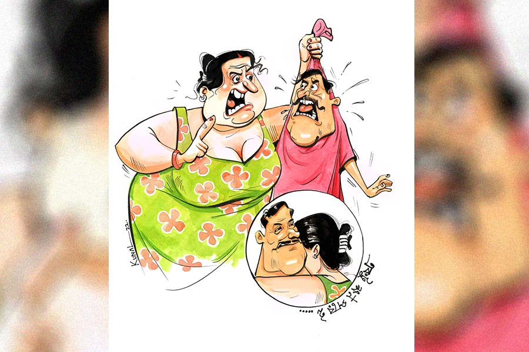

 
 <h1 align=center>নিভৃতবাস</h1>
<h2 align=center>পার্থসারথি গোস্বামী</h2> কী  বলছ গো! সত্যি?”

“এ কি আর মজা করার জিনিস, বিশ্বাস না হয় নিজের চোখেই দেখো।”

কথাটা শেষ করেই মোবাইলটা এগিয়ে দিলাম বৌয়ের দিকে। দু’দিন আগে থেকেই এক সঙ্গে ছেলে বৌ ও নিজের অল্প-অল্প সর্দিজ্বর। সরকারি প্রাণ নয়, প্রাইভেট কোম্পানিতে চাকরি। বয়সও পঁয়তাল্লিশ ছুঁতে একটু দেরি, কপালে ভ্যাকসিন জোটেনি, তাই কিছুটা প্রাণভয়ে ভীত হয়েই কোভিড টেস্ট করিয়েছিলাম। এই মাত্র অনলাইনে তার রেজ়াল্ট এসেছে, ইনবক্সে জ্বলজ্বল করছে আমাদের তিন জনের কোভিড রিপোর্ট। তিন জনই পজ়িটিভ। মেসেজটা পড়েই বৌ দেখলাম ছুটছে নিজের মোবাইল খুঁজতে। আমি বললাম, “আরে কী করছ কী! কাকে ফোন করবে? এখনই কাউকে কিছু জানানোর দরকার নেই।”

“দাঁড়াও... ফোনটোন কিছুই করব না, ফেবুতে সেন্টু মেরে একটা স্টেটাস দেব শুধু। গত মাসে পাশের ফ্ল্যাটের মিসেস হাজরা, বাথরুমে পড়ে গিয়ে ফোলা পায়ের ছবি দিয়ে হাজারের ওপর লাইক ঝেড়েছিল, তাই এমন সুযোগ কেউ হাতছাড়া করে!”

“তোমার কি মৃত্যুভয় বলেকিছু নেই!”

“না, নেই। ক’দিন আগেই আমার মাসতুতো বোনের পুরো ফ্যামিলির হয়েছিল। ওদের থেকে ওষুধের লিস্ট চেয়ে প্যারাসিটামল, অ্যান্টিবায়োটিক, অ্যান্টি-অ্যালার্জিক থেকে ভিটামিন ট্যাবলেট পর্যন্ত আগেভাগেই এনে রেখে দিয়েছি। তিন বেলা গরম জলের ভাপে ফোঁস ফোঁস আর দু’বেলা ডিমসেদ্ধ, দেখে নিয়ো কিচ্ছুটি হবে না। তার চেয়ে এখানে এস তিন জনে মিলে একটা সেলফি তুলি। ছবিটা দিয়ে স্টেটাসে লিখব ‘নিভৃতবাসে আমরা’।

ফেবুতে স্টেটাস তুলে গৃহিণী ফ্ল্যাটের দরজায় হুড়কো লাগাল। শরীর খারাপ মানেই বাঙালির একটা অন্য রকম ব্যাপার, খবর পাঁচকান হতে সময় লাগে না। নানা আত্মীয় হেল্থ ড্রিঙ্ক, ফল ইত্যাদি হাতে করে দেখতে আসে, নিজেকে তখন কেমন যেন সেলেব্রিটি-সেলেব্রিটি মনে হয়। ক’বছর আগে আমার অ্যাপেন্ডিক্স অপারেশন হয়েছিল, নার্সিংহোম থেকে ফ্ল্যাটে না এসে গেলাম গ্রামের বাড়ি, পরের দিন থেকেই ঘরে আত্মীয়দের লম্বা লাইন। বাড়ি ফেরার দিন চারেক পর মেজ মাসি এসে আমাকে দেখেই বললো, “এ কী রে! ক’দিনেই কী চেহারা করেছিস?” তার পর মা আর বৌয়ের দিকে আগুনে চাহনি। বৌ ভয়ে ভয়ে বলল, “কী করব, কিছুই খেতে চায় না।” 

“খেতে চায় না মানে! খেতেই হবে বাই হুক অর ক্রুক। অপারেশনের রোগী, কড়া কড়া ওষুধ পড়ছে, প্রোটিন ভিটামিন সব দরকার।”

তৎক্ষণাৎ দরজার বাইরে মামাতো দাদার কণ্ঠস্বর, “ও সব কনসেপ্ট পুরনো পিসিমণি, ডাক্তার বলছে পেশেন্ট মন থেকে যেটুকু খাবে শুধু সেটাই খেতে দেবে, জোর করে গেলালে হিতে বিপরীত।”

আমার খাটের কাছে এসে বিনয়ের অবতারটি হয়ে বলল, “চাকরির সে সুদিন আর নেই রে ভাই, চার দিন ধরে হসপিটালে যাব যাব ভেবে এক দিনও বেরোতে পারলাম না। বিচ্ছিরি কড়াকড়ি...” তার পর কাছে এসে আমার খাটের ওপর নামিয়ে দিল গুচ্ছের ফল আর ছাল ছাড়ানো ব্রয়লার মুরগির মতো বক্সবিহীন ফয়েল প্যাকে মোড়া একটা হেল্থ ড্রিঙ্ক পাউডারের প্যাকেট। গরম দুধে বা জলে গুলে খেতে হয়। প্যাকেটের এমন দশা কেন ভাবতে ভাবতেই দেখলাম প্যাকেটের ভেতরকার ফ্রি জ্যামিতি-বক্সটি বগলদাবা করে পাশেই দাঁড়িয়ে মামাতো ভাইয়ের গোলগাল ছেলে হাবলু। দিন দিন দর্শনার্থীর সংখ্যা বাড়তে থাকল, উপচে পড়ছে ফলের ঝুড়ি, শেলফে সারি সারি হেল্থ ড্রিঙ্কের প্যাকেট, মুহুর্মুহু চা তৈরির জন্য আলাদা গ্যাস-স্টোভ, ঝক্কি সামলাতে না পেরে নিয়োগ হল অস্থায়ী রান্নার লোক, যেন কারও বিয়ে লেগেছে। কিন্তু এ বার সে গুড়ে বালি, এ এমন রোগ, আত্মীয়রা খবর পেলেও দেখতে আসা তো দূর অস্ত, ফোনে পর্যন্ত কথা বলতে ভয় পাবে। 

এমনিতে ছুটি জোটে না, তাই মনে হল যেন হাতে স্বর্গ পেলাম। বৌ-ছেলের অভিযোগ— বাড়িতে সময় দিই না, এই চোদ্দো দিনে সব কড়ায়-গন্ডায় মিটিয়ে দেব। সামান্য একটু জ্বর ছাড়া শরীর সুস্থই। গোল্ডেন ইগলের মতো বৌ এ ঘর-ও ঘর করছে, ছেলে দুলে দুলে অনলাইন ক্লাস করছে, আমি শুয়ে শুয়ে টিভিতে খেলা দেখছি। চাওয়ার আগেই লিকার চা এসে যাচ্ছে, শরীরে চিমটি কেটে দেখলাম স্বপ্ন নয়। সংসার এমন সুখের হয়! কখন রাত হচ্ছে, কখন সকাল হচ্ছে বুঝতেই পারছি না। তখন ভুলে গিয়েছিলাম একটা গুরুত্বপূর্ণ লাইন— চিরদিন কাহারও সমান নাহি যায়। 

ক্রমশ সংসারের কাজ একা হাতে সামলাতে সামলাতে, কোথাও বেড়াতে যেতে না পেয়ে এবং শপিং করে আমার টাকাপয়সা ধ্বংস করতে না পেরে স্ত্রী যে ভিতরে ভিতরে ক্রমশ বিস্ফোরক হয়ে উঠছেন, সে কথা আগে থেকে ধরতে পারিনি। হঠাৎ নিজের অজান্তেই ল্যান্ডমাইনে পা পড়ে গেল। দিন সাতেক কেটে যাওয়ার পর এক দিন সকালে বাথরুম সেরে তাড়াতাড়ি টিভির সামনে এসে বসে পড়লাম। ওয়ার্ল্ড টেস্ট চ্যাম্পিয়নশিপের ফাইনাল। একটা মুহূর্ত মিস করা যাবে না, এমনিতে তো খেলা দেখার সুযোগ হয় না আজকাল। খেলা দেখছি, বৌ রান্নাঘরে, মনটা চায়ের জন্য উসখুস করছে, দিলাম হাঁক, “কই গো, দাও না আর এক বার লিকার চা...”

ও পাশ থেকে গুমগুমে গলায় উত্তর এল, “এখন হবে না, ছেলের জন্য ব্রেকফাস্ট করছি।”

“আরে বাবা, ওভেনে তো তিন তিনটে বার্নার, দাও না একটু করে।”

“গতরে বাজ পড়েনি তো, দরকার হলে নিজে করে নাও।”

নিজের কানকে যেন বিশ্বাস হল না, একটু চা চাইলাম বলে এমন কথা! বললাম, “কী বললে!” 

“কেন, কানের মাথা খেয়েছ না কি! যখন তখন যা খুশি অর্ডার করবে, কেন আমি কি তোমার মাইনেকরা চাকর?”

বুঝলাম আমার ও ভাবে বলা ভুল হয়েছে, তাই চটে গেছেন তিনি। জলদি ম্যানেজ দিতে হবে, হারিয়ে যাওয়া সুখ এত দিন পর ফিরে এসেছে, তাকে এ ভাবে হেলায় হারিয়ে যেতে দেওয়া যায় না। পরিবেশটা ফিরিয়ে আনার জন্য চুপি চুপি রান্নাঘরে গিয়ে হঠাৎ করে পিছন থেকে জাপটে ধরে কানের কাছে মুখ নিয়ে গিয়ে ফিসফিস করে বললাম, “রাগ করছ কেন সুন্দরী, এমন সুন্দর একটা সকাল...”

মুখের কথা শেষ হওয়ার আগেই বৌ এক ঝটকায় নিজেকে মুক্ত করে বলল, “সুন্দরী! কই আগে তো এ সব শুনিনি কোনও দিন। কোনও বাজে মেয়ের খপ্পরে পড়লে না কি! এমন সস্তা ডায়লগ!” 

প্রেমে প্রত্যাখ্যান পেয়ে মেজাজ একটু বিগড়ে গেল, তার উপর এমন অভিযোগ, তবুও মাথা ঠান্ডা রেখে বললাম, “নিজের বৌকে সুন্দরী বলা যাবে না? 

“কেন বলা যাবে না! কিন্তু আগে কখনও শুনিনি তো, কোন ঘাটের জল খেয়ে বেড়াচ্ছ কে জানে, শুনেছি পুরুষমানুষের বয়স হলে ঘোড়ারোগ ধরে।”

আমিও আর থাকতে পারলাম না। আমার গলাও চড়ল, “হঠাৎ কী হল বলো তো, সেই শুরু করলে! সূর্য পশ্চিম দিকে উঠলেও তুমি শোধরাবে না, অসভ্যের মতো ঝগড়া না করলে তোমার যে আবার ভাত হজম হয় না।”

“কী বললে! আমি অসভ্য? আমি ঝগড়া করি? কেন বলবে না, অভিযোগ করেই তো জীবন গেল, কেমন বংশ দেখতে হবে তো। আমি যদি অসভ্য তো যাও না, যাও, যে সভ্য মেয়ের সোহাগে মেতেছ তার কাছেই যাও।”

“নিজের মতো করে কথা ঘুরিয়ে দিয়ো না। কী কথার কী মানে! উফ, সহ্য হয় না আর এ সব।”

“ওরে আমার কী সহ্যক্ষমতা রে! সহ্য তো করছি আমি, সেই বিয়ের পর দিন থেকে, মায়ে বেটাতে মিলে আমার হাড়ে দুব্বো গজিয়ে দিলে গা!” 

“ফালতু ফালতু মা টেনে কথা বলবে না বলে দিলাম! তোমাকে তার সেবা করতে হয় না, সে থাকে নিজের মতো নিজের বাড়িতে।” 

“হ্যাঁ হ্যাঁ জানি, ওটাই তো তোমার আক্ষেপ! আমি বুঝি না ভাবছ! ওর মায়ের সেবাদাসী হয়ে পায়ের কাছে আজীবন পড়ে থাকলে তবে ওর শান্তি হত।”

“একেবারে নিজের ফর্মে পৌঁছে গেছ! ভাবছিলাম আমার সোনা বৌ, সোনা না ছাই, একেবারে ফুটপাতের সিটি গোল্ডের মাল, চার দিনেই রং উঠে জং ধরে গেল।”

“সোনা বৌ! হ্যাঁ বিয়ের পর তো সোনায় মুড়ে দিয়েছ আমাকে, আমার ভগ্নিপতি বোনকে বছর বছর গয়না গড়িয়ে দেয়, সে মুরোদ আছে তোমার?”

“আমার নেই যখন, যার আছে তাকে বললেই তো পারো!” 

“যে দেওয়ার সে তো এত দিন দিয়েছে! ভাগ্যিস আমার বাবা ছিল, তাই জীবনে সোনা পরলাম। নইলে সারা জীবন ওই সিটি গোল্ডই পরতে হত। আজ পর্যন্ত তো একটা নাকছাবিও গড়িয়ে দিতে পারলে না।”

“একেই বলে নেমকহারাম! গত বছর পুজোয় যে আড়াই ভরির হারটা গড়িয়ে দিলাম, ওটাও কি তোমার বাবা দিয়েছে না কি?”

“কী বললে! যত বড় মুখ নয় তত বড় কথা, জন্মের শোধ একটা মোটে হার গড়িয়ে দিয়ে আমার বাপ তোলা! ওই হার আর আমি জীবনে গায়ে ঠেকাব না, এক্ষুনি ও হার আমি ছুড়ে ফেলে দিচ্ছি!” 

কথাটা বলেই ঊর্ধ্বশ্বাসে পৌঁছে গেল আলমারির কাছে। আলমারি খুলে লকারে মারল হ্যাঁচকা টান। লকার কোথাও আটকে গেছে, খোলে না। তখন বৌ লকারের হ্যান্ডেল ধরে এমন জোরে জোরে টান মারতে শুরু করল যে আলমারিটা থরথর করে কেঁপে উঠল, আর মুহূর্তের মধ্যেই কাঁপুনির ছোটে আলমারির মাথায় রাখা একটা সুটকেস দড়াম করে পড়ল ঠিক মাথায়। গৃহিণী পত্রপাঠ ‘বাবা গো! মেরে ফেললে গো!’ বলে মূর্ছা গেলেন। 

প্রথমটায় খুব যুদ্ধজয়ের আনন্দ হয়েছিল। মনে হয়েছিল, শুধু মাথার উপরে নয়, আলমারির উপরেও ভগবান আছেন। কিন্তু সে আনন্দ স্থায়ী হল না। ছেলের সাহায্য নিয়ে বেহুঁশ শরীরটিকে কোনও ক্রমে বিছানায় নিয়ে এলাম। খানিক ক্ষণ চোখেমুখে জল ছেটানোর পর চোখ তো খুলল, কিন্তু কিছু না বলে কেঁদে চলল অঝোরে। বললাম, “কাঁদছ কেন! কী হয়েছে সেটা বলবে তো!”

বেশ কিছু ক্ষণ নীরবে কান্নাকাটি করার পর বলল, “মাথায় তেমন লাগেনি, কিন্তু বাঁ হাতটার ওপর ভর দিয়ে পড়েছি, কনুইয়ের কাছে প্রচণ্ড ব্যথা করছে।”

আমি বললাম, “কী যে হয় তোমার মাঝে মাঝে, কেমন ছেলেমানুষি করো বলো তো।”

বৌ খানিকটা ফুঁপিয়ে নিয়ে বলল, “আমি করি না গো, হয়ে যায়। আজ কত দিন হল কোথাও যাওয়া-আসা নেই, আর এই ক’দিন তো একেবারে গৃহবন্দি! প্রথম প্রথম বেশ লাগছিল, কিন্তু আর তো ভাল লাগছে না। থেকে থেকে মাথাটা কেমন হয়ে যাচ্ছে, হাঁপ ধরে যাচ্ছে। হ্যাঁ গো! এ কী দিন এল! এ কী ভাবে বাস করছি আমরা! কী বলে একে! প্রথম প্রথম স্বর্গবাস মনে হলেও আসলে যেন নরকবাস!” 

বউয়ের হাতে মলম লাগাতে লাগাতে উত্তর দিলাম, “কোনওটাই নয় গিন্নি, এ হল নিভৃতবাস।”