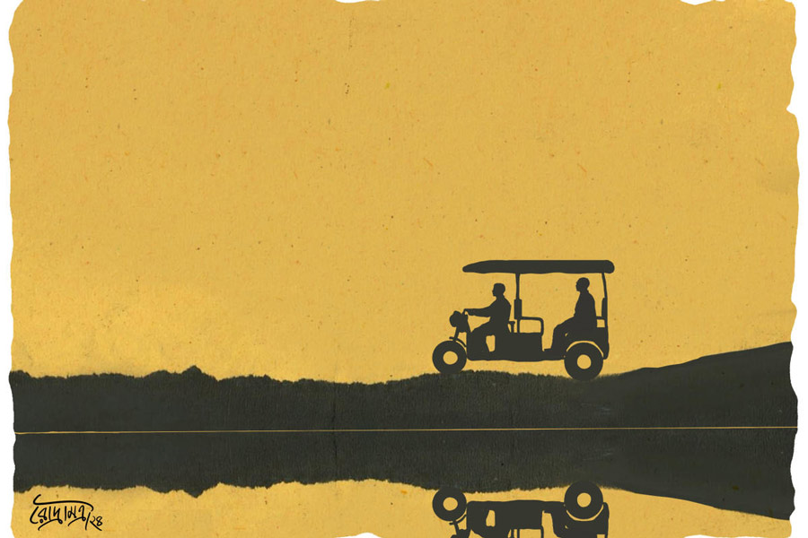

 
 <h1 align=center>নিমন্ত্রণ</h1>
<h2 align=center>চঞ্চল ঘোষ</h2> 

মাঠের মাঝে, প্রায় জনশূন্য এক স্টেশনে নামিয়ে দিয়ে ট্রেনটা চলে গেল। বিজন শুনেছিল বটে স্টেশনটা নির্জন, তা বলে এতটা নির্জন ভাবতে পারেনি। সে ছাড়া আর কেউ নামল না! সিঙ্গল লাইন। এক দিকে দিগন্তবিস্তৃত ধানখেত। অন্য দিকে জলা-জমি পেরিয়ে বেশ কিছুটা দূরে লোকালয়। কিন্তু স্টেশন থেকে লোকালয়ে পৌঁছনোর বা বড় রাস্তায় ওঠার সরাসরি কোনও পথ বিজন দেখতে পেল না। কিছুটা অবাকই হয় সে। এখনকার দিনে এ রকম স্টেশনও আছে! কী করবে ভেবে না পেয়ে পায়ে পায়ে টিকিট কাউন্টারের দিকে পা বাড়ায়। ভিতরে মাঝবয়সি এক ভদ্রলোক বসে রয়েছেন।

“দাদা, স্টেশন থেকে বেরনোর রাস্তাটা কোন দিকে?” জানলায় মুখ রেখে বিজন জানতে চায়।

“লাইন ধরে সামনের দিকে মিনিট তিন-চার গেলেই দেখবেন লাইনের তলা দিয়ে ঢালাই রাস্তা চলে গেছে। নেমে গিয়ে ডান দিকে মিনিট পাঁচ-সাত গেলেই বড় পিচরাস্তা...” যন্ত্রের মতো এক টানা বলে গেলেন ভদ্রলোক।

“ফেরার, মানে হাওড়া যাওয়ার গাড়ি ক’টায়?”

“পাঁচটা পঞ্চাশে। আজ রবিবার, ওর পরে লাস্ট ট্রেন রাত ন’টায়।”

ঘড়ি দেখে বিজন। চারটে বাজে। পাঁচটা পঞ্চাশের ট্রেনটা ধরতেই হবে।

“কোথায় যাবেন?” জানতে চান ভদ্রলোক।

“রঞ্জপুর।”

“বেশি দূর না। আধ ঘণ্টার মতো লাগবে।”

লাইন ধরেই হাঁটতে শুরু করে বিজন।

দিন কয়েক আগে মেয়ের বিয়ে উপলক্ষে বিজন বর্ধমানে গ্রামের পৈতৃক বাড়িতে এসেছে। বিজনের বরাবরের ইচ্ছে, মেয়ের বিয়ে দেশের বাড়ি থেকে দেবে। রেলের বেশ উচ্চপদে চাকরি করত বিজন। বছর দুয়েক হল অবসর নিয়েছে। কলকাতার উপকণ্ঠে এক অভিজাত আবাসনে সপরিবারে থাকে। পরিবার বলতে বৌ আর মেয়ে। বছরে দু’-এক বার সকলে গ্রামের বাড়িতে আসে। কয়েকটা দিন কাটিয়ে যায়। বাবা-মা অনেক দিনই গত হয়েছেন। কিন্তু পুরনো বাড়িটা এখনও রয়েছে। খুড়তুতো ভাই-ভাইপোরাই দেখাশোনা করে।

আজ বিজন নিমন্ত্রণ সারতেই রঞ্জপুর যাচ্ছে। এর আগে কোনও দিন রঞ্জপুর যায়নি। শুধু তাই নয়, যাকে নিমন্ত্রণ করতে যাচ্ছে, গত পঁয়তাল্লিশ বছরে তার সঙ্গে এক বারই মাত্র দেখা হয়েছিল বিজনের। বিয়ের পরপর। সেও বছর ত্রিশ হতে চলল।

কানাইয়ের সে দিনের কথাগুলো আজও বিজনের কানে বাজে, “কী রে, বিয়ে করে ফেললি; এক বার জানালিও না? আমি কিন্তু খবর পেয়েছিলাম, তোর বিয়ে। ভেবেছিলাম স্কুলের বন্ধু হিসেবে নিমন্ত্রণটা পাব। একটা নতুন প্যান্ট-শার্টও তৈরি করে রেখেছিলাম...” কোনও ক্ষোভ নয়, আঘাত দেওয়া নয়, একরাশ আন্তরিক অভিমান ঝরে পড়েছিল কানাইয়ের গলায়।

বিজনের খুব খারাপ লেগেছিল। কোনও সদুত্তর দিতে পারেনি। যদিও স্কুল ছাড়ার পর বিজনের সঙ্গে কানাইয়ের তেমন যোগাযোগ ছিল না, তবুও এটা ঠিক যে, ছোটবেলায় পাড়ায় এবং স্কুলে দু’জনে এক রকম হরিহর আত্মাই ছিল। লোকে মানিকজোড় বলত। পরস্পর সব কিছু শেয়ার করত। তার পর যা হয়। আউট অব সাইট, আউট অব মাইন্ড। বিজন কলেজে ভর্তি হয়ে কলকাতা চলে যায়; আর কানাই পড়াশোনা ছেড়ে নিজের বাড়ি ফিরে গিয়ে বাবার চাষবাস দেখাশোনা শুরু করে। তখনকার দিনে ফোন-টোন ছিল না, ফলে দূরত্ব ক্রমশ বেড়েই যায়।

কানাইদের গ্রাম রঞ্জপুর, হাওড়া জেলায়। কানাইয়ের মামার বাড়ি ছিল বর্ধমানে, বিজনদের গ্রামে। মামারা বেশ অবস্থাপন্ন ছিলেন। সেই তুলনায় কানাইয়ের বাবার অবস্থা ভাল ছিল না। বছর দশেক বয়স হতে কানাইয়ের বাবা কানাইকে মামাবাড়ি পাঠিয়ে দেন, যাতে ছেলের পড়াশোনাটা হয়। কারণ কানাইদের বাড়িতে বিদ্যাচর্চার পরিবেশ ছিল না। চাষবাস নিয়েই সকলে ব্যস্ত। মামাবাড়িতে লেখাপড়ার চল ছিল। কিন্তু বিধি বাম। পড়াশোনায় কানাই ভাল ছিল না। ক্লাস টেনে পড়তে পড়তে হঠাৎই পড়া ছেড়ে দেয়।

পিচরাস্তায় পৌঁছে রঞ্জপুর যাওয়ার টোটো পেতে দেরি হল না। টোটোয় বসে এ কথা সে কথা ভাবতে লাগল বিজন। কানাই চিনতে পারবে তো? কানাইয়ের ছেলে-মেয়ে ক’টা কে জানে! বাড়িতে কে কে আছে… খোঁজখবর না নিয়ে এই ভাবে বেরিয়ে পড়াটা, এখন বিজনের মনে হচ্ছে, বোধহয় ঠিক হয়নি। তবে অপরিচিত জায়গায়, অচেনা পথে মাঝে মাঝে বেরিয়ে পড়তে বিজনের ভালই লাগে।

খোঁজখবর নেওয়ার চেষ্টা যে বিজন করেনি তা নয়, কিন্তু কেউ তেমন কিছু তথ্য দিতে পারেনি। কানাইয়ের মামারা কেউ বেঁচে নেই। তাদের ছেলেমেয়েরা গ্রামের জায়গা-জমি বিক্রি করে দিয়ে অনেক দিনই শহরবাসী। আর বিজনের বয়সি দু’-এক জন স্মৃতি হাতড়ে অনেক ক্ষণ পর কানাইয়ের নাম মনে করতে পারলেও তার হাল-হকিকত সম্পর্কে তারাও বিজনের মতোই অন্ধকারে।

রাস্তার দু’পাশে মাঠ। গরমের ধান চাষ হয়েছে। যত দূর চোখ যায় সবুজ আর সবুজ। ফাল্গুনের বিকেল। মন-কেমন-করা দখিন হাওয়া বইছে। টোটোয় যেতে যেতে বিজনের বেশ ভাল লাগে। এই যানটা বিজনের বিশেষ প্রিয়। চার পাশ খোলা। অনেকটা পুরনো দিনের জুড়িগাড়ির মতো মনে হয়।

কানাইয়ের কথা বিজনের মনেই ছিল না। দিনদুয়েক আগে রাতে খেতে বসে লাবণী বলে, “হ্যাঁ গো, তোমার সেই বন্ধু কানাইদাকে পম্পার বিয়েতে বললে কেমন হয়? নিজের বিয়েতে তো বলতে ভুলে গিয়েছিলে। এখন মেয়ের বিয়েতে নিমন্ত্রণ করে প্রায়শ্চিত্ত করো!”

প্রস্তাবটা মনে ধরে বিজনের। সত্যিই তো, কানাইকে এই সারপ্রাইজটা দেওয়াই যায়। ব্যাটা খুব খুশি হবে।

“নামুন, এটাই রঞ্জপুর মোড়।”

টোটো ড্রাইভারের কথায় সম্বিত ফিরে পায় বিজন। নেমে ভাড়া মিটিয়ে সামনে একটা চায়ের দোকানের দিকে এগিয়ে যায়। কানাইয়ের বাড়িটা কোথায় জানতে হবে। এক কাপ চা নেয় বিজন। দোকানদার এক মাঝবয়সি ছেলে।

“ভাই, এই গ্রামে…কানাইয়ের বাড়িটা কোন…”

“কোন কানাই বলুন। রঞ্জপুরে চার জন কানাই। লিলুয়া কানাই, লিলুয়ায় রেলে চাকরি করত; কানাই মাস্টার, প্রাইমারি স্কুলে পড়ায়; ঘড়ি কানাই, ঘড়ি সারায় আর কানা কানাই, একটা চোখে ভাল দেখতে পায় না...” ভাঁড়ে চা ঢালতে ঢালতে একমনে বলে গেল ছেলেটি।

“এ কানাই চাকরি বাকরি কিছু করে না। যত দূর জানি চাষবাস করে। আমার বয়সি।”

“ওহ্! তা হলে কানা কানাই,” পাশ থেকে এক জন বলে ওঠে।

“না না, আমি যার কথা বলছি সে আমার পরিচিত; সে কানা নয়!” জড়তা কাটিয়ে একটু জোর গলাতেই বলে বিজন।

“শুনুন, কানাইদা নিজেই জানত না, একটা চোখে কম দেখে। যখন ধরা পড়ল তখন চোখটা অনেকটাই খারাপ হয়ে গেছে। আপনি দেখলে কিছুই বুঝতে পারবেন না,” কেউ এক জন বলল।

“পদবি কী?” দোকানদার জিজ্ঞেস করে।

“পাল।”

“তা হলে ঠিক আছে। যার কথা ওরা বলছে, সে-ই। আপনি এই ঢালাই রাস্তা ধরে সোজা মিনিট তিনেক যাবেন। তার পর বাঁ দিকে একটা প্রাইমারি স্কুল পড়বে, স্কুলের পিছনেই কানাইদার বাড়ি।”

ঘড়ি দেখে বিজন। বেশি দেরি করলে চলবে না। ফিরতে হবে। রাস্তার ও পারে একটা মিষ্টির দোকান থেকে এক প্যাকেট মিষ্টি কিনে হাঁটতে শুরু করল।

একটি অল্পবয়সি ছেলে এগিয়ে এসে বলল, “আমি ও দিকেই যাব; আমার সঙ্গে আসুন।”

বিজনের ভালই লাগে। এখানকার মানুষজন বেশ খোলামেলা, মিশুকে। কিছু ক্ষণ হাঁটার পর প্রাইমারি স্কুল এবং ঠিক পিছনে একটা একতলা পাকা বাড়ি চোখে পড়ল বিজনের। বাইরে অনেক দিন রঙের প্রলেপ পড়েনি। কেন যেন, বাড়িটাকে কানাইয়ের বাড়ি বলেই মনে হল বিজনের। ছেলেটাই এগিয়ে গিয়ে কড়া নাড়ল। অল্পবয়সি এক মহিলা বেরিয়ে এল।

“বৌদি, ইনি কানাইকাকাকে খুঁজছিলেন...”

হঠাৎ বিজনের মুখোমুখি হয়ে পড়ায় মেয়েটি যেন একটু অপ্রস্তুত হয়ে পড়ে। জিজ্ঞাসু দৃষ্টিতে বিজনের দিকে তাকায়। বিজনই শুরু করে, “আমি কানাইয়ের ছোটবেলার বন্ধু। গিয়ে বলো, ‘তোমার মামারবাড়ির বিজন এসেছে’।”

“বাবা তো বাড়িতে নেই।”

“বাড়িতে নেই! তুমি কানাইয়ের কে হও, মা?”

“আমি ওঁর বৌমা, জয়া। ভিতরে আসুন না।”

একটু ইতস্তত করে বিজন বাড়ির ভিতরে যায়। পাশাপাশি দুটো ঘর। সামনে লম্বা বারান্দা। বেশ সাজানো গোছানো। কিন্তু কোনও লোকজন দেখতে পায় না। কেমন যেন অস্বস্তি বোধ করে।

“কানাই কোথায় গেছে?”

“জমিতে জল পাওয়াতে। গরমের ধান চাষ তো। ডিপ টিউবওয়েল থেকে জল দেয়। বসে থেকে জল পাওয়াতে হয়,” জয়া সহজ হওয়ার চেষ্টা করে, “বসুন না। ওদের ফিরতে ফিরতে প্রায় সাতটা।”

“আর কে সঙ্গে আছে?” চেয়ারে বসতে বসতে বিজন জিজ্ঞেস করে।

“শাশুড়ি মা। মা এখন বাবাকে একা কোথাও ছাড়েন না।”

“ফোন নিয়ে গেছে?”

“না, আমাদের একটাই ফোন। সেটা আমার কাছেই থাকে।”

দীর্ঘশ্বাস বেরিয়ে আসে বিজনের। কানাইয়ের সঙ্গে তো তা হলে দেখাও হবে না, কথাও হবে না।

“আসলে পরশু, মঙ্গলবার আমার মেয়ের বিয়ে, তাই কানাইকে...”

“তাই? এ তো বিরাট সুখবর… আপনি একটু বসুন… এক্ষুনি আসছি,” বিজন কিছু বলার আগেই জয়া ভিতরে চলে যায়। আকাশ-পাতাল ভাবতে থাকে বিজন। এ রকম পরিস্থিতিতে পড়তে হবে ভাবেনি। এই কানাই-ই তার সেই বাল্যবন্ধু কানাই তো? কানাইয়ের ছেলেই বা কোথায়? চার পাশে তাকিয়ে দেখতে লাগল যদি কোথাও কানাইয়ের ছবিটবি টাঙানো থাকে। নাহ্, কোথাও কিছু নেই।

প্লেটে কয়েকটা মিষ্টি নিয়ে জয়া বেরিয়ে আসে। বিজন একটা মিষ্টি তুলে নেয়। কথায় কথায় জানতে পারে কানাইয়ের একটাই ছেলে। বোম্বেতে সোনার দোকানে কাজ করে। বছর খানেক বিয়ে হয়েছে। তিন-চার মাস ছাড়া বাড়িতে আসে। বিজনও কানাইয়ের মামাবাড়ির কথা, তাদের ছোটবেলার গল্প বলে কিন্তু বিজন বুঝতে পারে, জয়া যেহেতু এ বাড়িতে নতুন, সে এ সব কথা জানে না।

“চা করি?”

“না না; এ বার উঠব। অনেক দূর যেতে হবে। তা ছাড়া আমার শুগার হওয়ার পর চা ছেড়ে দিয়েছি...” শেষের কথাগুলো মিথ্যেই বলল বিজন। আর বসে থাকতে ভাল লাগছিল না।

“তুমি বরং তোমার ফোন নম্বরটা আমাকে দাও। আমি রাতে কানাইকে ফোন করে নেব। আমার ফোন নম্বর কার্ডে দেওয়া আছে,” নিমন্ত্রণের কার্ডটা জয়ার হাতে দিয়ে বিজন বলে, “তোমরা সকলে কিন্তু অবশ্যই যাবে। কানাইকে বোলো, কিছু যেন মনে না করে। এর পর দেরি করলে বাড়ি ফিরতে পারব না।”

মাথা নাড়ে জয়া। বিজনকে সামনের রাস্তা পর্যন্ত এগিয়ে দেয়, “আসলে গত বছর, আমাদের বিয়ের পরপরই, বাইক অ্যাক্সিডেন্টে আমার খুড়শ্বশুর মারা যাওয়ার পর থেকে বাবা কেমন যেন গুম মেরে গেছেন। আর কোথাও বেরোন না।”

“খুড়শ্বশুর মানে?”

“আমার শ্বশুররা তো দু-ভাই। খুড়শ্বশুর বাবার চেয়ে দু’বছরের ছোট ছিলেন।”

মাথার ভিতরের শিরা-উপশিরা গুলো গরম হয়ে ওঠে বিজনের। সে যত দূর জানে, কানাইয়ের কোনও ভাই- বোন ছিল না। যদিও অনেক দিনের কথা, তবুও সে নিশ্চিত। আর এক মুহূর্ত দাঁড়াতে ইচ্ছা করে না। কোনও রকমে “আসি...” বলে বিজন হনহন করে বড় রাস্তার দিকে হাঁটা দেয়।

ফেরার পথে হাজার চিন্তা মাথার মধ্যে কিলবিল করতে থাকে বিজনের। নিজের উপরই নিজের রাগ হয়। একেবারে শেষমুহূর্তে কানাইকে নিমন্ত্রণ করার সিদ্ধান্তটা কিছুটা হঠকারী হয়ে গেছে। যাই হোক, সে মনঃস্থির করে কাউকে এত সব ব্যাপার কিছুই বলবে না, লাবণীকেও নয়। কিছু ভুল, কিছু ভ্রান্তি নিজের ভিতরেই রাখতে হয়। প্রকাশ করলে কেউ ভাবে নির্বোধ, কেউ ভাবে অতি চালাক, কেউ ভাবে ভণ্ড।

সন্ধ্যার বাতাসে সানাইয়ের করুণ সুর। আলোর বন্যায় ভেসে যাচ্ছে চার পাশ। বিজন মেয়ের বিয়েতে আয়োজনের ত্রুটি রাখেনি। দুঃখ একটাই, কানাইকে মেয়ের বিয়েতেও বলা হল না। গত দু’দিনে কানাইয়ের কোনও ফোন আসেনি। বিজনও নিজে থেকে ফোন করেনি। তবুও মনে ক্ষীণ একটা আশা… সত্যিই যদি কানাইয়ের ভাই থেকে থাকে… এই কানাই-ই যদি তাঁর ছেলেবেলার বন্ধু হন...

অতিথি অভ্যাগত জনেরা আসতে শুরু করেছেন। এত আলো, এত আনন্দ, এত লোকজনের মাঝেও বিজনের চোখ যেন কাকে খুঁজে চলেছে। মনের মধ্যে কেমন এক খচখচানি। সেই অন্য কানাই-ই যদি এসে পড়ে!

কিছুটা আনমনা হয়ে পড়েছিল বিজন। হঠাৎই কাঁধে যেন কার হাতের স্পর্শ অনুভব করে। ঘুরে তাকায়। দু’-এক মুহূর্তের নৈঃশব্দ্য। বিজনের মুখে হাজার ওয়াটের আলো জ্বলে ওঠে।

“কানাই!”

স্থান-কাল ভুলে পক্বকেশ দুই প্রৌঢ় গভীর আবেগে শিশুর মতো পরস্পরকে জড়িয়ে ধরে।

“তুই তো কোনও দিন বলিসনি তোর এক ভাই আছে!” উদ্বিগ্ন বিজন।

“আমি কি এখনও বলছি, আমার এক ভাই আছে?” কানাইয়ের চোখের কোণে হাসি।

“তা হলে… তোর বৌমা যে বলল…”

“তুই কানাই পালের বাড়ি গিয়েছিলি কি?”

“মানে?” বিজন জিজ্ঞাসু দৃষ্টিতে তাকায়।

“শোন, প্রথম কথা, আমি এখন রঞ্জপুরে থাকি না। বছর কুড়ি হল একটু দূরে কুরচিঘাট স্টেশনের কাছে উঠে এসেছি। ফলে রঞ্জপুরের এখনকার ছেলে-ছোকরারা আমাকে সে ভাবে চেনে না। তুই ‘পাল’ বলেছিস, তারা হয়তো ‘পান’ শুনেছে। তা ছাড়া, তোদের কাছে আমি কানাই নামে পরিচিত হলেও বা সরকারি কাগজপত্রে আমার নাম কানাই থাকলেও ছোটবেলা থেকেই আমার ডাকনাম ছিল গোবিন্দ এবং গ্রামে সকলে গোবিন্দ নামেই চিনত। বাড়ির লোকেরও সায় ছিল। কারণ গুলিয়ে ফেলার ভয় ছিল না। গ্রামে তখন তিন-চার জন কানাই!”

অবাক হয়ে বিজন শুনতে থাকে।

“রঞ্জপুরের খুব কম লোকই জানে আমার নাম কানাই। অবশ্য এক সময় চিঠিপত্র কানাই নামেই আসত। সেখানেও পিয়নরা প্রথম প্রথম কানাই পালের চিঠি কানাই পানের বাড়িতে দিয়ে চলে যেত। অনেক বার কানাই আমার চিঠি, দরকারি কাগজপত্র আমার বাড়ি পৌঁছে দিয়ে গেছে। তাই পরশু যখন তুই কানাই পানকে মেয়ের বিয়ের নিমন্ত্রণ করে এলি, তখন কানাই ছিল না, পরে বাড়ি ফিরে সব শুনতেই ওর সন্দেহ হয়…”

“থাক, আর বলতে হবে না। এর পরেও তুই যে এসেছিস… আমার মেয়ের পরম সৌভাগ্য!” গলা বুজে আসে বিজনের। কানাইয়ের ডান হাতটা দু’হাতে চেপে ধরে। ঝাড়বাতির নরম আলোয় দু’জোড়া চোখ আনন্দে চিকচিক করে ওঠে।

রাতের আকাশে তখন আতসবাজির রোশনাই। দখিন হাওয়ায় হারিয়ে-যাওয়া কৈশোরের গান।

