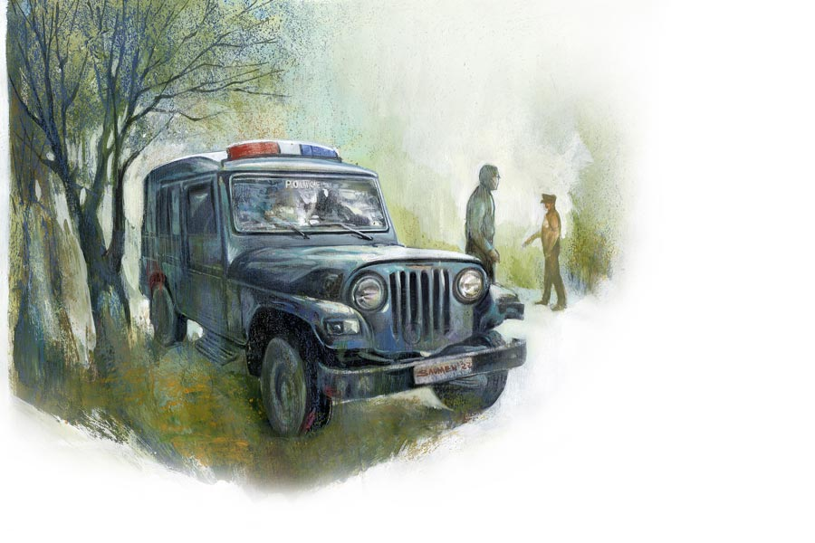

 
 <h1 align=center>নিরুদ্দেশ সংবাদ</h1>
<h2 align=center>সর্বাণী বন্দ্যোপাধ্যায়</h2> জানলার গরাদ ধরে ঝুলছিল লোকটা। বললাম, পড়ে যাবে তো! লোকটা হাসল, বলল, ‘পড়ে গেলে যাব, তাতে কী?’ আমি বললাম, কী মানে? হাত ফস্কে পড়ে গেলে বাঁচবে? তাতে লোকটা বলল, ‘বাঁচব না। তাতে কী?’ আমি বিরক্ত হয়ে বললাম, খালি ‘তাতে কী’ বলছ কেন?

“বিরক্ত হতেই আমার ঘোর কেটে যায়। টের পাই আমি ঘুম থেকে উঠে হোটেলের দোতলার ঘরের বিছানায় বসে আছি আর আমার সামনের লোকটা হোটেলের জানলার রড ধরে ঝুলছে। না, ঝুলছে না। দাঁড়িয়ে আছে। আমার খুব জলতেষ্টা পায়, কিন্তু উঠতে পারি না। তার পর দেখি লোকটা আস্তে আস্তে ভ্যানিশ হয়ে যাচ্ছে...”

এই অবধি শোনার পর পুলিশ অফিসার নড়েচড়ে বসেন। সামনের খাতাটা দমাস করে বন্ধ করেন, “আপনি রাত ন’টার সময় আমার সঙ্গে ইয়ার্কি করতে এসেছেন? আমায় এখন রাউন্ডে যেতে হবে। তা ছাড়া কিছু নিরুদ্দেশেরও সন্ধান নিতে হবে। এ সময় আপনার ফালতু গল্প আমি কেন শুধু শুধু শুনতে যাব? আমার কী লাভ?”

“লাভ? মানে আজ তিন দিন হল ওই ঘরে আমি আছি। আর প্রতি রাতেই বুঝলেন, ওই লোকটা...”

“তাই আপনি থানায় চলে এলেন? কেন মশাই, থানা ছাড়া এই গল্প শোনানোর জন্য আর কাউকে পাওয়া গেল না?”

“না মানে, বলছিলাম আজও আবার ওই ঘরে শুতে হবে তো। কত করে বললাম হোটেলের কাউন্টারে, ওরা ঘর পাল্টে দিল না। বলল সব ভর্তি। তাই ওই ঘরেই বাধ্য হয়ে... জানেন, আমার ডান হাতের ওপর দিকে এই যে মাদুলি দেখছেন, এ হচ্ছে বাবা পঞ্চাননের মাদুলি। খুব জাগ্রত দেবতা। আমার ঠাকুমা ছোটবেলায় এটা পরিয়ে দেন। সেই থেকে নিশ্চিন্তি। ভূত বলুন, সাপ বলুন, কেউ আমাকে কিছুই করতে পারবে না। তবু ভয় পাই।”

“আবার মাদুলির গল্প! ঠাকুমার গল্প! আপনার কী মনে হয় থানাটা ফালতু গালগল্পের জায়গা? আপনি মশাই ভারী বিদঘুটে! উঠুন উঠুন। আমাকে এখনই বেরোতে হবে, হাতে একেবারে সময় নেই...” অফিসার দাঁড়িয়ে ওঠেন।

লোকটিও উঠে দাঁড়ায়, “মানে যদি কিছু না মনে করেন, আপনার সঙ্গে যাব? মানে গাড়িতে যেতে যেতে যদি বাকি ঘটনাটা...”

পুলিশ অফিসার শব্দ করে চেয়ার টানেন। চার দিকে তাকান এক বার। ডায়েরি লেখার জাবদা খাতাটা টেনে আনেন সামনে। তার পর খাতার দিকে চোখ রেখেই হাঁক পাড়েন, “শ্যামল, দু’টো চা। আপনি সত্যি নাছোড়বান্দা লোক মশাই! আমার সঙ্গে যাবেন? সে ঠিক আছে। কিন্তু এখন যাচ্ছি না। যা বলার বলে ফেলুন চটপট। হ্যাঁ, আপনার নাম কী? পেশা? এখানে কী জন্য এসেছেন?”

“আমি পেশায় মেডিক্যাল রিপ্রেজ়েন্টেটিভ, নিরুপম রায়। বৌ বলে বেচুবাবু। কিন্তু ভাল কোম্পানি আমাদের। কাজের সূত্রে এখানে মাসে এক বার অন্তত আসতে হয়। দিঘায় এলে বরাবর ওই ‘মানসী’তেই উঠি। এ বারেও এলাম যখন, ওই ঘরটাই বলে রেখেছিলাম ফোনে। সাউথ ফেসিং ঘর। বড় বড় জানলা দিয়ে হু-হু করে সমুদ্রের হাওয়া আসে। কোম্পানি খরচপত্র দেয়। নিজে এলে পারতাম না। জানেন, বৌয়ের সঙ্গে ওই ঘরে থাকা হল না। ভারী আফসোস তাই! এমন সুন্দর ঘর।”

লোকটি কথা থামায়। শ্যামল চা নিয়ে এসে টেবিলে রাখে।

ফের বিরক্ত হন অফিসার, “থামুন মশাই। আপনি সত্যি একটি ভোম্বল! থানায় এসে কেউ বৌয়ের গল্প করে? নিন চা খান।”

“না, আসলে বৌ সঙ্গে থাকলে হয়তো ওই লোকটা মাঝরাতে জানলায় ঝুলত না। আমার বড় ভয় করে, একদম একা একটা ঘরে। কেউ কোথাও নেই। এখন অবিশ্যি রোজ হতে হতে ভয় কমেছে। ওই লোকটা আসছে। জানলায় ঝুলছে। মানে আমার বৌ যদি সঙ্গে থাকত... বৌ আমার খুব রাগী, মানে রীতিমতো জাঁদরেল! ও যদি...”

অফিসার হাসছেন, “নিন, চা তো জুড়িয়ে গেল। আপনার বৌ থাকলে এক ধমক দিত আর ওই লোকটা পালাত, তাই তো?”

অফিসারের ব্যঙ্গে বেজার হয়ে নিরুপম হাত গুটিয়ে বলে, “আমি চা খাব না। আমার অম্বল হয়।”

“মানে? আপনি নিজে ভোম্বল, আছে অম্বল! আচ্ছা বলুন, তার পর... কত দিন বিয়ে করেছেন? খালি বৌ-বৌ করছেন। নেশা কাটেনি মনে হচ্ছে!”

লোকটা লজ্জা পায়, “এই, মানে সবে দু’মাস হল। আমার বৌ...”

“আরে থামুন তো মশাই। তার পর কী হল বলুন। আপনি তো আর বৌয়ের গল্প করতে আমার কাছে আসেননি। আমায় ডিউটি করতে হয়। এখন আমি আপনার বৌয়ের গল্প শুনতে পারব না। তার পর কী হল?”

“হ্যাঁ বলছি। লোকটা আবার পরদিন এল। আবার তার পরদিন। মানে সোমবার থেকে প্রতি দিন। আজ বৃহস্পতিবার। আজও আসবে।”

“কেন আসে লোকটা? মানে কী কথা বলে আপনাকে?”

“বলেছে। ভারী অদ্ভুত একটা কথা। সেই জন্যই তো আপনার কাছে এলাম।”

অফিসার ঘড়ি দেখেন, “হয়েছে হয়েছে, আর ভণিতা করতে হবেনা। বলে ফেলুন কী কী বলবেন। আমাকে বেরোতে হবে।”

“আবার প্রথম থেকেই বলি, কেমন! লোকটা আসে ঠিক রাত বারোটায়। এসে দাঁড়ায় ওই গরাদ ধরে। আমাকে বলেছে, ও নাকি হারিয়ে গিয়েছে। ওকে ওর নিজের লোকেরা হারিয়ে দিয়েছে, মানে লুকিয়ে দিয়েছে।”

“মানে কী এ সব কথার? ও হারাবে কেন?”

“ও আমাকে বলছিল তাই। তিন দিনের দিন আমি বললাম, গরাদ ছেড়ে ভেতরে এসো। বোসো আমার বিছানায়। ও রাজি হল না। বলল, ‘এই বেশ আছি। তুমি জানো না, একেবারে হারিয়ে গেলে কেমন লাগে। কেউ দেখতে পায় না। জানতে পারে না আমি কোথায়।’ আমি বললাম, তুমি তো সামনে। এই গরাদ ধরে ঝুলছ। না, ভয় পেলাম না। দিব্যি বললাম। ক’দিনে ভয় না পাওয়া অভ্যেস হয়ে গিয়েছে তো। আর লোকটাও দেখছি খুব কষ্টে আছে!”

“তার পর? তাড়াতাড়ি শেষ করুন। আমি উঠব।”

“সেই লোকটা বলল, ‘জানো অদ্ভুত কাণ্ড! আমার বৌ আমার সঙ্গে এসেছিল। নতুন বৌ, নাম বলাকা। গোল লাল টিপ, নাকে সানিয়া মির্জার মতো নাকছাবি, আকাশি রঙের সালোয়ার কামিজ। ভারী সুন্দর দেখতে, আমার সঙ্গে এই ঘরে এসে ছিল। সেই বৌ...’”

“ওরে বাবা’ আবার বৌয়ের গল্প! সেও বৌয়ের কথা বলছে? কী হল, তাড়াতাড়ি বলুন। নয়তো চলুন সঙ্গে, যেতে যেতে বাকিটা শোনা যাবে। উঠুন, হ্যাঁ উঠুন জিপে। ঠিকঠাক কথা না বললে কিন্তু তখনই জিপ থেকে নামিয়ে দেব।”

“না মানে লোকটা বলছিল, বিয়ের পর ওরা বেড়াতে এল। ওই মানসী-তেই উঠল। তার পর শুধু বেড়ানো, শুধু সমুদ্রস্নান। হোটেলের ঘরে দু’জনে, মানে মাঝে মাঝে সারা দিন হোটেলের ঘরে... শুধু ভালবাসা-বাসি। দু’জনে দু’জনকে ভাল করে চিনল। অনেক অনেক ভালবাসল। তার পরেও আবার ভালবাসল। আরও ভালবাসল। তার পর এক দিন রাতে সমুদ্রের ধারে বেড়াতে বেড়িয়ে লোকটা হারিয়ে গেল।”

“হারিয়ে গেলেই হল? হারাবে কী করে শুনি?”

“কিন্তু জানলার ওই লোকটা বলল, স্পষ্ট বলেছে আমায়, ‘সে দিন আমি হারিয়ে গেলাম।’”

অফিসারের নির্দেশে জিপটা এসে থমকে দাঁড়ায় মোড়ের মুখে। বাঁকটা ঘুরলেই সমুদ্র। অফিসার ড্রাইভারের পাশের সিট থেকে পেছন ফিরে তাকান লোকটার দিকে।

“এই যে, এ বার আপনি নামুন জিপ থেকে। বললাম না আমাকে কাজে যেতে হবে! সমুদ্রের কাছেই  যাব। এত ক্ষণ ধরে অনেক বাজে বকলেন। আর বৌয়ের গল্প শুনে শুনে কান পচে গেল। বৌ কিছু নতুন ব্যাপার নয়। অনেকটা ভাজা মাছের মতো। তাজা, মুচমুচে। টাটকা টাটকাই স্বাদ থাকে। তার পরে... যাকগে, যার বৌ সে বুঝুক।”

“বোঝেনি, জানেন। কিচ্ছু বোঝেনি। ক’দিন ধরে বৌয়ের সঙ্গে থাকল। বৌকে আদর করল। বৌ ওকে আদর করল। বসে বসে মদ খেল দু’জনে। তার পর অন্ধকারে বৌয়ের হাত ধরে সমুদ্রের ধারে বালির উপর দিয়ে বেড়াতে বেরোল।”

“এ সব ও বলেছে আপনাকে? কিন্তু তার পর হলটা কী? তাড়াতাড়ি বলুন না মশাই!”

“আমি নামব এ বার। লোকটা বলেছে যে ভাবে, সে ভাবেই সবটা বললাম। আর একটুখানি বাকি। সেটুকু বলে দিলেই আমার ছুটি।”

অফিসার বলেন, “বাকি আছে আরও? এ বার শেষ করুন।”

লোকটি বলে, “শেষের মুখে। এগিয়ে যান আর একটু। হ্যাঁ, এ বার বাঁ দিকে।”

অন্ধকারে আবার একটু এগোয় জিপটা, মোড় ঘুরে সমুদ্রের দিকে এগিয়ে যায়। অফিসার আবার তাকান লোকটার দিকে, “সবই বুঝলাম, কিন্তু আর নয়। আমাকে কাজে যেতে হবে। বড্ড সময় নষ্ট হচ্ছে।”

“নামুন এ বার। হ্যাঁ, ওই ঝোপটার পেছন দিকে। সমুদ্রে ডুবে যাওয়া শরীরটা ভেসে এসে ভিড়েছে ওখানে। লোকটা বলছিল, ‘আমি বড় বোকা জানেন। যখন সবটা বুঝলাম আমার আর কিছু করার নেই। আমার বিয়ে করা বৌ আকণ্ঠ নেশা করিয়ে আমাকে নামিয়ে দিল সমুদ্রে। হ্যাঁ, হাত ধরেছিল প্রথমে। তার পর ছেড়ে দিল হাত। কত চেষ্টা করলুম জানেন, কিছুতেই উঠতে পারলাম না। যত বার উঠতে যাই, তত বার ফেলে দেয় ঢেউ। কত বার চেঁচালাম। কাকুতি মিনতি করলাম। তবু বলাকা আমাকে নিয়ে গেল না। ধরল না। জলের মধ্যে ও আমার হাত ছেড়ে দিয়ে ফিরে গেল সমুদ্রের তীরের দিকে। বলাকা কিন্তু ভাল সাঁতার জানে, আমি যে সাঁতার জানি না, সে কথাও জানত। বৌ পাড়ে  থাকতে দিল না, ঢেউ পাড়ে ফিরতে দিল না...’”

“কী বলছেন কী? এ তো রীতিমতো মার্ডার কেস! তার পর কী হল?” অফিসার উত্তেজিত হন।

গাড়ি থেকে নেমে এগোতে এগোতে অফিসার সামনের পথে টর্চের আলো ফেলেন, “কী হল বলুন, কোথায় যাব?”

“হ্যাঁ। আর একটু এগিয়ে চলুন। ওই যে, দেখতে পাচ্ছেন না? ওই জায়গায়। আপনার টর্চের আলো ঘোরান, বার করুন। হ্যাঁ, সাদা শার্ট। ভাল করে দেখুন, অন্ধকারেও দেখা যাচ্ছে তো... দেখতে পাচ্ছেন? ওটা একটা শরীর। পাকিয়ে আছে। ঢেউ আছড়ে এনে ফেলেছে তো। মুখটা ফেরানো রয়েছে, হ্যাঁ ওটাই।”

লোকটা করুণ গলায় বলে, “জানেন, ওই লোকটা আমাকে বলেছে, ‘সেই থেকে আমি হারিয়ে গেছি।’ খানিক পরে হাওয়ায় ভাসতে ভাসতে ও নাকি শুনেছিল বৌয়ের গলা। ওর বৌ কাউকে ফোনে বলছে, ‘কাজ হয়ে গিয়েছে। এ বার শুধু একটা নিরুদ্দেশ সংবাদ।’”

অফিসারের ভুরু কুঁচকে গিয়েছে।  উদ্গ্রীব হয়ে জানতে চান, “আবার বলুন, বৌটা শেষে কী বলল?”

“বৌটা বলেছে, ওই যে, যা বললুম, ‘নিরুদ্দেশ সংবাদ’। ঠিক আছে। আমার আর কিছু বলার নেই। সব তো বুঝিয়ে বললাম। এখন আপনি এগোন। দেখুন, সামনেই, ওই যে... আর একটা কথা, ও বার বার বলেছে জানেন, ও নিরুদ্দেশ হতে চায়নি। তাই আপনাকে যেন সবটা জানাই।”

অফিসার এগোতে গিয়ে হোঁচট খান। তার পর সামনে তাকান। দেখেন, গোটানো একটা শরীর পড়ে আছে মাটিতে। সম্ভবত গায়ে সাদা জামা-ই ছিল। এখনও একটু একটু বোঝা যাচ্ছে। আর খুব দুর্গন্ধ ভাসছে হাওয়ায়। নাকে রুমাল চাপা দিয়ে, এ বার এক বার পিছন ফেরেন। না। কেউ নেই। কিছু নেই কোথাও। আশ্চর্য! নিমেষের মধ্যে লোকটা গেল কোথায়? এই তো এত ক্ষণ বকবক করছিল। অদ্ভুত ব্যাপার তো!

হু হু করে সমুদ্রের হাওয়া বইছে। আর একেবারে একা দাঁড়িয়ে আছেন তিনি। আশপাশে কেউ নেই কোথাও।

থানায় ফিরেই ডায়েরির পাতা ওল্টাতে থাকেন অফিসার। একটা দুটো পাতা ওল্টাতেই চোখে পড়ে।

হ্যাঁ। এই যে রয়েছে। নাম, নিরুপম রায়। মেডিকেল রিপ্রেজ়েন্টেটিভ। ডান হাতের উপরে বাঁধা মাদুলি। দিঘায় স্ত্রীর সঙ্গে এসে নিরুদ্দেশ। থানায় নিরুদ্দেশের ডায়েরি হয়েছে ক’দিন আগের তারিখে। করেছেন নিরুপম রায়ের স্ত্রী, উত্তরপাড়া নিবাসী শ্রীমতী বলাকা রায়।