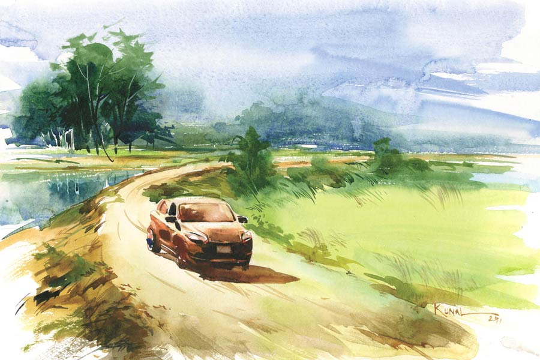

 
 <h1 align=center>নিরুপমের একদিন</h1>
<h2 align=center>স্বর্ণেন্দু সাহা</h2> খোয়ার টুকরোটায় জোরে লাথি কষালেন নিরুপম। জমল না আঘাতটা। বুটের ধাক্কায় টুকরোটা অল্প গড়িয়েই থেমে গেল।

“ধুস!” তিনি ক্রমশ বিরক্ত হয়ে উঠছেন। গাড়িটাকে এই রাস্তার মাঝখানেই খারাপ হতে হল! দোষটা তাঁরই। কয়েক দিন ধরেই মাঝেমধ্যে স্টার্ট বন্ধ হয়ে যাচ্ছিল। সারাতে নিয়ে যাব-যাব করে আর যাওয়া হয়নি। তার ফলশ্রুতি আজকের ঘটনা। একটা জরুরি মিটিং হচ্ছে পাশের শহরে। সেখানে যেতে গিয়ে মাঝপথে সটান দেহ রাখল ইঞ্জিন।

আশপাশে তাকালেন তিনি এক ঝলক। সাহায্য পাওয়া যায় যদি কারও থেকে। আশা অবশ্য কম। এ দেশের মানুষের কাছে সাহায্য চাইলে তারা গুছিয়ে বাঁশ দেয়। হাসিমুখে বলে, “নিন স্যর বাঁশটা। বেশি দাম নয় অথচ ভাল। নিয়েই দেখুন। দেব?”

মাথার উপরে চড়া রোদ। বেলা বাড়ার সঙ্গে লাফিয়ে লাফিয়ে বাড়ছে গরমও। গাড়ির ভিতরে অবশ্য এসি আছে। কিন্তু সব কাচ তুলে গাড়ির মধ্যে বসে এসির হাওয়া খাবেন সারা দিন ধরে! এটা করা যায় নাকি! ইতিমধ্যেই বারতিনেক ফোন এসে গেছে মিটিংয়ের জন্য। কথা শোনা যায়নি। ফোনে নেটওয়ার্কের অবস্থা খুবই খারাপ এখানে। কোনও ক্রমে ফোন লাগলেও, কথা শোনা যাচ্ছে না। আওয়াজ শোনা গেলেও, উল্টো দিকের বক্তব্য উদ্ধার হচ্ছে না কিছুই। ইন্টারনেটের অবস্থাও তথৈবচ। হোয়াটসঅ্যাপে মেসেজ যাচ্ছে না। কী করবেন বুঝতে পারছেন না কিছুই। মিটিংটা দরকারি। কোম্পানির একমাত্র প্রতিনিধি তিনি। আপৎকালীন সমস্যার কবলে পড়ে হাজির হতে না পারলে খুব অসুবিধে হবে না। তবে ট্র্যাক রেকর্ডে লাল দাগ পড়বে একটা। তা তিনি মোটেই চান না। তা ছাড়া এই ধরনের জমায়েতে বিশেষ লোকজনের সঙ্গে আলাপ হয়। পরিচিতি বাড়ে। বাড়ে সুযোগও।

জনমানবশূন্য স্থান। রাস্তার দু’দিকে দিগন্তবিস্তৃত মাঠ বা চাষের জমি। গাড়িও যাওয়া-আসা করছে কমই। কারও থেকে লিফ্ট চাওয়া যেতে পারে। তাতে সাফল্যের আশা কম। যদি তা হয়ও, এই গাড়ির তো নিরাপদ বন্দোবস্ত করতে হবে কিছু। এখানে রেখে চলে যাওয়া তো বুদ্ধিমানের সমাধান নয়!

ওই যে এক জনকে দেখা যাচ্ছে দূরে। স্থানীয় লোক, পোশাক দেখেই মালুম, চাষি নির্ঘাত। এখানে বিঘের পর বিঘে খেত দেখতেই পাচ্ছেন তিনি। নিরুপম হাঁকলেন, “ও দাদা! একটু এ দিকে শুনবেন।”

চিৎকার করার ধাত নেই তার। তবু বেশ দূরেই পৌঁছল কণ্ঠস্বর। এ দিকে তাকাল মানুষটা। আগ্রহের সঙ্গে হাত নেড়ে ডাকলেন নিরুপম। গতিপথ বদলে, হাতের শাবলটা কাঁধে ফেলে বলিষ্ঠ, স্বচ্ছন্দ পায়ে এগিয়ে এল লোকটা। খালি গা। ঘাম চকচক করছে গায়ে। বয়স তাঁর থেকে কমই হবে। সবল চেহারা।

“বলছিলাম, ইয়ে, এ দিকে মেকানিক পাওয়া যাবে কোথাও?”

লোকটার সমগ্র মুখ একটা বৃহৎ প্রশ্নচিহ্ন হয়ে দেখা দিল, “মেকানিক... তা...কী...”

“গাড়ি সারানোর,” অব্যক্ত ও অসমাপ্ত প্রশ্নটা মুহূর্তে বুঝে ফেললেন নিরুপম।

ঠোঁট উল্টে ধীরে ধীরে দু’-দিকে ঘাড় নাড়ল লোকটা।

আশা হারালেন না নিরুপম, “গাড়ি সারানোর জায়গা? গ্যারেজ? ধারেকাছে এলাকায় নেই কিছু?”

লোকটা এ দিক-ও দিক তাকাল। বিরক্ত হল নিরুপম। ব্যাটা এমন ভাবে তাকাচ্ছে যেন স্রেফ তাকিয়েই খুঁজে পেয়ে যাবে। তার তাকানোর অপেক্ষায় বসে আছে সবাই! তাকানো মাত্র হদিস পাওয়া যাবে যে যা চায় তার! যত সব জোটেও তাঁর ভাগ্যে!

“ফোনের টাওয়ারের অবস্থা খারাপ এখানে। আশপাশে ভাল নেটওয়ার্ক কোথায় মেলে?” ধৈর্য হারিয়েও সংযত কণ্ঠে জিজ্ঞেস করলেন তিনি।

“নেই নেটওয়ার্ক?” লোকটা বিস্ময়ের সুরে বলল। নিজের ছোট ফোন বার করে দেখল স্ক্রিনের দিকে, “টাওয়ার তো আছে ভালই।”

কাছে গিয়ে উঁকি মেরে দেখলেন নিরুপম। বাস্তবিকই আছে। তার জন্য দায়ী আলাদা নেটওয়ার্ক প্রোভাইডার। দীর্ঘশ্বাস ফেললেন তিনি। কত বার তিনি ভেবেছেন ফোনে আর একটা সিম লাগানোর কথা। তা যদি থাকত, ফোন মারফত যোগাযোগ করতে অন্তত আজ কোনও অসুবিধে হত না। জানিয়ে দেওয়া যেত, তিনি আটকা পড়েছেন। অবশ্য এই লোকটার ফোন থেকে কল করা যায়! কিন্তু করতে ইচ্ছে করছে না। ইচ্ছে না করার কারণ আছে। ফোন করলে, তখন আবার অন্য কিছু করার নির্দেশ চলে আসতে পারে। বা রাগ করতে পারে বস। এই সব ঘটলে মেজাজটা আরও খারাপ হয়ে যাবে। যা হওয়ার কাল হোক।

“ঠিক আছে। আপনি যান।” বলে পিছিয়ে এল নিরুপম। কী করা যায় ভাবতে হবে। অন্য কোনও উপায়ের সন্ধান প্রয়োজন। কিন্তু কী সেটা? এই মুহূর্তে কিছুই ভাবতে পারছেন না।

আদেশ মেনে লোকটা দুম করে চলে গেল না। একটু অবিন্যস্ত হাসি মুখে মাখিয়ে, খানিক ইতস্তত করে জিজ্ঞেস করল, “গাড়ি বিগড়েছে?”

প্রশ্ন শুনেই মাথা গরম হয়ে গেল নিরুপমের। না! গাড়ির তো কিছু হয়নি। এখানে দাঁড়িয়ে-দাঁড়িয়ে আমি খেজুর করছি। কারণ কোনও কাজ নেই। প্রচুর অবসর। মিথ্যে বলে হেভি আরাম পাচ্ছি। এই আরামের জন্যই বেরিয়েছি।

মাথা ঠান্ডা রাখার চেষ্টা করতে-করতে তিনি উত্তর দিলেন, “হ্যাঁ।”

লোকটা ঘাড় নাড়ল বুঝদার ভঙ্গিতে। মুখ দিয়ে শব্দ করল আক্ষেপসূচক। বলল, “কী করবেন তা হলে?”

করব আবার কী ঘোড়ার ডিম ছাড়া! রেগে যেতে গিয়েও হতাশ হয়ে পড়লেন তিনি। হাত রাখলেন গাড়ির বনেটের গায়ে। দীর্ঘশ্বাস ফেলে বললেন, “দেখি...”

লোকটা পর্যবেক্ষণ করল গাড়িটা। অনাহূতের মতো দাঁড়িয়ে রইল কিছু ক্ষণ। খানিক ইতস্তত করে মৃদু স্বরে বলল, “কিছু মনে না করলে আমার বাড়িতে আসবেন? এখানে কোনও খাবার দোকানও নেই। গাড়ি সারানোও যাবে না এক্ষুনি। মেকানিক নিয়ে আসতে কাউকে পাঠাতে পারি। তা-ও সময় লাগবে অনেক। তত ক্ষণ তা হলে...”

“আপনি জানেন মেকানিক কোথায় মিলবে?” উজ্জীবিত হলেন নিরুপম।

“না। কিন্তু যে জানে, তাকে পাঠাতে পারব। সময় লাগবে অনেক।” কাঁচুমাচু হল তার অবয়ব। যেন সময় বেশি লাগবে, সেটা তারই দোষ!

নিরুপম সিদ্ধান্ত নিতে পারছেন না কী করা উচিত। এই গেঁয়ো পাবলিকের ঘরে গিয়ে হাবিজাবি গল্পগুজব করার বিন্দুমাত্র শখ নেই। তার উপর নিজে থেকে প্রস্তাব দিচ্ছে এমন, আরও সন্দেহজনক ব্যাপার। সন্দেহ হচ্ছে, এই ব্যাটা গাড়িচোরদের সঙ্গে যুক্ত নাকি! বা অন্য কোনও অন্ধকার মতলব? বাজিয়ে দেখাই যাক না! নিরুপম সামান্য অবিশ্বাসের সুরে নিচু গলায় বললেন, “গাড়ি এখানে ফেলে যাব!”

“না! তা কেন!” লোকটা চিন্তা করে বলল, “দু’জনকে ডেকে আনছি। ঠেলে ঠেলে...”

মাঠের উপর দিয়ে ঠেলে নিয়ে যাবে গাড়ি, বাড়ির কাছাকাছি! হ্যাঁ, এমনটা হলে ‘না’ করার কারণ নেই। তবে ঠিক ভরসা করা যাচ্ছে না। কিন্তু এখন আর করণীয়ই বা কী? এখানে খামোখা পায়চারি করে লাভ নেই। কী খাবেন সেটাও ভেবে দেখার বিষয়। সঙ্গে কিছু আনেননি। এখনই যেন অল্প খিদে-খিদে পেতে আরম্ভ হয়েছে! টাকাপয়সা নগদে তার কাছে খুব বেশি নেই। ডাকাতির মতলব করে সুবিধে হবে না তেমন। আপাত-হিসাবে আইডিয়াটা খারাপ নয়। নিরুপম নিমরাজি হলেন। কিছু না হোক, যন্ত্রটা সেরে উঠলে, রাতের মধ্যে বাড়ি ফিরে যেতে পারবেন অন্তত।

লোকটা শাবল ঘাসের উপরে শুইয়ে রেখে দ্রুত হাঁটা লাগাল। বড়জোর পনেরো মিনিটের মধ্যে ফিরে এল দু’জন মানুষকে নিয়ে। ওরা তাঁর গাড়ি ঠেলবে। নিরুপম নিজেও ধাক্কা লাগাতে প্রস্তুত ছিলেন। কিন্তু ওরা বারণ করল সবিনয়ে। তাতে বাঁচোয়া। তার পক্ষে এ সব ঠেলাঠেলি পারা কঠিন কাজ। স্থূল পরিশ্রম তার দ্বারা হয় না। তিনি বসলেন স্টিয়ারিং ধরে। গাড়ির অভিমুখ বদলাতে হবে।

নিরুপম যাচ্ছেন। নিরুপায় হয়েই যাচ্ছেন। মিটিংয়ে আজকে আর হাজির হওয়া হল না। যাকগে! ও নিয়ে আর ভেবে কিছু সুরাহা হওয়ার রাস্তা নেই। মিনিট দশেকের হাঁটা-পথ। গাড়ি যারা ঠেলে আনছে, তাকে সমেত, তাদের বেগার খাটুনির কথা ভেবে নিরুপমের লজ্জা করছিল অল্প। এরা কুলি নয় যে নগদ টাকা ধরিয়ে দেবেন। বিনা-স্বার্থেই করছে। কেন যে করছে!

এসে পৌঁছলেন লোকটার ঘরে। সামনে খোলা জায়গা। সেখানে রাখা হল গাড়িটা। গাড়িটা দেখা যাচ্ছে এখান থেকে। তা ছাড়া লক করে রাখা। তাঁর মন এখন আশ্বস্ত।  

লাল ইটের বাড়ি। পরিচ্ছন্ন মাটির উঠোন। অতিথি হিসেবে যথেষ্ট খাতির পেলেন তিনি। লোডশেডিং। তাই গরমের মধ্যে তাকে ঘরে বসতে দেওয়া হল না। নলখাগড়ার মাদুর পেতে দেওয়া হল উঁচু উঠোনে। মুখ-হাত-পা ধুয়ে নিলেন তিনি। বসলেন পা ঝুলিয়ে। ফোনে এখনও টাওয়ার দুর্বল। ‘ধুত্তোর’ বলে সরিয়ে রাখলেন ফোন। কাঁসার গ্লাসে আমপোড়ার শরবত দেওয়া হল তাকে। কাঁসার বাসন কখনও চোখে দেখেননি তিনি। হাতে নিয়ে বেশ অন্য রকম লাগল। ওজনে ভারী ঠেকল সাধারণ স্টিলের গ্লাসের চেয়ে। ভেজা কাপড় জড়ানো মাটির কুঁজোর জল দিয়ে বানানো এই শরবত। চুমুক দিলেন। আহা! শান্তি! ঢকঢক খেয়ে পান করে নিলেন সমস্তটা।

একটু পরেই দাওয়ায় বসে খাওয়ার জন্য আমন্ত্রণ জানানো হল তাকে। ঘরের পাশে কলাগাছের উপস্থিতি দেখে তিনি নিজেই ইচ্ছা প্রকাশ করলেন যাতে পাতায় খাবার দেওয়া হয়। এদের থালা-বাটির পরিচ্ছন্নতার উপর ভরসা রাখা দায়। কী না কী রোগ বেঁধে যাবে! এই মনোভাব যদিও তিনি প্রকাশ করেননি। রোগ-আক্রমণের দুশ্চিন্তা সত্ত্বেও এক নিষ্ঠুর সঙ্কোচ বোধ করছেন নিরুপম। এমন নিঃস্বার্থ উপকার তার যেন ঠিক হজম হচ্ছে না। নিছক উপকার পেতে তিনি একেবারেই অভ্যস্ত নন। স্বভাবটাই হয়ে দাঁড়িয়েছে এমন দীর্ঘ কর্পোরেট চাকুরি-জীবনের অভিজ্ঞতায়।

কলাপাতায় তার খাবার বেড়ে দেওয়া হল সযত্নে। বেশি কিছু রান্না নেই। সুসিদ্ধ ভাত। মুসুরির ডাল। বেগুন দিয়ে রাঁধা মেথি শাক। আলুভাজা। এই মোটমাট আয়োজন। বাবু হয়ে বসলেন নিরুপম। খিদে পেয়েছে যথেষ্ট। খাবার থেকে গন্ধ বেরচ্ছে প্রলোভনের। শাক দিয়ে মাখা ভাতের এক গ্রাস মুখে তুলে চমকে গেলেন তিনি।

স্বাদ চমৎকার। সেটা আসলে প্রধান কথা নয়। মুখে দলাটা নিয়ে খানিক স্থির হয়ে রইলেন তিনি। তিনি দীর্ঘ সময় যাবৎ খাদ্যের মধ্যে সারল্য অনুভব করেননি। অনুভূতিটা কেমন, তা-ও বেবাক বিস্মৃত হয়েছিলেন। ছোটবেলায় বেশি ঝকঝকে রান্না হত না বাড়িতে। মায়ের রান্না মামুলি দু’-এক পদই ছিল রোজকার জীবনযাত্রার ইন্ধন। সাধারণ হলেও, সেই খাবারে অদ্ভুত এক মাধুর্য ছিল, আপন করা ভাব ছিল, তা বহু দিন তিনি হারিয়েছেন। বড়লোক হতে গেলে অনেক কিছু বিসর্জন দিতে হয়। মায়ের সঙ্গে কত বছর ভাল করে কথাও হয় না তাঁর। ব্যস্ততা বেড়েছে, সময় কই?

এই গরাস, যা তাঁর জিভে, টাকরায় জড়িয়ে যাচ্ছে, তাতে ঠাসবুনট করে মজুত সেই সারল্য। নিরুপমের চোখে অল্প জল এল। বাঁ হাত দিয়ে রুমাল বার করে মুছে ফেললেন সকলের অলক্ষে। মুখ নিচু করে খেয়ে নিলেন শাক-ভাত। তার পর বাকি ভাত মেখে নিলেন ডাল দিয়ে আস্তে-আস্তে। স্পর্শ করলেন আলুভাজাকে। ইচ্ছা করছে এই সময়টা, এই মুহূর্তটা, এই স্বাদের সৌরভ আজীবন ধরে রাখতে। কিন্তু তা হয় না। জীবন হতে দেয় না।

খেতে লাগলেন নিরুপম চৌধুরী। হঠাৎই চোখ চলে গেল বাইরে। তাঁর বেশ অস্বস্তি হচ্ছে সামনে চার-পায়ে খাড়া মূর্তিমান অসভ্যতার মতো গাড়িটার কথা ভেবে। ওটা এখানে মানায় না। একদম নয়।