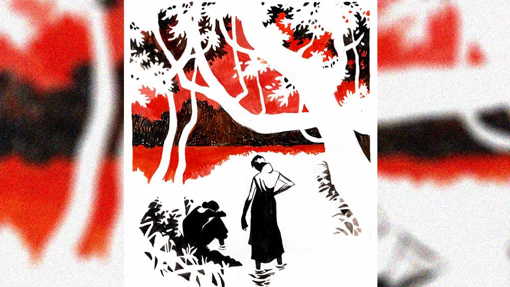

 
 <h1 align=center>নোংরা</h1>
<h2 align=center>বিশ্বজিৎ অধিকারী</h2> শেষমেশ ধরা পড়ে গেল শোভা। এ বাড়ির গিন্নির চোখ ডিটেকটিভ নভেলের গোয়েন্দার চোখকেও হার মানায়। পুকুরঘাটে একা পেয়ে চেপে ধরলেন এক দিন, “তোর কী হয়েছে রে মেয়ে? এলি বেশ হাসিখুশি,সারা দিন মুখে যেন খই ফুটছে, আর ক’দিন হল দেখছি যেন শুকিয়ে কাঠ হয়ে যাচ্ছিস। কী হয়েছে বল তো সত্যি করে!”

না বলে আর কী উপায় শোভার। আজ সে না বললেও কাল সবাই এমনিই জেনে যাবে। এমন কথা সে লুকিয়ে রাখবে কী করে?

“দু’মাস হয়ে গেল, আমার—”

“দু’মাস হয়ে গেল, কী?” চোখ পাকিয়ে ঝাঁঝালো স্বরে জিজ্ঞেস করেন গিন্নি।

গলা আরও একটু খাদে নামিয়ে শোভা জবাব দেয়, “আমার শরীর খারাপ হয়নি।”

“বলিস কী?”

“গত মাসে ভাবলাম আমার হিসেবের ভুল। তার পর এ মাসেও...”

খিড়কিপুকুরের চার পাশে ঘন হয়ে এসেছে গাছপালা। ফাল্গুন মাসের অপরাহ্ণবেলা, কেমন একটা ঘুম-ঘুম আবেশ। কত কালের পুরনো পাথর ফেলা ঘাটে বসে বাসন মাজছিল শোভা। কিছুটা দূরে আটার পিটুলির টোপ দিয়ে ছিপ ফেলে পুঁটিমাছ ধরার চেষ্টা করছিলেন বাড়ির গিন্নি কাননবালা। মাছ ধরাটা আসলে ছুতো, দুপুরের ঘুমটাকে হাই তুলতে তুলতে দূর করে দেওয়ার একটা চেষ্টা। দুপুরে একটু দু’চোখের পাতা এক করেছেন, তো রাতে আর ঘুমের দেখা নেই। শুয়ে শুয়ে শুধু এ পাশ আর ও পাশ। আর রাজ্যের ভাল-মন্দ চিন্তা এসে ভিড় করবে মাথায়। তা ছাড়া, ডাক্তারও বলেছেন, “অম্বল যদি সারাতে চান তবে দিবানিদ্রা নৈব চ নৈব চ।” শোভার বাসন ধোয়া হয়ে গেলে দু’জনে ঘরে যাবেন। তার পর ভেতরদুয়ারে বসে তার একটু সেবাযত্ন করে দেবে শোভা। সেবাযত্ন বলতে ওই একটু চুল বেঁধে দেওয়া, দুই হাঁটুতে একটু তেল মালিশ করে দেওয়া এই সব আর কী।

কিন্তু আজ সে সব মাথায় ওঠার জোগাড়। বেশ কিছু ক্ষণ চোখ সরু করে তীক্ষ্ণ দৃষ্টিতে শোভার দিকে তাকিয়ে থাকার পর কানন জিজ্ঞেস করল, “তা তোমার নাগরটি কে? কবে ঘটালে এই সব? ও বাড়িতে থাকতে নাকি এখানে আসার পর?”

শোভা নিরুত্তর। ছাইমাখা হাতে সে জলের দিকে তাকিয়ে বসে আছে।

হিসেবটাও বড্ড গন্ডগোলের। শোভার এই বাড়িতে আসার এখনও তিন মাস পেরোয়নি। তাই ঘটনা বা দুর্ঘটনা যা-ই বলা হোক না কেন, তা দু’দিকেই ঘটে থাকা সম্ভব।

চুপচাপ বসে থাকতে থাকতে হঠাৎ নোংরা হাতদু’টি জলে ডুবিয়ে গিন্নির পা চেপে ধরে শোভা। বলে, “আমাকে এ বিপদ থেকে রক্ষা করো গিন্নিমা।”

কানন দাঁতে দাঁত ঘষটে চাপা গলায় বলে ওঠেন, “চুপ কর! নোংরা নির্লজ্জ মেয়ে।”

রাগে ছিপ গুটিয়ে চপ্পলের ফট ফট শব্দ তুলে ঘরের দিকে চলে যান গিন্নি। ঘাটে একা শোভা বসে থাকে।

পিছুটান নেই এমন এক জন মাঝবয়সি মেয়েমানুষকে নিজের ফাইফরমাশ খাটার জন্য বাড়িতে রাখবেন, এ সাধ কাননের অনেক কালের। কাননের রোগ-জ্বালার শেষ নেই, দিনে প্রায় সাত-আট রকমের ওষুধ, আছে চা আর জর্দা-পানের নেশাও। তা ছাড়া, তার আবার বড্ড ঘড়ি দেখার বাতিক, সব কিছু সময়মতো হওয়া চাই। তো এই বয়সে একা একা অত ঝক্কি আর পোষাচ্ছিল না। কিন্তু গাঁ-গঞ্জে বাড়ির কাজের জন্য লোক পাওয়া দুষ্কর। গ্রামদেশে কাজের লোক রাখার তেমন চলই নেই। তো শেষমেশ কপালে জুটল একটি মেয়ে। মাঝবয়সি নয় অবশ্য, ওই পঁয়ত্রিশ-ছত্রিশ বছর বয়স। তাতেই চলবে কাননের। তবে ক’দিন যেতে না যেতে দেখা গেল, শোভা কেবল বাড়ির গিন্নির ফাইফরমাশই খাটছে না, বাড়ির তিন বৌও সুযোগ পেলেই তাকে দিয়ে যে যার নিজের কাজ করিয়ে নিচ্ছে। কেউ বলছে আনাজটা কুটে দিতে, কেউ বলছে ঘরটা ন্যাতা বুলিয়ে দিতে, কেউ বলছে বাসনগুলো মেজে দিতে।

এক দিন বাড়ির সবার খাওয়ার শেষে এঁটো বাসনপত্র গুছিয়ে তুলছিল শোভা। কানন বৌদের শুনিয়ে শুনিয়ে বললেন, “তোকে আমি বাড়ির ঝি হিসেবে রাখিনি শোভা। বাসনগুলো ঘাটে পৌঁছে দিয়েই আমার কাছে আয়, মাজতে বসতে হবে না।”

বৌদের উত্তর দেওয়ার আগেই শোভা তড়বড়িয়ে জবাব দিয়েছিল, “এ সব আমি তো নিজেই করি গিন্নিমা। বৌদিরা আমায় কোনও কাজই করতে দিতে চায় না। তুমি তোমার ঘরে যাও, আমি এই এলাম।”

সেই থেকে শুরু করে ধীরে ধীরে শোভা প্রায় বাড়ির সর্বক্ষণের কাজের মেয়েতেই পরিণত হল। কাজে তার কোনও ক্লান্তি নেই। সব কাজ হাসিমুখেই করে চলেছে। তাই বলে গিন্নির কাজে যে সে অবহেলা করে তেমনটাও নয়। বরং কাননকে আজকাল কিছু মুখ ফুটে বলতেই হয় না। মোট কথা মাস যেতে না যেতেই শোভা এ বাড়ির অন্তঃপুরের প্রায় প্রধান চালিকাশক্তি হয়ে দাঁড়াল। আর তেমন কোনও বদগুণও নেই মেয়েটার। পাড়া বেড়াতে যাওয়া নেই, এর তার সঙ্গে গালগল্প নেই। নেশা বলতে শুধু টিভি। সিনেমা সিরিয়ালের পোকা একেবারে। দু’-তিনটি চ্যানেলের প্রায় সব ক’টি সিরিয়ালের প্রায় সব ক’টি চরিত্রই তার চেনা। যাই হোক, শোভা যখন বাড়ির মেয়ে-বৌদের এক আরামপ্রদ অভ্যেসে দাঁড়িয়ে গিয়েছে, তখনই এই বিপত্তি ঘটে গেল।

সারা দিন একটিও কথাবার্তা নেই। রাত্তিরে শোভাকে নিজের ঘরে ডেকে পাঠালেন কানন। খাওয়ার পর প্রায় আধ ঘণ্টা মতো বাড়ির উঠোনে পায়চারি করেন বাড়ির কর্তা। সেই অবসরে শোভা গেল গিন্নির ঘরে।

এতটা বয়স অবধি শোভার জীবন ভারী দুঃখ আর অপমানের। তার যখন বছর বারো বয়স তখনই তার বাবা মারা যায়। মা ছিল বাবার দ্বিতীয় পক্ষ। বাবা চোখ বুজতেই সৎ-মা আর সৎ-দাদারা দূর করে দিল বাড়ি থেকে। বাবার পরিচিত এক বর্ধিষ্ণু গৃহস্থের ঘরে মেয়েকে নিয়ে আশ্রয় নিল মা। তাদের বিস্তর জমিজায়গা টাকাপয়সা। ঘরে লোকলশকর গিজগিজ করছে। অত বড় সংসারের এক কোণে ঠাঁই হল তাদের। অবশ্য পেটে দুটো ভাত আর একটু আশ্রয়ের বিনিময়ে দু’টি কাজের মেয়েমানুষ পেলে কে-ই বা না কাছে টেনে নেবে? মা ছিল চাকরানি, মেয়েও বড় হয়ে মায়ের অ্যাসিস্ট্যান্ট হিসেবে কাজে যোগ দিল। শোভার মায়ের ইচ্ছে ছিল, খুঁজেপেতে মেয়ের বিয়ে দেওয়ার। মনিবেরও সে বিষয়ে আপত্তি ছিল না। কয়েকটি ছেলে তাকে দেখতেও এসেছিল। কিন্তু শেষ পর্যন্ত বিয়েটা আর হয়ে উঠল না। একে তো চাকরানির মেয়ে, তায় তার রূপও নেই। সেই বাড়িতেই এতগুলো বছর কেটে গেছে শোভার।

তার পর যখন এই বাড়ির এক নাতনির সঙ্গে ওই বাড়ির একমাত্র নাতির বিয়ে হল, তার পর পরই এ বাড়িতে এল শোভা। নাতনিরই প্রস্তাব। নাতনির কথা ফেলতে পারল না নাতজামাই। বাপকে বলে সব ব্যবস্থা করে দিল। শোভার বা শোভার মায়ের আপত্তি করার প্রশ্ন নেই। তাদের বলা হয়েছিল যে নতুন বৌয়ের বাপের বাড়ি গিয়েও শোভা এমনই একটি পরিবেশ পাবে। তা সত্যি, এখানে এসে মানিয়ে নিতে খুব একটা অসুবিধে হয়নি শোভার। দু’-চার দিন যেতে না যেতে সে একেবারে ঘরের চেনা মানুষ। এ বাড়িতেও লোকজনের অভাব নেই। বুড়োবুড়ি, তিন ছেলে, দুই মেয়ে। দুই মেয়ের বিয়েও হয়েছে বেশ বড় বাড়িতেই। ছেলেরা সব প্রতিষ্ঠিত। এক জন স্কুলমাস্টার, এক জন হোমিয়োপ্যাথি ডাক্তার, এক জন ব্লক অফিসের কেরানি। ছেলেদের ঘরে দুই নাতি তিন নাতনি। স্কুল-পড়ুয়া ছোট নাতনিটিকে বাদ দিলে সবাই লেখাপড়ায় চৌকস। ঘরের মানুষ ছাড়া বাড়িতে এক জন বুড়ো চাকর, একটা ছোকরা বাগাল, দুটো বারো মাসের বাঁধা মজুর।

খাটের এক কোণে চিন্তিত মুখে বসেন আছে বাড়ির গিন্নি কাননবালা। একটু দূরে মুখ নিচু করে মেঝেতে বসে আছে শোভা।

“আয়, আমার কাছে এসে বোস,” গিন্নি বলল। শোভা নিজেকে প্রায় টেনে এনে বসাল খাটের অন্য পাশে।

“এ বার সব খুলে বল। তোকে দেখে তো আমার ভাল মেয়ে মনে হয়েছিল শোভা। তোর পেটে-পেটে এত গুণ! কবে হল বল, কে করল?”

শোভা নিরুত্তর।

কানন নিজের মাথা ঠান্ডা রাখার চেষ্টা করে, সম্ভাব্য উত্তরগুলি ক্রমাগত সাজিয়ে চলেন শোভার সামনে। যেন সঠিক উত্তর পেলে সে সহজে মাথা নেড়ে সম্মতি জানাতে পারে।

“কোথায় ঘটিয়েছিস এ কাণ্ড? নিশ্চয়ই এখানে আসার আগে। কে সে? তোকে বিয়ে করবে বলে ঠকিয়েছে নির্ঘাত?”

শোভা নিরুত্তর।

“উত্তর দে হারামজাদি, তোমার মুখ আমি দেয়ালে রগড়ে দেব। কোত্থেকে থেকে কী ঘটিয়ে আমার ঘরে এসে কেলেঙ্কারি ঘটাবে ভেবেছ। তোমাকে নিজে হাতে বিষ খাইয়ে মেরে ফেলব আমি।”

কিছু ক্ষণ চুপচাপ থাকার পর কানন আবার জেরা শুরু করেন। এ বার গলার স্বর কিছুটা ঠান্ডা, “এখানে এসে তো সম্ভব নয়, এসে পৌঁছে বাড়ি ছেড়ে বেরোসনি কোথাও।”

এ বারেও উত্তর দেয় না শোভা।

কানন শান্ত গলায় বলেন, “বল আমাকে, তোর কোনও ভয় নেই।”

তার পর আরও এগোতে এগোতে খুব বিপজ্জনক প্রশ্নটি করে বসেন কানন।

ফিসফিসে গলায় বলেন, “না কি আমারই বাড়ির কেউ? এ বাড়িতেও তো পাঁঠা-ছাগলের অভাব নেই।”

শোভা এ বারেও কোনও উত্তর দেয় না। মুখ নিচু করেই বসে থাকে।

অধৈর্য কানন বলেন, “যা, দূর হ আমার সামনে থেকে!”

শোভা ধীর পায়ে চুপচাপ ঘর ছেড়ে বেরিয়ে আসে।

নাতনির শ্বশুরবাড়ির দু’এক জন ছাড়া বাকি পুরুষমানুষদের চেনেন না কানন। মনে মনে সেই চেনা মুখগুলিই ঘুরিয়ে ফিরিয়ে দেখেন। শোভা সব কথাতেই মৌনী থেকেছে। এমনকি ব্যাপারটা এ বাড়িতে ঘটেছে কি না জিজ্ঞেস করাতেও সে কোনও উত্তর দেয়নি। এই মৌনের মানে কী? কানন কোনও সিদ্ধান্তে আসতে পারে না। এ বাড়িতে? এ বাড়ির কেউ? ভাবতেও গা গুলিয়ে ওঠে। ও বাড়ির দু’-এক জন আর এ বাড়ির সমস্ত পুরুষের চেহারা কাননের মানসপটে পর পর ফুটে ওঠে মুছে যায়, চক্রাকারে বার বার যাওয়া আসা করে। তার পর এক সময় এত দ্রুত মুখগুলি সরে সরে যেতে থাকে যে, কানন আর তাদের আলাদা করে চিনতেই পারেন না। প্রচণ্ড মাথাব্যথা শুরু হয়, ঘুম আসে না ভোর রাত অবধি।

কাননকে দু’এক মাস ছাড়া ছাড়া জেলাশহরের এক ডাক্তারের কাছে নিজের রুটিন চেক-আপ করাতে যেতে হয়। বছর দুই গেলে সত্তর হবে বয়স, শরীরে নানা রকম রোগজ্বালা। সুগার প্রেশার গ্যাস অম্বল অনিদ্রা, এমন আরও কত। পরের দিন ছিল রবিবার, বাড়ির ছোটবড় সব পুরুষমানুষ বাড়িতে, দুপুরে খেতে বসেছে পাশাপাশি। কানন বললেন, “আমাকে এক বার চৌধুরী ডাক্তারের কাছে যেতে হবে। শরীরটা ক’দিন খুব ভাল নেই।”

এ কথা শুনে ছেলেরা নানা অজুহাত খাড়া করতে শুরু করল। সামনের ক’দিন খুব কাজের চাপ তাদের। অন্তত সপ্তাহখানেক অপেক্ষা করতেই হবে কাননবালাকে।

কর্তা বললেন, “আমিই না-হয় নিয়ে যাব তোমাকে।”

“কাউকে যেতে হবে না আমার সঙ্গে। আমি শোভাকে সঙ্গে নিয়ে যাব। তোমরা শুধু একটা গাড়ি ভাড়া করে দাও। কাল সকালেই যাব আমি,” ঘোষণা করলেন কানন।

এই প্রস্তাবে সবাই যেন হাঁপ ছেড়ে বাঁচল।

কানন বলল, “আর আমি ফিরব কিন্তু দিন দুই পরে।”

“সুধামাসির বাড়ি যাবে?” ছেলেরা জিজ্ঞেস করল।

কানন বললেন, “হ্যাঁ, অনেক দিন যাওয়া হয়নি।”

ডাক্তার চৌধুরী অনেক কালের চেনা। জেলাশহরে তাঁর মস্ত নার্সিং হোম। কাননের পরিবারের সঙ্গে প্রায় বছর কুড়ির আলাপ। নাম লেখাতে হয় না। কাউকে দিয়ে ভেতরে একটু খবর পাঠালেই কাজ হয়। দু’-এক জন রোগী ছেড়ে দিয়ে নিজেই ডেকে নেন ডাক্তারবাবু।

কাননের শারীরিক অসুবিধের কথাগুলি জেনে নিয়ে ডাক্তার যখন প্রেসক্রিপশন লিখছেন, কানন তখন আসল কথাটি পাড়লেন, “ডাক্তারবাবু, আরও একটি সমস্যা নিয়ে এসেছি আজ আপনার কাছে। সেটাই মূল সমস্যা বলতে পারেন। আমার একটি চেনা মেয়ে, আমার মেয়ের মতোই... তাকে এক বার একটু দেখতে হবে।”

সব শুনে ডাক্তার চৌধুরী বললেন, “বেশ তো, ডাকুন তাকে। আজ তো কোনও গাইনি বসেন না আমার নার্সিং হোমে, আমিই না-হয় আপাতত দরকারি ওষুধপত্র লিখে দিচ্ছি।”

কানন বাধা দিয়ে বলে, “না না, ওষুধপত্রের কথা হচ্ছে না ডাক্তারবাবু।”

ডাক্তার কিছু ক্ষণ কাননের মুখের দিকে তাকিয়ে থেকে যেন আসল ব্যাপারটি বুঝে যান। দীর্ঘশ্বাস ছেড়ে বলেন, “ও। অ্যাবরশন, আই মিন ওয়াশ করে দিতে চাইছেন তো?”

“হ্যাঁ, তা ছাড়া আর উপায় কী, নোংরা জিনিস তো ফেলেই দিতে হবে।”

নার্সিং হোমের ঝামেলা মিটিয়ে সুধার বাড়ি পৌঁছতে দুপুর গড়িয়ে যায়। সুধাদিদি, কাননের মায়ের সইয়ের মেয়ে। নিজের বোন থাকলেও যেন এত আপন হত না। শহরের মাঝখানে একটা পেল্লাই বাড়িতে মানুষ বলতে কেবল বুড়ি আর বুড়ো, সুধাদিদি আর তার বর। ছেলেরা সব মস্ত মস্ত চাকরি নিয়ে দূরের দূরের শহরে।

কাননকে দেখে দিদি জামাইবাবু দু’জনেই দারুণ খুশি।

কানন বললেন, “বুড়ো-বুড়ি এত বড় বাড়িতে পড়ে থাকো, তাই এই মেয়েটিকে সঙ্গে করে নিয়ে এলাম। দেখো তোমাদের পছন্দ হয় কি না। আমার নাতনির শ্বশুরবাড়িতে ছিল আগে। আমার কাছেও ছিল মাস তিনেক। ভারী লক্ষ্মী মেয়ে, তোমাদের কাছে থাকতে পারবে চব্বিশ ঘণ্টা। এমন মেয়ে তুমি খুঁজলেও চট করে পাবে না। নিজের বলতে বিধবা মা, গ্রামে থাকে। তা ছাড়া আর কোনও পিছুটান নেই।”

সুধা আর তার স্বামী এই প্রস্তাব একেবারে লুফে নিলেন। সত্যি তাদের এমন এক জনের খুব দরকার ছিল। অনেক খুঁজেও কোনও লোক পাওয়া যাচ্ছিল না। আগে যারা এসেছিল তারা এসেছিল মোটা মাইনের লোভে। কেউ দু’-তিন মাসের বেশি টেকেনি। আসলে বুড়ো-বুড়ির কাছে একটানা পড়ে থাকতে কেউ রাজি নয়। সবারই ছুটি চাই। অনেকে আবার বলে, দিনে থাকবে কিন্তু রাতে বয়স্ক মানুষের দায়িত্ব নিতে পারবে না। মা-বাবাকে একা ফেলে গিয়ে ছেলেগুলোরও চিন্তার সীমা নেই।

সুধা বলল, “তুই যে আমাদের কী উপকার করলি ভাই, তা বলে বোঝাতে পারব না।”

দু’রাত সুধার কাছে কাটিয়ে যে দিন ফিরবেন কানন, সে দিন কান্নাভেজা গলায় শোভা বলল, “আমাকে তা হলে একেবারে দূর করে দিলে গিন্নিমা?”

কানন বলল, “ও কথা বলিস না মা। এখানে তুই খুব ভাল থাকবি, এখানে তোর কোনও ভয় নেই। এরা তোকে খুব যত্নে রাখবে। সাবধানে থাকিস মা। বুড়ো-বুড়িকে দেখিস।” 

একটা আবছা অপরাধবোধে আচ্ছন্ন মন নিয়ে বাড়ি ফিরল কাননবালা। নিজের বলা ‘নোংরা’ শব্দটাই মনে খচখচ করছে বার বার। তার উৎসটা যে জানাই গেল না! শোভা যে একেবারে নীরব হয়ে রইল, তার জন্যে কি তার কাছে কৃতজ্ঞ থাকা উচিত ছিল? পরিবর্তে কি তাকে শাস্তি দেওয়া হয়ে গেল? প্রশ্ন অনেক, কিন্তু একটারও উত্তর জানা নয়। জানা সম্ভবও কি!

একা বাড়ি ফিরে আসায় সবাই জিজ্ঞেস করল, “শোভা কই?”

কানন শান্ত কিন্তু শক্ত গলায় বলল, “শোভাকে সুধাদিদির কাছে রেখে এলাম।”

“কিন্তু ও তো আপনার কত কাজ করে দিত মা!” বৌমারা বলল।

“কাজের লোকের সাধ আমার মিটে গেছে...” তিক্ত গলায় কথাগুলো বলে গটগট করে নিজের ঘরের দিকে চলে গেলেন কাননবালা।