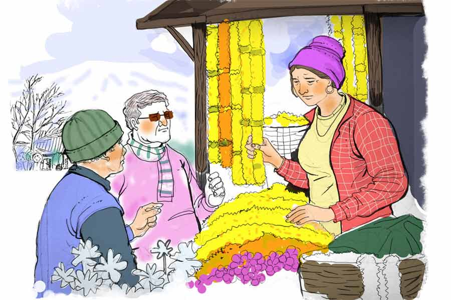

 
 <h1 align=center>নৌকো ফুলের নোঙর</h1>
<h2 align=center>সৌভিক দাস</h2> 

চা-আ-আরশো!” আঁতকে উঠল শ্রেংডোমা। তিব্বতি বাচনভঙ্গিতে ইংরেজি ভাষায় বলল, “অসম্ভব। আমার হেল্পিং হ্যান্ড বলতে এই এক জন। তাও সে মানুষ নয়, পপকর্ন ট্রি।” দ্রুপদ ঘাড় ঘুরিয়ে কর্মচারীটিকে দেখল। এক কোণে গাছের মতোই ঠায় দাঁড়িয়ে বুদ্বুদ মোড়কে পুটপুট করে ভুট্টার খই ভাজার শব্দ তুলছে। হাসিতে চোখের কোণে অনেকগুলো ভাঁজ পড়েছে। পাহাড়ি মানুষদের যেমন পড়ে।

“তিন সপ্তাহ সময় তো আছে। আগামী কাল সকালেই তো আর অর্কিডের চারশোটা তোড়া চাইছি না,” দ্রুপদ দুম করে কথাটা বলে ফেলল।

দুষ্টু হাসির ঝিলিক খেলে গেল শ্রেংডোমার চোখে, “অর্কিডের তোড়া সবাই আগামী কাল সকালের জন্যই তৈরি করে। তিন সপ্তাহ ধরে রেডি করে না। পচা ফুলের গন্ধে লোক মারতে চাইলে অবশ্য অন্য ব্যাপার।”

মনে মনে কপাল চাপড়াল দ্রুপদ। ইস, আর একটু স্মার্ট কিছু কেন বললাম না! আসলে ‘পেটাল প্যারাডাইস’-এ পা রাখতেই ভাবনার ভার হৃদয়ের উপর চাপিয়ে তার মগজ ছুটি নিয়েছিল।

জানলায় টাঙানো প্রার্থনাখচিত রংবেরঙের পতাকা, স্থানীয় ভাষায় লুং-টা। পতাকার ফাঁকে উঁকি দেওয়া হিরণ্ময় মুকুটের কাঞ্চনজঙ্ঘা। কাচ ভেদ করে আসা কয়েক ফালি এপ্রিলে ভেসে যাওয়া সারি সারি অর্কিডের রামধনু। বাতাসের শিরশিরানিতে মালকোষের সঙ্গে হিন্দোলের হারমোনি। দেয়ালের কাঠে বুড়ো সময়ের গন্ধ। থাংকা ওয়ালপেন্টিংয়ে চিরযুবক বুদ্ধদেবের করুণাময় হাসি। তিব্বতি কারুশিল্পে খামখেয়ালি মাধুর্য। কোণে বসা খুদি চোখের ছোট্ট ছেলেটার ড্রাগন-মাথা টুংনার তারে পাহাড়ি ধুন। কিন্তু এ সব কারণে মগজ ছুটি নেয়নি।

কারণটা শ্রেংডোমার দু’চোখ জোড়া বৈপরীত্য। যেমন বৈপরীত্য থাকে মেঘপিয়নের রোদ্দুরে, যেমন বৈপরীত্য ছিল শ্রেংডোমার ‘ছুপা’ পোশাকের আগুনে লাল আর ছাই রঙে। কিসের বৈপরীত্য? ছাই তো আগুনেরই দোসর। কিন্তু সব আগুন যে পুড়িয়ে ছাই করে না, কিছু আগুন তো অনবরত দগ্ধ করে! ঠিক যেমন দ্রুপদের আগুনটা— লাভ-লোকসানের চুল্লিতে সমানে দহন করছে তাকে, অলীক পার্মিজ়ানের পিছনে দৌড় করাচ্ছে ইঁদুরের আর্মিকে, হাঙরের পেটে পুরছে মৌরলাকে। শ্রেংডোমার চোখ দুটো যেন সেই আগুন থেকে দ্রুপদের মনটাকে সরিয়ে বরফ বুলিয়ে দিল।

“ম্যালের কাছে বড় ফ্লোরিস্টের দোকান। চারশো কেন, চাইলে হাজারও পাবেন,” শ্রেংডোমার ইশারায় টুংনার তারে সুর তোলা বন্ধ করল ছেলেটি।

দ্রুপদের পাশ থেকে সঞ্জয় বলল, “চলুন স্যর, ম্যাডাম ভাল অ্যাডভাইসই… ঘোঁত… উউফ্!” কথার মাঝপথেই যন্ত্রণায় ককিয়ে উঠল সে।

কাউন্টারের ও পাশে দাঁড়ানো শ্রেংডোমা চমকে উঠে ঠোঁটের উপর হাতের দুটো চেটো জড়ো করল, “ও মাই গড! হোয়াট হ্যাপেনড?”

“ক্রনিক জাপানি হাঁপানি। মাঝে মাঝে জোরসে দম লেনা পড়তা হ্যায়,” সঞ্জয় উত্তর দিল। এ দিকে দ্রুপদের বুটের গুঁতোয় তার পায়ের পাতা এখনও টনটন করছে।

দ্রুপদ দ্রুত বলে উঠল, “ম্যালের সব দোকান চেক করে নিয়েছি। আপনার মতো অর্কিডের এত ভ্যারাইটি কার আছে বলুন?”

“অর্কিড ওয়েসিসে গেছিলেন?”

“অবশ্যই।”

“অর্কিড ওয়েসিস বলে এই শহরে কোনও দোকান নেই!” ঠোঁট টিপে হাসল শ্রেংডোমা।

দ্রুপদ সাঁ করে সঞ্জয়ের দিকে তাকাল, “আপনাকে কত বার বলেছি, ঠিক করে দোকানের নাম পড়বেন।” এ বার শ্রেংডোমার দিকে তাকিয়ে বলল, “আপনার লোকটি যেমন পপকর্ন ট্রি, আমার এটি পপকর্ন বাদুড়। মুখে খই-ফোটানো দিনকানা।”

দ্রুপদের বুট থেকে নিরাপদ দূরত্বে গিয়ে দাঁড়াল সঞ্জয়।

শ্রেংডোমার দিকে ফিরল দ্রুপদ, “প্লিজ়, রাজি হয়ে যান। আমাদের যে কোনও আউটলেটে, যে কোনও পোশাকে পঁচিশ পার্সেন্ট ডিসকাউন্ট কুপন… লাইফটাইম।”

“দার্জিলিঙে তো আপনাদের আউটলেটই নেই।”

“আজকেই খুলে ফেলছি। আগামী কাল কুপন নিয়ে আসছি,” এক গাল হেসে বেরিয়ে গেল দ্রুপদ।

পথের পাশে নিঝুম ঝাউ, হঠাৎ নামা কুয়াশা, তার সঙ্গে তেরছা রোদের খুনসুটি। জ্যাকেটের পকেটে হাত ঢুকিয়ে হোটেলের দিকে দ্রুত পা বাড়াল দু’জন।

সঞ্জয় বলল, “স্যর, এত খচ্চা করে এক মাস আগে কোম্পানি আমাদের পাঠিয়েছে। এ রকম একটা গ্লোবাল সাম্মিট আয়োজন করা চাট্টিখানি কথা? আপনি এ সব কাজে গুরুদেব লোক। গুরুনিন্দা করতে নেই, কিন্তু এই একটা গোঁয়ারগোবিন্দ দোকানের পেছনে নাছোড়বান্দা হয়ে পড়ে থাকলে, কাজ এগোবে?”

দ্বিতীয় দিনে পেটাল প্যারাডাইসে ঢুকে দ্রুপদ বলল, “আপনার দোকানের জাদু, আপনার হাতের যত্ন অন্য দোকানে কোথায়? ওখানে আমাদের এমন ভাবে বুকেগুলো দেখাচ্ছিল, যেন স্যালাডে লেটুস ছুড়ে ছুড়ে দিচ্ছে।”

“আপনি আর পপকর্ন বাদুড় বিনা-মাইনেয় বুকে তৈরিতে হেল্প করুন, তা হলে চারশোয় রাজি। নইলে আপনাদের জন্য স্যালাডের লেটুসই ভাল।”

চতুর্থ দিনে দ্রুপদ নিয়ে এল অন্য যুক্তি, “ঠিক আছে। আমি সে দিন ভোর ভোর চলে আসব বুকে বানাতে। আমি ভালই কাঁচি চালাতে পারি।”

“তা হলে এখানে সময় নষ্ট করবেন না। ফিল্ম সেন্সর বোর্ড আপনার জন্য মালা নিয়ে
অপেক্ষা করছে।”

সপ্তম দিনে আবার দোকানের দিকে পা বাড়াতেই সঞ্জয় বলল, “স্যর, মেয়েটার পিছনে সময় নষ্ট করছেন। অন্য দোকানে অর্ডার দিয়ে দিন। ল্যাঠা চুকে যাক।”

“পেয়ার ঝুকতা নেহি, প্রেমের ল্যাঠা সহজে চুকতা নেহি...” কথাটা বলে দ্রুপদ আবার হাজির হল শ্রেংডোমার সামনে।

“ভেবে দেখুন। পরের দিন ‘হিমালয় দর্পণ’-এ হেডলাইন— ‘করে দেখাল কন্যা’। বহু বাধা পেরিয়ে ফুলের চারশো তোড়া। ইনস্টাগ্রাম, ফেসবুক, রিলস— লাইকের বন্যা। ইউ উড বি আ লোকাল লেজেন্ড!” দ্রুপদের গলায় কপটতার জায়গায় বিশ্বাস। সামাজিক মাধ্যমের যুগে লক্ষাধিক লাইক মানেই লেজেন্ড।

শ্রেংডোমা স্মিত হেসে উত্তর দিল, “লোকাল লেজেন্ড না লোকাল লুনাটিক? আমার গল্পটা ছোটই থাক, দ্রুপদ। ছোট দোকান, ছোট দুনিয়া, ছোট ছোট স্বপ্ন। সেই ছোট স্বপ্নগুলোই জাগিয়ে রাখুক। বড় স্বপ্ন সবার সহ্য হয় না।”

“চারশো বুকে তো বুঝছি বিশ বাঁও জলে। অন্তত আপনার ছোট স্বপ্নের একটা নমুনা দেখান!” দ্রুপদের আবদারে সততা ছিল।

“আসুন...” এ বার সহকারীর দিকে তাকিয়ে বলল, “এঁকে নার্সারি দেখিয়ে আনি। দোকান সামলাস,” আবার দ্রুপদের দিকে তাকিয়ে বলল, “এসে দেখব হয়তো দোকানটাই বেচে দিয়েছে কাউকে।”

দু’জনেই খুব খানিকটা হেসে উঠল। সেই হাসি গিয়ে থামল শ্রেংডোমার বাড়ির বাগানে। গেটের উপর লেখা ‘পেটাল প্যারাডাইস ব্লুমারি’। কলকাতার উপকণ্ঠে, সাউথ কোরিয়ার পিয়ংচ্যাং কাউন্টিতে এবং আরও বহু জায়গার নার্সারিতে গেছে দ্রুপদ। এত অযত্নের ছাপ কোথাও দেখেনি। নুড়ি-চিটপিট পথে অর্কিডবীথি পেরিয়ে একটা বড় গাছের সামনে এসে দাঁড়াল। গাছের গুঁড়িতে এপিফাইটিক বা পরাশ্রয়ী অর্কিডের বায়বীয় শিকড় স্থাপন
করা রয়েছে।

“এটি একটি সিম্বিডিয়াম প্রজাতির অর্কিড। সাদা আর বেগুনির ছিটপিটে ঠোঁট, গোলাপি পাপড়ি দিয়ে ঘেরা। ঠোঁটটা নৌকাকৃতির, তাই নেপালি ভাষায় নাম ‘নাও সুনাখরী’।”

“আপনার ছোট্ট স্বপ্নে তো খুশির রং!” শিশুসুলভ বিস্ময়ে বলল দ্রুপদ।

“আপনি যে রংটা দেখতে পেলেন না, সে রংটা খুশির নয়,” শ্রেংডোমা যে দিকে আঙুলটা বাড়িয়ে দিল, সেখানে ফুলহীন একটা অংশ, হলদেটে রঙের। সেটা তরুলতার কোন অংশ, দ্রুপদ জানে না। কিন্তু হলুদ রংটা যে অসুস্থতার লক্ষণ, সেটা বোঝা সহজ, “গাছটা আর ফুল দেবে না। মরে যাবে। আমার ছোট্ট স্বপ্ন এটাকে বাঁচাই।”

“আপনার অনেক অর্কিডেরই তো দেখলাম এক অবস্থা। আর ইউ শিয়োর, ইয়োর গার্ডেনার ইজ় ডুয়িং আ গুড জব?”

“নো, শি ইজ়ন্ট। প্রতিদিন তাকে আয়নায় দেখি, কিন্তু তাড়িয়ে দিতে পারি না। যত দিন ইয়াংডুপ ছিল, দু’জনে বড় বড় স্বপ্ন দেখতাম। আমাদের গাছগুলো ছড়িয়ে পড়বে সারা দেশে… বিদেশে। ইয়াংডুপ চলে যেতেই বড় স্বপ্নগুলো সাইজ়ে হাফ হয়ে গেছে। হি ওয়াজ় আ গুড ফাদার টু দ্য প্ল্যান্টস। আমি ভাল মা হতে পারিনি। এত বড় ব্যবসা নিয়ে একা এমন হিমশিম খেলাম, ফিন্যানশিয়াল লসে চলে গেলাম। কর্মী ছাঁটাইয়ের পর পড়ে আছি পপকর্ন ট্রি আর আমি— ‘আ ডেড ট্রি’।”

ইয়াংডুপ নামটা শুনে পা-টা অসাড় হয়ে গেল দ্রুপদের। কিন্তু ডুবন্ত মানুষ ঢেউ আঁকড়ে বাঁচতে চায়। তাই খুব ধীর গলায় জিজ্ঞেস করল, “ইয়াংডুপ আপনার ভাই?”

“নো। মাই লেট হাজ়ব্যান্ড। আমাদের বিয়ের এক বছরের মধ্যে…” কথাটা শেষ করল না শ্রেংডোমা, “আমার দোকানের নামটাই শুধু পেটাল প্যারাডাইস। বাস্তবে প্যারাডাইস লস্ট।”

ঢেউ আঁকড়ে থোড়াই ভেসে থাকা যায়! রাতের দিকে পানশালায় পানীয়ের গ্লাসে ডুবে গেল দ্রুপদ। ফুরফুরে গলায় জিজ্ঞেস করল সঞ্জয়, “এই যে মশাই, এটা পুষ্পদলের স্বর্গোদ্যান নয়, মাতালের পাতাল। এখানে মন খুলে না বলাটা ইললিগাল। নতুন কোন অছিলা নিয়ে পেটাল প্যারাডাইসে যাবেন, অন্য দিন তো সেই নিয়েই আমার কান ঝালাপালা করেন, আর আমি মাইরি রিমোট কন্ট্রোলের মিউট বাটনটা খুঁজে মরি। আজ ওদের নার্সারি থেকে ফিরে নিজেই তো দেখছি সেই বোতাম টিপে দিয়েছেন। কী, হয়েছেটা কী?”

“শ্রেংডোমা বিবাহিত।”

“কেলোর কীর্তি! তা স্বামীটি এখন কোথায়?”

“মারা গেছে।”

“অ‌। তা হলে বলুন বিধবা।”

“না। ইয়াংডুপের স্মৃতির সঙ্গে এখনও সংসার করছে। হিমালয়ের বুনো মেঘ ভেঙে হিড়িম্বাডিয়াম না কী যেন একটা অর্কিড এনে দিয়েছিল ইয়াংডুপ। সেটা বাঁচবে না। বাঁচিয়ে রাখার জন্য বেঁচে আছে শ্রেংডোমা। সেই বুড়ো অর্কিডই এখন ইয়াংডুপ।”

গ্লাসে একটা লম্বা চুমুক দিয়ে সঞ্জয় বলল, “অর্কিডটাকে অ্যাসিডে চুবিয়ে দিন… টুপ। চুকে গেল স্মৃতি, সংসার, ইয়াংডুপ।”

“আপনাকে এত দিন সৎ, সরল আর স্টুপিড বলে জানতাম।”

“এই সব গাছ, বেড়াল, কুকুর নিয়ে আদিখ্যেতা আমার পোষায় না, মশাই। আপনার থেকে বছর দশেক বেশি দেখেছি জীবন। এই কেস হ্যান্ডল করে দেব। আপনি বিল চুকিয়ে শুতে যান।”

বিল মেটাতে ব্যস্ত হল দ্রুপদ। সে দিকে তাকিয়ে সঞ্জয় বলল, “বস, আপনার চামড়া-ফাটা ওয়ালেটটা দেখলে মনে হয় দুটো বিশ্বযুদ্ধ সেরে এসেছে। বিদেশি ডেলিগেটদের সামনে ওটা পকেট থেকে বার করলে, ওরা
গুলিয়ে ফেলবে, আপনি ইন্ডিয়া লোকেশনের প্রডাক্ট হেড না রাখালদাস বাঁড়ুজ্জের পুনর্জন্ম।”

“জানি, ওয়ালেটটা পাল্টানোর সময় এসেছে।”

পরের দিন ব্রেকফাস্ট টেবিলটা চুপ করে ছিল। সেটাই স্বাভাবিক। কাঠ তো আর কথা বলে না। কিন্তু টেবিলে বসা মানুষ দুটোও আজ একদম চুপ। অন্য দিন সারা দিনের প্ল্যান নিয়ে টগবগ করে ফোটে।

জানলার বাইরে দার্জিলিঙের আকাশটাও থম মেরে আছে। কাঞ্চনজঙ্ঘা কাঞ্চন খুইয়ে কাঙাল হয়ে লজ্জায় মুখ লুকিয়েছে।

“দারুচিনি।” হঠাৎ নিচু গলায় বলে উঠল সঞ্জয়।

“সে তো আমিও চিনি। ঘটা করে বলার কী আছে? গত রাতে তো তিন পেগ দারু চিনতেই বলে উঠলেন অর্কিডে অ্যাসিড।”

“ওফ! দারুচিনি অর্থাৎ সিনামন। বৌ শেখাল, মৃতপ্রায় অর্কিডের সিনামন থেরাপি। সঠিক পরিমাণে ফ্লারিশ, বেঠিক হলে ফিনিশ। খারাপ অংশ ছেঁটে, সেই ক্ষতে সঠিক পরিমাণে সিনামনের প্রলেপ আর শিকড়গুলোয় বেঠিক পরিমাণের ছিটে। ক্ষতের জন্য মোক্ষম দাওয়াই, কিন্তু শিকড়ের বালাই। জল শুষে নেয় যে! তবে শিকড়ে ছেটানোটা ম্যাডামের চোখের আড়ালে। সাত দিনে অর্কিড ভোগে, ইয়াংডুপের স্মৃতি ভোগে। স্লো-মোতে ছুটতে ছুটতে আপনার দিকে এগিয়ে আসছেন ম্যাডাম। পিছনে রাহুল দেবের মিউজ়িক। আরে… সেই যে সাগরপারে রণবীরের বাবা নাগর আর নাগরদোলায় টুইঙ্কলের মা, সেই মিউজ়িকটা। গায়ে কাঁটা দিচ্ছে মশাই!” দ্রুপদের দিকে একটা কাগজ এগিয়ে দিল সঞ্জয়, “এতে পদ্ধতি আর পরিমাণ লেখা আছে। সঠিক বেঠিক দুটোই। ঠিকটা ভুল করলে ঠিক আছে, কিন্তু বেঠিকটা ঠিক করে না করলে ভুল হয়ে যাবে।”

“কী সব বললেন, পুরো গুলিয়ে গেল! শুধু বেঠিকটা লিখলেই তো হয়ে যেত।”

“খেপেছেন? সাপ মারতে গিয়ে লাঠি ভাঙবেন নাকি? প্রথমে ক্ষতে একটু সবুজ গজাতে দিন। ম্যাডাম খুশ। এর ক’দিন পরেই গোটা গাছ বেহুঁশ। ম্যাডামের কান্না। কাঁদতে দেবেন, থামাবেন না। চোখের জল বুকের পাথর ভেঙে এগিয়ে যাওয়ার পথ করে দেবে। জীবন কখনও থেমে থাকে না, স্যর।”

“আগে যাত্রায় ছিলেন নাকি? এনিওয়ে, ওভারঅল আইডিয়াটা মন্দ নয়,” সসেজের বড় একটা টুকরো মুখে পুরল দ্রুপদ।

পরের দু’সপ্তাহ গাছেদের শিশুঘর ঘিরে চলল দ্রুপদ, শ্রেংডোমা, অর্কিড, সিনামন, মন মেলে ধরার গল্প আর মণ মণ কফি। ওদের গল্পে কখনও দার্জিলিঙের আকাশ থেকে নেমে আসে পাহাড়ে নির্বাসিত লুসিফার মেঘ, কখনও নির্জন দুপুরের
লোফার রোদ্দুর।

“কাজ এগোচ্ছে?” কাজের ফাঁকে জিজ্ঞেস করল সঞ্জয়।

“বিন্দাস!” বলে দ্রুপদ।

“দুটোই তো?”

“নৌকো অর্কিড ডুবল বলে।”

গ্লোবাল সম্মেলনের দিন হোটেল জুড়ে আমন্ত্রিতদের ভিড়। সব আয়োজনই সুষ্ঠু ভাবে সম্পন্ন। বড় ফ্লোরিস্টের দোকান থেকে চারশো বুকেও এসে পৌঁছবে একটু পরে।

“দ্য স্টেজ লুকস হেভেনলি!” মঞ্চের আলোকমালার দিকে তাকিয়ে বলল দ্রুপদ।

“আর প্যারাডাইসের কী হাল?” জিজ্ঞেস করল সঞ্জয়।

“ঠিক-বেঠিকের মোক্ষম চালে হাল বেহাল,” দ্রুপদের উত্তরে
ক্রূর হাসি।

হঠাৎ স্থির চোখে কিছু ক্ষণ দ্রুপদের দিকে তাকিয়ে সঞ্জয় বলে উঠল, “আপনি যে সত্যি এ রকম করবেন, ভাবিনি। আপনাকে অন্তত অন্য রকম ভেবেছিলুম।”

“কী বলতে চাইছেন? এই পরিকল্পনার বীজ তো আপনি বুনেছিলেন। এখন আবার অন্য সুরে গাইছেন!” দপ করে জ্বলে
উঠল দ্রুপদ।

“আমার বৌ বলেছিল, ‘দ্রুপদ স্যর অন্য মানুষ। তোমার এই কাগজ ছিঁড়ে, তোমার মুখের ওপর
ছুড়ে দেবে।’”

“প্রতিযোগিতার বাজারে ঠিক-বেঠিকের সীমারেখা কুয়াশার মতো, মিস্টার সঞ্জয় সোম। আমাদের মনটা গোলাপের মতো কতটা সুন্দর, সেই দিয়ে আর সাফল্য মাপা হয় না, আমাদের কাঁটাগুলো কতটা ধারালো সেই দিয়ে হয়। অর্কিডটাকে যদি শুকিয়ে মরতে হয়, মরুক। গজানোর সময় ওর জানা উচিত ছিল, মৃত্যুটা জন্মের কোল্যাটারাল ড্যামেজ...” আরও কিছু বলার আগেই অতিথিরা অডিটোরিয়ামে ঢুকতে শুরু করল।

অনুষ্ঠানের শেষলগ্নে ছিল দ্রুপদের উপস্থাপনা। ভারতীয় বাজারে কোম্পানি নতুন পণ্যের কী ভাবনাচিন্তা করছে, এই ছিল তার বিষয়। অন্ধকারের মুখোশ পরে গুম হয়ে বসেছিল সঞ্জয়। অর্কিডের পরিণাম তার মনটা কুরে কুরে খাচ্ছে। নিজের এক চিলতে ফ্ল্যাটের বারান্দাটা মনে পড়ে যাচ্ছে। সেই বারান্দার এক-একটা গাছের পিছনে বৌয়ের অক্লান্ত পরিশ্রম মনে পড়ে যাচ্ছে।

“অ্যাপারেল ব্যবসায় কার্বন কপির ভিড়ে আমরা হারিয়ে যাচ্ছি...” স্পটলাইটে দাঁড়িয়ে দ্রুপদ বক্তব্য শুরু করল, “না হারানোর উপায় আছে। আমাদের দেশের বিজনে ছড়িয়ে ছিটিয়ে রয়েছে নানা ডিজ়াইন। শাড়িতে ফুটে উঠছে, কামিজ়ে ফুটে উঠছে, রুমালে ফুটে উঠছে, কিন্তু আমাদের ফ্যাশন ইন্ডাস্ট্রিতে কোথায় তারা? আমরা বড় বড় ডিজ়াইনার দিয়ে যা করাচ্ছি, সেটা এর-ওর কার্বন কপি। তাই আমি একটা প্রজেক্ট লঞ্চ করতে চলেছি...” পিছনের সারিতে বসা কারও উদ্দেশে হাত নেড়ে মঞ্চে আসতে অনুরোধ করল দ্রুপদ। সঞ্জয়কে বিস্ময়ে ছিটকে দিয়ে মঞ্চে এসে দাঁড়াল শ্রেংডোমা। হাতে অর্কিডের ফুল। শ্রেংডোমার সঙ্গে শ্রোতাবৃন্দের পরিচয় করিয়ে দিল দ্রুপদ। ফুলের রূপ দেখে
সবাই মোহিত।

“বিরল প্রজাতির এই অর্কিড নামহীন, গোত্রহীন ফুটেছিল হিমালয়ের অজানা জঙ্গলে। ওঁর স্বামী ইয়াংডুপ দ্বিতীয় বার প্রেমে পড়লেন। গাছটিকে সতিন করে ঘরে এনে বৌকে উপহার দিলেন। কিন্তু দু’সপ্তাহ আগে দেখি গাছটা ভাল নেই। ইট ওয়াজ় ডাইয়িং। মিস্টার সঞ্জয় সোমের পরামর্শে আমরা গাছটি বাঁচিয়ে তুলেছি। এই অর্কিডের মতোই দেশের অচেনা অপেশাদার মানুষের
কাছ থেকে আমরা দুর্লভ ডিজ়াইন ক্রাউড-সোর্স করব। বাকিদের সঙ্গে আমাদের পার্থক্যটা সবার চোখে পড়বে। এটাই আমার প্রজেক্ট...” গলার কাছে কিছু একটা আটকে গেল দ্রুপদের, সামান্য থেমে সে বলল, “প্রজেক্ট ইয়াংডুপ।”

হাততালির গুঞ্জন কানে নিয়েই বাগডোগরা থেকে মুম্বইয়ের প্লেনে উঠল দ্রুপদ। পাশের সিটে সঞ্জয়।

“কী খেল দেখালেন, গুরুদেব! জানতুম… আমি জানতুম… আপনার দ্বারা খারাপ কাজটা হবে না। তাই বেঠিকের উল্টো পিঠে ঠিকটা লিখে দিয়েছিলুম। জানতুম আপনি কাগজটাকে উল্টে দেখবেন আর সোজা পথেই থাকবেন। তবু জিজ্ঞেস করব— কেন, কেন পারলেন না?”

“তিন-তিনটে মার্ডার আমার
কম্ম নয়।”

“অ্যাঁ!” সঞ্জয়ের মুখ হাঁ।

“ওটা তো শুধু একটা অর্কিড নয়, ওটা ইয়াংডুপ। যত দিন এক জনও মনে রাখে, তত দিন মানুষ মরে না, মিস্টার সোম। আর অর্কিডের চেহারাটা নৌকোর মতো হলেও, ওটা আসলে মেয়েটার নোঙর। নোঙর তুলে নিলে মেয়েটা ভেসে যেত।”

“চামড়া-ফাটা ওয়ালেটটা যেমন আপনার নোঙর। ঠিক বললাম?” দ্রুপদের চোখের দিকে তাকিয়ে সঞ্জয় বলল, “এ বার জানলার দিকে মুখটা করে নিন, স্যর। সবার কাছে চোখের জল দেখাতে নেই।”

জানলার বাইরে তখন শিলিগুড়ির মাটি অনেকটা নীচে নেমে গেছে। দূরে কোথাও একটা দার্জিলিং। দার্জিলিঙের ছোট্ট ফুলের দোকান ‘পেটাল প্যারাডাইস’। তার ভিতর একা শ্রেংডোমা। আর দোকান জুড়ে ইয়াংডুপ।

