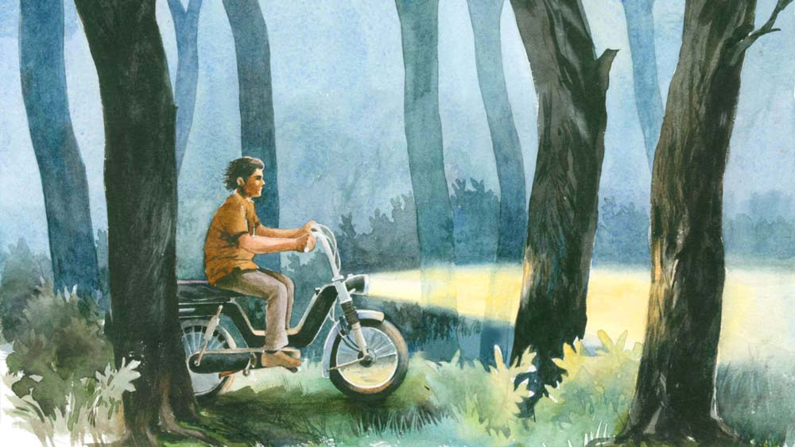

 
 <h1 align=center>পক্ষিরাজ</h1>
<h2 align=center>অনুপম মুখোপাধ্যায়</h2> সুজন একটা বাঁধানো ফোটোর সামনে দাঁড়িয়ে আছে। ফোটোটা একটা দু’-চাকা গাড়ির। মোপেড। পাশে সুজন। দু’বছর আগে তোলা। মডেলেরনাম অনুসারে গাড়িটাকে প্রথমে ‘লুনা’ বলেই ডাকত সুজন। পরে নাম দেয় পক্ষিরাজ।

পক্ষিরাজের পুরনো মালিক, অফিসের মেডিক্যাল সেকশনের শিবতোষ হালদার সুজনকে ঠকিয়েছিল। সেকেন্ড হ্যান্ড গাড়ির দাম কিছু কমায়নি। বলেছিল, “মাত্র দু’বছরের পুরনো। তাও দুটো পার্টস একেবারে নতুন লাগিয়েছি, গাড়িটার স্পিড, পিকআপ দারুণ। তাই একটু বেশি দাম দিতে হবে।”

তা-ই দিয়েছিল সুজন। একটা গাড়ির ওর দরকার ছিল খুব। প্রতিদিন আপ-ডাউন দুই-দুই চার মাইল রাস্তা ঠেঙিয়ে অফিস যেতে বেশ সুবিধে হবে। রাস্তা যা উঁচু-নিচু, সাইকেলে যেতে-আসতে দম বেরিয়ে যায়। কিন্তু গাড়িটা কেনার পর মাসতিনেক যেতে না যেতই সুজন বুঝেছিল, শিবতোষ একটা কথাও ঠিক বলেনি। এ রকম ঠিক না-বলা লোকের সংখ্যা বেড়ে যাচ্ছে দিনকে দিন। বড্ড মন খারাপ হয়েছিল সুজনের। প্রায় প্রতিদিনই গাড়িটা মাঝপথে বিগড়ে যেত। শিবতোষকে যে বলবে, তারও উপায় ছিল না। শিবতোষ বদলি হয়ে তত দিনে অনেক দূরে।

এ সব অনেক দিনের কথা। গাড়ি যত বিগড়েছে, ততই সুজন মনোযোগী হয়েছে গাড়িটার প্রতি। আজ এটা পাল্টায় তো কাল আর একটা। এ ভাবেই নিত্যসঙ্গী গাড়িটার প্রতি এক মায়ার বন্ধনে জড়িয়ে পড়েছিল সে। আর সে যেমন-তেমন ভালবাসা নয়, অন্যকে দিয়ে গাড়ির সামনে দাঁড়িয়ে আহ্লাদের নানা ভঙ্গিতে ছবি তুলিয়েছে। আদর করে নাম রেখেছে পক্ষিরাজ।

আজ এক বছর হল পক্ষিরাজ নেই। তার খণ্ড খণ্ড অংশগুলো বিচিত্র কায়দায় জোড়া লাগিয়ে সুজন ওকে ঘরের এক কোণে রেখেছে। সুজনের মুখে ওর গাড়ির কথা শুনতে আমার খুব ভাল লাগত। যখনই দেখা হত জিজ্ঞেস করতাম, “কী সুজন, তোমার পক্ষিরাজের খবর কী?”

সুজন তার এক মাথা ঝাঁকড়া চুল দু’হাত দিয়ে সরিয়ে বলত, “জানেন রঞ্জনদা, আজ এক কাণ্ড ঘটেছে...”

এ ভাবেই শুরু হত ওর পক্ষিরাজ কাহিনি। এক দিন বলল, “জানেন, আমার পক্ষিরাজ কথা বলেছে।”

আমি চমকে উঠেছি। বললাম, “সে কী রকম?”

সবিস্তারে সুজন যা বলল, তার সারমর্ম হল, পক্ষিরাজকে ভয়ে ভয়ে ও খুব স্পিডে চালাত না। যদি মেজাজ বিগড়ে যায়! কিন্তু সে দিন ওর দেরি হয়ে যাওয়ায় স্পিডটা বাড়িয়েছিল। তিরিশ চল্লিশ পঞ্চাশ হতে হতে একেবারে ষাটে তুলেছিল স্পিডোমিটারের কাঁটা। আর ব্যস, সঙ্গে সঙ্গে একটা অদ্ভুত শব্দ করতে থাকে গাড়িটা। শব্দটা ঠিক যেন ‘অ্যার্ র্ না, অ্যার্ র্ না’ গোছের। তার পর যেই ষাট থেকে নেমেছে স্পিড, অমনি শব্দও বন্ধ! সুজনের কথায়, “পক্ষিরাজ আমাকে সাবধান করে দিয়েছে, যাতে কোনও দুর্ঘটনা না ঘটে, সেই কারণেই বলেছে, আর না আর না।”

সুজন পক্ষিরাজকে নিয়ে যখন কথা বলত, তখন ওর বাচনভঙ্গির মধ্যে এমন একটা সারল্য মেশানো থাকত যে, বিশ্বাস না করে পারা যেত না। তবে কেউ বিশ্বাস করুক আর না-ই করুক, ওর তাতে কিছু মনে লাগত না। সুজন নিজে বিশ্বাস করত এবং এখনও করে, পক্ষিরাজের মধ্যে কোথাও একটা প্রাণের স্পন্দন ছিল।

বিড়ম্বনার শেষ ছিল না ওর। বিশেষত শীতকালে। ইঞ্জিনটা ঠান্ডা হয়ে থাকত। আমি নিজে দেখেছি, কত দিন সকালে ইঞ্জিনটাকে গরম করার জন্যে প্যাডেল করছে। দু’-দশ বার নয়, আশি, নব্বই, একশো বার!

এক দিন আমাকে বলল, “রঞ্জনদা, জানেন কী কাণ্ড, পক্ষিরাজকে গরম করতে আমাকে দু’শো বার প্যাডেল করতে হচ্ছে এখন। শীতটা জব্বর পড়েছে তো, তাই ওর শরীরটাও ঠান্ডায়জমে যাচ্ছে।”

আর এক দিন বলল, “পক্ষিরাজকে নিয়ে আর পারি না, এখন প্যাডেলেও কিছু হচ্ছে না।”

আমি বললাম, “তা হলে? স্টার্ট দিচ্ছ কী করে?”

সুজন বলল, “আপনি তো জানেন, আমার বাড়ির সামনের রাস্তাটা খাড়াই নেমে গেছে। ওই ঢাল বেয়ে এক বার গড়গড়িয়ে নামি, আবার উপরে ঠেলি।”

বিস্ময়ে চোখ বড় বড় করে শুধোই, “কত বার?”

উত্তরে জানতে পারি, “তা ধরুন, ও রকম কুড়ি-পঁচিশ বার গাড়ি নিয়ে ছুটে নামা, আবার হাঁপাতে হাঁপাতে উপরে ওঠা।”

কথা শুনে আমার বিস্ময়ের শেষ থাকে না, কারণ সে যে এক অমানুষিক পরিশ্রম!

আমি এক বার ভুল করে বলে ফেলেছিলাম, “সুজন, এত ঝামেলা পোহানোর চেয়ে গাড়িটা বেচে দিয়ে একটা ভাল মডেলের গাড়ি তো কিনে নিতে পারো।”

সে যে আমার কী ভুল, তা হাড়ে হাড়ে টের পেয়েছিলাম। সুজন আমার কথা শুনে হাউহাউ করে কাঁদতে থাকল। কাঁদতে কাঁদতেই বলল, “এ আপনি কী বলছেন রঞ্জনদা? পক্ষিরাজ ছাড়া আমি এক মুহূর্ত থাকতে পারি না। এ রকম কথা আর কখনও বলবেন না।”

চাকরিস্থল থেকে বহু দূরে এক গণ্ডগ্রামে সুজনের বাড়ি। আমাকে এক দিন গল্প করতে করতে তার গ্রামের কথা, তার পরিবারের কথা সব বলেছিল। অনেক কষ্টে দারিদ্রের সঙ্গে অহরহ লড়াই চালিয়ে সুজনকে বড় করেছেন ওর বাবা-মা। তাই চাকরি পাওয়ার পর গ্রামের বাড়ির শতচ্ছিন্ন অবস্থাটা পাল্টে বাবা-মাকে একটু সুখে রাখার জন্য প্রাণপণ চেষ্টা করে সে। ছোট ভাই আর বোনের লেখাপড়ার দায়িত্বও সে নিয়েছে। এখনও অবধি নিজের সংসার গড়ার ফুরসত হয়নি। পক্ষিরাজকে নিয়েই এখন ওর গার্হস্থ্য।

তার পর থেকে বেশ কিছু দিন সুজন আমার সঙ্গে ভাল করে কথা বলেনি। ওর অভিমান হয়েছিল। অভিমান হওয়াই স্বাভাবিক। আমি ছাড়া ওর অন্য সব সহকর্মীই পক্ষিরাজকে নিয়ে ঠাট্টা-তামাশা করত। আর সুজন যখন বুঝত, ওর সারল্য, সততা কিংবা পক্ষিরাজকে নিয়ে মশকরা হচ্ছে, তখনই সে ওদের এড়িয়ে চলত। একমাত্র আমিই ছিলাম ওর সমব্যথী। আমিও যে পক্ষিরাজকে ভালবাসি এটা কেমন করে যেন সুজন টের পেয়েছিল। সেই আমার মুখ দিয়ে ও রকম কথা ও কল্পনাও করেনি। আসলে আমি সুজনের কথা ভেবেই... যা-ই হোক, অনেক কষ্টে বুঝিয়ে সুজনের মন পেতে হয়েছে। আমি জানতাম, সুজন নানা ভাবে পক্ষিরাজকে সাজায়। কখনও সামনের আয়না দুটো পাল্টে দিয়ে, কখনও সিটের কভারটা নতুন লাগিয়ে, বা ইঞ্জিনের উপরে সামনের জায়গাটা রঙিন প্লাস্টিকে মুড়ে দিয়ে।

আমার বেফাঁস কথা বলায় ওর অভিমান ভাঙানোর জন্যেই এক দিন অফিসের পর সোজা ওর কোয়ার্টারে গেলাম। সঙ্গে নিয়ে গেলাম একটা চকচকে সিন্থেটিক গাড়ির ঢাকনা। আমাকে দেখে সুজন হাসল, আপ্যায়ন করল কিন্তু পক্ষিরাজকে নিয়ে একটা কথাও বলল না। বুঝলাম অভিমানটা অনেক গভীরে শিকড় চারিয়েছে। অগত্যা আমাকেই বলতে হল, “তোমার পক্ষী কোথায়? ওর জন্যে শীতের জামা এনেছি।”

লাফিয়ে উঠল সুজন। বলল, “তাই না কি, কই দেখি।”

দেখে বলল, “বাঃ, এ তো দারুণ মানাবে ওকে। শীতে বড্ড কষ্ট পাচ্ছে, জানেন, ভেবেছিলাম একটা কিনব... তা ভালই হল।” দ্রুত পাশের বারান্দায় গিয়ে মোড়ক খুলে কভারটা পরিয়ে দিয়েই আমাকে ডাকল। অবাক বিস্ময়ে উচ্ছ্বসিত হয়ে বলল, “একেবারে ঠিক মাপের এনেছেন তো, এতটুকু ছোটবড় হয়নি!”

পক্ষিরাজকে নিয়ে এ ভাবেই কথা বলত সুজন। যেন কোনও মানুষ, যেন নিজের ভাই বা বোন বা নিজের সন্তান। এ যেন বিখ্যাত বার্ডম্যান সেলিম আলির মোটরসাইকেল প্রীতির থেকেও বেশি। সুজনের গাড়ির প্রতি এই মমত্ববোধ, অটল ভালবাসার একটা মানে বোঝা যায়। সুজন সংবেদনশীল, নরম মনের মানুষ। সারল্যে ভরা ওর দু’চোখের চাহনি দেখলেই বোঝা যায় ওর মুখের কথা মর্মের গভীর থেকে নিঃসৃত। খাদহীন, ভরাট। কিন্তু উল্টো দিকে একটি প্রাণহীন যন্ত্রের মধ্যেও কি প্রাণের সাড়া মেলে কখনও কখনও? পাষাণের প্রাণ! হাক্সলি কি এ রকমই বলেছিলেন কিছু? সুজনও কি এ রকমই বিশ্বাস করত?

 

সচল পক্ষিরাজ যে দিন অচল হল, চির কালের জন্যে বন্ধ হয়ে গেল ওর গতি, সেদিনকার ঘটনা বিশদে শুনেছিলাম সুজনের কাছে। শোনার পর কেন যেন আমারও মনে হয়েছিল, সুজনের বিশ্বাসের মধ্যে কিছু সত্যতা হয়তো ছিল।

বর্ষাকাল। সে দিনটা ছিল রবিবার। ছুটির দিন। পক্ষিরাজকে সচল রাখার জন্যেই, এমনকি ছুটির দিনেও কোথাও না কোথাও এক চক্কর ঘুরে আসত সুজন। কিন্তু সকাল থেকেই জমাট ঘন কালো মেঘ হাতির শুঁড়ের মত ঝুলছিল আকাশ জুড়ে। কোথাও বেরোবে না, এ রকম এক ব্যতিক্রমী সিদ্ধান্ত নিয়ে সুজন ঠিক করেছিল পক্ষিরাজকে পরিচর্যা করার। সারাটা সকাল খুব যত্ন করে পক্ষিরাজকে পরিচ্ছন্ন করে দুপুরে একটা লম্বা ঘুম। খবরটা এসেছিল বিকেলে। আচমকা। সুজনের খুড়তুতো ভাই অবনী সংবাদটা এনেছিল। যে কাকা-কাকিমা এক সময় তাদের প্রভূত সাহায্য করেছেন, সেই কাকিমা মৃত্যুশয্যায়। এ দিকে বাইরের প্রকৃতি তখন ক্রমশ মাতাল হচ্ছে। দমকা বাতাসের সঙ্গে শুরু হয়েছে বূষ্টি। রাস্তায় যানবাহন প্রায় নেই। সুজনের এই কাকার বাড়ি প্রায় বারো কিলোমিটারের পথ। পক্ষিরাজই ভরসা। দেরি না করে ওই বৃষ্টির মধ্যেই অবনীকে নিয়ে বেরিয়ে পড়েছিল সুজন।

 

কিন্তু শেষ দেখা হয়নি। কাকিমা চলে গিয়েছেন। শ্মশানে দাহপর্ব শেষ হতে মাঝরাত্রি। সুজনের শ্মশান থেকেই ফিরে যাওয়ার কথা শুনে সবাই বাধা দিয়েছিল। বলেছিল, সকাল হলে ফিরে যেতে। কিন্তু সুজন নিরুপায়। পরের দিন ওর সকালে শিফ্ট ডিউটি এক জন সহকর্মী, নবীন নায়েকের সঙ্গে অ্যাডজাস্ট করা ছিল। নবীন অনেক দিন আগেই বলে রেখেছিল। এ রকম ক্ষেত্রে অনুপস্থিত হওয়া মানে সহকর্মীকেই বিপদে ফেলা। তাই সবাইকে বুঝিয়ে ভোর হওয়ার আগেই শ্মশান ছেড়ে রওনা হয়েছিল সুজন।

বৃষ্টি কখনও জোরে, কখনও ঝিরঝির করে পড়েই চলেছে। গন্তব্যে প্রায় পৌঁছে গিয়েছিল সুজন। তখনও এক কিলোমিটারের মতো বাকি। ফাঁকা রাস্তায় জোরেই ছুটছিল পক্ষিরাজ। হঠাৎ একটা ভয়ঙ্কর বজ্রপাত হয় কাছাকাছি কোথাও। আর ঠিক সেই মুহূর্তেই, সুজনের মনে আছে, পক্ষিরাজ সত্যিই ডানাওয়ালা ঘোড়ার মতো লাফিয়ে উঠেছিল। তার পর আর কিছু মনে ছিল না ওর। নিশ্চিত মৃত্যুর হাত থেকে পক্ষিরাজই সে দিন বাঁচিয়েছিল ওকে— এ রকমই মনে হয় সুজনের। বাজটা পড়েছিল খুব কাছেই। শব্দ শোনার আগেই তীব্র আলোর ঝলকানিতে চোখ ধাঁধিয়ে গিয়েছিল। ঠিক এই সময়ই উল্টো দিক থেকে আসা বাঁকের মুখে একটা দৈত্যাকার লরির সামনে পড়ে গিয়েছিল সে। সুজনের স্পষ্ট মনে আছে, ধাক্কা মারার পূর্বমুহূর্তে পক্ষিরাজ যেন অসম্ভব দুলে উঠেছিল! এমন এক ঝাঁকুনি দিয়ে সারা শরীরটা কাঁপিয়েছিল যে, তাতেই ছিটকে পড়েছিল সে একেবারে রাস্তার বাইরে। কত ক্ষণ অজ্ঞান হয়ে পড়ে ছিল ও জানে না। ভোরবেলায় মাঠে চাষ করতে আসা কিছু কৃষিজীবী মানুষ তাকে তুলেছিল।

জ্ঞান ফিরতেই আদ্যোপান্ত ঘটনাটা মনে পড়েছিল ওর। কী আশ্চর্য! হাঁটুতে সামান্য ছড়ে যাওয়া ছাড়া সম্পূর্ণ অক্ষত বেঁচে গিয়েছিল সুজন। আর পক্ষিরাজ? সুজনের কথায়— “আমার জন্যই জীবন বিসর্জন দিয়েছে ও।”

অকুস্থলে ফিরে গিয়ে ছড়িয়ে থাকা সমস্ত টুকরোগুলো একটা একটা করে পরম মমতায় তুলেছিল সুজন। দু’জন লোকের সাহায্যে একটা বড় খালি বস্তা জোগাড় করে তাতে ভরেছিল। লোক দু’টিই ওকে পৌঁছে দিয়েছিল কোয়ার্টারে।

সেই জোড়া লাগানো পক্ষিরাজ মিশরের মমির মতোই, সচল অবস্থায় ঠিক যেমনটি ছিল, তেমনই দাঁড়িয়ে আছে সুজনের ঘরের কোণে।

সচল নয়। অচল। তবু তো আছে।