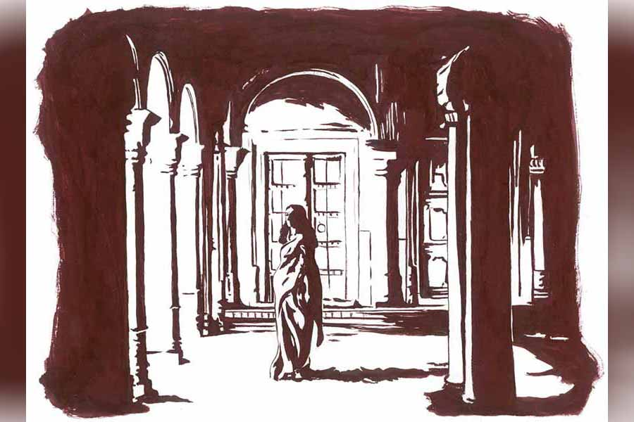

 
 <h1 align=center>পরভৃত</h1>
<h2 align=center>সব্যসাচী ধর</h2> 

জল-থইথই ধানের বীজতলায় উবু হয়ে বসে ধানচারার গোছা তুলছিল আগমনী। চরণের বৌ। জলকাদায় লেপ্টে থাকা আগমনীর টান-টান শরীরের দিকে তাকিয়ে থাকতে বড় ভাল লাগে মন্মথর। কাদানো মাঠে আগমনীর শরীর থেকে কেমন একটা মিঠে তাপ ছড়িয়ে পড়ছে, মন্মথ তাতে মন সেঁকে নেয়। তার বেশি আর কিছু করার উপায় নেই এখন। মন্মথ হা-হুতাশ করে মনে মনে, আর নিজেকে রায় বংশের কুলাঙ্গার ভাবতে কষ্ট হলেও মেনে নিতে বাধ্য হয়।

“ক’গন্ডা হল রে চরণ?" জমির আলের পাশেই মন্মথদের নিজস্ব পুকুর, জমি লাগোয়া উঁচু পাড়ের শিমুল গাছের নীচে বসে একটু হেঁকে জিজ্ঞেস করে মন্মথ।

“হল ওই বারো-তেরো, মুনিব। আজ এই থাক, বুজলা? কালকে বাকিটা মেরে দেবে আগু।”

“আরও দু’-এক গন্ডা মারলে
হত রে...” দর কষার ঢঙে বলে মন্মথ।

আড়চোখে তাকিয়ে আগু হাসতে হাসতে বলে, “তোমার তো খুব মজা লাগছে, বলো মথুদা? তোমারে তো আর জলেকাদায় ভিজে থাকতে হয় না। বেশি ভিজলে শরীর খারাপ করে। তা ছাড়া ঘরে শাউড়ির জ্বর। ঘর যেয়ে আবার রাঁধাবাড়া আছে গো মথুদা।”

আসলে আগু বীজতলা থেকে এত তাড়াতাড়ি উঠে যাক, তাতে মন সায় দিচ্ছিল না মন্মথর। তবু এখন সব কিছুতেই তাকে সায় দিতে হয়। কোনও কিছুতেই জোর দেওয়ার মতো তেজ আর নেই। চোখের সামনে এক এক করে সব আস্তরণগুলো ছেড়ে ছেড়ে পড়ে যাচ্ছে। ইট কাঠ কড়ি-বরগা বেরিয়ে আসছে পুরনো রায়বাড়ির মস্ত দালানে, তেমনই তার স্ত্রী লীনার সঙ্গে সম্পর্কের ক্ষেত্রেও! পলস্তারা-খসা ইমারতে তাও সিমেন্ট বালি দিয়ে টুকটাক মেরামতি চলে, লীনার ক্ষেত্রে তেমন কিছু খুঁজে পায় না মন্মথ। দু’জনের বয়সের অনেকটা পার্থক্য ওই চিড়কে মস্ত ফাটলে পরিণত করেছে।

*****

মরণের শ্বাস উঠলে চরণ মালের দাদু যতীন মাল নিজের বেটাকে অস্ফুটে শেষ বারের মতো বলে গেছিল, “ধনে-পুতে যেন রক্ষে করিস বাবুদের। অরাই আমাদের রক্ষেকত্তা। অরাই আমাদের সব। দরকারে জেবন দিবি বাপ।”

এ কথা সারা জীবন অক্ষরে অক্ষরে পালন করে, চরণ আর পলান দুই ভাইকে ভাল করে বুঝিয়ে দিয়ে তবেই বৈতরণি পেরিয়েছে ওদের বাপ। বাপ গত হলে অবশ্য চরণরা নিজেদের ছোটছোট ছেলেমেয়েদের আর ও সব বাক্যি শেখায়নি।

চরণের বলার দরকার হয় না, কারণ আর তেমন সম্ভাবনাও নেই। চরণ দেখতে পায় যাদের জন্য বংশপরম্পরায় এত ভাবনা, সেই বাবুবাড়ির অবস্থা এখন ওই ‘লম্ফু’তে তেল ভরার ‘ফোঁদল’-এর মতো। উপরটা বড় হলে কী হবে, নীচটা একেবারে চোঙা। এই মন্মথবাবুই বংশের শেষ। কিছু চাষের জমি, পুকুর আর বিঘে কয়েক গোচর ডাঙা। এখন শুধু হাড়গোড় পড়ে আছে পুরনো জমিদারির। তবে একটা ভাল আয়ের ভাঁড়ার ইদানীং তৈরি হয়েছে। বেশ কিছুটা দূরে যেখানে পতিত জমি ছিল, সেখানে এখন বিরাট জলাশয় করে মাছের ভেড়ি তৈরি করেছে অন্য লোকে। সেখান থেকে উপার্জন শুরু হয়েছে। সে টাকার পরিমাণ খুব একটা কম নয়।

এই হঠাৎ-আসা টাকা পরিবারের জমিদারি আমেজটাকে অনেক দিন পর ফিরিয়ে এনেছে। তবে মন্মথর নয়— লীনার জন্য। মন্মথ নেশা করে বাকি সম্পত্তি উড়িয়ে দেবে, এই আশঙ্কায় কিছুটা নামলা জমি লীনার নামে উইল করে দিয়ে গেছিল মন্মথর বাবা। সেই জমিতেই ভেড়ি। তাই লিজ়ের টাকার মালিক লীনা। সেই টাকায় নিজের মতো বাঁচতে সুবিধে হয় লীনার।

মন্মথ চোখ বুজলে সব ওই চরণের হাতে আসবে ঠিকই, কিন্তু চরণের মনে মনিবকে এখনও ধনে-পুতে রক্ষা করার কাজে অবহেলা নেই। ওর ইচ্ছেও করে না এই বিবর্ণ আর ক্ষয়ে আসা জমিদারবাড়ি হাতে এসে পেতে।

চরণের ভাই পলানটা জন্মবোবা। ওর কী ইচ্ছে, তা বোঝা যায় না। সে কাজের সময় কাজ করে, খায়-দায় ঘুমোয়। তবে পলানের বৌ তরী খুব বোঝে। নির্বাক স্বামীর জন্য বেশি ভাবতে হয়, কইতে হয়। নিজের দুটো মেয়ে আছে, তাদের জন্য চিন্তা হয়।

বড়বৌ আগমনীর আলাদা নজর। আগমনী স্বপ্ন দেখে, মথুদাদার বৌ যেমন ছাদের উপরে বসে শীতকালে চুল শুকোয়, ভাদুরে রোদে বিয়ের পুরনো বেনারসী আর দুনিয়ার শাড়ি-বেলাউজ শাল-সোয়েটারের ভাঁজ খুলে মেলে রেখে সারা বছরের জমে থাকা গন্ধ তাড়ায়, তারও সে রকম হলে মন্দ কী! রোদ খাওয়ানোর পর পলানের বৌ তরী আবার সব কিছু পাট করে গুছিয়ে তুলে রাখে সিন্দুকে। এ রকম এক দিন ওর কাজও করবে তরী। সে দিন গোটা ছাদময় উড়ে উড়ে বেড়াবে আগমনী। তার ছেলে দুটো বড় হয়ে মথুবাবুর আরামচেয়ারে বসে আরাম করবে।

*****

সন্ধেবেলায় চার পাশে আঁধার নেমে এলে চরণের মা বাঁশের খুঁটিতে হেলান দিয়ে, আঁচলের মুড়ি এক খাবলা চিবোতে চিবোতে কত বার চার নাতি-নাতনিকে শুনিয়েছে, “হেই মস্ত বাঘ, হড়াম করে এসে পড়লে! কামড়ে ধরলে চরণের বড়দাদুকে। সেই তখন যদি মথুবাবুর বড় দাদামশাই গুলি করে সব্বোনেশেকে না মারত, তা হলে কী বিপদই না হত— বল দিকিনি! কবেই এই বংশ নাশ হত। সে কথা ভুললে মহাপাতকের কাজ হয়।”

এক কথা বার বার শুনতে ভাল লাগে না আগমনীর। সে ফুট কেটে শাশুড়িকে বলে, “তুমি ছিলা নাকি জন্তুটোর আশপাশে? এমন করে বলো, যেন অদের দলের সঙ্গে তুমিও জঙ্গলে ছিলা! তোমার হাতেও তির-ধনুক বল্লম ছিল! এই ভর সাঁঝবেলায় এমন করে ভয় দেখায় নাকি দুধের বাছাদের? কেমনধারা আক্কেল!”

বুড়ি চুপ করে যায়। দু’খাবলা মুড়ি চিবিয়ে ফের বলে, “দেখে আয়গা বো, এখুনো সে মরা বাঘ কেমন কটমট করে তাকায়। এখুনো বাবুবাড়ির দেওয়ালে তেমনি করে মুখ ভ্যাঙাইছে। দেখ যেয়ে, ডোরাকাটা চামড়াও টাঙানো আছে। তাকালে মনে হয় গিলে খাবে! হাঁ করে কেমন ডর দেখায়— বাবা গো!”

“দেখেছি গো দেখেছি! পুজোর আগে লীনাবৌদি যখন ঘরের ঝুলকালি ঝাড়ার লেগে ডাকে, তখন দেখেছি। চার পুরুষ আগে মরা বাঘের মুখ দেখে আর ভয় লাগে না। তার চামটেও আর বাঘের লোম নেই। মরা বেড়ালের পারা লাগে। তবে সব গেলেও ওদের ঘরে বুনো গন্ধটা লেগে আছে গো। মরা বাঘে লয়, তার চেয়ে বেশি ভয় লাগে মথুবাবুর মাকে, আর বৌদিদিকে। আমার ছেলেদুটোর দিকে এমন করে তাকায়, যেন আমরা কত অন্যায় করিছি।”

আগমনীর কথা শেষ হলে চরণের মা আবার বলে, “কত পুরুষ ধরে চলা রাজত্তি! সেটা শেষের মুখে এলি, আর ব্যাটার বো বাঁজা হলে কার আর ভাল্লাগে বল, বো?”

“আরও মদ খাক মথুদাদা আর বৌদিদি। মদ খেয়ে খেয়ে মথুদার
পেট তো শেষ। আর বৌদিদিরও গতরখানা দেখো গা।”

চরণের মায়ের গলায় মৃদু অনুযোগ ফুটে ওঠে, “কেনে বো? চরণের বাপ-ঠাকুরদারা কি মদ খায়নি? এখনও তো মথু বোতলের শেষ থেকে চরণকে দেয়। তোর শ্বশুরকেও দিত মথুর বাবা।”

আগমনী মাথা নেড়ে বলে, “মথুদাদা আর ও সব খায় না গো। ডাক্তারে খুব বকেছে। বলেছে, আর সহ্য হবে না। এ বার খেলে মরবার লেগে খেতে হবে।”

“অমন বলিস না আগু। তবে, পলান যে বোতল কিনে নে আসে?”

এ পাশ-ও পাশ তাকিয়ে মৃদু গলায় আগু বলে, “মদের নেশা এখন মথুদাকে ছেড়ে আর এক জনারে ধরেছে গো মা। তোমার ছোটব্যাটা এখন মদ কিনে আনে ওই লীনা বৌদিদির লেগে।”

কথার শেষে সে আবার ভাল করে চার পাশটা দেখে নেয়। পলানের বৌ তরী আবার লীনাবৌদির খাস লোক। এ সব কথা শুনলে আবার লাগান-ভাঙান করে দিতে পারে!

এক সময় চরণরা জমিদারদের এই রায়বাড়ি থেকে বেশ কিছু দূরে থাকত। সে জমি-জায়গাও বাবুদেরই ছিল। সে ঘরদোর বানের জলে ধুয়ে যাওয়ার পর তারা এখন রায়বাড়ির পাশেই মাটির ঘরে থাকে। বাবা মারা গেলে খুব দ্রুত অবস্থা পড়ে গেল মন্মথর। আর হঠাৎ কী যে রোগ ধরল!

ডাক্তারে শুধু বললে, “খালি পেটেই মদ খেতেন নাকি মন্মথবাবু? একেবারে ছেড়ে দিতে হবে। লিভার বলে আর কিছু নেই!”

বিয়ের পর ক’বছর কেটে গেলেও লীনা মা হল না। শহরের ভাল ভাল ডাক্তারবাবুরা স্বামী-স্ত্রীর নানা পরীক্ষা-নিরীক্ষা করে বললেন, “আপনার তো কোনও সমস্যা নেই লীনাদেবী। সমস্যাটা মনে হচ্ছে আপনার স্বামীর।”

মন্মথ নেশা ছাড়তে বাধ্য হল, তবে যে ক’টা মদের বোতল ছিল, সেগুলো থেকে একটু একটু করে নামতে লাগল জলস্তর। রায়বাড়িতে নানাবিধ আদিম নেশার যে ধারা আছে, এ বার তার ভূতগুলো লীনার ভিতরে ঢুকল। একটা বোতল ফুরোলে পরেরটার ছিপি খুলল সে।

মন্মথ ভেবেছিল সামান্য ক’টা বোতল, দিনকয়েক পরেই ফুরোবে, আর না আনালেই হল। প্রথম দিকে লীনার সঙ্গে এ নিয়ে বাগ্‌বিতণ্ডা কম হয়নি। লীনা শুধু বলেছিল, “একটা কিছু লাগবে তো জীবনে। যে দিন আমার বাচ্চাকাচ্চা হবে, সে দিন থেকে আর মদ খাব না। আর জমিদারবাড়িতে মদ থাকবে না, মেয়েদেরকে মেয়েছেলে বানানো হবে না— তা হয় নাকি?”

মন্মথ বলেছিল, “আর তো জমিদারি নেই লীনা। এখন আমরা সাধারণ মধ্যবিত্তই। এ সব ছাড়ো। আর আমাদের পরিবারে মেয়েরা কখনও এ সব খায়নি!”

অন্য সময় হলে মন্মথ লীনাকে সবক শিখিয়েই ছাড়ত। এখন আর তেমন জোর করতে পারে না। কেমন যেন দুর্বল লাগে ভিতরে ভিতরে। লীনা যে মা হতে পারল না, এর জন্য অপরাধী লাগে নিজেকে। ওর চেয়ে অনেকটা ছোট লীনা। এখনও সে যথেষ্ট সুন্দরী, শরীরে উর্বরতার জোয়ারে ভাটা পড়েনি। ইদানীং হাতে আসা টাকাপয়সা আর নেশা যেন ওকে আরও সুন্দরী করে তুলেছে। এখন লীনার মদ খেতে আরও সুবিধে, কারণ শাশুড়ি অসুস্থ, শয্যাশায়ী। একে চোখের সামনে ছেলের বাড়াবাড়ি অসুস্থতা, তার উপরে বাড়ির একমাত্র বৌয়ের সন্তানাদি না হওয়া বৃদ্ধার অন্তিমশয়নের পথকে ত্বরান্বিত করে তুলেছে।

*****

পলানকে রায়বাড়ির ভিতরের কাজ বেশি সামলাতে হয়। তরী লীনার সঙ্গে লেগেই থাকে। পলানকে নিয়ে এক সময় গাঁয়ে-ঘরে খুব রগড় চলত জমিদারদের আড়ালে। মন্মথর ছোটকাকাটাও এমনই বোবা ছিল। আর চেহারাটাও অনেকটা ছিল ওই পলানের মতোই। এই সমাপতন গ্রামের লোকের চোখ এড়িয়ে যাবে, তা হয় না। আর রায়বাবুরা ষড়রিপুর পূজারি হিসেবে খুব একটা উদাসীন ছিল, এমন কথা কেউ বলবে না! অনেকেই বলে, “ওই পলানটা মথুর ভাই রে! মজা করে কেউ পিছন থেকে বলে, “রায়দের ছোট্টবাবু!”

পলানের কানে এ সব গ্রাম্য কথা ঢোকে না। তবে তরীর কথা সে বুঝতে পারে। রাতে শোওয়ার পর স্বামীকে সে কথায় ও আকারে ইঙ্গিতে বোঝাচ্ছিল, আগমনী কতখানি লোলুপ চোখে চেয়ে আছে এই দালানকোঠার দিকে। মথু শেষ হলেই ওর পোয়াবারো! লীনাবৌদিকে মাতাল করে রাখার মূল পরিকল্পনা চরণেরই করা বলে মনে করে তরী। ওই নামলা জমিতে ভেড়ি কাটার লোকজন তো চরণই ধরে এনেছিল। সে-ই মথুদাদা আর বৌদিকে বুঝিয়েছিল, লাভ ছাড়া ক্ষেতি নাই। এ সব শুনে পলানের চোখমুখ লাল হয়ে ওঠে। তরী বুঝতে পারে, ওর স্বামীর ভিতরে রাগ চরমে উঠছে। তরী জানে, পলানের রাগ বড় বুনো। চিৎকার করে দু’কথা বলে গালমন্দ, শাপশাপান্ত করে ঠান্ডা হওয়ার খ্যামতা ভগবান ওরে দেন নাই। রেগে গেলে কেমন একটা অদ্ভুত জান্তব আওয়াজ গলা থেকে বেরোয় পলানের। আগমনী সে আওয়াজ টের পায়। কান খাড়া করে শোনে তরী বলছে, “মথুদাদার একটো ছেলে হলে ভাল হত বলো!”

আর কিছু কথা শুনতে পায় আগমনী। সবচেয়ে অবাক লাগে যখন তরী বলে, “কেনে, কত জনের দুটো বৌ হয় না? এই রায়বাবুদেরই তো কত জনের দুটো বৌ ছিল। আমিই তো বলছি, বৌদির পেটে ছেলে হোক।”

পরদিন সকালে অকারণে দুই জায়ে চরম ঝগড়া বাঁধে। তরী বুঝতে পারে না, এই সাতসকালে আগমনী এমন পায়ে পা লাগিয়ে গোল করে কেন! আগমনী রাগের মাথায় ভুল করে বলে ফেলে, “বৌদির লেগে খুব পরান কাঁদে, বল?”

ছাদের জানলার ধারে দাঁড়িয়ে ঝগড়া শুনতে পাচ্ছিল লীনা। আগমনীর এই কথাটাও শুনতে পায়। যে নীল রক্ত মন্মথর শরীর থেকে উধাও হয়ে গেছিল, তা যেন ক্রমে ক্রমে সঞ্চারিত হয় লীনার মধ্যে।

চরণ, আগমনী, মন্মথ মাঠে গেলে তরীর কাছে শোনে সকালে ঝগড়া লাগার কারণটা। আগমনী শেষে কেন বললে বৌদির লেগে পরান কাঁদার কথা, সেটাও জিজ্ঞেস করে। রাতের কথার আদ্যোপান্ত বলে তরী। বোবা লোককে কথা বোঝাতে গেলে একটু জোরে বলতে হয়, তাই রাতের সব কথা যে আগমনী শুনতে পেয়েছিল, সেটা বুঝতে পারে লীনা। সে শুধু বলে, “আচ্ছা, ব্যবস্থা করছি একটা। এখন না-হয় পড়তির দিকে, কিন্তু আমিও রায়বংশের বৌ হয়েই এখানে এসেছি।”

*****

মাসকয়েকের মধ্যে মন্মথর মা মারা গেলে রায়বাড়ি আরও ফাঁকা হয়ে উঠল। শেষের দিকে বুড়িমা তরী আর পলানকে হাত ধরে বারবার করে বলত, “তোরাই দেখিস।”

তরীর চোখে জল আসত, নির্বাক পলানের গলায় এক অদ্ভুত শব্দ তৈরি হত সে সব সময়।

নির্বিবাদী চরণ বুঝতে পারে, যত দিন যাচ্ছে, আগুর ঘুম তত কমে যাচ্ছে। সারা দিন প্রবল খাটাখাটনির পর চরণের নাক ডাকে, আর আগমনীর কিছু ইন্দ্রিয় আরও বেশি জেগে ওঠে তরীর কথা শোনার জন্য। তরীর মুখে লীনাবৌদি কিংবা মথুদাদার কথা শুনলেই চরণকে ঝাঁকুনি দিয়ে বলে, “ওই দেখো! আবার বলছে!”

চরণ পাশ ফিরে শুয়ে বলে, “তু শোন, সকালে মাঠে যেয়ে বলিস, শুনব’খন।” বলে ফের ঘুমিয়ে পড়ে।

মা গত হওয়ার পর আবার একটু-আধটু মদ ধরেছে মন্মথ। লীনা এখন স্বাভাবিক মদ্যপায়ী। তবে ইদানীং রাত্রি হলে লীনা খুব ভয় পায়। ভৌতিক ভয় নয়, ক্রমশ নিঃসঙ্গ হয়ে আসার ভয়। চরণ ভাইকে বলেছে, “রেতে তোরা অদেরকে আগলাগা। ওখানেই যেয়ে শোগা।”

তরীর শাশুড়ি খুব আনন্দ পেয়েছে এই নির্দেশে।

*****

আজকাল একটা সুন্দর ফুটফুটে ছেলে রায়বাড়ির ছাদে হামাগুড়ি দেয়। তরীর কোলে, পলানের কোলে চেপে খিলখিল করে হাসে। পলান আপনার গায়ের গন্ধ অনুভব করে শিশুর মধ্যে। প্রথম দিকে লীনার খুব ভয় ছিল, বংশে বোবা ছেলের না জন্ম হয়! কিন্তু এ ছেলের মুখে শব্দ আছে! এক দিন মা বলে ডাকবে।

মন্মথর বাবা ডাক শোনা হয়নি। তবে দেখে গেছে, পলানের কোলে লীনার ছেলে আনন্দ করে। আরও আনন্দ যে, রায়বাড়ি ওই মালদের হাতে যায়নি। গভীর রাতে সে বহু বার বুঝতে পেরেছে লীনা বিছানায় নেই। অনেক কিছুই বুঝতে পারত, কিন্তু পলানের উপরেও রাগ হত না। তখন আর একটু লীনার কাছেই ঋণী হতে হত, ওর মদের বোতলের ঢাকনা খুলে আর একটু মদ নিতে হত।

*****

লীনার কোলে ফুটফুটে ছেলে দেখে খুব আনন্দ পেয়েই মরেছে পলানের বৃদ্ধা মা। মরার আগেও বুড়ির মনে পড়েছে, সেই হাঁ-করা মরা বাঘের ঘরে ঝুলকালি ঝাড়তে গেলে কেমন করে তারে ঘাড় মটকে ধরেছিল মথুর বোবা-কালা ছোটকাকা! তার পরই তো বোবা-কালা পলানটা জন্মাল!

লীনা তার শাশুড়ির মুখে তাঁর ছোটঠাকুরপোর এই শিকার-কাহিনি জেনেছিল। ঝি হরিদাসী দেখে ফেলেছিল বাঘের শিকার ধরা, আর সেটা রায়গিন্নিকে জানিয়েছিল। পলানকে জানিয়েছিল তরী! তরীকে খোদ পলানের মা—নিজের মুখে!

সে-যাত্রা ভাগ্যিস সে শিকার হয়েছিল, তাই তো রক্তের ধারা আজও বন্ধ হল না!

