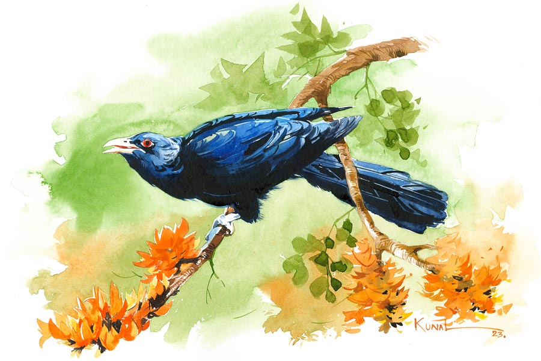

 
 <h1 align=center>পরভৃৎ</h1>
<h2 align=center>তমাল বন্দ্যোপাধ্যায়</h2> ফাল্গুনের দিশাহারা চরাচর। নিজেকে যথাসম্ভব বিকশিত করে সে তার রঙিন বুক মেলে ধরেছে আকাশের দিকে, তবু আকাশ চিরকালই উদাসীন। এই উদাসীনতা সহ্য হয় না বসন্তের, সে আরও বেশি ফুল্লকুসুমিত হয়ে উঠে ঔদাসীন্য ভাঙার চেষ্টা চালিয়ে যায় আকাশের, কিন্তু সব চেষ্টাই বৃথা।

দূরে কোথাও কোকিল ডাকছে, কুহুতানের কাতরতায় কেঁপে কেঁপে উঠছে বনাঞ্চল। দুই সহপাঠী কিশোরের স্কুল থেকে ফেরার রাস্তা যে-হেতু এই বনভূমির মধ্যে দিয়েই পায়ে পায়ে তৈরি, তাই এর মধ্যেই কোথাও কারণে-অকারণে দাঁড়িয়ে পড়তে বাধে না ওদের। সারা বছরই এই পথে কিছু না কিছু আশ্চর্য জিনিস যেন ওদের জন্যে অপেক্ষা করে থাকে। বিশেষ করে এমন ভরন্ত মধুমাসে পায়ে পায়ে বিছিয়ে থাকে শিমুল, কৃষ্ণচূড়া, বাঘের রক্তাক্ত নখের মতো পলাশ, থোকাথোকা অশোক।

দু’ধারে কত গাছই তো পড়ে, তবে তাদের মধ্যে সবচেয়ে বেশি টানে নাগকেশরের এই উত্তুঙ্গ গাছটি। বাকি আরও অনেক ফুলের সঙ্গে মাটি থেকে সমস্ত কাণ্ড জুড়ে ফুটে থাকা এই ফুল ছিঁড়ে স্কুলব্যাগে ভরে বাড়ি নিয়ে যায় ওরা, কিন্তু সে দিন ফুল ছিঁড়তে গিয়ে গোড়ার কাছে ঘাসের মধ্যে ওরা একটা ডিম পেয়েছিল।

বসন্ত শেষ হয়ে এল, নতুন বছর সমাগত। তবু কোকিলের ডাক আসছিল অনেক দূর থেকে। ডিমটা হাতে তুলে নিয়ে দীপেশ প্রশ্ন করেছিল বন্ধু শুভব্রতকে, “মনে আছে, সে দিন বাংলা স্যর যখন আমায় ‘পরভৃত’ কাকে বলে জিজ্ঞেস করলেন, আমি বলতে পারিনি। ক্লাসের ফার্স্টবয় হয়ে লজ্জায় মাথা হেঁট, কিন্তু তুই পেরেছিলি, উত্তরটা ঠিক বলে দিয়েছিলি!”

“বেড়ালের ভাগ্যে শিকে ছেঁড়া আর কী। কোকিল কাকের বাসায় ডিম পাড়ে, সে পরের দ্বারা পালিত তাই কোকিলকে ‘পরভৃত’ বলে আর পরকে পালন করে, তাই কাক হল ‘পরভৃৎ’। দাদুর মুখে শুনেছিলাম, তাই বলে দিয়েছিলাম। এক বার ভেবেছিলাম জানলেও বলব না, তোর খারাপ লাগতে পারে। তার পর পেট গুড়গুড় করতে শুরু করল... তুই রাগ করিসনি তো?”

“দূর পাগল! রাগ করব কেন!” ডিমটা হাতের তালুর মধ্যে নিয়ে দীপেশ বলে উঠেছিল, “তোর কি মনে হয়, এটা কোকিলের ডিম? এই গাছের মাথার দিকে কোনও কাকের বাসাও থাকতে পারে, কী বলিস?”

ডিমটা নিজের হাতে নিয়ে শুভব্রত বলেছিল, “হতেও পারে, আবার কাকের ডিমও হতে পারে। শুনেছি কাক আর কোকিলের ডিম নাকি একই রকম দেখতে, তাই কাক কোকিলের ডিমকে নিজের ভেবে তা দিয়ে যায়। অত তা-ফা দিয়ে বাচ্চা মানুষ করা কোকিলের পোষাবে না, তাই কাকের ফাঁকা বাসা পেলে ওরা নিজের ডিম পেড়ে পালিয়ে যায়।”

কিছু ক্ষণ থমকে থাকার পরে দুই বন্ধু দু’জনের মতো বাড়ি ফেরে। দীপেশ ফার্স্টবয় হলেও স্কুল থেকে ফিরে মাঠে ফুটবল না পেটালে তার চলবে না, আর শুভব্রতর বিকেল মানেই আগানবাগান চষে বেড়ানো। কিন্তু এই দিন কোনও রকমে নাকেমুখে গুঁজে খেয়েই সে বেরিয়ে আসে। ডিমটা সযত্নে দু’হাতের মধ্যে নিয়ে ছুট দেয় বাবার সহকর্মী অম্বরীশ মিত্রের বাড়ি। পক্ষিপ্রেমের জন্য লোকটাকে সবাই এ জেলার ‘সালিম আলি’ বলে। একাই থাকেন বাড়িতে। যারা চেনে, বলে লোকটা বিয়ে করেছিল ঠিক সময়েই, কিন্তু পাখির নেশায় সারা জীবন এমনই উড়নচণ্ডী যে, বৌ সঙ্গে থাকেনি বেশি দিন। যে যা-ই হোক, সেই মিত্রবাবুর সামনে তালু খুলে ধরে সে, “এটা কিসের ডিম অম্বরকাকু, কাকের না কোকিলের?”

ডিমটা পাঁচ আঙুলের মাথায় শূন্যে তুলে ধরেন অম্বরীশ মিত্র, বলেন, “কাকেরও নয়, কোকিলেরও নয়, এটা সাপের ডিম। তোরা এত বনেবাদাড়ে ঘুরে বেড়াস, পাখি আর সাপের ডিমের ফারাক বুঝিস না! সাপের ডিম হয় লম্বাটে, খোলাটা তুলনায় নরম আর পাখিদের ডিমের খোলাগুলো তুলনায় শক্ত, আকার গোল ধরনের।”

“সাপের ডিম! বলেন কী, আমরা ভেবেছিলাম এখন বসন্তকাল, তাই কোকিলের ডিমই হবে, না হলে কাকের। শুনেছি কোকিলরা কাকের বাসায় ডিম দেখলে সেগুলো ফেলে নষ্ট করে সে জায়গায় নিজেদের ডিম রেখে পালায় আর কাক সেগুলো তা দিয়ে ফোটায়, তাই কাকদেরবলে ‘পরভৃৎ’।”

“কাকরাই যে শুধু ‘পরভৃৎ’ তোকে কে বলল! ছাতারে পাখিরা কি তা হলে বানের জলে ভেসে এসেছে?”

“মানে?”

“মানে কাককে যদি লোকে পরভৃৎ আর কোকিলকে পরভৃত বলে, তা হলে ছাতারে আর পাপিয়াকেও তাই বলা উচিত। ওদের ব্যাপারটাও তো সেই একই, পাপিয়ারা বাসা তৈরি করে না, তাই ছাতারেদের বাসায় ডিম পেড়ে উড়ে যায়। ওদের ডিমও যে-হেতু একই রকম দেখতে, তাই ছাতারেরাও পাপিয়ার ডিমকে নিজের ভেবে তা দিয়ে যায়।”

বুকশেলফ থেকে নিজের হাতে তোলা পাখিদের ছবির অ্যালবাম বার করে আনেন অম্বরীশ, বলেন, “পাপিয়া দেখেছিস? ছাতারে?”

অ্যালবামের ছবি দুটো দেখে চকচক করে ওঠে শুভব্রতর চোখ, সে বলে, “ছাতারে মনে হচ্ছে দেখেছি, কিন্তু পাপিয়া দেখেছি কি না মনে পড়ছে না ।”

“নিজে চোখে দেখার বিকল্প হয় না, সে সুযোগ যদি না-ও পাস, তবে পাপিয়া চেনার সহজ উপায় হল— এরা জোৎস্না রাতে ‘চোখ গেল চোখ গেল’ ডেকে উড়ে বেড়ায় আর প্রজননের ঋতুতে ‘পিউ কাঁহা পিউ কাঁহা’ বলে ডেকে ডেকে সঙ্গিনী খোঁজে, কিন্তু ওরা জোড়া বাঁধে না।”

সঙ্গিনী, জোড়া, প্রজনন— এই সব শব্দ কানে এলে আর সব ক্লাস নাইনের ছেলের মতো তারও যে গোপন উত্তেজনা হয় না তা নয়, তবু সে এই সব চিন্তা চিরকালই এড়িয়ে চলে। কারণ সে জানে, তাকে দেখতে সুবিধের নয়। বড্ড রোগা, শ্যামলা, উপরপাটির দাঁতও বেশ খানিকটা উঁচু। সে মেয়েদের পারতপক্ষে এড়িয়ে চলে, কেউ ওর দিকে আসছে দেখলে পালানোর পথ খোঁজে। তবু সে শোনে হাঁ করে, অম্বরীশ মিত্র বলেন, “পাখিদের চেয়ে বিচিত্র জীব খুব কম আছে এই পৃথিবীতে। মানুষের জীবনের সঙ্গে ওদের খুব মিল।”

প্রথম যে দিন অম্বরীশকাকুর কাছে একা গিয়েছিল শুভব্রত, সে দিন দেওয়ালের হুক থেকে একটা বাবুইপাখির বাসা নামিয়ে আনেন অম্বর মিত্র, “এটা কাদের বাসা নিশ্চয়ই বলতে হবে না?” বাসার গর্তের ভিতর থেকে একটা ডিম বার করে এনে ওর হাতে দেন, “বাবুইকে লোকে কী বলে জানিস তো?”

“হ্যাঁ, ভাল ঘর তৈরি করে, তাই অনেকে বলে ঘরামি পাখি।”

“হ্যাঁ, তবে ঘর তো বড় গোলমেলে জায়গা, কারও কপালে সয়, কারও সয় না। বাবুই ভাল ঘর তৈরি করে বলেই যে ভাল ভাবে ঘর করা কপালে থাকবে, তার কিন্তু কোনও মানে নেই।”

ছোকরার দুই চোখে বড় বড় দুটো প্রশ্নচিহ্ন দেখে অম্বরকাকু বলেন, “মানে সব বাবুইয়ের কপাল তো এক নয়, অনেক পুরুষ-বাবুই তার ঘরের অর্ধেকটা সুন্দর করে বানিয়ে নারী-বাবুইকে সেটা দেখতে ডাকে। ডাক শুনে অনেকেই আসে, দেখে উড়েও যায়, কিন্তু এক জন চুপটি করে বসে বসে দেখে, পছন্দ হলে থেকে যায়। এক সঙ্গে ঘর করতে শুরু করে, তার পর কিছু না জানিয়ে হঠাৎই এক দিন উড়ে কোথাও চলে যায়। শূন্য ঘরে পুরুষটি মনমরা হয়ে বসে থাকে, অপেক্ষা করে, কিন্তু নারীটি আর ফেরে না। তাই বলে সে কিন্তু আর অন্য কাউকে ঘর করতেও ডাকে না, সারা জীবন একাই কাটিয়ে দেয়, বিপত্নীক।”

এক ভাবে দাঁড়িয়ে শোনে শুভ। ভদ্রলোকের সারা ঘরটার দেওয়ালগুলো জুড়ে অসংখ্য পাখির বাসা। তার মধ্যে থেকে আর একটা বাসা নামিয়ে এনে অম্বরকাকু বলেছিলেন, “এটা হল ঘুঘুর বাসা। লোকে বলে ভিটেয় ঘুঘু চরানোর কথা। কেন বলে জানিস?”

“ঘুঘু চরানো মানে কি সর্বনাশ করা, ভিটেমাটি চাঁটি করে ছাড়া?”

“হ্যাঁ। ঘুঘুরা নির্জনতম পাখি। ওদের অভ্যেস লোকজনের কোলাহল থেকে দূরে, জনহীন নিস্তব্ধ শুনশান এলাকায় ঘুরে বেড়ানো। কারও বাড়িতে ঘুঘু-চরানো মানে তার বাড়ি থেকে লোকজন তাড়িয়ে সেটাকে ঘুঘু চরার মতো ফাঁকা, নির্জন করে দেওয়া। ঘুঘুর প্রথম যে সঙ্গিনীটির সঙ্গে মিলন হয়, তার সঙ্গেই সে সারা জীবন কাটিয়ে দেয়। সঙ্গী মরে গেলে অন্য ঘুঘুটি বাকি জীবন নিঃসঙ্গই কাটিয়ে দেয়। আর যে কারও সঙ্গ চায় না, সেটা কিন্তু তার কম্পালশন নয়, তার চয়েস।”

লোকটার সব কথা যে তার মাথায় ঢুকেছে তা নয়, তবু সে দাঁড়িয়ে থাকে ঠায়। অম্বর মিত্র একে একে পাতিকাক, কাদাখোঁচা, জলপিপি, ডাকপাখি, কোয়েল, পানকৌড়ি, ঘুঘু, শ্যামা ইত্যাদি আরও অন্তত দশ রকমের ডিম ওকে হাতে ধরিয়ে দেখাতে দেখাতে বলেন, “ভাল করে দেখবি, খুঁটিয়ে খুঁটিয়ে দেখবি। এমন করে দেখবি, যাতে আরও হাজারটা পাখির ডিমের মধ্যে থেকে আলাদা করতে পারিস।”

শেষে একটা কোকিলের ডিম হাতে দিয়ে সেটা আর ফিরিয়ে নেন না অম্বরকাকু, বলেন, “এটা তোর, আমার একটা বাড়তি ছিল, তোকে দিলাম। যা, বাড়িতে গিয়ে যত্ন করে কাচের বয়ামে তুলোর মধ্যে রেখে দিবি। আজ থেকে বনবাদাড়ে ঘুরতে গেলে যত রকম ডিম পাবি সব আলাদা আলাদা জারে সংগ্রহ করবি। কোনটা কোন পাখির ডিম, সেটা লিখে আঠা দিয়ে সেঁটে রাখবি গায়ে।”

তার পর তিনি শুভব্রতর কানের কাছে এসে চাপা গলায় বলেন, “ডিম মহামূল্যবান জিনিস রে শুভ, এই বিশ্বসংসারের সবচেয়ে মূল্যবান। কারণ আমাদের এই ব্রহ্মাণ্ডও যে একটা ডিমই। ব্রহ্ম অর্থাৎ সর্বশক্তিমান, আর অণ্ড মানে ডিম, এই দুই মিলে হল ব্রহ্মাণ্ড। কসমিক এগ। পরমেশ্বর হলেন মস্ত এক পাখি, তিনি এই মস্ত বড় ডিমটা পেড়ে রেখে সেই যে আকাশে উড়ে গিয়েছিলেন, আর ফেরেননি!”

করতলে ডিমটা নিয়ে দাঁড়িয়ে থেকে সে দিন আপাদমস্তক শিউরে উঠেছিল শুভর। ডিমটা মুঠোর মধ্যে নেওয়ার সেই দিনটা থেকে আজ সে পেরিয়ে এসেছে তিরিশটা বছর। এখন সে এক গঞ্জ স্টেশনের রেলওয়ে সিগনাল-অপারেটর হলেও লোকে তাকে চেনে এই জেলার সবচেয়ে অভিজ্ঞ ডিম-সংগ্রাহক হিসাবে। চারশোর কাছাকাছি পাখির ডিম সংগ্রহে আছে তার।

ডিমের নেশা বলে সংসারজীবনে বড় একটা অবহেলা করেছে বলা যায় না। ব্রেস্ট ক্যানসারে স্ত্রী সুদেষ্ণার অকালমৃত্যুর পর ছেলে সোমব্রতকে বড় করে তুলছে একা হাতেই। সে আর তার ছেলে মিলে বাড়ির একতলায় তৈরি করে তুলেছে পুরোদস্তুর এক সংগ্রহশালা। প্রতি মাসেই প্রায় নতুন একটা ডিম এসে যোগ হয় ওদের সংগ্রহশালায়, কিন্তু সোমের বড় আক্ষেপ, ওদের বাড়িতে সব ডিমই এদেশি। পেঙ্গুইন, অস্ট্রিচ বা এমু জাতীয় কোনও পাখির বড় ডিম ওদের সংগ্রহে নেই।

শুভব্রত ওকে অনেক বুঝিয়েছে, ও সব ডিম দূর দেশের, ও সব ডিম না হলেও ওদের চলে যাবে, কারণ ওদের সংগ্রহশালা তো বাংলার পাখিদের ডিম নিয়েই। কিন্তু ছেলের নজর ছোট থেকেই বাইরের দিকে।

সে বলে, “কেন, তোমার বেস্ট ফ্রেন্ড দীপেশকাকু তো অস্ট্রেলিয়ায় থাকে। সে তো এক সময় আমাদের এই বাড়িতেই পড়ে থাকত বলে শুনেছি, মায়ের পিসতুতো দাদা না কী যেন। তোমার, মায়ের আর দীপেশকাকুর ছবিও তো এক সঙ্গে টাঙিয়ে রেখেছ বাইরের ঘরে। এতই যখন ভাল সম্পর্ক, ওঁকেই একটা ফোন করো না, ইচ্ছে করলে উনি তো মোটামুটি সাইজ়ের একটা এমু পাখির ডিম কুরিয়ার সার্ভিসে পার্সেল করে পাঠিয়ে দিতে পারেন, অন্তত আমার জন্মদিনের উপহার হিসেবেই যদি পাঠিয়ে দেন।”

শুভ হাসে, বলে পরের দিনই দীপেশকে ফোন করবে। কিন্তু সে আর করে উঠতে পারে না কখনও। কী করেই বা করবে, তার ফোন, মেল আইডি ঠিকানা-ফিকানা যে আর কিছুই জানা নেই। আমেরিকা থেকে কসমোলজি নিয়ে গবেষণা করে সে এখন অস্ট্রেলিয়ার কোনও এক রিসার্চ সেন্টারে সিনিয়র সায়েন্টিস্ট। তবে বন্ধু দীপেশ যখন নিজে থেকেই আর কোনও সম্পর্ক রাখতে চায় না, তখন সে-ই বা রাখতে যাবে কোন দুঃখে।

সোমকে যে কথা বলা যায় না তা হল, দীপেশের সঙ্গে শুভব্রতর সম্পর্কটা পরে আর ছোটবেলার মতো ছিল না। দীপেশের মানসিকতাও বদলে গিয়েছিল অনেকাংশে। যৌবনের তুঙ্গে নিজের পিসতুতো বোনের গর্ভে সন্তান এনে ফেলার পর আর দায়িত্ব নিতে চায়নি দীপেশ। প্রিয়তম বন্ধু কখনও ফেরাবে না জেনে অন্তঃসত্ত্বা প্রেমিকাকে তার দায়িত্বে রেখে নিশ্চিন্তে উড়ে পালাতে পেরেছিল সে, আর কখনও খোঁজ নেওয়ার প্রয়োজন মনে করেনি। আজ আর সে কেন পিছন ফিরে তাকাবে! শুভব্রত নিজের নাম আর পরিচয় দিয়েছিল সেই মেয়েটিকে, তার অনাগত সন্তানকে। সোমব্রতকে কখনও জানতেই দেয়নি যে, সে তার আসল বাবা নয়, তার বায়োলজিক্যাল বাবা আসলে দীপেশ। তা ছাড়া যে লোকটা জন্মদাতা হয়েও নিজের ছেলের কোনও খোঁজখবর রাখেনি, সুদেষ্ণা মারা যাওয়ার পরেও একটা ফোন কল অবধি করার প্রয়োজন বোধ করেনি, সেই মানুষটা ছেলের জন্মদিনের উপহার হিসাবে এমুর ডিম পাঠাবে, ভাবনাটাই যে অলীক।

দীপেশ আসলে ছিল কোকিল, পরভৃত। সে কেন পরভৃৎ কাকের বাসায় রেখে যাওয়া তার ডিমের খোঁজ রাখতে যাবে! শুভব্রত তাই আর পুরনো কথা নিয়ে কোনও রকম নাড়াচাড়া করতে চায় না। ছেলে জিজ্ঞেস করলে বলে, “দীপেশকে তো প্রতি সপ্তাহেই ফোন করি, কিন্তু নাম্বার ডাজ় নট এগজিস্ট বলে। আমার কাছে থাকা এই নাম্বারটা নিশ্চয়ই এত দিনে পাল্টে ফেলেছে। তা ছাড়া ভয়ানক ব্যস্ত লোক, কসমিক-এগ নিয়ে বই লেখায় ব্যস্ত শুনেছি, ওদের কি এই সব পাখির ডিম-টিম নিয়ে ভাবার সময় আছে রে!”

সোমব্রত ভুরু কুঁচকোয় করে, “কী রকম বন্ধু তোমার?”

শুভব্রত হেসে ছেলের মাথায় হাত রাখে, “বন্ধুরা কি আর চিরকাল বন্ধু থাকে রে!”