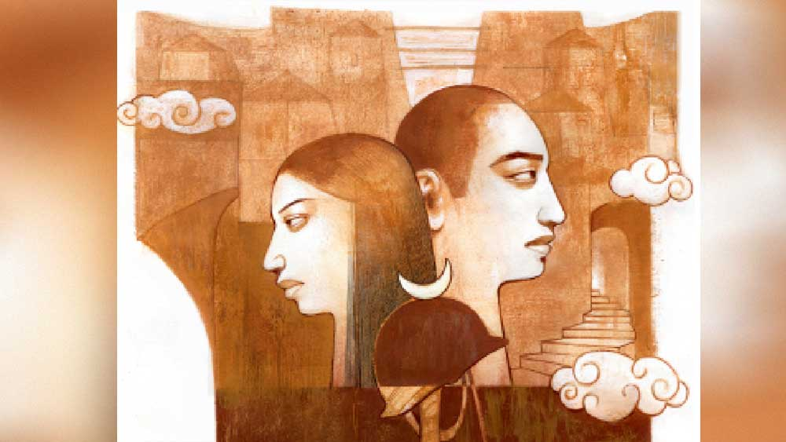

 

<h1 align=center>পরাজিত</h1>
<h2 align=center>মহুয়া চৌধুরী</h2>
শেষ পর্যন্ত বাড়ি ফাঁকা হয়ে গেল। যেমন হওয়ার কথা ছিল। অথচ মাত্র বাহাত্তর ঘণ্টা আগেও এত বিলাপ, কান্না আর আর্তনাদে চার পাশ কেঁপে উঠছিল যে, মনে হচ্ছিল চিরকালই চলবে এই সব তীব্র শব্দের অনুরণন। কিন্তু এরই মধ্যে সব থেমে গেছে। গভীর নৈঃশব্দ্য নেমে এসেছে এ বাড়ির চাতালে, সিঁড়ির বাঁকে, সদর দরজার পুরনো কাঠের কপাটে।   ঝুমুরও চলে গেল একটু আগে। জোর করে একটু তাড়াতাড়িই আজ রাতের খাবার খেতে বসেছিল তাঁদের নিয়ে। জীবনের মৌলিক চাহিদাগুলো তো থেমে যায় না কখনও। যাওয়ার আগে ধোওয়া বাসনগুলো নিজের হাতে গুছিয়ে রাখছিল ঝুমুর। বিষণ্ণ মুখ। প্রবাল বুঝতে পারছিলেন অনেক কিছু। কিন্তু বলতে গিয়েও কথা আটকে গেছিল তাঁর। কেয়ার হাতটা নিজের মুঠোয় চেপে ধরে ঝুমুর কোনও মতে শুধু বলতে পেরেছিল, “আজ আসি রে দিদি। আবার আসব।” কান্না মিশেছিল তার গলায়। কেয়া তার দিকে না তাকিয়েই,  অস্ফুটে কেবল বললেন,“হ্যাঁ।”   একটু দূরে প্রবাল বসে ছিলেন। তাঁর দিকে তাকিয়ে ঝুমুর এক বার ঘাড় নাড়ল শুধু। দাঁত দিয়ে ঠোঁট চেপে, চোখ নামিয়ে নিল।   প্রবাল গলাটা ঝেড়ে পরিষ্কার করে নিয়ে বললেন, “হ্যাঁ, আবার এসো, সুবিধেমতো।” তিনি জানেন, অনেক সমস্যা ঝুমুরের সংসারে। তবু খবর শুনে প্রথম এসে পৌঁছেছিল সে-ই। তিন দিন ধরে এ বাড়ির সমস্ত কিছু সামলেছে, পুরনো পরিচারিকা শান্তির সঙ্গে মিলে। কিন্তু কে আর কত কাল ধরে অন্যের শোকের ভার বইতে পারে! প্রবাল ঘরে বসে শুনতে পেলেন ঝুমুর চাপা গলায় শান্তিকে কিছু বলছে। কথাগুলো স্পষ্ট বোঝা গেল না। তবু নিশ্চিত, শোকার্ত দু’টি মানুষের দেখাশোনার বিষয়েই যাবতীয় নির্দেশ দিচ্ছিল সে। ঝুমুর নেমে গেল সিঁড়ি বেয়ে। শান্তিও। বাইরের দরজা বন্ধ করে দেওয়ার হালকা শব্দ পৌঁছল ওপরে। এ বার নিশ্চয়ই শান্তি নীচের তলায় নিজের ঘরে ঢুকে গা ছেড়ে দেবে বিছানায়। ওর ওপর দিয়েও কম ঝড় যায়নি এতগুলো ঘণ্টা ধরে। এখন খানিক বিশ্রাম দরকার ওর।      এখন এই শেষ সন্ধ্যায় পুরো ওপরতলায় ওঁরা শুধু দু’জন। সন্তানহারা দু’টি মানুষ। সবে তো মধ্যবয়স, কেউ জানে না, আরও কতগুলো দিন এই যন্ত্রণা বুকে বয়ে ওঁদের বেঁচে থাকতে হবে। দু’দিন আগে যারা অনেকে এ বাড়ির ঘর-দালান জুড়ে ছিল, তারা বুঝেছিল, এক মুহূর্তের মধ্যে এই মানুষ দু’টির ভবিষ্যৎ একেবারে ধ্বংস হয়ে গেছে। প্রবালের মনে হচ্ছিল, তবু কী স্পষ্ট রয়ে গেছে তাঁর সমস্ত স্মৃতি! চার পাশে চূড়ান্ত আশাভঙ্গের নিঃশব্দ চিৎকার। চাইলেই যদি উন্মাদ হয়ে যাওয়া যেত! নয়তো সম্পূর্ণ স্মৃতিহীন। কিংবা অদরকারি কাগজের মতো ছিঁড়ে নষ্ট করে ফেলা যেত নিজের অস্তিত্ব!   ফ্যাকফেকে টিউবলাইট জ্বলছে ঘরে। সেই আলো পড়েছে খাট, বিছানা, বইয়ের তাক, আলমারি, ড্রেসিং টেবিলের ওপর। অর্থহীন এখন জীবনের যত আয়োজন! কেয়া শূন্য দেওয়ালের দিকে মুখ ফিরিয়ে বসে আছেন। একমুখী তীব্র শোকের অভিঘাতে নিশ্চল। গত তিন দিনের মধ্যে এক বারের জন্যও তাঁরা দু’জনে দু’জনের চোখ রেখে তাকাননি। কথা বলার মতো পরিস্থিতি হয়নি। আত্মীয়-বন্ধুরা ঘিরে ছিল। এ বারে হঠাৎ খুব ভয় করে প্রবালের। এখন মুখোমুখি হওয়ার মুহূর্ত সামনে। অনেক বছরের একত্রযাপনে প্রবাল জানেন, কেয়া প্রখর বুদ্ধিমতী। কত বার মজা করে বলেছেন, “জানো, আমি তোমাকে খোলা বইয়ের মতো পড়ে নিতে পারি। কারও সঙ্গে প্রেম করলেও লুকোতে পারবে না আমার কাছে।”   প্রবাল চাপা স্বভাবের মানুষ। কেয়া তবু বার বার নিখঁুত বুঝে ফেলেছেন প্রবালের অভ্যন্তর, “কী গো, বন্ধুদের সঙ্গে সমস্যা?” কিংবা “শরীর খারাপ মনে হচ্ছে! গ্যাসট্রিক প্রবলেম হল বুঝি আবার?” প্রবাল মজা করে বলতেন, “তোমার অ্যান্টেনার পাওয়ার দুর্দান্ত।”   ধূসর এক পৃথিবীতে আমৃত্যু তাঁদের নির্বাসন দণ্ডের শুরু এ বার। কিন্তু এ বারও কি কেয়া বুঝে গেছে তাঁর বহুস্তরীয় যন্ত্রণাকে? না কি গাঢ় শোকের আড়ালে স্তিমিত হয়ে গেছে তার সহজাত সেই সূক্ষ্ম বোধ?   নীচে রাস্তা দিয়ে এক দল ছেলেমেয়ে চলে যাচ্ছে খলবল করতে করতে। তাদের উঁচু গলার হাসি ভেসে আসছে জানলা দিয়ে। এক মুহূর্তের জন্য ভয়ঙ্কর আশ্চর্য লাগল প্রবালের। এখনও কেমন করে এত হাসি-খুশি রয়ে গেছে এ পৃথিবীতে? তার পরই সবচেয়ে হিংস্র সত্য দাঁতাল পশুর মূর্তিতে  এসে দাঁড়াল তাঁর সামনে— কারও জন্যে কিছু থেমে থাকে না।   কুষাণ বাইরে চলে গেল যে দিন, তার একটা ছবি তুলেছিলেন প্রবাল। তাঁদের বারান্দায়। রেলিং বেয়ে লতিয়ে ওঠা মানিপ্ল্যান্টের চকচকে সবুজ পাতার ব্যাকগ্রাউন্ড। কালো-মেরুন চেক শার্ট কুষাণের গায়ে, শীত-ভোরের সব্জির মতো তাজা হাসি মুখ। ছবিটা সেই থেকে তাঁদের শোবার ঘরে টাঙানো রয়ে গেছে। কারা যেন অপঘাতে মৃত্যুর নিদান সম্পর্কে কিছু আলোচনা শুরু করেছিল মৃদু গলায়। কিন্তু প্রবাল বলে দিয়েছেন, তিনি এ জাতীয় রিচুয়ালে বিশ্বাসী নন। কেয়া কিছু বলেনি।   ফোনে খবরটা যখন বজ্রপাতের মতো এসেছিল, তখন তাঁদের ঘরে অনেক লোক। বন্ধুদের একটা ঘরোয়া পার্টির আয়োজন ছিল। জোর আড্ডা। নানা রসিকতা। কেয়া ওয়াইনের গ্লাসটা তুলে নিয়ে বলছিলেন, “উফ! আজকের মতো যথেষ্ট হয়েছে! থামো এ বার। হাসতে হাসতে পেট ফেটে যাবে।” কেয়ার মধ্যে সব সময় ছেলের জন্য যে চাপা অসহায় উদ্বেগ জেগে থাকে, হয়তো ওই পরিস্থিতিতে সামান্য ক্ষণের জন্য অসাড় হয়ে পড়েছিল। আর ঠিক তখনই প্রবালের মোবাইল বেজে উঠেছিল। নাটকের সিন চেঞ্জের মতো বদলে গিয়েছিল সব কিছু। প্রবাল খবরটা শোনা মাত্র ঠিক কী যে বলেছিলেন, কী করেছিলেন, এখন আর মনে নেই। সেই কয়েকটা মুহূর্ত দলা পাকিয়ে আবছা হয়ে গেছে তাঁর স্মৃতিতে। তার পরেই ভিতর থেকে নিজেকে শক্ত করে গুছিয়ে নিতে পেরেছিলেন কাগজে-কলমে আর্লি রিটায়ারমেন্ট নেওয়া কর্নেল। বংশানুক্রমে ফৌজি রক্ত তাঁর শিরা উপশিরায়।   কেয়া ফোনের শব্দেই যেন কোনও ভয়াল নিয়তির আঁচ পেয়েছিলেন।  ওয়াইনের গ্লাস-ধরা হাতটা থরথর করে কাঁপছিল। শেষে পড়ে খানখান হয়ে গিয়েছিল। সমস্ত তরল ছিটকে লেগেছিল অতিথিদের পোশাকে, ঘরের কার্পেটে। অদ্ভুত এক জান্তব আর্তনাদ করে কেয়া আছড়ে পড়েছিলেন সোফার উপর। নিজের বুকে আপ্রাণ শক্তিতে আঘাত করছিলেন বার বার।  তাঁকে সামলানো যাচ্ছিল না। ডক্টর আয়েঙ্গার ভাগ্যিস ছিলেন, তাই তখনই ব্যবস্থা নিয়েছিলেন। আর্মির ডাক্তার। সিদ্ধান্ত নিতে দেরি হয় না তাঁর। জোর করে ঘুমের ইঞ্জেকশন দেওয়া হয়েছিল কেয়াকে। পুরো চব্বিশ ঘণ্টা নিথর ঘুমিয়েছিলেন তিনি। ঘোর ভেঙে যাওয়ার পরে একদম অন্য মানুষ। আর এক বারও কাঁদেননি।   তার পর চরম সেই মুহূর্ত। বাড়ির লনে শুয়ে থাকা কফিনবন্দি ছেলের মুখের দিকে কান্নাহীন, স্থির চোখে তাকিয়ে ছিলেন কত ক্ষণ। ঝুঁকে পড়ে তার ঠান্ডা গালে ঠোঁট ছুঁইয়েছিলেন। তার পরই ভিতরে ঢুকে এসেছিলেন। চার পাশে তখন উচ্ছ্বসিত তীব্র হাহাকারের ঝড়।   ভীষণ এই পুরো সময়টার মোকাবিলা করতে হয়েছিল প্রবালকেই। সিদ্ধান্ত নিতে হয়েছিল সমস্ত কিছুর।   সামনে রহস্যময় এক আক্রমণকারী। যার নাম জীবন, ভাগ্য অথবা নিয়তি। তাকে প্রত্যাঘাত করা যায় না, যথাসাধ্য আত্মরক্ষার চেষ্টাটুকুই সম্বল। প্রবাল কাউকে বলেননি, কতটা জখম হয়েছেন তিনি।      এই মুহূর্তে তিনি কেয়ার মুখ দেখতে পাচ্ছেন না। জানলা দিয়ে কেয়া তাকিয়ে আছেন অন্ধকার আকাশের শূন্যতার দিকে। এই ক’দিন তাঁকে খাওয়াতে, বেগ পেতে হয়নি ঝুমুরকে। ওষুধ খাওয়াতেও। অল্প হলেও খেয়েছেন। নিয়মের ওষুধ নিজেই নিয়ে খেয়েছেন। কথা প্রায় বলেননি। কারা যেন বলছিল, কাঁদাতে হবে— ওকে কাঁদাতেই হবে যে করে হোক— নয়তো গুমরে গুমরে থেকে পাগল হয়ে যাবে।   প্রবাল বললেন, “শোবে? তা হলে আলো নিবিয়ে দিই?”   কেয়া অল্প ঘাড় হেলালেন। তার পর  বিছানায় এসে শুলেন। বাহাত্তর ঘণ্টার পর এই প্রথম নির্জনে তাঁদের কাছাকাছি আসা।   অন্ধকার ঘরে নাইট ল্যাম্পও জ্বালান না ওঁরা কখনও। রাতের আকাশ থেকে আসা আলোয় চোখ সয়ে যায় ক্রমশ। প্রবালের মনে হয় আজ এই আলোটুকুও যদি না থাকত, স্বস্তি পেতেন বুঝি। অন্ধকার যে এক আচ্ছাদন। বড় দরকার এখন এ আচ্ছাদনে তাঁর।   নিশ্চুপ অন্ধকারের মধ্যে দূর কোথাও থেকে ভেসে আসে কলে পড়া ইঁদুরের তীক্ষ্ণ আর্তনাদ। প্রবাল বুঝতে পারেন কেয়ার শরীর স্থির। কিন্তু জেগে আছেন তিনি।   হঠাৎ অন্ধকার নড়ে ওঠে কেয়ার মৃদু স্বরে, “আমি চাইনি, তুমিও বলেছিলে যে চাও না কুষ আর্মিতে জয়েন করুক। কিন্তু ও তখন নাছোড়বান্দা। অন্য কোনও লাইনই পছন্দ ছিল না ওর।”   কেয়া কি কথোপকথনের এই ধাপগুলো পেরিয়ে স্বাভাবিকতায় ফিরে আসছেন? প্রবাল শুকনো গলায় বললেন, “আমি ওকে অনেক বার বুঝিয়েছিলাম। কিন্তু ওর শরীরে বইছে তিন পুরুষের ফৌজি রক্ত— আমার বাবা...”   “নাহ্!” চাপা আর্তনাদ করে ওঠেন কেয়া, “ওই রক্তের ধারাটা কুষ পায়নি। সবাই সব কিছু পায় না। ও ভিতর থেকে সৈনিক ছিল না। ওকে তৈরি করা হয়েছিল।”   “কী বলছ! তুমি জানো না, আমি কত বার বারণ করেছিলাম ওকে!” অন্তর্গত ভয় থেকে প্রায় ধমকের মতো বলে ওঠেন প্রবাল।   দীর্ঘশ্বাসের শব্দ আসে।   “কুষ আসলে আমার মতো। বুঝে নিতে পারত কাছের মানুষদের। কিন্তু তুমি ওর আইডল ছিলে। ও ছেলেবেলা থেকে তোমার মতো হতে চাইত। কারণ ও জানত তোমার প্রিয় শুধু তারাই হতে পারে, যারা ঠিক তোমার মতো। ও বুঝে গিয়েছিল তোমার সমস্ত প্রত্যাশা, ইচ্ছে-অনিচ্ছে। ছেলেবেলায় পড়ে গিয়ে কাঁদলে বিদ্রুপ করতে তুমি। কুষ তখন থেকে নিজের আঘাতগুলো লুকোতে শিখছিল তোমার সামনে থেকে। শালিনীর সঙ্গে ব্রেকআপের পর ওর চোখে জল দেখে জোরে হেসে উঠেছিলে তুমি। এমনকি এক আড্ডায় সেই কথা নিয়ে ওকে অপদস্থ করেছিলে অন্যদের সামনেও। বলেছিলে, ‘বি আ ম্যান কুষ!’ চোখের জলের সঙ্গে পৌরুষের সহাবস্থান হয় না— বুঝিয়ে দিয়েছিলে ওকে। নিজের আবেগ আড়াল করতে করতে ও আপাদমস্তক এক সৈনিক হয়ে উঠতে চেয়েছিল। ঠিক তোমার মতো। সৈনিক জীবনের বাইরে শুধুই বায়োলজিকাল ফাদার কিংবা যুগ্ম জীবনের অংশীদার। কিন্তু পিতা নয়, বন্ধু নয়। তুমি ওকে বার বার বুঝিয়েছিলে সৈনিক জীবনের কঠিন দায়িত্বের কথা। বারণ করার ছলে তুমি চ্যালেঞ্জের মতো ওর সামনে ছুড়ে দিতে নিজের চাহিদাগুলো। আর বোকা ছেলেটা খেলনা বলের মতো লুফে নিতে চাইত সেগুলো।  কিন্তু যে যা নয়, হাজার চেষ্টাতেও তা হওয়া যায় না। তাই দেখো, শেষ পর্যন্ত জীবন দিয়েও খুশি করে যেতে পারল না তোমাকে।”   দমবন্ধ কুয়োর মধ্যে হাঁসফাঁস করছেন যেন, এই ভাবে প্রবাল বলে ওঠেন, “আয়্যাম প্রাউড অব হিম কেয়া। এত যন্ত্রণার মধ্যেও আমার একটাই সান্ত্বনা যে আমার ছেলে দেশের জন্যে প্রাণ দিয়েছে।”   কেয়ার গলায় বিষণ্ণ হাসির আভাস, বলে উঠলেন, “সেই মুহূর্তে আমার সব বোধ অন্ধকার হয়ে যাচ্ছিল। আমি ডুবে যাচ্ছিলাম কোন অতলে যেন। কিছু দেখতে পাচ্ছিলাম না আর। সব ধোঁয়া ধোঁয়া! শুধু তোমার মুখের কথাগুলো তিরের মতো এসে গেঁথে যাচ্ছিল আমার মগজে। তুমি ফোনে বার বার জিজ্ঞেস করছিলে, ‘কোথায় গুলি লেগেছিল? কোথায়? পিঠে? ওহ্ নো!’ কী তীব্র ধিক্কার ছিল তোমার গলায়। চূড়ান্ত হেরে যাওয়ার গ্লানি! কুষ আপ্রাণ চেষ্টা করেছিল। কিন্তু পারেনি! ক্ষমা করে দিয়ো অভাগা ছেলেটাকে...”   কেয়া থামেন। আর কোনও কথা নেই। কেবল সেই নৈঃশব্দ্যের বুক চিরে দূর থেকে ভেসে আসে কলে পড়া ইঁদুরের মরণান্তিক ডাক।   ভয় পাওয়া প্রবীণ এক যোদ্ধার সামনে অন্ধকার ঘরে সময়ের বুদ্বুদগুলো ফেটে যেতে থাকে একের পর এক। সময় তবু ফুরোয় না। ফুরোয় না কিছুতেই।   