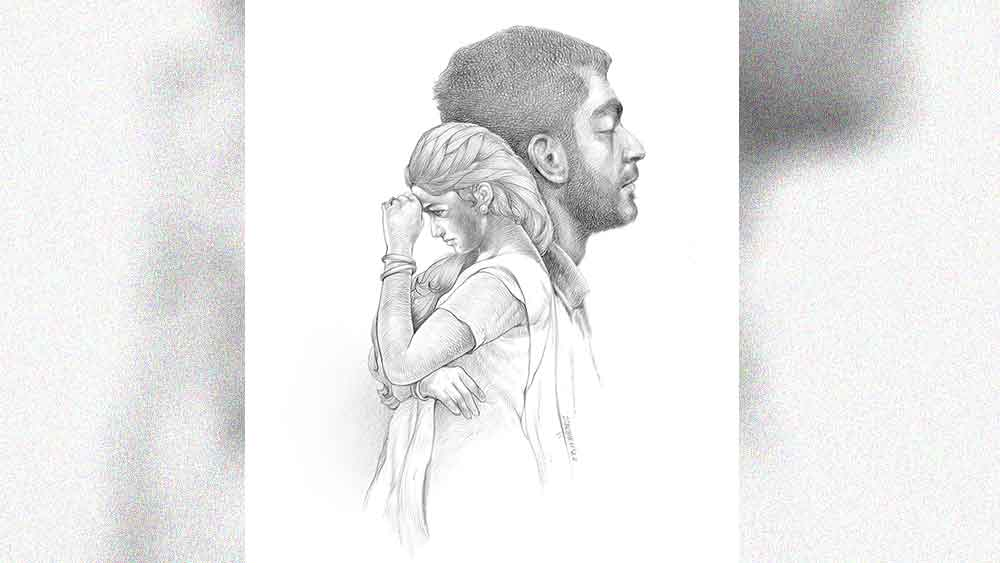

 
 <h1 align=center>পরানসখী</h1>
<h2 align=center>সঞ্জীব গোস্বামী</h2> সকাল থেকেই শরীরটা খারাপ, তাও সৌভিককে দুটো বড় মিটিং অ্যাটেন্ড করতে হল, কর্পোরেট লাইফ বলে কথা। তা ছাড়া সকালেই ওর প্রোমোশনের ফাইলটায় বস রাহুল আগরওয়াল সই করেছে, সেটাও ফোনে খবর এল। বেশ খুশির মধ্যেই ঘাড়ে মাথায় যন্ত্রণা, কেমন বমি বমি ভাব।

এর মধ্যে ডিপার্টমেন্টেই লাঞ্চের একটা ছোট্ট আয়োজন ছিল। নেহাত অনিচ্ছেয় সৌভিক অ্যাটেন্ড করল, একটা স্যান্ডুইচ আর কফি ছাড়া কিছু খায়নি। বস রাহুল অবশ্য নিজে এসে কনগ্র্যাটস জানিয়ে গেলেন।

লাঞ্চের পর দুটো নাগাদ ঘরে এসে সৌভিক এলিয়ে পড়ল, আর যেন বসে থাকা যাচ্ছে না। পেট গুলোনোর সঙ্গে বুকের বাঁ-দিকে ব্যথাটা বাড়ছে। একটা সরবিট্রেট সবে মুখে দিয়েছে, ফোনে রিং... মৌপিয়া।

সৌভিক মুখটা একটু বিকৃত করল, “হ্যালো...”

মৌপিয়ার হিসহিসে স্বর ভেসে এল, “কী ব্যাপার সৌভিক? আজকে আমাদের হেলথ ইনসিওরেন্সের লাস্ট ডেট, ভুলে গেছ?”

সৌভিক নিঃস্পৃহ, “নাঃ মনে ছিল।”

“হোয়াট ডু ইউ মিন?”

“হেল্প ইয়োরসেল্ফ মৌ। আমাদের ডিভোর্সের আর কয়েক মাস, আর আমি তোমার ইনসিওরেন্স পে করব না।”

“সৌভিক, আমি কিন্তু উকিলের চিঠি পাঠাব... তোমার আরও তিন মাস আমার আর রোহণের ইনসিওরেন্স দেওয়ার কথা। লাস্ট মিটিং-এ সেটাই ঠিক হয়েছিল।”

“আমি কনটেস্ট করব কোর্টে। আমাদের ডিভোর্স ফাইনালাইজ়ড, সেই সঙ্গে ফাইনান্সিয়াল লায়াবিলিটিজ়। তুমি ওয়ার্কিং লেডি, কাজেই রোহণের লেখাপড়ার কিছুটা পে করা ছাড়া আমার আর কোনও দায়িত্ব নেই।”

“ফাইন। রোহণের সাঁতার শেখার কী হবে? আমার নতুন চাকরি, ছ’মাস ট্রেনি পিরিয়ড। তোমায় কিছুটা শেয়ার করতে হবে সৌভিক।”

“তুমি ছেলেকে একটু রিয়ালিস্টিক ভাবে মানুষ করো, মৌ। বাঙ্গালোরে সব কিছুই কস্টলি, এত বাড়তি খরচ দেওয়া যায় না। শিগগিরি আমার আবার খরচ বাড়বে, তুমি জানো। কলকাতায় মা, বাবাকেও কিছু পাঠাতে হয়।”

“তোমার সব দায়িত্ব অন্যের প্রতি, এটাই সমস্যা।”

“যত দিন আমার সঙ্গে ছিলে, চেষ্টা করেছি। নাউ ইউ হ্যাভ চোজ়ন ইয়োর পাথ, ডোন্ট ব্লেম মি।”

“পুরো দোষ আমাকে দিয়ো না, আয়নার সামনে দাঁড়িয়ে নিজেকে একটু যাচাই করো।”

“ওকে, ওকে, এখন অফিস টাইম, আর কিছু না বলার থাকলে আমি রাখছি।”

“আরে এখনও শেষ হয়নি। আমার ব্যাঙ্ক স্টেটমেন্ট দেখছিলাম, গত মাসে আমার অ্যাকাউন্টে মাত্র কুড়ি হাজার জমা পড়ল কেন?”

“তোমাকে মাসে কত অ্যামাউন্ট পে করব, কিছুই ফিক্সড হয়নি। গত মাসে আমার ইনকাম ট্যাক্স কেটেছে। তা ছাড়া তোমার নতুন চাকরি পাওয়ার পর আমার আর টাকা দেওয়ার কথা নয়।”

“সৌভিক, টাকাটা আমি আমার ফুর্তির জন্য চাইছি না। রোহণের লেখাপড়ার জন্যই চাওয়া...”

“রোহণের যা বয়স, তাতে ওর স্কুলের মাইনে দেড়-দু’হাজারের বেশি হওয়া উচিত নয়। আর এই ছ’-সাত বছরে কে আর বাইরের টিউশন নেয়। মাসে হাজার ছয়েক ওর এডুকেশনের জন্য যথেষ্ট। আর এই খরচের ফিফটি পারসেন্ট তো তোমারও দেওয়ার কথা।”

“তুমি কী নিষ্ঠুর সৌভিক! শুধু লেখাপড়া? ওর ক্যারাটে ক্লাব, ক্রিকেট কোচিং, প্রতি মাসে স্কুলের টিচার্স-ফ্যামিলি গেট টুগেদার... এই খরচগুলো? তুমি নিজের সুখটা বেশ ভাল বোঝো।”

“আই রিমাইন্ড ইউ যে, তোমার সঙ্গে আমার ডিভোর্স কিন্তু ফাইনাল। কাজেই নিজের ভবিষ্যৎ বুঝে নেওয়ার অধিকার আমার আছে মৌ। তাও আমি রোহণকে নিয়ে ভাবি।”

“গুড, সেটা অন্তত ভেবো, কারণ রোহণের মধ্যে তোমার জিনও কিছুটা আছে, এখন রাখছি। বাই দি ওয়ে, আজ আমার জিম আছে। যদি সন্ধেবেলা রোহণকে দেখতে চাও, তা হলে এক ঘণ্টার জন্য তোমার অ্যাপার্টমেন্টে ওকে রেখে যেতে পারি।”

“অ্যাজ় ইউ উইশ, আমি পৌনে সাতটা থেকে বাড়িতেই থাকব।”

“ওকে, বাই।”

মোবাইলটা রেখে সৌভিক ঘাড়টা একটু হাত দিয়ে ঘষে নিল, কী দপদপই না করছে, এর মধ্যে আবার সাংসারিক কাজিয়া। আজই সব!

আজ আর পারা যাচ্ছে না। বিকেল পাঁচটা নাগাদ সৌভিক উঠে পড়ল।

*****

সন্ধেটা রোহণের সঙ্গে ভালই কাটল। রোহণ এখনও খুব ছোট, ওর যত আকর্ষণ মনস্টার, ম্যানড্রেক আর স্পাইডারম্যান। সাতটা চল্লিশ নাগাদ মৌপিয়া প্রায় ঈগলের মতো রোহণকে ছিনিয়ে নিয়ে চলে গেল, আবার সৌভিক ফাঁকা। টিভির সামনে বসে ভাবছিল রাতে সামান্য পাস্তা আর চিজ় খেয়ে একটা গল্পের বই নিয়ে বিছানায় যাবে। এ রকম সময় পাশের ফ্ল্যাট থেকে মিস্টার পারেখের ফোন এলো, একটা ছোট্ট আড্ডা দেওয়া যায় কিনা, ঘরে নাকি সামান্য লেফটওভার হুইস্কি রয়ে গেছে। নির্দ্বিধায় সম্মতি জানিয়ে সুব্রত ফ্ল্যাটের দরজার লকটা খুলে রেখে রান্নাঘরে পাস্তা বসাতে যাবে, এই সময় ড্যাশিং এগজ়িকিউটিভ ববিতা কুলকার্নির ফোন। ববিতার সঙ্গে ওর প্রেম বেশ কয়েক মাস হতে চলল, মৌপিয়ার সঙ্গে ডিভোর্স প্রসিডিয়োর শুরু হওয়ার পর থেকেই ওদের ঘনিষ্ঠতা।

ফোনটা তুলে সৌভিক রান্না ঘরে ঢুকল, “হাই ববি, কেমন চলছে?”

“ভাল। তোমার প্রোমোশনের খবরটা শুনলাম, কনগ্র্যাটস।”

“আরে নাথিং স্পেশ্যাল, অনেক দিন ডিউ ছিল।”

“একটা ব্যাপারে আমি কিন্তু মারাত্মক রেগে আছি। আজ মৌ-এর সঙ্গে অনেক কথা হয়েছে শুনলাম। প্রোমোশন পেতেই প্যাচআপ-এর চেষ্টা শুরু করে দিল নাকি?”

সৌভিক একটু থমকাল, এই খবরটাও ফ্ল্যাশ হয়ে গেছে! কিন্তু গলার স্বর না পাল্টে বলল, “ফিলিং জেলাস, ডার্লিং?”

ববিতা একটু রুক্ষ গলায় বলল, “হোয়াট ডু ইউ মিন বাই জেলাস? তুমি দু’দিকেই খেলছ কি না, সেটাই জানতে চাইছি।”

“তুমি কি আমাকে সেই রকম মনে করো?”

“দেখো, আমার টাইমের দাম আছে আর মানুষ হাজার বছর বাঁচে না। আমি জীবনের কিছুটা তোমার পিছনে ইনভেস্ট করেছি। আমার প্রশ্ন, তুমি কী চাও?”

“ববি, বিলিভ মি... মৌ এখনও আমার প্রোমোশনের কথা জানেই না। আর আজ আমাদের মধ্যে শুধু ঝগড়াই হয়েছে।”

“আই ডোন্ট বিলিভ দ্যাট ও কিছু জানে না। আমার কাছে খবর আছে, মৌপিয়া ওর ল-ইয়ারের কাছে প্যাচআপের ব্যাপারে কথা বলেছে।”

“তুমি কী করে জানলে?”

“লইয়ার সার্কেলে আমার কিছু চেনা আছে।”

“আমি ব্যাপারটা জানি না, কাজেই নো কমেন্টস।”

“প্লিজ় ডোন্ট অ্যাক্ট নেভ, সৌভিক। তোমার স্যালারি বাড়লে মৌপিয়ার প্রবলেম সলভ্ড, তাই না? ওই টাকা নিয়েই তো ঝগড়া।”

“ববিতা, ডিভোর্স ইজ় নট আ সুদিং ইস্যু। কান্ট উই টক সামথিং এলস?”

টেলিফোনে ববিতার চিৎকার ভেসে এল, “নো সৌভিক, উই মাস্ট টক নাউ। আমাদের রিলেশনের এখন কী হবে? আমাদের অফিসে অনেকে জানে, আমি পেরেন্টসদের জানিয়েছি। আর ইউ প্লেয়িং উইথ মি?”

সুব্রতর বুকের বাঁ দিকটা আবার একটা চিড়িক দিয়ে গেল, ও একটা চেয়ারে বসে বলল, “ববিতা, আই থিঙ্ক ইউ হ্যাভ মিসটেকেন। কাল এক বার আমার ফ্ল্যাটে এসো। আমরা খেতে খেতে কথা বলব। ইটস অল রং ডার্লিং।”

“বেটার বি রং সৌভিক। আমি কিন্তু এখানকারই মেয়ে, আমায় যদি ঘা দাও তা হলে আমি তোমাদের জীবন হেল করে দেব, মাইন্ড দ্যাট। কাল তা হলে কখন?”

“এই ধরো সন্ধে সাড়ে সাতটা, চলবে?”

“ওকে ডান, গুড নাইট।” ফোন কেটে গেল। 

সৌভিক ফোনটা পাশে রাখল, মাথাটা কেমন ঝিমঝিম করছে। ও চেষ্টা করেও নিজেকে চেয়ার থেকে তুলতে পারল না। হাত পায়ের যেন কোনও সাড় নেই, পায়ের পাতাটা কেমন ঠান্ডা হয়ে আসছে। পেটের ভেতরটা গুলিয়ে উঠল, সুব্রত চেয়ারে বসেই দু’বার ওয়াক তুলল।

*****

সকাল সাড়ে সাতটার সময়ে মৌপিয়ার ট্যাক্সি আর ববিতার সেডান প্রায় একই সঙ্গে নার্সিংহোমের পার্কিং লটে এসে দাঁড়াল। দু’জনে দু’জনকে অগ্রাহ্য করলেও প্রায় একই সঙ্গে মেন এন্ট্রান্সে পৌঁছল। সিকিওরিটি আটকাল, “আভি অন্দর জানেকা হুকুম নেহি হ্যায় ম্যাডাম। ভিজ়িটর্স টাইম সুবে নও বাজে।”

ববিতা চিৎকার করে উঠল, “আরে ছোড়ো, মাই ফিয়াঁসে ইজ় ইন সিরিয়াস কন্ডিশন, হার্ট অ্যাটাক। ইধারসেই ফোন কিয়া। মুঝে জানে দো।”

মৌপিয়া ফোঁস করে উঠল, “ফিয়াঁসে না হাতি! আমাদের অফিশিয়াল ডিভোর্স এখনও হয়নি, পেপারে সই বাকি আছে... আমি আগে যাব।”

ববিতা ঝাঁঝিয়ে উঠল, “শাট আপ মৌপিয়া। নিজেকে আর স্ত্রী বোলো না... টাকার জন্য চাপ দিতে দিতে ওর হার্টের বারোটা তুমিই বাজিয়েছ।”

“চমৎকার! আর ওর প্রোমোশন হয়েছে শুনেই তুমি কাল বিয়ের প্রেশার দিলে। রাতে ফোনে তোমার থ্রেট শুনেই তো...”

“নাইস স্পাইং! তুমিও সখী বেহুলা নও। খবরটা পেতেই অ্যাডভোকেটকে ফোন করেছিলে, যাতে ডিভোর্স হিয়ারিং পিছিয়ে যায়, মানে রিকনসিলিয়েশান। হাড়বজ্জাত!”

“ফাইন, আমি হাড়বজ্জাত হলে তুমি কি? ম্যানেজারের সঙ্গে রগরগে প্রেম, গোয়া ট্রিপ, সব ভুলে গেলে? যেই ল্যাং খেলে অমনি ইয়ার্লি বল ডান্সে সৌভিককে পার্টনার করলে, তাও গায়ে-গা ঘষে... মাথা তো ঘুরবেই!”

“বাঙ্গালিগুলো সব এই রকমই, সব অন্যের দোষ। সৌভিক কচি বাচ্চা, ন্যাকা খোকা নাকি? আর তোমার প্রেমিক প্রসেনজিৎ, সে দিন দেখলাম মিষ্টি করে গাল টিপে দিচ্ছে, না? বয়সেও তো তোমার থেকে দু’বছরের ছোট, মানে জমে ক্ষীর!”

“শাটআপ ববিতা, ওটা আমার পার্সোনাল ম্যাটার। তুমি স্পাইং করছ, আমার পিছনে লোক লাগিয়েছ।”

“সে তো আমিও বলতে পারি... কাল যে আমি ফোন করেছিলাম, তুমি জানলে কী করে?”

সিকিওরিটি ওদের সামনে হাঁ করে দাঁড়িয়ে... ওরা আরও কিছু ক্ষণ কথার টি-টোয়েন্টি চালাত, এক জন সিস্টার বেরিয়ে এল, “সৌভিক মুখার্জির বাড়ি থেকে কেউ এসেছেন?”

ববিতা আর মৌপিয়া দু’জনেই এগিয়ে এল, “কেন কী ব্যাপার? আমি ওঁর বাড়ি থেকে এসেছি।”

নার্স উৎকণ্ঠিত ভাবে বলল, “ওঁর পাল্‌স ফল করছে, বডিতে অক্সিজেন কাউন্ট খুব কম। ওঁকে এখনই ওটিতে নিয়ে যেতে হবে, বাইপাস সার্জারি করে ভাল্বে স্টেন্ট বসাতে হবে। একটা বন্ডে সই করতে হবে, কে করবেন?”

মুহূর্তে সেখানে নেমে এল অখণ্ড নীরবতা। ববিতা আর মৌপিয়া দু’জনেই চুপ। তার পর ববিতা হঠাৎ বলে উঠল, “আচ্ছা মৌ, তোমাদের তো ফাইনাল সেপারেশন এখনও হয়নি, তাই না? কাজেই সইটা বোধহয় তোমারই করা উচিত, রাইট?”

মৌপিয়া একটু থতমত খেয়ে গেল, “আর ইউ জোকিং? আমরা ডিভোর্সের ফাইনাল স্টেজে, জাস্ট কিছু ফাইনার পয়েন্টেস এর জন্য সই-টা হয়নি। বন্ডে আমি কেন সই করব? তোমার তো এনটায়ার ফিউচার শৌভিকের সঙ্গে, এইটুকু দায়িত্ব নিতে পারছ না?”

“কাম অন, আমি কি ব্লাড রিলেটিভ? ওর ফ্যামিলির আর কেউ নেই? আই মিন তুমি ছাড়া? তুমি অবশ্য এখনও লিগ্যাল ওয়াইফ।”

মৌপিয়া কথাটা গায়ে মাখল না, “ওর এক কাজ়িন কাছেই থাকে। লেটস কল হিম।”

ববিতা ঘড়ি দেখল, “ডু ইট কুইকলি মৌ, সাড়ে দশটায় আমার আর্জেন্ট একটা মিটিং আছে অফিসে।”

মৌপিয়া ফোনে সংক্ষেপে কথা সেরে বলল, “দেখো মেলা কাজ দেখিয়ো না, আমার নতুন চাকরি, আজ একটা সেমিনার অরগানাইজ় করার কথা।”

ওদের কথা হয়তো আরও চলত, এই সময় সৌভিকের কোম্পানির একটা বড় গাড়ি এসে থামল, ওর পুরো ওয়ার্কিং টিম নেমে এল।

ববিতা নিজের গাড়ির দিকে যেতে যেতে ভাবল, “যাক বাবা, টাকাপয়সার ব্যাপারটা ওদের কোম্পানিই সামলে নেবে।”

মৌপিয়া সৌভিকের কোলিগদের সঙ্গে কথা বলে ব্যাপারটা বুঝিয়ে দিল, ওর মাথায় একটা স্পার্ক বার বার খেলে যাচ্ছিল—‘নতুন প্রোমোশন হয়েছে, এক লাফে মাইনে নিশ্চয়ই ষাট কি সত্তর হাজার বেড়ে যাবে, নিশ্চয়ই নতুন আরও বড় একটা অ্যাপার্টমেন্ট পাবে, বছরে এক বার পেড হলিডে... পসিবিলিটি অব আ নাইস সেকেন্ড ইনিংস? আর উপরি হিসেবে প্রসেনজিৎ তো রইলই...’

ভিতরে তিন নম্বর আইসিইউ-তে অচেতন সৌভিক শুয়ে, মুখে অক্সিজেনের নল, হাতে স্যালাইনের সুচ। তার পা‌ল্‌স আরও নামছে, অক্সিজেন কাউন্ট আরও কমছে...