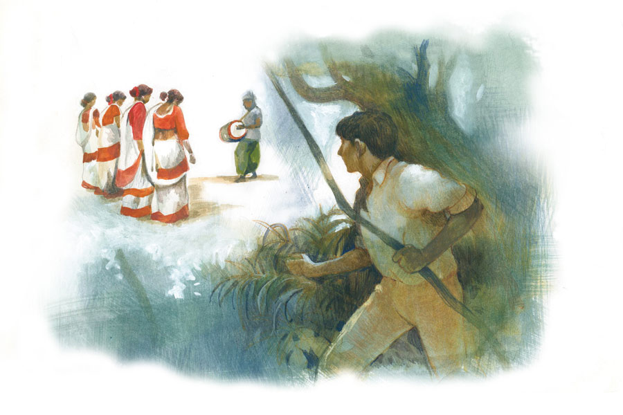

 
 <h1 align=center>পরাশর ও সত্যবতী</h1>
<h2 align=center>শান্তনু দে</h2> আঠাশ বছরের পরাশর রুক্ষ। সুপুরুষ নয়। তবে চেহারায়, চোখেমুখে সারল্য আছে। বনের হরিণের মতো বা নির্লোভ কোনও ঋষির মতো। মেয়েদের আকর্ষণ করে।

মেয়েদের পাত্তা দেয় না পরাশর। তাকে মুডি বলে কেউ। কেউ বলে, “মুডি না ছাই, পাগলা। নইলে অমন মেয়ে যার জন্য মরে সে কি না...”

কেউ বলে, “বড্ড সেকেলে। যেমন নাম। আর নাম ছিল না! কেমন যেন দাদু-দাদু...”

পরাশর কারও কথায় কান দেওয়ার ছেলে নয়। পরাশরের কোলিগ নীরা এক দিন মরিয়া হয়ে বলল,“কেন এড়িয়ে যাচ্ছিস পরা। তুই জানিস আমার পিছনে কত ছেলে ঘোরে! তুই এক বার হ্যাঁ বল। আমি কারও দিকে ফিরেও তাকাব না।”

পরাশর বলল, “অন্ধ হয়ে থাকবি? আমার জন্য? এত জঙ্গল, এত শিকার। তাদের ধরবি না?”

“সবাই তোর মতো? নিজে তো বনজঙ্গলে ঘুরে বেড়াস জন্তু-জানোয়ারের সঙ্গে। মানুষের সমাজে অচল তুই। আমার মাঝে মাঝে মনে হয়— তুই শালা অক্ষম। ধ্বজ...”

পরাশর হাসল। উত্তর দিল না। এ কথার উত্তর হয় না। রাগ আর হতাশা থেকে বলা। অনেক দিন আগে কলেজের টুরে গিয়ে পারমিতা একই রকম ভাবে বলেছিল— “তোকে এত সুযোগ দিলাম... তুই পারিস আদৌ?”

নীরা ঠিকই বলেছে, মেয়েদের হয়তো বুঝতে পারে না পরাশর। যেমন বোঝে জঙ্গলকে। জঙ্গল তার দ্বিতীয় ঘর। উত্তরবঙ্গের ডুয়ার্সের জঙ্গল হোক বা লাল মাটির শাল-মহুয়ার জঙ্গল— অফিস ছুটি পেলেই চলে যায় পরাশর। না পেলেও ছুটি নিয়ে যায়। সবুজ গাছ পাতা নদীর পাশে শান্ত হয়ে বসে।

পরাশর কবিতা লেখে। মফস্সল শহরে কয়েক জন বন্ধু মিলে পত্রিকা চালায়। আর জঙ্গলের টানে বেরিয়ে পড়ে। জঙ্গলের মধ্যে ছোট গেস্ট হাউস বা হোটেলে থেকে যায়। শহুরে কৃত্রিম পৃথিবীর সঙ্গে তখন তার কোনও সম্পর্ক নেই। ফোনটাও বন্ধ করে রাখে। শীতের বনে পাতা ঝরার শব্দ হয়। কান পাতলে ঝরনার শব্দ, বন্য প্রাণীর দৌড়ের শব্দ আসে। বিকেলে মাদলের তালে সাঁওতাল মেয়ের নাচ দেখে মহুয়া খেয়ে বেহুঁশ হয়।

সে বার একটা মেয়ে তার কাছে এসে বসল নাচ শেষে। সাঁওতাল মেয়ে বাইজু। তাকে হেসে হেসে বলল, “তুই তো সারা বৎসর এখানেই থাকিস, শহরের লোকগুলান তোকে ঘরে নেয়?”

পরাশর বলল, “আমি উহাদের লোক নই। আমি তোদেরই ঘরের লোক। আর ইখানেই থাকব।”

বাইজু হেসে বলল, “তুই জোয়ান মরদ আছিস, ইখানেই কাজকর্ম কর— মাটি কাটা, জঙ্গলের কাজ। কাম নাই তোর ফিরা। তার পর ইখানে কুনো মেয়েকে বিয়া করি নিবি?”

“বিয়া মোর দ্বারা হইবেক নাই রে। মোরে লয়ে কেউ ঘর বসাতি পারবেক না।”

বাইজু বোঝায়, “বিয়া না করিস সঙ্গ তো করতেই হবে— না হইলে শরীর শুনবেক না কি?”

এই অরণ্যে, আদিম পৃথিবীতে পরাশরের উত্তেজনা আসে। পৌরুষ দৃঢ়োত্থিত হয়। তখন মনে হয় কাউকে চাই। যার চুলে নিমফুলের গন্ধ। শরীরে মাটি লেগে আছে।

“কে করবে আমার সঙ্গ? এই জঙ্গলে? সবারই তো মরদ আছে। সঙ্গী আছে...” খুব নিচু স্বরে যেন নিজেকেই কথাগুলো বলল পরাশর।

বাইজু বলল, “মুই করতে পারি, যদি তুই চাস... আর অন্য কাউকে চাইলেও আমি আনি দিতে পারি তোর জন্য।”

উত্তেজিত পরাশর বলল, “তুই করবি? তোর তো মরদ আছে। উহার সঙ্গে নাচ করলি?”

বাইজু হাসল, “তাতে কী হইছে। উ আমার মরদ আছে বলে আমার তোকে ভাল লাগতে পারবেক নাই? মোর যাকে ভাল লাগবে তার সঙ্গেই সঙ্গ করতে পারি। ইখানে কারও বলার কিছু নাই। মোরা মরদের কিনা বাঁদি নই।”

বাইজু চুমু খেল পরাশরকে। শহুরে মেয়েদের মতো শব্দসর্বস্ব লিপস্টিক-বাঁচানো চুমু নয়। গভীর চুম্বন। শুকনো শালপাতা বিছানো গালিচায় শুয়ে পড়ল দু’জনে। জঙ্গলে। বুক-পিঠ দিয়ে জঙ্গলের শুকনো পাতা গুঁড়িয়ে দিল। সঙ্গ করে তৃপ্তি পেল দু’জনেই।

কে বলে পরাশর পারে না! কে বলে পরাশর ধ্বজভঙ্গ! শহুরে মেয়েদের গায়ের গন্ধে ওর গা গুলোয়। জঙ্গলের মেয়েরা শহুরে মেয়েদের মতো নয়। ভড়ং নেই।

পরাশর বাইজুকে বলল, “তোকে আমি একঠো নাম দিব— সত্যবতী।”

বাইজু ঘাড় নেড়ে বলল, “ওই শহুরে নামে মোর কাম নাই। মোর যা আছে তাই ভাল।”

“শহুরে নাম নয় রে। এ মহাভারতের নাম বটে। সত্যবতী বনকন্যা। তার একঠো বন্য নামও ছিল— গন্ধকালি। লোকে ওই নামেই ডাকত। তার গা থেকে মাছের বাস উঠত। সে ছিল এক ধীবরের কন্যা। তাহার রূপে সকলেই পাগল। হস্তিনাপুরের মহারাজা শান্তনু তাহাকে বিয়া করে। তার আগে তার সহিত ঋষি পরাশরের সঙ্গ হয়। ঋষি পরাশর তাকে নৌকা বাইতে দেখে মোহিত হয়। দু’জনে সঙ্গ করে। তাদের ছেলে মহাঋষি ব্যাস। তিনি মহাভারত লিখেন। সেইটা বড় কথা নয়। বড় কথা হইল— সত্যবতী আসলে অনার্য নারী। বনকন্যা। মহাভারতকার সেই আভাস দিয়াছিলেন। পরে হয়তো তিনি অনার্য না লিখে তাহাকে অনার্য দাসরাজার পালিতা কন্যা লিখে যান। মহাভারতে সেই থেকে শুরু হয় আর্য-অনার্য মিলন।”

সারা দিন এক সঙ্গে কাটিয়ে বাইজু ফিরে গেল তার মরদের কাছে। পরাশর আটকাল না তাকে। এখানে কেউ কাউকে আটকায় না। জোর করে ধরে রাখে না।

অরণ্যে আগুন জ্বলে। মুরগি রান্না করে হোটেলের ছেলেটি। মহুয়ার গন্ধে ভারী বাতাস। কবিতার খাতা হাতে নেয় পরাশর। আকাশে মোরগের ঝুঁটির মতো গাঢ় রং। বাতাস নদী জঙ্গল ছুঁয়ে বর্শার মতো ছুটে আসছে। লড়াই লেগেছে কোথাও। অরণ্যের অধিকারের জন্য লড়াই। মাদল বাজছে একটানা। এখানেই আর্য-অনার্য লড়াই লেগেছিল এক দিন। ইংরেজদের রক্তচক্ষুকে তোয়াক্কা করেনি জঙ্গলবাসী মানুষ। দিকুরা লড়েছিল। হুল। সেই গান গায় জঙ্গলের মানুষ।

তার পর এক দিন জঙ্গল ছেড়ে শহরে আসতেই হয়। চাকরি আছে। বাড়ি আছে। বাড়িতে মা বাবা দিদির সঙ্গে থাকে পরাশর। বাবা চাকরি থেকে অবসর নিয়েছে। দিদির বিয়ের কথা হচ্ছে। মধ্যবিত্ত বাড়িতে বড় দিদি থাকলে তার বিয়ের আগে ভাইয়ের বিয়ে নিয়ে কেউ মাথা ঘামায় না। কিন্তু পরাশরের মা চিন্তা করেন, ছেলেকে ঘরে আটকে রাখার জন্য বিয়ে দিতে হবে। জঙ্গলে থাকতে থাকতে জংলি ভূত হয়ে যাচ্ছে। এ বার জঙ্গল থেকে ফিরে আর কাজে যেতে ইচ্ছে করে না পরাশরের। বাইজুর কথা মনে পড়ে বার বার। তার সত্যবতী। তার গন্ধকালি।

অফিস বাড়ি থেকে চল্লিশ কিলোমিটার দূরে। বাসে যাতায়াতের পথটুকু পরাশরের খুব প্রিয়। দু’পাশে জঙ্গল নদী গ্রাম ধানখেত দেখতে দেখতে ঘুম আসে। ঘুমের মধ্যেও জঙ্গলের শব্দ শুনতে পায়। মাঝে মাঝে অফিস পেরিয়ে ঘুম ভাঙে। তখন তড়িঘড়ি ফিরতে হয়। কোনও কোনও দিন ফিরতে ইচ্ছে করে না। অচেনা রাস্তায় নেমে পড়ে পরাশর। সামনে ধানখেত। দূরে গ্রাম, জঙ্গলরেখা। পরাশর হাঁটা লাগায় ওই দিকে। দিন যায়।

এক দিন বাসেই তাকে দেখল পরাশর। প্রথমে চমকে উঠল দেখে। বাইজু এখানে এল কী করে? বাইজু কি? তার সত্যবতী? না ওর মতো দেখতে? বাইজু হলে তো পরাশরকে চিনতে পারত? না কি ইচ্ছে করেই চিনতে চাইছে না! মেয়েটা বাসে উঠল এমন এক জায়গা থেকে যার এক দিকে জঙ্গল, অন্য দিকে সীমান্তরক্ষীদের ঘাঁটি, সীমানগর। কোনও লোকালয় নেই। পরাশর তাকে জঙ্গলের সরু পথ বেয়ে হেঁটে যেতে দেখল। ওকে দেখেই বাইজুর কথা মনে পড়ল। জঙ্গলে ফিরতে ইচ্ছে হল। বাসে যেতে যেতে কত মানুষই তো ওঠে নামে, সে দিকে নজর পড়ে না পরাশরের। বাইরের দিকে চেয়ে থাকে সে। কিন্তু এই মেয়েটি যেন অন্য রকম। জঙ্গল থেকে উঠে আসে বাসে, আবার কিছু দূর গিয়ে লোকালয় নেই এমন ফাঁকা মাঠের ধারে বাস থামিয়ে নেমে যায়। ও বাসে উঠলে জংলি ফুলের গন্ধ পায় পরাশর।

মেয়েটিকে লক্ষ করে পরাশর, তার কোলিগরা টের পায়। পরাশরকে নিয়ে ঠাট্টা করে। নিজেদের মধ্যে বলাবলি করে ওরা, “শেষ পর্যন্ত একটা জংলি মেয়েকে পছন্দ হল!”

“ঠিক মেয়েকে বেছেছে, জংলি না হলে তো পরার সঙ্গে মিলবেও না।”

“জংলি হলে কী হবে, মেয়েটার ফিগার দারুণ। শুধু গায়ে একটা বোঁটকা গন্ধ এই যা। পরাকে বলতে হবে, মনে করে একটা দামি পারফিউম ওকে যেন গিফ্ট করে।”

এ সব কথা বলাবলি করে পরাশরকে শুনিয়ে শুনিয়ে। মেয়েটাও শোনে। পরাশর রাগ করুক, ফেটে পড়ুক রাগে— ওদের মজা বাড়বে। ওরা তাই চায়।

রাগ হলেও পরাশর নিজেকে সংযত রাখে। এই সব শহুরে অসভ্য, যাদের সামান্য সহবতও নেই, তাদের কিছু বলার নেই।

এক দিন মাত্রা ছাড়িয়ে যায়। অফিস সে দিন আগে আগে ছুটি হয়েছে। হাফ ডে। সবাই এক সঙ্গে ফিরছে। চৈত্র মাসের দুপুর। গনগনে সূর্য। বাসের এক পাশে ছায়া। এক পাশে রোদ। রোদের দিকে বসতে চায় না কেউ। ছায়ার দিকে সিট পাওয়ার জন্য চলে প্রাণান্ত লড়াই। পরাশর সেই লড়াইতে নেই। তার একটা সিট হলেই হল। না হলে দাঁড়িয়ে যাবে। বাসে উঠে রোদের দিকে বসেছে সে।

মেয়েটি উঠল তার নির্দিষ্ট জায়গা থেকে। উঠতেই সবার মধ্যে শোরগোল, “পরা, উঠেছে রে—কী হল, ওকে জায়গা দে, বসতে দে— ম্যানার্স ম্যানার্স...”

“রোদের দিকে দিবি? গায়ের রং তো কালো হয়ে যাবে। অবশ্য রংটা একটু মাজা তো, রোদ পড়লে চিকচিকে হবে। প্রতিমার গায়ে ঘামতেল মাখায় দেখিস না?”

প্রতিবাদ করল পরাশর। কারও গায়ের রং নিয়ে ঠাট্টা করার মতো অসভ্যতা আর কী হতে পারে! “ছি! তোমরা কি মানসিক ভারসাম্য হারিয়েছ? এত পতন?”

“খুব যে বড় বড় কথা বলছিস! ও কে তোর?” বলল কুশল, পরাশরের সিনিয়র কোলিগ।

পরাশর বলল, “যে-ই হোক, এক জন মানুষকে নিয়ে এত খারাপ কথা বলো কী করে?”

সুদীপ্ত বলল, “জ্বলছে জ্বলছে, জ্বলন হচ্ছে! তার মানে ডাল মে কুছ কালা হ্যায়।”

স্বপ্না বলল, “অতই যখন ইয়ে, তা ওর জন্য কিছু করলেই পারে, ম্যাজিক করে রোদের তেজ কমিয়ে দিলেই হয়।”

পরাশর মেনে নিল ওদের কথা। সে টের পাচ্ছে, তার অন্তর্গত রক্তস্রোতে ফণা তুলছে প্রাচীন ঋষির যোগশক্তি। সে ঠিক করে, ম্যাজিক করেই দেখাবে ওর ক্ষমতা। সূর্যের দিকে তাকিয়ে বিড়বিড় করে মন্ত্র আওড়াল পরাশর। সেকেন্ডের মধ্যে কালো মেঘ এসে সূর্য ঢেকে দিল। ছায়ায় ঢাকল চার দিক। ধানগাছগুলো কড়া রোদের হাত থেকে রক্ষা পেয়ে যেন বাঁচল। হাওয়ায় শরীর দুলিয়ে হেসে উঠল ধানখেত।

মেয়েটিও হাসল মনে মনে।

যারা চ্যালেঞ্জ ছুড়েছিল তারা অবাক। অত সহজে হারবে না। সুদীপ্ত ব্যঙ্গের সুরে বলল, “ঝড়ে বক মরে, ফকিরের কেরামতি বাড়ে।”

পরাশর আবার বলল, “ঝড় ওঠেনি এখনও। এই বার উঠবে। উথালপাথাল ঝড়।”

বলার সঙ্গে সঙ্গে হাওয়ার বেগ বাড়ল। গাছগুলো মাথা নাড়িয়ে দুলছে। ভেঙে পড়ার উপক্রম। যাত্রীরা সব ভয়ে চিৎকার করছে।

সুদীপ্ত উদ্বিগ্ন গলায় বলল, “কী হচ্ছে কী পরা! খেপে গেলি না কি?”

পরাশর রেগে বলল, “বাস ওল্টাবে... এই বার।”

বাস দুলে উঠল ঝড়ের হাওয়ায়। ধুলোয় ভরে উঠল চার দিক। কেউ কাউকে দেখতে পাচ্ছে না।

পরাশর মেয়েটির হাত ধরে বলল, “ডর করিস নাই, মুই চিনতে পেরেছি তোকে। তুই বাইজু। মোর সত্যবতী। ইখানে এসেছিস মোর লেগে, নয়?”

বাইজু বলল, “তোকে খুব দেখতে সাধ করছিল।”

“তবে এত দিন মোর সাথে কথা কইলি না কেন?”

“উহারা যে তোকে নিয়া ঠাট্টা করে। তাইতে...”

“উহারা ভাল লোক লয়।”

“তুই তো ভালই জাদু জানিস, সব্বাইকে ডর দিলি।”

“জাদু নয়, ইচ্ছাশক্তি। যোগবল। প্রাচীন ঋষির যেমন ছিল।”

খিলখিল করে হেসে উঠল বাইজু। শিশুর মতো। ওই ধানখেতের মতো। পরাশর এগিয়ে এল বাইজুর কাছে।

“উহারা সব আছে যে কাছে?” বাইজু বলল।

পরাশর বাইজুকে চুমু খেয়ে বলল, “এই ধুলোঝড়ে উহারা কিছু দেখিতে পাবে না। উহারা এখন আপনাকে বাঁচাতেই ব্যস্ত।... তুই কেনে এলি বল তো গন্ধকালি?”

“মোর একটা খোকা চাই। তোর থেকে। তুই সেই গন্ধকালির গল্প বলেছিলি— তার একটা ছেলে পুঁথি লিখাছিল। সে তোর মতন হবেক।”