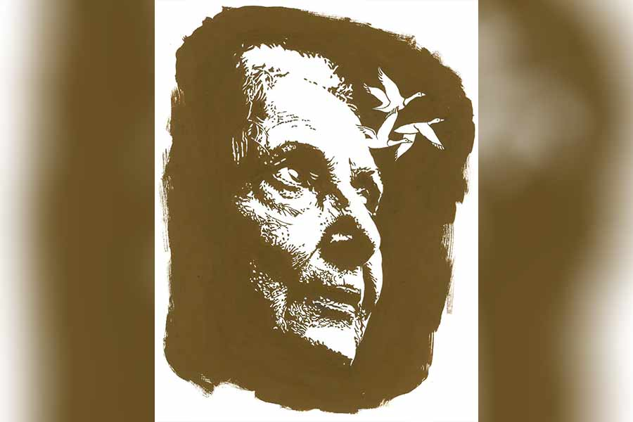

 
 <h1 align=center>পরিযায়ী</h1>
<h2 align=center>সীমা জানা</h2> 

চোখ খুলে জানালার দিকে তাকালেন সুরঙ্গমা। পর্দার ও পারটা দেখার জন্য মনটা বড় ছটফট করছে। দু’-এক বার জোর করে ওঠার চেষ্টা করলেন। পারলেন না। ক’দিন হল ভোরের দিকে শিরাগুলোয় বড্ড টান ধরছে। রমলা ঘরে এসে মালিশ করবে, সেঁক দেবে। তার পর ধীরে ধীরে উঠে দাঁড়াতে পারবেন তিনি।

সিরিয়াল দেখে রমলা রাত করে ঘুমোয়। সাতটার আগে উঠতে পারে না। সুরঙ্গমা ডাকলে বিরক্ত হয়। ও যখন এ ঘরে আসবে তত ক্ষণে কুয়াশা সরে রোদ পড়ে যাবে জানালায়। ওরা চলে যাবে। সারাটা দিন আর কিচ্ছু ভাল লাগবে না। ওদের জন্য মন কেমন করবে। লাঠিটা নিয়ে সুরঙ্গমা আবার উঠে দাঁড়ানোর চেষ্টা করলেন। ব্যর্থ হলেন। গোড়ালি দুটো যেন মাটি ছুঁতে চাইছে না। তাঁর ভার বইতেও তারা নারাজ। যেন এই পৃথিবীর প্রতি তাদের আর কোনও টান নেই।

শরীর জুড়ে একটা মোচড়ানো ব্যথা অনুভব করলেন। ব্যথা যেন পা বেয়ে উপরে ওঠে ক্রমশ। কোমর পেরিয়ে পিঠে ছড়িয়ে পড়তে চায়। শীতকালের বিপদ আরও বেশি। শৈত্যের অবাধ প্রশ্রয়ে ব্যথা রীতিমতো দৌরাত্ম্য শুরু করে। রমলা বলে, “বয়সকালে ও সব হয়। আমি সারা দিন হাত-পা চালাই, তাও আমার কত ব্যথা-বেদনা হয়। কষ্টে এক-এক দিন মরে যেতে ইচ্ছে করে। তুমি তো তার উপর নড়াচড়াও বন্ধ
করে দিয়েছ।”

সুরঙ্গমার আজকাল নড়াচড়া কিংবা অতিরিক্ত হাঁটাচলা করার ইচ্ছেই করে না। স্থবিরতাকেই আঁকড়ে ধরে থাকতে মন চায়। এখন
যেমন, ধপ করে বিছানায় বসে পড়লেন তিনি।

মিনিট কয়েক হবে। শূন্যতা ভেঙে শব্দটা ভেসে এল। কান পেতে আছেন সুরঙ্গমা। কাঠঠোকরা যে ভাবে গাছের গুঁড়ি ঠোকরায়, ওদের ঠোঁটে সেই সুর। কিন্তু জানালার কাচে কী পাবে ওরা! খুব দেখতে ইচ্ছে করছিল ওদের। কিন্তু শারীরিক অক্ষমতায় তিনি তৃষ্ণার্ত ও অসহায়। দুম করে মাথায় বুদ্ধি খেলে গেল একটা। লাঠি উঁচিয়ে জানালার পর্দাটা সরিয়ে অল্প ফাঁক করলেন তিনি। সঙ্গে সঙ্গে সেই অলৌকিক দৃশ্যটা দেখলেন।

এক বার কাচে ঠুকে পাখি দুটো একে অপরের ঠোঁটে ঠোঁট ভরে দিচ্ছে। চার দিকে ঘন কুয়াশার ভিতর যেন একটিমাত্র দৃশ্য বেঁচে আছে প্রকৃতির বুকে। চোখ জুড়িয়ে গেল সুরঙ্গমার।

সাঁতরাগাছির এই ঝিলপাড়ের ফ্ল্যাটটায় প্রায় কুড়ি-একুশ বছর ধরে আছেন উনি। এই ঘর লাগোয়া বারান্দা থেকে ঝিলটা সুন্দর দেখা যায়। সময় পেলেই ব্যালকনিতে বসে বরাবর ঝিল দেখতেন সুরঙ্গমা। অক্টোবর পেরোতে না পেরোতেই পরিযায়ী পাখিদের আনাগোনা শুরু হয়ে যায় এখানে। ফেব্রুয়ারিতে কত জন ফিরে যায়। কেউ বা মার্চে। কারও কারও ফেরা হয় না। চন্দ্রনীল বলতেন, “ওদের পরিযায়ী জীবনের সমাপ্তি ঘটল।”

পরিযায়ীরা আসে শীতের টানে। শীত ওদের ভালবাসার ঋতু। এ ছোট দুটোও পরস্পরের প্রেমে পড়েছে। তবে ঘর বাঁধার ইচ্ছে নেই ওদের। যেন ঘর ছেড়ে পালিয়ে পালিয়ে ঘুরছে। সব ভোরেই সুরঙ্গমা ওদের ডানায় মিহি বরফকুচি লেগে থাকতে দেখেন। রাত শেষ হওয়ার অল্প আগেই দু’টিতে এসে বসে ওঁর জানালায়। সুরঙ্গমার মাথার কাছের জানালা খুললেই একটা ছোট্ট বারান্দা। ওখানে একটা আরামকেদারা পাতা আছে। দুপুরের দিকটায় তিনি ওখানে গিয়ে বসেন। মাঝে মাঝে পাখিগুলো ওখানেও দোল খায়।

পাখি দুটো উড়ে গেছে। রোদের একটা রেখাও গায়ে লাগতে দেয় না ওরা। যেন পাখিগুলো চায় না, ওদের পালক থেকে হিমকণাগুলো শুকিয়ে যাক। ওগুলোকে রক্ষা করার জন্যই পালিয়ে বেড়ায় ওরা। তাও সুরঙ্গমা জানালার দিকে তাকিয়ে বসে আছেন। পাখিদুটোর খুনসুটির দৃশ্য তাঁকে বড্ড দখল করে রেখেছে। মাঝে মাঝে ওরা কিচিরমিচির জুড়ে দেয়। সুরঙ্গমা হাসেন। একটু পরেই ঝগড়া থামিয়ে জিভে জিভ ঠেকিয়ে পরস্পরকে আদর করে দু’জনে। হয়তো এ ভাবে ওরা পরস্পরকে কাছে ডাকে!

আগে সুরঙ্গমারা যখন দুর্গাপুরে থাকতেন, কোয়ার্টারের পাশে একটা মাঠ ছিল। সারি সারি বেঞ্চ। দুটো অল্পবয়সি ছেলেমেয়ে রোজ এসে একটা বেঞ্চে বসত। কিন্তু বেঞ্চটা এমন ভাবে পাতা ছিল যে, ওদের পিছনটাই দেখতে পেতেন সুরঙ্গমা। পাখিদুটো যেন ওদেরই সম্মুখভাগ।

চাদর ঝাড়তে ঝাড়তে রমলা বকবক করে, “কী হল, চা যে জুড়িয়ে জল হয়ে যাচ্ছে, সে খেয়াল আছে? খাও, তার পর মালিশ করে দেব।”

“রোদ এসে গেলে আর চা খেতে ভাল লাগে না। কাল থেকে দিয়ো না।”

“অমনি রাগ হয়ে গেল তো? ঘুমোই কত রাতে জানো? ওহ! কাল রাতে তোমার ছেলে ফোন করেছিল।”

শুনে সুরঙ্গমা চুপ করে থাকেন। কোনও কথা বলেন না। কিছু ক্ষণ অপেক্ষা করে রমলা নিজেই বলে, “ভালই আছে সব। ওষুধ-টষুধ ঠিক মতো খাচ্ছ কি না জিজ্ঞেস করল। টাকা লাগলে জানাতে বলল।
লাগবে টাকা?”

“না,” দ্রুত জবাব দেন সুরঙ্গমা।

“ছেলের পরীক্ষা আছে, নইলে এ বছর শীতে আসত। জানো তো, নাতির পরের বছর কলেজ হবে! বলল তোমার সঙ্গে কথা বলবে এক দিন। অফিসে যাওয়ার পথে একটু সময় বার করে ফোন করে। এ দেশে তখন রাত। তুমি তো আবার পাড়ার মন্দিরে সন্ধের আরতি শেষ হতে না হতেই ঘুমিয়ে পড়ো।”

হাতটা ভাঁজ করে কপালের উপর রেখে শুয়ে পড়লেন সুরঙ্গমা। রমলা চেঁচায়, “ও কী! আবার শুয়ে গেলে যে? খাবে না?”

“পরে দিয়ো।”

“ওটস করে দেব? দুধ-সুজি?”

সুরঙ্গমা চুপ করে থাকেন। রমলা মালিশ দিতে দিতে বলে, “রাগ করেছ? কাল থেকে সকাল-সকাল চা দেব। কী করি বলো? শুলেও কি ছাই ঘুম আসে ভেবেছ! কত ছাইপাঁশ ভাবনা-চিন্তা। শুয়ে শুয়ে খালি এ পাশ-ও পাশ করি। তার মাঝে দু’বার বাথরুমে যেতে হয়। এ শরীরটাও যে বিশ্রাম চায় দিদি।”

সুরঙ্গমা উত্তর দেন না। খানিক ক্ষণ মালিশ করার পর রমলা বলে, “নাও, এ বার উঠে দাঁড়াও দেখি।”

সুরঙ্গমা উঠে বসেন। লাঠিতে ভর দিয়ে দাঁড়াতে পারেন। টানটা একটু কমেছে। রমলা এ দিকের দরজাটা খুলে দেয়। সুরঙ্গমা আস্তে আস্তে বারান্দায় গিয়ে দাঁড়ান।

আবাসনের গা ঘেঁষে চওড়া রাস্তা। মানুষজন যাতায়াত করছে। হাট-বাজারে ছোটা, কিংবা বাস-ট্রেন ধরার ব্যস্ততা। সুরঙ্গমা নীচে, রাস্তার দিকে তাকান। ছানি-পড়া চোখে যেন সব সময়ই পাতলা কুয়াশার চাদর। কোনও কিছুই স্পষ্ট দেখা যায় না। মনে হয় টুপি-সোয়েটার পরা কতগুলো শরীর চুনের জলের ও পারে, মৃদু অর্ধস্বচ্ছতার আস্তরণ কেটে কেটে দৃশ্য থেকে ক্রমশ অদৃশ্যের দিকে চলে যাচ্ছে।

আরামচেয়ারটায় ওঁকে বসিয়ে দেয় রমলা। বলে, “বসে থাকো একটু, আমি টিফিন নিয়ে আসছি। আজ ওষুধ খেতে দেরি হয়ে গেল কিন্তু।”

আরামকেদারায় শুয়ে আছেন সুরঙ্গমা। তাঁর পা দুটো একটা টুলে সোজা করে পেতে দিয়ে, নিজেও একটা চেয়ারে বসেছে রমলা। শীতের দুপুরে খাওয়াদাওয়ার পর রোজ এখানে এসে বসেন ওঁরা। আগে গল্প হত। মেয়েবেলার গল্প। সংসারের গল্প। দু’জনের বর চলে যাওয়ার গল্প। সোহমের ছেলেবেলার গল্প। আজকাল সুরঙ্গমা বিশেষ কথা-টথা বলেন না। নীরবে সামনের দিকে তাকিয়ে থাকেন। রমলা একাই বকবক করে।

“ওহ! একটা কথা বলতে একদম ভুলে গেছি...” ভুলে যাওয়া কথাগুলো মনে করতে করতে রমলা বলে, “তোমার বৌমা তো আর ছেলের সঙ্গে ও দেশে থাকছে না। অন্য দেশে চলে যাচ্ছে। দু’জনের আলাদা কাজ। তাই। বছরে, দু’বছরে এক বার করে দেখা করবে। নাতি কিন্তু বাবাকে ছেড়ে যাবে না। আমি তো শুনেই থ। সোহম হাসছিল, বলছিল, সংসারকে গুরুত্ব দিলে কি আর বিজ্ঞানীদের চলে! আমি মুখ্যুসুখ্যু মানুষ, ও সব কথা বুঝি না বাপু। আরও বলল, তুমি যদ্দিন আছ, এ ফ্ল্যাটও নাকি তদ্দিন। পাকাপাকি ভাবে ওরা আর এ দেশে ফিরবে না। ঈশ্বর করুন, তুমি থাকতেই যেন আমি যাই। নইলে এই বয়সে ফের একা হয়ে গেলে, কোথায় ঠিকানা খুঁজতে যাব বলো তো?” চেপে রাখা দীর্ঘশ্বাস ছাড়তে ছাড়তে কথাগুলো বলল রমলা।

বন্ধ চোখ খুলে রমলার দিকে তাকালেন সুরঙ্গমা। একটা পাখির ডানার ছায়া ওর মুখের উপর দিয়ে উড়ে গেল। কিংবা ছায়ার ভিতর দিয়ে রমলা নিজেই। এক সময় খুব আয়না দেখতেন সুরঙ্গমা। সে বাসনা মরে গেছে। আজকাল রমলার মুখে নিজেকে খুঁজে পান। কখনও কখনও তার ইচ্ছের ভিতরেও নিজেকে প্রতিফলিত হতে দেখেন তিনি।

*****

সুরঙ্গমা একদৃষ্টে তাকিয়ে থাকেন। যেন এই দৃশ্যের বাইরে তাঁর কোনও চাহিদা নেই। কোনও আকাঙ্ক্ষাও নয়। ভোর হওয়ার আগে রমলা জানালাগুলো খুলে দিয়ে যায়। গজগজ করতে করতে হাত বাড়িয়ে একটা প্লেটে কয়েকটা বিস্কুটের টুকরো আর মুঠোখানেক খই ছড়িয়ে দেয়। পাখিদুটো আসে। ঠুকরে ঠুকরে খায়। মাঝে মাঝে ওরা মুখ তুলে সুরঙ্গমাকে দেখে। তার পর একে অপরের দিকে তাকায়। দেখলে মনে হয় সুরঙ্গমা সম্পর্কে নিজেদের জ্ঞান ও মতামত বিনিময় করছে। খুঁটিয়ে খুঁটিয়ে দেখেন সুরঙ্গমা, দুটোই হুবহু এক। যেন আয়নার এ পার-ও পার। ধবধবে সাদার উপর ধূসর রঙের রেখা।

আজকাল রমলার সঙ্গে যেটুকু কথা হয়, সব ওই পাখি নিয়েই। দিন দশেক হল সুরঙ্গমার পায়ের ব্যথাটা বেড়েছে। বাথরুম আর স্নান বাদ দিলে বিছানা থেকে ওঠেন না আর। বারান্দায় বসা হয় না।

এক দিন রমলা বলে, “তোমার সাধের আরামকেদারার চেহারা দেখলে শিউরে উঠবে।”

“কেন? কী হয়েছে সেখানে?”

“হতচ্ছাড়াগুলো বাসা বেঁধেছে ওই কোণে। বারান্দা জুড়ে পায়খানা আর খাবারের কণা। আরামকেদারাটাকে তো ডাস্টবিন বানিয়ে ফেলেছে একেবারে।”

“তাড়িয়ো না যেন! মনে হয় এ বার ডিম পাড়বে।”

“শীত ফুরিয়ে গেলে?”

“যাবে না, দেখো। আর যদি যায়ও ঠিক ফিরে আসবে পুজোর পর।”

“ওই আনন্দে থেকো!”

প্রথমটা নিজের চোখকে বিশ্বাস করাতে পারছিলেন না সুরঙ্গমা। ধড়মড়িয়ে উঠে বসলেন তিনি। রমলার চিৎকার প্রমাণ করল তিনি ঠিক দেখছেন। চারটে সাদা ডানা ঘরের এ পাশ-ও পাশ করছে। তার পর একটা গিয়ে বসল ফ্যানের ব্লেডে। ওর দেখাদেখি দ্বিতীয়টাও। ব্লেডগুলো দুলে উঠল। সুরঙ্গমার হৃদয়ও। অপলক তাকিয়ে রইলেন পাখি দুটোর দিকে। মনে মনে ডাকনাম দিলেন ওদের। ডাকলেনও সেই নাম ধরে।

পাখি দুটো সুরঙ্গমাকে দেখছিল। সুরঙ্গমা হাত বাড়ালেন। ওঁর হাত ছুঁয়ে ডানা ঝাপটাতে ঝাপটাতে উড়ে চলে গেল ওরা। মুখের সামনে হাতের পাতাটা নামিয়ে আনলেন সুরঙ্গমা। অষ্টাশি বছরের ঝাপসা চোখ। তবুও স্পষ্ট দেখলেন, খুব সূক্ষ্ম একটু কুয়াশা, ফুলের রেণুর মতো রেখাগুলোর শরীরে রেখে গেছে পাখি দুটো। রমলার চোখ দুটো পাথর হয়ে গিয়েছিল। অনেক দিন পর সাহায্য ছাড়াই উঠে দাঁড়িয়েছেন সুরঙ্গমা।

“অনেক দিন তোমার সঙ্গে কথা বলা হয়নি, মা। ভাল আছ?”

“রমলা বলছিল, দুটো দেশের টাইম জ়োন আলাদা তাই... ”

“জানি আজ তোমার মন খারাপ। যাব যে, সে উপায়ও নেই। রমলাদি বলছিলেন, তোমার নাকি দুটো পোষ্য হয়েছে? ভাল। তা বলে গায়ে হাত দিতে যেয়ো না যেন। ওরা কিন্তু অনেক ভাইরাস ক্যারি করে।”

“লাঞ্চ করেছ?” কেটে কেটে কথাগুলো বললেন সুরঙ্গমা।

সোহম অভিমানী সুরে বলে, “তুমি নাতির কথা জানতে চাইলে না? বৌমার কথা?”

“রমলা বলে সব। তোমরা সবাই ভাল থেকো।”

“স্যান্ডি খুব ইন্ডিয়ায় যেতে চায় মা। স্পেশ্যালি কলকাতা। এক জন বান্ধবী হয়েছে ওর। খুব মিষ্টি মেয়ে। এ দেশেই থাকত। অন্য শহরে। ওর বাবা একটা প্রজেক্ট নিয়ে এখানে এসেছে। স্যান্ডির স্কুলেই অ্যাডমিশন নিয়েছে মেয়েটা। স্যান্ডিকে ও কলকাতায় নিয়ে যাবে বলেছে। স্যান্ডি ওকে তোমার গল্প করেছে। বলেছে, গেলে তোমার সঙ্গে দেখা করবে...”

সোহম হয়তো আর একটু কথা বলতে চেয়েছিলেন। সুরঙ্গমা রেখে দিয়েছেন। বিকেলের রোদের উপর ঝপ করে কুয়াশার পরত নেমে এল। অনেক ক্ষণ থেকে রমলা ওঁর জন্য অপেক্ষা করছে। সুরঙ্গমা গিয়ে বসলেন। চন্দ্রনীল হলুদ গোলাপ পছন্দ করতেন। খুঁজে খুঁজে রমলা অনেক হলুদ গোলাপ এনেছে। মালা গেঁথেছে, এমনি ছড়িয়েছে। চন্দ্রনীলের মুখটা ঢেকে গেছে হলুদ পাপড়িতে। আজ আটাশে ফেব্রুয়ারি। যদিও তাঁর চলে যাওয়ার দিনটা লিপ ইয়ার ছিল।

জানলার দিকে তাকিয়ে বসেছিলেন সুরঙ্গমা। রোদকে আজ যুবক সৈনিকের মতো লাগছে। সকালে এক বার ডানা ঝাপটানোর শব্দ পেয়েছেন তিনি। দেখতে পাননি। রমলা বলছিল ক’দিন ধরেই নাকি মা পাখিটা ডিমে তা দিচ্ছিল। এক মুহূর্তের জন্যও সরেনি। ছানা ফুটল কি না কে জানে! রমলাও কবে যেন পাখিগুলোকে ভালেবেসে ফেলেছে। আজকাল ওদের সব গল্পই পাখি নিয়ে। এক দিন ও বলছিল, “আসছে জন্মে আমি কাক হয়ে জন্মাব।”

একটু অবাক হয়েছিলেন সুরঙ্গমা, জানতে চেয়েছিলেন, “কেন?”

“শুনেছি কাকেদের সমাজে বরের ছেড়ে যাওয়া নেই। এক বার গ্রহণ করলে আজীবনের বন্ধন।”

ওটস দিতে এসে রমলাও অবাক, “আজ ভিতরে আসেনি হতভাগাগুলো?”

“এক বার দেখো তো গিয়ে...”

মিনিট দশেক হবে। রমলার সাড়া না পেয়ে সুরঙ্গমা ডাকলেন, “কী
হল, রমলা?”

ধীরে ধীরে ঘরে ঢুকল রমলা। বিছানায় বসে সুরঙ্গমার হাতের পাতায় হাত রেখে সান্ত্বনার
সুরে বলল, “কে আর আজীবন থাকে, বলো দিদি!”

কথাটা বুঝতে পারলেন না
রমলা, “মানে?”

“শীত ফুরিয়ে গেছে। এখানে থাকলে বাঁচত কী করে বলো?”

“চলে গেল?”

“ডিম ফুটে ছানা হয়েছিল গো। আমরা টের পাইনি। বাসা ভর্তি ডিমের খোলস। কখন যে ওড়া শেখাল! ছানাগুলোকে চোখের দেখা দেখতেও পেলাম না এক বার!” কিছু ক্ষণ থেমে চেপে রাখা শ্বাসটা
ছাড়তে ছাড়তে রমলা বলে, “উঠে বোসো। তোমাকে ওষুধ দিয়ে আমি বারান্দাটা ধোয়াব।”

সুরঙ্গমা ফ্যানের ব্লেডের দিকে তাকিয়েছিলেন। রমলা ওঁর হাতের পাতাটা টেনে মেলে দিয়ে বলে, “নাও। তোমার জন্য রেখে গেছে।”

করতলের দিকে তাকান সুরঙ্গমা। একটা ধূসর পালক। সুরঙ্গমা চোখ বোজেন। নিজেকে বোঝাতে চাইছিলেন, এই ঘর, এই বারান্দা, বিছানা... এর বাইরে কোনও পৃথিবী নেই তাঁর। কিন্তু মনটা ডানা মেলে উড়ে উড়ে চলে যাচ্ছিল দিকদিগন্ত পেরিয়ে বহু দূরে, যেখানে পরিযায়ীরা অনুকূল পরিবেশে বাসা বেঁধেছে।

