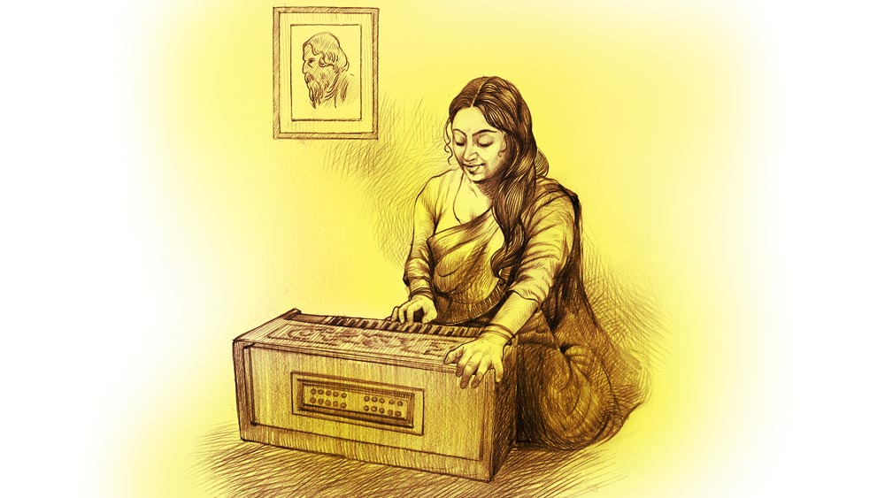

 
 <h1 align=center>পাকা দেখা</h1>
<h2 align=center>মঞ্জুশ্রী ভাদুড়ী</h2> মিত্রমশাই হয়রান হয়ে পড়েছেন এক রকম। কত মেয়েই তো দেখা হল ছেলের জন্য... একটু সেকেলে শোনাচ্ছে না কথাটা? শোনাক, কিচ্ছু  করার নেই। ছেলের পড়ার নেশা! হ্যাঁ মশাই, দিনরাত সে লেখাপড়াই করত শুধু, প্রেম করার সময় পায়নি। তার পর সে মস্ত ইঞ্জিনিয়ার হল, এখন কাজের চাপে বিয়ের কথাও ভুলতে বসেছে। বয়স কি তার জন্য বসে থাকবে, না কি বসে আছে? সুতরাং খুবই সমস্যায় পড়েছেন মিত্তিরমশাই নিজেই, বিবাহযোগ্যা ভাল মেয়ের খবর পেলেই ছুটছেন! এমনিতে কত সুশীলা-সুন্দরী-শিক্ষিতা মেয়ে দেখতে পান, কিন্তু ছেলের জন্য মেয়ে খুঁজতে গেলে তেমনটি আর জোটে না!

সে দিন তো অধৈর্য হয়ে ছেলেকে বলেই বসলেন, “বাপু হে, বেশ তো জ্যোতিরিন্দ্রনাথের মতো অনুপম চেহারা, তায় বিদ্বান, একটি মেয়েও তোমার পানে অপাঙ্গে দৃষ্টিপাত করেনি কি? অথবা তুমি তার দিকে? কহো কহো মোরে! তা হলে তো আমাকে এ ভাবে ছুটতে হয় না! না কি প্রেম করে লুকোচ্ছ লজ্জায়? না কি প্রেম ভেঙে গেছে বলে বিরহাতুর হয়ে নারীজাতির প্রতি অভিমান করে বসে আছ? আমায় খুলে বলো! পিতা বলিয়া লজ্জা করিয়ো না!”

গিন্নি রাগ করে উঠে গেলেন, বললেন, “তুমি কী গো! বাপ হয়ে ছেলের সঙ্গে এ সব কথা কইছ?”

এই খোলাখুলি কথা বলায় গিন্নির অসুবিধেটা যে কী, মিত্রমশাই ভেবে পান না! মেয়েকেও জিজ্ঞেস করেছিলেন বিয়ের আগে, তার কোনও প্রেমিক আছে কি না! তখনও গিন্নির কী রাগ! 

সে যাই হোক, ছেলের কাছ থেকে সদুত্তর কিচ্ছু পাওয়া যায়নি! সে বলেছে, বাবার কথা শুনে তার খুব আক্ষেপ হচ্ছে প্রেম করেনি বলে, এখন সে নিরুপায়। বাবা এক জন সুশিক্ষিতা মেয়ে খুঁজে দিলে সে বিয়েও করবে, তার পর প্রেমও করবে! বাবার ওপর তার পূর্ণ আস্থা আছে। বোঝো কাণ্ড!

আজ মেয়ে দেখতে যাওয়া হচ্ছে গ্রামের দিকে। বোলপুর স্টেশন থেকে খানিকটা ভেতরে কামারডাঙা গ্রামে। এক বিখ্যাত বাউলের আশ্রম আছে এই গ্রামে, কাজ সেরে যাবেন ভেবেছেন এক বার। যাচ্ছেন স্নিগ্ধসজলের সঙ্গে। স্নিগ্ধ তাঁর ছাত্র, একেবারে যৌবন বয়সের, সে যে তাঁর মধ্যে কী দেখেছিল কে জানে,  চিরকাল ছোটবেলার মতো তাঁর ন্যাওটা হয়েই থেকে গেল। সুখে দুঃখে বরাবর সে তাঁর সঙ্গী। এ বার ওর অনুরোধেই যাচ্ছেন ওর এক মামাতো দাদার গ্রামের বাড়ি কামারডাঙায়। দাদার মেয়েটি নাকি খুব সুলক্ষণা, মিত্রমশাই যাচ্ছেন ওই মেয়েটিকে দেখতে ও আলাপ করতে। ছবিও দেখেছেন, ভালই মনে হয়েছে।

পথটা দীর্ঘ, কিন্তু বাইরের দৃশ্যপট দেখতে দেখতে যাচ্ছেন, মন্দ লাগছে না। চার দিক সবুজে সবুজ! গ্রীষ্মকাল, কিন্তু ততটা গরম পড়েনি, বিশেষত গতকাল প্রবল ঝড়বৃষ্টি হয়ে আজ ঝকঝকে রোদ উঠেছে। মিত্রবাবু একমনে গুনগুন করে গাইছেন, ও আমার দেশের মাটি, তোমার পরে ঠেকাই মাথা। বীরেন মিত্রর রবীন্দ্রপ্রীতির কথা বিশ্বসুদ্ধ লোক জানে। তাঁর বাড়ির নাম শ্যামলী, সেই বাড়ির বাগানে প্রত্যেক পঁচিশে বৈশাখে ভোর ছ’টা থেকে অনুষ্ঠান শুরু হয়, সকাল দশটা পর্যন্ত চলে। তার পর আসে প্রত্যেকের জন্য চা, সঙ্গে সুস্বাদু টিফিন। মিত্তিরমশাইয়ের নিজস্ব ঘরটিকে রবীন্দ্রসংগ্রহশালা বললে ভুল হবে না। রবীন্দ্রনাথের সমস্ত লেখা, স্বরলিপি-সহ সব সঙ্গীত তাঁর সংগ্রহে। মিত্রমশাই বন্ধুবান্ধবদের বলেন, “ছোটবেলায় বাবা মারা গিয়েছিলেন, মনে নেই তাঁকে, কিন্তু পিতার অনুশাসন ও শিক্ষা আমি লাভ করেছি রবীন্দ্রনাথের সমস্ত লেখা ও গান থেকে। তিনিই একাধারে আমার গুরু এবং পিতা।”

শান্তিনিকেতনের কাছের এই কামারডাঙা গ্রামটিও তাঁকে টানছে! কী এক বিশ্বাসে তিনি চলেছেন, তাঁর মনে হচ্ছে আজই তিনি যা খুঁজছেন পেয়ে যাবেন। গিন্নি এত দূরে আসার সিদ্ধান্তে সায় দেননি, অসন্তুষ্ট হয়েছেন, সঙ্গেও আসেননি। তিনি আশ্বস্ত করেছেন, “দেখো গিন্নি, আজ একেবারে কথা পাকা করেই ফিরব। আমার মন বলছে। সঙ্গে স্নিগ্ধ আছে, চিন্তা কোরো না।”

এই সম্পর্কের সূত্র ধরে স্নিগ্ধও তো তাঁর সিলমোহর দেওয়া আত্মীয় হবে! সেই কথাটাও মনে আসছে।

অবশেষে স্নিগ্ধর দাদার বাড়ি পৌঁছনো গেল। বেশ গাছপালায় ঘেরা তপোবন-তপোবন বাড়ি, বাড়ির লাগোয়া একটি ছোট পুকুর। বাড়িতে ঢোকার মুখে ডান দিকে বড় একটা গোলাপগাছ। অজস্র ছোট ছোট গোলাপ ফুটে আছে তাতে, অপরূপ শোভা। বাড়িটি পুরনো! বাড়ির লোকেরা এগিয়ে এসে খুব সমাদর করে তাঁদের বৈঠকখানায় বসালেন। মস্ত একখানা ঘর, দেয়ালে কারও হাতে আঁকা দু’টি ছবি টাঙানো রয়েছে। একটিতে  তুষারশুভ্র হিমালয়ের দৃশ্য, আর একটিতে তাঁর প্রাণের দেবতা রবীন্দ্রনাথ। তিনি তাঁর দিকেই স্মিতহাস্যে তাকিয়ে, ভাবখানা যেন তাঁরই গৃহে তিনি আজ অতিথি। ক’টি চেয়ার, একটি টেবিল এবং একটি নিচু চৌকি। এক দিকে একটি দোলনা। এইটুকু আয়োজনের মধ্যেই সুরুচি আর পরিচ্ছন্নতা মিলে এক আশ্চর্য সুষমা দান করেছে ঘরটিকে।

তিনি বসলেন। খানিক ক্ষণ কথাবার্তার পর চা এল। দারুণ উপাদেয় চা। এই একটি উষ্ণ পানীয়ের বিষয়ে কোনও শৃঙ্খলাই রাখতে পারেন না তিনি। তাঁকে যে কোনও সময়েই কেউ যদি এক কাপ চা খেতে অনুরোধ করেন, তিনি নির্দ্বিধায় হ্যাঁ বলে দেন। সুতরাং গৃহস্বামিনী তাঁর এত প্রশংসায় পুলকিত হয়ে তাঁকে আর এক বার চা সাধতে তিনি অকাতরে হ্যাঁ বলে দিলেন। তুমুল গল্প জমে উঠল, মিত্রমশাই এঁদেরকে মনে মনে ভালবেসে ফেললেন। এখানেই সম্বন্ধ স্থির হবে, এই ভাবনা মনে রেখেই তিনি কন্যাকে ডাকতে বললেন। কন্যার পিতা বেশ রসিক এবং সুবক্তা, তিনিও গল্পেমজে গিয়েছিলেন। এ বার ব্যস্তহয়ে হাঁক দিলেন, “কুমু মা, এ দিকে এসো। লজ্জার কিছু নেই। এখানে এসে বোসো।”

স্নিগ্ধর মুখেই কন্যার নাম শুনে তাঁর খুব ভাল লেগেছিল, কুমুদিনী। রবীন্দ্রনাথের উপন্যাসের এই নায়িকা তাঁর মনে আশ্চর্য এক অনুভব জাগিয়ে তুলেছিল, মনে আছে। কৈশোরে তাঁর পড়া প্রথম রবীন্দ্র-উপন্যাস ‘যোগাযোগ’।

লাজুক পদবিক্ষেপে দোহারা চেহারার উজ্জ্বল শ্যামবর্ণা দীর্ঘাঙ্গী যে মেয়েটি ভিতরের ঘর থেকে বেরিয়ে এল, দু’-এক পলক তার দিকে দৃষ্টিপাত করে মিত্রমশাই মনে মনে খুবই দমে গেলেন। এত ক্ষণের পরিবেশ এবং আবহ তাঁর মনে যে আশার সঞ্চার করেছিল, সবটা যেন পলকে হারিয়ে ফেললেন মিত্রবাবু। কোথাও যেন একটা তাল কেটে যাওয়ার মতো অনুভূতি হচ্ছে। তাঁর পুত্র খুবই রূপবান, আর মেয়েটি সেই কারণেই তাঁর ছেলের পাশে বেমানান। আজ তিনি খুব আশা করে এসেছিলেন, এখানেই সব স্থির হয়ে যাবে। বাড়ির মানুষগুলোও এত আন্তরিক, তাঁর মন বলছিল এদের সঙ্গেই আত্মীয়তা তৈরি হবে তাঁর, কিন্তু বিধি বাম। মেয়েটিকে তাঁর একেবারেই মনে ধরছে না।

তা হলে কি গজেনের মেয়ের বিষয়েই ভাববেন! গিন্নির পছন্দ। গজেন তাঁর বাল্যবন্ধু, প্রায়ই এসে তাঁকে অনুরোধ করেন, বলেন, “বীরেন, আমার মেয়েটিকে তোর ঘরে যদি দয়া করে নিস আমি চিরকৃতজ্ঞ থাকব। কত শখ করে বড়ো মেয়ের বিয়ে দিলাম! পাত্র ভাল চাকুরে। কিন্তু সে বিয়ে তো টিকল না। জামাই, ওর বাবা-মা নাকি অত্যন্ত দুর্ব্যবহার করে গার্গীর সঙ্গে। এমন কি ছোট্ট নাতিটার সঙ্গেও! এখন ভয় পাই, কোথায় পাত্রস্থ করব ছোটটিকে, বল তো!”

মিত্রমশাইয়ের খারাপ লাগে, কিন্তু একটা গোপন আশঙ্কা, যেটা কখনওই কাউকে বলা যায় না, সেটা তাঁকে এই বন্ধন থেকে বিরত রাখে। গজেনের স্ত্রী চিত্রলেখা সুন্দরী, পরিশ্রমী, লোকের সঙ্গে ব্যবহারও ভাল। কিন্তু ছেলের বৌ আসবার পর থেকে গজেনের মা সবিতামাসির হাসির আড়ালে যে বেদনা লুকিয়ে থাকত, সেটা মিত্রমশাই অনুভব করেছেন। মাসিমা শিক্ষিত রুচিশীলা মানুষ ছিলেন, বাড়ির কথা প্রকাশ করতেন না। কিন্তু শৈশবে পিতৃহারা বীরেন মিত্তির বিচিত্র অভিজ্ঞতা সঞ্চয় করে বেড়ে উঠেছেন। তাঁর অভিজ্ঞ চোখকে ফাঁকি দেওয়া সহজ নয়! শেষ পর্যন্ত এক সময়ে নিজের সাধের বাড়ি ছেড়ে মাসিমা মেয়ের বাড়ি আশ্রয় নেন। গায়ত্রী, গজেনের ছোট মেয়ে, খুবই গুণী, সুন্দর নাচে, চেহারাও চমৎকার! কিন্তু সে চিত্রলেখার মেয়ে! গায়ত্রী প্রায়ই আসে, কাকিমার সঙ্গে তার বিশেষ হৃদ্যতা, তিনিও ওকে ভালবাসেন, কিন্তু ভয় হয়! মেয়েরা তো মা-কে দেখেই শেখে, চিত্রলেখার মেয়ে যদি চিত্রলেখার মতোই হয়! তার উপর এক কলি গানও গাইতে পারে না, বেজায় বেসুরো। এই নিয়েও গিন্নির সঙ্গে তক্কাতক্কি হয়। গিন্নি বলে, “গান তো সর্বদাই শুনছ, ছেলের বৌ কি মিউজ়িক সিস্টেম যে, এসে তোমায় অহর্নিশি গান শোনাবে‌? গান ভালবাসে, তেমন একটি মেয়েকেও তো আপন করে নেওয়া যায়, না কি!”

ইঙ্গিতটা কোন দিকে বোঝা যায়!

আজ এই মেয়েটি তাঁকে ও অন্যান্যদের প্রণাম করল। তিনি ভাবনার অতল থেকে উঠে সচকিত হয়ে ওকে আশীর্বাদ করে বসতে বললেন। খুব সুন্দর কথা বলে মেয়েটি, গলার আওয়াজটা বেশ মিষ্টি। স্বভাবেও খুব  নম্র আর বিনয়ী! সে ইংরেজি সাহিত্যে এম এ ফাইনাল পরীক্ষা দিয়েছে সদ্য, অবসরসময়ে লেখে-আঁকে। ঠিক এই সময়েই স্নিগ্ধ বলে উঠল, “একটা গান গাও না কুমু, মাস্টারমশাই গান খুব ভালবাসেন! বুঝলেন  মাস্টারমশাই, কুমু যে আরও কত কিছু পারে কী বলব! গান তো—”

মিত্রমশাইয়ের মনে মনে চাপা বিরক্তির ভাব বাড়ছিল। হঠাৎই সব উষ্মা সজলের ওপর গিয়ে পড়ল তাঁর! ধমকে বললেন, “দাঁড়াও তো বাপু, ওকে কথা কইতে দাও!”

সজল থতমত খেয়ে থেমে গেলে উনি খানিক স্বস্তি বোধ করলেন, একটু রাগটা কমানো গেল! কী বিপদেই না ফেলেছে ছেলেটা, এখন উনি কী করেন! এই ভাল মানুষগুলোকে কেমন করে না বলবেন, তার মধ্যে স্নিগ্ধর আত্মীয়! অবশ্য স্নেহ অতি বিষম বস্তু! কুমু সজলের স্নেহের পাত্রী, স্নেহের চোখে দেখায় একটা আবেগ জড়িয়ে থাকে! তা একটা গান হলে ক্ষতিই বা কী, শুনেই যাবেন, কিন্তু খুব বেশি দেরি করা যাবে না।

আবার স্নিগ্ধ একটু মিনমিন করে বলল, “হারমোনিয়াম কোথায়? কেউ একটু নিয়ে এসো না—”  মিত্রমশাই বলে উঠলেন, “হারমোনিয়াম লাগবে কেন, খালি গলাতেই গাক না!”

আসলে কোনও মতে দায় সেরে এখন বেরিয়ে যাওয়া! যত কম সময়ে সারা যায়। পরীক্ষায় পাশ নম্বর দিতেই যখন মন চাইছে না, তখন আর পরীক্ষায় আড়ম্বর করে কী হবে!

হারমোনিয়াম আসতে গান শুরু হল। যেন পরিবেশ আবার বদলে গেল হঠাৎই। তাঁর কান উৎকর্ণ হয়ে উঠল। এ তো যেমন-তেমন গাওয়া নয়! মেয়েটির গলা শুধু মিষ্টিই নয়, অত্যন্ত সুরেলাও। এমন কণ্ঠ হৃদয়ের গভীরে অনুরণন তোলে! এ কণ্ঠ ঈশ্বরের দান, সকলের থাকে না।

‘সকল জনম ভরে ও মোর দরদিয়া...’

মন্ত্রমুগ্ধের মতো তিনি গায়িকার দিকে তাকালেন। একটু আগের রূপহীনা মেয়েটি যেন পলকে পাল্টে গিয়েছে কোন আশ্চর্য মন্ত্রবলে! একটি আশ্চর্য সুন্দর শ্যামল মুখ, কুঞ্চিত কেশরাশি বেষ্টন করে আছে মুখখানিকে, চোখ দু’টি দীর্ঘ আঁখিপল্লবের ছায়ার নীচে নিমীলিত, আবেগে মথিত সেই মুখমণ্ডল ঈষৎ রক্তিম। মিত্রমশাই সেই অপূর্ব সঙ্গীতে আবিষ্ট হয়ে গেলেন।

সঙ্গীত শেষ হল। মগ্নতা ভেঙে তিনি অস্ফুটে বললেন, “ভালথেকো মা!”

কন্যার পিতাকে বললেন, “এখন উঠব। এ দেখা পাকা দেখাই হল ধরে নিন, দিনক্ষণ স্থির করুন। শুভকাজে বিলম্ব করব না।”

বাড়ির লোক উচ্ছ্বসিত হয়ে কন্যার আরও গুণপনার কথা বলতে গেলে মিত্রমশাই বললেন, “এ ভাবে যে গাইতে পারে, তার হৃদয়খানি অনেক বড়। সেটুকুই যথেষ্ট, আমার আর কিছু জানবার প্রয়োজন নেই! এখন ফিরে গিয়ে পরিবারকে জানাচ্ছি, তাঁরা এসে আশীর্বাদকরে যাবেন।”

বাড়ি ফিরতে ফিরতে নিজের মনেই বার বার লজ্জিত হচ্ছিলেন মিত্রমশাই। সৌন্দর্য যে শুধু রূপ নয়, তার সঙ্গে গুণও, সে কথাটা তিনি বেশ কিছু ক্ষণের জন্য ভুলে গেছিলেন। সেটা ঠিক হয়নি। সিদ্ধান্তে বড় ভুল হয়ে যেতে পারত।