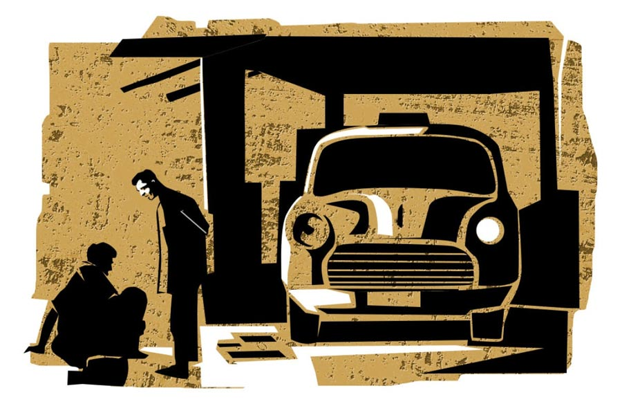

 
 <h1 align=center>পাগল</h1>
<h2 align=center>সাবিনা ইয়াসমিন</h2> 

সঞ্জু জানত, মা খ্যাচখ্যাচ করবেই। কিন্তু আর কোনও উপায় নেই। মা রাগ করলে করুক, তবু সে যেটা ভেবেছে, সেটাই করবে। অনেক দিন থেকেই মতলবটা মাথায় ঘুরছিল। সেই কবে থেকে কম্বলকাকুর আশপাশে ঘুরঘুর করছে সঞ্জু। রোজ কলেজ যাতায়াতের পথে, ফুটবল খেলতে যাওয়ার সময় সে কম্বলকাকুকে মন দিয়ে, খুঁটিয়ে খুঁটিয়ে লক্ষ করেছে।

বড় রাস্তায় বাসস্ট্যান্ডের পাশে কম্বলকাকু বসে থাকে। ঝড়বৃষ্টির সময় বাসস্ট্যান্ডের তলায় আশ্রয় নেয়। রাস্তার পাগলদের যা-যা বৈশিষ্ট্য, কম্বলকাকুর মধ্যে সবগুলোই আছে। শীত এবং প্রচণ্ড গরমেও লোকটা গায়ে কম্বল চাপিয়ে গুটিসুটি মেরে বসে থাকে। কম্বলের জন্য গায়ে জামা আছে কি না বোঝা যায় না। পরনে রোজ একটাই ফুলপ্যান্ট। কম্বল এবং ফুলপ্যান্টের রং একই রকম। কালচে ময়লা। মুখে অল্প দাড়ি। বড় বড় গোঁফ। মাথার চুল ছোট।

মিচকে ছেলেপুলেরা পাগলটার পিছনে লাগে। কম্বল টেনে ধরে। এই সব বিচ্ছুদের ভয় পায় পাগলটা। বড় মানুষদের দেখলে হাত দিয়ে ইশারা করে ডাকে। পাগলের ডাকে সংসারের সেয়ানা-পাগলরা মোটেও পাত্তা দেয় না। আর যে সব সংসারী মানুষের মধ্যে একটা আধপাগলা মন থাকে, তারা কেউ কেউ পাগলটার কাছে যায়। পাগলটা বলে, “পাউরুটি আর চা কিনে দেবে?”

কেউ দশ-বিশ টাকা দিতে চাইলে পাগলটা নেয় না। বলে, “টাকা নেব না। রুটি-তরকারি কিনে দাও।”

নরম মনের মানুষরা ও দিকের বাজার থেকে পলিথিনে করে পাউরুটি বা রুটি-তরকারি এনে দেয়। পাগলটার একটা বস্তা টাইপের গাবদা ঝোলা আছে। তার মধ্যে প্রচুর হ্যান্ডবিল, পুরনো খবরের কাগজ, জলের বোতল এবং অজস্র ন্যাকড়া জমানো। পলিথিন থেকে খবরের কাগজে খাবার ঢেলে নিয়ে খায়। পুরসভার টাইম কল থেকে বোতলগুলোয় জল ভরে রাখে।

সঞ্জুর মনে হয়, লোকটা পুরো পাগল নয়। হাফ পাগল। অথবা পাগল সেজে থাকে!

এক দিন বৃষ্টির হাত থেকে বাঁচতে সঞ্জু বাসস্ট্যান্ডে দাঁড়িয়ে ছিল। পাশে কম্বলকাকু কম্বল জড়িয়ে বসে বসে দুলছিল। তখনই আলাপ হয় সঞ্জুর সঙ্গে। লোকটা ভাল কথা বলে। একেবারেই পাগলা টাইপের নয়।

নিজের নাম বলতে গিয়ে লোকটা গড়গড় করে অনেক কথাই বলতে শুরু করল। বলল, “আমার নাম সমর, কিংবা অমর হতে পারে! ঠিক মনে পড়ছে না। তবে লাস্টে ‘মর’ শব্দটা আছে। আমার সৎমা আমাকে নানা জড়িবুটি খাইয়ে মাথা নষ্ট করে দিয়েছে! এখন অবশ্য অনেকটা ভাল আছি। টাইম অনেক বিষ নামিয়ে দেয়। কিন্তু তাও মাঝেমধ্যে অনেক কথা মনে পড়ে না।”

সঞ্জু অবাক হয়, “কিছু খাইয়ে মাথা খারাপ করে দেওয়া যায়?”

“যায়।” সমর অথবা অমর ময়লা কম্বলটা দিয়ে নিজেকে আর একটু ঢেকে নিল। বৃষ্টি ছেড়ে যাওয়ার পর এই ভ্যাপসা গরমেও লোকটা গায়ে কম্বলখানা চাপিয়ে রেখেছিল।

সমর অথবা অমর মুখটা খুব করুণ করে বলল, “আমার সৎমা আমাকে খেতে দিত না, জানো! আমার প্রচণ্ড খিদে পেত। এক মুঠো মুড়ি আর একটুখানি তরকারি দিয়ে বলত, ‘খেয়ে নে।’ কলের জল খেয়ে পেট ভরাতাম। কিন্তু খালি পেটে অত জল খেয়ে প্রচণ্ড গা গোলাত। বমি হয়ে যেত। বমিতে শুধু জল উঠত।”

সঞ্জু মন দিয়ে কথা শুনছে দেখে লোকটা খুব কোমল ভাবে বলল, “চায়ের দোকানটা থেকে একটা ডিমসেদ্ধ এনে দাও না!” বলে গবার চায়ের দোকানটার দিকে আঙুল তুলে ইশারা করে দেখাল।

বৃষ্টি অনেক ক্ষণ আগেই থেমে গেছে। সঞ্জু চায়ের দোকানের দিকে এগোতেই লোকটা বলল, “ডিমটা আধখানা করে কেটে বিটনুন আর একটা কালো রঙের গুঁড়ো... কী যেন বলে... ওইটে ছড়িয়ে দিতে বলবে।”

সঞ্জু বলল, “গোলমরিচ তো?”

লোকটা খুশিতে উজ্জ্বল হয়ে উঠল, “হ্যাঁ হ্যাঁ! গোলমরিচের গুঁড়ো। নামটা একদম মনে পড়ছিল না।”

পকেটে টাকা ছিল। সঞ্জু লোকটার জন্য দুটো ডিমসেদ্ধ নিয়ে এল। খুব খুশি হল লোকটা।

তৃপ্তি করে খেতে খেতে সঞ্জুর সঙ্গে কথা চালিয়ে যেতে লাগল, “বুঝলে ভায়া, খাওয়ার মতো জিনিস আর কিচ্ছু নেই! রায়গঞ্জ থেকে স্টেট বাসে চাপিয়ে আমার সৎভাই আমাকে কলকাতায় ছেড়ে দিয়ে চলে গেল। তখন আমি পুরো পাগল। খালি মাথা ঘোরে। কিছু মনে পড়ে না। একমাত্র সৎমায়ের মুখটা মনে ছিল।”

সঞ্জু বলল, “আপনার বাবা আপনাকে সাপোর্ট করতেন না!”

“বাবাকেও খুব কথা শোনাত সৎমা। বাবা সব সময় ভয়ে ভয়ে থাকত। আমি যখন বেশ ছোট, তখন আমার মা গলায় দড়ি দেয়। তার পর বাবা আবার বিয়ে করে। এই পক্ষের দুটো ছেলে হয়। তারাও আমাকে খুব মারত। খুব খাওয়ার কষ্ট পেয়েছি, জানো!” লোকটা সঞ্জুর দিকে তাকাতেই খুব মায়া লাগল তার।

দুটো ডিমসেদ্ধ খেয়ে লোকটার কথা বলার শক্তি যেন ডবল হয়ে গেছে, “জানো ভাই, ক্যালিগ্রাফিতে আমার খুব ইন্টারেস্ট ছিল। একটা কোম্পানিতে কাজ পেয়েছিলাম। সেখানে ভিজ়িটিং কার্ড তৈরি হত। আবার পার্টির লোকেরা ভোটের আগে আমাকে ভাড়া করে নিয়ে যেত দেওয়াল লেখাবে বলে। টুকটাক ইনকাম ভালই ছিল। কিন্তু ঘরে দুটো ভাত পেতাম না। নিজের খাওয়া বাবদ সৎমার হাতে বেশ ক’টা টাকা তুলে দিতাম। আমাকে কচুপোড়া খেতে দিয়ে সে টাকা সৎমা মেরে দিত। খাওয়ার কষ্ট যে কী জিনিস!”

এক দিন খাতা-পেন নিয়ে গিয়েছিল সঞ্জু। লোকটা সুন্দর করে নিজের নাম লিখেছিল। অমর আদক।

সঞ্জু বলেছিল, “আপনার নাম তা হলে অমর? সমর নয়?”

অমর আদক বলল, “লিখতে গিয়ে এই নামটাই মনে হল! একটানে লিখে ফেললাম। কত দিন বাদে পেন ধরলাম! খুব ভাল লাগছে। একটা বিড়ি খেতে পারলে ভাল হত! সিগারেট খাওয়া হয়?” সঞ্জুর দিকে তাকিয়ে অমর জিজ্ঞেস করল।

সঞ্জু বলল, “খাই। তবে খুব কম। মা খুব রাগারাগি করে।”

অমর হতাশ হল।

সঞ্জু জানে, মায়ের রাগারাগির মধ্যে অন্যায্য কিছু নেই।

বাবা মারা যাওয়ার পর ব্যাঙ্ক আর পোস্ট অফিসের সুদে সংসার চলে। সে নয় গ্র্যাজুয়েশন করে বসে রয়েছে, কিন্তু ভাইয়ের পড়ার খরচা আছে। খাওয়া-পরা, ইলেকট্রিক বিল, এটা-সেটা ছাড়াও সংসারের আরও অনেক খরচ আছে। এ দিকে সুদের হার যে হারে কমছে, কোন দিন আসলেই না হাত পড়ে যায়!

সঞ্জু চাকরির জন্য খুব চেষ্টা করছে। কিন্তু ঠিকমতো ব্যাপারটা লাগছে না। পাগল অমর আদককে দেখে তার মাথায় একটা প্ল্যান এসেছে। প্ল্যানটা সফল হলে মাসে পঞ্চাশ-ষাট হাজার টাকা ইনকাম করা কোনও ব্যাপারই নয়। কিন্তু মাকে কিছুতেই বোঝানো যাচ্ছে না।

“খাওয়া দেখিয়ে ইনকাম! তাও আবার পাগলের খাওয়া! লোকে খামোখা খাওয়া দেখতে যাবে কেন? আর অত টাকাই বা দেবে কেন?...” মায়ের প্রশ্নের উত্তরে ছোট ভাই ফোড়ন কেটে বলেছে, “একে ‘মুক বাং’ বলে মা। কোরিয়ান ভাষায় এর মানে ‘ইটিং শো’। খুব পপুলার! পাঁপড় খাওয়ার আওয়াজ, কচকচ করে লঙ্কা চিবোনো— সব শুনতে পাবে। এক-এক জন রাক্ষসের মতো খায়। পাগল না হলে ও রকম খাবেই বা কী করে! মানুষ মন্ত্রমুগ্ধের মতো দেখে। তাই না দাদা?”

“তুই থাম!” সঞ্জু ভাইকে থামায়।

মাকে রাজি করানোটাই এখন দরকার। কিন্তু মা তো কিছুতেই রাজি হচ্ছে না। তার উপর যখন শুনল অমর আদককে বাড়িতে নিয়ে আসা হবে, তার খাওয়াদাওয়ার ভিডিয়ো বানিয়ে ইউটিউবে ছেড়ে লাইক কমেন্ট বাড়িয়ে রোজগার করা হবে... মা বেঁকে বসল। তার পর বলল “এক বার খেয়েই লোকটা চলে যাবে তো?”

সঞ্জু মাকে কী করে বোঝাবে যে মাত্র এক বার হাতির খাওয়া খেলে ভিউ বাড়বে না। কিছু দিন ধরে প্রায় রোজ খেলে তবেই লোকে চোখ বড় বড় দেখবে আর সঞ্জুদের বড়লোক হওয়ার রাস্তা খুলে যাবে।

তার জন্য অমর আদককে কিছু দিন বাড়িতে এনে রাখতে হবে। চান করিয়ে পোশাক পরিয়ে ভদ্রস্থ করে তার পর ভিডিয়ো করতে হবে। তাদের একতলাটা ভাড়া দেওয়া আছে। দোতলায় তারা থাকে। রান্নাঘরের পাশে একটা ছোট্ট ঘর আছে। বাড়তি জিনিসপত্র থাকে। ওখানে অমর আদকের থাকার ব্যবস্থা করা যেতে পারে। একটা টেবিলফ্যান দিলেই হয়ে যাবে। কিন্তু মা কি রাজি হবে!

এ সব পরিকল্পনার কথা শুনে মা এমন চিৎকার জুড়ল যে, প্ল্যান বাতিল হওয়ার পথে। যা-ই হোক, অবশেষে মাকে অনেক কষ্টে ম্যানেজ করতে পারল সঞ্জু। শেষ মুহূর্তে রঞ্জু দাদার হয়ে জান লড়িয়ে দিল। রঞ্জু এখনকার ছেলে। ঠিক বুঝেছে যে, ব্যাপারটা জমাতে পারলে টাকার অভাব থাকবে না। ভাল জিনিস লোকে না দেখুক, কিন্তু উদ্ভট জিনিস কিংবা ছ্যাবলামির দর্শক কখনও কম পড়ে না।

অমর আদক শুনে হাঁ হয়ে গেল। বাড়িতে নিয়ে গিয়ে ভালমন্দ খাওয়াবে! থাকতে দেবে! শুধু খাওয়ার সময় ভিডিয়ো করতে দিতে হবে। এটা কী এমন কঠিন শর্ত! তেলচিটে কম্বলটা গায়ে ভাল করে জড়িয়ে একগাদা কাগজ আর প্লাস্টিকের বোতলভর্তি ঝোলাটা বগলে নিয়ে সঞ্জুর পিছন পিছন তাদের বাড়িতে হাজির হল সে।

ওকে দেখে সঞ্জুর মা চেঁচাতে শুরু করল, “কী নোংরা লোক রে বাবা! ইস! কী গন্ধ বেরোচ্ছে লোকটার গা থেকে! এক্ষুনি লোকটাকে বিদেয় কর। ভিডিয়ো-ফিডিয়ো করার দরকার নেই।”

লোকটাকে বাইরের ঘরে বসিয়ে সঞ্জু আর রঞ্জু মাকে বোঝানোর চেষ্টা করতে লাগল। রাগে মায়ের মুখ থেকে কথা বেরোচ্ছিল না। বাবার জামাপ্যান্ট, পাজামা-পাঞ্জাবিগুলো মায়ের আলমারিতে আছে। অমর আদককে শ্যাম্পু সাবান দিয়ে স্নান করিয়ে বাবার একটা পরিষ্কার পাজামা আর ফতুয়া পরিয়ে দিলেই হবে!

অমর আদক বহু দিন স্নান করেনি। জল দেখে এমন করছিল যেন জলাতঙ্ক হয়েছে! কিছুতেই কম্বল ছাড়তে চাইছিল না। বলল, “অভ্যেস হয়ে গিয়েছে। আমাকে শুধু পায়জামা দাও। জামা দিতে হবে না। কম্বলটা গায়ে রেখে দেব।”

তাই বললে কী হয়! ভাল করে সেজেগুজে না বসলে লোকে দেখবে কেন! সঞ্জু ব্যাঙ্ক থেকে টাকা তুলে এনেছে, এক জনের কাছ থেকে অনেক টাকা ধার করেছে। যদি ভিডিয়োগুলো জনপ্রিয় হয়, তখন একটা ভাল ক্যামেরা কিনে নেবে।

পরিষ্কার-পরিচ্ছন্ন হওয়ার পর অমর আদককে একদম ভদ্রলোকের মতো দেখতে লাগছিল। সঞ্জু ওকে একটু শিখিয়ে পড়িয়ে নিল। তার পর একটা ইউটিউব চ্যানেল খুলে ‘জয় মা’ বলে শুরু করে দিল। মা একা অতটা রান্না করতে পারবে না বলে ঝর্নাকাকিমাকে ডেকে নেওয়া হয়েছে। কাকিমার হাতে নগদ কিছু টাকা দেওয়া হবে।

প্রথম দিন এলাহি খাবারের আয়োজন করা হল।

চ্যানেলের নাম দেওয়া হল, ‘মরণ খাওয়া খেয়েও অমর’। নাম শুনে অমর আদক বলল, “নামটা কেমন যেন! মরণ খাওয়া ব্যাপারটা ঠিক বুঝলাম না।”

অবশ্য খেতে বসার পর অমর আদক মরণ খাওয়াটা ঠিক কী, সেটার আঁচ পেল। এক কেজি মুরগির মাংস কষা, এক কড়াই মাটনের চর্বি ভাজা, কুড়ি পিস পোনামাছ ফ্রাই, তিরিশটা হাঁসের ডিমের কারি, বড় এক থালা ভাত আর খান পঁচিশেক কাঁচালঙ্কা।

অমর আদক সচল ক্যামেরার সামনেই আঁতকে উঠল। বলল, “এত খেলে ঠিক মরে যাব ভাই। ভাত আর দুটো ডিম হলেই আমার হয়ে যাবে।”

প্রচণ্ড বিরক্ত হল সঞ্জু, “কাকা, এটা লাইভ হচ্ছে। উল্টোপাল্টা কিছু বোলো না। যা যা শিখিয়েছিলাম, সেগুলো বলে ঝটপট খাওয়া স্টার্ট করে দাও।”

মজা দেখতে ঘরে সঞ্জুর মা, সঞ্জুর ভাই, ঝর্নাকাকিমা, ঝর্নাকাকিমার মেয়ে অতসী, সঞ্জুর এক বন্ধু হাজির হয়েছে। ঘরটার মধ্যে বিভিন্ন খাবারের গন্ধ এক সঙ্গে পাক খাচ্ছে। তাতে লোভ লাগার পরিবর্তে সকলেরই গা গুলিয়ে উঠছে। সঞ্জুর মা নাকে আঁচল চাপা দিয়ে রেখেছে। ও দিকে অত খাবার দেখে অমর আদকের মরে যাওয়ার মতো অবস্থা হয়েছে। তবু খেতেই হবে। লাইভ প্রোগ্রাম। দীর্ঘ দিন পর চোখের সামনে অত ভাল খাবার দেখে আর খাবারের গন্ধ শুঁকে অর্ধেক খিদে মরে গিয়েছে। তবু খেতে তো হবেই! মোবাইলের ক্যামেরা অন আছে। খেতে খেতে চোখ উল্টে যাওয়ার জোগাড়! তার উপর সঞ্জু বলেছে কাঁচালঙ্কাগুলো এমন ভাবে কচরমচর করে চিবিয়ে খেতে হবে, যাতে সাউন্ডটা ঠিকমতো শোনা যায়!

সব খাবারগুলো পশুর মতো গিলে পায়জামার দড়িটা আলগা করে ওখানেই শুয়ে পড়ল অমর আদক। সঞ্জু ভিডিয়ো করা বন্ধ করে দিল। এডিট করে ছাড়বে।

‘মরণ খাওয়া খেয়েও অমর’ দিন দিন চরম পপুলার হয়ে উঠল। জনপ্রিয়তার নিরিখে ক’টা মাত্র ভিডিয়ো দেখেই ইউটিউব কর্তৃপক্ষের তরফ থেকে মেসেজ এল।

আনন্দে সঞ্জুর পাগল-পাগল অবস্থা। এই তো দরজা খুলে যাচ্ছে! এর পর কাঁড়ি কাঁড়ি টাকা আসবে।

রোজ ভিডিয়ো করা সম্ভব হয় না। প্রস্তুতির জন্য সময় লাগে। প্রতি বার ভিডিয়ো করার দিন সকাল থেকে অমর আদকের শরীর খারাপ লাগে। বমি-বমি ভাব হয়। সঞ্জু দুটো করে গ্যাসের ট্যাবলেট খাইয়ে দেয়। এখন খাবারের পরিমাণ দু’গুণ হয়েছে। খাবারের পরিমাণ বৃদ্ধির সঙ্গে তাল রেখে ভিউ বাড়ছে। সঞ্জুর আনন্দ বাড়ছে। টাকার বৃষ্টি শুরু হল বলে!

ও দিকে খাওয়ার পর গলায় আঙুল দিয়ে খাবারগুলো না তুলে ফেললে অমর আদক বসতে পারে না, শুতে পারে না, দাঁড়াতে পারে না।

এই ক’দিনে শুকিয়ে কাঠি হয়ে গিয়েছে অমর আদক। সে যখন বাসস্ট্যান্ডের পাশে থাকত, তখন জীবন এতটা কষ্টের ছিল না। এখন সে রোজ স্নান করে, নিয়ম করে জামা বদলায়, ভাল ভাল খাবার খায়, তবু মনে আনন্দ নেই। তার উপর সঞ্জু ক’দিন থেকে বলছে, এ বার নাকি একটা আস্ত পাঁঠার রোস্ট খেতে হবে! শুনে সে প্রচণ্ড নার্ভাস হয়ে আছে।

কুরেশি মিট শপের মালিক রওশন ভাইয়ের কাছে একটা কচি পাঁঠার বায়না দিয়ে রেখেছে সঞ্জু। প্রায় তেরো কেজি মাংস হবে। অনেক দরাদরির পর দশ হাজারে রফা হয়েছে। গ্যাসে আস্ত পাঁঠা ঝলসানো সম্ভব নয়। সাইকা হোটেলে কথা বলতে হবে, ওরা কয়লার আগুনে গোটা ছাগলটা রোস্ট করে দেবে। তার জন্য ওরা যা টাকা চাইবে, দিয়ে দেবে। ইউটিউব থেকে আয় করতে গেলে এ সব হ্যাপা পোয়াতেই হবে!

আজ গোটা খাসি খাওয়ার দিন। আজ অমর আদককে চারটে গ্যাসের ট্যাবলেট খাওয়াতে হবে। ট্যাবলেট খাওয়াতে এসে সঞ্জু দেখল, অমর আদক ঘরে নেই। তার বাবার জামাপ্যান্ট, পায়জামা চৌকির উপরে স্তূপ করে রাখা। পাশে একটা চিঠি গেলাস দিয়ে চাপা।

সঞ্জু,

আমি চলে যাচ্ছি। আমার সৎমা আমাকে না খাইয়ে মারার তাল করেছিল আর তুই আমাকে খাইয়ে মেরে ফেলার চেষ্টা করছিস। লোকে আমাকে পাগল বলে, কিন্তু তোদের দেখার পর আমার নিজেকে আর ততটা পাগল মনে হচ্ছে না। না খেয়ে মানুষ কত দিনে মরে, জানা হয়নি, তবে তোদের বাড়ি থাকলে খেয়ে মরতে আমার আর খুব বেশি দিন লাগত না।

আমার পুরনো প্যান্ট আর কম্বলটা নিয়ে গেলাম। বাসস্ট্যান্ডের আশপাশে তোকে ফের যদি কোনও দিন দেখি, কামড়ে তোর কানদুটো ছিঁড়ে নেব ঠিক।

—ইতি অমর আদক

