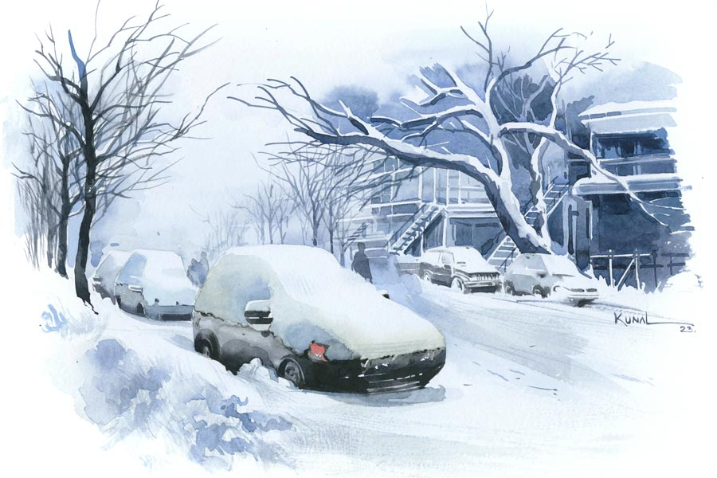

 
 <h1 align=center>পাঞ্চো</h1>
<h2 align=center>নন্দিতা বাগচী</h2> লোকটার নাম পাঞ্চো। মেক্সিকোর মানুষ। কখনও কোনও ফাঁকফোকর দিয়ে ঢুকে পড়েছিল বোধহয় এ দেশে। আমিও বছর পঁচিশেক আগে পড়তে এসেছিলাম উত্তর-পূর্ব আমেরিকায়। ফিরে যাইনি আর। আমাদের দু’জনেরই জন্মভূমি নয় এ দেশ। মিল এটুকুই, তবে অমিলই বেশি। এ দেশটা আমার জন্মভূমি না হলেও আমি এখানকার বৈধ নাগরিক। আর পাঞ্চো এক জন অবৈধ অভিবাসী। আমি নানা বহুজাতিক সংস্থায় উচ্চপদে কাজ করেছি, আর সে এক জন দিনমজুর। তবে এই সব অমিলের মাঝখানে আরও একটা মিল আছে আমাদের। সেটা হল আমাদের নাম। আমি যে দিন জন্মেছিলাম, সে দিনই বাংলাদেশ স্বাধীন হয়েছিল পাকিস্তানের কবল থেকে। তাই আমার বাঙাল বাবা-মা আমার নাম রেখেছিলেন স্বাধীন। আর মেক্সিকোতে প্রচলিত স্পেনীয় ভাষায় ‘পাঞ্চো’ শব্দের অর্থও স্বাধীন। আমরা প্রায় সমনামী। তাই হয়তো লোকটা একটু আকর্ষণ করে আমাকে।

পাঞ্চোর সঙ্গে আমার পরিচয় বছর দশেক আগে। আমাদের বাড়িটার সংস্কার করাচ্ছিলাম তখন। ঠিকাদারের মজুর হিসেবে এসেছিল সে। লোকটার অদ্ভুত কর্মদক্ষতা আমাকে অবাক করেছিল। মনে হয়েছিল, এমন একটা লোক হাতে থাকলে ভবিষ্যতে সুবিধে হবে। তাই তার ফোন নম্বরটা রেখে দিয়েছিলাম।

সারা সপ্তাহ কোনও না কোনও ঠিকাদারের অধীনে কাজ করে সে। আর শনি-রবিতে এসে হাজির হয় আমাদের বাড়িতে। যদি কোনও কাজ থাকে। গত দশ বছর ধরে চলছে এই নিয়ম। বাড়ির যে কোনও কাজেই ওস্তাদ সে। রঙের কাজ, ছুতোরের কাজ, জলের কলের কাজ, মেঝেতে সেরামিক্সের বা কাঠের টালি লাগানো, ছাদের টালি লাগানো, নর্দমা পরিষ্কার করা, এয়ারকন্ডিশনার সারানো, কী নয়! আমাদেরই খুব সুবিধে। বাড়িতে কিছু না কিছু কাজ তো থাকেই।

ইদানীং তার ঠিকাদার তাকে কাজ থেকে ছাড়িয়ে দিয়েছে অত্যধিক পানাভ্যাসের জন্য। কাজের সময়ে কেন বিয়ার পান করবে সে? দিনান্তে, কাজের শেষে যত খুশি মদ্যপান করো, কে বারণ করেছে!

তবে আমাদের বাড়ির একটা বড় কাজ দিয়েছি তাকে। এত কম মজুরিতে এমন কাজের লোক মেলে না এ দেশে। তাই তার পানদোষ উপেক্ষা করেছি আমি। গ্যারাজটা নতুন করে সাজাচ্ছি আমরা। মেঝেতে বড় বড় পোর্সেলিনের টালি, আর তিন দিকের দেওয়ালে মস্ত মস্ত আলমারি। আলমারিগুলোতে ঢুকিয়ে দেওয়া যাবে নানা অপ্রয়োজনীয় জিনিস, যেগুলো হঠাৎ হঠাৎ খুব বেশি প্রয়োজনীয় হয়ে ওঠে। পুরো কাজটা শেষ করতে মাস তিনেক লাগবে হয়তো। তাই এখন আর অন্য কোনও ঠিকাদারের কাছে যাচ্ছে না পাঞ্চো। সারা সপ্তাহ এখানেই কাজ করছে।

মনের আনন্দে কাজ করে সে, আর গলা চড়িয়ে গান গায়। তার ওই স্প্যানিশ গানগুলো শুনতে দিব্যি লাগে আমার। মনে হয় যেন আমাদের দেশের বাড়িতে বসে আছি আর ভোজপুরি গান গাইছে দিনমজুররা। ঘন ঘন সিগারেট ফোঁকার আর বিয়ার পান করার বিরতি নেয় সে। যেমনটি দেশোয়ালি ভাইদের দেখেছি বিড়ি, খৈনি কিংবা চায়ের বিরতি নিতে। নস্ট্যালজিয়ায় মজে থাকি আমি।

পাঞ্চোর সঙ্গে গল্প করতেও ভারী ভাল লাগে আমার। এক দিন জিজ্ঞেস করলাম, “পাঞ্চো, তোমার বৌও কি তোমারই দেশের মেয়ে?”

সে বলল, “না না, আমি মেক্সিকান, আর আমার বৌ হল ব্রাজিলিয়ান। আমেরিকার মেয়েদের মতো ফর্সা টুকটুকে। খুব সুন্দর দেখতে আমার বৌ। তবে সে পর্তুগিজ ভাষায় কথা বলে।”

আমি বলি, “সে কী! তুমি তো স্প্যানিশ ভাষায় কথা বলো, তবে তোমাদের প্রেমটা হল কী করে?”

পাঞ্চো গুবগুব করে হেসে বলল, “আমি কিছুটা পর্তুগিজ ভাষা শিখে নিয়েছিলাম আর আমার বৌ কিছুটা স্প্যানিশ ভাষা শিখে নিয়েছিল। প্রেম বলে কথা!”

“সে কি কোথাও কাজ করে?” উৎসুক হয়ে প্রশ্ন করি আমি।

“হ্যাঁ, করে তো। লোকের বাড়ি ক্লিনারের কাজ করে। কেন, তোমাদের দরকার আছে? বলব ওকে?”

আমি বললাম, “না, আমাদেরও এক জন ক্লিনিং লেডি আছে। এমনিই জিজ্ঞেস করছিলাম। তোমার ছেলে-মেয়ে ক’জন? কত বড় হল তারা?”

পাঞ্চো মন দিয়ে টালি লাগাতে লাগাতে বলল, “একটাই মেয়ে আমার। ষোলো বছর বয়েস। তবে সে আমাদের সঙ্গে থাকে না।”

আমি আকাশ-পাতাল ভেবে বলি, “কোনও বোর্ডিং স্কুলে থাকে?”

“না না, এলিমেন্টারি স্কুলের পর লেখাপড়া ছেড়ে দিয়েছে সে। সে তার বয়ফ্রেন্ডের সঙ্গে থাকে,” বেশ জোরগলায় বলল পাঞ্চো।

আমি একটা ধাক্কা খাই। যে ব্যাপারগুলো আমার অভিধানে নেতিবাচক, সেইগুলোই বেশ ইতিবাচক সুরে বলল লোকটা। আমার শুধু মনে হয়, একটা বছর ষোলোর মেয়ে কেন লেখাপড়া ছেড়ে দেবে? কেনই বা সে এই কাঁচা বয়েসে এক জন পুরুষ সঙ্গীর সঙ্গে থাকবে?

আরও একটা চমক বাকি ছিল আমার জন্য। পাঞ্চো একগাল হেসে বলল, “জানো, আমি দাদু হয়ে গেছি। গত মাসে নাতি হয়েছে আমার।”

আমি একটা অঙ্ক মেলানোর চেষ্টা করি। ষোলো বছর বয়সে মা হয়েছে মেয়েটা, তার মানে চোদ্দো-পনেরো বছর বয়েস থেকেই সে পুরুষ সঙ্গ করছিল। তবে লেখাপড়া ছেড়েছিল কবে? কিন্তু আমার ভারতীয় মূল্যবোধ সে অঙ্ক মেলাতে পারে না। আমার সাবধানী মন আমাদের বছর পনেরোর মেয়ের চার পাশে সুরক্ষা দেওয়াল তুলতে থাকে। ভাবি, মেয়ের দিকে আরও মনোযোগ দিতে হবে। আরও খেলাধুলো, আরও গান-বাজনা-নাটকে ব্যস্ত রাখতে হবে তাকে।

হেমন্তকাল আসি-আসি করছে। ওক-মেপল গাছের পাতাগুলো রঙিন হতে শুরু করেছে। ঠান্ডাও পড়েছে বেশ। বুঝতে পারি, খোলা গ্যারাজে কাজ করতে কষ্ট হয় পাঞ্চোর। কিন্তু সে মুখে কিছু বলে না। হাঁটু গেড়ে বসে মন দিয়ে টালি লাগায়। আমি একটা রুম হিটার লাগিয়ে দিই গ্যারাজটায়। দুটো নি-প্যাড কিনে এনে দিই তার হাঁটু দুটোর আরামের জন্য। সে আকর্ণ হেসে বলে, “থ্যাঙ্ক ইউ সাদিন।”

ব-ফলা বা ধ উচ্চারণ করতে পারে না সে, আর এ দেশে কথায় কথায় ‘স্যর’ বলে না কর্মচারীরা।

আমি এখন বাড়ি থেকেই কাজ করি। একতলাতেই একটা অফিস ঘর তৈরি করে নিয়েছি বড় বড় কাচের দরজা লাগিয়ে। ফলে কে গেল, কে এল, দেখতে পাই। আমার মেয়ের স্কুলবাস আসে সকাল সাতটায়, আর আমার স্ত্রী কাজে বেরিয়ে যায় সকাল আটটায়। সকাল ন’টা নাগাদ আসে পাঞ্চো তার লজঝড়ে গাড়িটা নিয়ে। তার পর তার খেয়ালখুশির তান ধরে কাজ করতে থাকে সে। মাঝে মাঝে সিগারেট ফুঁকতে ড্রাইভওয়েতে বেরিয়ে আসে, হাতে থাকে একটা বিয়ারের ক্যান।

আজ তাকে কিছু নির্দেশ দেওয়ার ছিল বলে মোটা জ্যাকেটটা গায়ে চাপিয়ে ড্রাইভওয়ের দিকে এগিয়ে গেলাম আমি। অবাক হয়ে দেখলাম, পাঞ্চোর গাড়িটার পিছনের সিটে লেপ-তোশক আর বালিশের পাহাড়। সামনের সিটে ও তার নীচেও শার্ট-প্যান্ট-জ্যাকেট-জুতো-ব্যাগ এবং আরও রাজ্যের জিনিসপত্র।

আমি অবাক হয়ে জিজ্ঞেস করলাম, “কী ব্যাপার পাঞ্চো, কোথাও বেড়াতে যাচ্ছ না কি? আমার বাড়ির কাজ শেষ না করে কিন্তু কোথাও যেতে পারবে না তুমি। এই ঠান্ডায় গ্যারাজের দরজা খুলে রাখা যায়? এর পর বরফ পড়তে শুরু করবে, আমাদের গাড়িদুটো ড্রাইভওয়েতে রাখব কী করে? বরফে ঢেকে যাবে তো!”

পাঞ্চো টালিগুলোর ফাঁকে ফাঁকে গ্রাউটিং করতে করতে বলল, “তুমি নিশ্চিন্ত থাকো সাদিন, কোথাও যাচ্ছি না আমি। তোমার বাড়ির কাজ ঠিক সময়েই শেষ করে দেব।”

কিন্তু ধন্দ যায় না আমার মন থেকে। তাই বলি, “তবে তোমার গাড়ি ভর্তি এ সব কী?”

মুখটা তুলে, ফ্যাকাশে হেসে পাঞ্চো বলল, “আমার বৌ আমাকে তাড়িয়ে দিয়েছে বাড়ি থেকে।”

“কেন?” স্বতঃস্ফূর্ত ভাবেই প্রশ্নটা বেরিয়ে এল আমার মুখ থেকে।

এ বার একটু উত্তেজিত হল পাঞ্চো। বলল, “আমি আদতে এক জন মেক্সিকান, আমি টেকিলা পান করব না? এটা আমাদের একটা আবেগ। ব্লু আগাভে তো পৃথিবীর আর কোথাও চাষ করা হয় না। ও তো ব্রাজিলের মানুষ, ও কী করে বুঝবে আমাদের এই প্রাণের কথা?”

আমি তাকে শান্ত করার জন্য বললাম, “তা তুমি পান করো না টেকিলা, সে তো আমরাও করি, নিশ্চয়ই তুমি বেশি পান করেছিলে আর মাতাল হয়ে গিয়েছিলে।”

“দেখো সাদিন, আমি রোজ রাতে এক শট টেকিলা পান করি। আমার শরীর, মন ভাল থাকে তাতে,” গর্বভরে বলল পাঞ্চো।

“তোমার মতো ছোটখাটো, রোগাপাতলা চেহারায় সেটা ঠিকই আছে,” তার আপাদমস্তক জরিপ করে বললাম আমি।

আমাকে থামিয়ে দিয়ে পাঞ্চো বলল, “কাল আমার এক মেক্সিকান বন্ধু কিছু বাড়তি ডলার রোজগার করেছে বলে আমাকে একটা পাবে নিয়ে গিয়েছিল। সেখানে আমরা দু’জনেই সেখানে তিন-তিন শট টেকিলা পান করেছিলাম।”

আমি আঁতকে উঠে বলি, “তোমার এই চেহারায় তিন শট টেকিলা তো মারাত্মক ব্যাপার।”

“হ্যাঁ, মাঝে মাঝে হয়ে যায়। কারও সঙ্গে একটা আনন্দের দিন উদ্‌যাপন করতে গেলে তোমার হয় না?” বিজ্ঞের মতো প্রশ্ন করে পাঞ্চো।

আমি আতান্তরে পড়ি। নিজের কথার জালে আটকে পড়েছি নিজেই। তাই আমাদের কথোপকথনটাকে দীর্ঘায়িত না করে বলি, “বুঝতে পেরেছি, কাল রাতে মাতাল হয়ে গিয়েছিলে বলে বৌ তোমাকে তাড়িয়ে দিয়েছে।”

পাঞ্চো গম্ভীর হয়ে বলল, “শুধু তাই নয়, কাল আমি ওকে অশান্তির মধ্যে একটা খুব খারাপ পর্তুগিজ গাল দিয়েছিলাম। চেঁচিয়ে বলেছিলাম, ‘ফিলু দা পুতা’।”

আমি এই শব্দবন্ধটা কখনও শুনিনি। তাই জিজ্ঞেস করতেই হল, “এ কথাটার অর্থ কী?”

পাঞ্চো একটু কিন্তু-কিন্তু করে বলল, “ওই যাকে তোমরা ‘সান অব আ বিচ’ বলো, তাই।”

আমি ভাবি, নিজের বিবাহিতা স্ত্রীকে কেউ এমন গাল দেয়! বেশ করেছে তাড়িয়ে দিয়েছে। কিন্তু মুখে বলি, “এখন তুমি থাকবে কোথায়?” কেননা একটা ভয় দাঁত-নখ শানাচ্ছিল আমার মনের ভেতরে। যদি বলে বসে আমাদের ড্রাইভওয়েতেই রাতে ঘুমোবে সে!

কিন্তু আমার ভয়টাকে নস্যাৎ করে দিয়ে সে বলল, “আমার কি থাকার জায়গার অভাব? কত দেশি ভাই আছে এ শহরে! তোমাদের পাড়ার যে মেক্সিকান রেস্তরাঁটায় খেতে যাও তোমরা, তাদের পার্কিং লটেই রাখব গাড়িটা। মালিকের সঙ্গে আমার কথা হয়ে গেছে।”          

আমি আতঙ্কিত হয়ে প্রশ্ন করি, “এই ঠান্ডায় ওই গাড়ির মধ্যেই ঘুমোবে? জমে বরফ হয়ে যাবে তো!”

পাঞ্চো দু’হাত নেড়ে বলে, “না না, আমার থাকা-খাওয়ার ব্যবস্থা হয়ে গেছে। ওই রেস্তরাঁতেই খাব আর রাত্তিরে কিচেনের একটা টেবিলের ওপরে ঘুমোব।”

আমি জানি না এই ব্যবস্থাটা বৈধ কি না, কিন্তু দায় এড়ানোর জন্য বলি, “বাঃ, তোমার দেশি ভাই তো বেশ দয়ালু দেখছি!”

“দয়ালু না ছাই! রাতে ওই রেস্তরাঁর সব বাসনপত্র মেজে দিতে হবে আমাকে। কিছু পাওয়ার জন্য কিছু দিতেও হয় আজকাল। ফোকটে দান করে না কেউ!” মুখ কুঁচকে গজগজ করে পাঞ্চো।

আমার কাজের দেরি হয়ে যাচ্ছে, তা ছাড়া পাঞ্চো দিনমজুর, সময়টা যে ভাবেই কাটাক, তার সারা দিনের মজুরি তো আমাকেই দিতে হবে। তাই বাড়ির ভিতরে ঢুকে পড়ি আমি।

কিন্তু পরক্ষণেই ডোরবেলটা বেজে ওঠে। কাচের দরজার ও-পার থেকে পাঞ্চো কিছু বলতে চায় আমাকে। দরজাটা খুলতেই বলে, “কাল কিন্তু আমি কাজে আসব না।”

“কেন?” বিরক্ত হয়ে বলি আমি।

“ওই রেস্তরাঁর মালিকের বাড়িতে যেতে হবে কাল। একটা মুরগির খাঁচা তৈরি করে দিতে হবে। বুঝতেই পারছ নিজে মুরগি পুষলে আর বেশি দাম দিয়ে ফুড স্টোর থেকে অর্গ্যানিক মুরগির মাংস কিনতে হবে না। আর আজকাল এই অর্গ্যানিক খাবারের ব্যাপারে মানুষ কেমন ক্রেজ়ি হয়ে উঠেছে সে কথা তো জানোই তুমি,” একটা দায় প্রকট হয়ে ওঠে পাঞ্চোর চোখে-মুখে।

মাসখানেক কেটে গেছে। ঠান্ডাটা বেশ জাঁকিয়ে পড়েছে। আজ সকালে পাঞ্চো এসে একটা মস্ত বড় ক্যারিব্যাগ আমার হাতে দিয়ে বলল, “সাদিন, এটা একটু ঘরের ভেতরে রেখে দেবে? বাইরে বড় ঠান্ডা।”

আমি উঁকি দিয়ে দেখি, ব্যাগটার ভিতরে বেশ কিছু সস্তার খেলনা আর বাচ্চাদের গরমজামা। আমার কিছু বলার অপেক্ষা না করেই পাঞ্চো বলল, “আজ আমার মেয়ে আসবে নাতিটাকে নিয়ে, আমি তো এখনও তার মুখই দেখিনি। তাই এগুলোনিয়ে এলাম।”

ব্যাগটা হাতে নিয়ে আমি বললাম, “বেশ করেছ, তা কখন আসবে মেয়ে?”

আমার কথা শেষ হতে না হতেই একটা লজঝড়ে গাড়ি ঢুকল আমাদের ড্রাইভওয়ে দিয়ে। আর পাঞ্চো আমার হাত থেকে ব্যাগটা কেড়ে নিয়ে দিগ্বিদিক জ্ঞানশূন্য হয়ে ছুটে গেল।

ঘণ্টাখানেক বাপ-বেটিতে কথাবার্তা হল গাড়ির ভেতর বসে। কাচের জানলা দিয়ে দেখতে পাচ্ছি ছোট্ট বাচ্চাটাকে কোলে নিয়ে আদর করছে পাঞ্চো।

মেয়েটা চলে যাওয়ার পর ড্রাইভওয়েতে গিয়ে দাঁড়ালাম আমি। পাঞ্চোকে বোঝাতে চাইলাম, এখন তোমার কাজের সময়। কিন্তু পাঞ্চোর কাজে মন নেই আজ। উদ্ভাসিত মুখে সে বলল, “নাতিটা কী সুন্দর হয়েছে দেখতে কী বলব! আর তার নাম কী রেখেছে জানো?”

স্বতঃস্ফূর্ত ভাবে আমি জিজ্ঞেস করলাম, “কী?”

“ফ্রান্সিসকো। আমার ভাল নামও তো তাই। পাঞ্চো তো আমার ডাকনাম। আর আমাদের নামটার মানে কী জানো? মানে হচ্ছে মুক্ত পুরুষ।”

গর্বভরে কথাগুলো বলল পাঞ্চো। মাথাটা উঁচু করে। আমি ভাবি, ঈশ্বরের এ কেমন কৌতুক? এক জন চরম পরাধীন মানুষ, যার নাগরিকত্বের ঠিকঠিকানা নেই, নেই বাড়িঘর-চালচুলো, এমন কি যাকে তার বৌও তাড়িয়ে দিয়েছে, সে কী করে মুক্ত পুরুষ হতে পারে?

আমার মনের কথাগুলো কি পড়ে ফেলল পাঞ্চো? তবে কেন সে বলে উঠল, “তবে আমার আর আমার নাতির মধ্যে একটা বড় পার্থক্য আছে। ওকে আমাদের মতো পুলিশের চোখে ধুলো দিয়ে পালিয়ে বেড়াতে হবে না। ও তো জন্মসূত্রে আমেরিকান। সত্যিকারের ফ্রান্সিসকো।”

পাঞ্চোর দিকে তাকিয়ে দেখি সূর্যোদয়ের আলো ঝিলমিল করছে তার মুখটি জুড়ে।