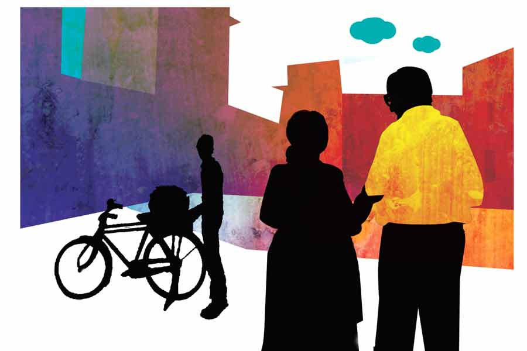

 
 <h1 align=center>পানিফল</h1>
<h2 align=center>মোনালিসা চন্দ্র</h2> হেমন্তের নরম সকালে মাঝে মাঝে শোনা যায় এই হাঁক, “পানিফল নিবেন গো, পানিফ-অ-অ-অ-ল...”

অভিজাত মানুষজন পানিফল কেনেন না, আর এই গলিতে বাস যত অভিজাত মানুষদেরই। সাইকেলের পিছনে ঝুড়ি-বাঁধা পানিফল-ব্যাপারি তবু এই গলিতে ঢোকে কেন কে জানে। ভুল করেই ঢোকে হয়তো, কিংবা ঢোকে বিক্রির ক্ষীণ আশায়। তবে আজ কেউ তাকে ডাকল। ডাকলেন মৃগাঙ্ক। রানি হঠাৎ লাফিয়ে উঠে বায়না ধরেছে “পাঁইফল খাব!”

অলকা তাকান পুত্রবধূর দিকে। তাঁর দুই ভুরুর মাঝে হালকা কুঞ্চনরেখা। সেটি আরও স্পষ্ট হওয়ার আগেই ধাঁ করে পানিফলওয়ালাকে ডেকে ফেলেন মৃগাঙ্ক।

কেনা তো হল, কিন্তু পানিফল ছাড়াবে কে? খোসা ছাড়ানোর হাঙ্গামা এড়াতেই ও জিনিস কদাপি কেনেন না অলকা। তা ছাড়া স্বাদ গন্ধ কিছুই যার মনকাড়া নয়, তা কিনবেনই বা কেন? অলকার কাজ কি কম পড়িয়াছে? 

মৃগাঙ্কই ধুয়েটুয়ে এনে ফলগুলো বধূমাতার হস্তে অর্পণ করলেন এবং উজ্জ্বল মুখে বললেন, “নে ধর, খোসা ছাড়াতে পারবি তো?”

অলকা বাঁচলেন। যাক, কাজটা রানির ঘাড়ে পড়ল তা হলে। কিন্তু বাঁচার জো কি অলকার আছে? ফলগুলো হাতে পাওয়া মাত্র অদ্ভুত দ্রুততায় আঙুলে কাঁটা ফুটিয়ে ফেলল রানি। অলকা মনে মনে ‘বেশ হয়েছে’ ভেবেছেন কি ভাবেননি, রানির আঙুল নিয়ে হুলস্থুল বাধালেন মৃগাঙ্ক। আঙুলের শুশ্রূষাপর্ব মিটলে দেখা গেল পানিফল ছাড়ানোর কাজটি চেপে গেছে অলকারই ঘাড়ে।

অলকা নিরুপায়। গুমোর দেখিয়ে কাজটা ফেলে রাখলে অনভ্যস্ত হাতে মৃগাঙ্কই যাবেন পানিফল ছাড়াতে। জলখাবারের মেনুতে আজ ছুটি-স্পেশাল কচুরির তোড়জোড় চলছে, তার মাঝে পানিফলের খোসা ছাড়ানোর বরাত দিলে রান্নার মেয়ের গাল ফুলবে। অগত্যা নীরবে বধূমাতার মুণ্ডপাত করতে করতে অলকাকেই বসতে হল পানিফলের বিরক্তিকর খোসা বিয়োজনে।

একটু বাদে রানিসাহেবা হেলেদুলে এলেন, একটি পানিফল তুলে ঘুরিয়ে ফিরিয়ে দেখলেন এবং দেখতে দেখতে সহসা সোল্লাসে চেঁচিয়ে উঠলেন, “মা দেখেছ, পাঁইফল দেখতে একেবারে বাইসনের মাথার মতো! কাঁটা দুটো হল শিং আর এই এই জায়গাগুলো হল নাক মুখ চোখ। দেখো না, দেখো দেখো...”

মৃদু একটা ‘হুম্’ ছাড়া অলকার কাছ থেকে আর সাড়া না পেয়ে রানি এ বার ছুটল শ্বশুরের কাছে। মনশ্চক্ষে দেখতে পাচ্ছেন অলকা, রানির হাতে বাইসনের মাথা দেখতে দেখতে মৃগাঙ্ক ‘তাই তো! তাই তো!’ করে নিজের মাথাখানা দুলিয়েই চলেছেন। এ ছবি বড়ই গাত্রদাহকর। সে দাহ মাথায় পৌঁছেও যায় চট করে। ফলাফল, ক্ষণিকের মনোযোগহীনতা এবং সেই অবকাশে পানিফলরূপী বাইসনের তীক্ষ্ণ শিং গুঁতোয় খোদ অলকাকে।

কিন্তু অলকার তো মৃগাঙ্ক হেন শ্বশুর নেই, তাই বিক্ষত আঙুল টিপে ধরে নিজের ব্যথা নিজেকেই কমানোর চেষ্টা করতে হয়। এমনকি কোটাকুটি শেষ হলে নুন লঙ্কা মাখিয়ে প্লেটে সাজিয়ে ফলগুলো বধূমাতা সমীপে রেখেও আসতে হয়।

আজকাল প্রায়ই কপালে করাঘাত করেন অলকা। কী কুক্ষণে এ মেয়েকে পছন্দ করেছিলেন তিনি! ছবিতে মিষ্টি মুখখানি দেখে অলকাই গলেছিলেন বেশি। সেকেন্ড রাউন্ডে অর্থাৎ মেয়ে দেখা পর্বে মেয়ের মা-বাবার কথায় আর ব্যবহারে সর্বাধিক কাতও তিনিই হয়েছিলেন। পুকাইও অবশ্য এক দেখাতে পছন্দ করেছিল। তবে অলকার আগ্রহ আতিশয্যেই রানির পদার্পণ এ বাড়িতে। কিন্তু সে মেয়ে যে এমন ন্যাকাষষ্ঠী হবেন, তা কি তখন ঘুণাক্ষরেও বোঝা গেছিল?

মঞ্চে এ বার পা রাখল অলকার সুপুত্র, তথা রানিসাহেবার আর এক খিদমতগার, পুকাই। নিদ্রাভঙ্গ হয়েছে তার। হাই তুলতে তুলতে এসে অলকাকে বলল, “মা, চা।”

পানিফলজনিত জমে থাকা রাগঝাল এ বার ছেলের ওপরে ঝাড়লেন অলকা, “মা-কে কেন? বৌকে বলো না গিয়ে।” পুকাই অমনি হেসে বলল, “রানি করবে চা? তার চেয়ে বাবা আমিই এক কাপ জল মাইক্রোতে গরম করে খেয়ে নিই।” অলকা উত্তরে কিছু বলতে যাচ্ছিলেন, থেমে গেলেন, কারণ মঞ্চে তখন পুনঃপ্রবেশ ঘটছে রানিসাহেবার। মুখে টকাস টকাস শব্দ করতে করতে এসে অলকাকে জড়িয়ে ধরে এক পাক ঘুরে নিয়ে সাহেবা বললেন, “পাঁইফলটা এত সুন্দর মেখেছিলে মামণি, আমি সবগুলো খেয়ে ফেলেছি। তোমার জন্য একটাও রাখতে পারিনি। কাল লোকটা গেলে আবার কিনব, বেশ?” 

অলকা দ্রুত স্থানত্যাগ করলেন। মাথাটা বড্ড তেতে উঠছে, ঠান্ডা না করলেই নয়। মনের গরল কারও কাছে উগরাতে পারলে একটু শান্তি হত, কিন্তু তা করবেন কার কাছে? মৃগাঙ্ককে কিছু বলার উপায় নেই। তাঁর মুখে এক কথা, “ও একটা বাচ্চা মেয়ে, নিজের বাবা-মাকে ছেড়ে আমাদের কাছে এসেছে। ওকে একটু আদর যত্ন না করলে চলে, বলো?”

চোখ ফেটে জল আসে অলকার। ধামাচাপা স্মৃতিরা সব ধামার তলা থেকে বেরিয়ে নাচানাচি শুরু করে দেয় মনে। রানির চেয়েও অল্প বয়সে মা-বাবাকে ছেড়ে শ্বশুরবাড়ি এসেছিলেন অলকা। বাপসোহাগি বেটি তিনিও ছিলেন, কিন্তু... না থাক, সাত সকালে ও সব স্মৃতি কিছুতেই আজ মনে আনবেন না অলকা। শ্বশুরবাড়িতে যন্ত্রণা আর লাঞ্ছনা পাওয়াকে এ দেশের মেয়েরা ভবিতব্য বলে মানে, তিনিও মেনে নিয়েছেন। জ্বালা ধরে কেবল রানির প্রতি মৃগাঙ্কর এই আদিখ্যেতাগুলো দেখলে। তাঁর বেলায় মৃগাঙ্ক মুখে কুলুপ এঁটে থাকতেন কেন? সত্যি বলতে, অলকার যত না কষ্ট তখন হয়েছিল, মৃগাঙ্কর ব্যবহার দেখে এখন হয় তার চেয়ে ঢের বেশি।

অলকার দুঃখ অলকার মেয়ে বকাইও বোঝে না। মেয়ের কাছে বৌমার নিন্দেমন্দ করে মন হালকা কোন শাশুড়ি না করে? অলকার সে পথও বন্ধ। মৃগাঙ্ক তবু মিষ্টভাষী, বকাই একেবারে কড়া দিদিমণি। সে নিজে কোনও নিন্দে শুনবে না, অলকাকেও করতে দেবে না। তার টেলিফোনিক চোখরাঙানিতে অলকা তটস্থ, “কিচ্ছুটি বলবে না তুমি রানিকে। বেশি দিন থাকবে না ও তোমার কাছে। পুকাই ট্রান্সফার হয়ে গেলে রানিও চলে যাবে। সেই ক’টা দিন রানির সব ছেলেমানুষি তুমি চোখ-কান বুজে ইগনোর করবে। জেনে রাখ, এইটাই সম্পর্ক ভাল রাখার একমাত্র উপায়...” এই হল তার মাকে জ্ঞানদান।

তবে অলকার মনটা আজ বড়ই চিড়বিড় করছে। সেলাই নিয়ে বসে পড়লেন তাই। ওই একটি কাজে ডুবে গেলে মাথাটা ঠান্ডা হয় তাঁর। স্ত্রীর মেজাজ বিগড়ে আছে বুঝে মৃগাঙ্ক খেতে পর্যন্ত চাইতে পারছেন না, শুধুই ঘুরঘুর করছেন। কিছু ক্ষণ পরে এসে জুটল পুকাই, বলল, “বুঝলে বাবা, আমাদের বাড়িটা শিল্পনিকেতন হয়ে উঠল। এক জন এ ঘরে সেলাইয়ে মেতেছেন, আর এক জন ও ঘরে বসেছেন আঁকতে।”

শুনে অলকার পড়ে আসা রাগ আবার টঙে চড়ল। রানিসাহেবা আঁকায় বসেছেন, তার মানে তাকে ডেকে ডেকে এনে খাওয়ানোর দায়িত্ব এ বার অলকার।

আঁকাআঁকির প্রতি দুর্বলতা ছিল বলে ছেলেমেয়েদের ছবি আঁকা শেখাবার পেছনে এক কালে অনেক খেটেছিলেন অলকা। তারা কেউ শিখল না, অথচ আজ পরের বাড়ির একটা মেয়ে এসে ছবি এঁকে এঁকে বাড়ি ভরাচ্ছে। তাও সে সব ছবি যদি দৃষ্টিনন্দন হত! রানির আঁকা ছবি মানেই হয় ট্যারাব্যাঁকা মানুষ, নয় ক্যানভাস জুড়ে উদ্দাম রঙের স্রোত। ওগুলো নাকি ছবি! চোখের কষ্ট আর রঙের পিছনে পয়সা নষ্ট। মৃগাঙ্ক তাঁকে বোঝান, “এ সব হল মডার্ন আর্ট, বুঝতে একটু ট্রেনিং লাগে।” সে কথা শুনে আরও রাগ হয় অলকার। অখাদ্য সব ছবিকে নাকি ট্রেনিং নিয়ে বাহবা দিতে হবে! নাহ, মনের জ্বলুনি কমাতে না পারলে আখেরে নিজেরই কষ্ট। অলকা এ বার তাই শাসন করেন মনকে, ‘যে যা করে করুক, তোমার অত দেখার দরকার নেই। তুমি নিজেকে নিয়ে থাকো।’ 

কিন্তু নিজেকে নিয়ে থাকার জো অলকার থাকলে তো! টপনটে তুলি গুঁজে ছুটে এল রানি। অলকা আর মৃগাঙ্ককে দু’হাতে ধরে টানতে টানতে নিয়ে গিয়ে খাড়া করে দিল তার ইজেলের সামনে, তার পর শুধোল, “বলো, কেমন হয়েছে!”

পানিফলে অনুপ্রাণিত রানি এত ক্ষণ ধরে বাইসনের মাথা এঁকেছে। ছবি দেখে পেটটা হাসিতে গুড়গুড় করে উঠল অলকার— এই ছবি আঁকলেন এত ক্ষণ ধরে মহারানি! পুকাই এর চেয়ে অনেক ভাল ছাগল আঁকত ক্লাস থ্রিতে। মৃগাঙ্ক কিন্তু উদ্ভাসিত মুখে এ দিক ও দিক ঘাড় কাত করে দেখেই চললেন। বকাইয়ের কড়া নির্দেশ মেনে হাসি চেপে দুটো প্রশংসাবাক্য উগরে দিয়ে ঘর থেকে বেরিয়ে আসতে আসতে অলকা শুনতে পেলেন মৃগাঙ্ক বলছেন, “বাইসনের যে ন্যাচারাল দুর্ধর্ষতা আর তেজ, সেটা কিন্তু ভারী সুন্দর ফুটিয়েছিস চোখদুটোয়। এক্সেলেন্ট!”

ছেলের বৌকে আদর দিয়ে বাঁদর করার ব্রত নিয়েছেন মৃগাঙ্ক; অলকা কী করবেন? লোকে নাতিনাতনির সঙ্গে যে ঢঙে কথা বলে মৃগাঙ্ক তেমন করে কথা বলেন রানির সঙ্গে। সকালে তিনি পানিফলের ইতিহাস, ভূগোল, বিজ্ঞান ইত্যাদি বোঝাচ্ছিলেন রানিকে। তিন হাজার বছর আগে থেকে নাকি লোকে পানিফল খায়; এমনকি, অতীতে কোনও কোনও জায়গার লোকজন গমের বদলে পানিফলের আটাকেই নাকি প্রধান খাদ্য হিসেবে খেত, তাও বলেছেন। পানিফলের আটা শুনে হাঁ হয়েছে রানি। অলকা তখনই বুঝেছিলেন বাড়িতে এ বার ‘পাঁইফল’-এর গুঁড়ো আসছে। হাড়ে হাড়ে চেনেন তিনি স্বামীকে। বিকেলে দেখা গেল মৃগাঙ্ক ঠিক খুঁজেটুঁজে ‘জলশিঙাড়া কা আটা’র প্যাকেট হাজির করেছেন। অলকার সহ্যের বাঁধ সত্যিই এ বার ভাঙব-ভাঙব। তিনি জানেন, ও জিনিস রান্নার কী ভয়ানক হ্যাপা। খুন্তি নাড়তে নাড়তে হাত ব্যথা হয়ে যায়। এই বৌয়ের জন্য আর কত ঝকমারি পোহাবেন তিনি!

সন্ধেবেলা অলকা পুজোয় বসেছেন, সেই অবসরে শ্বশুর আর বৌ চুপিসাড়ে গেল জলশিঙাড়ার হালুয়া রাঁধতে। কিন্তু রন্ধনকর্মটি যদি এতই সহজ হত! দেখতে দেখতে পোড়া গন্ধে মাতোয়ারা হল বাড়ি। পুজো মাথায় উঠল অলকার। আসন ছেড়ে উঠে এসে রান্নাঘরে উঁকি দিয়ে দেখেন, খুন্তি হাতে কড়াইয়ের সঙ্গে যুদ্ধ করছেন মৃগাঙ্ক আর মোবাইল ফোন দেখে দেখে নির্দেশ দিচ্ছে রানি। আজকের মতো রাগের কোটা বোধহয় শেষ হয়ে গিয়েছিল অলকার, এ দৃশ্য দেখে এ বার তাই হাসি পেল তাঁর।

ডিনারে আজ অলকার তৈরি স্পেশাল ডেজ়ার্ট, ‘শিঙাড়া কা হালুয়া’। অলকা অবশ্য বলেন ‘পানিফলের পালো’। পালো খেয়ে রানি তো একেবারে আত্মহারা। এমন ‘ইয়াম্মি’ ডেজ়ার্ট সে নাকি জীবনে খায়নি। একটার পর একটা হালুয়ার বরফি চালান করে চলেছে মুখে। অলকা কোনও ক্রমে বাকিদের পাতে দুটো করে তুলে দিলেন। তাতে রানি একটু ভুরু কুঁচকোল ঠিকই, কিন্তু উঠে এসে অলকার গালে একটা চুমুও খেয়ে গেল।

বড় তৃপ্তি নিয়ে আজ শুতে এসেছেন মৃগাঙ্ক। জীবনটাকে এত পরিপূর্ণ রোজ রোজ মনে হয় না। চোখটা লেগে এসেছে এমন সময় দরজায় দুমদাম আওয়াজ। দরজা খুলতেই হুড়মুড়িয়ে ঘরে ঢুকে পড়ল রানি, বগলে তার বালিশ। সোজা এসে অলকাদের বিছানায় উঠতে উঠতে সে বলে, “আমি এখানে শোব। পুকাই খুব ইরিটেট করছে।”

“কেন রে, হলটা কী?” সন্তর্পণে জিগ্যেস করলেন মৃগাঙ্ক। 

“পুকাই আমার বাইসনের ছবি বাজে বলেছে!” নাকের পাটা ফুলছে রানির। বিছানায় উঠে গুছিয়ে বসে পড়ে বলে, “তোমরা কে তোমাদের ছেলের কাছে শুতে যাবে বলো!” 

গলার স্বরে সিদ্ধান্ত স্পষ্ট। কোনও পরামর্শ শুনতে সে রাজি নয়।

ধড়মড়িয়ে শয্যা ত্যাগ করেন মৃগাঙ্ক, “আ-আমি যাচ্ছি।”

ঘুম আসছে না অলকার। রাত গভীর হলে মানুষের চিন্তাভাবনার ধরনধারণ বদলে যায় বোধহয়, না হলে রানির যে ন্যাকামি, যে আহ্লাদেপনা সারা দিন অসহ্য ঠেকে তাঁর, সে সব কিছুকে এখন অন্য রকম মনে হচ্ছে কেন? নিজে তিনি শ্বশুরবাড়িতে যে ভাবে থাকার কথা স্বপ্নেও ভাবতে পারেননি, এই মেয়েটা নিঃসঙ্কোচে সেই ভাবে থাকে। এর বেশি কিছু করে কি? বিয়ের পর মৃগাঙ্কর সঙ্গে ঝগড়াঝাঁটি তাঁরও কিছু কম হয়নি। রাগ দেখিয়ে খাট থেকে নেমে মেঝেতে চাদর পেতে শুয়েছেন। এর বেশি কিছু করার সাধ্যই ছিল না অলকার। খিদে পেলেও শাশুড়িমাকে মুখ ফুটে বলতে পারতেন না। এই মেয়েটা অনায়াসে সে সব পারে। তাই কি রানির উপর এত বিরাগ তাঁর?   

রানিকে একটা পানিফলের মতো মনে হচ্ছে এখন অলকার। আহ্লাদেপনার বদখত খোলসটার ভিতরে খুব সাদা সরল আর সবাইকে আপন করে নেওয়া একটা মন রানির নিশ্চয়ই লুকিয়ে আছে, না হলে এ সব কি পারা যায়? 

শ্বাসপ্রশ্বাসের শব্দ শুনে মনে হচ্ছে রানি ঘুমিয়ে পড়েছে। খুব সাবধানে পাশ ফিরে বৌমার গায়ে একটা হাত রাখলেন অলকা। স্নেহের হাত।

সে হাতের স্পর্শে ঘুমের অতলে তলিয়ে যেতে যেতে রানির মনে হল, তার শাশুড়িটি আস্ত একটি ‘পাঁইফল’। ভুরুদুটোকে সব সময় কাঁটার মতো করে রাখলে কী হবে, মিষ্টি একটা শাঁস মাথার ভিতরে কোথাও ঠিক পোরা আছে!