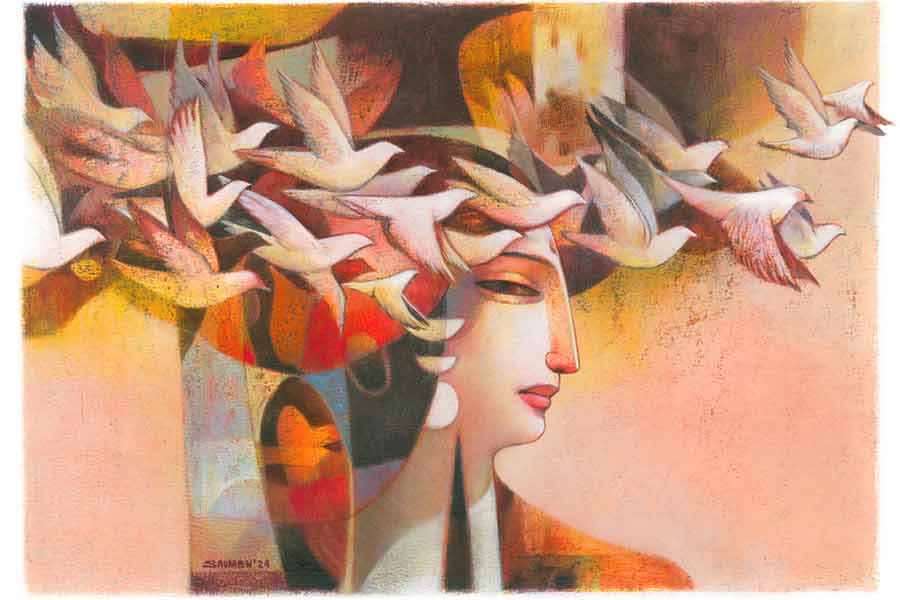

 
 <h1 align=center>পার্টি</h1>
<h2 align=center>নন্দিতা বাগচী</h2> 

অফিস থেকে ফিরতে বড় দেরি হয়ে গেল আজ। চিংড়িঘাটার জ্যামটাই ডুবিয়ে দিল পিয়াকে। অফিস যাওয়া-আসার পথের এই জ্যামটার কথা কলকাতাবাসীরা সবাই জানেন। পিয়ার বাবা বলেন, “এমন জ্যাম আগে নাকি ছিল স্ট্র্যান্ড রোডে।” এমন স্ট্র্যান্ড্রেড হয়ে যেতেন তাঁরা যে, প্রায়ই ট্রেন মিস হয়ে যেত। যেমন আজ বেদিকার দেওয়া পার্টিটা প্রায় মিস হয়ে যাওয়ার জোগাড় পিয়ার।

মুকুন্দপুরের আবাসনে পৌঁছে কোনও রকমে গাড়িটা পার্কিংয়ে রাখল পিয়া। তার পর ছুটল লিফ্টের দিকে। কিন্তু গেটম্যান তপন এসে বাগড়া দিল। বলল, “ম্যাডাম, গাড়িটা ঠিক করে পার্ক করতে হবে। ফ্রন্ট হুইলটা বেঁকে আছে। আপনার পাশের স্লটটা সহায় সাহেবের। উনি গাড়িটা ঢোকাতে পারবেন না।”

পিয়া দাঁত খিঁচিয়ে বলল, “আমি আধঘণ্টা পরেই বেরোব আবার। তোমার সহায় সাহেব কি আধঘণ্টার মধ্যেই এসে যাবেন?”

তপন অসহায় ভাবে বলল, “সহায় সাহেবের আসার সময় হয়ে গেছে ম্যাডাম। যে কোনও মুহূর্তে উনি এসে যাবেন। খুব বদমেজাজি লোক, এসেই সবচেয়ে বেশি মেজাজ দেখাবেন আমার উপরে।”

তাই পিয়াকে আবার উজিয়ে গিয়ে গাড়িটাকে ঠিক করে পার্ক করতে হল। লিফ্টের সামনে গিয়ে দেখল মান্থলি সার্ভিসিং চলছে। মেনটেনেন্স কোম্পানির এক জন মেকানিক বলল, “আরও মিনিট দশেক সময় লাগবে ম্যাডাম। একটু অপেক্ষা করতে হবে।”

‘অপেক্ষার নিকুচি করেছে!’ মনটা বিদ্রোহ করে পিয়ার। তার পর তাকিয়ে দেখে, তেরো তলার পিল্লাইদের কাজের লোক খালি গারবেজ বিনটা হাতে নিয়ে সার্ভিস লিফ্টের দিকে যাচ্ছে। তার পিছন পিছন সেই ছোট্ট লিফ্টেই গিয়ে
ঢুকে পড়ল পিয়া। তার অ্যাপার্টমেন্ট সাত তলায়।

অফিসের কাপড়জামা ছেড়ে বাথরুমে গিয়ে চট করে ফ্রেশ হয়ে নিল পিয়া। অন্তর্বাস পরে ওয়ার্ডরোবটার সামনে দাঁড়িয়ে ভাবতে লাগল, কোন ড্রেসটা পরবে। আসলে ড্রেসকোড কিছু বলে দেয়নি বেদিকা। জেনারেল কোনও পার্টি হলে রঙের কথা ভাবতে হয় না। পার্টিতে সাধারণত কালো ড্রেস পরতে পছন্দ করে পিয়া। নানা রকমের কালো ড্রেস আছে তার। লং, মিডিয়াম, শর্ট লেংথের। কোনওটা ব্রোকেডের, কোনওটা স্যাটিনের, কোনওটা জর্জেটের, কোনওটা লেসের। কিন্তু আজ যদি কালো রঙের ড্রেস পরে, তবে ফিউনারেলের মতো লাগবে না তো? তবে কি লাল টুকটুকে শিফনের গাউনটা পরবে? বেদিকাকে চিয়ার আপ করতেই তো যাচ্ছে ওরা। লাল ছাড়া আর কোনও রঙে তো সে উষ্ণতা নেই। ভাবে পিয়া। উঁহু, বড় বেশি লাউড হয়ে যাবে রংটা।

একটা হালকা হলুদ রঙের অরগ্যাঞ্জা ড্রেসের উপরে হাত বুলিয়েও রেখে দিল সেটা। দিনের আলো ছাড়া ভাল দেখাবে না ওটা। তার চাইতে মাঝারি ঝুলের নীল রঙের ডেনিম ড্রেসটাই উপযুক্ত হবে আজ সন্ধ্যার জন্য। বেশ ক্যাজুয়াল, ভাবল পিয়া।

আর একটা চিন্তাও যাচ্ছে না তার মাথা থেকে। একটা ফাইভ স্টার হোটেলে পার্টি দিচ্ছে বেদিকা, খালি হাতে যেতে কি ভাল লাগে! যদিও সে বার বার বলে দিয়েছে যে, “প্লিজ় ডোন্ট ব্রিং এনি গিফ্ট!” তবুও। বেদিকার প্রিয় পানীয়ের একটা দামি বোতল নিয়ে যাওয়ার ইচ্ছে ছিল পিয়ার। কিন্তু খোঁজ নিয়ে জানা গেল, হোটেল কর্তৃপক্ষ কোনও পানীয়ের বোতল ভিতরে নিয়ে যেতে দেবেন না। সত্যিই তো, ওঁদের ব্যবসার
ক্ষতি হবে তো তা হলে। মার্কেটিং আর স্ট্র্যাটেজি গুলে খাওয়া পিয়ার টনক নড়ে।

কার্ড দেওয়া আজকাল সেকেলে ব্যাপার। অথচ পিয়ার ছোটবেলায় একটা কার্ডের কত মূল্য ছিল! জন্মদিনে গুনে দেখত ক’টা কার্ড পেল। তার পর সেই কার্ডগুলো নিজের ঘরের দেওয়ালে, আলমারির দরজায়, বুক কেসের কাচে সেলোটেপ দিয়ে সেঁটে রাখত পরের জন্মদিন অবধি। ফুল নেওয়ার কথাও ভেবেছিল পিয়া। একগোছা গোলাপ মানুষের মনের অনেক অনুভূতির কথা বলে দিতে পারে। পিয়ার বাবা-মায়ের ম্যারেজ অ্যানিভার্সারিতে অবশ্য রজনীগন্ধা দিতেন তাঁদের বন্ধুরা। কিন্তু আজ যদি হাজার তিনেক টাকা দিয়ে কিছু ব্যাঙ্গালোর গোলাপ নিয়ে যায় পিয়া, বেদিকা কি খুশি হবে? হয়তো বোকেটা পড়েই থাকবে হোটেলের টেবিলে। তা ছাড়া ওই
মস্ত হোটেলটির লবিতেই তো লাখ টাকার উপর ফুল সাজানো থাকে। পিয়ার নিয়ে যাওয়া গোলাপগুলোর কোনও গুরুত্বই থাকবে না। না, ফুল নেবে না পিয়া।

ওয়ার্ডরোবের ড্রয়ার দুটো হাতড়ে দেখতে লাগল পিয়া। কোথাও বেড়াতে গিয়ে কিছু ভাল লাগলে কিনে এনে রেখে দেয় সে। কাউকে হঠাৎ উপহার দেওয়ার প্রয়োজন হলে সেখান থেকেই নিয়ে গিফ্ট ব্যাগে ভরে দিয়ে দেয়। তাই গিফ্ট ব্যাগও বেশি করে কিনে রাখা থাকে। সে বার রাজস্থানের জয়পুরে গিয়ে বেশ কিছু বিডসের মালা নিয়ে এসেছিল। সবুজ জ়েড, লাল রুবি, বেগুনি অ্যামিথিস্টের মাঝে নীলরঙা খুদে খুদে স্যাফায়ারের সাতনরি চোকারটা পছন্দ হল পিয়ার। চোকারটার মাঝখানে আর দু’পাশে তিনটে রুপোর চাকতি। সূক্ষ্ম খোদাই করা। পিছনে ম্যাচিং ট্যাসেল।

কোথাও একটা পড়েছিল পিয়া, নীল রং হল মুক্তির রং। অসীম নীল আকাশ আর মুক্ত বাতাসের সঙ্গে সম্পর্ক যার। অর্থাৎ অসংখ্য সম্ভাবনা আছে যে রঙে। শান্তি এবং মৈত্রীর প্রতীকও বলা যায় তাকে। তাই এটাই হবে উপযুক্ত উপহার।

ঝটপট একটা নীল রঙের টিস্যু পেপার দিয়ে জড়িয়ে গিফ্ট ব্যাগের ভিতরে চোকারটা রেখে দিল পিয়া। প্রাইস ট্যাগে লেখা দামটা কালো মার্কার দিয়ে কেটে দিল। মনে মনে একটা হিসাবও কষে নিল। ফাইভ স্টার হোটেলটার বুফে ডিনারের খরচা জনপ্রতি দু’হাজারের কাছাকাছি হলেও যথেচ্ছ পানীয়ের ব্যবস্থা থাকবে। অর্থাৎ জনপ্রতি হাজার তিনেক তো পড়বেই। আর এই কুচি কুচি স্যাফায়ার বসানো চোকারটার দাম সাড়ে পাঁচ হাজার টাকা। একটু বেশি-ই হয়ে গেল হয়তো। তবে পিয়া দেওয়া আর নেওয়ার মধ্যে ভারসাম্য রাখা পছন্দ করে না। দেওয়ার পাল্লাটা একটু ভারী থাকলে মাথাটা উঁচু থাকে।

ছোটবেলায় দেখেছে পিয়া, কোনও আত্মীয়ের বিয়েতে গিয়ে প্রায় সপ্তাহ খানেক থেকে আসত ওরা। বাবা, মা, পিয়া ও ছোট বোন টিয়া। বাবার সীমিত আয়ে হয়তো একটা মুর্শিদাবাদ সিল্কের শাড়ি নয়তো হালকা ওজনের একটা সোনার আংটি উপহার হিসেবে দিতেন। আত্মীয়রা বাবা-মায়ের অনুপস্থিতিতে হাসাহাসি করতেন। পিয়া বুঝতে পারত। কিন্তু ওঁরা বুঝতে পারতেন না যে, পিয়া সে সব কথা বুঝতে পারে।

কার পার্কিংয়ে নেমে এসেছে পিয়া। পরনে ব্লু ডেনিমের একটা এ-লাইন ড্রেস। পায়ে কালো হাই হিল স্যান্ডাল। কাঁধে বড়সড় একটা কালো টোট ব্যাগ। বয়কাট চুল। ডান হাতের কব্জিতে একটা স্করপিয়নের ট্যাটু। এটা ওর জোডিয়াক সাইন। ন্যুড মেক আপ, হালকা লিপস্টিক। দু’কানে দুটো সলিটেয়ার হিরে।

লিফ্ট সার্ভিসিং হয়ে গেছে। মিস্টার সহায়ও এসে পার্ক করে ফেলেছেন তাঁর গাড়ি। পিয়াকে দেখেই দৌড়ে এল তপন। ট্র্যাফিক পুলিশের মতো নির্দেশ দিতে লাগল তাকে। পিয়ার হাসি পায়। ও মেয়ে বলে হয়তো তপন ভরসা করতে পারে না। নাকি সহায় সাহেবের গাড়িতে আঁচড় কেটে যাওয়ার ভয়ে?

গাড়ি বাইপাসে পড়তে না পড়তেই মায়ের ফোন, “কী রে, তুই বাড়ি ফিরেছিস?”

“অনেক ক্ষণ।”

“তা হলে ফোন করিসনি কেন?”

“খুব তাড়া ছিল মা।”

“কিসের এত তাড়া তোর? না আছে স্বামী, না আছে সংসার, না আছে ছেলেপুলে।”

“ও সব ছাড়াও অনেক বড় বড় কাজ থাকে মা। একটা মস্ত অফিসের স্টাফদের সামলাতে হয়। সারা দুনিয়ার ক্লায়েন্টদের সঙ্গে যোগাযোগ করতে হয়। তবে এখন একটা
পার্টিতে যাচ্ছি।”

“তা হলে তো তুই গাড়ি চালাচ্ছিস। ফোনটা কেটে দেব?”

“না না, কেটো না, কথা বলো। কানে গয়না পরা আছে। অসুবিধে নেই।”

“ওই টিয়ার কথা বলছিলাম।”

“তার আবার কী হল? দিব্যি তো দেবা-দেবী দু’জনে মিলে চার হাত ভরে রোজগার করছে।”

“আরে, পয়সাটাই কি সব?”

“তবে আর কী চাও তুমি? আমি বিয়ে করলাম না বলে ধরেবেঁধে বিয়ে দিয়ে দিলে টিয়াকে। অয়নের সঙ্গে সুখে ঘর করছে সে। আর কী চাও বলো তো?”

“আরে, বিয়ের যে সাত বছর পূর্ণ হয়ে গেল!”

“তাতে কী হল? পার্টি দাও! সাত বছর ধরে সুখে ঘর করছে তোমার মেয়ে। ইয়ার্কি নাকি!”

“হ্যাঁ, পার্টি তো দিতেই ইচ্ছে করে, তবে অন্য রকম পার্টি।”

“মানে?”

“আরে, অন্নপ্রাশনের পার্টি।”

“সেটা ওদের ব্যাপার। আমাকে কেন বলছ এ সব?”

“ওদের বলে বলে তো হয়রান হয়ে গেলাম রে! এখন আত্মীয়স্বজনরা বলাবলি করছে।”

“টু হেল উইথ ইয়োর আত্মীয়স্বজন! চিরটা কাল এই করেই কাটালে। তাঁরা কি তোমাদের খোঁজ-খবর নেন? টাকাপয়সা দিয়ে সাহায্য করেন? তবে তাঁরা কী বললেন
না বললেন, তা নিয়ে এত মাথাব্যথা কেন তোমার?”

এক নাগাড়ে গজগজ করে যায় পিয়া, “বড় মেয়ের চল্লিশ বছর বয়স হয়ে গেল, বিয়ে করল না। ছোট মেয়ের ছত্রিশ বছর বয়েস হয়ে গেল, বাচ্চা হল না। এ ছাড়া কি অন্য কোনও টপিক নেই ওঁদের?”

পিয়াকে শান্ত করার জন্য প্রসঙ্গ বদলান তার মা। হেসে বলেন, “যাক্ গে, ও সব কথা ছেড়ে দে। কোথায় যাচ্ছিস পার্টিতে?”

তিতকুটে মুখে পিয়া জবাব দেয়, “বাইপাসের ওই বড় হোটেলটায়। যেখানে গত বছর তোমার আর বাবার ম্যারেজ অ্যানিভার্সারিতে
পার্টি দিয়েছিলাম।”

“তাই? তা কিসের পার্টি? কার ম্যারেজ অ্যানিভার্সারি?”

সত্যি কথাটা বলার জন্য মুখটা চুলবুল করে ওঠে পিয়ার। কিন্তু তখনই আর একটা ফোন এসে যায়। তাই মাকে বলে, “পরে কথা বলছি মা, একটা জরুরি ফোন এসে গেছে।”

হ্যাঁ, যা ভেবেছে। বেদিকার ফোন। সে হইহই করে উঠল, “আরে ইয়ার, তুম হো কাঁহা? সব ইন্তেজ়ার কর রহেঁ হ্যাঁয় তুমহারে লিয়ে।”

পিয়া বলল, “ব্যস পঁওছ হি গয়ে। ড্রাইভওয়ে মে হুঁ। ভ্যালে আ গয়া পার্কিং কে লিয়ে।”

ঝটপট ভ্যালের হাতে চাবিটা দিয়ে দ্রুত পায়ে লিফ্টের দিকে এগিয়ে গেল পিয়া।

তিনটে টেবিল জোড়া দিয়ে ওদের কুড়ি-বাইশ জনের বসার ব্যবস্থা করে দিয়েছেন রেস্তরাঁ ম্যানেজার। পিয়া পৌঁছনোর পরই দুটো শ্যাম্পেনের বোতল চলে এল বরফভরা বালতিতে কাত হয়ে শুয়ে। আয়ুষ আর সমিধ এগিয়ে এসে বলল, “তোমরা উইকার সেক্স, গায়ে জোর কম। আমরা ঝাঁকিয়ে দিচ্ছি বোতল দুটো।”

“অবজেকশন! অবজেকশন!” বলে চেঁচিয়ে উঠল বেদিকা। সমিধের হাত থেকে বোতলটা নিয়ে জোরে জোরে ঝাঁকাতে লাগল সে। কী সুন্দর যে লাগছে তাকে আজ। ফুশিয়া রঙের একটা স্ট্র্যাপলেস গাউন পরেছে। গাউনটায় ঊরু অবধি লম্বা স্লিট। কানে ঝিকমিক করছে লম্বা হিরের দুল। বার্গান্ডি রঙে রাঙানো চুলটাকে চুড়ো করে বাঁধা। একটা অদ্ভুত দ্যুতি আর প্রত্যয়ে ঝলমল করছে সে।

তার পরই শ্যাম্পেনের ফোয়ারা ছুটল। ওরা সবাই বেদিকাকে জড়িয়ে ধরে, গালে গাল লাগিয়ে তার
মুক্ত জীবনের জন্য শুভেচ্ছা আর অভিনন্দন জানাল। বলল, “ওয়েলকাম টু আওয়ার ডেন।”

হ্যাঁ, ওরা সকলেই হয় অবিবাহিত, নয় তো বিবাহবিচ্ছিন্ন। অর্থাৎ, একক জীবন যাপন করে। মুক্ত বিহঙ্গের মতো উড়ে বেড়ায়, যেখানে ইচ্ছে যায়, যা মন চায় করে, কোথাও কোনও প্রতিবন্ধকতা নেই। সমাজ বা আত্মীয়স্বজনের তোয়াক্কা করে না। ওদের মূল্যবোধ হল, জীবন একটাই, তাকে উপভোগ করো নিজের মতো।

বেদিকার ডিভোর্স হয়েছে গতকাল। আজ তারই উদ্‌যাপন।

স্বামী-স্ত্রী, সন্তান, সংসার, আত্মীয়স্বজন নিয়ে থাকা পিয়ার মায়ের পৃথিবী থেকে এই পৃথিবীর দূরত্ব অঙ্কের হিসেবে বেশি নয়, কিন্তু মানসিকতার হিসেবে লক্ষ যোজন।

