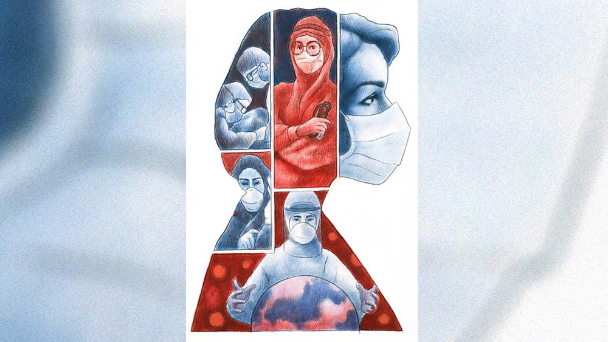

 
 <h1 align=center>পার্শ্বচরিত্রে করোনা</h1>
<h2 align=center>সঞ্জীব চৌধুরী</h2> রঞ্জনের বিশ্বাসটা হাত থেকে চায়ের কাপ পড়ে যাওয়ার মতো চুরমার হয়ে গেল। এত দিন কারও করোনার খবর এলে ধরেই নিত, ওর হবে না। শেষে কিনা ব্রেকিং নিউজ়ে নিজেই! ফোনে ফোনে রটে গেল, “শুনেছিস? রঞ্জন পজ়িটিভ!”

প্রথম দু’দিন গা ম্যাজম্যাজ। তখনও প্যারাসিটামলে অগাধ আস্থা। একে একে জলপটি-জ্বর, হেঁপো-কাশি, অনর্গল সর্দি, গন্ধ উধাও। প্রচারের ঠেলায় উপসর্গগুলো মুখস্থ। আতঙ্কে রঞ্জন নাকে মুখে কাঠি গুঁজিয়ে পরীক্ষা দিয়ে এল। আটচল্লিশ ঘণ্টা উত্তেজনার পর তিন-পাত্তির তাস দেখার মতো রিপোর্টে ‘পজ়িটিভ’ দেখেই ফ্যামিলির যে যেখানে পারল, সোশ্যাল ডিস্ট্যান্সে অদৃশ্য হল। পোষা মিনিটাও। ছাদের চিলেকোঠা‍য় রঞ্জন আইসোলেশনে, একা। ফ্যামিলি ফিজ়িশিয়ান, পাড়ার ডাক্তার, ফার্মেসির কম্পাউন্ডার কেউ ফোন ধরল না। চৌকাঠের বাইরে স্ত্রীর রেখে যাওয়া মুড়ির টিন, জলের বোতল, বাসক সিরাপের শিশিগুলো দেখে রঞ্জনের কান্না পেল। জ্বরটা বাড়ছে। তক্তপোষে শুয়ে হঠাৎ মনে হল, দেওয়ালের ফ্রেম থেকে পুলিশের উর্দি পরা অস্পষ্ট বাবা বলছেন, ‘আসামির কেউ আপন নয় রঞ্জু! ধরা যখন পড়েইছিস, জামিনের চেষ্টা কর। নইলে জেল। মৃত্যুদণ্ডও হতে পারে।’ কলেজ লাইফে বাবার এই উপদেশটা রঞ্জন বহু বার শুনেছে। বলতে চাইতেন, প্রতিকূল পরিস্থিতিতে হার না মেনে, ঘুরে দাঁড়ানোর চেষ্টাই শ্রেয়। কথাটা তখন পুলিশের প্রলাপ বলে মনে হলেও আজ যেন রঞ্জনকে একটা প্রচণ্ড ঝাঁকুনি দিল।

রঞ্জনের মেজ শালা সমবয়সি, সাদাসিধে। মাসের প্রথম শনিবার সন্ধেয় দু’জনে অফিস-পাড়ায় ইয়েতে বসে। সে দিন বাসে না উঠে, শেয়ার ট্যাক্সিতে বাড়ি ফেরে। রঞ্জন ফোন করল, “ভাই অখিল,এক্ষুনি বসুশ্রীর সামনে চলে এস। ক্রেডিট কার্ডটা নিয়ো। আমি ট্যাক্সি নিয়ে আসছি।”

অখিল উৎসাহিত, “কিন্তু লকডাউনে সব খোলাআছে তো?”

রঞ্জন তত ক্ষণে রাস্তায়। ট্যাক্সিওয়ালাকে বলল, “জলদি। হাসপাতালকা মামলা হ্যায়।”

*****

হাসপাতালের কম্পাউন্ডে অ্যাম্বুল্যান্সের জ্যাম। অ্যাডমিশন কাউন্টারে পেশেন্ট-পার্টি গিজগিজ করছে। সিকিয়োরিটি হিমশিম। মেঝেয়, সিঁড়িতে ঈশ্বরে বিশ্বাস হারানো মানুষ। রঞ্জন দেখল, সোজা রুটে চান্স নেই। বাবা বলেছেন, ‘হয় জামিন, নয় জেল। মৃত্যুদণ্ডও পসিব্‌ল।’ অ্যাডমিশনের পাশেই এমারজেন্সি। এক জন পেশেন্ট অ্যাডমিশনের অপেক্ষা করে এই মাত্র মর্গে চালান হল। খালি স্ট্রেচারটা মাটিতে পড়ে। রঞ্জন মেজ শালার কানে কানে বলল, “আমি জ্ঞান হারাচ্ছি, গুডবাই।”

মেজ শালা কিছু বোঝার আগেই আপাদমস্তক নীল পিপিইতে মোড়া কে বা কারা রঞ্জনকে তুলে নিয়ে নিরুদ্দেশ হয়ে গেল।

*****

রঞ্জন কত ক্ষণ বা কত দিন বেহুঁশ ছিল, বুঝতে পারল না। চোখ খুলতে দেখল, বিশাল হলঘরে জনা তিরিশ পেশেন্ট পর পর বেডে শুয়ে। কব্জি থেকে লতানে পাইপ ঝুলন্ত বোতলে ঢুকেছে। নাকে নাকে পাইপ গুঁজে অক্সিজেন সাপ্লাই। নিঃশ্বাস প্রশ্বাসের কোরাসে একটানা সোঁ সোঁ শব্দ। ভেন্টিলেটরের স্ক্রিনগুলোয় দুরন্ত গ্রাফ লাগাতার শাসাচ্ছে, এই বুঝি থেমে গেল! রঞ্জন আশ্বস্ত হল, ‘যাক্‌ অ্যাডমিশনটা তা হলে হয়েছে!’  

হলঘরটায় জানলা নেই। ফটফটে সাদা আলোয় দিন রাত বোঝা যায় না। সাই-ফাই ফিল্মের মতো আপাদমস্তক সাদা, নীল মোড়কে ডাক্তার, নার্সদের অবিরাম ব্যস্ততা। পুরুষ মহিলাও চেনার উপায় নেই। রঞ্জন কিছু ক্ষণ লক্ষ করে এক জন নার্সকে ইশারায় ডাকল, “আমি কোথায় আছি?”

অ্যাস্ট্রোনটের মতো কণ্ঠস্বরে উত্তর এল, “কোভিড আই-সি-ইউ। তিনশো তিন।”   

“আমার মেজ শালাকে একটা ফোন…”

নার্স তত ক্ষণে তিনশো সাতে। যুদ্ধোন্মাদ করোনার অদৃশ্য আক্রমণের প্রতিরোধে তাঁকে নিরন্তর অস্ত্র শানাতে হচ্ছে। অসতর্কতা মানেই মৃত্যুর আশঙ্কা। রঞ্জন বুঝল, এখানে মেজ শালার খোঁজ অবান্তর।  

ডাক্তার এলেন। রঞ্জনের বাঁ হাতের নাড়িটা চেপে বললেন, “এমার্জেন্সিতে খুব কষ্ট পাচ্ছিলেন। এখন কেমন?” 

রঞ্জন বলল, “শ্বাসকষ্টটা আর নেই স্যর।”      

“অক্সিজেন চলছে। ভয় পাবেন না। আমরা আছি।” 

রঞ্জনের মনে পড়ল, পরিচিত ডাক্তাররা কেউ ফোন ধরেননি। কম্পাউন্ডারও নয়। আর ইনি বলছেন, “ভয় পাবেন না। আমরা আছি।” ইমোশনটা ঢোঁক গিলে, “ডাক্তারবাবু, এখন দিন না রাত?”

ডাক্তার রঞ্জনের হাতটা ছেড়ে, “রাত তিনটে দশ। ঘুমোবার চেষ্টা করুন। পারলে, উপুড় হয়ে শুন।”  

ডাক্তার প্রেসক্রিপশন লিখে চলে যেতেই রঞ্জনের মনে হল, কোভিডের সব আতঙ্ক যেন উনি সঙ্গে নিয়ে গেলেন। ঘুমনোর চেষ্টায় সবে চোখ বন্ধ করেছে, বিশ্রী শব্দ করে ভেন্টিলেটরের অ্যালার্ম বেজে উঠল! সঙ্গে বিকট চিৎকার, “বাপি…আমি চল্লাম। গুড-বাই। মরার আগে বাবা হয়ে বলে যাচ্ছি, অশান্তি তোকে জীবনভর কুরে কুরে খাবে। তুইও বাবা, কথাটা মনে রাখিস। মরণ নিতে এসেছে আমাকে... তোর মায়ের কাছে যাচ্ছি। বাই।”

অক্সিজেনের ক্যানিউলাটা সামলে রঞ্জন ঘাড় উঁচু করে দেখল, চিৎকারটা ঠিক তার পাশেই। তিনশো চারের পেশেন্ট মাটিতে দাঁড়িয়ে কাঁপছে। অশীতিপর বৃদ্ধ, শীর্ণ, একমুখ সাদা দাড়ি, দু’চোখ কোটরগ্রস্ত। অক্সিজেনের পাইপ, ভেন্টিলেটরের প্রোব্‌স, স্যালাইনের বোতল ছত্রাকার। এক জন নার্স দৌড়ে এসে বৃদ্ধকে জাপ্টে ধরে বেডে শুইয়ে, ক্যানিউলাটা নাকে লাগাতে লাগাতে কপট তিরস্কার,  “আবার আপনি উঠেছেন? যদি পড়ে যেতেন? হাতের চ্যানেলটাও তো ছিঁড়ে ফেলেছেন। এরকম অস্থির হলে কিন্তু আবার হাত পা বেঁধে দেব।”

এক অনাত্মীয় নার্সের স্নেহের পরশে বৃদ্ধ শিশুর মতো কেঁদে উঠলেন, “কেন আমায় আটকে রেখেছিস মা? চলে যেতে দে লক্ষ্মীটি … এত দুঃখ আর সয় না। ছেড়ে দে …”

নার্স পেশেন্টের চ্যানেলে মাইক্রোপোর লাগিয়ে, “এত চেষ্টা করে আমরা আপনাকে সুস্থ করলাম দাদু! আপনি এ রকম বললে, আমাদের কি ভাল লাগে, বলুন?’

আই-সি-ইউ এখন শ্মশানের চেয়েও বিষণ্ণতর। সার সার মুমূর্ষু পেশেন্টের অসহায় চাহনির সামনে বৃদ্ধ কাঁদছেন আর বলছেন, “এত দুঃখ আর সয় না…” করোনার আতঙ্ক এখন ওঁর কাছে পরাজিত! মৃত্যুকে আবাহন করে, আপন সন্তানকে অভিশাপ দিয়ে, জীবনের হিসেব মিলিয়ে নিচ্ছেন। রঞ্জন চোখের উপর বালিশটা চাপা দিতেই, বাবার মুখখানা ভেসে উঠল। ও বুঝতেই পারেনি, সেও কাঁদছে। নার্স বৃদ্ধকে ঘুমের ইঞ্জেকশন দিয়ে, রঞ্জনকেও মাথায় হাত বুলিয়ে শান্ত করে গেল।

রঞ্জনের দিন রাতের হিসেব নেই। শারীরিক ভাবে অনেকটাই ভাল। মুশকিল হল, আই সি ইউতে বাথরুম ব্যাপারটাই নেই। পেশেন্টদের যাবতীয় কৃত্য বিছানায়। সর্বাঙ্গ সবুজ কাপড়ে মোড়া হাউসকিপিং নামক এক শ্রেণির কর্মচারী এই দায়িত্বটা সামলান। যে সব পেশেন্ট সজ্ঞানে নেই, তাঁদেরও সযত্নে পরিচ্ছন্ন রাখেন। রঞ্জনের সঙ্গে এর মধ্যেই বাসন্তীদির পরিচয় হয়ে গিয়েছে। মাঝবয়সি, খাটো, মোটা, হাউসকিপিংয়ের এই হিন্দিভাষী মহিলার এক মুহূর্তও ফুরসত নেই। ডাকলেই হাসি মুখে আশ্বাস, “একটু সবুর করো, এখুনি আসছি।” সে দিন বাসন্তীদি রঞ্জনের পাশের স্টুলটায় বসে একটুজিরিয়ে নিচ্ছিল। রঞ্জন জিজ্ঞেস করল, “তোমার বাড়িতে কে কে আছে বাসন্তীদি?”

উত্তরটা রঞ্জনের বুকে যেন বাঘের আঁচড় কেটে দিল। বাসন্তীদি আর তার মানুষটা মহারাষ্ট্রের সিরিডিতে দিনমজুরের কাজ করত। দেশ জুড়ে যখন ‘লকডাউন’, পরিযায়ী শ্রমিকদের ট্রেনে বাসন্তীদি একাই টিকিট পেল। কলকাতায় পা দিতেই খবর এল, তার মানুষটা কোভিডের জ্বরে ফুরিয়ে গিয়েছ, “এত পেশেন্ট সামলাচ্ছি দাদা, নিজের পেশেন্টটাকে শেষ দেখা দেখতে পেলাম না।” বাসন্তীদি হয়তো চোখের জল লুকনোর জন্যেই বলল, “যাই, তিনশো ছয় ডাকছে।”

আই-সি-ইউতে বেড নম্বরই পরিচয়। নাম,  গোত্র  অর্থহীন। ‘তিনশো সাতাশ’ রঞ্জনের ঠিক উল্টো দিকে, ঘড়ির নীচে। সময় দেখতে গেলেই ভদ্রলোকের দিকে চোখ পড়ে। চল্লিশের কোঠায়, অবস্থাটা ঘোরালো। গলায় রাইল্‌স টিউব দিয়ে খাবার যাচ্ছে। সেদিন সকাল থেকেই মাথাটা বারবার বুকের উপর ঝুঁকে পড়ছিল। নার্স সোজা করে বসিয়ে দিচ্ছিলেন। কিন্তু দুপুরের পর আর দরকার হল না। শরীরটা শক্ত হয়ে গেল। নতুন পেশেন্টের প্রস্তুতিতে দু’জন নার্স যখন ভদ্রলোকের ব্যক্তিগত জিনিসগুলো লিস্ট করছেন, রঞ্জন শুনছিল। ‘চশমা, গল্পের বই, ডায়েরি, পার্স… খবরের কাগজের কাটিং।’ রঞ্জন স্পষ্ট দেখল, কাটিংটা আই-পি-এল ম্যাচের ফিক্সচার। সামনেই খেলা শুরু হওয়ার কথা। ফিক্সচারে নিজের খেলা শেষের তারিখটা তো আর লেখা ছিল না! 

আই-সি-ইউতে সাত দিন থাকার পর ডাক্তার রাউন্ডে এসে রঞ্জনকে বললেন, “অক্সিজেন স্যাচুরেশন নর্মাল আছে। কাল আপনাকে হাই ডিপেন্ডেন্সি ইউনিটে পাঠাচ্ছি। ওখানেও এমার্জেন্সি সাপোর্ট আছে। ক’দিন দেখে, জেনারেল ওয়ার্ডে পাঠাব। তার পর ছুটি।”

*****

পরদিন এইচ-ডি-ইউ পাড়ায় এসেই রঞ্জনের মনে হল, প্ল্যানেটোরিয়াম থেকে শিয়ালদহ প্ল্যাটফর্মে ঢুকেছে। পেশেন্ট বেশির ভাগই মাড়োয়ারি। উচ্চৈঃস্বরে বাক্যালাপ। সঙ্গে মোবাইলে গান, ভিডিয়ো, গায়ত্রী মন্ত্র। খাবারের প্যাকেট, টিফিন ক্যারিয়ারে ঘর বোঝাই। শাকাহারী যুক্তিতে এঁদের ‘ঘর কা খানা’র বিশেষ বন্দোবস্ত। যখন হোম ডেলিভারি এল, মনে হল ষ্টেশনে ট্রেন ঢুকেছে। কার ডাব্বা কার সঙ্গে বদলে গেল, পাঁপড় আর আচারের ব্যাগটা কোথায় গেল, দইয়ের কটোরিটা সাম্‌হালকে… শোরগোল। এর পর শুরু হল, স্বজনের সঙ্গে সৌজন্যের খাদ্য বিতরণ। সঙ্গে রেসিপির ওয়ার্কশপ। ডাক্তার, নার্সদের অক্লান্ত পরিশ্রমে এঁদের সরব সুস্থতা যতটাই সুখকর ততটাই বিরক্তিকর পাশাপাশি অন্য পেশেন্টদের প্রতি এঁদের সম্পূর্ণ উদাসীনতা। রঞ্জন মেট্রনের কাছে শুনল, এঁরা মালিক পক্ষ। প্রতিবাদ অনর্থক। অতিষ্ঠ হয়ে লবিতে পায়চারি করতে বেরিয়ে দেখল, একজন বয়স্ক ভদ্রলোক দু’হাতে মুখ গুঁজে চেয়ারে বসে। রঞ্জনের মায়া হল। দু’-এক বার পাশ দিয়ে হেঁটেও ভদ্রলোকের নজর কাড়তে পারল না। শেষে যেচে আলাপ করে যা শুনল, সেটা দিয়ে একটা আস্ত উপন্যাস দাঁড়িয়ে যেতে পারে।

দেবব্রতবাবুর ক’দিন ধরেই কাশি, জ্বর ছিল। পয়লা বৈশাখের দিন দুপুরে হাঁপ ওঠে। বাড়িতে উনি আর স্ত্রী রমলা। ছেলে মেয়ে বিদেশে। করোনার ভয়ে দেবব্রতবাবু স্ত্রীকে কিছুতেই সঙ্গে নেননি। একাই হাসপাতালে এসে ভর্তি হলেন। আই-সি-ইউতে প্রথম চার দিন জ্ঞান ছিল না। একটু সামলে উঠতেই রমলার খবরের জন্য আকুল হলেন। কোভিড আই-সি-ইউতে পৃথিবীর সঙ্গে যোগাযোগ বিচ্ছিন্ন। সন্ধেবেলা সিকিয়োরিটি একটা মোবাইল নিয়ে পেশেন্ট প্রতি তিন মিনিট সময় দেয়। লাইন না পেলে, পরের সন্ধের অপেক্ষা। দেবব্রতবাবু দু’দিন চেষ্টা করেও বাড়ির ফোনটা কেউ ধরল না। মনে আশঙ্কার ধোঁয়া ঘনীভূত হচ্ছে। পরদিন দুপুরে এক জন ওয়ার্ড-বয় এসে দেবব্রতবাবুর ঘুম ভাঙিয়ে বলল, “রমলা চ্যাটার্জি আপনার কেউ হন?”

দেবব্রতবাবু আঁতকে ওঠেন, “হ্যাঁ, হ্যাঁ।”

“কোভিড জেনরাল ওয়ার্ডের পেশেন্ট, আপনার খোঁজকরছিল। আপনার টাক দেখেই আইডিয়া করিচি।”  

দেবব্রতবাবুর শ্বাসকষ্টটা যেন হঠাৎ ফিরে এল। বললেন, “সে কী! রমলা? এখানে? কোথায়? কবে? কেমন আছে?”

ওয়ার্ড-বয় বলল, “এমার্জেন্সি থেকে পেশেন্টকে ওয়ার্ডে নিয়ে গিয়েছিলাম, পাঁচ-ছ’দিন তো হবেই।”

ভদ্রলোক রঞ্জনের হাতদুটো ধরে বললেন, “ভাবতে পারছেন মশাই! আজ আট দিন হল, একই হাসপাতালে দু’জনে শুয়ে আছি। কোনও যোগাযোগ নেই। এঁরা অবশ্য বলছেন, ভাল আছে, কিন্তু…”

রঞ্জন বলল, “আপনার ডিসচার্জ কবে?”

দেবব্রতবাবু কেঁদে ফেললেন। বললেন, “ডাক্তারবাবুকে বলেছি, রমলা না ফিরলে, আমিও ফিরব না।”

এর মধ্যে একটা কাণ্ড ঘটল। এক বয়স্কা মাড়োয়ারি মহিলার ছুটি হয়েছে। ওয়ার্ড-বয় হুইল চেয়ার নিয়ে দাঁড়িয়ে। মহিলা জেদ ধরেছেন, ওঁর ‘বড়া বটল’ খুঁজে না পেলে বাড়িই যাবেন না। নার্স, হাউসকিপিং যেখানে যত জলের বোতল, ওষুধের বোতল, ইউরিনের বোতল এনে ওঁর ‘বড়া বটল’ শনাক্ত করার চেষ্টা করছে কিন্তু কোনওটাই মিলছে না। শেষে মেট্রন অরুণাদির উপস্থিত বুদ্ধিতে রহস্যোদ্ঘাটন হল। অরুণাদি একটা আস্ত অক্সিজেন সিলিন্ডার টেনে নিয়ে এসে বললেন, “ইয়ে বহুত ভারী বোলকে লরিমে আপকা বাড়ি অলরেডি ভেজ দিয়া।”

মহিলা খুব খুশি। বললেন, “বহোত আচ্ছা। ইস্‌সে বঢ়িয়া নিদ হোতা হ্যায়।’ 

*****

রঞ্জন এইচ-ডি-ইউয়ের কোলাহল থেকে যেন পালিয়ে বাঁচল। জেনারেল ওয়ার্ডে টুইন শেয়ার রুম। ঘরে ঢুকেই দেখল, রুমমেট বেডের ওপর যোগব্যায়ামে ব্যস্ত। শরীরের গ্র্যাভিটিকে গোড়ালির লাইনে রেখে, চোখ বুজে, শ্বাস-প্রশ্বাসের কসরত চলছে। পাক্কা আধ ঘণ্টা পর রঞ্জন নমস্কার জানানোর সুযোগ পেল। প্রথম আলাপেই বিশুদা জানালেন, বয়স বাহাত্তর। বাড়ি খিদিরপুর। সরকারি পেনশন সামান্য হলেও পুরো মেডিক্যাল ফেসিলিটি। রঞ্জন অসুখটা কী জিজ্ঞেস করায় বললেন, “যখন এসেছিলুম, জ্বরজ্বর ছিল। তার পর থেকে টেস্টিংয়েই আছি। এক্স রে, এম আর আই, সি টি সি, এ টু জেড। রোগটা কী, ডাক্তারও শিওর নয়!” বলেই বাঁধানো দাঁতে হাসি।

এত দিন পর বিশুদার সঙ্গ রঞ্জনের বেশ লাগছে। বিকেলের চা আসতেই রঞ্জনকে চানাচুরের কৌটোটা অফার করে বিশুদা বললেন, “আপনাকে রিলায়েব্‌ল বলেই মনে হচ্ছে। ফ্যাক্টটা বলি। আমার তিন কুলে কেউ নেই। আনম্যারেড। সম্পর্কে ভাগ্নিজামাই প্রপার্টির লোভে খবর টবর নেয়। সেই ঢুকিয়ে দিয়ে গেছে। ফর্মে নাকি লিখেছে, আমি ওর বাপ। আমার বয়েই গেছে ওর বাপ হতে। এখানে টেইম টেইম খাচ্ছি দাচ্ছি, তোফা আছি। হাত পুড়িয়ে তো আর রাঁধতে হচ্ছে না! মোবাইলটা পর্যন্ত খুলিনি। পাছে পাড়ার লোকে পাঁচ কান করে।”

রঞ্জন নিজের ফোন নম্বরটা দিয়ে বলল, “মোবাইলটা চালু করলে জানাবেন, যোগাযোগ রাখব।”

বিশুদা হেসে, “আমি তো আছিই। ভিজ়িটিং আওয়ার্সে এক দিন চলে আসুন না। বাওয়েল মুভমেন্টের ব্যায়ামগুলো দেখিয়ে দোব। খুব উবগার পাবেন।”

রঞ্জন কথাটা শুনে কয়েক মুহূর্ত ভাবল। এই হাসপাতাল থেকে কারও নিজের ঘরে আর ফেরাই হল না, কেউ ফেরার জন্য প্রহর গুনছে, আবার কেউ এখানেই স্থায়ী সুখের সন্ধান পাচ্ছে। মানুষের মন কী বিচিত্র! 

*****

ডিসচার্জের সময় মেজ শালাই ছিল। বিল মিটিয়ে বেরোতে বেরোতে রাত ন’টা। ট্যাক্সি হাসপাতালের গেট পেরিয়ে ফাঁকা রাস্তায় স্পিড দিয়েছে। সামনে ন্যাশনাল লাইব্রেরিরগেটে আলো জ্বলছে। মেজ শালা প্রশ্ন করল,  “অ্যাদ্দিন পর বাইরে বেরিয়ে কেমন লাগছে?”

পৃথিবীর খোলা হাওয়া হু হু করে রঞ্জনের চোখে মুখে। জোরে একটা নিঃশ্বাস নিয়ে বলল, “মনে হচ্ছে, অ্যাকাডেমিতে নাটক দেখে ফিরছি।”

মেজ শালা হেসে, “মুখ্য চরিত্রে করোনা?”

রঞ্জন এক মিনিট ভেবে বলল, “ঠিক উল্টো। হাসপাতালের বাইরে যারা করোনার আতঙ্কে প্রতিনিয়ত মৃত্যুভয়ে মরছে, তাদের কাছে করোনা মুখ্য চরিত্র হতে পারে। কিন্তু হাসপাতালের ভিতরে যে সব ডাক্তার, নার্স, হাউসকিপিং স্টাফ নিজের জীবনের তোয়াক্কা না করে অন্যের জীবন ফিরিয়ে দিচ্ছে, যে সব পেশেন্ট মৃত্যুর সামনে বুক চিতিয়ে জীবনের শেষ হিসেবটুকু মিলিয়ে নেওয়ার সাহস দেখাচ্ছে, তারা প্রত্যেকেই নাটকের মুখ্য চরিত্র। বরং করোনাই যেন পার্শ্বচরিত্রে, একা!”