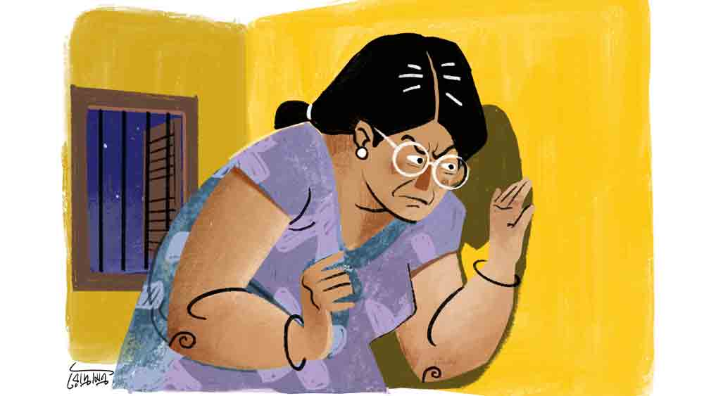

 

<h1 align=center>Short story: পাশের ঘরের ভাড়াটে</h1>
<h2 align=center>ছন্দা বিশ্বাস</h2>
নম্রতার এক নতুন অশান্তি শুরু হয়েছে। রাতের ঘুম ছুটে গেছে রীতিমতো। কথাগুলো যে কাউকে বলে একটু হালকা হবেন, তারও জো নেই। কে আবার কী ভাবে নেবে কথাটাকে! তার উপরে নম্রতা বিধবা মানুষ। স্বামীর অকালমৃত্যু তাঁকে বিপর্যস্ত করে দিয়ে গেছে। আস্তে আস্তে তিনি সমে ফিরছেন একমাত্র মেয়ের কথা ভেবে।   কিছু দিন হল পাশের ফ্ল্যাটের নতুন লোকটাকে নিয়ে মহা ঝামেলায় পড়েছেন। তাঁর এবং লোকটার বেডরুম এক দেওয়ালের ব্যবধান। এ ঘরে হাঁচলে দিলে ও ঘর থেকে স্পষ্ট শোনা যায়। মাস পাঁচ-ছয় হল তিনি ভাড়া এসেছেন। সুদর্শন চেহারা, কথাবার্তা বলেন বেশ গুছিয়ে। একাই থাকেন। বিবাহিত না চিরকুমার বোঝা যায় না। ছেলেদের আর কবেই বা বোঝা গেছে। ওঁর ঘরে তেমন কাউকে আসতে দেখা যায় না। নম্রতা লক্ষ করেছে, প্রায় সারা রাতই লোকটার ঘরে আলো জ্বলে। কাচের জানলা দিয়ে আলো এসে পড়ে। ভোর চারটে নাগাদ হয়তো উনি ঘুমোতে যান। দিনের বেলা তাঁর টিকিটি দেখা যায় না। দুপুর দুটো-আড়াইটে নাগাদ হোম ডেলিভারির একটি ছেলে এসে খাবার দিয়ে যায়। তখন ডোরবেল বাজার আওয়াজ পেলে নম্রতা আইহোল দিয়ে উঁকি মেরে দেখে নেন কে এল। ঠিক রাত দশটার সময় আবার অন্য একটি ছেলে খাবার নিয়ে আসে।   ভদ্রলোক প্রয়োজন না পড়লে কারও সঙ্গে কথাবার্তা বলেন না। নিজের ভিতরেই যেন মগ্ন থাকেন।   কিন্তু গত কয়েক দিন হল নম্রতা লক্ষ করছে, ভদ্রলোক গভীর রাতে বেশ চাপা গলায় কার সঙ্গে যেন কথা বলেন। নম্রতা ওঁদের বেডরুমের জানলার পাশে দাঁড়িয়ে শুনেছেন। কথাগুলো শুনে গায়ের রোমকূপ খাড়া হয়ে গেছে।   গত পরশু রাত তখন প্রায় দুটো, তখন নিজের কানে শুনতে পেলেন, ভদ্রলোক কাকে যেন বলছেন, “আমার তিন জনকে মার্ডার করার কথা তো, আমি ঠিক বুঝে নেব। আগে ছুপাকে বলো, ও যেন ওর দায়িত্বটা ঠিকমতো পালন করে। ও কি বলেছে দুবাই এর লোকটাকে আগে শেষ করতে হবে? না হলে টাইম ম্যাচ করবে না?”   সামান্য কয়েক সেকেন্ডের নীরবতা ভেঙে উনি ফিসফিস করে বলেন, “আর তার পরে ইয়াঙ্গনে পৌঁছে বাকি দু’জনকে। কোথায় কী ভাবে অপারেশন হবে সেই ব্যাপারে কিছু ইঙ্গিত দিয়েছ কি?... হ্যালো? হ্যালো? শুনতে পাচ্ছ? এই লাইনটা না খুব বিরক্তিকর, কথা কেটে কেটে যাচ্ছে। রিপিট করো, কী? ব্যাংককে গিয়ে অপারেশনটা তা হলে কখন করতে হবে?... খুব সাবধানে, কাকপক্ষীও যেন টের না পায়। শোনো পরিষ্কার করে বলছি, আমি সামনের মাসে আমেরিকায় একটা কাজে যাচ্ছি। তখন মিস্টার র‌্যান্ডির সঙ্গে আমার দেখা করার কথা। তার পর ব্যাংকক, হোটেল মেপল গার্ডেনে, তাই তো?... কী বললে, মার্ডার করে সোজা শিলিগুড়ি চলে আসতে হবে? তার পর ইস্ট সিকিমের একটা গ্রামে গিয়ে গা ঢাকা দেওয়ার ব্যবস্থা? ঠিক আছে, ঠিক আছে, বুঝতে পেরেছি।”   নম্রতা উৎকর্ণ হয়ে শুনেছেন কথাগুলো। সারা রাত ঘুমোতে পারেননি। দিনের বেলা একের পর এক বাংলা সিরিয়াল দেখা মাথায় উঠেছে। কথাগুলো মনে পড়ছে আর পা দুটো থরথর করে কাঁপছে। কী করবে বুঝতে পারছেন না। পুলিশে খবর দেবেন কি? বোঝাই যাচ্ছে লোকটা এক জন পেশাদার খুনি। ইন্টারন্যাশনাল মার্ডারার। এই রকম এক জনের পাশে কি থাকা যায়?   নম্রতা যত ভাবছেন, ওঁর কান-মাথা গরম হয়ে যাচ্ছে। গতকালও শুনেছিল, কিন্তু ঠিকমতো বুঝতে পারেনি টিভির আওয়াজে। নম্রতা ভয়ে পাথরের মূর্তির মতো এক জায়গায় দাঁড়িয়ে আছেন। মেয়ে ঘুমোচ্ছে পাশের বিছানায়। ভাগ্যিস মেয়ে কিছু জানে না এ ব্যাপারে! শুনলে ও তো ভয়ে কাঁদতে শুরু করে দেবে। হয়তো চেঁচিয়ে লোক জড়ো করতে পারে, সকলকে বলেও দিতে পারে। তখন উল্টে ওঁদের প্রাণ নিয়েই টানাটানি পড়ে যাবে। পেশাদার খুনিদের বিন্দুমাত্র বিশ্বাস নেই।      রাত এগারোটার মধ্যেই মেয়ে ঘুমিয়ে পড়ে। তার পর ঘরের সমস্ত আলো নিভিয়ে দিয়ে নম্রতা আড়ি পাতা শুরু করেন।   নম্রতা আজ আবার শুনতে পাচ্ছেন লোকটার গলা, “দেখো, তুমি বলছ ঠিকই, তবে আমি একটু ভেবে নিয়ে তোমায় জানাচ্ছি। অপারেশনের আগে তো একটা ব্লু-প্রিন্ট করে নিতে হবে। বুঝতেই পারছ বিদেশে গিয়ে মার্ডার করাটা কতটা ঝুঁকির। পুলিশ গোয়েন্দারা সব তক্কে তক্কে আছে। তার উপরে ইন্টারপোলের চরেরা তো আছেই। আমাদের ‘র’ কিন্তু বসে নেই। ইজ়রায়েলের মোসাদের নাম শুনলে গায়ে কাঁটা দেয়। ওদের গুপ্তচররাও সমস্ত দেশে ছড়িয়ে। এরা তো আর হাত-পা গুটিয়ে বসে থাকবে না, সবার চোখ এড়িয়ে এই সব সেলেব্রিটিদের মার্ডার করে পালিয়ে আসা মুখের কথা নয়...”   না, আর এক মুহূর্ত সময় নষ্ট করলে ওঁকেই হয়তো বিপদের মুখে পড়তে হতে পারে। নম্রতা ডিসিশন নিয়েই ফেলেছেন।   একটুও দেরি না করে তিনি চুপিচুপি দূরের বেডরুমে গিয়ে খুব চাপা গলায় থানায় ফোন করে পুলিশকে গোটা ঘটনাটা জানালেন।   পুলিশ অফিসার বললেন, “আপনি ঠিক শুনেছেন তো?”   “আমি শুধু শুধু ভুল শুনব কেন স্যর? আজ আসুন, রাত বারোটার পরে কথাবার্তা শুরু হয়। মনে হয়, বিদেশে কারও সঙ্গে কথা বলে।”   “ঠিক আছে। দেখছি।”   সে রাতে, এগারোটা নাগাদ ছদ্মবেশে তিন জন পুলিশ আসেন। এক জন মহিলা পুলিশও ছিলেন তাঁদের ভিতরে। নম্রতার ঘরের দরজা ভেজানো ছিল। তাঁরা নম্রতার ঘরে ঢুকে অপেক্ষা করতে শুরু করেন। ড্রয়িংরুমে একটা মৃদু নীল আলো জ্বলছে। ঘড়ির কাঁটা ঠিক বারোটা ছুঁই-ছুঁই। হঠাৎ মোবাইল বেজে উঠল। সকলে গভীর উৎকণ্ঠা নিয়ে নম্রতার বেডরুমের জানলার সামনে 
দাঁড়িয়ে আছেন।   নম্রতা ইশারায় বলে দিলেন, কথা চলছে।      না, এক বিন্দু মিথ্যে বলেননি নম্রতা। ওঁরাও স্পষ্ট শুনতে পেলেন লোকটার কথাগুলো। যথেষ্ট সন্দেহজনক।   ফোনের ও প্রান্তে কেউ যেন তাঁকে নির্দেশ দিচ্ছে। এ প্রান্ত থেকে উনি সেই নির্দেশ মতো কাজ করবেন বলে জানিয়ে দিলেন।   বেশ কয়েক বার মার্ডার কথাটা শোনা গেল। আর থাকতে না পেরে মোবাইলের ভয়েস রেকর্ডার অন করলেন এক জন পুলিশ।   খানিক ক্ষণ কথাবার্তা শোনার পর পুলিশ অফিসার পাশের ফ্ল্যাটে গিয়ে ডোরবেল বাজালেন।   নম্রতা তৈরি হয়ে আছেন, এর পর কী ঘটে দেখার জন্যে। কৌতূহল মিশ্রিত ভয়ার্ত চাহনি।   এক মিনিট বাদে লোকটা দরজা খুলে জানতে চান, “আপনারা কারা? এত রাতে কী ব্যাপার?”   “আমরা পুলিশ। আপনার সঙ্গে একটু দরকার আছে।”   “পুলিশ?”   এক জন অফিসার তাঁর আই-কার্ড বার করে লোকটার চোখের 
সামনে ধরলেন।   লোকটা ভুরু কুঁচকে বলল, “কিন্তু এত রাতে আমার কাছে কী দরকারে এসেছেন, ঠিক বুঝতে পারছি না।”   “আমরা এখনই আপনার ঘর 
সার্চ করব।”   “আমার ঘর সার্চ করবেন? কিন্তু কেন?”   “আমাদের কাছে খবর আছে, আপনি...”      পুলিশ অফিসার এবং তার সাঙ্গোপাঙ্গরা ঘর, ব্যালকনি, আনাচকানাচ সব তন্নতন্ন করে খুঁজেও সন্দেহজনক কিছুই পেলেন না। শুধু দেখলেন, ঘরের ভিতরে অজস্র বই। লোকটার টেবিলে বই-খাতা সব ছড়ানো ছেটানো। আসবাবপত্র বলতে খাট এবং আলনা ছাড়া কিছু নেই।   অফিসার বললেন, “আপনি এত রাতে প্রতিদিন কার সঙ্গে কথা বলেন? কী কথা বলেন?”   “কেন বলুন তো? আমি কি আমার বন্ধুদের সঙ্গেও কথা বলতে পারব না? আপনারা অযথা আমায় হ্যারাস করছেন।”   “অযথা নয়, আপনি একটু আগেই এক জনের সঙ্গে কাউকে খুনের ছক কষছিলেন, সেটা অস্বীকার করতে পারেন? আমরা নিজে কানে শুনেছি এবং আপনার বয়ান রেকর্ড করা আছে। আপনি এক জন পেশাদার খুনি, সে বিষয়ে আর কোনও সন্দেহ নেই।”   “আমি পেশাদার খুনি? কী যা-তা বলছেন! আপনাদের মনে হয় কোথাও কিছু ভুল হচ্ছে।”   “না, আমাদের কিছুই ভুল হচ্ছে না। কেন, আপনি আজ রাতেও তো খুনের ছক কষেছেন! এই শুনুন...” অফিসার নিজের হাতে মোবাইলটা অন করে রেকর্ডিং শোনালেন।   ভদ্রলোক হোহো করে হেসে উঠলেন, “ওহ! এই কথা?”   লোকটার হাসি দেখে পুলিশ অফিসার থ হয়ে গেলেন।   ভদ্রলোক বললেন, “আরে মশাইরা শুনুন, আমি এক জন পেশাদার লেখক। বিভিন্ন বিদেশি পত্রপত্রিকায় থ্রিলার আর মার্ডার মিস্ট্রি লিখি। লেখার রিসার্চওয়ার্ক আমার পক্ষে একা করা সম্ভব হয় না। সেই কারণে আমার মাইনে করা টিম আছে। তারা আমার হয়ে সমস্ত খোঁজখবর জোগাড় করে। আমি সেগুলো আমার লেখায় কাজে লাগাই। এ বারে এক লক্ষ শব্দের একটা থ্রিলার লেখার বরাত আছে। প্লট হল, হাজার বছরের পুরনো একটা তথ্য সংরক্ষণ করে একটা গুপ্ত সমিতি। সেটা সাধারণ মানুষের হাতে পড়লে পৃথিবীর ইতিহাস নতুন করে লেখা হবে। পৃথিবীর নামকরা পাঁচ জন সেলেব্রিটি সেই গুপ্ত সমিতির সদস্য। সেই পাঁচ জন এক-এক করে খুন হবেন। সেই ব্যাপারেই আমার এক-এক জন টিম মেম্বারের হাতে দায়িত্ব ভাগ করা হয়েছে। ফোনে সেই খুনগুলোরই স্থান-কাল-পাত্রের ছক কষা চলছে। সেই ব্যাপারেই কথাবার্তা বলছিলাম। বিশ্বাস না হয়, এই দেখুন...”   লেখক শ্রীঅংশুমান দুয়ারী টেবিলের উপর থেকে কিছু এ-ফোর সাইজ়ের পাতা পুলিশ অফিসারের হাতে ধরিয়ে দিলেন।   অফিসার কিছুটা পড়ে ঘটনাটা বুঝতে পারলেন, তার পর বললেন, “সরি, কিছু মনে করবেন না, আসলে আপনার প্রতিবেশী গতকাল থানায় ফোন করে এমন ভাবে কথাটা জানালেন যে, আমরা সত্যি ভেবে চলে এলাম।”   “উনি নাহয় আড়ি পেতে আমাদের কথোপকথন শুনেছেন। কিন্তু আপনারা কী ভেবে আমার কাছে এসে আমার ঘরে ঢুকে চার্জ করলেন? কারও মুখের কথার উপরে বেস করে কি এ সব করা যায়? আগে সত্যিটা যাচাই করে দেখবেন তো?”   “আসলে আমরাও তো আজ নিজের কানে শুনলাম, আপনি ফোনে এক জনের সঙ্গে বলছেন আপনি ব্যাংককে না দুবাইয়ে গিয়ে শেষ মার্ডারটা করে ভারতে পালিয়ে আসবেন। তখন যদিও ব্যাপারটা বুঝতে পারিনি।”   “আপনারাও তা হলে আড়ি পেতেছিলেন?”   “আসলে বুঝতেই পারছেন, আজকাল যা সব ঘটছে কাউকে বিশ্বাস করা যায় না। প্রায় দিনই খবরের কাগজে দেখতে পাচ্ছি, ফ্ল্যাটে খুন করে রেখে খুনি পালিয়ে গেছে। আর আমাদের জ্বালাটা কোথায় বুঝতে পারছেন। ভদ্রমহিলা খুব ভয় পেয়েছেন দেখলাম। বিধবা মানুষ, ছোট মেয়ে নিয়ে থাকেন। পাশের ঘরে যদি রাতদুপুরে ফোনে এমন সব কথাবার্তা হয়, তখন ভয় পাওয়াটাই তো স্বাভাবিক ব্যাপার। যে শুনবে সে-ই ভুল বুঝবে। তার উপরে আপনি এখানে নতুন। আপনি কে, বাড়ি কোথায়, এর আগে কোথায় থাকতেন, আপনার পেশা কী, আপনার আত্মীয়স্বজনদের কাউকে আসতে দেখা যায় না শুনলাম, ঘরের কাজকর্মও একাই করেন, লোক রাখেননি, কারও সঙ্গে মেলামেশা করেন না, দিনের বেলায় কোথাও বেরোন না, যা কাজ সব রাতে... এতগুলো সন্দেহজনক ব্যাপার একসঙ্গে ঘটছে! আমাদের তো আসতেই হবে তদন্ত করতে।”   অংশুমান হেসে বললেন, “আসলে আমি রাত জেগে লিখি আর দিনের বেলা ঘুমোই। এটাই অভ্যেস, কারণ এখন আমেরিকা বা ইউ কে-তে দিন। সেখানকার এডিটর বা পাবলিশারদের ফোনও এ রকম সময়ই আসে। আর আমার এখানে পরিবার-পরিজন বলতে কেউ নেই, এই লেখালিখি আমার জগৎ আমার পরিবার। কিছু লেখকবন্ধু আছে। তাদের সঙ্গে মাঝে মাঝে সন্ধেয় কফি হাউস কিংবা টি-বারে গিয়ে আড্ডা মেরে আসি। আর কাজের মাসি ইচ্ছে করেই রাখিনি। ব্যাচেলর মানুষ, কে কী ভাবে কোন কথা রটাবে, তাই নিজের কাজ নিজেই করে নিই। চেনা পরিচিত বৃত্তের বাইরে আমি বাইরের লোকজনের সঙ্গে তেমন আড্ডা দিই না, গল্পগাছাও করি না। দেখা হলে কথাবার্তা বলি। ওইটুকুই।   “আর পাশের ঘরের মহিলার কথা বলছেন? উনি প্রচণ্ড সন্দেহবাতিক এক জন মহিলা। সারা দিন টিভিতে বাংলা সিরিয়াল দেখছেন ফুল ভল্যুমে। আর আমার ঘরে ডোরবেল বাজলেই দরজার খুলে উঁকি মেরে দেখেন কে এল কে গেল— এই ওঁর কাজ। উনি যেমন দিনে আমার ঘুমের বারোটা বাজান টিভি চালিয়ে, রাতে তেমনই আমি ওঁর ঘুমটা চটকে দিই! উনি বেডরুমে টিভি দেখেন, তাই আমিও বেডরুমেই লেখালিখি করি। যেমন কুকুর তেমনি মুগুর। আমি ইচ্ছে করেই ওই সব কথাবার্তা জোরে বলতাম। যাতে মহিলা ভয় পেয়ে যান। তবে কথাটা দয়া করে আপনারা ওঁকে জানাবেন না। আমার লেখালিখির ব্যাপারটাও কনফিডেনশিয়াল রাখবেন দয়া করে। না হলে আমার নিভৃতে কাজ করা মাথায় উঠবে।”   পুলিশ অফিসার হাসতে হাসতে তাঁর সঙ্গীদের বললেন, “চলো, যাওয়া যাক...” তার পর লেখকের দিকে তাকিয়ে মৃদু হেসে বললেন, “আপনি মন দিয়ে যে কাজ করছেন, সেটা চালিয়ে যান। কাজটা কমপ্লিট হলে আমায় জানাতে ভুলবেন না। আমি থ্রিলার মিস্ট্রি খুব ভালবাসি। অপেক্ষায় রইলাম। চলি, গুড নাইট।”   লেখক প্রত্যুত্তরে শুভরাত্রি জানালেন। অফিসাররা বেরিয়ে গেলেন তাঁর ফ্ল্যাট থেকে।   ফেরার সময়ে অফিসার নম্রতাকে গম্ভীর গলায় বলে গেলেন খুব সাবধানে থাকতে। দিনকাল ভাল নয়।   পুলিশ অফিসারকে কিছুই না করতে দেখে নম্রতার মুখ ঝুলে গেছে। পাশের বাড়ির ভদ্রলোকের শোবার ঘরের কথা শোনা যায়, বসার ঘরে লোকটার সঙ্গে পুলিশগুলোর কী কথাবার্তা হল, কিছুই তো নম্রতার কানে এল না! তবে ভাবগতিক দেখে তিনি পরিষ্কার বুঝলেন, ভালই সেটিং করে নিয়েছে দুই পক্ষ। পুলিশ ব্যাটারা নিশ্চয়ই লোকটার থেকে মোটা টাকার ঘুষ নিয়েছে, না হলে কি আর...      