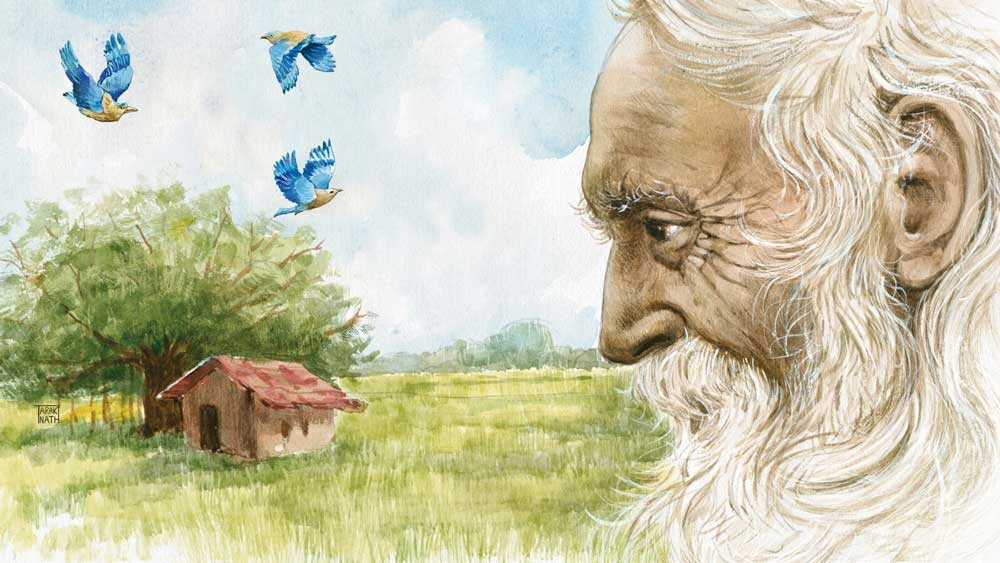

 
 <h1 align=center>পাহুড়</h1>
<h2 align=center>শেখর মুখোপাধ্যায়</h2> নরনারায়ণ দত্তের বিরুদ্ধে মামলা চলছে আজ প্রায় দশ বছর। অভিযোগ, সে তাসকুনাগড় শহরের লাড়ু দত্তকে খুন করে তার বাড়ি দখল করেছিল। প্রথম দিকে অভিযুক্ত প্রতিটি প্রশ্নেরই জবাব দিয়েছে এবং একাধিক বার। কখনও বয়ান বদলায়নি। বাদী পক্ষের উকিল প্রতি বারই প্রমাণ করেছেন প্রতিটি জবাবই মিথ্যে। যেমন, তার বয়স জানতে চাইলে সে বারংবার বলেছে, সে যখন জন্মেছিল তখন ব্রিটিশ সাম্রাজ্যের মালকিন মহারানি ভিক্টোরিয়া। এ দেশের বড়লাট আর্ল এলগিন। বাংলার ছোটলাট স্যার জন উডবার্ন। এখন, মহারানি ভিক্টোরিয়া রাজত্ব করেছেন উনিশশো এক সাল অবধি। আর্ল এলগিন ভারতের বড়লাট ছিলেন আঠেরোশো-নিরানব্বই সালের ছয় জানুয়ারি পর্যন্ত এবং স্যর জন উডবার্ন বাংলার ছোটলাট হন আঠেরোশো আটানব্বই সালের এপ্রিল মাসে। তা হলে দাঁড়ায়, অভিযুক্ত জন্মেছে আঠেরোশো আটানব্বই সালের এপ্রিল থেকে আঠেরোশো নিরানব্বই সালের ছয় জানুয়ারির মধ্যে। সে ক্ষেত্রে, দশ বছর আগে তার বয়স ছিল একশো তেরো। কারও বিশ্বাস হয়নি। আজও হয় না। কারণ, ওর দাবি মানলে এও মানতে হয় যে, এখন ওর বয়স একশো তেইশ। একশো তেইশ বছর কে বাঁচে! লোকটা বয়স পঁয়ত্রিশ-চল্লিশ বছর বাড়িয়ে বলছে। কারণ খুব সহজ। খুনের অভিযোগ উঠেছিল দশ বছর আগে। ওর বয়স যদি তখন একশো তেরো হয়, লোকে বলবে একটা একশো তেরো বছরের বুড়ো কি খুন করতে পারে! মানুষের সহানুভূতি আদায়ের ফন্দি। ওর বয়স এখন খুব সম্ভব আশি কি পঁচাশি। যখন অপরাধ করেছিল বয়স ছিল সত্তর কি পঁচাত্তর। হ্যাঁ, এক জন সত্তর-পঁচাত্তরের স্বাস্থ্যবান বৃদ্ধ খুনটুন করতেও পারে।

আজকাল লোকটা কারও প্রশ্নের জবাব দেয় না। দশ বছরে বিচারক, তদন্তকারী অফিসার, জেলার সাহেব, বাদী ও বিবাদী পক্ষের উকিল সবই বদলে গিয়েছে। তখনকার এক কৌতূহলী উকিল অরিন্দমের মনে আছে, লোকটা এক দিন একটা প্রশ্ন করে কথা বলা বন্ধ করেছিল। বলেছিল, “বলতে পারেন, শহরের নাম কেন তাসকুনাগড়?”

কেউ বলতে পারেনি। বিচারক বলেছিলেন, “আপনি বলুন।”

লোকটা জবাব দিয়েছিল, “আপনারা তো বিশ্বাস করবেন না।” তার পর থেকেই লোকটা মুখেকুলুপ এঁটেছে।

অরিন্দম উকিল গল্পটা তার মেয়েকে এক দিন বলেছিল। মেয়ের বয়স বাইশ। ধরে বসল লোকটাকে দেখবে। অরিন্দম অনুমতি জোগাড় করে তাকে নিয়ে জেলে গেল। লোকটার সঙ্গে কথা বলার অনেক চেষ্টা করল। লোকটা পাত্তা দিল না। মেয়ে তখন মাটিতে পা ঠুকে বলল, “দাদু! তুমি এমন জেদি কেন?”

নরনারায়ণ ঘুরে তাকাল। কিছু ক্ষণ ঘোলাটে চোখে তাকিয়ে থেকে কাঁপা কাঁপা গলায় বলল, “তোমার নাম মিমি?”

“হ্যাঁ, ডাকনাম। ভাল নাম মীমাংসা।”

“মীমাংসা!” নরনারায়ণ গরাদ ধরে টলমলিয়ে উঠে দাঁড়ায়। বলে, “কী চাও?”

“সত্যিটা জানতে চাই।”

নরনারায়ণ হাসে, “তোমার বিশ্বাস হবে না।”

“না,” মিমি গরাদের কাছে গিয়ে বলে, “হবে। প্রমাণ চাই শুধু।”

“আমার কাছে প্রমাণ নেই।”

“কিছুই নেই!” মিমি কাতর স্বরে বলে, “কোনও কিছু একটা?”

নরনারায়ণ অপলক দেখে মিমিকে। বলে, “এক জন ছিল। এক ওঝা। আমি যখন পনেরো-ষোলো বছরের, তখনই তার বয়স লোকে বলত, তিনশো-সাড়ে তিনশোর বেশি। বাড়িয়েই বলত মনে হয়। এখন বেঁচে আছে কি না সন্দেহ। বাঁচলে তার বয়স হয় পাঁচশোর কাছাকাছি।”

“কেন!” মিমি বলে, “তুমি বলো তোমার বয়স একশো তেইশ। লোকে বিশ্বাস করে না। তাদের দোষ দেবে কী করে, যদি তুমি নিজেই সেই লোকটার বয়স পাঁচশো মানতে না চাও?”

নরনারায়ণকে অপ্রস্তুত বিহ্বল দেখায়। দীর্ঘ স্তব্ধতার পর বলে, “পাগলা গুনিন। থাকত পাহুড়ডাঙা মাঠের প্রাচীন পাকুড় গাছের নীচে কুঁড়েঘরে। ঘরে ছিল তেল-সিঁদুর মাখা কালো পাথর। গ্রামের লোকেবলত জাগ্রত ঠাকুর। আমার কোষ্ঠী তৈরি করেছিল গুনিন। ভুল। লিখেছিল আমি স্বল্পায়ু। কিন্তু ও আমাকে চেনে।”

পাহুড়ডাঙা জায়গাটা তাসকুনাগড় শহরের বাইরে। মিমি বলে, “আমি পাহুড়ডাঙা যাব। পাগলা গুনিন যদি বেঁচে থাকে ওকে সঙ্গে নিয়েই ফিরব। কিন্তু, আমাদের এই শহরের নাম তাসকুনাগড় কেন?”

“যদি গুনিনকে আনতে পারো, ওর সামনেই বলব।”

মিমি পাহুড়ডাঙা যায়। জায়গাটা এক কালে ছিল বিপুল প্রান্তর। মোরগ-লড়াইয়ের জন্য বিখ্যাত। বছর দশ আগে তাসকুনাগড়ের ভদ্রলোকেরা মোরগ-লড়াইয়ের নিষ্ঠুর নৃশংসতার বিরুদ্ধে আন্দোলন করেন। লড়াই বন্ধ হয়ে যায়। কয়েক বছর পরে সেই বিস্তৃত প্রান্তরে গড়ে ওঠে সারি সারি বহুতল আবাসন। ভদ্রলোকের আবাসন হলেই যা হয়, তার সামনে বসল বাজার। বাজারে অন্যান্য দোকান-পসারের পাশাপাশি কয়েক ডজন লটারির ঠেক। গ্রামের মানুষজন যারা আবাসনের ফ্ল্যাটবাড়িতে বাসন মাজতে, ঘর মুছতে আসে তারা, রিকশাওয়ালারা, বাজারের মুটেরা গোছা গোছা টিকিট কেনে। এরা আগে পাহুড়ডাঙায় মোরগ লড়াতে এবং লড়াই দেখতে আসত। বাজিও ধরত কেউ কেউ। মোরগ লড়াই হত আশ্বিন থেকে চৈত্র এই সাত মাস, সপ্তাহে এক দিন করে। লটারির খেলা হয় বছরে তিনশো পঁয়ষট্টি দিন। বুড়ো পাকুড় গাছটাও কাটা পড়েছে। মাঠের তিন ভাগের এক ভাগ ওই গাছটাই তার ঝুরি আর বীজ থেকে গজানো ছানাপোনা নিয়ে অধিকার করে রেখেছিল। তবে মানুষের ধর্মীয় আবেগের ব্যাপার। গাছের নীচে পাগলা গুনিনের মাটি আর খড়ের কুটিরের জায়গায় তৈরি হয়েছে পাকা মন্দির-সহ আশ্রম। আবাসনের প্রোমোটারই তৈরি করিয়ে দিয়েছে। গাছটা যতটা জায়গা জুড়ে ছিল তার দশ ভাগের এক ভাগ জায়গা লেগেছে আশ্রম তৈরি করতে। সেখানে আজও থাকে গুনিন আর তার তেল-সিঁদুর মাখানো কালো পাথর। যারা লটারির টিকিট কেনে, তারা বলল গুনিনের বয়স কম করে পাঁচশো বছর। আবাসনের ভদ্রলোকেরা বললেন, ও সব বাজে কথা, ওঝাদের বুজরুকি। এক জন গুনিন মরে গেলে গোপনে তার দেহ লোপাট করে আর একটা বুড়োকে ওখানে বসায়। ওরা দেখতে সবাই একই রকম। মাথায় জটা, আবক্ষ দাড়ি, আপাদমস্তক ছাইভস্মে ঢাকা। লোকে বুঝতে পারে না গুনিন বদলে গিয়েছে।

মিমি গুনিনের আশ্রমে গেল। ভিতরে কিছু গাছপালা। একটা পুকুরও আছে। গুনিন মাছেদের মুড়ি খাওয়াচ্ছিল। মিমি গুনিনকে প্রণাম করল। গুনিন হাত তুলে আশীর্বাদ করল তাকে। বলল, “তুমি তো ঠাকুরদেবতা মানো না?”

 “মানি না। আপনাকেও বুজরুকই মনে করি। কিন্তু, আপনি বয়সে গুরুজন। তাই।”

গুনিন হাসে, “ঠিকই। ঈশ্বর আছেন কি না আমিও জানি না। কিন্তু, এটুকু জানি যে, তিনি ওই কালো পাথরে ঢুকে বসে নেই। কিন্তু কী জানো, করে খাওয়ার আর কোনও উপায় জানি না, বুজরুকি ছাড়া। এই বয়সে…” গুনিন থমকে বলে, “আমার বয়স পাঁচশো, তুমি বিশ্বাস করো?”

“করি,” মিমি বলে, “তাই আমি আপনার কাছে এসেছি।” সে নরনারায়ণ দত্তের পুরো বিষয়টা গুনিনকে জানায়।

গুনিন সব শুনে বলে, “মনে পড়েছে। ওকে চিনি। বাচ্চা ছেলে।”

মিমি হাসে, বলে, “একশো তেইশ বছর বয়স!”

“তাতে কী! আমি যে পাঁচশো।”

গুনিন মিমির সঙ্গে তাসকুনাগড় এসে পৌঁছয়।

বহু বছর পরে নরনারায়ণ আবার কথা বলে। অনেক কথা। ঠাকুরদা নাম রেখেছিলেন নরনারায়ণ। ছোট করে নাড়ু। স্থানীয় জিভে দাঁড়িয়ে গেল লাড়ু। এ দিকে গ্রামের মানুষ যেমন এখনও নবান্নকে বলে ‘লবান’, নবীন চট্টোপাধ্যায়কে ‘লবীন চাটুজ্জ্যা’। তাসকুনাগড় জায়গাটা প্রাচীন কালে ছিল জঙ্গলে ঘেরা। জঙ্গলে থাকত এক ঝাঁক নীলকণ্ঠ পাখি। স্থানীয় ভাষা আজ লোকে ভুলে গেছে। ‘তাসকুনা’ হল নীলকণ্ঠ পাখি। জঙ্গলে রাজার একটা কেল্লা ছিল। তাই জায়গাটার নাম তাসকুনাগড়। তার পর জঙ্গল পাতলা হল। গড় ভেঙে ধুলোয় মিশল। নীলকণ্ঠ পাখিগুলোও হারিয়ে গেল। শুধু নাম রয়ে গেল তাসকুনাগড়, যার অর্থ আজ কেউ বোঝে না। লাড়ু যখন খুব ছোট, তখনও কিছু জঙ্গল ছিল। সেখানে ছিল চিতাবাঘ। রাতে মানুষ যেমন সাপের নাম করে না, বলে ‘লতা’, তেমনই রাতে চিতাবাঘের নামও মুখে আনত না, বলত ‘ঝিঙেফুলি’। সন্ধের মুখে ঝিঙেফুল ফোটে। আধো অন্ধকারে হলুদ ফুল গায়ে ঝিঙের ঝোপ দেখায় চিতাবাঘের মতো। তার পর এক দিন রেললাইন পাতা হল। জঙ্গল সব সাফ। তাসকুনাগড় শহর হয়ে গেল। লাড়ুর পৈতৃক বাড়িটা ছিল বড়ই। লাড়ুরা দুই ভাই। লাড়ুর ভাগে পড়েছিল বাড়ির অর্ধেকটা। লাড়ু বিয়ে করেনি। তাই তার অংশ আর ভাগাভাগি হয়নি। লাড়ুর দাদার ছিল বড় সংসার। দাদা মারা যেতে ওর অংশের বাড়ি ভাইপোদের মধ্যে ভাগাভাগি হয়ে দেখা গেল জায়গা অকুলান। পরিবার নিয়ে সকলের বাস করা দুষ্কর।

লাড়ু বলল, “তোরা আমার আপনজন, আমার অংশে কয়েক জন চলে আয়।” সেই বন্দোবস্তই হল।

কিছু দিন পরে ভাইপোরা বলল, “খুড়ো, বিয়ে তো করোনি, করবেও না, তোমার অংশটা আমাদের নামে লিখে দাও।”

লাড়ু হেসে বলল, “আমি মরে গেলে সবই তো তোরা পাবি, লেখাপড়ার কী দরকার!”

অনেক বছর পরে ভাইপোদের ছেলেরা বলল, “দাদু, তোমার বয়স হয়েছে, কবে একটা ভালমন্দ হয়ে যায়, তোমার অংশটা আমাদের নামে করে দাও।”

লাড়ু হয়তো তা দিতও। কিন্তু, সে খবর পেল নাতিরা গোটা বাড়িটা প্রোমোটারকে বিক্রি করবে। প্রোমোটার সেখানে বহুতল বাড়ি তুলবে। কয়েকটা ফ্ল্যাট দেবে নাতিদের। লাড়ুকে ওদের কারও কাছে থাকতে হবে। লাড়ু বেঁকে বসল। বলল, “অনাচার করিস আমি মরার পর, তার আগে নয়।” নাতিরা খেঁকিয়ে উঠল, “মরার বয়স তো পেরিয়ে গেল, মরছ কই!”

সে দশ বছর আগের কথা। লাড়ুর বয়স তখন একশো তেরো। এক দিন পুলিশ এল। লাড়ুকে বন্দি করল জেলে। লাড়ু দত্তকে খুন করে, লাড়ু দত্ত সেজে, লাড়ুর সম্পত্তি হাতিয়ে নেওয়ার অভিযোগে। মামলায় নরনারায়ণ কিছুতেই প্রমাণ করতে পারল না যে, সে-ই লাড়ু দত্ত। কারণ, কাগজ অন্য কথা বলছে। উনিশশো তিরানব্বই সালে ভোটার কার্ড চালু হয়। তখন লাড়ুর বয়স পঁচানব্বই। ভোটকর্মীরা তার ছবি তুলল। ভোটার কার্ড পেয়ে লাড়ু দেখল ছবি এসেছে ভূতের মতো। কার্ডে নাম ছাপা আছে লাড়ু দত্ত। জন্মসাল লেখা আছে উনিশশো সাতচল্লিশ। কেন? লাড়ু বলেছিল সে মহারানি ভিক্টোরিয়া, বড়লাট এলগিন এবং ছোটলাট উডবার্নের আমলে জন্মেছে। ভোটকর্মীদের অত গবেষণার সময় নেই, তারা সাব্যস্ত করল সেকালের বুড়োমানুষ, যা হোক কিছু একটা লিখে দেওয়া ভাল। যা হোক কিছুই যদি লিখতে হয়, দেশ যে বছর পরাধীনতার শৃঙ্খল ভেঙে ফেলল তার চেয়ে মহান আর কী আছে! তার পর লাড়ু জেলবন্দি হওয়ার বছর দেড়েক আগে আধার কার্ডের লোকেরা এল। তার ছবি তুলল। ভোটার কার্ড দেখল। আধার কার্ড হাতে পেয়ে লাড়ু দেখল তার ছবিটা মোটের উপর খারাপ আসেনি। নাম লেখা আছে ওই লাড়ু দত্ত এবং জন্মসাল উনিশশো-সাতচল্লিশ। সে থাক, লাড়ু মাথা ঘামায়নি। যে নরনারায়ণ, সে-ই লাড়ু। লোকে তাকে লাড়ু দত্ত বলেই চেনে। আর তার ভোটার কার্ড, আধার কার্ড সব নাতিদের কাছেই থাকে। ওরা ওই দেখিয়ে রেশন-টেশন তোলে। ও সব কার্ডের কথা লাড়ুর মনেই ছিল না। আদালতে উকিলবাবুরা তার নাম জিজ্ঞেস করতে সে গীতা হাতে বুক চিতিয়ে বলেছিল, “নরনারায়ণ দত্ত।”

“হুম!” উকিলবাবুরা দুটো কার্ড দেখিয়ে মাথা দুলিয়েছিলেন, “তা হলে তুমি লাড়ু দত্ত নও। বয়স বলছ, একশো তেরো, সে সত্যি না হলেও, বয়স তোমার সত্তর কি পঁচাত্তর। অথচ, ভোটার কার্ড এবং আধার কার্ড অনুযায়ী, লাড়ুর বয়স হয় চৌষট্টি।”

লাড়ুর নাতিরাও গীতা ছুঁয়ে বলে গেল লাড়ু নিখোঁজ হয়ে গেছে। তার পরই এই লোকটা ঘরদোর জবরদখল করেছে। ও-ই নিশ্চয় তাদের দাদুকে খুন করে গুম করে দিয়েছে। নরনারায়ণ দীর্ঘশ্বাস ফেলে।

মিমির অনুরোধে অরিন্দম নরনারায়ণের উকিল দাঁড়ায়। সাক্ষী ডাকে পাগলা গুনিনকে। জোর সওয়াল করে। বিচারক শুনানির শেষে রায় দেন, নরনারায়ণই যে লাড়ু, তা আজও প্রমাণ হল না। পাগলা গুনিন এক বুজরুক। ওর সাক্ষ্যের মূল্য নেই। তা ছাড়া, সবই মুখের কথা। কাগজ অন্য কথা বলছে। সম্ভবত, নরনারায়ণ দত্ত লাড়ু দত্তকে খুন করে গুমই করেছে। কিন্তু, তা-ও নিঃসন্দেহে প্রমাণিত নয়। কারণ, লাড়ু দত্তের মৃতদেহ পুলিশ আজও হাজির করতে পারেনি। এ দিকে নরনারায়ণ দশ বছর জেল খেটে ফেলেছে। ওর বয়সও হয়েছে। একশো তেইশ না হলেও, আশি-পঁচাশি তো হবেই। তাই, প্রমাণের অভাবে এবং মানবিকতার কারণে নরনারায়ণকে খালাস দেওয়া হল।

অভিযুক্ত রায় শুনে চিৎকার করে বলে, “আমি জেল থেকে বেরোব না। মাথায় খুনের অভিযোগ, কাকে মুখ দেখাব! বাড়িটাও আর নেই। নাতিরা মাল্টিস্টোরি বিল্ডিং বানিয়েছে। আমি কোথায় যাব!”

পাগলা গুনিন বলে, “আমার কাছে। আয়।”

নরনারায়ণ কাঠগড়া থেকে নামে। মিমি জিজ্ঞেস করে, “পাহুড়ডাঙার ডাঙা বুঝি। পাহুড় কী?”

নরনারায়ণ থমকায়। তার পর জবাব দেয়, “লড়াইয়ে মরা মোরগ।”

আর দাঁড়ায় না। গুনিনের হাত ধরে বেরিয়ে যায় আদালত থেকে।